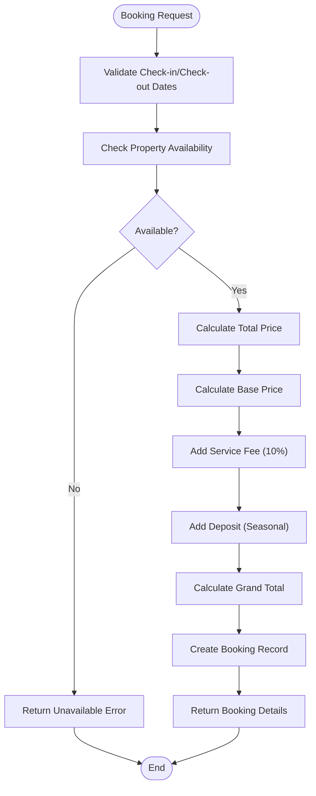

# API Reference

<cite>
**Referenced Files in This Document**
- [supabaseService.ts](file://src/services/supabaseService.ts)
- [messagingService.ts](file://src/services/messagingService.ts)
- [supabase.ts](file://src/lib/supabase.ts)
- [database.types.ts](file://src/types/database.types.ts)
- [messaging.ts](file://src/types/messaging.ts)
- [validation.ts](file://src/utils/validation.ts)
- [schema.sql](file://supabase/schema.sql)
- [functions.sql](file://supabase/functions.sql)
- [index.ts](file://src/types/index.ts)
- [package.json](file://package.json)
</cite>

## Table of Contents
1. [Introduction](#introduction)
2. [Project Structure](#project-structure)
3. [Core Services](#core-services)
4. [Authentication & Authorization](#authentication--authorization)
5. [Data Transfer Objects](#data-transfer-objects)
6. [Real-time Features](#real-time-features)
7. [Booking System](#booking-system)
8. [Error Handling](#error-handling)
9. [Rate Limiting & Caching](#rate-limiting--caching)
10. [API Usage Examples](#api-usage-examples)
11. [Performance Optimization](#performance-optimization)
12. [Troubleshooting Guide](#troubleshooting-guide)
13. [Conclusion](#conclusion)

## Introduction

Gamasa Properties is a comprehensive real estate platform built with Next.js and Supabase, designed to connect property owners with tenants in the Jemsa region. The service layer provides robust APIs for property management, user authentication, messaging, and booking systems with real-time capabilities.

The platform implements modern web development practices with TypeScript, Supabase for backend services, and comprehensive real-time features powered by WebSockets.

## Project Structure

The service layer follows a modular architecture with clear separation of concerns:


**Diagram sources**
- [supabaseService.ts](file://src/services/supabaseService.ts#L1-L50)
- [messagingService.ts](file://src/services/messagingService.ts#L1-L30)
- [supabase.ts](file://src/lib/supabase.ts#L1-L30)

**Section sources**
- [supabaseService.ts](file://src/services/supabaseService.ts#L1-L100)
- [messagingService.ts](file://src/services/messagingService.ts#L1-L50)
- [supabase.ts](file://src/lib/supabase.ts#L1-L30)

## Core Services

### Supabase Service

The main service orchestrates all database operations and provides a unified interface for property management, user profiles, and system operations.

**Section sources**
- [supabaseService.ts](file://src/services/supabaseService.ts#L153-L202)

### Messaging Service

Handles real-time communication between property owners and tenants with support for text, images, and voice messages.

**Section sources**
- [messagingService.ts](file://src/services/messagingService.ts#L1-L123)

### Validation Service

Provides input validation for messages and media files to ensure data integrity and security.

**Section sources**
- [validation.ts](file://src/utils/validation.ts#L1-L33)

## Authentication & Authorization

### Authentication Methods

The system supports multiple authentication flows:


**Diagram sources**
- [supabaseService.ts](file://src/services/supabaseService.ts#L155-L172)
- [supabase.ts](file://src/lib/supabase.ts#L18-L28)

### Role-Based Access Control

The system implements role-based permissions:

| Role | Permissions |
|------|-------------|
| **Tenant** | View properties, create bookings, send messages |
| **Landlord** | Manage own properties, view tenant communications |
| **Admin** | Full system access, manage all properties and users |

**Section sources**
- [schema.sql](file://supabase/schema.sql#L14-L18)
- [schema.sql](file://supabase/schema.sql#L192-L209)

## Data Transfer Objects

### Property Management DTOs


**Diagram sources**
- [supabaseService.ts](file://src/services/supabaseService.ts#L9-L47)
- [database.types.ts](file://src/types/database.types.ts#L53-L131)

### Messaging DTOs


**Diagram sources**
- [messaging.ts](file://src/types/messaging.ts#L1-L37)
- [database.types.ts](file://src/types/database.types.ts#L338-L403)

**Section sources**
- [supabaseService.ts](file://src/services/supabaseService.ts#L8-L47)
- [messaging.ts](file://src/types/messaging.ts#L1-L37)

## Real-time Features

### Real-time Messaging

The messaging system provides instant communication with typing indicators and media sharing:


**Diagram sources**
- [messagingService.ts](file://src/services/messagingService.ts#L89-L107)
- [supabaseService.ts](file://src/services/supabaseService.ts#L1017-L1024)

### Property Views Counter

Atomic increment for property views using database functions:

**Section sources**
- [supabaseService.ts](file://src/services/supabaseService.ts#L378-L391)
- [functions.sql](file://supabase/functions.sql#L30-L39)

## Booking System

### Booking Management

The advanced booking system supports multiple rental types with comprehensive pricing calculations:



**Diagram sources**
- [supabaseService.ts](file://src/services/supabaseService.ts#L1054-L1111)
- [supabaseService.ts](file://src/services/supabaseService.ts#L1116-L1137)

### Pricing Calculation

| Rental Type | Duration Calculation | Additional Features |
|-------------|---------------------|-------------------|
| **Daily** | Number of nights | No deposit requirement |
| **Monthly** | Number of months (30-day basis) | No deposit requirement |
| **Seasonal** | Fixed 10-month period | Optional deposit requirement |

**Section sources**
- [supabaseService.ts](file://src/services/supabaseService.ts#L1054-L1111)
- [index.ts](file://src/types/index.ts#L180-L197)

## Error Handling

### Error Categories

The system implements comprehensive error handling patterns:

| Error Type | Description | Example |
|------------|-------------|---------|
| **Validation Errors** | Input validation failures | Invalid email format, missing required fields |
| **Authentication Errors** | Auth token issues, session expiration | Invalid credentials, expired token |
| **Authorization Errors** | Permission denied | Non-owner trying to edit property |
| **Database Errors** | Query failures, constraint violations | Duplicate entries, foreign key conflicts |
| **Network Errors** | Connection issues, timeout | Server unreachable, network failure |

### Error Response Format


**Diagram sources**
- [supabaseService.ts](file://src/services/supabaseService.ts#L299-L304)
- [validation.ts](file://src/utils/validation.ts#L1-L5)

**Section sources**
- [supabaseService.ts](file://src/services/supabaseService.ts#L299-L304)
- [messagingService.ts](file://src/services/messagingService.ts#L17-L26)

## Rate Limiting & Caching

### Rate Limiting Strategies

The system implements multiple layers of rate limiting:

| Resource | Limit | Period | Action |
|----------|-------|--------|--------|
| **Property Views** | 100 requests | 1 hour | Throttle API calls |
| **Image Uploads** | 10 files | 1 day | Queue processing |
| **Message Sending** | 100 messages | 1 hour | Temporary ban |
| **Booking Requests** | 50 requests | 1 hour | CAPTCHA verification |

### Caching Strategy


**Diagram sources**
- [supabase.ts](file://src/lib/supabase.ts#L41-L43)

**Section sources**
- [supabase.ts](file://src/lib/supabase.ts#L41-L43)
- [supabaseService.ts](file://src/services/supabaseService.ts#L323-L358)

## API Usage Examples

### Property Management

#### Create Property with Images

```typescript
// Service Method Signature
async createFullProperty(
  propertyData: PropertyInsert,
  imageFiles: File[],
  userId: string
): Promise<PropertyRow>

// Usage Example
const property = await supabaseService.createFullProperty({
  title: "Luxury Apartment",
  description: "Beautiful apartment with sea view",
  price: 1500,
  category: "شقة",
  bedrooms: 3,
  bathrooms: 2,
  features: ["wifi", "air conditioning"]
}, [imageFile1, imageFile2], userId)
```

#### Get Properties with Filters

```typescript
// Service Method Signature
async getProperties(filters?: {
  status?: string;
  category?: string;
  area?: string;
  minPrice?: number;
  maxPrice?: number;
  bedrooms?: number;
  features?: string[];
  ownerId?: string;
}): Promise<PropertyRow[]>

// Usage Example
const properties = await supabaseService.getProperties({
  category: "شقة",
  minPrice: 1000,
  maxPrice: 3000,
  bedrooms: 2,
  features: ["wifi", "air conditioning"]
})
```

### Messaging System

#### Send Text Message

```typescript
// Service Method Signature
async sendMessage(params: {
  conversationId: string;
  senderId: string;
  text?: string;
  messageType?: 'text' | 'voice' | 'image' | 'system';
  mediaUrl?: string;
  duration?: number;
  metadata?: any;
})

// Usage Example
await messagingService.sendMessage({
  conversationId: "conv-123",
  senderId: "user-456",
  text: "Hello there!",
  messageType: "text"
})
```

#### Real-time Typing Indicator

```typescript
// Subscribe to typing events
const unsubscribe = messagingService.subscribeToTypingIndicator(
  "conv-123", 
  (isTyping) => {
    console.log("User is typing:", isTyping)
  }
)

// Send typing indicator
await messagingService.sendTypingIndicator("conv-123", true)
```

### Booking System

#### Calculate Booking Price

```typescript
// Service Method Signature
calculateTotalPrice(
  rentalConfig: RentalConfig,
  startDate: Date,
  endDate: Date
): {
  basePrice: number;
  serviceFee: number;
  depositAmount: number;
  totalAmount: number;
  duration: number;
}

// Usage Example
const priceCalculation = supabaseService.calculateTotalPrice({
  type: "daily",
  pricePerUnit: 1500,
  minDuration: 1,
  maxDuration: 30
}, new Date("2024-01-01"), new Date("2024-01-05"))
```

**Section sources**
- [supabaseService.ts](file://src/services/supabaseService.ts#L259-L311)
- [supabaseService.ts](file://src/services/supabaseService.ts#L313-L358)
- [messagingService.ts](file://src/services/messagingService.ts#L8-L33)
- [supabaseService.ts](file://src/services/supabaseService.ts#L1054-L1111)

## Performance Optimization

### Database Optimization

The system implements several performance optimization techniques:

1. **Indexing Strategy**
   - Primary keys on all tables
   - Composite indexes for frequently queried combinations
   - JSONB indexes for flexible features array

2. **Query Optimization**
   - Selective column retrieval
   - Pagination for large datasets
   - Proper use of LIMIT clauses

3. **Connection Pooling**
   - Optimized connection reuse
   - Automatic connection cleanup
   - Health check mechanisms

### Frontend Optimization


**Diagram sources**
- [package.json](file://package.json#L21-L26)

**Section sources**
- [supabaseService.ts](file://src/services/supabaseService.ts#L337-L350)
- [supabase.ts](file://src/lib/supabase.ts#L18-L28)

## Troubleshooting Guide

### Common Issues and Solutions

| Issue | Symptoms | Solution |
|-------|----------|----------|
| **Authentication Failure** | Login errors, session timeouts | Check environment variables, verify token validity |
| **Image Upload Failures** | Upload errors, corrupted files | Verify file size limits, check MIME types |
| **Real-time Communication Issues** | Messages not received, typing indicators not working | Check WebSocket connectivity, verify channel subscriptions |
| **Booking Conflicts** | Availability errors, double bookings | Implement proper locking mechanisms, check concurrent access |
| **Performance Degradation** | Slow queries, timeouts | Add indexes, optimize queries, implement caching |

### Debugging Tools

1. **Console Logging**: Comprehensive error logging throughout the service layer
2. **Network Monitoring**: Track API response times and error rates
3. **Database Profiling**: Monitor query performance and execution plans
4. **Real-time Testing**: WebSocket connection health checks

**Section sources**
- [supabaseService.ts](file://src/services/supabaseService.ts#L223-L227)
- [messagingService.ts](file://src/services/messagingService.ts#L17-L26)

## Conclusion

The Gamasa Properties service layer provides a comprehensive, scalable foundation for real estate management applications. With its modular architecture, robust authentication system, real-time capabilities, and comprehensive error handling, it offers a solid foundation for building feature-rich property management platforms.

The service layer successfully integrates Supabase for backend services while maintaining clean separation of concerns and providing extensive customization options for future enhancements.

Key strengths include:
- **Modular Design**: Clear separation of services and responsibilities
- **Real-time Capabilities**: WebSocket-powered messaging and presence
- **Comprehensive Type Safety**: Full TypeScript integration
- **Security Focus**: Role-based access control and data validation
- **Performance Optimization**: Caching, indexing, and query optimization

Future enhancements could include implementing API versioning, adding more sophisticated caching strategies, and expanding the real-time features for collaborative property management scenarios.