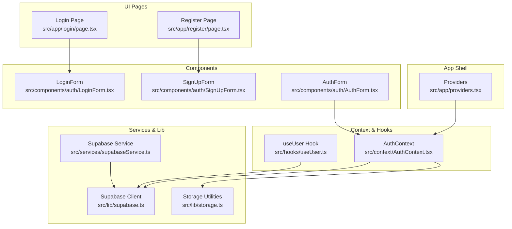
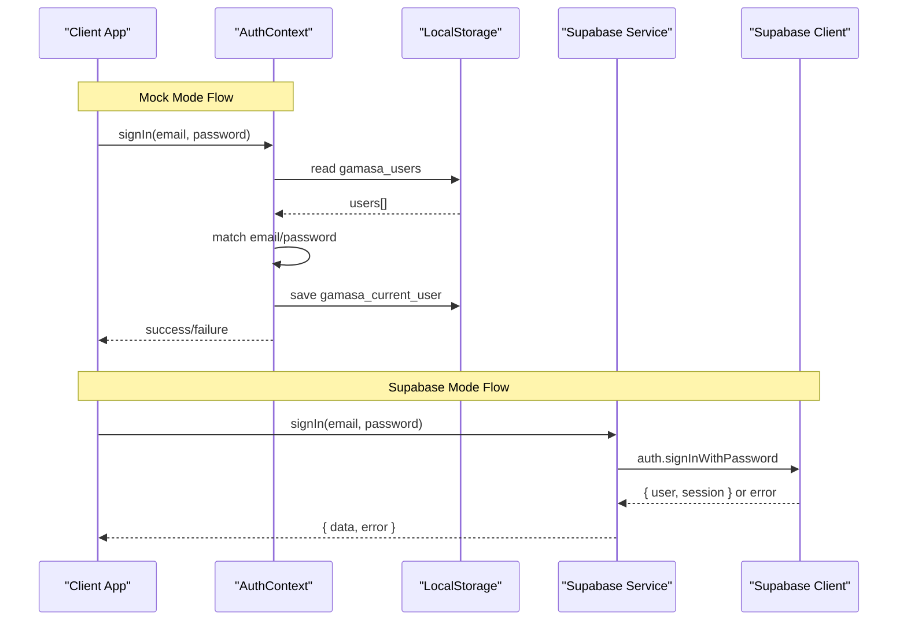
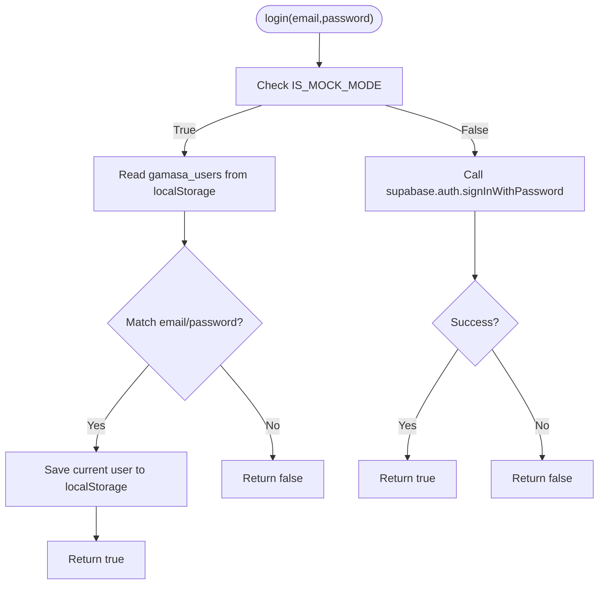
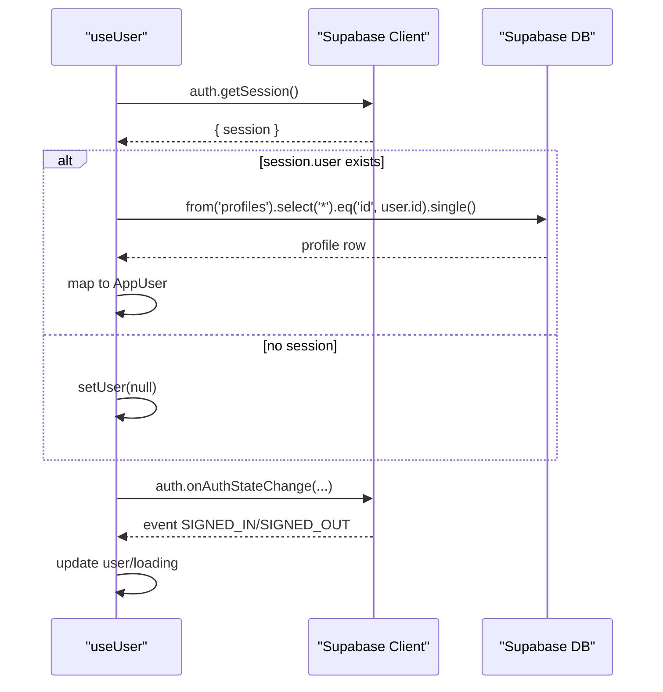
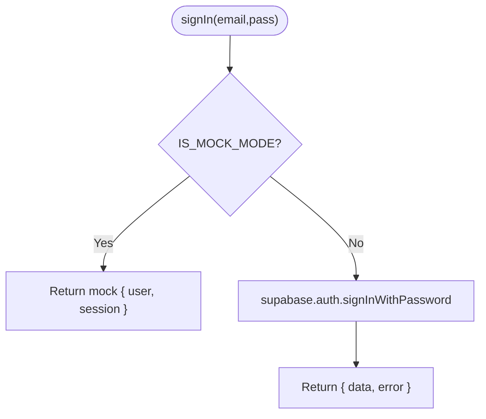
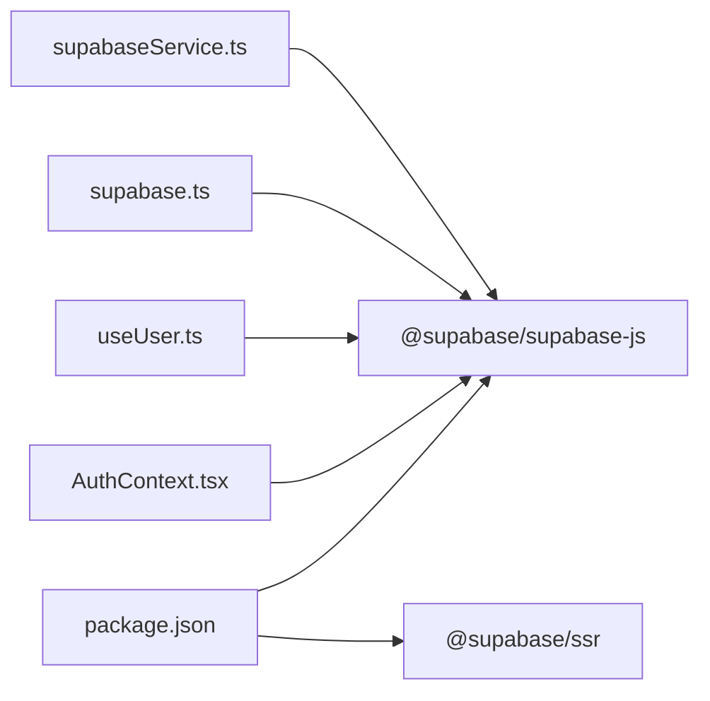

# Authentication APIs

<cite>
**Referenced Files in This Document**
- [AuthContext.tsx](file://src/context/AuthContext.tsx)
- [useUser.ts](file://src/hooks/useUser.ts)
- [supabase.ts](file://src/lib/supabase.ts)
- [supabaseService.ts](file://src/services/supabaseService.ts)
- [storage.ts](file://src/lib/storage.ts)
- [database.types.ts](file://src/types/database.types.ts)
- [providers.tsx](file://src/app/providers.tsx)
- [LoginForm.tsx](file://src/components/auth/LoginForm.tsx)
- [SignUpForm.tsx](file://src/components/auth/SignUpForm.tsx)
- [AuthForm.tsx](file://src/components/auth/AuthForm.tsx)
- [login/page.tsx](file://src/app/login/page.tsx)
- [register/page.tsx](file://src/app/register/page.tsx)
- [package.json](file://package.json)
</cite>

## Table of Contents
1. [Introduction](#introduction)
2. [Project Structure](#project-structure)
3. [Core Components](#core-components)
4. [Architecture Overview](#architecture-overview)
5. [Detailed Component Analysis](#detailed-component-analysis)
6. [Dependency Analysis](#dependency-analysis)
7. [Performance Considerations](#performance-considerations)
8. [Troubleshooting Guide](#troubleshooting-guide)
9. [Conclusion](#conclusion)
10. [Appendices](#appendices)

## Introduction
This document provides comprehensive API documentation for the Gamasa Properties authentication system. It covers authentication methods (signIn, signUp, signOut), profile management, mock mode implementation, Supabase integration patterns, authentication flow, token/session handling, user roles (landlord, tenant, admin), and session synchronization. It also includes method signatures, parameter specifications, return value formats, error handling patterns, client-side integration examples, and security considerations.

## Project Structure
The authentication system spans several layers:
- UI pages for login and registration
- Client-side authentication context and hooks
- Supabase client initialization and service utilities
- Local storage-based mock authentication and user persistence
- Provider setup wrapping the app with authentication context

**Diagram sources**
- [providers.tsx](file://src/app/providers.tsx#L7-L16)
- [login/page.tsx](file://src/app/login/page.tsx#L8-L29)
- [register/page.tsx](file://src/app/register/page.tsx#L8-L48)
- [LoginForm.tsx](file://src/components/auth/LoginForm.tsx#L7-L46)
- [SignUpForm.tsx](file://src/components/auth/SignUpForm.tsx#L7-L49)
- [AuthForm.tsx](file://src/components/auth/AuthForm.tsx#L8-L53)
- [AuthContext.tsx](file://src/context/AuthContext.tsx#L22-L186)
- [useUser.ts](file://src/hooks/useUser.ts#L37-L176)
- [supabase.ts](file://src/lib/supabase.ts#L1-L68)
- [storage.ts](file://src/lib/storage.ts#L294-L300)
- [supabaseService.ts](file://src/services/supabaseService.ts#L153-L202)

**Section sources**
- [providers.tsx](file://src/app/providers.tsx#L7-L16)
- [login/page.tsx](file://src/app/login/page.tsx#L8-L29)
- [register/page.tsx](file://src/app/register/page.tsx#L8-L48)
- [LoginForm.tsx](file://src/components/auth/LoginForm.tsx#L7-L46)
- [SignUpForm.tsx](file://src/components/auth/SignUpForm.tsx#L7-L49)
- [AuthForm.tsx](file://src/components/auth/AuthForm.tsx#L8-L53)
- [AuthContext.tsx](file://src/context/AuthContext.tsx#L22-L186)
- [useUser.ts](file://src/hooks/useUser.ts#L37-L176)
- [supabase.ts](file://src/lib/supabase.ts#L1-L68)
- [storage.ts](file://src/lib/storage.ts#L294-L300)
- [supabaseService.ts](file://src/services/supabaseService.ts#L153-L202)

## Core Components
- AuthContext: Provides authentication state, login, register, and logout. Supports mock mode flag and integrates with localStorage and Supabase.
- useUser: Manages Supabase-based user sessions, profile retrieval, and auth state change subscriptions.
- Supabase Client: Initializes Supabase with auto-refresh and persisted sessions.
- Storage Utilities: Encapsulates localStorage operations and emits events for cross-tab synchronization.
- Supabase Service: Centralized service offering mock-capable methods for authentication and profile operations.

Key responsibilities:
- Authentication methods: signIn, signUp, signOut
- Profile management: getProfile, update user profile
- Session handling: auth state listeners, session persistence
- Mock mode: unified mock implementation across service and context

**Section sources**
- [AuthContext.tsx](file://src/context/AuthContext.tsx#L11-L186)
- [useUser.ts](file://src/hooks/useUser.ts#L37-L176)
- [supabase.ts](file://src/lib/supabase.ts#L1-L68)
- [storage.ts](file://src/lib/storage.ts#L294-L300)
- [supabaseService.ts](file://src/services/supabaseService.ts#L153-L202)

## Architecture Overview
The authentication architecture supports two modes:
- Mock Mode: Uses localStorage for users and current user, with mock responses for auth operations.
- Supabase Mode: Uses Supabase client for authentication and profile retrieval, with real-time auth state subscriptions.

**Diagram sources**
- [AuthContext.tsx](file://src/context/AuthContext.tsx#L80-L115)
- [storage.ts](file://src/lib/storage.ts#L294-L300)
- [supabaseService.ts](file://src/services/supabaseService.ts#L155-L172)
- [supabase.ts](file://src/lib/supabase.ts#L18-L28)

## Detailed Component Analysis

### AuthContext API
AuthContext exposes:
- Methods
  - login(email: string, password: string): Promise<boolean>
  - register(userData: any): Promise<boolean>
  - logout(): void
- State
  - user: User | null
  - loading: boolean
  - isAuthenticated: boolean

Behavior highlights:
- Mock Mode: Reads/writes users and current user from localStorage; returns boolean success/failure.
- Supabase Mode: Delegates to Supabase client; returns true/false depending on implementation.
- Cross-tab sync: Listens to storage events and userUpdated to keep UI in sync.

**Diagram sources**
- [AuthContext.tsx](file://src/context/AuthContext.tsx#L80-L115)
- [storage.ts](file://src/lib/storage.ts#L294-L300)
- [supabase.ts](file://src/lib/supabase.ts#L98-L108)

**Section sources**
- [AuthContext.tsx](file://src/context/AuthContext.tsx#L11-L186)
- [storage.ts](file://src/lib/storage.ts#L294-L300)

### useUser API
useUser manages Supabase-based user sessions:
- Methods
  - loadUser(): Promise<void>
  - refreshUser(): Promise<void>
- State
  - user: AppUser | null
  - loading: boolean

Behavior highlights:
- Fetches current session via supabase.auth.getSession().
- Subscribes to auth state changes (SIGNED_IN/SIGNED_OUT) and updates user/profile accordingly.
- Retrieves profile from Supabase profiles table and maps to AppUser.

**Diagram sources**
- [useUser.ts](file://src/hooks/useUser.ts#L110-L136)
- [useUser.ts](file://src/hooks/useUser.ts#L145-L162)
- [database.types.ts](file://src/types/database.types.ts#L15-L52)

**Section sources**
- [useUser.ts](file://src/hooks/useUser.ts#L37-L176)
- [database.types.ts](file://src/types/database.types.ts#L15-L52)

### Supabase Service API
The centralized service offers mock-capable authentication and profile operations:
- signIn(email: string, pass: string): Promise<{ data: any; error: any }>
- signUp(email: string, pass: string, data?: { full_name?: string; phone?: string; role?: string }): Promise<{ data: any; error: any }>
- signOut(): Promise<{ error: any }>
- getProfile(userId: string): Promise<UserProfile | null>

Behavior highlights:
- Mock Mode: Returns mock user/session objects with access/refresh tokens.
- Supabase Mode: Delegates to supabase.auth methods.

**Diagram sources**
- [supabaseService.ts](file://src/services/supabaseService.ts#L155-L172)

**Section sources**
- [supabaseService.ts](file://src/services/supabaseService.ts#L153-L202)

### UI Integration Examples
- LoginForm: Demonstrates form submission, error handling, and navigation after successful login.
- SignUpForm: Handles role selection, terms agreement, and redirects on success.
- AuthForm: Shared form logic for switching between login and registration.

Integration notes:
- Use useAuth hook to access login/register/logout.
- On success, navigate to desired route (e.g., home).
- Display localized error messages for invalid credentials or validation failures.

**Section sources**
- [LoginForm.tsx](file://src/components/auth/LoginForm.tsx#L20-L46)
- [SignUpForm.tsx](file://src/components/auth/SignUpForm.tsx#L16-L49)
- [AuthForm.tsx](file://src/components/auth/AuthForm.tsx#L16-L53)

### Token Management and Session Handling
- Supabase Client Initialization:
  - autoRefreshToken: true
  - persistSession: true
  - detectSessionInUrl: true
- Auth State Subscription:
  - useUser listens to onAuthStateChange and updates user state accordingly.
- Cross-tab Synchronization:
  - Storage utilities emit events to synchronize user state across tabs.

Security considerations:
- Ensure environment variables for Supabase URL and anon key are configured.
- Avoid logging sensitive tokens; use Supabase’s built-in token management.

**Section sources**
- [supabase.ts](file://src/lib/supabase.ts#L18-L28)
- [useUser.ts](file://src/hooks/useUser.ts#L145-L162)
- [storage.ts](file://src/lib/storage.ts#L28-L40)

### User Roles and Profile Management
- Roles:
  - Landlord: 'landlord'
  - Tenant: 'tenant'
  - Admin: 'admin'
- Profile Fields:
  - full_name, avatar_url, phone, national_id, role, is_verified, is_admin, created_at, updated_at

Profile retrieval and mapping:
- getProfile(userId: string): Returns UserProfile or null.
- Mapped to AppUser with additional fields for compatibility.

**Section sources**
- [database.types.ts](file://src/types/database.types.ts#L15-L52)
- [useUser.ts](file://src/hooks/useUser.ts#L57-L107)

## Dependency Analysis
External dependencies relevant to authentication:
- @supabase/supabase-js: Supabase client library
- @supabase/ssr: Server-side rendering support for Supabase

**Diagram sources**
- [package.json](file://package.json#L11-L26)
- [AuthContext.tsx](file://src/context/AuthContext.tsx#L5-L6)
- [useUser.ts](file://src/hooks/useUser.ts#L4-L5)
- [supabase.ts](file://src/lib/supabase.ts#L1-L1)
- [supabaseService.ts](file://src/services/supabaseService.ts#L2-L3)

**Section sources**
- [package.json](file://package.json#L11-L26)
- [AuthContext.tsx](file://src/context/AuthContext.tsx#L5-L6)
- [useUser.ts](file://src/hooks/useUser.ts#L4-L5)
- [supabase.ts](file://src/lib/supabase.ts#L1-L1)
- [supabaseService.ts](file://src/services/supabaseService.ts#L2-L3)

## Performance Considerations
- Prefer Supabase mode for production to leverage built-in caching and token refresh.
- Minimize localStorage reads/writes; batch updates where possible.
- Use useUser’s memoized callbacks to avoid unnecessary re-renders.
- Keep mock mode only for development/testing to reduce overhead.

## Troubleshooting Guide
Common issues and resolutions:
- Missing Supabase environment variables:
  - Symptom: Warning logs and placeholder client creation.
  - Resolution: Add NEXT_PUBLIC_SUPABASE_URL and NEXT_PUBLIC_SUPABASE_ANON_KEY to environment.
- Authentication errors:
  - Symptom: Invalid login credentials or unexpected errors.
  - Resolution: Validate credentials and network connectivity; check Supabase dashboard logs.
- Cross-tab desync:
  - Symptom: User state not updating across tabs.
  - Resolution: Ensure storage events are emitted and listeners are registered.

**Section sources**
- [supabase.ts](file://src/lib/supabase.ts#L7-L15)
- [AuthContext.tsx](file://src/context/AuthContext.tsx#L44-L53)
- [storage.ts](file://src/lib/storage.ts#L32-L39)

## Conclusion
Gamasa Properties implements a flexible authentication system supporting both mock and Supabase modes. AuthContext and useUser provide cohesive client-side state management, while the Supabase Service centralizes authentication operations. Proper environment configuration, session handling, and cross-tab synchronization ensure a robust user experience.

## Appendices

### API Reference Summary

- AuthContext.login(email: string, password: string): Promise<boolean>
  - Parameters: email, password
  - Returns: boolean indicating success
  - Behavior: Mock mode checks localStorage; Supabase mode calls Supabase client

- AuthContext.register(userData: any): Promise<boolean>
  - Parameters: userData with name, email, phone, password
  - Returns: boolean indicating success
  - Behavior: Mock mode creates user and saves to localStorage

- AuthContext.logout(): void
  - Behavior: Clears current user and calls Supabase signOut if not in mock mode

- useUser.loadUser(): Promise<void>
  - Behavior: Loads current session and profile; handles auth state changes

- useUser.refreshUser(): Promise<void>
  - Behavior: Re-fetches current user and profile

- supabaseService.signIn(email: string, pass: string): Promise<{ data: any; error: any }>
  - Behavior: Mock mode returns mock user/session; otherwise calls Supabase

- supabaseService.signUp(email: string, pass: string, data?: { full_name?: string; phone?: string; role?: string }): Promise<{ data: any; error: any }>
  - Behavior: Mock mode returns mock user/session; otherwise calls Supabase

- supabaseService.signOut(): Promise<{ error: any }>
  - Behavior: Mock mode returns success; otherwise calls Supabase

- supabaseService.getProfile(userId: string): Promise<UserProfile | null>
  - Behavior: Mock mode returns mock profile; otherwise queries Supabase profiles table

**Section sources**
- [AuthContext.tsx](file://src/context/AuthContext.tsx#L80-L170)
- [useUser.ts](file://src/hooks/useUser.ts#L110-L175)
- [supabaseService.ts](file://src/services/supabaseService.ts#L155-L202)