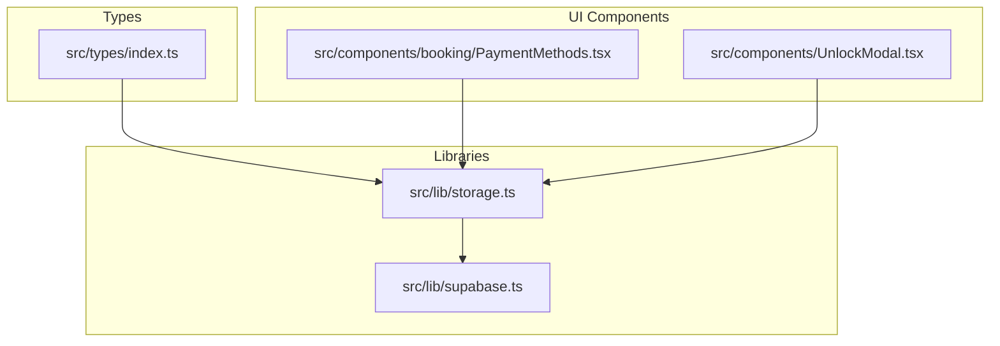
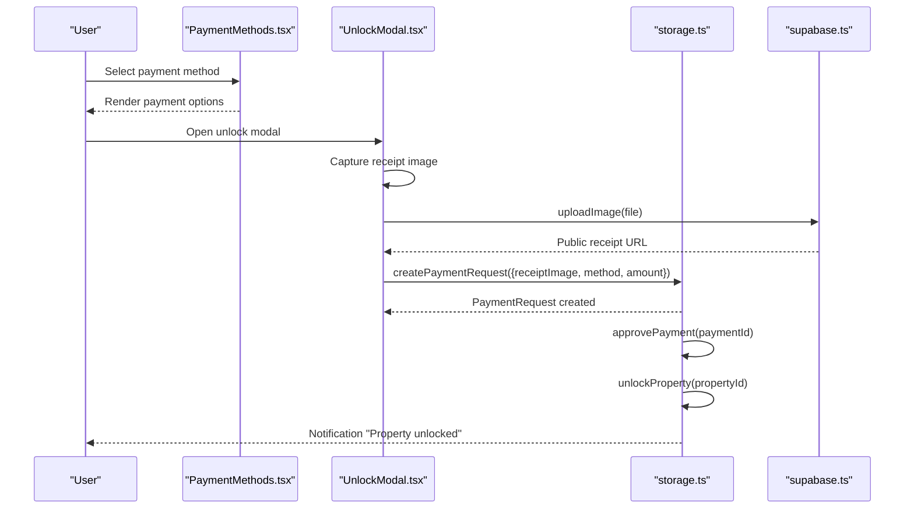
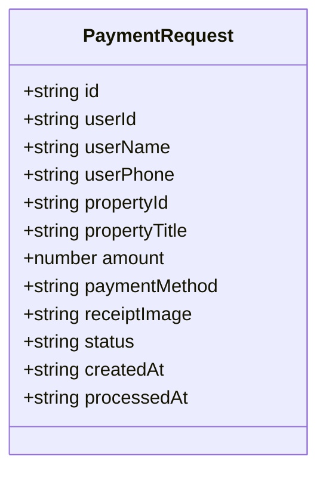
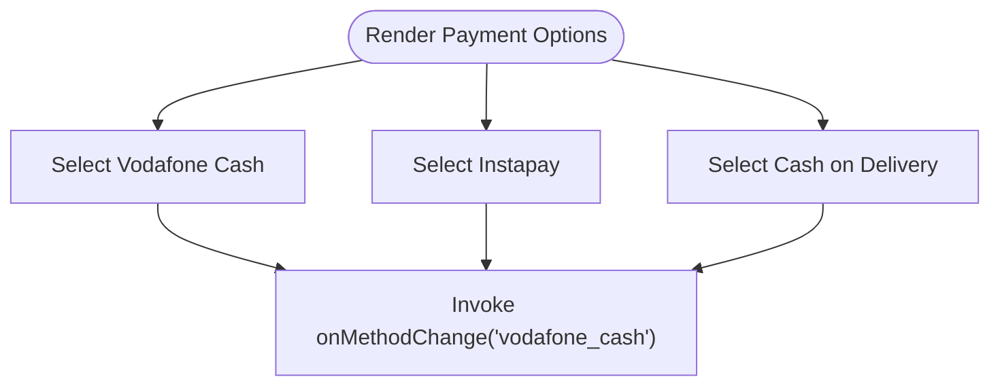
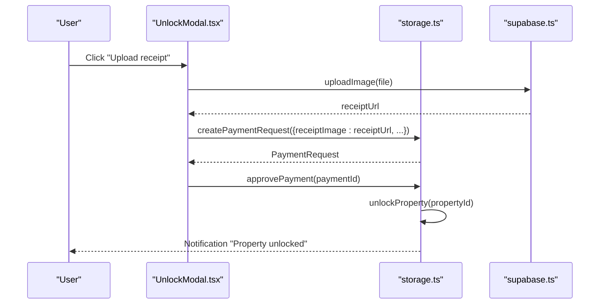
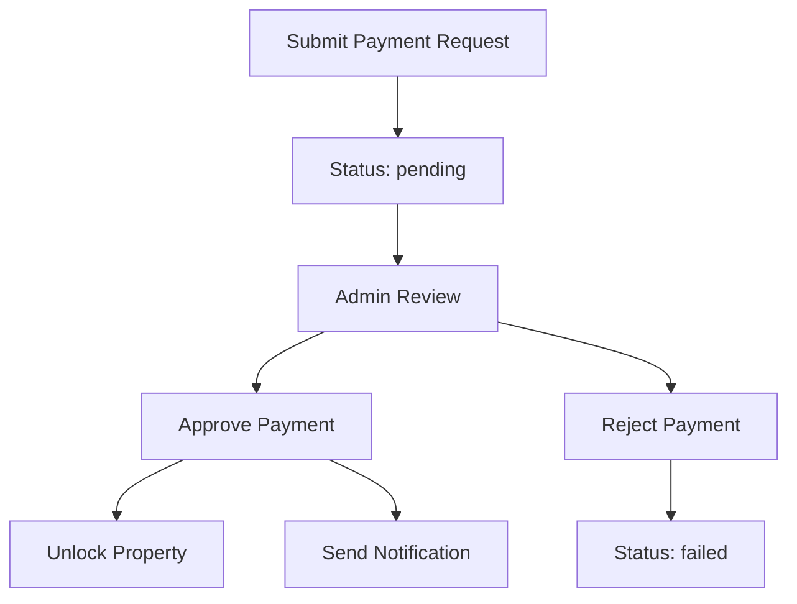
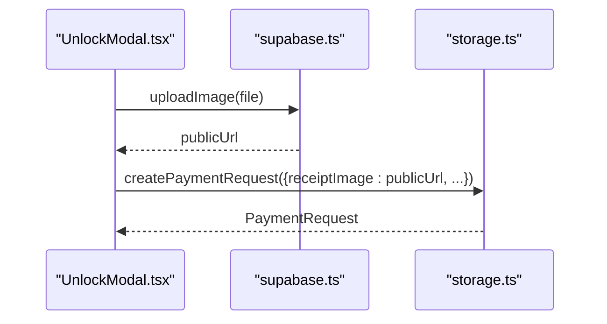
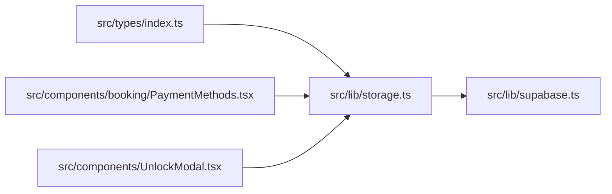

# Booking and Payment APIs

<cite>
**Referenced Files in This Document**
- [index.ts](file://src/types/index.ts)
- [PaymentMethods.tsx](file://src/components/booking/PaymentMethods.tsx)
- [UnlockModal.tsx](file://src/components/UnlockModal.tsx)
- [storage.ts](file://src/lib/storage.ts)
- [supabase.ts](file://src/lib/supabase.ts)
</cite>

## Table of Contents
1. [Introduction](#introduction)
2. [Project Structure](#project-structure)
3. [Core Components](#core-components)
4. [Architecture Overview](#architecture-overview)
5. [Detailed Component Analysis](#detailed-component-analysis)
6. [Dependency Analysis](#dependency-analysis)
7. [Performance Considerations](#performance-considerations)
8. [Troubleshooting Guide](#troubleshooting-guide)
9. [Conclusion](#conclusion)

## Introduction
This document provides comprehensive API documentation for the booking and payment processing system. It focuses on payment request creation with Vodafone Cash, Instapay, and Fawry integration, property unlocking mechanisms, payment verification workflows, and booking status management. It also explains payment request data models, receipt image handling, payment method specifications, method signatures for createPaymentRequest, property unlocking operations, and payment status tracking. Examples of payment API integration, error handling for failed payments, and security considerations for financial transactions are included.

## Project Structure
The booking and payment system spans TypeScript type definitions, UI components for payment selection and property unlocking, and a centralized storage library that manages local and remote persistence. Supabase integration is used for secure image uploads and optional remote data persistence.

**Diagram sources**
- [index.ts](file://src/types/index.ts#L72-L86)
- [PaymentMethods.tsx](file://src/components/booking/PaymentMethods.tsx#L1-L150)
- [UnlockModal.tsx](file://src/components/UnlockModal.tsx#L1-L147)
- [storage.ts](file://src/lib/storage.ts#L1-L633)
- [supabase.ts](file://src/lib/supabase.ts#L1-L68)

**Section sources**
- [index.ts](file://src/types/index.ts#L1-L237)
- [PaymentMethods.tsx](file://src/components/booking/PaymentMethods.tsx#L1-L150)
- [UnlockModal.tsx](file://src/components/UnlockModal.tsx#L1-L147)
- [storage.ts](file://src/lib/storage.ts#L1-L633)
- [supabase.ts](file://src/lib/supabase.ts#L1-L68)

## Core Components
- PaymentRequest model defines the payment request structure, including payment method, amount, receipt image URL, and status.
- PaymentMethods component renders selectable payment options for Vodafone Cash, Instapay, and cash on delivery.
- UnlockModal handles receipt image upload, simulates payment verification, and unlocks the property for the user.
- Storage library centralizes createPaymentRequest, approvePayment, unlockProperty, and notification management.
- Supabase library provides secure image upload and deletion utilities.

Key method signatures and responsibilities:
- createPaymentRequest(request): Creates a new payment request with pending status and timestamps.
- approvePayment(paymentId): Approves a payment request, sets processed timestamp, and unlocks the associated property.
- unlockProperty(propertyId): Adds the property to the current user's unlocked list and emits a success notification.
- uploadImage(file): Uploads a receipt image to Supabase storage and returns a public URL.

**Section sources**
- [index.ts](file://src/types/index.ts#L72-L86)
- [PaymentMethods.tsx](file://src/components/booking/PaymentMethods.tsx#L1-L150)
- [UnlockModal.tsx](file://src/components/UnlockModal.tsx#L1-L147)
- [storage.ts](file://src/lib/storage.ts#L389-L411)
- [supabase.ts](file://src/lib/supabase.ts#L34-L54)

## Architecture Overview
The payment and booking flow integrates UI components, type-safe models, and storage utilities. Receipt images are uploaded via Supabase, and payment requests are persisted locally with optional remote synchronization. Upon approval, the system unlocks the property for the user and notifies them.

**Diagram sources**
- [PaymentMethods.tsx](file://src/components/booking/PaymentMethods.tsx#L1-L150)
- [UnlockModal.tsx](file://src/components/UnlockModal.tsx#L1-L147)
- [storage.ts](file://src/lib/storage.ts#L389-L411)
- [supabase.ts](file://src/lib/supabase.ts#L34-L54)

## Detailed Component Analysis

### Payment Request Data Model
The PaymentRequest model encapsulates payment metadata and lifecycle fields:
- Identifier and timestamps for creation and processing
- User and property identifiers with descriptive fields
- Payment method enumeration supporting Vodafone Cash, Instapay, and Fawry
- Receipt image URL for proof of payment
- Status field indicating pending, approved, or rejected states

**Diagram sources**
- [index.ts](file://src/types/index.ts#L72-L86)

**Section sources**
- [index.ts](file://src/types/index.ts#L72-L86)

### Payment Methods Component
The PaymentMethods component presents three payment options:
- Vodafone Cash: Mobile wallet payment
- Instapay: Instant bank transfer
- Cash on delivery: Physical payment upon property pickup

Selection triggers a callback to update the parent form state.

**Diagram sources**
- [PaymentMethods.tsx](file://src/components/booking/PaymentMethods.tsx#L12-L32)

**Section sources**
- [PaymentMethods.tsx](file://src/components/booking/PaymentMethods.tsx#L1-L150)

### Property Unlocking Workflow
The UnlockModal orchestrates receipt upload and property unlocking:
- Step 1: Display payment instructions and wallet details
- Step 2: Upload receipt image to Supabase and submit payment request
- Step 3: On success, show confirmation and refresh UI

**Diagram sources**
- [UnlockModal.tsx](file://src/components/UnlockModal.tsx#L19-L77)
- [storage.ts](file://src/lib/storage.ts#L389-L411)
- [supabase.ts](file://src/lib/supabase.ts#L34-L54)

**Section sources**
- [UnlockModal.tsx](file://src/components/UnlockModal.tsx#L1-L147)
- [storage.ts](file://src/lib/storage.ts#L389-L411)
- [supabase.ts](file://src/lib/supabase.ts#L34-L54)

### Payment Verification and Booking Status Management
Payment verification is simulated by approving a payment request, which:
- Updates the payment status to approved
- Records the processed timestamp
- Unlocks the property for the user
- Emits a success notification

Booking status management is handled separately in the Booking model, which includes payment status and confirmation timestamps.

**Diagram sources**
- [storage.ts](file://src/lib/storage.ts#L402-L411)
- [index.ts](file://src/types/index.ts#L200-L236)

**Section sources**
- [storage.ts](file://src/lib/storage.ts#L402-L411)
- [index.ts](file://src/types/index.ts#L200-L236)

### Receipt Image Handling
Receipt images are uploaded to Supabase storage with a randomized filename and returned as a public URL. The URL is attached to the payment request for verification.

**Diagram sources**
- [UnlockModal.tsx](file://src/components/UnlockModal.tsx#L23-L27)
- [supabase.ts](file://src/lib/supabase.ts#L34-L54)
- [storage.ts](file://src/lib/storage.ts#L389-L400)

**Section sources**
- [UnlockModal.tsx](file://src/components/UnlockModal.tsx#L19-L27)
- [supabase.ts](file://src/lib/supabase.ts#L34-L54)
- [storage.ts](file://src/lib/storage.ts#L389-L400)

### Payment Method Specifications
Supported payment methods:
- vodafone_cash: Mobile wallet payment
- instapay: Instant bank transfer
- fawry: Egyptian bill payment provider

These are represented in the PaymentRequest model and the Booking model for payment method tracking.

**Section sources**
- [index.ts](file://src/types/index.ts#L80-L80)
- [index.ts](file://src/types/index.ts#L224-L224)

## Dependency Analysis
The system exhibits clear separation of concerns:
- Types define the canonical data models
- UI components depend on storage utilities for state transitions
- Storage utilities depend on Supabase for image operations
- No circular dependencies were identified in the analyzed files

**Diagram sources**
- [index.ts](file://src/types/index.ts#L72-L86)
- [PaymentMethods.tsx](file://src/components/booking/PaymentMethods.tsx#L1-L150)
- [UnlockModal.tsx](file://src/components/UnlockModal.tsx#L1-L147)
- [storage.ts](file://src/lib/storage.ts#L1-L633)
- [supabase.ts](file://src/lib/supabase.ts#L1-L68)

**Section sources**
- [index.ts](file://src/types/index.ts#L72-L86)
- [storage.ts](file://src/lib/storage.ts#L1-L633)
- [supabase.ts](file://src/lib/supabase.ts#L1-L68)

## Performance Considerations
- Local storage mode reduces network latency for development but does not reflect production behavior.
- Image uploads to Supabase are asynchronous; ensure UI feedback during upload.
- Approval operations are local; consider implementing server-side reconciliation for production deployments.

## Troubleshooting Guide
Common issues and resolutions:
- Missing Supabase environment variables: The client logs warnings and falls back to placeholder values. Ensure NEXT_PUBLIC_SUPABASE_URL and NEXT_PUBLIC_SUPABASE_ANON_KEY are configured.
- Upload failures: Verify file type and size limits; check console errors for upload exceptions.
- Payment approval not unlocking property: Confirm paymentId exists and approvePayment was invoked; verify user context and unlockedProperties array updates.

**Section sources**
- [supabase.ts](file://src/lib/supabase.ts#L7-L15)
- [UnlockModal.tsx](file://src/components/UnlockModal.tsx#L71-L76)
- [storage.ts](file://src/lib/storage.ts#L402-L411)

## Conclusion
The booking and payment system provides a clear pathway for users to pay via Vodafone Cash, Instapay, or Fawry, upload receipts, and unlock property contact details. The type-safe models, UI components, and storage utilities collectively support a robust workflow. For production readiness, integrate server-side payment verification, real-time status updates, and enhanced error handling.