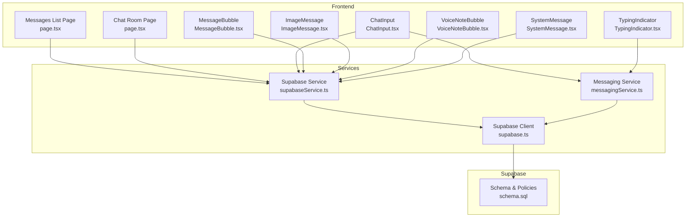
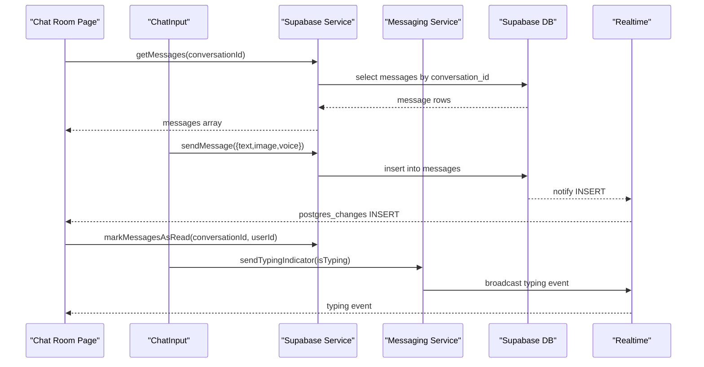
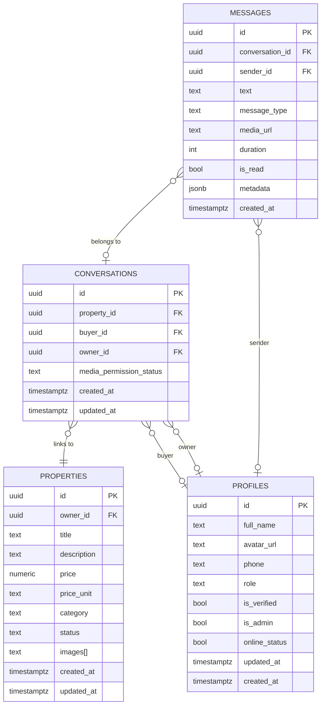
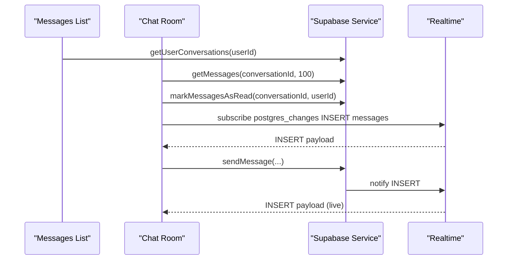
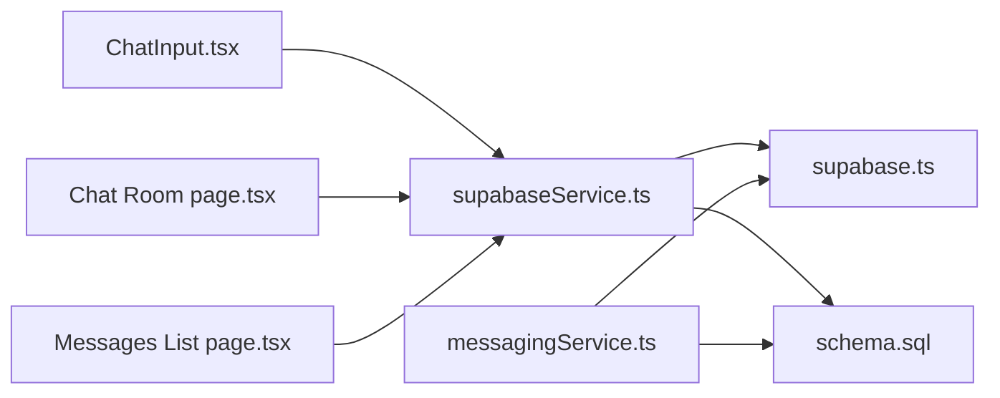

# Messaging and Conversation APIs

<cite>
**Referenced Files in This Document**
- [messagingService.ts](file://src/services/messagingService.ts)
- [supabaseService.ts](file://src/services/supabaseService.ts)
- [supabase.ts](file://src/lib/supabase.ts)
- [messaging.ts](file://src/types/messaging.ts)
- [schema.sql](file://supabase/schema.sql)
- [page.tsx (Messages List)](file://src/app/messages/page.tsx)
- [page.tsx (Chat Room)](file://src/app/messages/[id]/page.tsx)
- [ChatInput.tsx](file://src/components/chat/ChatInput.tsx)
- [MessageBubble.tsx](file://src/components/chat/MessageBubble.tsx)
- [ImageMessage.tsx](file://src/components/chat/ImageMessage.tsx)
- [VoiceNoteBubble.tsx](file://src/components/chat/VoiceNoteBubble.tsx)
- [SystemMessage.tsx](file://src/components/chat/SystemMessage.tsx)
- [TypingIndicator.tsx](file://src/components/chat/TypingIndicator.tsx)
- [validation.ts](file://src/utils/validation.ts)
</cite>

## Table of Contents
1. [Introduction](#introduction)
2. [Project Structure](#project-structure)
3. [Core Components](#core-components)
4. [Architecture Overview](#architecture-overview)
5. [Detailed Component Analysis](#detailed-component-analysis)
6. [Dependency Analysis](#dependency-analysis)
7. [Performance Considerations](#performance-considerations)
8. [Troubleshooting Guide](#troubleshooting-guide)
9. [Conclusion](#conclusion)
10. [Appendices](#appendices)

## Introduction
This document describes the real-time messaging and conversation management system. It covers:
- Conversation lifecycle: creation, retrieval, and metadata
- Message operations: sending text, images, and voice notes
- Real-time features: live message updates, typing indicators, and presence
- Supabase integration: database schema, row-level security, and real-time publication
- Frontend integration: chat UI components and event handling

## Project Structure
The messaging system spans three layers:
- Backend/Supabase: database schema, policies, and real-time publication
- Services: TypeScript services for messaging and Supabase operations
- Frontend: Next.js pages and chat components for UI and UX

**Diagram sources**
- [page.tsx (Messages List)](file://src/app/messages/page.tsx#L1-L197)
- [page.tsx (Chat Room)](file://src/app/messages/[id]/page.tsx#L1-L280)
- [ChatInput.tsx](file://src/components/chat/ChatInput.tsx#L1-L297)
- [MessageBubble.tsx](file://src/components/chat/MessageBubble.tsx#L1-L53)
- [ImageMessage.tsx](file://src/components/chat/ImageMessage.tsx#L1-L38)
- [VoiceNoteBubble.tsx](file://src/components/chat/VoiceNoteBubble.tsx#L1-L101)
- [SystemMessage.tsx](file://src/components/chat/SystemMessage.tsx#L1-L43)
- [TypingIndicator.tsx](file://src/components/chat/TypingIndicator.tsx#L1-L12)
- [messagingService.ts](file://src/services/messagingService.ts#L1-L123)
- [supabaseService.ts](file://src/services/supabaseService.ts#L1-L1384)
- [supabase.ts](file://src/lib/supabase.ts#L1-L68)
- [schema.sql](file://supabase/schema.sql#L337-L416)

**Section sources**
- [page.tsx (Messages List)](file://src/app/messages/page.tsx#L1-L197)
- [page.tsx (Chat Room)](file://src/app/messages/[id]/page.tsx#L1-L280)
- [ChatInput.tsx](file://src/components/chat/ChatInput.tsx#L1-L297)
- [messagingService.ts](file://src/services/messagingService.ts#L1-L123)
- [supabaseService.ts](file://src/services/supabaseService.ts#L1-L1384)
- [supabase.ts](file://src/lib/supabase.ts#L1-L68)
- [schema.sql](file://supabase/schema.sql#L337-L416)

## Core Components
- Messaging Service: Handles media uploads, media permission requests, and typing indicators via Supabase channels.
- Supabase Service: Centralized API for conversations, messages, permissions, and real-time subscriptions.
- Supabase Client: Typed client initialization and storage helpers.
- Types: Strongly-typed conversation, message, and profile models.
- Frontend Pages and Components: Real-time chat UI, input, bubbles, and system messages.

Key responsibilities:
- Create and retrieve conversations
- Send text, image, and voice messages
- Manage media permissions
- Broadcast and receive typing indicators
- Subscribe to real-time message inserts

**Section sources**
- [messagingService.ts](file://src/services/messagingService.ts#L1-L123)
- [supabaseService.ts](file://src/services/supabaseService.ts#L739-L1047)
- [supabase.ts](file://src/lib/supabase.ts#L1-L68)
- [messaging.ts](file://src/types/messaging.ts#L1-L37)

## Architecture Overview
The system integrates Next.js frontend with Supabase for:
- Persistent storage: conversations and messages tables
- Real-time: PostgreSQL changes and broadcast channels
- Security: row-level security policies per user roles

**Diagram sources**
- [page.tsx (Chat Room)](file://src/app/messages/[id]/page.tsx#L49-L83)
- [ChatInput.tsx](file://src/components/chat/ChatInput.tsx#L124-L177)
- [supabaseService.ts](file://src/services/supabaseService.ts#L850-L881)
- [messagingService.ts](file://src/services/messagingService.ts#L89-L121)
- [schema.sql](file://supabase/schema.sql#L406-L416)

## Detailed Component Analysis

### Data Models and Schemas
- Conversations: linked to property and two users (buyer/owner), with permission status and timestamps.
- Messages: linked to a conversation, sender, and optional media; supports text, image, voice, and system types.
- Profiles: user metadata used for avatars, online status, and verification badges.

**Diagram sources**
- [schema.sql](file://supabase/schema.sql#L340-L360)
- [schema.sql](file://supabase/schema.sql#L8-L67)
- [schema.sql](file://supabase/schema.sql#L42-L67)

**Section sources**
- [schema.sql](file://supabase/schema.sql#L340-L360)
- [schema.sql](file://supabase/schema.sql#L8-L67)
- [schema.sql](file://supabase/schema.sql#L42-L67)

### Messaging Service
Responsibilities:
- Upload media to Supabase storage buckets (chat-images, voice-notes)
- Request and manage media permissions per conversation
- Broadcast and subscribe to typing indicators via Supabase channels

Key methods:
- uploadMedia(file, type, conversationId) -> public URL
- requestMediaPermission(conversationId, userId)
- grantMediaPermission(conversationId)
- denyMediaPermission(conversationId)
- sendTypingIndicator(conversationId, isTyping, userId, userName)
- subscribeToTypingIndicator(conversationId, callback)

Behavior:
- Uses Supabase storage upload/getPublicUrl
- Updates conversation media_permission_status
- Sends system messages for permission requests
- Subscribes to typing broadcast events

**Section sources**
- [messagingService.ts](file://src/services/messagingService.ts#L6-L33)
- [messagingService.ts](file://src/services/messagingService.ts#L36-L86)
- [messagingService.ts](file://src/services/messagingService.ts#L89-L121)

### Supabase Service
Responsibilities:
- Conversation lifecycle: createConversation, getUserConversations, getConversationDetails
- Message lifecycle: getMessages, sendMessage, markMessagesAsRead
- Media: uploadVoiceNote, uploadChatImage, uploadMedia
- Permissions: requestMediaPermission, grantMediaPermission, denyMediaPermission
- Real-time: updateOnlineStatus, sendTypingIndicator, subscribeToTypingIndicator

Method signatures (selected):
- createConversation({ propertyId, buyerId, ownerId }): Promise<string>
- getUserConversations(userId): Promise<Conversation[]>
- getMessages(conversationId, limit?, offset?): Promise<Message[]>
- sendMessage(params): Promise<void>
- markMessagesAsRead(conversationId, userId): Promise<void>
- requestMediaPermission(conversationId, userId): Promise<void>
- grantMediaPermission(conversationId): Promise<void>
- denyMediaPermission(conversationId): Promise<void>
- sendTypingIndicator(conversationId, isTyping): Promise<void>
- subscribeToTypingIndicator(conversationId, callback): () => void

Notes:
- Uses Supabase client for queries and RPCs
- Applies RLS policies for secure access
- Enables real-time publication for messages

**Section sources**
- [supabaseService.ts](file://src/services/supabaseService.ts#L739-L769)
- [supabaseService.ts](file://src/services/supabaseService.ts#L771-L810)
- [supabaseService.ts](file://src/services/supabaseService.ts#L812-L848)
- [supabaseService.ts](file://src/services/supabaseService.ts#L850-L881)
- [supabaseService.ts](file://src/services/supabaseService.ts#L883-L892)
- [supabaseService.ts](file://src/services/supabaseService.ts#L935-L971)
- [supabaseService.ts](file://src/services/supabaseService.ts#L1017-L1038)
- [supabaseService.ts](file://src/services/supabaseService.ts#L1040-L1047)
- [schema.sql](file://supabase/schema.sql#L406-L416)

### Frontend Integration and Real-time Handling
- Messages List Page:
  - Loads conversations for the logged-in user
  - Subscribes to postgres_changes INSERT on messages to refresh the list
- Chat Room Page:
  - Fetches conversation details and messages
  - Subscribes to postgres_changes INSERT on messages for live updates
  - Subscribes to typing broadcast events
  - Marks messages as read on entry
  - Renders different message types (text, image, voice, system)
- ChatInput:
  - Text input, quick replies, attachment picker, voice recording
  - Validates input and files
  - Uploads media and sends messages
  - Requests media permission when needed

**Diagram sources**
- [page.tsx (Messages List)](file://src/app/messages/page.tsx#L33-L53)
- [page.tsx (Chat Room)](file://src/app/messages/[id]/page.tsx#L49-L83)
- [supabaseService.ts](file://src/services/supabaseService.ts#L850-L881)
- [schema.sql](file://supabase/schema.sql#L406-L416)

**Section sources**
- [page.tsx (Messages List)](file://src/app/messages/page.tsx#L1-L197)
- [page.tsx (Chat Room)](file://src/app/messages/[id]/page.tsx#L1-L280)
- [ChatInput.tsx](file://src/components/chat/ChatInput.tsx#L1-L297)
- [MessageBubble.tsx](file://src/components/chat/MessageBubble.tsx#L1-L53)
- [ImageMessage.tsx](file://src/components/chat/ImageMessage.tsx#L1-L38)
- [VoiceNoteBubble.tsx](file://src/components/chat/VoiceNoteBubble.tsx#L1-L101)
- [SystemMessage.tsx](file://src/components/chat/SystemMessage.tsx#L1-L43)
- [TypingIndicator.tsx](file://src/components/chat/TypingIndicator.tsx#L1-L12)

### Media Sharing Capabilities
Supported media types:
- Images: validated by MIME type and size; uploaded to chat-images bucket
- Voice notes: recorded blobs, uploaded to voice-notes bucket; includes duration
- System messages: metadata-driven notifications (e.g., media permission requests)

Validation rules:
- Image: JPEG/PNG/WEBP under 5MB
- Voice: audio/* under 10MB

**Section sources**
- [validation.ts](file://src/utils/validation.ts#L7-L27)
- [ChatInput.tsx](file://src/components/chat/ChatInput.tsx#L96-L122)
- [ChatInput.tsx](file://src/components/chat/ChatInput.tsx#L150-L177)
- [messagingService.ts](file://src/services/messagingService.ts#L6-L33)
- [supabaseService.ts](file://src/services/supabaseService.ts#L895-L932)

### Typing Indicators
- Sender emits broadcast typing events to a channel named by conversation
- Receiver subscribes to typing broadcasts and toggles UI indicator
- Channel lifecycle managed by service methods

**Section sources**
- [messagingService.ts](file://src/services/messagingService.ts#L89-L121)
- [supabaseService.ts](file://src/services/supabaseService.ts#L1017-L1038)
- [page.tsx (Chat Room)](file://src/app/messages/[id]/page.tsx#L73-L77)
- [TypingIndicator.tsx](file://src/components/chat/TypingIndicator.tsx#L1-L12)

## Dependency Analysis
- Frontend pages depend on Supabase Service for all data operations
- Messaging Service depends on Supabase client for storage and channels
- Supabase Service depends on Supabase client for database and storage operations
- Real-time relies on Supabase publication for messages and broadcast channels for typing

**Diagram sources**
- [ChatInput.tsx](file://src/components/chat/ChatInput.tsx#L1-L297)
- [page.tsx (Chat Room)](file://src/app/messages/[id]/page.tsx#L1-L280)
- [page.tsx (Messages List)](file://src/app/messages/page.tsx#L1-L197)
- [supabaseService.ts](file://src/services/supabaseService.ts#L1-L1384)
- [messagingService.ts](file://src/services/messagingService.ts#L1-L123)
- [supabase.ts](file://src/lib/supabase.ts#L1-L68)
- [schema.sql](file://supabase/schema.sql#L337-L416)

**Section sources**
- [supabaseService.ts](file://src/services/supabaseService.ts#L1-L1384)
- [messagingService.ts](file://src/services/messagingService.ts#L1-L123)
- [supabase.ts](file://src/lib/supabase.ts#L1-L68)
- [schema.sql](file://supabase/schema.sql#L337-L416)

## Performance Considerations
- Pagination and limits: getMessages uses range-based pagination to avoid large payloads
- Optimistic UI: chat app appends incoming messages immediately while relying on real-time to reconcile
- Efficient subscriptions: subscribe only to relevant conversation channels
- Storage uploads: compress images and keep voice recordings under 10MB to reduce latency

## Troubleshooting Guide
Common issues and resolutions:
- Missing environment variables for Supabase client
  - Symptom: warnings during initialization and placeholder values
  - Resolution: set NEXT_PUBLIC_SUPABASE_URL and NEXT_PUBLIC_SUPABASE_ANON_KEY
- Permission errors on messages/conversations
  - Symptom: 400/422 errors when inserting/updating
  - Resolution: ensure RLS policies match user roles and ownership
- Real-time not updating
  - Symptom: messages not appearing until refresh
  - Resolution: verify publication enabled for messages table and client subscribed to correct channel
- Media upload failures
  - Symptom: “file too large” or “unsupported type”
  - Resolution: enforce validation rules and handle error messages from storage

**Section sources**
- [supabase.ts](file://src/lib/supabase.ts#L7-L15)
- [schema.sql](file://supabase/schema.sql#L406-L416)
- [validation.ts](file://src/utils/validation.ts#L7-L27)
- [messagingService.ts](file://src/services/messagingService.ts#L17-L26)

## Conclusion
The messaging system provides a robust foundation for real-time chat with Supabase:
- Strong data models and RLS ensure secure access
- Real-time subscriptions deliver instant updates
- Clear separation of concerns between services and UI
- Extensible media and permission systems

## Appendices

### API Reference Summary

- Conversation Management
  - createConversation({ propertyId, buyerId, ownerId }): Promise<string>
  - getUserConversations(userId): Promise<Conversation[]>
  - getConversationDetails(conversationId): Promise<Conversation | null>

- Message Operations
  - getMessages(conversationId, limit = 50, offset = 0): Promise<Message[]>
  - sendMessage({ conversationId, senderId, text?, messageType?, mediaUrl?, duration?, metadata? }): Promise<void>
  - markMessagesAsRead(conversationId, userId): Promise<void>

- Media and Permissions
  - uploadMedia(file, type, conversationId): Promise<string>
  - requestMediaPermission(conversationId, userId): Promise<void>
  - grantMediaPermission(conversationId): Promise<void>
  - denyMediaPermission(conversationId): Promise<void>

- Real-time Features
  - sendTypingIndicator(conversationId, isTyping): Promise<void>
  - subscribeToTypingIndicator(conversationId, callback): () => void

**Section sources**
- [supabaseService.ts](file://src/services/supabaseService.ts#L739-L769)
- [supabaseService.ts](file://src/services/supabaseService.ts#L771-L810)
- [supabaseService.ts](file://src/services/supabaseService.ts#L812-L848)
- [supabaseService.ts](file://src/services/supabaseService.ts#L850-L881)
- [supabaseService.ts](file://src/services/supabaseService.ts#L883-L892)
- [supabaseService.ts](file://src/services/supabaseService.ts#L935-L971)
- [supabaseService.ts](file://src/services/supabaseService.ts#L1017-L1047)
- [messagingService.ts](file://src/services/messagingService.ts#L6-L33)
- [messagingService.ts](file://src/services/messagingService.ts#L36-L86)
- [messagingService.ts](file://src/services/messagingService.ts#L89-L121)

### Example Usage Scenarios

- Create a conversation and start chatting
  - Call createConversation with propertyId, buyerId, ownerId
  - Navigate to the chat room for the returned conversationId
  - Use sendMessage to send text, images, or voice messages

- Handle media permissions
  - On the chat input, if permission is not granted, call requestMediaPermission
  - On the chat header, display a system message card to approve/deny
  - After approval, enable attachments and voice recording

- Real-time typing indicator
  - Emit typing events when the user starts/stops typing
  - Subscribe to typing broadcasts to show the indicator in the UI

**Section sources**
- [supabaseService.ts](file://src/services/supabaseService.ts#L739-L769)
- [page.tsx (Chat Room)](file://src/app/messages/[id]/page.tsx#L125-L134)
- [ChatInput.tsx](file://src/components/chat/ChatInput.tsx#L142-L148)
- [SystemMessage.tsx](file://src/components/chat/SystemMessage.tsx#L13-L22)
- [messagingService.ts](file://src/services/messagingService.ts#L89-L121)