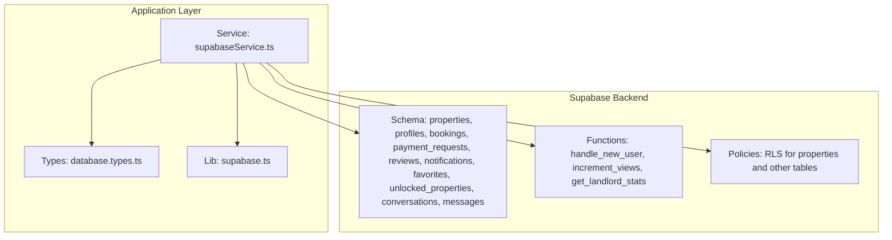
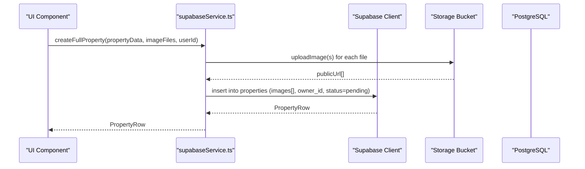
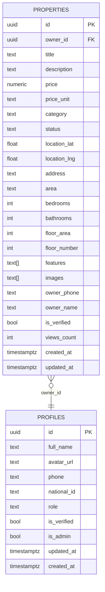
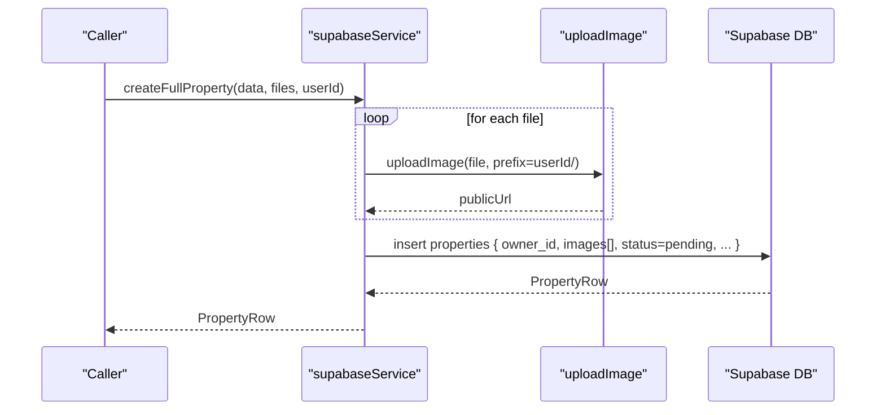
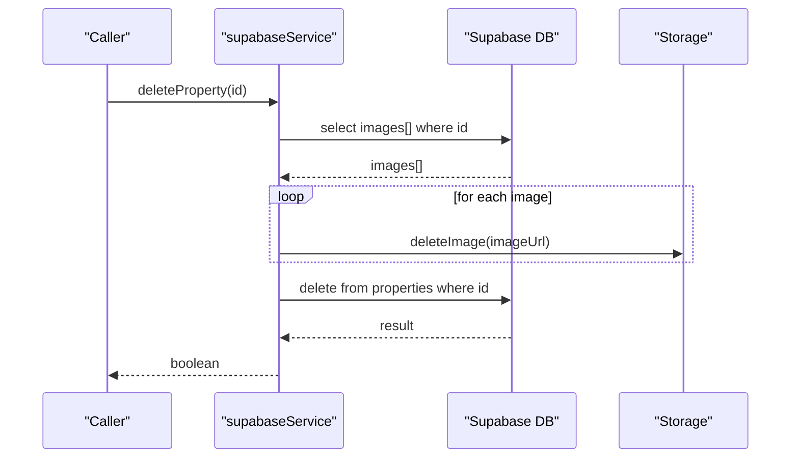
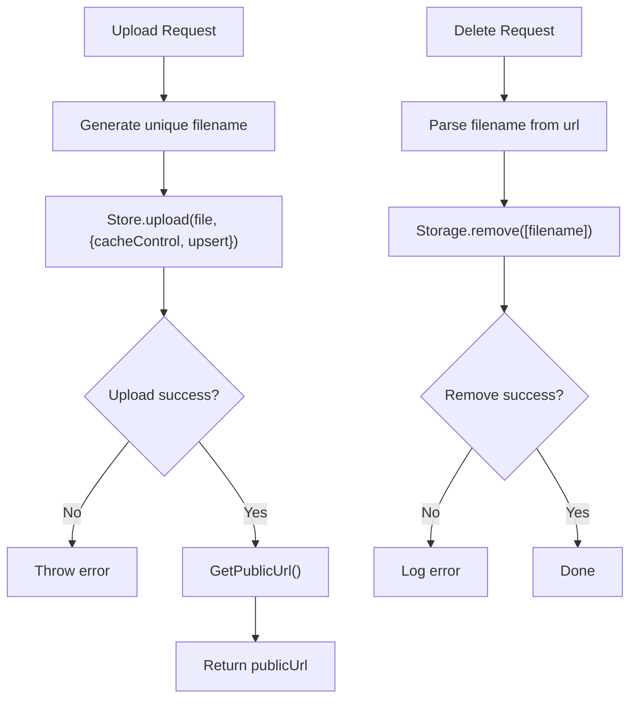
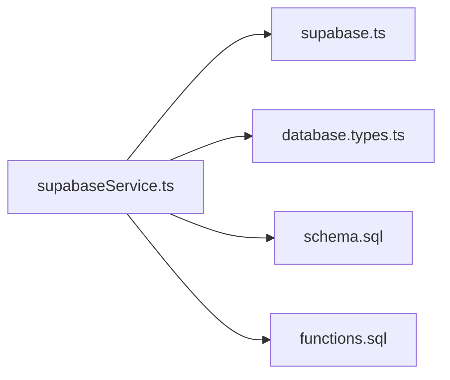

# Property Management APIs

<cite>
**Referenced Files in This Document**
- [supabase/schema.sql](file://supabase/schema.sql)
- [supabase/functions.sql](file://supabase/functions.sql)
- [src/lib/supabase.ts](file://src/lib/supabase.ts)
- [src/types/database.types.ts](file://src/types/database.types.ts)
- [src/services/supabaseService.ts](file://src/services/supabaseService.ts)
</cite>

## Table of Contents
1. [Introduction](#introduction)
2. [Project Structure](#project-structure)
3. [Core Components](#core-components)
4. [Architecture Overview](#architecture-overview)
5. [Detailed Component Analysis](#detailed-component-analysis)
6. [Dependency Analysis](#dependency-analysis)
7. [Performance Considerations](#performance-considerations)
8. [Troubleshooting Guide](#troubleshooting-guide)
9. [Conclusion](#conclusion)
10. [Appendices](#appendices)

## Introduction
This document provides comprehensive API documentation for property management operations. It covers property CRUD endpoints, filtering and search capabilities, property data models, image upload and deletion, and property status management. The APIs are implemented using Supabase (PostgreSQL) for persistence and real-time features, with TypeScript types for strong typing and safety.

## Project Structure
The property management APIs are primarily implemented in the service layer and backed by Supabase schema and functions. Key areas:
- Supabase schema defines the properties table and related policies.
- Supabase functions provide atomic operations like view increments.
- Service layer wraps Supabase client to expose typed property operations.
- Storage bucket manages property images.

**Diagram sources**
- [supabase/schema.sql](file://supabase/schema.sql#L41-L92)
- [supabase/functions.sql](file://supabase/functions.sql#L5-L71)
- [src/services/supabaseService.ts](file://src/services/supabaseService.ts#L1-L120)
- [src/types/database.types.ts](file://src/types/database.types.ts#L53-L132)
- [src/lib/supabase.ts](file://src/lib/supabase.ts#L1-L68)

**Section sources**
- [supabase/schema.sql](file://supabase/schema.sql#L41-L92)
- [supabase/functions.sql](file://supabase/functions.sql#L5-L71)
- [src/services/supabaseService.ts](file://src/services/supabaseService.ts#L1-L120)
- [src/types/database.types.ts](file://src/types/database.types.ts#L53-L132)
- [src/lib/supabase.ts](file://src/lib/supabase.ts#L1-L68)

## Core Components
- Property data model and constraints are defined in the Supabase schema.
- Typed interfaces in the service layer define create/update payloads and row representation.
- Supabase client and storage utilities encapsulate database and image operations.
- Row Level Security (RLS) policies govern access to properties.

Key responsibilities:
- Create, read, update, delete properties.
- Filter and search properties via flexible query parameters.
- Upload and delete property images.
- Manage property status and visibility.

**Section sources**
- [supabase/schema.sql](file://supabase/schema.sql#L41-L92)
- [src/types/database.types.ts](file://src/types/database.types.ts#L53-L132)
- [src/services/supabaseService.ts](file://src/services/supabaseService.ts#L19-L47)
- [src/lib/supabase.ts](file://src/lib/supabase.ts#L30-L68)

## Architecture Overview
The property APIs follow a layered architecture:
- Presentation/UI invokes service methods.
- Service methods interact with Supabase client and storage.
- Supabase enforces RLS policies and executes functions.
- Real-time features (e.g., messages) are supported via Supabase publication.

**Diagram sources**
- [src/services/supabaseService.ts](file://src/services/supabaseService.ts#L258-L311)
- [src/lib/supabase.ts](file://src/lib/supabase.ts#L34-L54)
- [supabase/schema.sql](file://supabase/schema.sql#L41-L67)

## Detailed Component Analysis

### Property Data Model
The properties table defines the canonical schema for property records, including owner linkage, pricing units, categories, statuses, location, attributes, features, images, and audit fields.

**Diagram sources**
- [supabase/schema.sql](file://supabase/schema.sql#L41-L67)
- [supabase/schema.sql](file://supabase/schema.sql#L7-L19)

**Section sources**
- [supabase/schema.sql](file://supabase/schema.sql#L41-L92)
- [src/types/database.types.ts](file://src/types/database.types.ts#L53-L132)

### Property CRUD Operations

#### createFullProperty
- Purpose: Create a property with associated images.
- Method signature: createFullProperty(propertyData: PropertyInsert, imageFiles: File[], userId: string): Promise<PropertyRow>
- Behavior:
  - Uploads images to the storage bucket and collects public URLs.
  - Inserts a new property record with owner_id set to userId and status initialized to pending.
  - On insertion failure, attempts to rollback uploaded images.
- Validation:
  - Uses PropertyInsert interface for payload shape.
  - Enforces category, price_unit, and status constraints at the database level.
- Error handling:
  - Throws on upload failures or database errors.
  - Attempts cleanup of uploaded images on insertion failure.

**Diagram sources**
- [src/services/supabaseService.ts](file://src/services/supabaseService.ts#L258-L311)
- [src/lib/supabase.ts](file://src/lib/supabase.ts#L34-L54)
- [supabase/schema.sql](file://supabase/schema.sql#L41-L67)

**Section sources**
- [src/services/supabaseService.ts](file://src/services/supabaseService.ts#L258-L311)
- [src/types/database.types.ts](file://src/types/database.types.ts#L19-L47)
- [src/lib/supabase.ts](file://src/lib/supabase.ts#L34-L54)

#### getProperties
- Purpose: Retrieve properties with optional filters and sorting.
- Method signature: getProperties(filters?: Filters): Promise<PropertyRow[]>
- Filters:
  - status: string
  - category: string
  - area: string
  - minPrice: number
  - maxPrice: number
  - bedrooms: number
  - bathrooms: number
  - features: string[]
  - ownerId: string
- Behavior:
  - Applies filters using Supabase query builder.
  - Sorts by created_at descending.
  - Supports contains match for features array.
- Response: Array of PropertyRow.

```mermaid
flowchart TD
Start(["Call getProperties(filters)"]) --> Build["Build query with select('*') order by created_at desc"]
Build --> ApplyStatus{"status provided?"}
ApplyStatus --> |Yes| AddEqStatus["Add eq(status)"]
ApplyStatus --> |No| Next1["Skip"]
AddEqStatus --> Next1
Next1 --> ApplyCategory{"category provided?"}
ApplyCategory --> |Yes| AddEqCategory["Add eq(category)"]
ApplyCategory --> |No| Next2["Skip"]
AddEqCategory --> Next2
Next2 --> ApplyArea{"area provided and not 'الكل'?"}
ApplyArea --> |Yes| AddEqArea["Add eq(area)"]
ApplyArea --> |No| Next3["Skip"]
AddEqArea --> Next3
Next3 --> ApplyMinPrice{"minPrice provided?"}
ApplyMinPrice --> |Yes| AddGteMin["Add gte(price)"]
ApplyMinPrice --> |No| Next4["Skip"]
AddGteMin --> Next4
Next4 --> ApplyMaxPrice{"maxPrice provided?"}
ApplyMaxPrice --> |Yes| AddLteMax["Add lte(price)"]
ApplyMaxPrice --> |No| Next5["Skip"]
AddLteMax --> Next5
Next5 --> ApplyBedrooms{"bedrooms provided?"}
ApplyBedrooms --> |Yes| AddGteBed["Add gte(bedrooms)"]
ApplyBedrooms --> |No| Next6["Skip"]
AddGteBed --> Next6
Next6 --> ApplyBathrooms{"bathrooms provided?"}
ApplyBathrooms --> |Yes| AddGteBath["Add gte(bathrooms)"]
ApplyBathrooms --> |No| Next7["Skip"]
AddGteBath --> Next7
Next7 --> ApplyFeatures{"features provided?"}
ApplyFeatures --> |Yes| AddContains["Add contains(features, features[])"]
ApplyFeatures --> |No| Next8["Skip"]
AddContains --> Next8
Next8 --> ApplyOwnerId{"ownerId provided?"}
ApplyOwnerId --> |Yes| AddEqOwner["Add eq(owner_id)"]
ApplyOwnerId --> |No| Exec["Execute query"]
AddEqOwner --> Exec
Exec --> Return["Return PropertyRow[]"]
```

**Diagram sources**
- [src/services/supabaseService.ts](file://src/services/supabaseService.ts#L313-L358)
- [supabase/schema.sql](file://supabase/schema.sql#L41-L67)

**Section sources**
- [src/services/supabaseService.ts](file://src/services/supabaseService.ts#L313-L358)

#### getPropertyById
- Purpose: Fetch a single property by ID.
- Method signature: getPropertyById(id: string): Promise<PropertyRow | null>
- Behavior:
  - Performs a single-row select with eq('id', id).
  - Returns null if not found.
- Response: PropertyRow or null.

**Section sources**
- [src/services/supabaseService.ts](file://src/services/supabaseService.ts#L360-L376)

#### updateProperty
- Purpose: Update property fields.
- Method signature: updateProperty(id: string, updates: Partial<PropertyRow>): Promise<PropertyRow | null>
- Behavior:
  - Performs an update with provided partial fields.
  - Returns the updated row or null on error.
- Response: PropertyRow or null.

**Section sources**
- [src/services/supabaseService.ts](file://src/services/supabaseService.ts#L393-L415)

#### deleteProperty
- Purpose: Delete a property and remove associated images.
- Method signature: deleteProperty(id: string): Promise<boolean>
- Behavior:
  - Retrieves property to delete associated images.
  - Deletes each image from storage.
  - Deletes the property record.
- Response: boolean indicating success.

**Diagram sources**
- [src/services/supabaseService.ts](file://src/services/supabaseService.ts#L417-L440)
- [src/lib/supabase.ts](file://src/lib/supabase.ts#L56-L67)
- [supabase/schema.sql](file://supabase/schema.sql#L41-L67)

**Section sources**
- [src/services/supabaseService.ts](file://src/services/supabaseService.ts#L417-L440)
- [src/lib/supabase.ts](file://src/lib/supabase.ts#L56-L67)

### Property Filtering and Search Capabilities
Supported filter parameters:
- status: Matches exact status value.
- category: Matches exact category value.
- area: Matches exact area value; 'الكل' is treated as no filter.
- minPrice/maxPrice: Numeric range filters.
- bedrooms/bathrooms: Minimum count filters.
- features: Array contains filter.
- ownerId: Owner-specific filtering.

Implementation details:
- Uses Supabase query builder to chain filters.
- Applies contains for array field features.
- Orders results by created_at descending.

**Section sources**
- [src/services/supabaseService.ts](file://src/services/supabaseService.ts#L313-L358)
- [supabase/schema.sql](file://supabase/schema.sql#L41-L67)

### Property Status Management
- Initial status is set to pending during creation.
- Visibility policies allow viewing properties with status available or rented, or owned by the current user.
- Administrative policies grant full access for admins.

**Section sources**
- [supabase/schema.sql](file://supabase/schema.sql#L197-L225)
- [supabase/schema.sql](file://supabase/schema.sql#L306-L335)

### Image Upload and Delete Operations
- Storage bucket name: properties-images.
- Upload:
  - Generates a unique filename with timestamp and random suffix.
  - Sets cache control and upsert policy.
  - Returns public URL.
- Delete:
  - Parses filename from public URL and removes from storage.

**Diagram sources**
- [src/lib/supabase.ts](file://src/lib/supabase.ts#L34-L67)

**Section sources**
- [src/lib/supabase.ts](file://src/lib/supabase.ts#L30-L68)

### Property View Count Increment
- Uses a stored procedure increment_views to atomically increase views_count.
- Falls back to manual increment if RPC fails.

**Section sources**
- [supabase/functions.sql](file://supabase/functions.sql#L30-L39)
- [src/services/supabaseService.ts](file://src/services/supabaseService.ts#L378-L391)

### API Usage Examples and Integration Patterns
- Frontend integration:
  - Use createFullProperty to submit new listings with multiple images.
  - Use getProperties with filters to power search and listing pages.
  - Use getPropertyById for property detail pages and incrementPropertyViews after successful fetch.
  - Use updateProperty and deleteProperty for owner-managed properties.
- Bulk operations:
  - Upload multiple images per property via createFullProperty.
  - Batch delete images by removing property and letting deleteProperty remove associated images.
- Real-time and notifications:
  - Leverage Supabase Realtime for live updates and chat features.

[No sources needed since this section provides general guidance]

## Dependency Analysis
- supabaseService.ts depends on:
  - supabase client for database operations.
  - storage utilities for image management.
  - database.types.ts for type-safe queries.
- Supabase schema and functions define constraints and policies that supabaseService enforces implicitly.

**Diagram sources**
- [src/services/supabaseService.ts](file://src/services/supabaseService.ts#L1-L120)
- [src/lib/supabase.ts](file://src/lib/supabase.ts#L1-L68)
- [src/types/database.types.ts](file://src/types/database.types.ts#L1-L310)
- [supabase/schema.sql](file://supabase/schema.sql#L1-L416)
- [supabase/functions.sql](file://supabase/functions.sql#L1-L71)

**Section sources**
- [src/services/supabaseService.ts](file://src/services/supabaseService.ts#L1-L120)
- [src/lib/supabase.ts](file://src/lib/supabase.ts#L1-L68)
- [src/types/database.types.ts](file://src/types/database.types.ts#L1-L310)
- [supabase/schema.sql](file://supabase/schema.sql#L1-L416)
- [supabase/functions.sql](file://supabase/functions.sql#L1-L71)

## Performance Considerations
- Use appropriate indices on frequently filtered columns (e.g., status, category, area, bedrooms, bathrooms) to optimize query performance.
- Consider pagination for getProperties to limit result sets.
- Minimize image sizes and leverage caching via storage cache control.
- Use contains efficiently; consider normalized features table if feature filtering becomes complex.

[No sources needed since this section provides general guidance]

## Troubleshooting Guide
Common issues and resolutions:
- Missing environment variables for Supabase client:
  - Ensure NEXT_PUBLIC_SUPABASE_URL and NEXT_PUBLIC_SUPABASE_ANON_KEY are configured.
- Image upload failures:
  - Verify storage bucket permissions and file types.
  - Check network connectivity and storage quotas.
- Property creation errors:
  - Validate PropertyInsert fields against schema constraints.
  - Confirm owner_id matches authenticated user.
- Access denied:
  - Check RLS policies for properties and related tables.
  - Ensure user roles and ownership are correct.

**Section sources**
- [src/lib/supabase.ts](file://src/lib/supabase.ts#L7-L15)
- [supabase/schema.sql](file://supabase/schema.sql#L197-L225)

## Conclusion
The property management APIs provide a robust foundation for property CRUD, filtering, and media handling, backed by Supabase’s schema, policies, and functions. By leveraging typed interfaces and service-layer abstractions, the system ensures type safety and maintainability while supporting scalable operations and real-time features.

[No sources needed since this section summarizes without analyzing specific files]

## Appendices

### API Reference Summary

- createFullProperty
  - Input: PropertyInsert, File[], string userId
  - Output: PropertyRow
  - Errors: Upload failures, database insert errors (with cleanup)
- getProperties
  - Input: Filters (optional)
  - Output: PropertyRow[]
  - Filters: status, category, area, minPrice, maxPrice, bedrooms, bathrooms, features, ownerId
- getPropertyById
  - Input: string id
  - Output: PropertyRow | null
- updateProperty
  - Input: string id, Partial<PropertyRow>
  - Output: PropertyRow | null
- deleteProperty
  - Input: string id
  - Output: boolean

**Section sources**
- [src/services/supabaseService.ts](file://src/services/supabaseService.ts#L258-L440)
- [src/types/database.types.ts](file://src/types/database.types.ts#L19-L47)