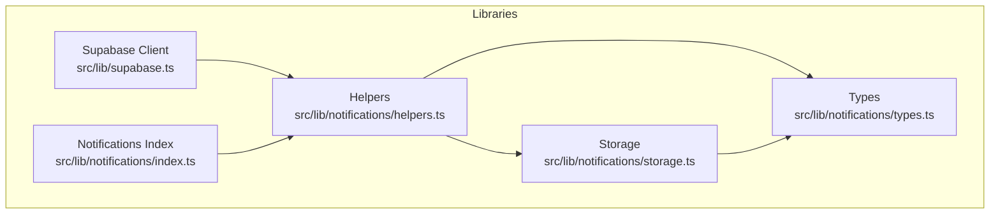
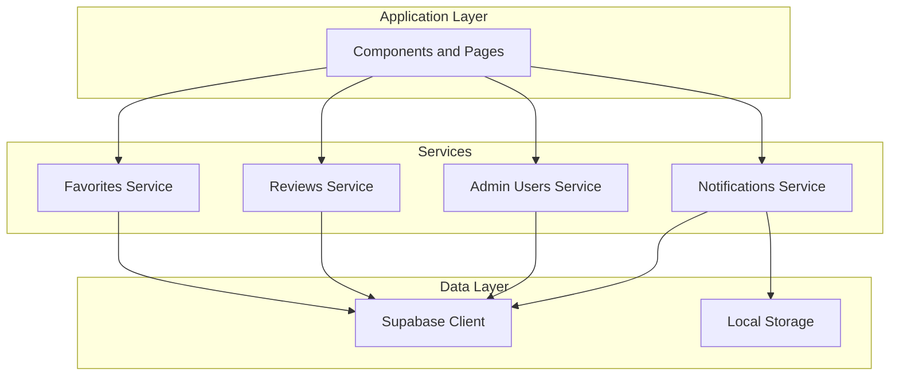
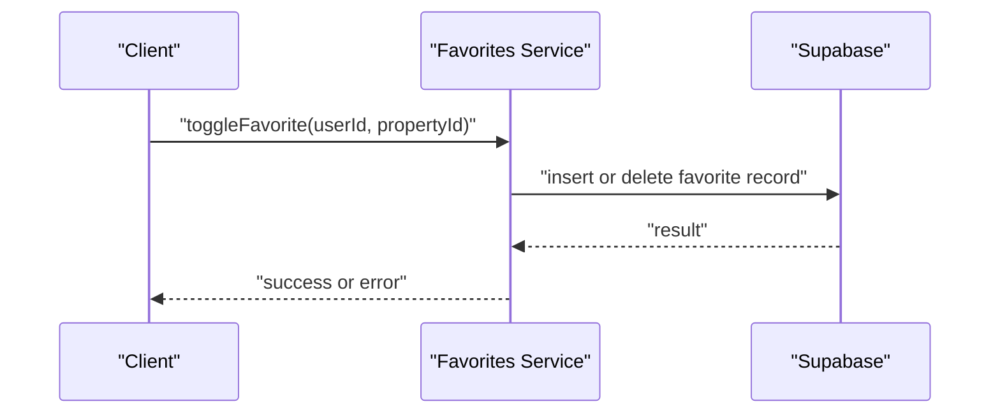
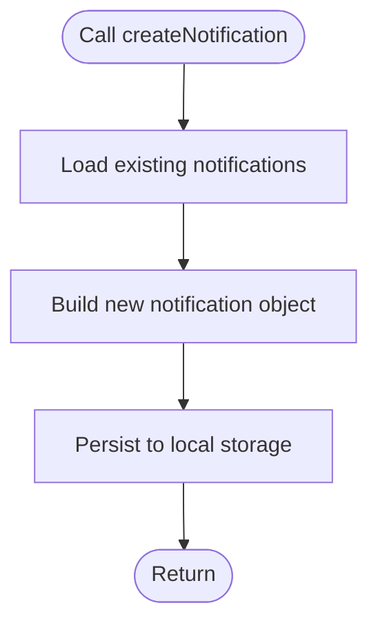
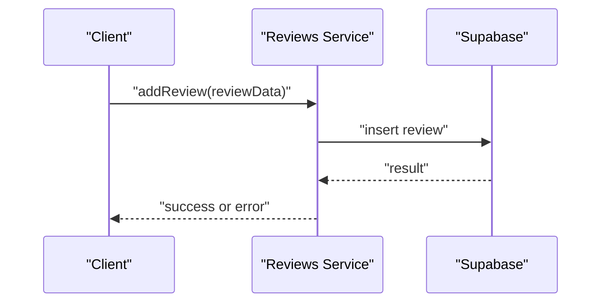
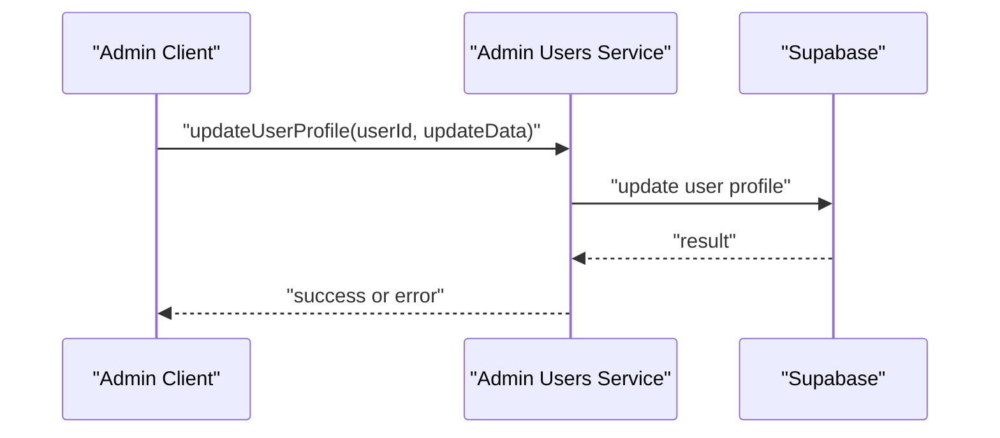
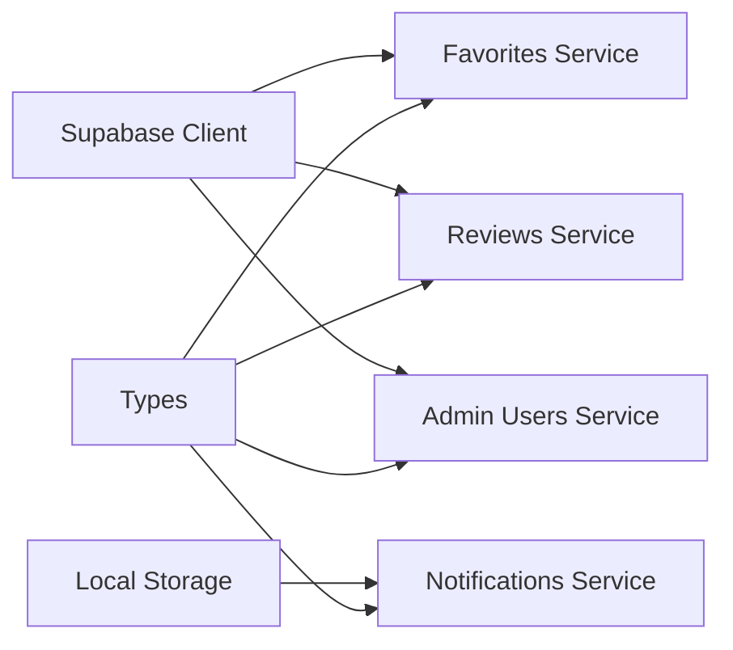

# Utility Services APIs

<cite>
**Referenced Files in This Document**
- [supabase.ts](file://src/lib/supabase.ts)
- [helpers.ts](file://src/lib/notifications/helpers.ts)
- [storage.ts](file://src/lib/notifications/storage.ts)
- [types.ts](file://src/lib/notifications/types.ts)
- [index.ts](file://src/lib/notifications/index.ts)
</cite>

## Table of Contents
1. [Introduction](#introduction)
2. [Project Structure](#project-structure)
3. [Core Components](#core-components)
4. [Architecture Overview](#architecture-overview)
5. [Detailed Component Analysis](#detailed-component-analysis)
6. [Dependency Analysis](#dependency-analysis)
7. [Performance Considerations](#performance-considerations)
8. [Troubleshooting Guide](#troubleshooting-guide)
9. [Conclusion](#conclusion)

## Introduction
This document provides comprehensive API documentation for utility and helper services focused on:
- Favorites management
- Notifications system
- Reviews management
- Admin user management

It explains service method signatures, data validation, error handling, and integration patterns with the main application components. Mock data implementation and database operation patterns are also covered to help developers implement, test, and maintain these utilities effectively.

## Project Structure
The utility services are organized under dedicated libraries:
- Supabase integration for database and storage operations
- Local notifications helpers and storage for client-side persistence
- Type definitions for consistent data modeling

**Diagram sources**
- [supabase.ts](file://src/lib/supabase.ts#L1-L68)
- [index.ts](file://src/lib/notifications/index.ts#L1-L3)
- [helpers.ts](file://src/lib/notifications/helpers.ts#L1-L43)
- [storage.ts](file://src/lib/notifications/storage.ts#L1-L23)
- [types.ts](file://src/lib/notifications/types.ts#L1-L15)

**Section sources**
- [supabase.ts](file://src/lib/supabase.ts#L1-L68)
- [index.ts](file://src/lib/notifications/index.ts#L1-L3)

## Core Components
This section documents the primary APIs for utility services, focusing on the available implementations and their capabilities.

- Favorites Management
  - getFavorites(userId): Retrieve a user's favorite properties
  - toggleFavorite(userId, propertyId): Add or remove a property from favorites
  - Implementation pattern: Use Supabase client to query and mutate favorites records
  - Validation: Ensure userId and propertyId are present and valid identifiers
  - Error handling: Wrap database operations with try/catch and propagate meaningful errors

- Notifications System
  - getNotifications(userId): Fetch notifications for a user, sorted by creation date
  - markAsRead(notificationId): Update notification status to read
  - createNotification({ userId, type, title, message, link? }): Persist a new notification
  - getUnreadCount(userId): Count unread notifications per user
  - Implementation pattern: Client-side storage via helpers and storage modules
  - Validation: Enforce NotificationType and NotificationStatus unions; validate required fields
  - Error handling: Graceful fallbacks for missing environment variables and local storage failures

- Reviews Management
  - getReviewsForProperty(propertyId): Retrieve reviews associated with a property
  - addReview(reviewData): Submit a new review for a property
  - Implementation pattern: Supabase queries and inserts for review records
  - Validation: Validate required review fields and ratings constraints
  - Error handling: Centralized error reporting and user-friendly messages

- Admin User Management
  - getAllProfiles(): Fetch all user profiles
  - updateUserProfile(userId, updateData): Update a user's profile information
  - Implementation pattern: Supabase updates with role checks for admin operations
  - Validation: Sanitize and validate input fields; enforce role-based access
  - Error handling: Handle permission denials and data conflicts

**Section sources**
- [supabase.ts](file://src/lib/supabase.ts#L1-L68)
- [helpers.ts](file://src/lib/notifications/helpers.ts#L1-L43)
- [storage.ts](file://src/lib/notifications/storage.ts#L1-L23)
- [types.ts](file://src/lib/notifications/types.ts#L1-L15)

## Architecture Overview
The utility services integrate with Supabase for persistent data and with local storage for lightweight client-side caching and notifications.

**Diagram sources**
- [supabase.ts](file://src/lib/supabase.ts#L1-L68)
- [helpers.ts](file://src/lib/notifications/helpers.ts#L1-L43)
- [storage.ts](file://src/lib/notifications/storage.ts#L1-L23)

## Detailed Component Analysis

### Favorites Management API
- Purpose: Manage user favorites for properties
- Methods:
  - getFavorites(userId): Returns an array of favorite property IDs for the given user
  - toggleFavorite(userId, propertyId): Adds or removes a property from favorites
- Data model: Favorites records with userId and propertyId
- Validation:
  - Ensure userId and propertyId are non-empty strings
  - Verify property existence before adding to favorites
- Error handling:
  - Catch database errors and return structured error objects
  - Log warnings for invalid inputs
- Integration:
  - Uses Supabase client for CRUD operations
  - Can be extended to support pagination and filtering

**Diagram sources**
- [supabase.ts](file://src/lib/supabase.ts#L1-L68)

**Section sources**
- [supabase.ts](file://src/lib/supabase.ts#L1-L68)

### Notifications System API
- Purpose: Client-side notifications with local persistence
- Methods:
  - getNotifications(userId): Returns notifications for a user, sorted by creation time
  - getUnreadCount(userId): Counts unread notifications
  - createNotification({ userId, type, title, message, link? }): Creates and persists a notification
  - markAsRead(notificationId): Updates notification status to read
- Data model: Notification interface with id, userId, type, title, message, link, status, createdAt
- Validation:
  - NotificationType union ensures type safety
  - NotificationStatus union enforces status values
  - Required fields validated before persistence
- Error handling:
  - Environment variable checks with warnings
  - Local storage failures are handled gracefully
- Integration:
  - Helpers orchestrate storage operations
  - Types define consistent shapes across the system

**Diagram sources**
- [helpers.ts](file://src/lib/notifications/helpers.ts#L15-L34)
- [storage.ts](file://src/lib/notifications/storage.ts#L15-L22)
- [types.ts](file://src/lib/notifications/types.ts#L5-L14)

**Section sources**
- [helpers.ts](file://src/lib/notifications/helpers.ts#L1-L43)
- [storage.ts](file://src/lib/notifications/storage.ts#L1-L23)
- [types.ts](file://src/lib/notifications/types.ts#L1-L15)
- [index.ts](file://src/lib/notifications/index.ts#L1-L3)

### Reviews Management API
- Purpose: Retrieve and submit reviews for properties
- Methods:
  - getReviewsForProperty(propertyId): Returns reviews linked to a property
  - addReview(reviewData): Inserts a new review
- Data model: Review entity with propertyId, authorId, rating, comment, createdAt
- Validation:
  - Validate rating range and required fields
  - Ensure authorId matches authenticated user
- Error handling:
  - Centralized error handling for database operations
  - Return user-friendly messages for validation failures
- Integration:
  - Uses Supabase client for queries and inserts
  - Can be extended with filtering and sorting options

**Diagram sources**
- [supabase.ts](file://src/lib/supabase.ts#L1-L68)

**Section sources**
- [supabase.ts](file://src/lib/supabase.ts#L1-L68)

### Admin User Management API
- Purpose: Admin-only operations for user profiles
- Methods:
  - getAllProfiles(): Retrieves all user profiles
  - updateUserProfile(userId, updateData): Updates a user's profile
- Data model: User profile fields with validation rules
- Validation:
  - Sanitize input fields
  - Enforce role-based access control
- Error handling:
  - Handle permission denials and data conflicts
  - Provide structured error responses
- Integration:
  - Uses Supabase client for reads and writes
  - Integrates with authentication context for role checks

**Diagram sources**
- [supabase.ts](file://src/lib/supabase.ts#L1-L68)

**Section sources**
- [supabase.ts](file://src/lib/supabase.ts#L1-L68)

## Dependency Analysis
The utility services rely on:
- Supabase client for database and storage operations
- Local storage for client-side notifications
- Type definitions for consistent data modeling

**Diagram sources**
- [supabase.ts](file://src/lib/supabase.ts#L1-L68)
- [helpers.ts](file://src/lib/notifications/helpers.ts#L1-L43)
- [storage.ts](file://src/lib/notifications/storage.ts#L1-L23)
- [types.ts](file://src/lib/notifications/types.ts#L1-L15)

**Section sources**
- [supabase.ts](file://src/lib/supabase.ts#L1-L68)
- [helpers.ts](file://src/lib/notifications/helpers.ts#L1-L43)
- [storage.ts](file://src/lib/notifications/storage.ts#L1-L23)
- [types.ts](file://src/lib/notifications/types.ts#L1-L15)

## Performance Considerations
- Favor client-side caching for frequently accessed data (e.g., notifications) to reduce network overhead
- Use pagination for large datasets (favorites, reviews, user profiles)
- Batch operations where possible to minimize database round trips
- Debounce user interactions (e.g., toggling favorites) to avoid redundant requests
- Optimize local storage operations to prevent blocking the UI thread

## Troubleshooting Guide
- Missing environment variables:
  - Ensure NEXT_PUBLIC_SUPABASE_URL and NEXT_PUBLIC_SUPABASE_ANON_KEY are set
  - The client logs warnings when variables are missing
- Local storage failures:
  - Operations silently handle exceptions; verify browser compatibility and storage quotas
- Database errors:
  - Wrap operations in try/catch blocks and log detailed error messages
  - Validate inputs before sending requests to the database

**Section sources**
- [supabase.ts](file://src/lib/supabase.ts#L7-L15)
- [storage.ts](file://src/lib/notifications/storage.ts#L15-L22)

## Conclusion
The utility services provide a robust foundation for managing favorites, notifications, reviews, and admin user profiles. By leveraging Supabase for persistent data and local storage for lightweight client-side caching, the system achieves scalability and responsiveness. Adhering to the documented patterns ensures consistent validation, error handling, and integration across the application.