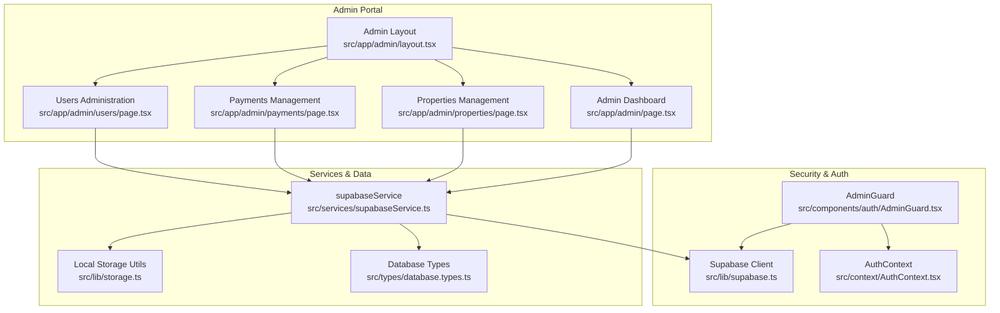
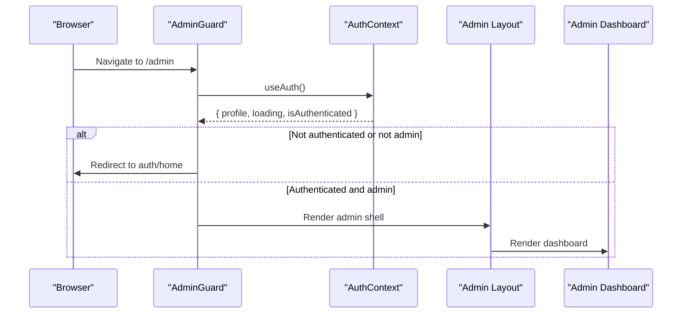
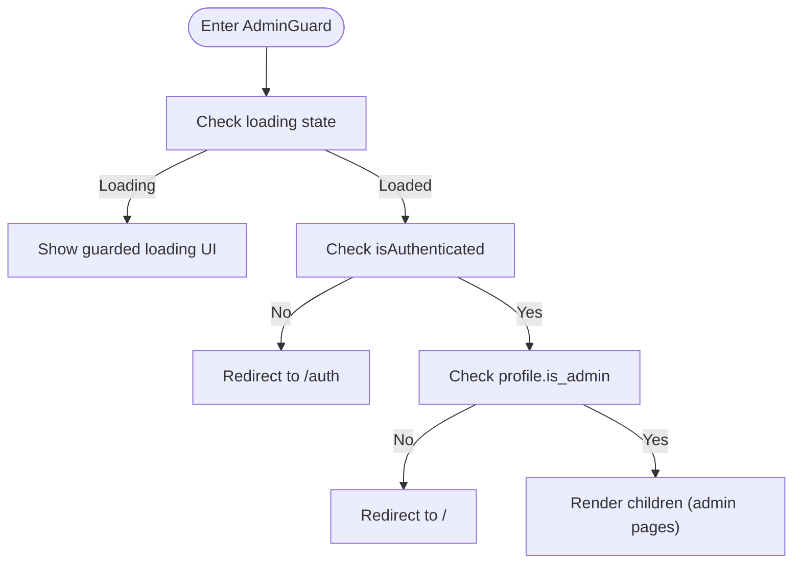
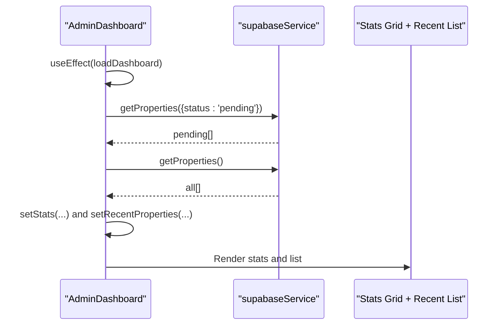
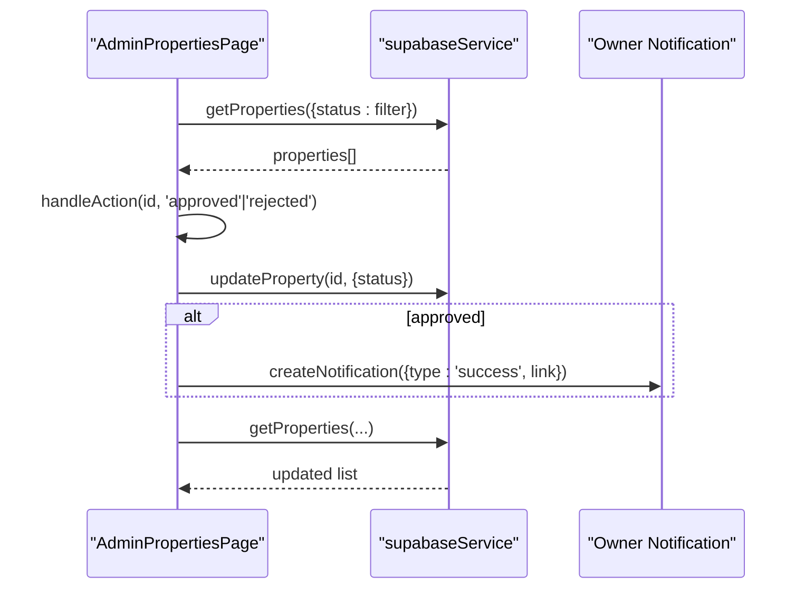
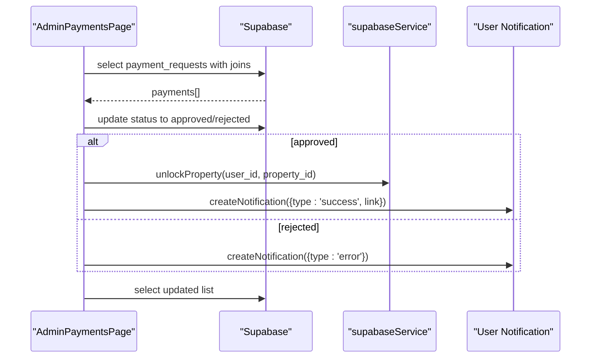
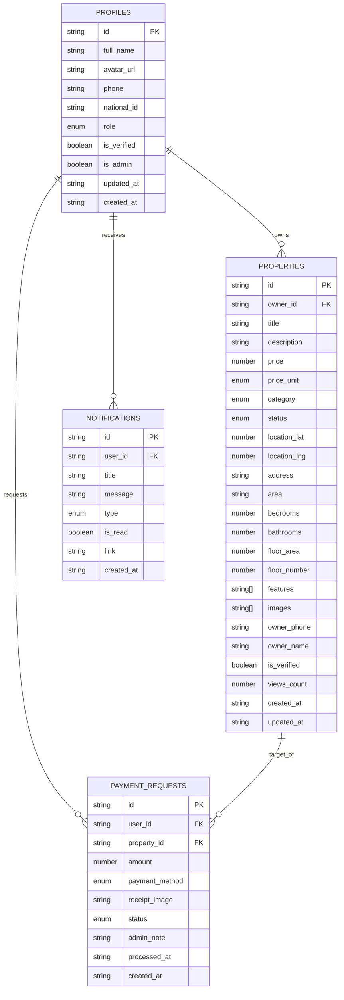
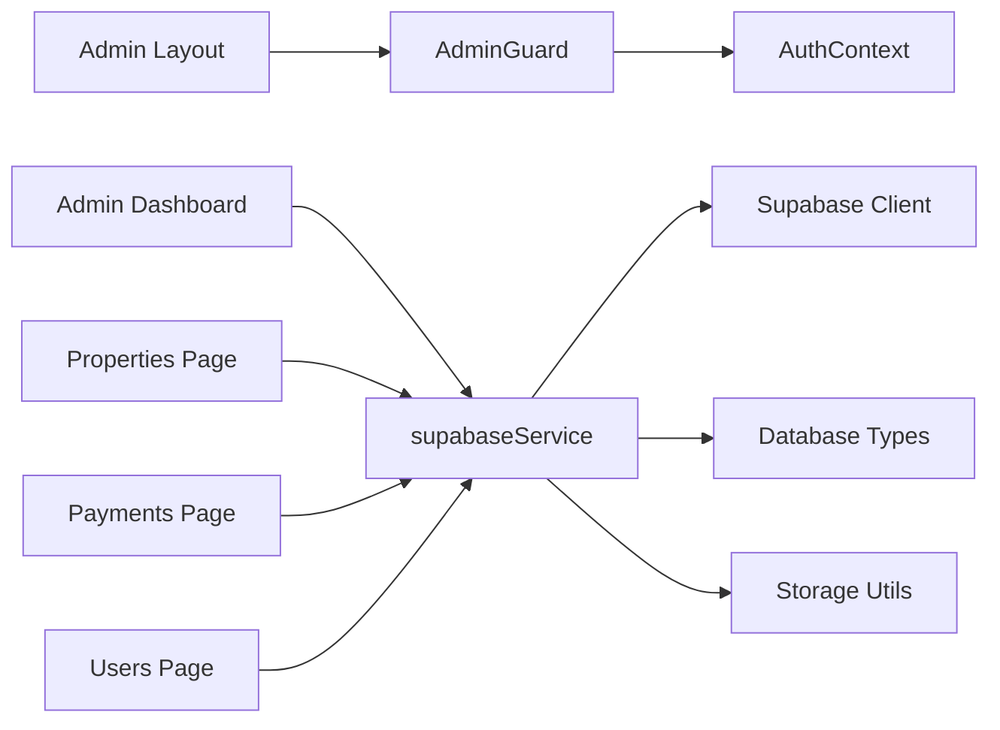

# Admin Dashboard Overview

<cite>
**Referenced Files in This Document**
- [src/app/admin/layout.tsx](file://src/app/admin/layout.tsx)
- [src/app/admin/page.tsx](file://src/app/admin/page.tsx)
- [src/components/auth/AdminGuard.tsx](file://src/components/auth/AdminGuard.tsx)
- [src/context/AuthContext.tsx](file://src/context/AuthContext.tsx)
- [src/lib/supabase.ts](file://src/lib/supabase.ts)
- [src/services/supabaseService.ts](file://src/services/supabaseService.ts)
- [src/app/admin/properties/page.tsx](file://src/app/admin/properties/page.tsx)
- [src/app/admin/payments/page.tsx](file://src/app/admin/payments/page.tsx)
- [src/app/admin/users/page.tsx](file://src/app/admin/users/page.tsx)
- [src/types/database.types.ts](file://src/types/database.types.ts)
- [src/lib/storage.ts](file://src/lib/storage.ts)
- [src/components/ui/glass/index.ts](file://src/components/ui/glass/index.ts)
- [package.json](file://package.json)
</cite>

## Table of Contents
1. [Introduction](#introduction)
2. [Project Structure](#project-structure)
3. [Core Components](#core-components)
4. [Architecture Overview](#architecture-overview)
5. [Detailed Component Analysis](#detailed-component-analysis)
6. [Dependency Analysis](#dependency-analysis)
7. [Performance Considerations](#performance-considerations)
8. [Troubleshooting Guide](#troubleshooting-guide)
9. [Conclusion](#conclusion)

## Introduction
This document provides a comprehensive overview of the admin dashboard for the Gamasa Properties platform. It explains the admin portal’s purpose, architecture, and its relationship to the broader system. It documents the admin role implementation, access control mechanisms, and dashboard analytics. It also details the main dashboard components (property statistics, recent activities, and system health indicators), the admin navigation structure, permission system, and security measures. Finally, it outlines examples of admin dashboard layouts, data visualization components, and real-time monitoring interfaces.

## Project Structure
The admin portal is implemented as a Next.js App Router application with a dedicated admin route under src/app/admin. The admin area is protected by a guard component and uses a shared layout that includes a header, navigation, and a main content area. The admin pages include:
- Admin overview/dashboard
- Property management
- Payment requests
- User administration

**Diagram sources**
- [src/app/admin/layout.tsx](file://src/app/admin/layout.tsx#L1-L64)
- [src/app/admin/page.tsx](file://src/app/admin/page.tsx#L1-L145)
- [src/app/admin/properties/page.tsx](file://src/app/admin/properties/page.tsx#L1-L177)
- [src/app/admin/payments/page.tsx](file://src/app/admin/payments/page.tsx#L1-L242)
- [src/app/admin/users/page.tsx](file://src/app/admin/users/page.tsx#L1-L157)
- [src/components/auth/AdminGuard.tsx](file://src/components/auth/AdminGuard.tsx#L1-L44)
- [src/context/AuthContext.tsx](file://src/context/AuthContext.tsx#L1-L195)
- [src/lib/supabase.ts](file://src/lib/supabase.ts#L1-L68)
- [src/services/supabaseService.ts](file://src/services/supabaseService.ts#L1-L1384)
- [src/types/database.types.ts](file://src/types/database.types.ts#L1-L310)
- [src/lib/storage.ts](file://src/lib/storage.ts#L1-L633)

**Section sources**
- [src/app/admin/layout.tsx](file://src/app/admin/layout.tsx#L1-L64)
- [src/app/admin/page.tsx](file://src/app/admin/page.tsx#L1-L145)
- [src/app/admin/properties/page.tsx](file://src/app/admin/properties/page.tsx#L1-L177)
- [src/app/admin/payments/page.tsx](file://src/app/admin/payments/page.tsx#L1-L242)
- [src/app/admin/users/page.tsx](file://src/app/admin/users/page.tsx#L1-L157)

## Core Components
- AdminGuard: Enforces admin-only access by checking authentication and the is_admin flag before rendering admin content.
- Admin Layout: Provides a consistent header, navigation, and content container for all admin pages.
- Admin Dashboard: Renders property statistics, recent pending properties, and placeholders for pending payments and total users.
- Admin Pages:
  - Properties: Lists properties with status filtering and approval/rejection actions.
  - Payments: Manages payment requests with approval/rejection actions and unlocks properties upon approval.
  - Users: Lists profiles, supports verification toggling, and admin privilege toggling.

**Section sources**
- [src/components/auth/AdminGuard.tsx](file://src/components/auth/AdminGuard.tsx#L1-L44)
- [src/app/admin/layout.tsx](file://src/app/admin/layout.tsx#L1-L64)
- [src/app/admin/page.tsx](file://src/app/admin/page.tsx#L1-L145)
- [src/app/admin/properties/page.tsx](file://src/app/admin/properties/page.tsx#L1-L177)
- [src/app/admin/payments/page.tsx](file://src/app/admin/payments/page.tsx#L1-L242)
- [src/app/admin/users/page.tsx](file://src/app/admin/users/page.tsx#L1-L157)

## Architecture Overview
The admin portal follows a layered architecture:
- Presentation Layer: Next.js App Router pages and shared UI components.
- Access Control Layer: AdminGuard and AuthContext manage authentication and authorization.
- Service Layer: supabaseService abstracts data operations and integrates with Supabase.
- Data Layer: Supabase client and database types define the schema and operations.

**Diagram sources**
- [src/components/auth/AdminGuard.tsx](file://src/components/auth/AdminGuard.tsx#L1-L44)
- [src/context/AuthContext.tsx](file://src/context/AuthContext.tsx#L1-L195)
- [src/app/admin/layout.tsx](file://src/app/admin/layout.tsx#L1-L64)
- [src/app/admin/page.tsx](file://src/app/admin/page.tsx#L1-L145)

## Detailed Component Analysis

### AdminGuard: Role-Based Access Control
AdminGuard ensures only authenticated users with the is_admin flag can access admin pages. It redirects unauthenticated users to the login page and non-admin users to the home page. During loading, it displays a guarded loading state.

**Diagram sources**
- [src/components/auth/AdminGuard.tsx](file://src/components/auth/AdminGuard.tsx#L1-L44)

**Section sources**
- [src/components/auth/AdminGuard.tsx](file://src/components/auth/AdminGuard.tsx#L1-L44)
- [src/context/AuthContext.tsx](file://src/context/AuthContext.tsx#L1-L195)

### Admin Layout: Navigation and Shell
The admin layout defines:
- Header with branding and return link
- Horizontal navigation bar for admin sections
- Main content area with max-width and padding

It wraps child routes with AdminGuard to enforce access control.

**Section sources**
- [src/app/admin/layout.tsx](file://src/app/admin/layout.tsx#L1-L64)

### Admin Dashboard: Analytics and Recent Activities
The dashboard page fetches and displays:
- Property statistics cards: pending properties, total properties, pending payments, total users
- Recent pending properties list with images, titles, prices, and status badges
- Loading states and empty states

**Diagram sources**
- [src/app/admin/page.tsx](file://src/app/admin/page.tsx#L24-L48)
- [src/services/supabaseService.ts](file://src/services/supabaseService.ts#L313-L358)

**Section sources**
- [src/app/admin/page.tsx](file://src/app/admin/page.tsx#L1-L145)
- [src/services/supabaseService.ts](file://src/services/supabaseService.ts#L313-L358)

### Properties Management: Status Filtering and Approvals
The properties page supports filtering by status and performs inline approvals or rejections. On approval, it sends a notification to the property owner and updates the property status.

**Diagram sources**
- [src/app/admin/properties/page.tsx](file://src/app/admin/properties/page.tsx#L17-L56)
- [src/services/supabaseService.ts](file://src/services/supabaseService.ts#L393-L415)

**Section sources**
- [src/app/admin/properties/page.tsx](file://src/app/admin/properties/page.tsx#L1-L177)
- [src/services/supabaseService.ts](file://src/services/supabaseService.ts#L393-L415)

### Payments Management: Approval Workflow and Unlocking
The payments page lists payment requests with filtering and actions. On approval, it updates the payment status, unlocks the property for the user, and sends a success notification. On rejection, it sends an error notification.

**Diagram sources**
- [src/app/admin/payments/page.tsx](file://src/app/admin/payments/page.tsx#L33-L106)
- [src/services/supabaseService.ts](file://src/services/supabaseService.ts#L528-L536)

**Section sources**
- [src/app/admin/payments/page.tsx](file://src/app/admin/payments/page.tsx#L1-L242)
- [src/services/supabaseService.ts](file://src/services/supabaseService.ts#L528-L536)

### Users Administration: Verification and Admin Privileges
The users page lists profiles with search and filtering capabilities. It supports toggling verification and admin privileges with immediate UI updates.

**Section sources**
- [src/app/admin/users/page.tsx](file://src/app/admin/users/page.tsx#L1-L157)

### Data Models and Schema
The admin dashboard interacts with Supabase tables defined in database.types.ts, including profiles, properties, payment_requests, notifications, and more. These types inform the service layer and UI components.

**Diagram sources**
- [src/types/database.types.ts](file://src/types/database.types.ts#L12-L310)

**Section sources**
- [src/types/database.types.ts](file://src/types/database.types.ts#L12-L310)

### Security Measures and Access Control
- AdminGuard enforces admin-only access by checking is_admin.
- AuthContext manages authentication state and exposes user info to the guard.
- Supabase client is configured with auto-refresh and persisted sessions.
- Local storage utilities centralize user and data persistence.

**Section sources**
- [src/components/auth/AdminGuard.tsx](file://src/components/auth/AdminGuard.tsx#L1-L44)
- [src/context/AuthContext.tsx](file://src/context/AuthContext.tsx#L1-L195)
- [src/lib/supabase.ts](file://src/lib/supabase.ts#L1-L68)
- [src/lib/storage.ts](file://src/lib/storage.ts#L1-L633)

### Data Visualization and Dashboard Layouts
- Statistics cards: Grid layout with gradient-colored cards and material icons.
- Recent properties: Glass card list with images, titles, pricing, and status badges.
- Pending payments and total users: Placeholder cards awaiting data retrieval.

**Section sources**
- [src/app/admin/page.tsx](file://src/app/admin/page.tsx#L50-L145)
- [src/components/ui/glass/index.ts](file://src/components/ui/glass/index.ts#L1-L9)

### Real-Time Monitoring Interfaces
While the current admin pages primarily rely on server-side data retrieval, the service layer includes real-time capabilities such as presence and typing indicators via Supabase channels. These can be extended to admin dashboards for live monitoring features.

**Section sources**
- [src/services/supabaseService.ts](file://src/services/supabaseService.ts#L1002-L1038)

## Dependency Analysis
The admin dashboard depends on:
- Next.js App Router for routing and layout composition
- Supabase client and service layer for data operations
- Tailwind-based glass UI components for consistent styling
- TypeScript database types for schema correctness

**Diagram sources**
- [src/app/admin/layout.tsx](file://src/app/admin/layout.tsx#L1-L64)
- [src/app/admin/page.tsx](file://src/app/admin/page.tsx#L1-L145)
- [src/app/admin/properties/page.tsx](file://src/app/admin/properties/page.tsx#L1-L177)
- [src/app/admin/payments/page.tsx](file://src/app/admin/payments/page.tsx#L1-L242)
- [src/app/admin/users/page.tsx](file://src/app/admin/users/page.tsx#L1-L157)
- [src/components/auth/AdminGuard.tsx](file://src/components/auth/AdminGuard.tsx#L1-L44)
- [src/context/AuthContext.tsx](file://src/context/AuthContext.tsx#L1-L195)
- [src/services/supabaseService.ts](file://src/services/supabaseService.ts#L1-L1384)
- [src/lib/supabase.ts](file://src/lib/supabase.ts#L1-L68)
- [src/types/database.types.ts](file://src/types/database.types.ts#L1-L310)
- [src/lib/storage.ts](file://src/lib/storage.ts#L1-L633)

**Section sources**
- [package.json](file://package.json#L11-L27)
- [src/services/supabaseService.ts](file://src/services/supabaseService.ts#L1-L1384)

## Performance Considerations
- Use concurrent data fetching (as seen with Promise.all) to reduce load times.
- Implement pagination and virtualized lists for large datasets (users, properties).
- Debounce search inputs to avoid excessive queries.
- Cache frequently accessed data in memory or localStorage where appropriate.
- Lazy-load images and use responsive image sizes.

## Troubleshooting Guide
Common issues and resolutions:
- AdminGuard redirect loops: Verify authentication state and is_admin flag in profile.
- Missing Supabase environment variables: Ensure NEXT_PUBLIC_SUPABASE_URL and NEXT_PUBLIC_SUPABASE_ANON_KEY are set.
- Data not updating after admin actions: Confirm service calls resolve and UI re-fetches data.
- Local storage conflicts: Check for storage events and userUpdated dispatches.

**Section sources**
- [src/components/auth/AdminGuard.tsx](file://src/components/auth/AdminGuard.tsx#L1-L44)
- [src/lib/supabase.ts](file://src/lib/supabase.ts#L3-L15)
- [src/lib/storage.ts](file://src/lib/storage.ts#L32-L36)

## Conclusion
The admin dashboard for Gamasa Properties provides a secure, modular, and extensible foundation for managing properties, payments, and users. Its architecture leverages Next.js routing, Supabase for data, and a clear separation of concerns through guards, contexts, and services. The dashboard currently focuses on property statistics and recent activities, with room to expand analytics, system health indicators, and real-time monitoring features.