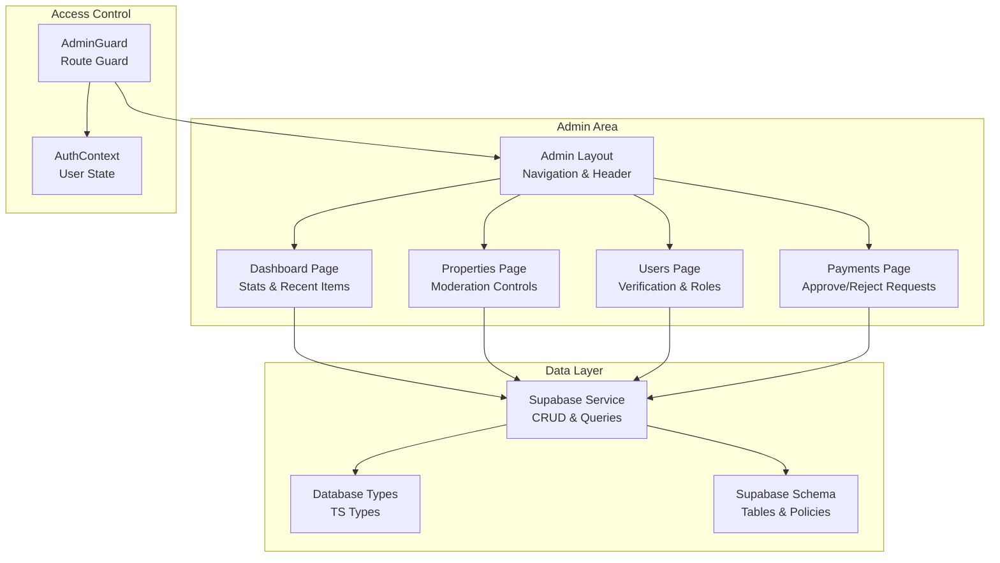
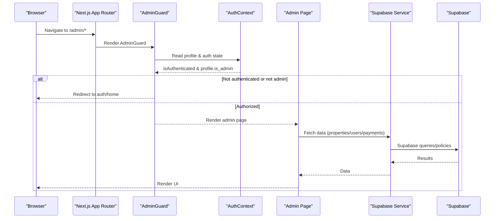
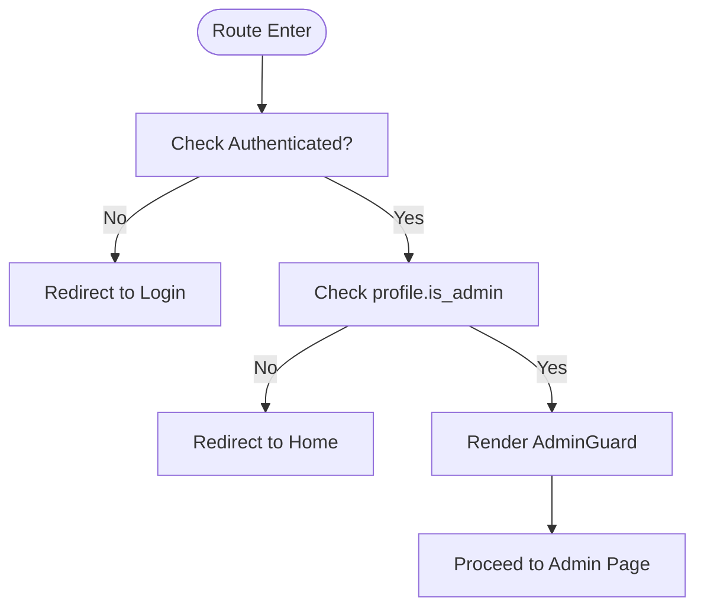
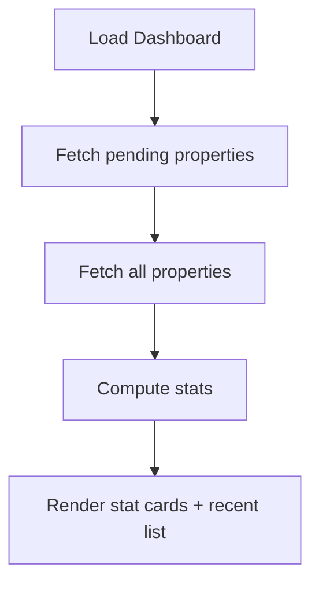
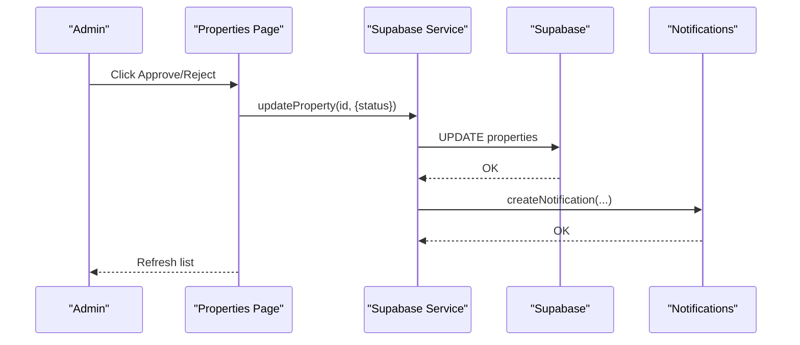
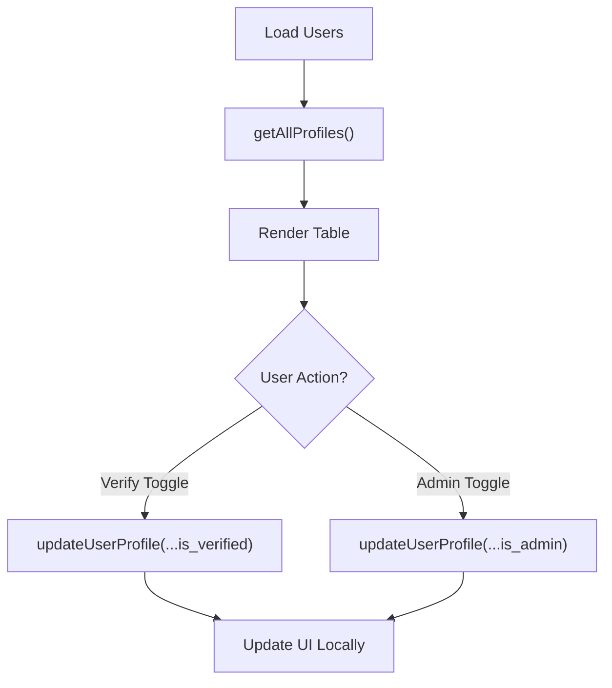
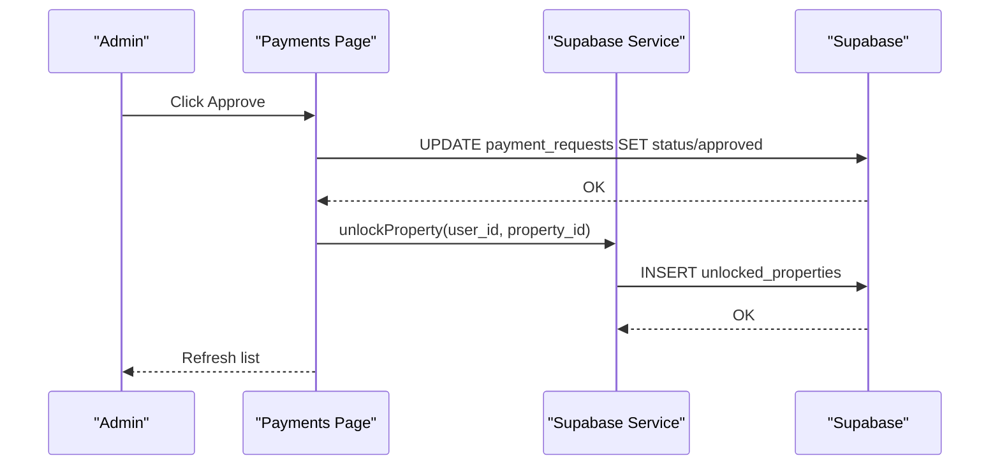
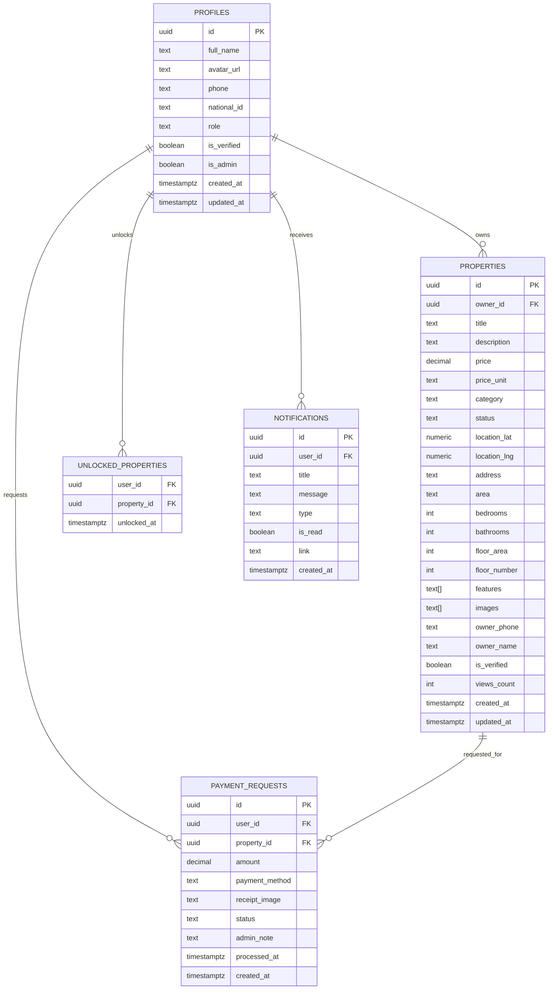
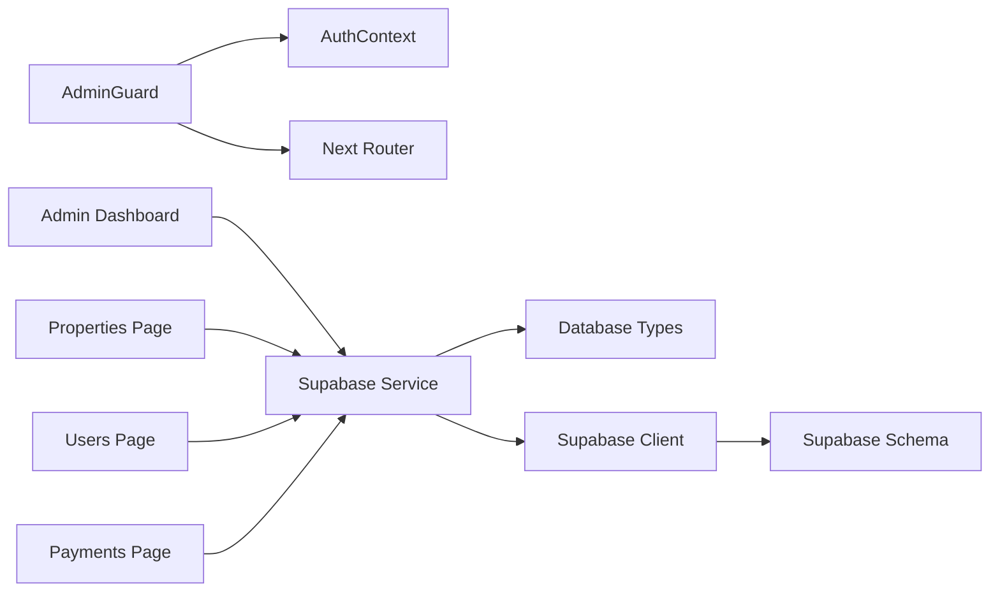

# Admin Dashboard

<cite>
**Referenced Files in This Document**
- [layout.tsx](file://src/app/admin/layout.tsx)
- [page.tsx](file://src/app/admin/page.tsx)
- [AdminGuard.tsx](file://src/components/auth/AdminGuard.tsx)
- [properties/page.tsx](file://src/app/admin/properties/page.tsx)
- [users/page.tsx](file://src/app/admin/users/page.tsx)
- [payments/page.tsx](file://src/app/admin/payments/page.tsx)
- [supabaseService.ts](file://src/services/supabaseService.ts)
- [database.types.ts](file://src/types/database.types.ts)
- [schema.sql](file://supabase/schema.sql)
- [AuthContext.tsx](file://src/context/AuthContext.tsx)
- [providers.tsx](file://src/app/providers.tsx)
- [layout.tsx](file://src/app/layout.tsx)
- [supabase.ts](file://src/lib/supabase.ts)
</cite>

## Table of Contents
1. [Introduction](#introduction)
2. [Project Structure](#project-structure)
3. [Core Components](#core-components)
4. [Architecture Overview](#architecture-overview)
5. [Detailed Component Analysis](#detailed-component-analysis)
6. [Dependency Analysis](#dependency-analysis)
7. [Performance Considerations](#performance-considerations)
8. [Troubleshooting Guide](#troubleshooting-guide)
9. [Conclusion](#conclusion)

## Introduction
This document describes the Admin Dashboard for Gamasa Properties, focusing on administrative workflows for property moderation, user management, payment verification, and analytics reporting. It explains the admin role implementation, access control mechanisms, and how administrators approve or reject property listings, verify users, process payment requests, and monitor system activity. It also outlines UI components, moderation tools, and administrative data management interfaces.

## Project Structure
The admin feature is organized under the Next.js app router as a protected section with dedicated pages for:
- Admin Dashboard overview
- Property moderation
- User management
- Payment verification

Access to the admin area is enforced via a route-level guard that checks authentication and admin privileges.

**Diagram sources**
- [layout.tsx](file://src/app/admin/layout.tsx#L9-L63)
- [AdminGuard.tsx](file://src/components/auth/AdminGuard.tsx#L11-L43)
- [page.tsx](file://src/app/admin/page.tsx#L14-L144)
- [properties/page.tsx](file://src/app/admin/properties/page.tsx#L7-L176)
- [users/page.tsx](file://src/app/admin/users/page.tsx#L10-L156)
- [payments/page.tsx](file://src/app/admin/payments/page.tsx#L23-L241)
- [supabaseService.ts](file://src/services/supabaseService.ts#L153-L800)
- [database.types.ts](file://src/types/database.types.ts#L12-L310)
- [schema.sql](file://supabase/schema.sql#L7-L416)

**Section sources**
- [layout.tsx](file://src/app/admin/layout.tsx#L1-L64)
- [providers.tsx](file://src/app/providers.tsx#L7-L17)
- [AuthContext.tsx](file://src/context/AuthContext.tsx#L22-L194)

## Core Components
- AdminGuard: Enforces admin-only access to the admin area by checking authentication and the profile’s admin flag.
- Admin Layout: Provides the header, navigation, and wrapper around admin pages.
- Admin Pages:
  - Dashboard: Shows summary statistics and recent pending properties.
  - Properties: Lists properties with moderation controls (approve/reject) and preview links.
  - Users: Displays user profiles with verification toggles and admin role promotions/removals.
  - Payments: Lists payment requests with approve/reject actions and receipt previews.
- Supabase Service: Centralized data access layer for properties, users, notifications, and payment requests.
- Database Types and Schema: Define tables, enums, policies, and row-level security for admin-controlled operations.

**Section sources**
- [AdminGuard.tsx](file://src/components/auth/AdminGuard.tsx#L11-L43)
- [layout.tsx](file://src/app/admin/layout.tsx#L9-L63)
- [page.tsx](file://src/app/admin/page.tsx#L14-L144)
- [properties/page.tsx](file://src/app/admin/properties/page.tsx#L7-L176)
- [users/page.tsx](file://src/app/admin/users/page.tsx#L10-L156)
- [payments/page.tsx](file://src/app/admin/payments/page.tsx#L23-L241)
- [supabaseService.ts](file://src/services/supabaseService.ts#L153-L800)
- [database.types.ts](file://src/types/database.types.ts#L12-L310)
- [schema.sql](file://supabase/schema.sql#L7-L416)

## Architecture Overview
The admin dashboard enforces access control at the route level and delegates data operations to a service layer that interacts with Supabase. Admins can moderate content, manage users, and verify payments. The backend schema defines strict row-level security policies that allow admins broad permissions while restricting normal users.

**Diagram sources**
- [AdminGuard.tsx](file://src/components/auth/AdminGuard.tsx#L11-L43)
- [AuthContext.tsx](file://src/context/AuthContext.tsx#L22-L194)
- [layout.tsx](file://src/app/admin/layout.tsx#L9-L63)
- [supabaseService.ts](file://src/services/supabaseService.ts#L153-L800)
- [schema.sql](file://supabase/schema.sql#L306-L336)

## Detailed Component Analysis

### Access Control and Admin Role
- Route-level protection: AdminGuard redirects unauthenticated users or non-admins away from admin routes.
- Authentication context: AuthContext manages user state and exposes authentication status.
- Backend policies: Supabase RLS grants admins full control over properties, payment requests, and notifications.

**Diagram sources**
- [AdminGuard.tsx](file://src/components/auth/AdminGuard.tsx#L11-L43)
- [AuthContext.tsx](file://src/context/AuthContext.tsx#L22-L194)

**Section sources**
- [AdminGuard.tsx](file://src/components/auth/AdminGuard.tsx#L11-L43)
- [AuthContext.tsx](file://src/context/AuthContext.tsx#L22-L194)
- [schema.sql](file://supabase/schema.sql#L306-L336)

### Admin Dashboard
- Purpose: Summarize platform activity with quick links to moderation areas.
- Data: Loads counts for pending properties, total properties, pending payments, and total users.
- UI: Stat cards with navigation, and a recent pending properties list.

**Diagram sources**
- [page.tsx](file://src/app/admin/page.tsx#L24-L48)

**Section sources**
- [page.tsx](file://src/app/admin/page.tsx#L14-L144)

### Property Moderation
- Filters: Pending, available, rejected, all.
- Actions: Approve (set status to available) or Reject (set status to rejected).
- Notifications: Automatically notify property owners upon moderation decisions.
- Preview: Open property in a new tab for review.

**Diagram sources**
- [properties/page.tsx](file://src/app/admin/properties/page.tsx#L31-L56)
- [supabaseService.ts](file://src/services/supabaseService.ts#L393-L415)
- [supabaseService.ts](file://src/services/supabaseService.ts#L618-L637)

**Section sources**
- [properties/page.tsx](file://src/app/admin/properties/page.tsx#L7-L176)
- [supabaseService.ts](file://src/services/supabaseService.ts#L393-L415)
- [supabaseService.ts](file://src/services/supabaseService.ts#L618-L637)

### User Management
- View: Paginated table of all users with roles and verification badges.
- Actions:
  - Toggle verification (verified/unverified).
  - Promote/demote admin privileges.
- Search: Filter users by name or phone.

**Diagram sources**
- [users/page.tsx](file://src/app/admin/users/page.tsx#L19-L45)
- [supabaseService.ts](file://src/services/supabaseService.ts#L697-L737)

**Section sources**
- [users/page.tsx](file://src/app/admin/users/page.tsx#L10-L156)
- [supabaseService.ts](file://src/services/supabaseService.ts#L697-L737)

### Payment Verification
- Filters: Pending, approved, rejected, all.
- Actions: Approve (unlock property for user) or Reject (notify user).
- Receipts: Preview uploaded receipt images.
- Status badges: Visual indicators per request status.

**Diagram sources**
- [payments/page.tsx](file://src/app/admin/payments/page.tsx#L67-L106)
- [supabaseService.ts](file://src/services/supabaseService.ts#L528-L536)

**Section sources**
- [payments/page.tsx](file://src/app/admin/payments/page.tsx#L23-L241)
- [supabaseService.ts](file://src/services/supabaseService.ts#L528-L536)

### Administrative Data Model
The admin system relies on Supabase tables and policies. Key entities include profiles, properties, payment requests, notifications, and unlocked properties. Enums and constraints ensure data integrity, and RLS policies restrict access based on roles and ownership.

**Diagram sources**
- [database.types.ts](file://src/types/database.types.ts#L12-L310)
- [schema.sql](file://supabase/schema.sql#L7-L416)

**Section sources**
- [database.types.ts](file://src/types/database.types.ts#L12-L310)
- [schema.sql](file://supabase/schema.sql#L7-L416)

### Admin Analytics and Monitoring
- Dashboard metrics: Pending properties, total properties, pending payments, total users.
- Recent items: Latest pending properties for quick moderation.
- Notifications: System-wide notifications for admin actions.
- Real-time presence and typing indicators: Messaging infrastructure supports monitoring user engagement.

Note: Analytics reporting and system health monitoring are not implemented in the current codebase. The dashboard currently focuses on moderation and user/payment verification.

**Section sources**
- [page.tsx](file://src/app/admin/page.tsx#L14-L144)
- [supabaseService.ts](file://src/services/supabaseService.ts#L566-L637)
- [supabaseService.ts](file://src/services/supabaseService.ts#L1003-L1038)

## Dependency Analysis
- AdminGuard depends on AuthContext for user state and router for redirection.
- Admin pages depend on Supabase Service for data operations.
- Supabase Service depends on Supabase client and database types.
- Supabase schema defines RLS policies that enforce admin permissions.

**Diagram sources**
- [AdminGuard.tsx](file://src/components/auth/AdminGuard.tsx#L11-L43)
- [AuthContext.tsx](file://src/context/AuthContext.tsx#L22-L194)
- [page.tsx](file://src/app/admin/page.tsx#L14-L144)
- [properties/page.tsx](file://src/app/admin/properties/page.tsx#L7-L176)
- [users/page.tsx](file://src/app/admin/users/page.tsx#L10-L156)
- [payments/page.tsx](file://src/app/admin/payments/page.tsx#L23-L241)
- [supabaseService.ts](file://src/services/supabaseService.ts#L153-L800)
- [database.types.ts](file://src/types/database.types.ts#L12-L310)
- [supabase.ts](file://src/lib/supabase.ts#L18-L28)
- [schema.sql](file://supabase/schema.sql#L306-L336)

**Section sources**
- [AdminGuard.tsx](file://src/components/auth/AdminGuard.tsx#L11-L43)
- [supabaseService.ts](file://src/services/supabaseService.ts#L153-L800)
- [schema.sql](file://supabase/schema.sql#L306-L336)

## Performance Considerations
- Batch operations: The dashboard loads pending and total properties concurrently to reduce latency.
- Local UI updates: User management toggles update the UI immediately after successful API calls to improve responsiveness.
- Lazy loading: Property moderation and payments pages show skeleton loaders during data fetch.
- Image handling: Property images and receipts are served via Supabase storage; ensure appropriate caching and compression.

[No sources needed since this section provides general guidance]

## Troubleshooting Guide
- Access denied:
  - Ensure the user is authenticated and has the admin flag set.
  - Verify Supabase RLS policies for admin permissions.
- Property moderation not applying:
  - Confirm the update operation succeeds and notifications are created.
  - Check property status transitions and owner notifications.
- Payment approval issues:
  - Verify payment request status updates and unlock property insertion.
  - Ensure receipt images are accessible.
- User verification/admin toggles:
  - Confirm userProfile updates and immediate UI refresh.

**Section sources**
- [AdminGuard.tsx](file://src/components/auth/AdminGuard.tsx#L11-L43)
- [properties/page.tsx](file://src/app/admin/properties/page.tsx#L31-L56)
- [payments/page.tsx](file://src/app/admin/payments/page.tsx#L67-L106)
- [users/page.tsx](file://src/app/admin/users/page.tsx#L26-L45)
- [schema.sql](file://supabase/schema.sql#L306-L336)

## Conclusion
Gamasa Properties’ Admin Dashboard provides a focused, secure interface for property moderation, user management, and payment verification. Access control is enforced at the route level with robust backend policies. While analytics and system health monitoring are not yet implemented, the modular structure supports future enhancements. The Supabase-backed service layer centralizes data operations, ensuring maintainability and scalability.