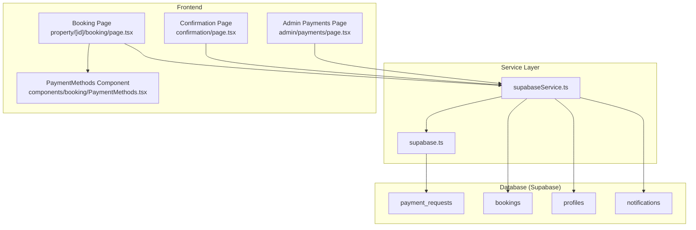
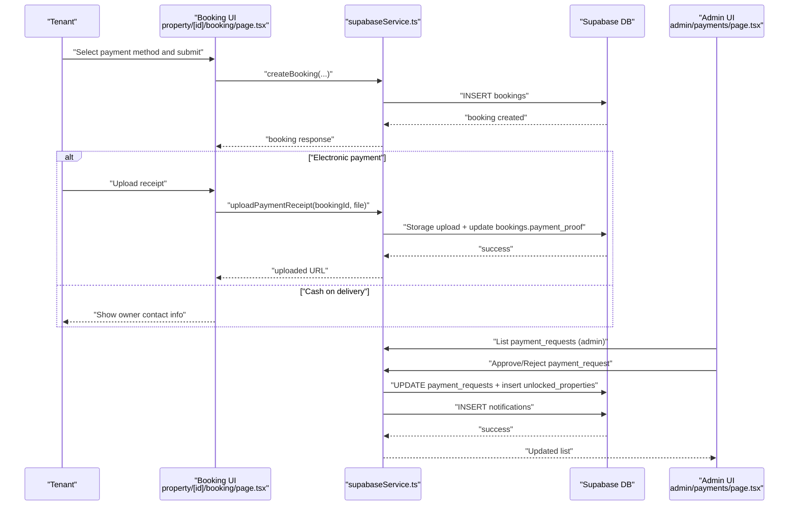
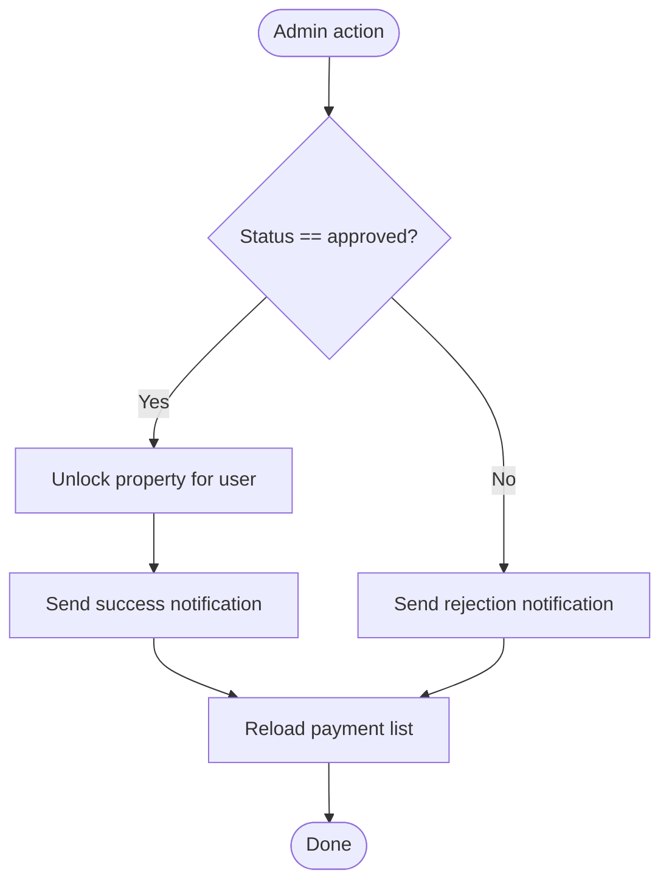
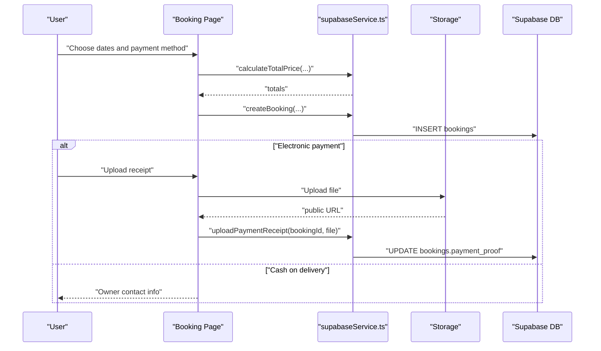
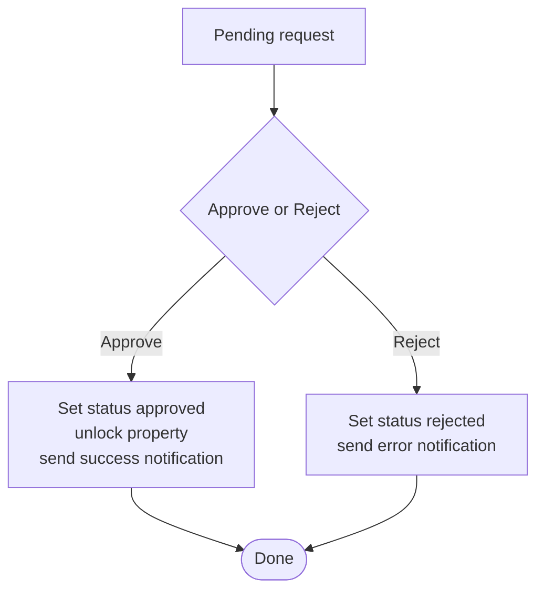
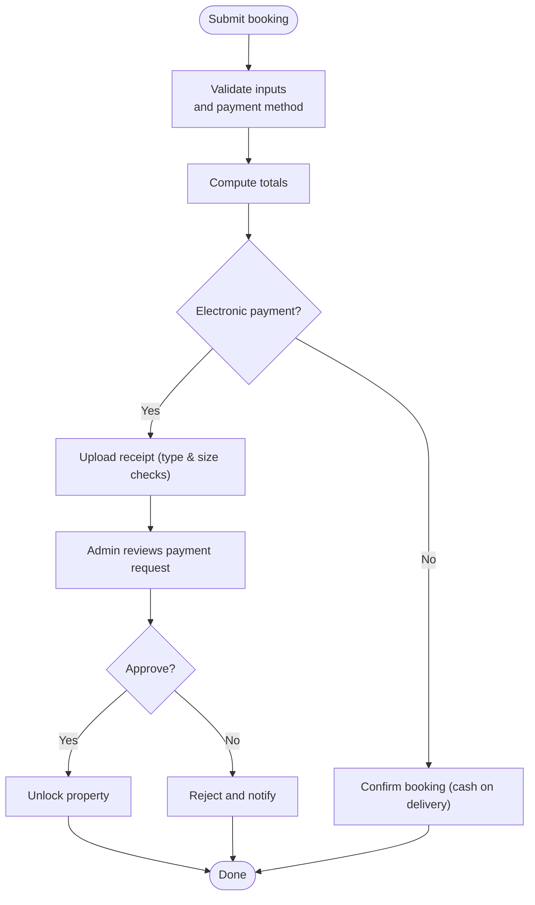
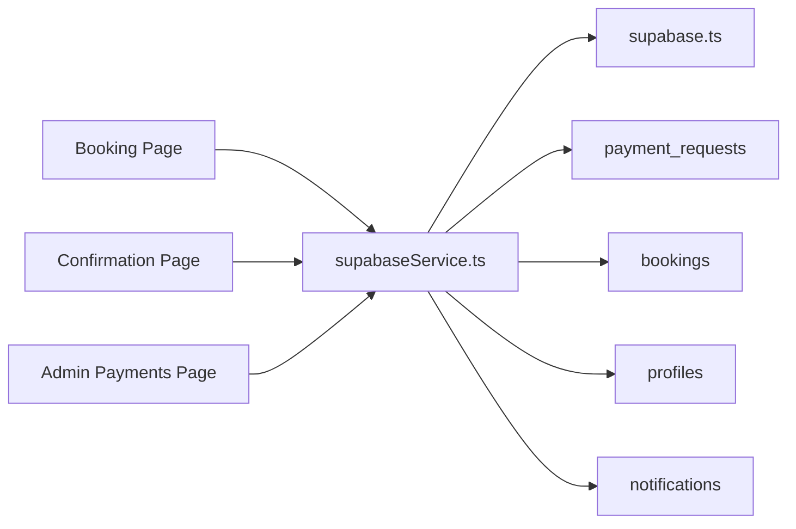

# Payment Verification

<cite>
**Referenced Files in This Document**
- [schema.sql](file://supabase/schema.sql)
- [supabase.ts](file://src/lib/supabase.ts)
- [supabaseService.ts](file://src/services/supabaseService.ts)
- [index.ts](file://src/types/index.ts)
- [page.tsx](file://src/app/admin/payments/page.tsx)
- [page.tsx](file://src/app/property/[id]/booking/page.tsx)
- [page.tsx](file://src/app/property/[id]/booking/confirmation/page.tsx)
- [PaymentMethods.tsx](file://src/components/booking/PaymentMethods.tsx)
</cite>

## Table of Contents
1. [Introduction](#introduction)
2. [Project Structure](#project-structure)
3. [Core Components](#core-components)
4. [Architecture Overview](#architecture-overview)
5. [Detailed Component Analysis](#detailed-component-analysis)
6. [Dependency Analysis](#dependency-analysis)
7. [Performance Considerations](#performance-considerations)
8. [Troubleshooting Guide](#troubleshooting-guide)
9. [Conclusion](#conclusion)

## Introduction
This document describes the payment verification and financial oversight system for the property rental platform. It covers payment request processing, transaction verification workflows, dispute resolution, validation and fraud safeguards, suspicious activity monitoring, reconciliation and reporting, analytics, payouts, and tax documentation. It also documents manual verification, automated processing, and error handling.

## Project Structure
The payment system spans Supabase database tables, a service layer for data operations, and Next.js pages/components for user and admin interactions:
- Database: payment_requests, bookings, profiles, notifications, and related RLS policies
- Service layer: centralized Supabase client and business logic
- Frontend: booking flow, confirmation, and admin payment review UI
- Types: shared TypeScript interfaces for payment, booking, and request entities

**Diagram sources**
- [schema.sql](file://supabase/schema.sql#L116-L128)
- [supabase.ts](file://src/lib/supabase.ts#L1-L68)
- [supabaseService.ts](file://src/services/supabaseService.ts#L538-L563)
- [page.tsx](file://src/app/property/[id]/booking/page.tsx#L1-L551)
- [page.tsx](file://src/app/property/[id]/booking/confirmation/page.tsx#L1-L601)
- [page.tsx](file://src/app/admin/payments/page.tsx#L1-L242)
- [PaymentMethods.tsx](file://src/components/booking/PaymentMethods.tsx#L1-L150)

**Section sources**
- [schema.sql](file://supabase/schema.sql#L116-L128)
- [supabase.ts](file://src/lib/supabase.ts#L1-L68)
- [supabaseService.ts](file://src/services/supabaseService.ts#L538-L563)
- [page.tsx](file://src/app/property/[id]/booking/page.tsx#L1-L551)
- [page.tsx](file://src/app/property/[id]/booking/confirmation/page.tsx#L1-L601)
- [page.tsx](file://src/app/admin/payments/page.tsx#L1-L242)
- [PaymentMethods.tsx](file://src/components/booking/PaymentMethods.tsx#L1-L150)

## Core Components
- Payment request entity: stored in payment_requests with fields for user, property, amount, method, receipt image, status, and timestamps.
- Booking entity: stored in bookings with pricing breakdown, payment method/status, and optional payment proof.
- Service layer: creates payment requests, uploads receipts, updates booking/payment status, unlocks properties, and sends notifications.
- Admin UI: lists pending payment requests, approves or rejects them, and triggers unlocking and notifications.
- Booking UI: selects payment method, calculates totals, submits booking, and handles receipt upload and confirmation.

**Section sources**
- [schema.sql](file://supabase/schema.sql#L116-L128)
- [index.ts](file://src/types/index.ts#L72-L86)
- [index.ts](file://src/types/index.ts#L200-L236)
- [supabaseService.ts](file://src/services/supabaseService.ts#L538-L563)
- [supabaseService.ts](file://src/services/supabaseService.ts#L1265-L1299)
- [page.tsx](file://src/app/admin/payments/page.tsx#L23-L106)
- [page.tsx](file://src/app/property/[id]/booking/page.tsx#L126-L191)
- [page.tsx](file://src/app/property/[id]/booking/confirmation/page.tsx#L48-L79)

## Architecture Overview
End-to-end payment verification and confirmation flow:
- Tenant selects payment method and submits booking
- System calculates totals and creates a booking record
- For electronic payments, tenant uploads a receipt image
- Admin reviews payment requests and either approves or rejects
- On approval, the system unlocks the property for the tenant and notifies them
- On rejection, the system notifies the tenant accordingly

**Diagram sources**
- [page.tsx](file://src/app/property/[id]/booking/page.tsx#L126-L191)
- [supabaseService.ts](file://src/services/supabaseService.ts#L1142-L1210)
- [supabaseService.ts](file://src/services/supabaseService.ts#L1265-L1299)
- [page.tsx](file://src/app/admin/payments/page.tsx#L23-L106)
- [schema.sql](file://supabase/schema.sql#L116-L128)

## Detailed Component Analysis

### Payment Request Processing
- Creation: The service inserts a payment request with user, property, amount, method, and optional receipt image.
- Listing and filtering: Admin page queries payment_requests with joined property and profile data, supports filtering by status.
- Approval/rejection: Updates status and processed timestamp; on approval, unlocks property and sends a success notification; on rejection, sends an error notification.

**Diagram sources**
- [page.tsx](file://src/app/admin/payments/page.tsx#L67-L106)
- [supabaseService.ts](file://src/services/supabaseService.ts#L528-L536)
- [supabaseService.ts](file://src/services/supabaseService.ts#L618-L637)

**Section sources**
- [supabaseService.ts](file://src/services/supabaseService.ts#L538-L563)
- [page.tsx](file://src/app/admin/payments/page.tsx#L23-L106)

### Transaction Verification Workflows
- Electronic payments: Tenant uploads receipt image; admin approves payment request to unlock property.
- Cash-on-delivery: Booking is confirmed immediately; owner contact details are shown for pickup coordination.
- Availability and totals: The service computes base price, service fee, optional deposit, and total based on rental type and dates.

**Diagram sources**
- [page.tsx](file://src/app/property/[id]/booking/page.tsx#L113-L191)
- [supabaseService.ts](file://src/services/supabaseService.ts#L1054-L1111)
- [supabaseService.ts](file://src/services/supabaseService.ts#L1265-L1299)
- [page.tsx](file://src/app/property/[id]/booking/confirmation/page.tsx#L48-L79)

**Section sources**
- [page.tsx](file://src/app/property/[id]/booking/page.tsx#L113-L191)
- [supabaseService.ts](file://src/services/supabaseService.ts#L1054-L1111)
- [supabaseService.ts](file://src/services/supabaseService.ts#L1265-L1299)
- [page.tsx](file://src/app/property/[id]/booking/confirmation/page.tsx#L115-L188)

### Payment Dispute Resolution Procedures
- Pending review: Admin filters and reviews payment requests.
- Approve: Marks request approved, unlocks property, and notifies the tenant.
- Reject: Marks request rejected and notifies the tenant with guidance.
- Notifications: Centralized creation of notifications for admin actions.

**Diagram sources**
- [page.tsx](file://src/app/admin/payments/page.tsx#L67-L106)
- [supabaseService.ts](file://src/services/supabaseService.ts#L618-L637)

**Section sources**
- [page.tsx](file://src/app/admin/payments/page.tsx#L67-L106)
- [supabaseService.ts](file://src/services/supabaseService.ts#L618-L637)

### Payment Method Validation and Fraud Detection
- Supported methods: vodafone_cash, instapay, fawry (request), vodafone_cash, instapay, cash_on_delivery (booking).
- Validation: UI enforces selection of payment method; totals computed server-side; receipt uploads validated by file type and size.
- Fraud safeguards: Admin review of payment requests; property unlocking only after approval; notifications for outcomes; storage bucket separation for receipts and media.

**Diagram sources**
- [PaymentMethods.tsx](file://src/components/booking/PaymentMethods.tsx#L1-L150)
- [page.tsx](file://src/app/property/[id]/booking/page.tsx#L135-L138)
- [page.tsx](file://src/app/property/[id]/booking/confirmation/page.tsx#L48-L79)
- [page.tsx](file://src/app/admin/payments/page.tsx#L67-L106)

**Section sources**
- [PaymentMethods.tsx](file://src/components/booking/PaymentMethods.tsx#L1-L150)
- [page.tsx](file://src/app/property/[id]/booking/page.tsx#L135-L138)
- [page.tsx](file://src/app/property/[id]/booking/confirmation/page.tsx#L48-L79)
- [page.tsx](file://src/app/admin/payments/page.tsx#L67-L106)

### Suspicious Activity Monitoring
- RLS policies restrict visibility of payment requests to owners and admins.
- Admins can manage payment requests and notifications.
- Storage buckets isolate payment receipts and chat media to support audit trails.

**Section sources**
- [schema.sql](file://supabase/schema.sql#L218-L224)
- [schema.sql](file://supabase/schema.sql#L306-L325)
- [supabase.ts](file://src/lib/supabase.ts#L34-L67)

### Payment Reconciliation, Revenue Tracking, and Reporting
- Revenue tracking: Totals include base price, service fee, and optional deposit; stored in booking records.
- Reconciliation: Admins approve/reject payment requests; upon approval, property unlocks and notifications are sent.
- Reporting: Notifications and booking records provide audit trails; future extensions can leverage Supabase RPCs and RLS for reports.

**Section sources**
- [index.ts](file://src/types/index.ts#L217-L221)
- [supabaseService.ts](file://src/services/supabaseService.ts#L1054-L1111)
- [page.tsx](file://src/app/admin/payments/page.tsx#L78-L98)

### Payment Analytics, Payout Management, and Tax Documentation
- Analytics: Totals and durations enable basic analytics; future analytics dashboards can visualize trends and anomalies.
- Payouts: The current schema does not define payouts; future designs can introduce payout requests and statuses.
- Tax documentation: Receipt images and booking records serve as evidence; future tax features can link receipts to tax periods.

[No sources needed since this section provides general guidance]

### Manual Payment Verification and Automated Processing
- Manual: Admin UI filters and updates payment request status; unlocks property and sends notifications.
- Automated: Booking creation and totals computation occur automatically; receipt uploads are validated before linking to bookings.

**Section sources**
- [page.tsx](file://src/app/admin/payments/page.tsx#L23-L106)
- [supabaseService.ts](file://src/services/supabaseService.ts#L1142-L1210)
- [page.tsx](file://src/app/property/[id]/booking/confirmation/page.tsx#L48-L79)

### Payment Error Handling
- Client-side: Form validation prevents submission without required fields; errors are surfaced to the user.
- Service-side: Uploads and DB operations return errors; UI alerts inform users of failures.
- Logging: Console logging captures errors during loading and updates.

**Section sources**
- [page.tsx](file://src/app/property/[id]/booking/page.tsx#L135-L138)
- [page.tsx](file://src/app/property/[id]/booking/confirmation/page.tsx#L67-L76)
- [page.tsx](file://src/app/admin/payments/page.tsx#L60-L64)
- [page.tsx](file://src/app/admin/payments/page.tsx#L101-L105)

## Dependency Analysis
- Database dependencies: payment_requests, bookings, profiles, notifications, and RLS policies.
- Service dependencies: Supabase client initialization and storage helpers.
- UI dependencies: Booking and Confirmation pages depend on service methods; Admin page depends on service and local state.

**Diagram sources**
- [supabase.ts](file://src/lib/supabase.ts#L1-L68)
- [supabaseService.ts](file://src/services/supabaseService.ts#L538-L563)
- [schema.sql](file://supabase/schema.sql#L116-L128)

**Section sources**
- [supabase.ts](file://src/lib/supabase.ts#L1-L68)
- [supabaseService.ts](file://src/services/supabaseService.ts#L538-L563)
- [schema.sql](file://supabase/schema.sql#L116-L128)

## Performance Considerations
- Minimize redundant queries: Batch reads/writes where possible; use joins judiciously.
- Optimize storage: Use appropriate bucket names and enforce file size/type checks early.
- Caching: Consider caching frequently accessed property and booking summaries.
- RLS overhead: Keep policies simple; avoid expensive expressions in policies.

[No sources needed since this section provides general guidance]

## Troubleshooting Guide
- Missing environment variables: The Supabase client logs warnings if required variables are missing; ensure NEXT_PUBLIC_SUPABASE_URL and NEXT_PUBLIC_SUPABASE_ANON_KEY are configured.
- Upload failures: Receipt uploads validate file type and size; confirm file constraints and network connectivity.
- Admin actions: If approvals fail, check console logs for errors and verify RLS permissions.

**Section sources**
- [supabase.ts](file://src/lib/supabase.ts#L7-L15)
- [page.tsx](file://src/app/property/[id]/booking/confirmation/page.tsx#L53-L63)
- [page.tsx](file://src/app/admin/payments/page.tsx#L101-L105)

## Conclusion
The payment verification system integrates booking totals, receipt uploads, admin review, and property unlocking with robust RLS and notifications. Extending the schema and service layer can add payouts, analytics dashboards, and tax documentation while preserving the current manual verification and automated processing workflows.