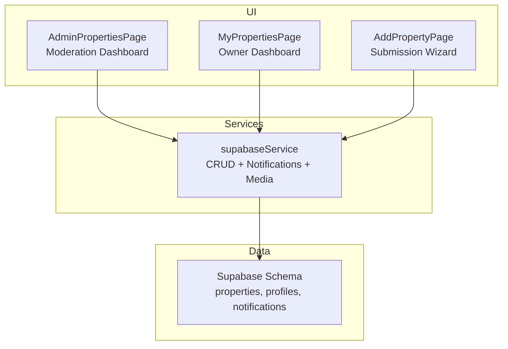
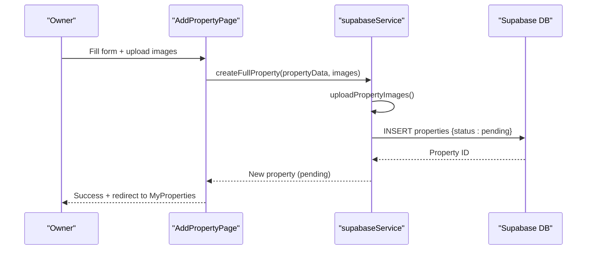
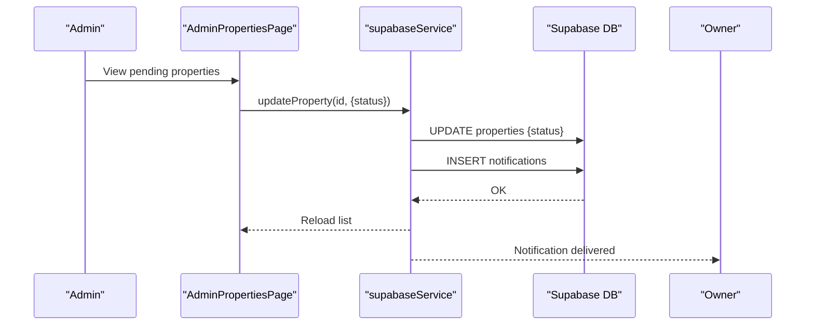
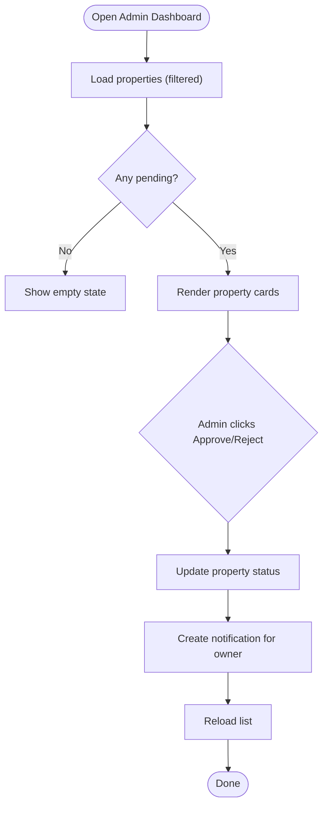
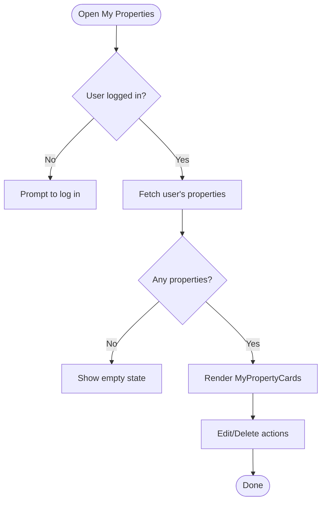
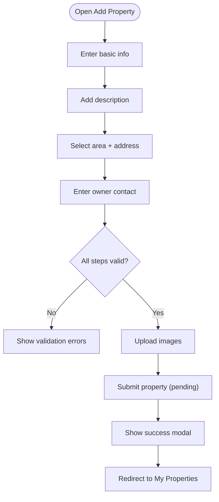
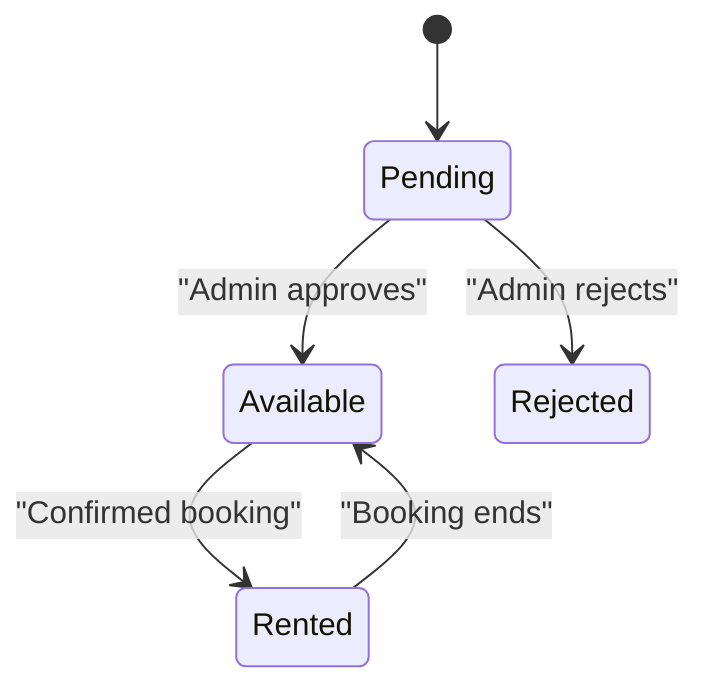
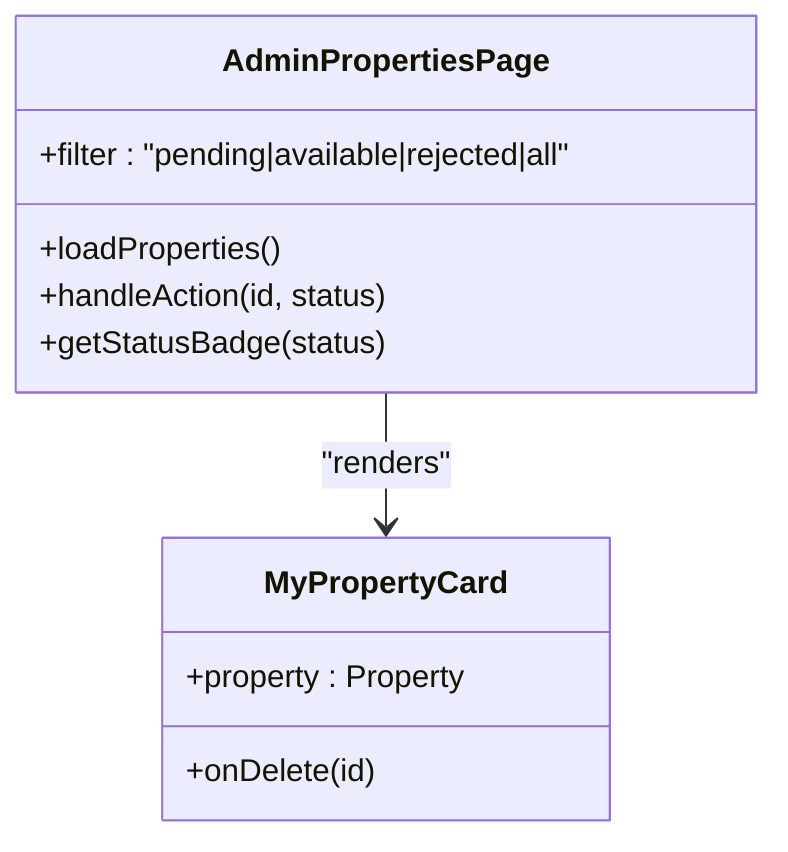
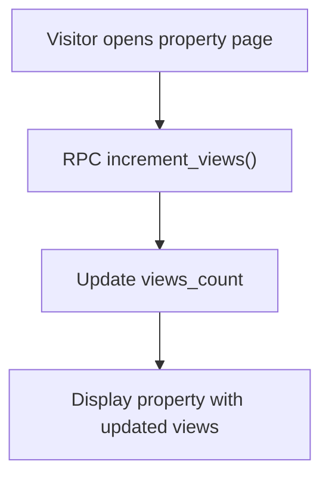
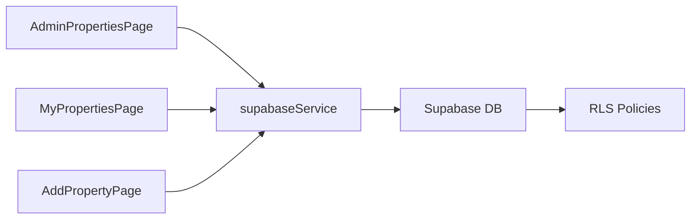

# Property Moderation

<cite>
**Referenced Files in This Document**
- [AdminPropertiesPage](file://src/app/admin/properties/page.tsx)
- [MyPropertiesPage](file://src/app/my-properties/page.tsx)
- [AddPropertyPage](file://src/app/add-property/page.tsx)
- [supabaseService](file://src/services/supabaseService.ts)
- [database.types.ts](file://src/types/database.types.ts)
- [schema.sql](file://supabase/schema.sql)
- [MyPropertyCard](file://src/components/MyPropertyCard.tsx)
</cite>

## Table of Contents
1. [Introduction](#introduction)
2. [Project Structure](#project-structure)
3. [Core Components](#core-components)
4. [Architecture Overview](#architecture-overview)
5. [Detailed Component Analysis](#detailed-component-analysis)
6. [Dependency Analysis](#dependency-analysis)
7. [Performance Considerations](#performance-considerations)
8. [Troubleshooting Guide](#troubleshooting-guide)
9. [Conclusion](#conclusion)
10. [Appendices](#appendices)

## Introduction
This document explains the property moderation system in the application. It covers the property approval workflow, pending property review processes, moderation tools, status management, verification procedures, content quality standards, moderation interface components, bulk actions, automated filtering, rejection reasons, appeals, re-submission workflows, and analytics/performance metrics for property managers.

## Project Structure
The moderation system spans UI pages, a service layer, and the Supabase schema:
- Admin moderation UI: lists pending properties and allows approvals or rejections.
- Owner property management UI: displays owned properties and their statuses.
- Property submission UI: collects property data and images, then submits for moderation.
- Service layer: orchestrates property queries, updates, notifications, and media uploads.
- Database schema: defines property lifecycle, statuses, and RLS policies.

**Diagram sources**
- [AdminPropertiesPage](file://src/app/admin/properties/page.tsx#L1-L177)
- [MyPropertiesPage](file://src/app/my-properties/page.tsx#L1-L211)
- [AddPropertyPage](file://src/app/add-property/page.tsx#L1-L538)
- [supabaseService](file://src/services/supabaseService.ts#L1-L1384)
- [schema.sql](file://supabase/schema.sql#L41-L92)

**Section sources**
- [AdminPropertiesPage](file://src/app/admin/properties/page.tsx#L1-L177)
- [MyPropertiesPage](file://src/app/my-properties/page.tsx#L1-L211)
- [AddPropertyPage](file://src/app/add-property/page.tsx#L1-L538)
- [supabaseService](file://src/services/supabaseService.ts#L1-L1384)
- [schema.sql](file://supabase/schema.sql#L41-L92)

## Core Components
- Admin moderation dashboard:
  - Filters properties by status (pending, available, rejected, all).
  - Approves or rejects pending properties.
  - Sends notifications to owners upon decisions.
- Owner property management:
  - Lists owned properties with status badges and metadata.
  - Provides quick links to edit or delete.
- Property submission:
  - Multi-step form collecting basic info, details, location, and contact.
  - Uploads images and stores property with pending status.
- Service layer:
  - Fetches properties with optional filters.
  - Updates property status and sends notifications.
  - Handles image uploads and deletions.
- Database schema:
  - Enforces property statuses and RLS policies for visibility and moderation.

**Section sources**
- [AdminPropertiesPage](file://src/app/admin/properties/page.tsx#L1-L177)
- [MyPropertiesPage](file://src/app/my-properties/page.tsx#L1-L211)
- [AddPropertyPage](file://src/app/add-property/page.tsx#L1-L538)
- [supabaseService](file://src/services/supabaseService.ts#L313-L440)
- [database.types.ts](file://src/types/database.types.ts#L53-L132)
- [schema.sql](file://supabase/schema.sql#L41-L92)

## Architecture Overview
The moderation workflow connects UI pages to the service layer and database. Pending submissions are reviewed by admins; decisions trigger notifications and status updates.

**Diagram sources**
- [AddPropertyPage](file://src/app/add-property/page.tsx#L86-L156)
- [supabaseService](file://src/services/supabaseService.ts#L259-L311)
- [schema.sql](file://supabase/schema.sql#L42-L67)

**Diagram sources**
- [AdminPropertiesPage](file://src/app/admin/properties/page.tsx#L31-L56)
- [supabaseService](file://src/services/supabaseService.ts#L393-L415)
- [schema.sql](file://supabase/schema.sql#L141-L151)

## Detailed Component Analysis

### Admin Moderation Dashboard
- Purpose: Review and moderate pending properties.
- Features:
  - Filter by status (pending, available, rejected, all).
  - Approve or reject a property with a single click.
  - Preview property in a new tab.
  - Status badges per property.
- Behavior:
  - Loads properties with optional status filter.
  - On action, updates status and creates a notification for the owner.
  - Re-fetches list after action.

**Diagram sources**
- [AdminPropertiesPage](file://src/app/admin/properties/page.tsx#L13-L56)

**Section sources**
- [AdminPropertiesPage](file://src/app/admin/properties/page.tsx#L1-L177)
- [supabaseService](file://src/services/supabaseService.ts#L313-L358)
- [supabaseService](file://src/services/supabaseService.ts#L393-L415)
- [supabaseService](file://src/services/supabaseService.ts#L618-L637)

### Owner Property Management
- Purpose: View owned properties and manage them.
- Features:
  - List owned properties with status badges.
  - View views count and creation date.
  - Edit or delete property.
- Behavior:
  - Loads properties for the logged-in user.
  - Supports mock and real data modes.

**Diagram sources**
- [MyPropertiesPage](file://src/app/my-properties/page.tsx#L18-L55)
- [MyPropertyCard](file://src/components/MyPropertyCard.tsx#L11-L83)

**Section sources**
- [MyPropertiesPage](file://src/app/my-properties/page.tsx#L1-L211)
- [MyPropertyCard](file://src/components/MyPropertyCard.tsx#L1-L83)

### Property Submission Workflow
- Purpose: Allow owners to submit properties for moderation.
- Steps:
  - Basic info: title, category, price, unit, images.
  - Details: description.
  - Location: area and address.
  - Contact: owner name and phone.
- Behavior:
  - Validates required fields per step.
  - Uploads images via service.
  - Submits property with pending status.
  - Shows success modal and redirects.

**Diagram sources**
- [AddPropertyPage](file://src/app/add-property/page.tsx#L158-L188)
- [AddPropertyPage](file://src/app/add-property/page.tsx#L51-L66)
- [AddPropertyPage](file://src/app/add-property/page.tsx#L86-L156)

**Section sources**
- [AddPropertyPage](file://src/app/add-property/page.tsx#L1-L538)
- [supabaseService](file://src/services/supabaseService.ts#L259-L311)

### Property Status Management
- Statuses:
  - Pending: awaiting admin review.
  - Available: approved and visible to guests.
  - Rejected: not approved; owner receives notification.
  - Rented: reserved by a booking.
- Visibility:
  - Approved properties are publicly viewable.
  - Owners can see their own properties regardless of status.

**Diagram sources**
- [database.types.ts](file://src/types/database.types.ts#L62-L62)
- [schema.sql](file://supabase/schema.sql#L198-L210)

**Section sources**
- [database.types.ts](file://src/types/database.types.ts#L53-L132)
- [schema.sql](file://supabase/schema.sql#L41-L92)
- [schema.sql](file://supabase/schema.sql#L198-L210)

### Moderation Tools and Interfaces
- Admin moderation card:
  - Displays property preview, metadata, and status.
  - Approve/Reject buttons for pending items.
  - Preview link to property page.
- Owner property card:
  - Shows status badge, views count, and creation date.
  - Edit and delete actions.

**Diagram sources**
- [AdminPropertiesPage](file://src/app/admin/properties/page.tsx#L7-L71)
- [MyPropertyCard](file://src/components/MyPropertyCard.tsx#L6-L9)

**Section sources**
- [AdminPropertiesPage](file://src/app/admin/properties/page.tsx#L73-L177)
- [MyPropertyCard](file://src/components/MyPropertyCard.tsx#L11-L83)

### Automated Filtering and Bulk Actions
- Filtering:
  - Admin dashboard supports filtering by status.
  - Service layer supports filters for status, category, area, price range, bedrooms/bathrooms, features, and owner ID.
- Bulk actions:
  - Current implementation supports per-item approve/reject.
  - No multi-select bulk actions are implemented in the UI.

**Section sources**
- [AdminPropertiesPage](file://src/app/admin/properties/page.tsx#L11-L29)
- [supabaseService](file://src/services/supabaseService.ts#L313-L358)

### Content Quality Standards and Verification
- Submission requirements:
  - Title, price, description, area, address, owner contact, and at least one image are required during submission.
- Verification:
  - Property verification flag exists in the schema; however, no explicit verification UI or workflow is implemented in the current code.

**Section sources**
- [AddPropertyPage](file://src/app/add-property/page.tsx#L98-L103)
- [AddPropertyPage](file://src/app/add-property/page.tsx#L158-L178)
- [database.types.ts](file://src/types/database.types.ts#L75-L75)
- [schema.sql](file://supabase/schema.sql#L63-L63)

### Property Rejection Reasons and Appeals
- Rejection handling:
  - Admin can reject a property; a notification is created for the owner.
  - No explicit rejection reason field is exposed in the current UI.
- Appeals:
  - No dedicated appeal workflow is implemented in the current code.

**Section sources**
- [AdminPropertiesPage](file://src/app/admin/properties/page.tsx#L31-L56)
- [supabaseService](file://src/services/supabaseService.ts#L618-L637)

### Re-submission Workflows
- After rejection, owners can edit and resubmit via the edit link in their property list.
- The system does not enforce a cooldown or restriction on re-submissions.

**Section sources**
- [MyPropertyCard](file://src/components/MyPropertyCard.tsx#L70-L77)

### Analytics and Performance Metrics
- Views counter:
  - Properties maintain a views_count field.
  - A stored procedure increments views on property visits.
- Owner insights:
  - Owner dashboards show views count and creation date per property.
- Additional metrics:
  - No built-in trending listings or admin analytics are implemented.

**Diagram sources**
- [schema.sql](file://supabase/schema.sql#L297-L304)
- [supabaseService](file://src/services/supabaseService.ts#L378-L391)
- [MyPropertyCard](file://src/components/MyPropertyCard.tsx#L47-L54)

**Section sources**
- [database.types.ts](file://src/types/database.types.ts#L76-L76)
- [schema.sql](file://supabase/schema.sql#L64-L64)
- [supabaseService](file://src/services/supabaseService.ts#L378-L391)
- [MyPropertyCard](file://src/components/MyPropertyCard.tsx#L47-L54)

## Dependency Analysis
- UI depends on the service layer for data and mutations.
- Service layer depends on Supabase for persistence and storage.
- Database enforces property lifecycle and access policies.

**Diagram sources**
- [AdminPropertiesPage](file://src/app/admin/properties/page.tsx#L3-L5)
- [MyPropertiesPage](file://src/app/my-properties/page.tsx#L3-L10)
- [AddPropertyPage](file://src/app/add-property/page.tsx#L3-L8)
- [supabaseService](file://src/services/supabaseService.ts#L1-L10)
- [schema.sql](file://supabase/schema.sql#L170-L250)

**Section sources**
- [AdminPropertiesPage](file://src/app/admin/properties/page.tsx#L1-L177)
- [MyPropertiesPage](file://src/app/my-properties/page.tsx#L1-L211)
- [AddPropertyPage](file://src/app/add-property/page.tsx#L1-L538)
- [supabaseService](file://src/services/supabaseService.ts#L1-L1384)
- [schema.sql](file://supabase/schema.sql#L170-L250)

## Performance Considerations
- Filtering:
  - Use indexed columns (status, category, area) to optimize queries.
- Images:
  - Batch upload promises and deduplicate URLs to reduce redundant operations.
- Notifications:
  - Keep notification payloads minimal to avoid large writes.
- Views:
  - Prefer RPC increment to minimize contention; fallback to direct update if RPC fails.

[No sources needed since this section provides general guidance]

## Troubleshooting Guide
- Property not appearing after approval:
  - Verify status is available and RLS allows public select for approved properties.
- Approval/rejection not reflected:
  - Confirm updateProperty succeeded and notifications were inserted.
- Images failing to upload:
  - Check upload permissions and storage bucket configuration.
- Views not incrementing:
  - Ensure RPC exists and is callable; fallback update logic is executed on error.

**Section sources**
- [schema.sql](file://supabase/schema.sql#L198-L200)
- [supabaseService](file://src/services/supabaseService.ts#L393-L415)
- [supabaseService](file://src/services/supabaseService.ts#L618-L637)
- [supabaseService](file://src/services/supabaseService.ts#L231-L248)
- [supabaseService](file://src/services/supabaseService.ts#L378-L391)

## Conclusion
The property moderation system centers on a simple, effective workflow: owners submit properties with pending status, admins review and decide, and owners receive notifications. The service layer and schema support status transitions, visibility controls, and owner insights. Future enhancements could include rejection reasons, appeals, bulk moderation actions, and analytics dashboards.

## Appendices
- Property status lifecycle and visibility rules are enforced by database policies.
- Owner dashboards expose views count and creation date for performance monitoring.

**Section sources**
- [schema.sql](file://supabase/schema.sql#L198-L210)
- [MyPropertyCard](file://src/components/MyPropertyCard.tsx#L47-L54)