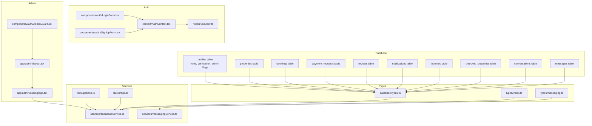
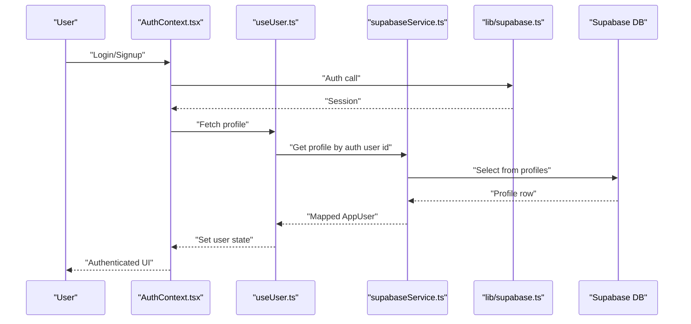
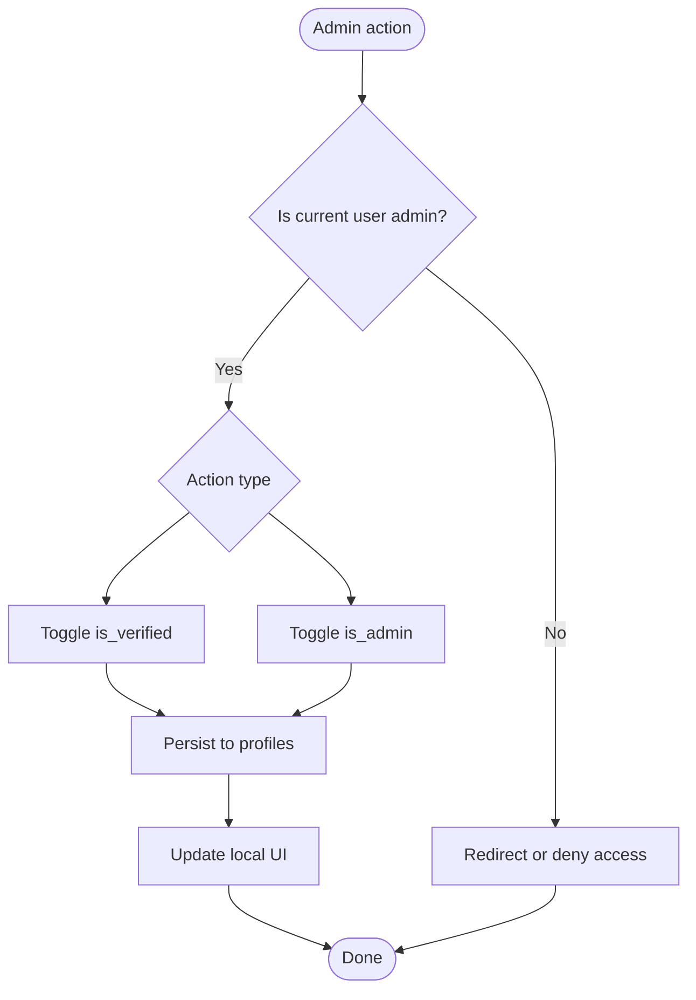
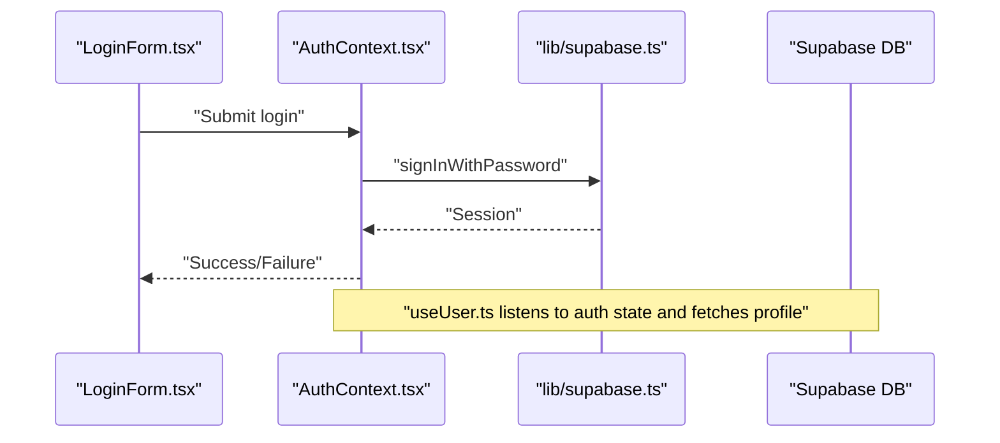
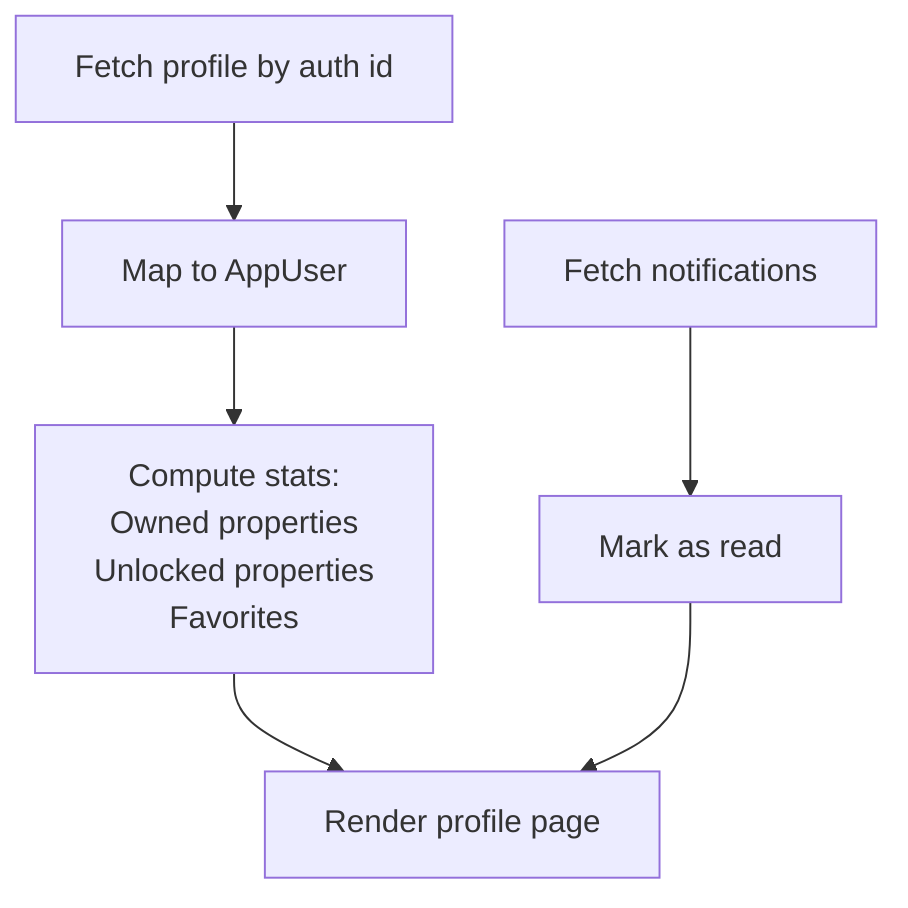
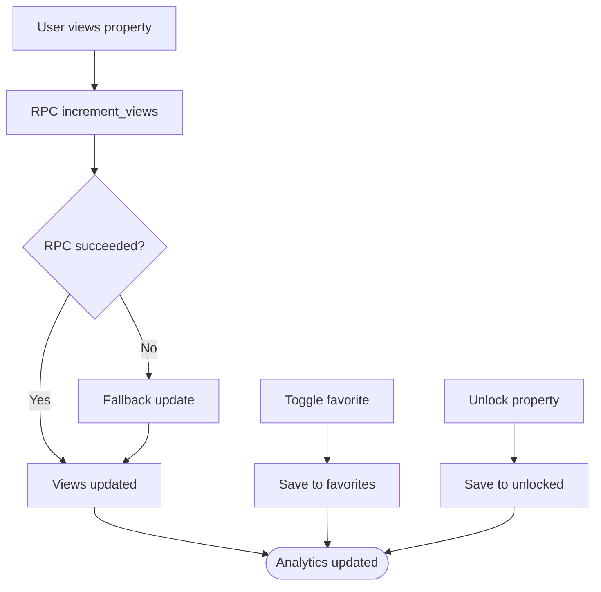
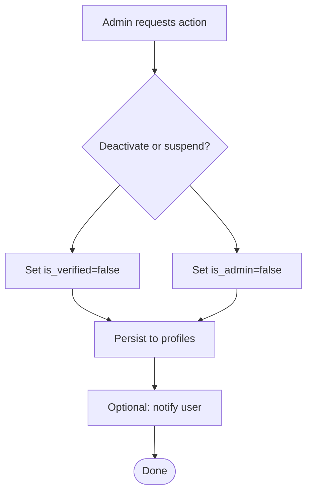
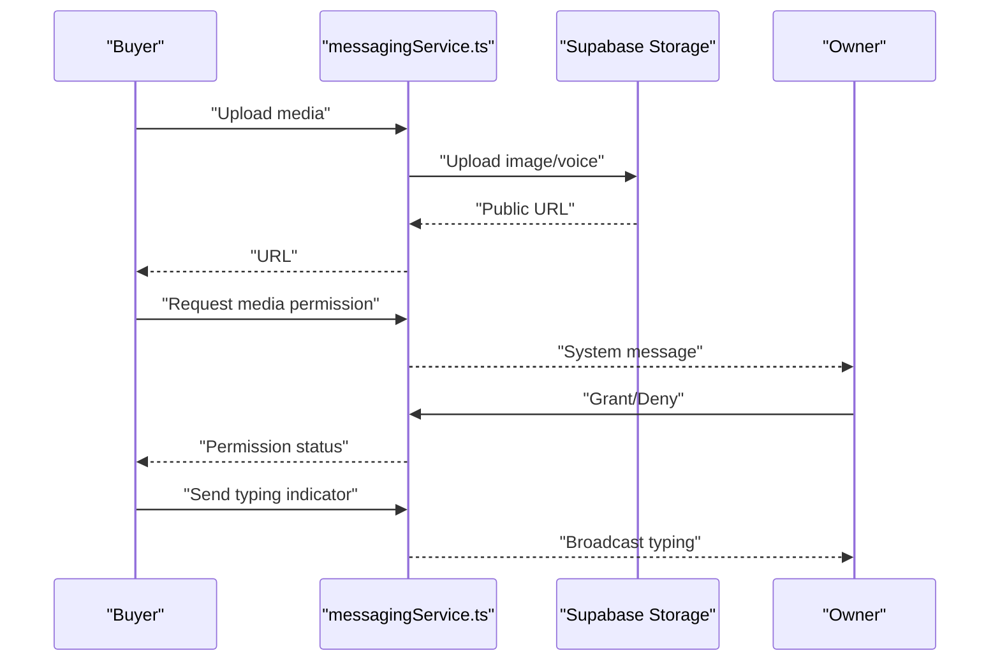
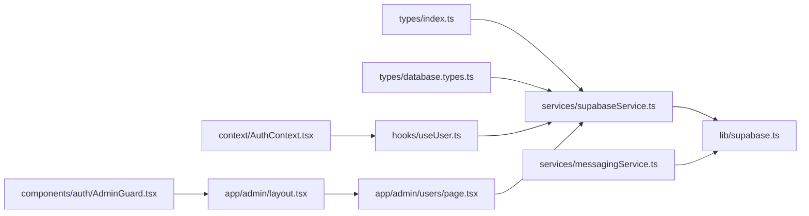
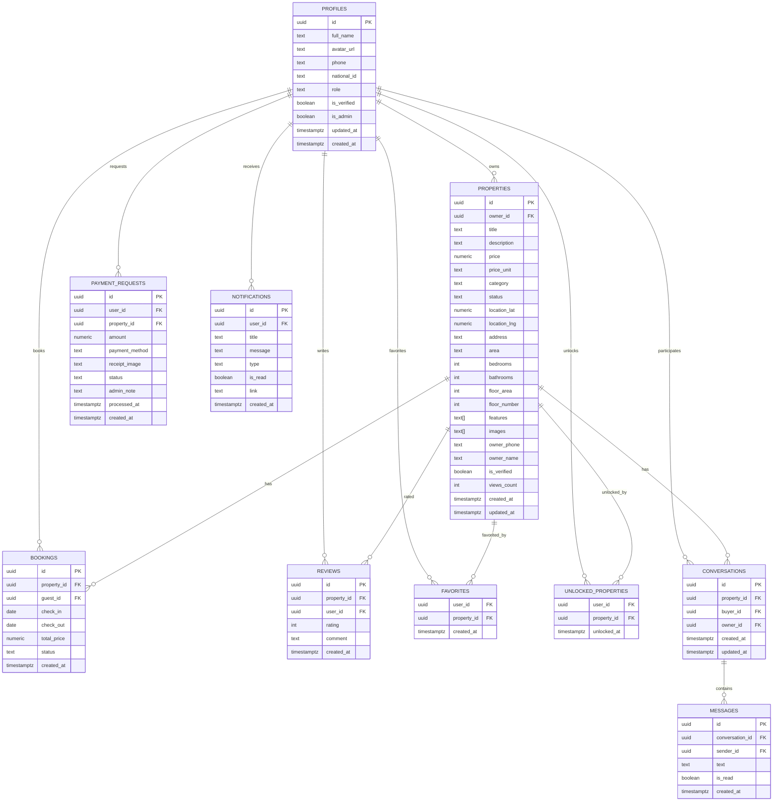

# User Management

<cite>
**Referenced Files in This Document**
- [schema.sql](file://supabase/schema.sql)
- [database.types.ts](file://src/types/database.types.ts)
- [AuthContext.tsx](file://src/context/AuthContext.tsx)
- [useUser.ts](file://src/hooks/useUser.ts)
- [supabase.ts](file://src/lib/supabase.ts)
- [storage.ts](file://src/lib/storage.ts)
- [supabaseService.ts](file://src/services/supabaseService.ts)
- [AdminGuard.tsx](file://src/components/auth/AdminGuard.tsx)
- [AdminLayout.tsx](file://src/app/admin/layout.tsx)
- [users/page.tsx](file://src/app/admin/users/page.tsx)
- [messagingService.ts](file://src/services/messagingService.ts)
- [messaging.ts](file://src/types/messaging.ts)
- [LoginForm.tsx](file://src/components/auth/LoginForm.tsx)
- [SignUpForm.tsx](file://src/components/auth/SignUpForm.tsx)
- [profile/page.tsx](file://src/app/profile/page.tsx)
- [index.ts](file://src/types/index.ts)
</cite>

## Table of Contents
1. [Introduction](#introduction)
2. [Project Structure](#project-structure)
3. [Core Components](#core-components)
4. [Architecture Overview](#architecture-overview)
5. [Detailed Component Analysis](#detailed-component-analysis)
6. [Dependency Analysis](#dependency-analysis)
7. [Performance Considerations](#performance-considerations)
8. [Troubleshooting Guide](#troubleshooting-guide)
9. [Conclusion](#conclusion)
10. [Appendices](#appendices)

## Introduction
This document describes the user management system for the real estate platform. It covers user roles (tenant, landlord, admin), user verification, account status management, profile monitoring, activity tracking, behavioral analytics, suspension/deactivation procedures, account recovery, communication tools, demographics reporting, registration analytics, engagement metrics, support workflows, complaints, and community moderation.

## Project Structure
The user management system spans Supabase database definitions, TypeScript types, authentication contexts, service abstractions, admin UI, and messaging infrastructure.

**Diagram sources**
- [schema.sql](file://supabase/schema.sql#L8-L19)
- [database.types.ts](file://src/types/database.types.ts#L14-L52)
- [supabase.ts](file://src/lib/supabase.ts#L1-L68)
- [storage.ts](file://src/lib/storage.ts#L1-L633)
- [supabaseService.ts](file://src/services/supabaseService.ts#L153-L737)
- [messagingService.ts](file://src/services/messagingService.ts#L1-L123)
- [AuthContext.tsx](file://src/context/AuthContext.tsx#L1-L195)
- [useUser.ts](file://src/hooks/useUser.ts#L1-L178)
- [LoginForm.tsx](file://src/components/auth/LoginForm.tsx#L1-L220)
- [SignUpForm.tsx](file://src/components/auth/SignUpForm.tsx#L1-L274)
- [AdminGuard.tsx](file://src/components/auth/AdminGuard.tsx#L1-L44)
- [AdminLayout.tsx](file://src/app/admin/layout.tsx#L1-L64)
- [users/page.tsx](file://src/app/admin/users/page.tsx#L1-L157)

**Section sources**
- [schema.sql](file://supabase/schema.sql#L1-L416)
- [database.types.ts](file://src/types/database.types.ts#L1-L310)
- [supabase.ts](file://src/lib/supabase.ts#L1-L68)
- [storage.ts](file://src/lib/storage.ts#L1-L633)
- [supabaseService.ts](file://src/services/supabaseService.ts#L153-L737)
- [messagingService.ts](file://src/services/messagingService.ts#L1-L123)
- [AuthContext.tsx](file://src/context/AuthContext.tsx#L1-L195)
- [useUser.ts](file://src/hooks/useUser.ts#L1-L178)
- [LoginForm.tsx](file://src/components/auth/LoginForm.tsx#L1-L220)
- [SignUpForm.tsx](file://src/components/auth/SignUpForm.tsx#L1-L274)
- [AdminGuard.tsx](file://src/components/auth/AdminGuard.tsx#L1-L44)
- [AdminLayout.tsx](file://src/app/admin/layout.tsx#L1-L64)
- [users/page.tsx](file://src/app/admin/users/page.tsx#L1-L157)

## Core Components
- Database schema defines user profiles with role, verification, and admin flags, plus related entities for properties, bookings, payments, reviews, notifications, favorites, and unlocked properties.
- Supabase client and service layer abstract database operations and provide typed access to entities.
- Authentication contexts manage login, registration, and session state, mapping Supabase sessions to application user profiles.
- Admin guard enforces admin-only access to administrative areas.
- Messaging service supports media uploads, permission requests, typing indicators, and real-time channels.

**Section sources**
- [schema.sql](file://supabase/schema.sql#L8-L19)
- [database.types.ts](file://src/types/database.types.ts#L14-L52)
- [supabase.ts](file://src/lib/supabase.ts#L1-L68)
- [supabaseService.ts](file://src/services/supabaseService.ts#L153-L737)
- [AuthContext.tsx](file://src/context/AuthContext.tsx#L1-L195)
- [useUser.ts](file://src/hooks/useUser.ts#L1-L178)
- [AdminGuard.tsx](file://src/components/auth/AdminGuard.tsx#L1-L44)
- [messagingService.ts](file://src/services/messagingService.ts#L1-L123)

## Architecture Overview
The system integrates Supabase for authentication and relational data, with a service layer that exposes typed operations. Admin capabilities are gated via an admin guard. Messaging uses Supabase storage and channels.

**Diagram sources**
- [AuthContext.tsx](file://src/context/AuthContext.tsx#L80-L161)
- [useUser.ts](file://src/hooks/useUser.ts#L57-L107)
- [supabaseService.ts](file://src/services/supabaseService.ts#L204-L228)
- [supabase.ts](file://src/lib/supabase.ts#L18-L28)
- [schema.sql](file://supabase/schema.sql#L8-L19)

**Section sources**
- [AuthContext.tsx](file://src/context/AuthContext.tsx#L1-L195)
- [useUser.ts](file://src/hooks/useUser.ts#L1-L178)
- [supabaseService.ts](file://src/services/supabaseService.ts#L153-L228)
- [supabase.ts](file://src/lib/supabase.ts#L1-L68)
- [schema.sql](file://supabase/schema.sql#L8-L19)

## Detailed Component Analysis

### User Roles, Verification, and Admin Controls
- Roles: tenant, landlord, admin are stored in the profiles table with a constraint ensuring allowed values.
- Verification: profiles include is_verified and is_admin flags for identity verification and administrative privileges.
- Admin UI: admin users can toggle verification and admin status for other users.

**Diagram sources**
- [users/page.tsx](file://src/app/admin/users/page.tsx#L26-L45)
- [schema.sql](file://supabase/schema.sql#L8-L19)
- [AdminGuard.tsx](file://src/components/auth/AdminGuard.tsx#L11-L42)

**Section sources**
- [schema.sql](file://supabase/schema.sql#L8-L19)
- [users/page.tsx](file://src/app/admin/users/page.tsx#L1-L157)
- [AdminGuard.tsx](file://src/components/auth/AdminGuard.tsx#L1-L44)

### Authentication and Session Management
- AuthContext handles login and registration flows, with mock mode fallback and Supabase integration.
- useUser loads the current user profile from Supabase and subscribes to auth state changes.
- LoginForm and SignUpForm provide UI for login and registration, including social login options.

**Diagram sources**
- [LoginForm.tsx](file://src/components/auth/LoginForm.tsx#L20-L46)
- [AuthContext.tsx](file://src/context/AuthContext.tsx#L80-L115)
- [useUser.ts](file://src/hooks/useUser.ts#L110-L136)
- [supabase.ts](file://src/lib/supabase.ts#L18-L28)

**Section sources**
- [AuthContext.tsx](file://src/context/AuthContext.tsx#L1-L195)
- [useUser.ts](file://src/hooks/useUser.ts#L1-L178)
- [LoginForm.tsx](file://src/components/auth/LoginForm.tsx#L1-L220)
- [SignUpForm.tsx](file://src/components/auth/SignUpForm.tsx#L1-L274)
- [supabase.ts](file://src/lib/supabase.ts#L1-L68)

### Profile Monitoring and Activity Tracking
- Profile retrieval maps Supabase profile rows to application user types.
- Activity stats include owned properties, unlocked properties, and favorites.
- Notifications support read/unread tracking and bulk marking.

**Diagram sources**
- [useUser.ts](file://src/hooks/useUser.ts#L57-L107)
- [profile/page.tsx](file://src/app/profile/page.tsx#L27-L47)
- [storage.ts](file://src/lib/storage.ts#L434-L476)

**Section sources**
- [useUser.ts](file://src/hooks/useUser.ts#L1-L178)
- [profile/page.tsx](file://src/app/profile/page.tsx#L1-L289)
- [storage.ts](file://src/lib/storage.ts#L434-L476)

### Behavioral Analytics and Engagement Metrics
- Property views are incremented via RPC or fallback update.
- Favorites and unlocked properties track engagement.
- Notifications provide engagement touchpoints.

**Diagram sources**
- [schema.sql](file://supabase/schema.sql#L297-L304)
- [supabaseService.ts](file://src/services/supabaseService.ts#L378-L391)
- [storage.ts](file://src/lib/storage.ts#L330-L368)

**Section sources**
- [schema.sql](file://supabase/schema.sql#L297-L304)
- [supabaseService.ts](file://src/services/supabaseService.ts#L378-L391)
- [storage.ts](file://src/lib/storage.ts#L330-L368)

### Suspension and Deactivation Procedures
- Admins can toggle is_verified and is_admin flags to suspend or revoke privileges.
- Deactivation can be modeled by setting is_verified=false and removing admin privileges.

**Diagram sources**
- [users/page.tsx](file://src/app/admin/users/page.tsx#L26-L45)
- [schema.sql](file://supabase/schema.sql#L8-L19)

**Section sources**
- [users/page.tsx](file://src/app/admin/users/page.tsx#L1-L157)
- [schema.sql](file://supabase/schema.sql#L8-L19)

### Account Recovery Processes
- Password reset is supported via login form navigation to reset flow.
- Supabase authentication provides built-in mechanisms for password recovery.

**Section sources**
- [LoginForm.tsx](file://src/components/auth/LoginForm.tsx#L122-L130)
- [supabase.ts](file://src/lib/supabase.ts#L18-L28)

### User Communication Tools
- Messaging service supports image and voice note uploads, permission requests, and typing indicators.
- Real-time channels broadcast typing events.

**Diagram sources**
- [messagingService.ts](file://src/services/messagingService.ts#L6-L107)
- [messaging.ts](file://src/types/messaging.ts#L1-L37)

**Section sources**
- [messagingService.ts](file://src/services/messagingService.ts#L1-L123)
- [messaging.ts](file://src/types/messaging.ts#L1-L37)

### Demographics Reporting, Registration Analytics, and Engagement Metrics
- Demographics: national_id field exists in profiles for potential demographic tracking.
- Registration analytics: registration form captures role selection and metadata.
- Engagement: favorites, unlocked properties, notifications, and property views.

**Section sources**
- [schema.sql](file://supabase/schema.sql#L13-L14)
- [SignUpForm.tsx](file://src/components/auth/SignUpForm.tsx#L8-L104)
- [storage.ts](file://src/lib/storage.ts#L330-L368)
- [profile/page.tsx](file://src/app/profile/page.tsx#L21-L47)

### Support Workflows, Complaint Handling, and Community Moderation
- Support link is exposed in the profile menu.
- AdminGuard secures admin areas for moderation tasks.
- Notifications can be used for support communications.

**Section sources**
- [profile/page.tsx](file://src/app/profile/page.tsx#L210-L217)
- [AdminGuard.tsx](file://src/components/auth/AdminGuard.tsx#L1-L44)
- [AdminLayout.tsx](file://src/app/admin/layout.tsx#L1-L64)
- [storage.ts](file://src/lib/storage.ts#L434-L476)

## Dependency Analysis
The system exhibits clear separation of concerns:
- Types define domain entities and enums.
- Services encapsulate database operations and expose typed APIs.
- Auth contexts bridge Supabase and application state.
- Admin guard enforces authorization policies.

**Diagram sources**
- [index.ts](file://src/types/index.ts#L56-L70)
- [database.types.ts](file://src/types/database.types.ts#L14-L52)
- [supabaseService.ts](file://src/services/supabaseService.ts#L153-L737)
- [supabase.ts](file://src/lib/supabase.ts#L1-L68)
- [AuthContext.tsx](file://src/context/AuthContext.tsx#L1-L195)
- [useUser.ts](file://src/hooks/useUser.ts#L1-L178)
- [AdminGuard.tsx](file://src/components/auth/AdminGuard.tsx#L1-L44)
- [AdminLayout.tsx](file://src/app/admin/layout.tsx#L1-L64)
- [users/page.tsx](file://src/app/admin/users/page.tsx#L1-L157)
- [messagingService.ts](file://src/services/messagingService.ts#L1-L123)

**Section sources**
- [index.ts](file://src/types/index.ts#L1-L237)
- [database.types.ts](file://src/types/database.types.ts#L1-L310)
- [supabaseService.ts](file://src/services/supabaseService.ts#L153-L737)
- [supabase.ts](file://src/lib/supabase.ts#L1-L68)
- [AuthContext.tsx](file://src/context/AuthContext.tsx#L1-L195)
- [useUser.ts](file://src/hooks/useUser.ts#L1-L178)
- [AdminGuard.tsx](file://src/components/auth/AdminGuard.tsx#L1-L44)
- [AdminLayout.tsx](file://src/app/admin/layout.tsx#L1-L64)
- [users/page.tsx](file://src/app/admin/users/page.tsx#L1-L157)
- [messagingService.ts](file://src/services/messagingService.ts#L1-L123)

## Performance Considerations
- Prefer batched reads/writes for stats computation (owned properties, favorites, unlocked).
- Use RPC for atomic increments (views) to avoid race conditions.
- Cache frequently accessed user data locally when appropriate.
- Optimize queries with indexes and filters in service methods.

## Troubleshooting Guide
- Authentication failures: verify environment variables for Supabase client initialization and network connectivity.
- Profile fetch errors: ensure auth session exists and profile record is present.
- Admin access denied: confirm is_admin flag and AdminGuard route protection.
- Messaging upload errors: check storage bucket permissions and file size/type constraints.

**Section sources**
- [supabase.ts](file://src/lib/supabase.ts#L7-L15)
- [useUser.ts](file://src/hooks/useUser.ts#L67-L83)
- [AdminGuard.tsx](file://src/components/auth/AdminGuard.tsx#L15-L23)
- [messagingService.ts](file://src/services/messagingService.ts#L17-L26)

## Conclusion
The user management system integrates Supabase authentication and relational data with a typed service layer and admin controls. It supports role-based access, verification, engagement tracking, and communication tools, while providing a foundation for analytics and moderation.

## Appendices
- Data model overview for profiles and related entities.

**Diagram sources**
- [schema.sql](file://supabase/schema.sql#L8-L19)
- [schema.sql](file://supabase/schema.sql#L42-L67)
- [schema.sql](file://supabase/schema.sql#L95-L104)
- [schema.sql](file://supabase/schema.sql#L117-L128)
- [schema.sql](file://supabase/schema.sql#L131-L139)
- [schema.sql](file://supabase/schema.sql#L142-L151)
- [schema.sql](file://supabase/schema.sql#L154-L167)
- [schema.sql](file://supabase/schema.sql#L162-L167)
- [schema.sql](file://supabase/schema.sql#L340-L360)
- [schema.sql](file://supabase/schema.sql#L353-L360)