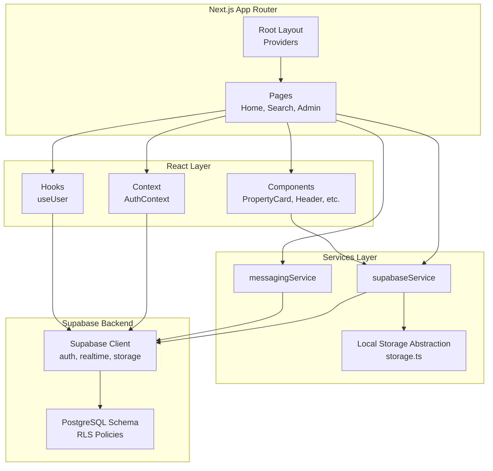
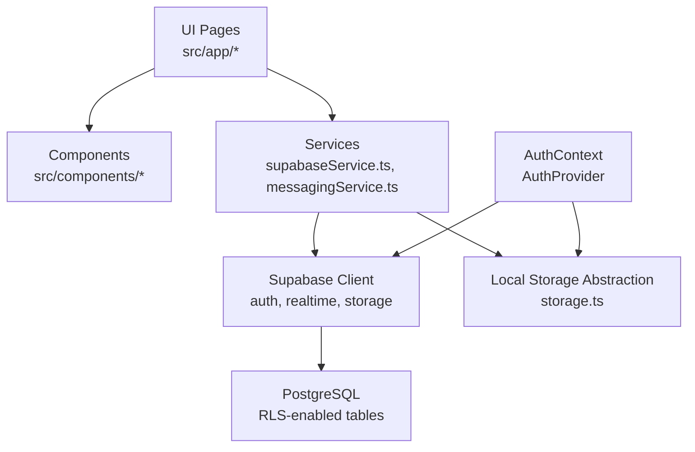
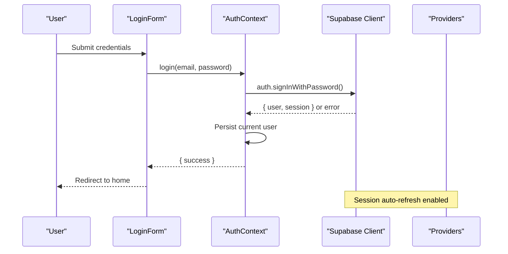
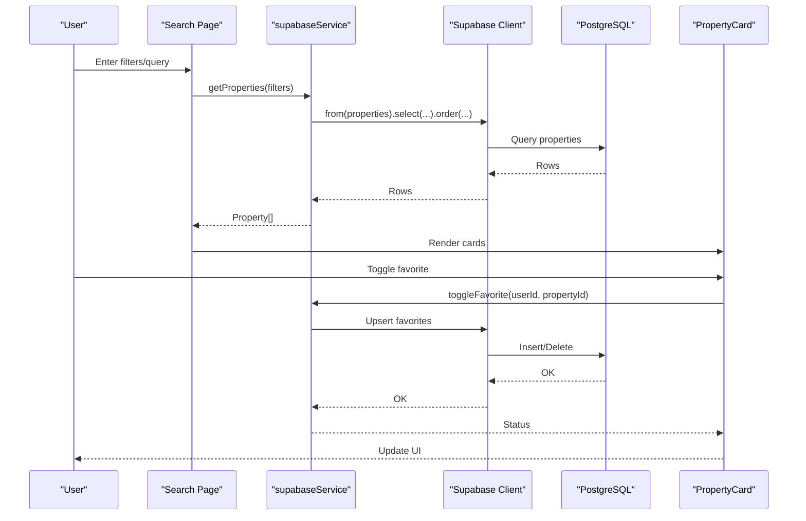
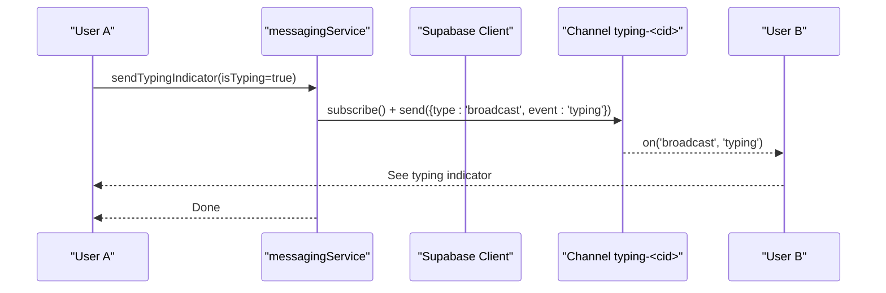
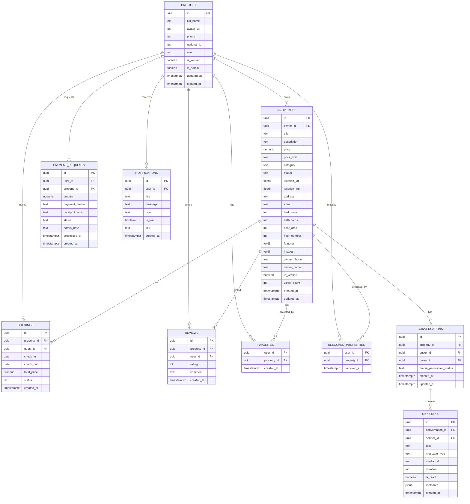
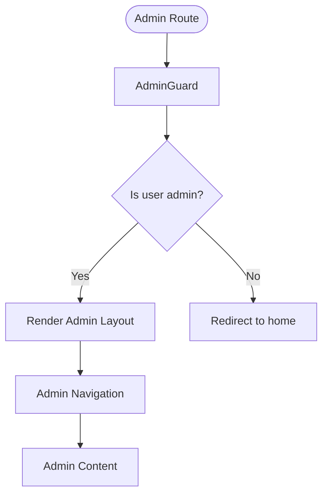
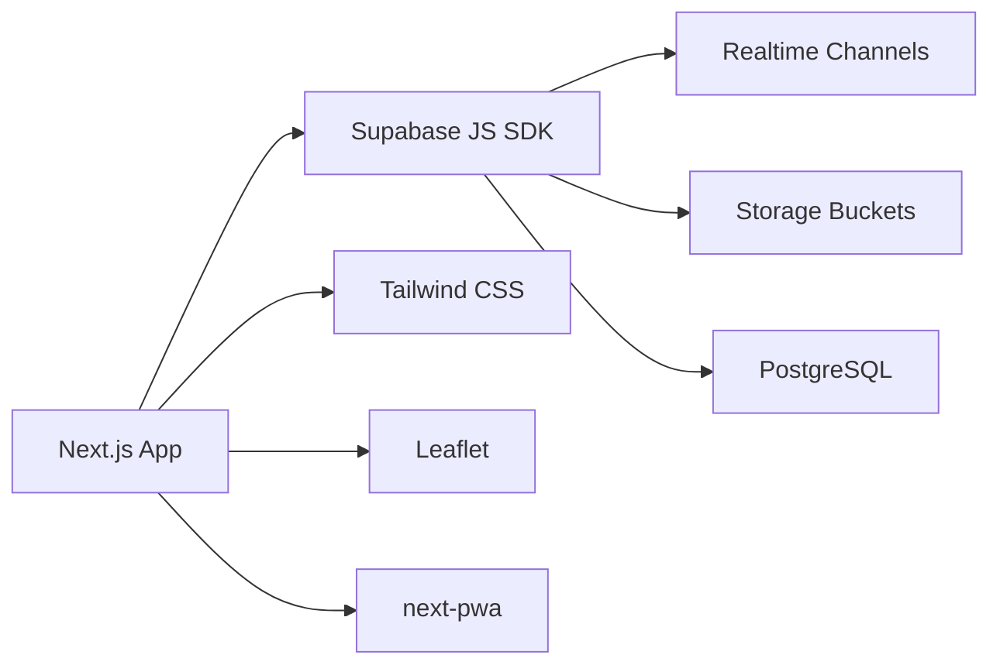

# Architecture Overview

<cite>
**Referenced Files in This Document**
- [package.json](file://package.json)
- [next.config.ts](file://next.config.ts)
- [src/app/layout.tsx](file://src/app/layout.tsx)
- [src/app/providers.tsx](file://src/app/providers.tsx)
- [src/lib/supabase.ts](file://src/lib/supabase.ts)
- [src/context/AuthContext.tsx](file://src/context/AuthContext.tsx)
- [src/hooks/useUser.ts](file://src/hooks/useUser.ts)
- [src/services/supabaseService.ts](file://src/services/supabaseService.ts)
- [src/services/messagingService.ts](file://src/services/messagingService.ts)
- [src/lib/storage.ts](file://src/lib/storage.ts)
- [src/types/database.types.ts](file://src/types/database.types.ts)
- [src/types/messaging.ts](file://src/types/messaging.ts)
- [supabase/schema.sql](file://supabase/schema.sql)
- [src/app/page.tsx](file://src/app/page.tsx)
- [src/components/PropertyCard.tsx](file://src/components/PropertyCard.tsx)
- [src/app/search/page.tsx](file://src/app/search/page.tsx)
- [src/app/admin/layout.tsx](file://src/app/admin/layout.tsx)
</cite>

## Table of Contents
1. [Introduction](#introduction)
2. [Project Structure](#project-structure)
3. [Core Components](#core-components)
4. [Architecture Overview](#architecture-overview)
5. [Detailed Component Analysis](#detailed-component-analysis)
6. [Dependency Analysis](#dependency-analysis)
7. [Performance Considerations](#performance-considerations)
8. [Troubleshooting Guide](#troubleshooting-guide)
9. [Conclusion](#conclusion)

## Introduction
This document presents the architectural design of the Gamasa Properties platform. It describes the high-level system built with Next.js App Router, React components, Supabase backend services, and a PostgreSQL-backed schema with Row Level Security (RLS). The document covers layered architecture, component hierarchy, data flow, provider pattern implementation, state management, real-time communication, system boundaries, integration points, deployment topology, scalability, security, and performance optimization strategies.

## Project Structure
Gamasa Properties follows a modern Next.js 16 App Router structure with a clear separation of concerns:
- Application shell and providers in the root layout
- Feature pages under src/app (e.g., homepage, search, admin)
- Shared UI components under src/components
- Context and hooks for state and auth
- Services for backend interactions
- Supabase client and typed database types
- Supabase schema and policies

**Diagram sources**
- [src/app/layout.tsx](file://src/app/layout.tsx#L64-L89)
- [src/app/providers.tsx](file://src/app/providers.tsx#L7-L17)
- [src/services/supabaseService.ts](file://src/services/supabaseService.ts#L153-L800)
- [src/services/messagingService.ts](file://src/services/messagingService.ts#L4-L123)
- [src/lib/supabase.ts](file://src/lib/supabase.ts#L1-L68)
- [supabase/schema.sql](file://supabase/schema.sql#L1-L416)

**Section sources**
- [src/app/layout.tsx](file://src/app/layout.tsx#L64-L89)
- [src/app/providers.tsx](file://src/app/providers.tsx#L7-L17)
- [package.json](file://package.json#L1-L42)
- [next.config.ts](file://next.config.ts#L12-L31)

## Core Components
- Provider stack: ThemeProvider, AuthProvider, ToastProvider encapsulated via Providers wrapper
- Supabase client configured with auto-refresh and persisted sessions
- AuthContext managing user state, login/register/logout, and mock/SaaS mode switching
- Local storage abstraction for offline-first UX and cross-tab synchronization
- Supabase service facade for properties, favorites, unlocks, notifications, reviews, and messaging
- Messaging service for media uploads, permissions, and typing indicators via Supabase channels
- Typed database interfaces generated from Supabase schema

**Section sources**
- [src/app/providers.tsx](file://src/app/providers.tsx#L7-L17)
- [src/context/AuthContext.tsx](file://src/context/AuthContext.tsx#L22-L186)
- [src/lib/supabase.ts](file://src/lib/supabase.ts#L1-L68)
- [src/lib/storage.ts](file://src/lib/storage.ts#L1-L633)
- [src/services/supabaseService.ts](file://src/services/supabaseService.ts#L153-L800)
- [src/services/messagingService.ts](file://src/services/messagingService.ts#L4-L123)
- [src/types/database.types.ts](file://src/types/database.types.ts#L12-L310)
- [src/types/messaging.ts](file://src/types/messaging.ts#L1-L37)

## Architecture Overview
The system follows a layered architecture:
- Presentation Layer: Next.js App Router pages and React components
- Domain Layer: Services orchestrating business logic and data transformations
- Persistence Layer: Supabase client interacting with PostgreSQL and Storage
- Security Layer: Supabase RLS policies and auth guards

**Diagram sources**
- [src/app/page.tsx](file://src/app/page.tsx#L88-L194)
- [src/components/PropertyCard.tsx](file://src/components/PropertyCard.tsx#L26-L199)
- [src/services/supabaseService.ts](file://src/services/supabaseService.ts#L153-L800)
- [src/services/messagingService.ts](file://src/services/messagingService.ts#L4-L123)
- [src/lib/supabase.ts](file://src/lib/supabase.ts#L1-L68)
- [supabase/schema.sql](file://supabase/schema.sql#L170-L416)

## Detailed Component Analysis

### Authentication and State Management
The provider pattern centralizes global state:
- Providers composes ThemeProvider, AuthProvider, and ToastProvider
- AuthProvider manages user session, loading state, and login/register/logout
- useUser hook integrates with Supabase auth state changes and profile retrieval
- Local storage utilities coordinate cross-tab updates and mock mode

**Diagram sources**
- [src/app/providers.tsx](file://src/app/providers.tsx#L7-L17)
- [src/context/AuthContext.tsx](file://src/context/AuthContext.tsx#L80-L115)
- [src/lib/supabase.ts](file://src/lib/supabase.ts#L18-L28)
- [src/components/auth/LoginForm.tsx](file://src/components/auth/LoginForm.tsx#L20-L46)

**Section sources**
- [src/app/providers.tsx](file://src/app/providers.tsx#L7-L17)
- [src/context/AuthContext.tsx](file://src/context/AuthContext.tsx#L22-L186)
- [src/hooks/useUser.ts](file://src/hooks/useUser.ts#L37-L178)
- [src/lib/storage.ts](file://src/lib/storage.ts#L18-L40)

### Data Flow: Property Discovery and Interaction
Property discovery involves hybrid logic:
- Supabase service fetches properties with optional filters
- Client-side mapping to normalized Property type
- Optional client-side text search
- PropertyCard handles favorites toggle with optimistic UI and error rollback

**Diagram sources**
- [src/app/search/page.tsx](file://src/app/search/page.tsx#L24-L82)
- [src/services/supabaseService.ts](file://src/services/supabaseService.ts#L313-L358)
- [src/components/PropertyCard.tsx](file://src/components/PropertyCard.tsx#L57-L79)
- [supabase/schema.sql](file://supabase/schema.sql#L41-L160)

**Section sources**
- [src/app/search/page.tsx](file://src/app/search/page.tsx#L12-L82)
- [src/services/supabaseService.ts](file://src/services/supabaseService.ts#L313-L358)
- [src/components/PropertyCard.tsx](file://src/components/PropertyCard.tsx#L26-L199)

### Real-Time Communication and Messaging
Real-time features leverage Supabase channels and publication:
- Typing indicators broadcast via channels per conversation
- Media permission requests stored as system messages
- Public image/voice buckets for chat media

**Diagram sources**
- [src/services/messagingService.ts](file://src/services/messagingService.ts#L89-L117)
- [supabase/schema.sql](file://supabase/schema.sql#L406-L416)

**Section sources**
- [src/services/messagingService.ts](file://src/services/messagingService.ts#L4-L123)
- [supabase/schema.sql](file://supabase/schema.sql#L338-L416)

### Database Design and Security
The schema defines core entities with RLS policies:
- Profiles, Properties, Bookings, Payment Requests, Reviews, Notifications, Favorites, Unlocked Properties
- Conversations and Messages for real-time chat
- RLS policies restrict access by user identity and roles
- Realtime publication enabled for messages

**Diagram sources**
- [supabase/schema.sql](file://supabase/schema.sql#L7-L416)
- [src/types/database.types.ts](file://src/types/database.types.ts#L12-L310)

**Section sources**
- [supabase/schema.sql](file://supabase/schema.sql#L1-L416)
- [src/types/database.types.ts](file://src/types/database.types.ts#L12-L310)

### Admin Guard and Access Control
Admin-only areas are protected by an admin guard that enforces role checks and redirects unauthorized users.

**Diagram sources**
- [src/app/admin/layout.tsx](file://src/app/admin/layout.tsx#L9-L63)

**Section sources**
- [src/app/admin/layout.tsx](file://src/app/admin/layout.tsx#L9-L63)

## Dependency Analysis
External dependencies and integrations:
- Next.js 16 with App Router, PWA plugin
- Supabase JS SDK for auth, realtime, storage
- Tailwind CSS ecosystem
- Leaflet for maps (UI component usage)

**Diagram sources**
- [package.json](file://package.json#L11-L27)
- [next.config.ts](file://next.config.ts#L5-L10)
- [src/lib/supabase.ts](file://src/lib/supabase.ts#L1-L68)

**Section sources**
- [package.json](file://package.json#L11-L27)
- [next.config.ts](file://next.config.ts#L5-L10)

## Performance Considerations
- Client-side caching and optimistic UI for favorites and toggles
- Local storage abstraction reduces backend calls during development and supports offline UX
- Supabase auto-refresh and persisted sessions minimize re-auth overhead
- PWA configuration improves caching and offline availability
- Consider adding server-side search and indexing for production-scale queries
- Optimize image delivery via Supabase Storage and CDN

[No sources needed since this section provides general guidance]

## Troubleshooting Guide
Common issues and remedies:
- Missing Supabase environment variables cause warnings; ensure NEXT_PUBLIC_SUPABASE_URL and NEXT_PUBLIC_SUPABASE_ANON_KEY are set
- Auth state changes require proper subscription cleanup; use the provided hooks and guards
- Realtime channels must be subscribed before broadcasting; ensure channel.subscribe() is called
- Storage uploads enforce size/type constraints; handle errors gracefully in messagingService

**Section sources**
- [src/lib/supabase.ts](file://src/lib/supabase.ts#L7-L15)
- [src/hooks/useUser.ts](file://src/hooks/useUser.ts#L144-L168)
- [src/services/messagingService.ts](file://src/services/messagingService.ts#L6-L33)

## Conclusion
Gamasa Properties employs a clean layered architecture with Next.js App Router and React components, backed by Supabase for authentication, real-time communication, storage, and database operations. The provider pattern centralizes state, while local storage enables an offline-first experience. Supabase’s RLS and policies secure data access, and the admin guard enforces role-based access. The system is designed for scalability, maintainability, and performance, with room for enhancements such as server-side search and advanced indexing.