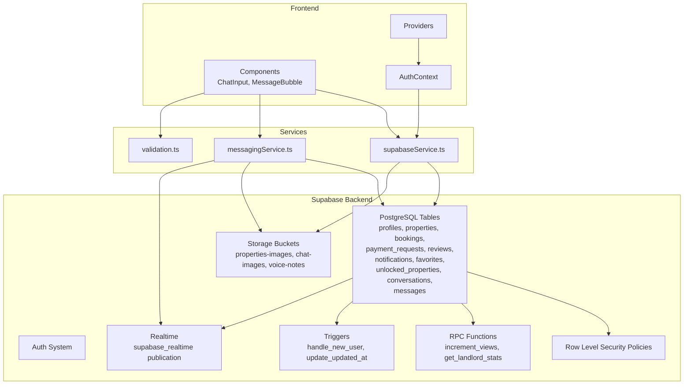
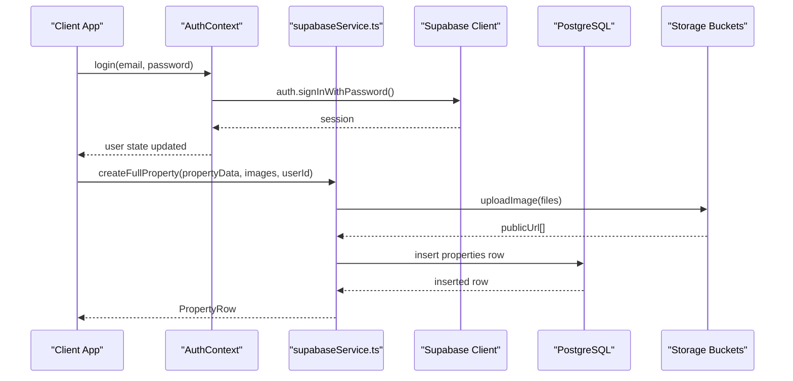
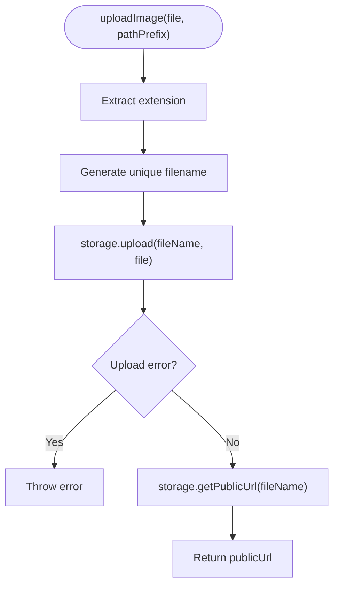
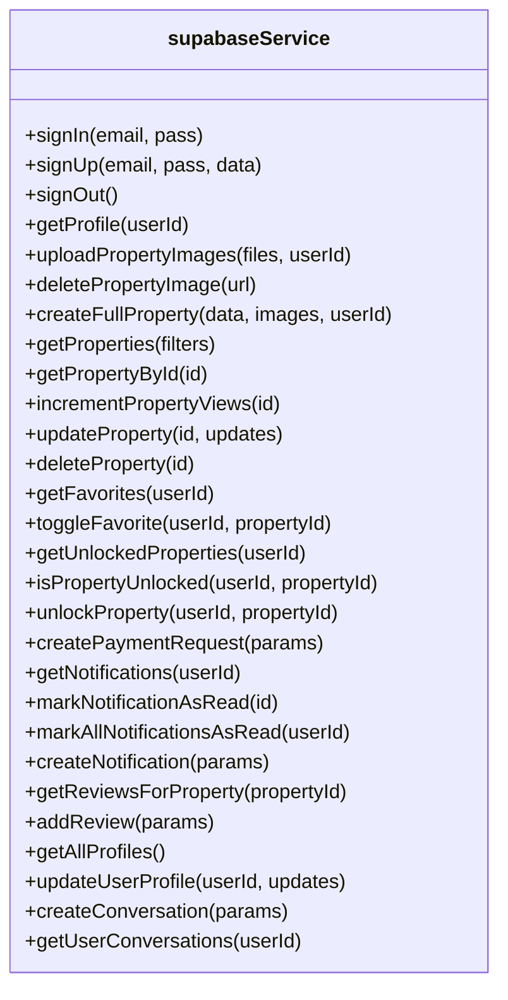
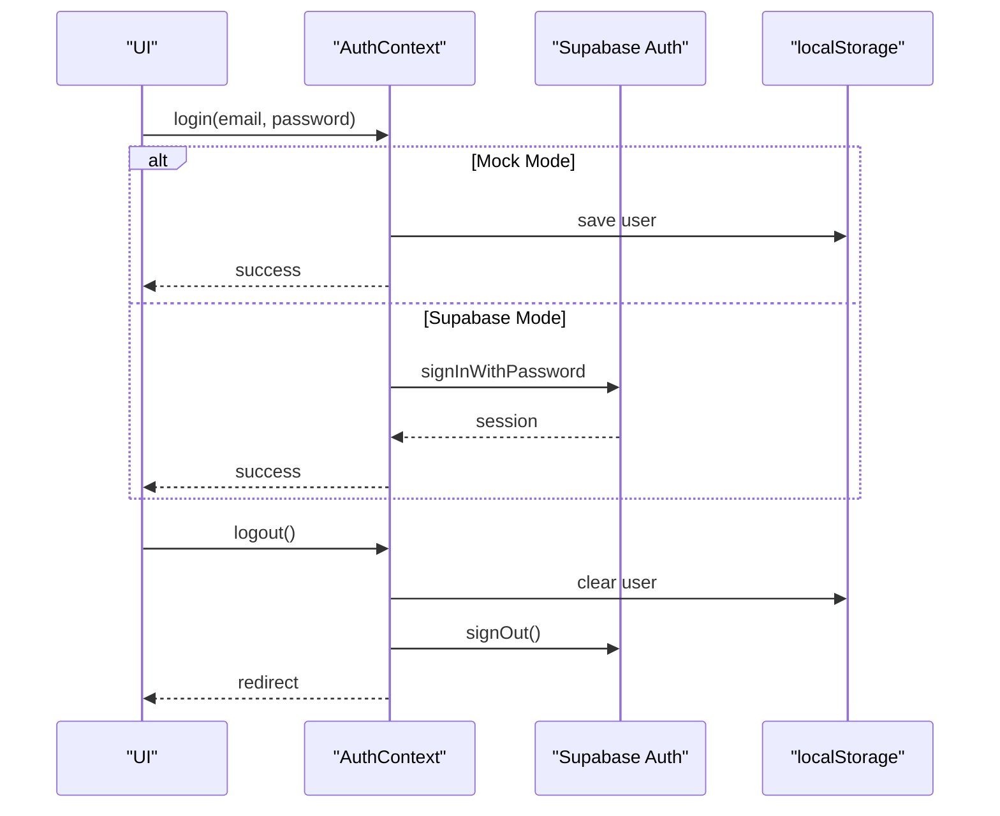
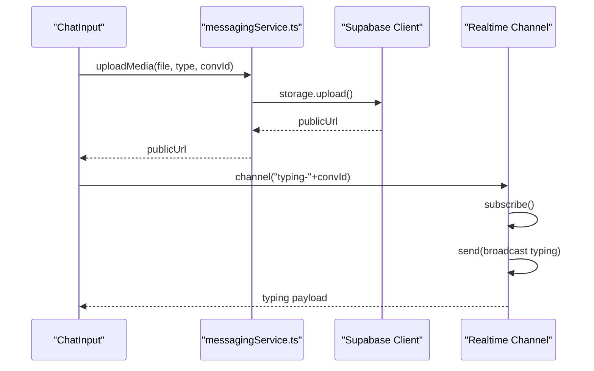
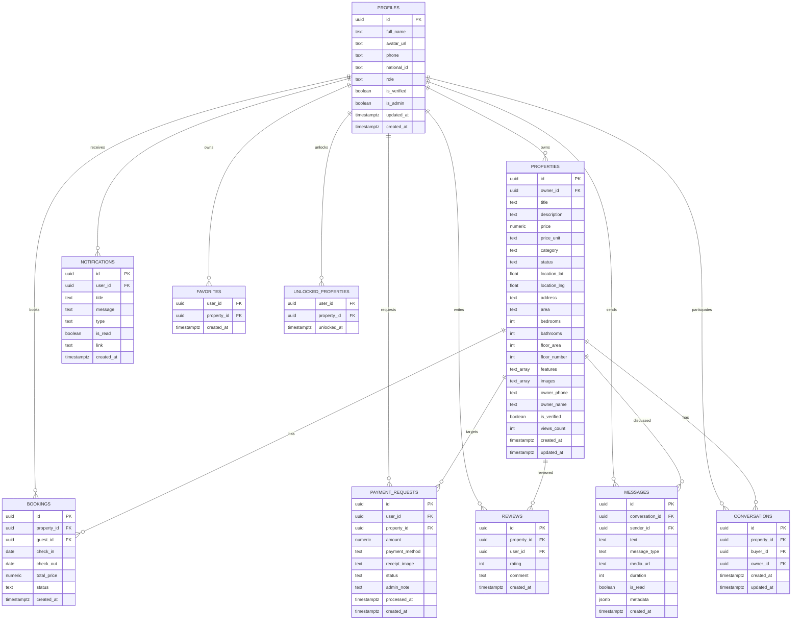
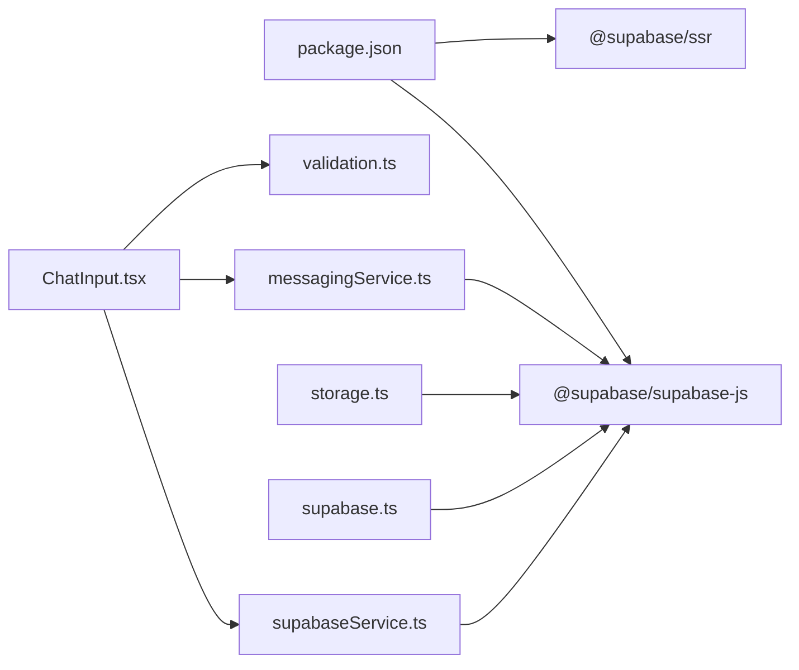

# Backend Architecture

<cite>
**Referenced Files in This Document**
- [supabase.ts](file://src/lib/supabase.ts)
- [supabaseService.ts](file://src/services/supabaseService.ts)
- [storage.ts](file://src/lib/storage.ts)
- [messagingService.ts](file://src/services/messagingService.ts)
- [AuthContext.tsx](file://src/context/AuthContext.tsx)
- [providers.tsx](file://src/app/providers.tsx)
- [schema.sql](file://supabase/schema.sql)
- [functions.sql](file://supabase/functions.sql)
- [database.types.ts](file://src/types/database.types.ts)
- [validation.ts](file://src/utils/validation.ts)
- [messaging.ts](file://src/types/messaging.ts)
- [package.json](file://package.json)
- [ChatInput.tsx](file://src/components/chat/ChatInput.tsx)
- [MessageBubble.tsx](file://src/components/chat/MessageBubble.tsx)
</cite>

## Table of Contents
1. [Introduction](#introduction)
2. [Project Structure](#project-structure)
3. [Core Components](#core-components)
4. [Architecture Overview](#architecture-overview)
5. [Detailed Component Analysis](#detailed-component-analysis)
6. [Dependency Analysis](#dependency-analysis)
7. [Performance Considerations](#performance-considerations)
8. [Troubleshooting Guide](#troubleshooting-guide)
9. [Conclusion](#conclusion)

## Introduction
This document describes the backend architecture of Gamasa Properties built on Supabase. It covers authentication, database operations, real-time features, service-layer organization, role-based access control, cloud storage integration, schema design, and function implementations. It also documents error handling, validation patterns, and security considerations.

## Project Structure
The backend relies on Supabase for authentication, database, storage, and real-time capabilities. The frontend interacts with Supabase via a service layer abstraction and helper utilities. The Supabase project defines tables, policies, triggers, and RPC functions.

**Diagram sources**
- [supabase.ts](file://src/lib/supabase.ts#L1-L68)
- [supabaseService.ts](file://src/services/supabaseService.ts#L1-L1384)
- [messagingService.ts](file://src/services/messagingService.ts#L1-L123)
- [schema.sql](file://supabase/schema.sql#L1-L416)
- [functions.sql](file://supabase/functions.sql#L1-L71)

**Section sources**
- [supabase.ts](file://src/lib/supabase.ts#L1-L68)
- [supabaseService.ts](file://src/services/supabaseService.ts#L1-L1384)
- [schema.sql](file://supabase/schema.sql#L1-L416)
- [functions.sql](file://supabase/functions.sql#L1-L71)

## Core Components
- Supabase client initialization and storage utilities
- Service layer abstraction for database operations and business logic
- Messaging service for media uploads, permissions, typing indicators, and real-time channels
- Authentication context provider and hybrid mock/SUPABASE mode
- Validation utilities for messages and media
- Supabase schema, policies, triggers, and RPC functions
- Frontend components integrating with the backend services

**Section sources**
- [supabase.ts](file://src/lib/supabase.ts#L1-L68)
- [supabaseService.ts](file://src/services/supabaseService.ts#L1-L1384)
- [messagingService.ts](file://src/services/messagingService.ts#L1-L123)
- [AuthContext.tsx](file://src/context/AuthContext.tsx#L1-L195)
- [validation.ts](file://src/utils/validation.ts#L1-L33)
- [schema.sql](file://supabase/schema.sql#L1-L416)
- [functions.sql](file://supabase/functions.sql#L1-L71)

## Architecture Overview
Gamasa Properties uses Supabase as a backend-as-a-service:
- Authentication: Supabase Auth manages sign-in/sign-up and session persistence.
- Database: PostgreSQL-backed tables with Row Level Security (RLS) policies.
- Storage: Supabase Storage buckets for property and chat media.
- Realtime: Supabase Realtime for live chat and typing indicators.
- Functions: SQL functions and triggers for automatic profile creation and atomic increments.

**Diagram sources**
- [AuthContext.tsx](file://src/context/AuthContext.tsx#L80-L115)
- [supabase.ts](file://src/lib/supabase.ts#L34-L54)
- [supabaseService.ts](file://src/services/supabaseService.ts#L258-L311)

## Detailed Component Analysis

### Supabase Client and Storage Utilities
- Initializes the Supabase client with environment variables and session persistence.
- Exposes constants and helper functions for image upload and deletion.
- Provides a storage bucket name for property images.

**Diagram sources**
- [supabase.ts](file://src/lib/supabase.ts#L34-L54)

**Section sources**
- [supabase.ts](file://src/lib/supabase.ts#L1-L68)

### Service Layer Pattern with supabaseService.ts
The service layer encapsulates:
- Authentication: sign-in, sign-up, sign-out, profile retrieval.
- Property lifecycle: create, fetch, update, delete with image handling.
- Favorites and unlocked properties.
- Payment requests and notifications.
- Reviews and admin management.
- Conversations and messages for chat.
- RPC invocation for atomic view counting.

**Diagram sources**
- [supabaseService.ts](file://src/services/supabaseService.ts#L153-L800)

**Section sources**
- [supabaseService.ts](file://src/services/supabaseService.ts#L1-L1384)

### Authentication Architecture
- Hybrid mode flag enables mock mode for development.
- AuthContext integrates with Supabase Auth and local storage.
- Mock mode stores users and current user in localStorage.
- Logout clears local state and invokes Supabase sign-out when not in mock mode.

**Diagram sources**
- [AuthContext.tsx](file://src/context/AuthContext.tsx#L80-L170)
- [supabase.ts](file://src/lib/supabase.ts#L18-L28)

**Section sources**
- [AuthContext.tsx](file://src/context/AuthContext.tsx#L1-L195)
- [supabase.ts](file://src/lib/supabase.ts#L1-L68)

### Real-Time Communication System
- Messages table is included in the realtime publication.
- Messaging service supports:
  - Media upload to dedicated buckets.
  - Media permission requests and grants.
  - Typing indicators via broadcast channels.
- Frontend components integrate validation and UI feedback.

**Diagram sources**
- [messagingService.ts](file://src/services/messagingService.ts#L6-L121)
- [schema.sql](file://supabase/schema.sql#L408-L415)
- [ChatInput.tsx](file://src/components/chat/ChatInput.tsx#L96-L122)

**Section sources**
- [messagingService.ts](file://src/services/messagingService.ts#L1-L123)
- [schema.sql](file://supabase/schema.sql#L408-L415)
- [ChatInput.tsx](file://src/components/chat/ChatInput.tsx#L1-L297)

### Cloud Storage Integration
- Property images: uploaded to the properties-images bucket with cache control.
- Chat media: separate buckets for images and voice notes.
- Validation ensures acceptable file types and sizes.
- Error handling distinguishes between size/type errors and generic failures.

**Section sources**
- [supabase.ts](file://src/lib/supabase.ts#L34-L67)
- [messagingService.ts](file://src/services/messagingService.ts#L6-L33)
- [validation.ts](file://src/utils/validation.ts#L7-L27)

### Database Schema Design
- Core tables: profiles, properties, bookings, payment_requests, reviews, notifications, favorites, unlocked_properties, conversations, messages.
- RLS policies define who can select/update/insert/delete per table.
- Triggers automatically create profiles on user signup and update timestamps.
- RPC functions provide atomic operations (e.g., incrementing views).

**Diagram sources**
- [schema.sql](file://supabase/schema.sql#L7-L416)
- [database.types.ts](file://src/types/database.types.ts#L12-L310)

**Section sources**
- [schema.sql](file://supabase/schema.sql#L1-L416)
- [database.types.ts](file://src/types/database.types.ts#L1-L310)

### Function Implementations
- handle_new_user: inserts a profile row after auth user creation.
- increment_views: atomic increment of property views via RPC.
- get_landlord_stats: optional stats aggregation for landlords.

**Section sources**
- [functions.sql](file://supabase/functions.sql#L5-L71)

### Data Access Patterns and Business Logic Organization
- supabaseService centralizes all data access and business logic.
- Uses typed database interfaces for compile-time safety.
- Implements mock mode for development without touching Supabase.
- Handles cascading operations (e.g., deleting property images when deleting a property).

**Section sources**
- [supabaseService.ts](file://src/services/supabaseService.ts#L1-L1384)
- [database.types.ts](file://src/types/database.types.ts#L12-L310)

### Authentication, RBAC, and Session Management
- Roles: tenant, landlord, admin stored in profiles.
- RLS policies restrict access based on ownership and roles.
- Admin policy allows full access to properties and related tables.
- AuthContext persists sessions and synchronizes state across tabs.

**Section sources**
- [schema.sql](file://supabase/schema.sql#L187-L335)
- [AuthContext.tsx](file://src/context/AuthContext.tsx#L1-L195)

### Real-Time Features for Chat and Notifications
- Realtime enabled for messages table.
- Typing indicators use broadcast channels keyed by conversation.
- Notifications are stored in the database and fetched per user.

**Section sources**
- [schema.sql](file://supabase/schema.sql#L408-L415)
- [messagingService.ts](file://src/services/messagingService.ts#L89-L121)
- [supabaseService.ts](file://src/services/supabaseService.ts#L566-L637)

### Error Handling Strategies
- Centralized logging of errors during fetches and mutations.
- Specific error handling for storage uploads (size/type).
- Graceful fallbacks and user feedback in UI components.

**Section sources**
- [supabaseService.ts](file://src/services/supabaseService.ts#L242-L245)
- [messagingService.ts](file://src/services/messagingService.ts#L17-L26)
- [ChatInput.tsx](file://src/components/chat/ChatInput.tsx#L73-L76)

### Data Validation Patterns
- Message length validation.
- File type and size checks for images and voice recordings.
- Basic text sanitization.

**Section sources**
- [validation.ts](file://src/utils/validation.ts#L1-L33)
- [ChatInput.tsx](file://src/components/chat/ChatInput.tsx#L124-L177)

### Security Considerations
- RLS policies enforce data isolation.
- Admin-only policies for sensitive operations.
- Secure RPC functions for atomic operations.
- Storage access controlled by bucket policies and signed URLs.

**Section sources**
- [schema.sql](file://supabase/schema.sql#L187-L335)
- [functions.sql](file://supabase/functions.sql#L30-L39)

## Dependency Analysis
Supabase is the central dependency for authentication, database, storage, and real-time. The service layer depends on the Supabase client and types. Messaging components depend on the messaging service and validation utilities.

**Diagram sources**
- [package.json](file://package.json#L11-L27)
- [supabase.ts](file://src/lib/supabase.ts#L1-L1)
- [supabaseService.ts](file://src/services/supabaseService.ts#L1-L2)
- [messagingService.ts](file://src/services/messagingService.ts#L1-L2)
- [storage.ts](file://src/lib/storage.ts#L1-L2)
- [ChatInput.tsx](file://src/components/chat/ChatInput.tsx#L1-L4)

**Section sources**
- [package.json](file://package.json#L1-L42)
- [supabase.ts](file://src/lib/supabase.ts#L1-L68)
- [supabaseService.ts](file://src/services/supabaseService.ts#L1-L1384)
- [messagingService.ts](file://src/services/messagingService.ts#L1-L123)
- [storage.ts](file://src/lib/storage.ts#L1-L633)
- [ChatInput.tsx](file://src/components/chat/ChatInput.tsx#L1-L297)

## Performance Considerations
- Use RPC functions for atomic counters to avoid race conditions.
- Leverage Supabase’s built-in caching and CDN for storage assets.
- Apply appropriate indexes and filters in queries to reduce payload size.
- Batch operations where feasible and avoid unnecessary re-renders in UI.

## Troubleshooting Guide
- Environment variables: Ensure NEXT_PUBLIC_SUPABASE_URL and NEXT_PUBLIC_SUPABASE_ANON_KEY are configured.
- Storage errors: Check bucket permissions and file size/type limits.
- Realtime issues: Verify messages table is part of supabase_realtime publication.
- RLS errors: Confirm user roles and ownership match policies.

**Section sources**
- [supabase.ts](file://src/lib/supabase.ts#L7-L15)
- [schema.sql](file://supabase/schema.sql#L408-L415)

## Conclusion
Gamasa Properties leverages Supabase comprehensively for authentication, database, storage, and real-time features. The service layer abstracts Supabase operations, while RLS and policies ensure secure data access. The architecture balances developer productivity with strong security and scalability foundations.