# Data Flow Architecture

<cite>
**Referenced Files in This Document**
- [AuthContext.tsx](file://src/context/AuthContext.tsx)
- [providers.tsx](file://src/app/providers.tsx)
- [supabase.ts](file://src/lib/supabase.ts)
- [storage.ts](file://src/lib/storage.ts)
- [supabaseService.ts](file://src/services/supabaseService.ts)
- [messagingService.ts](file://src/services/messagingService.ts)
- [useUser.ts](file://src/hooks/useUser.ts)
- [index.ts](file://src/types/index.ts)
- [messaging.ts](file://src/types/messaging.ts)
- [layout.tsx](file://src/app/layout.tsx)
- [page.tsx](file://src/app/page.tsx)
- [search/page.tsx](file://src/app/search/page.tsx)
- [LoginForm.tsx](file://src/components/auth/LoginForm.tsx)
- [ChatInput.tsx](file://src/components/chat/ChatInput.tsx)
- [notifications/page.tsx](file://src/app/notifications/page.tsx)
</cite>

## Table of Contents
1. [Introduction](#introduction)
2. [Project Structure](#project-structure)
3. [Core Components](#core-components)
4. [Architecture Overview](#architecture-overview)
5. [Detailed Component Analysis](#detailed-component-analysis)
6. [Dependency Analysis](#dependency-analysis)
7. [Performance Considerations](#performance-considerations)
8. [Troubleshooting Guide](#troubleshooting-guide)
9. [Conclusion](#conclusion)

## Introduction
This document describes the data flow architecture for Gamasa Properties, focusing on how data moves across frontend components, React Context providers, and backend services. It covers:
- Authentication data flow from login to state management
- Property data flow from database to UI components
- Real-time data flow for chat and notifications
- State management with React Context, local storage integration, and mock data handling
- Data transformation patterns, API response handling, and error propagation
- Caching strategies, optimistic updates, and offline data synchronization patterns

## Project Structure
Gamasa Properties follows a Next.js App Router structure with a clear separation of concerns:
- App shell and providers are initialized at the root layout
- Global providers wrap the entire application tree
- Feature pages orchestrate data fetching and UI composition
- Services encapsulate backend interactions and data transformations
- Utilities manage local storage and Supabase integration
- Types define the canonical data models

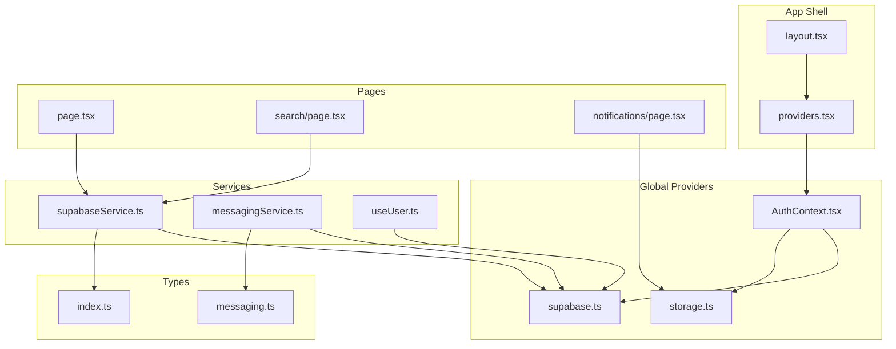

**Diagram sources**
- [layout.tsx](file://src/app/layout.tsx#L64-L89)
- [providers.tsx](file://src/app/providers.tsx#L7-L17)
- [AuthContext.tsx](file://src/context/AuthContext.tsx#L22-L186)
- [supabase.ts](file://src/lib/supabase.ts#L1-L68)
- [storage.ts](file://src/lib/storage.ts#L1-L633)
- [supabaseService.ts](file://src/services/supabaseService.ts#L1-L800)
- [messagingService.ts](file://src/services/messagingService.ts#L1-L123)
- [useUser.ts](file://src/hooks/useUser.ts#L37-L178)
- [index.ts](file://src/types/index.ts#L1-L237)
- [messaging.ts](file://src/types/messaging.ts#L1-L37)
- [page.tsx](file://src/app/page.tsx#L88-L195)
- [search/page.tsx](file://src/app/search/page.tsx#L12-L220)
- [notifications/page.tsx](file://src/app/notifications/page.tsx#L14-L119)

**Section sources**
- [layout.tsx](file://src/app/layout.tsx#L64-L89)
- [providers.tsx](file://src/app/providers.tsx#L7-L17)

## Core Components
- React Context Provider: Centralizes authentication state and exposes login/register/logout actions. It integrates with local storage and optionally Supabase.
- Supabase Client: Provides typed client access and helper functions for storage operations.
- Storage Utilities: Encapsulate local storage operations, mapping between DB and app formats, and mock data initialization.
- Supabase Service: Orchestrates property CRUD, favorites/unlocks, notifications, reviews, and messaging-related operations with mock mode support.
- Messaging Service: Handles media uploads, permission requests, typing indicators, and real-time channels.
- User Hook: Manages Supabase auth state changes and user profile hydration.
- Types: Define canonical models for properties, users, notifications, and messaging.

**Section sources**
- [AuthContext.tsx](file://src/context/AuthContext.tsx#L11-L195)
- [supabase.ts](file://src/lib/supabase.ts#L1-L68)
- [storage.ts](file://src/lib/storage.ts#L1-L633)
- [supabaseService.ts](file://src/services/supabaseService.ts#L1-L800)
- [messagingService.ts](file://src/services/messagingService.ts#L1-L123)
- [useUser.ts](file://src/hooks/useUser.ts#L37-L178)
- [index.ts](file://src/types/index.ts#L1-L237)
- [messaging.ts](file://src/types/messaging.ts#L1-L37)

## Architecture Overview
The system supports two operational modes:
- Mock Mode: Uses in-memory data and localStorage for all operations, enabling rapid iteration without backend connectivity.
- Supabase Mode: Integrates with Supabase for authentication, real-time, and storage, while still leveraging local storage for UI state and offline-friendly patterns.

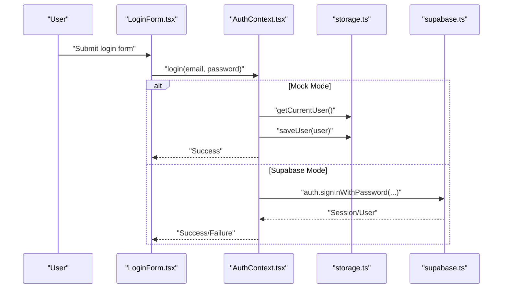

**Diagram sources**
- [LoginForm.tsx](file://src/components/auth/LoginForm.tsx#L20-L46)
- [AuthContext.tsx](file://src/context/AuthContext.tsx#L80-L115)
- [storage.ts](file://src/lib/storage.ts#L294-L300)
- [supabase.ts](file://src/lib/supabase.ts#L18-L28)

## Detailed Component Analysis

### Authentication Data Flow
Authentication spans login, state hydration, and cross-tab synchronization:
- LoginForm triggers AuthContext.login, which either authenticates against mock data or Supabase.
- AuthContext persists the user to localStorage and broadcasts events for other tabs.
- storage.ts centralizes user retrieval and persistence, including event dispatching for immediate UI updates.
- useUser listens to Supabase auth state changes and hydrates the app’s user profile.

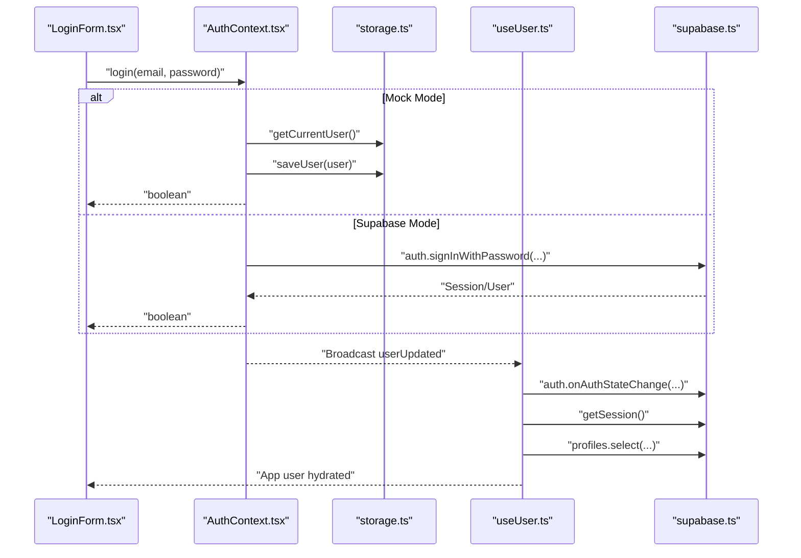

**Diagram sources**
- [LoginForm.tsx](file://src/components/auth/LoginForm.tsx#L20-L46)
- [AuthContext.tsx](file://src/context/AuthContext.tsx#L22-L78)
- [storage.ts](file://src/lib/storage.ts#L294-L300)
- [useUser.ts](file://src/hooks/useUser.ts#L145-L162)
- [supabase.ts](file://src/lib/supabase.ts#L18-L28)

**Section sources**
- [AuthContext.tsx](file://src/context/AuthContext.tsx#L22-L186)
- [storage.ts](file://src/lib/storage.ts#L294-L300)
- [useUser.ts](file://src/hooks/useUser.ts#L37-L178)

### Property Data Flow
Property data originates from the database and flows through services and UI:
- SearchPage orchestrates fetching properties via supabaseService, applies client-side filters, and renders PropertyCard components.
- supabaseService maps database rows to the app’s Property type and supports mock mode for development.
- storage.ts provides local property lists and mapping utilities for DB-to-app conversion.

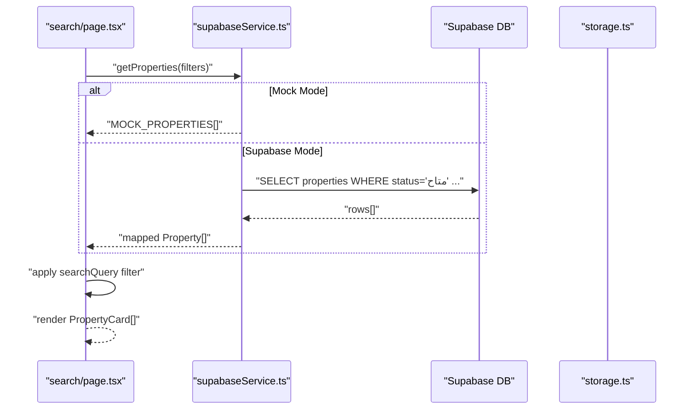

**Diagram sources**
- [search/page.tsx](file://src/app/search/page.tsx#L28-L82)
- [supabaseService.ts](file://src/services/supabaseService.ts#L313-L358)
- [storage.ts](file://src/lib/storage.ts#L127-L177)

**Section sources**
- [search/page.tsx](file://src/app/search/page.tsx#L12-L220)
- [supabaseService.ts](file://src/services/supabaseService.ts#L313-L358)
- [storage.ts](file://src/lib/storage.ts#L127-L177)
- [index.ts](file://src/types/index.ts#L25-L54)

### Real-Time Data Flow for Chat and Notifications
Real-time chat and notifications rely on Supabase channels and local storage:
- ChatInput handles text, image, and voice messages, validates inputs, uploads media, and sends messages.
- messagingService manages media permissions, typing indicators via broadcast channels, and uploads to Supabase storage buckets.
- NotificationsPage uses local storage-backed notifications with optimistic updates and badge synchronization.

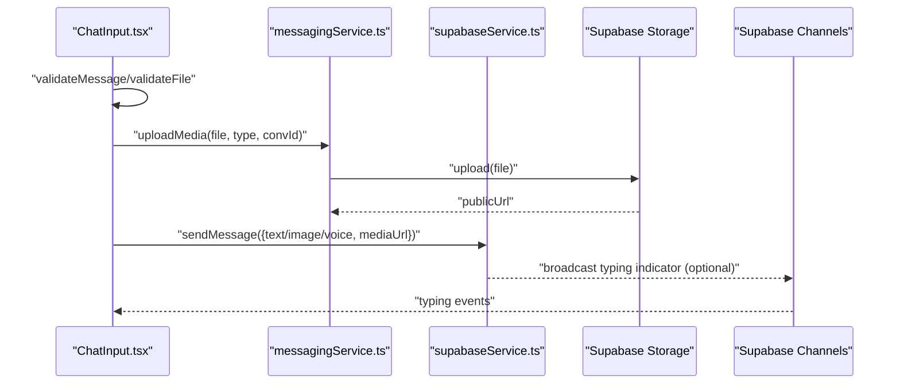

**Diagram sources**
- [ChatInput.tsx](file://src/components/chat/ChatInput.tsx#L124-L177)
- [messagingService.ts](file://src/services/messagingService.ts#L6-L33)
- [messagingService.ts](file://src/services/messagingService.ts#L89-L121)

**Section sources**
- [ChatInput.tsx](file://src/components/chat/ChatInput.tsx#L1-L297)
- [messagingService.ts](file://src/services/messagingService.ts#L1-L123)
- [messaging.ts](file://src/types/messaging.ts#L1-L37)

### Notifications Data Flow
Notifications are stored locally with optimistic updates:
- notifications/page.tsx loads notifications for the current user and marks them read with optimistic UI updates.
- storage.ts manages notification CRUD and unread counts, broadcasting updates to keep badges synchronized.

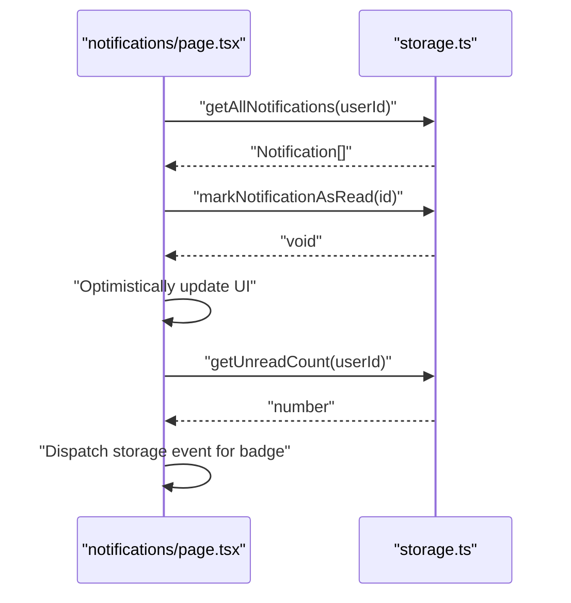

**Diagram sources**
- [notifications/page.tsx](file://src/app/notifications/page.tsx#L27-L47)
- [storage.ts](file://src/lib/storage.ts#L434-L476)

**Section sources**
- [notifications/page.tsx](file://src/app/notifications/page.tsx#L14-L119)
- [storage.ts](file://src/lib/storage.ts#L434-L476)

### State Management Architecture
React Context and local storage coordinate state:
- AuthProvider maintains user, loading, and auth actions; subscribes to localStorage changes for cross-tab sync.
- Providers composes AuthProvider, ThemeProvider, and ToastProvider at the root.
- useUser manages Supabase auth state changes and profile hydration.

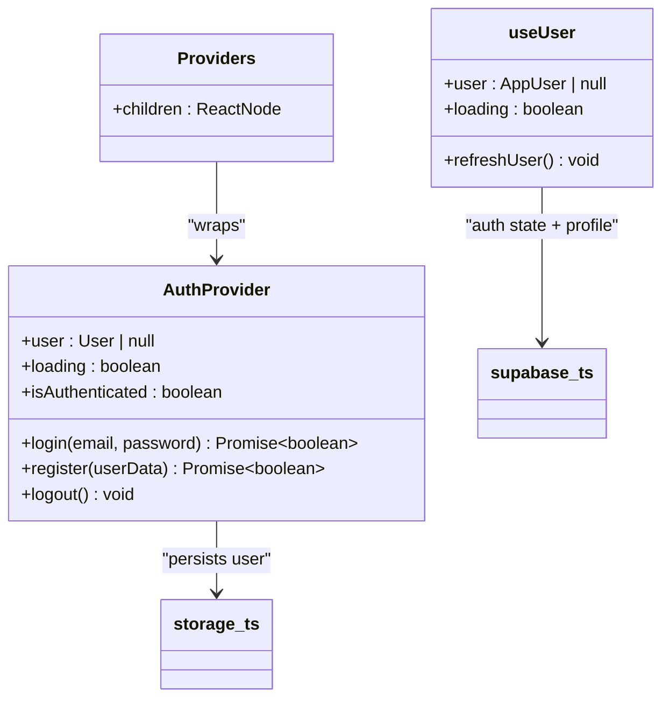

**Diagram sources**
- [AuthContext.tsx](file://src/context/AuthContext.tsx#L22-L186)
- [providers.tsx](file://src/app/providers.tsx#L7-L17)
- [useUser.ts](file://src/hooks/useUser.ts#L37-L178)
- [storage.ts](file://src/lib/storage.ts#L294-L300)
- [supabase.ts](file://src/lib/supabase.ts#L18-L28)

**Section sources**
- [AuthContext.tsx](file://src/context/AuthContext.tsx#L22-L186)
- [providers.tsx](file://src/app/providers.tsx#L7-L17)
- [useUser.ts](file://src/hooks/useUser.ts#L37-L178)

### Data Transformation Patterns
- DB to App Mapping: storage.ts converts database rows to the app’s Property model and vice versa, ensuring type safety and field normalization.
- Hybrid Filtering: search/page.tsx fetches filtered rows from the service and applies additional client-side text search to improve UX.
- Mock Mode Fallback: supabaseService.ts centralizes mock data and operations, allowing seamless switching between mock and Supabase modes.

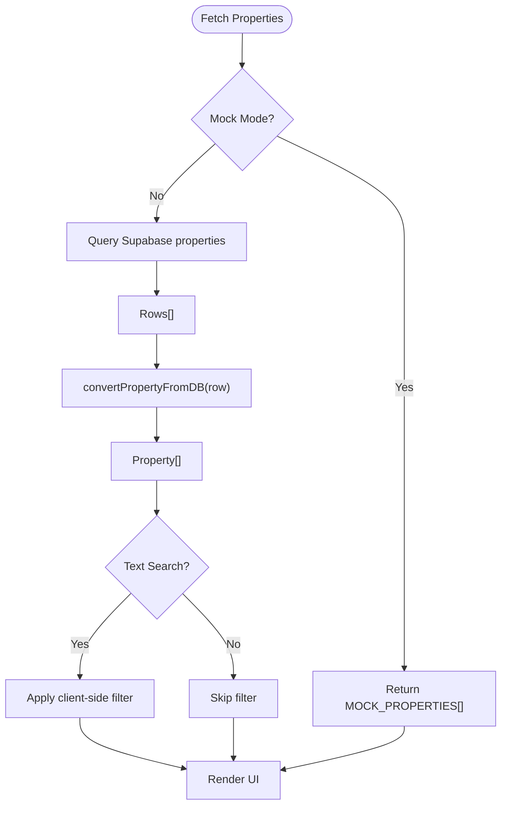

**Diagram sources**
- [supabaseService.ts](file://src/services/supabaseService.ts#L313-L358)
- [storage.ts](file://src/lib/storage.ts#L72-L124)
- [search/page.tsx](file://src/app/search/page.tsx#L28-L82)

**Section sources**
- [storage.ts](file://src/lib/storage.ts#L72-L124)
- [supabaseService.ts](file://src/services/supabaseService.ts#L313-L358)
- [search/page.tsx](file://src/app/search/page.tsx#L28-L82)

### API Response Handling and Error Propagation
- AuthContext.login/register catches errors and returns boolean flags; UI displays localized messages.
- supabaseService.ts wraps Supabase calls and throws descriptive errors; callers log and surface user-friendly messages.
- storage.ts centralizes localStorage operations with try/catch and logs errors for debugging.

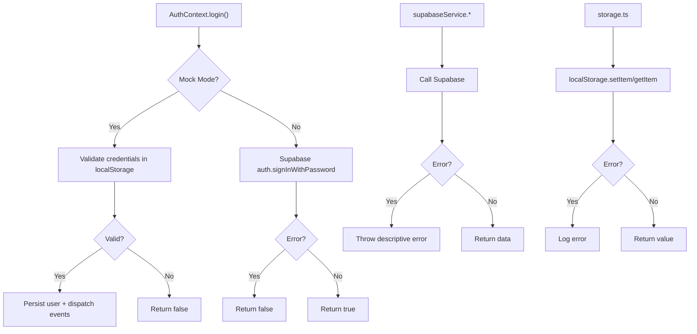

**Diagram sources**
- [AuthContext.tsx](file://src/context/AuthContext.tsx#L80-L115)
- [supabaseService.ts](file://src/services/supabaseService.ts#L155-L202)
- [storage.ts](file://src/lib/storage.ts#L28-L40)

**Section sources**
- [AuthContext.tsx](file://src/context/AuthContext.tsx#L80-L115)
- [supabaseService.ts](file://src/services/supabaseService.ts#L155-L202)
- [storage.ts](file://src/lib/storage.ts#L28-L40)

### Caching Strategies, Optimistic Updates, and Offline Sync
- Local Storage Caching: storage.ts caches properties, users, notifications, and other entities in localStorage with keys for quick retrieval.
- Optimistic Updates: notifications/page.tsx optimistically toggles notification read state and updates counters before backend sync.
- Cross-Tab Sync: AuthContext listens to localStorage and 'userUpdated' events to reflect state changes across browser tabs.
- Offline-Friendly Patterns: Mock mode enables full functionality without network connectivity; Supabase mode leverages auth persistence and offline detection.

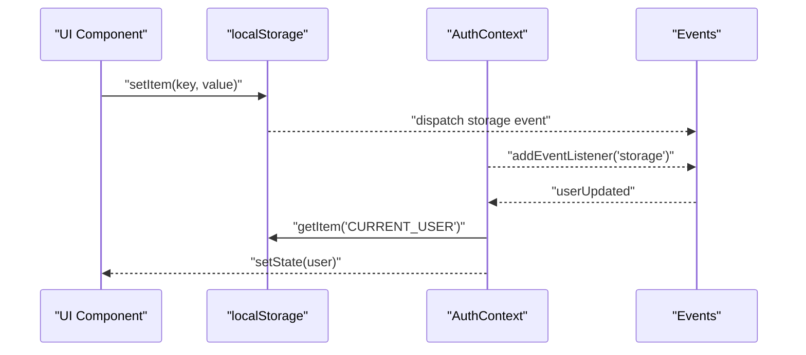

**Diagram sources**
- [AuthContext.tsx](file://src/context/AuthContext.tsx#L58-L77)
- [storage.ts](file://src/lib/storage.ts#L28-L40)

**Section sources**
- [storage.ts](file://src/lib/storage.ts#L1-L633)
- [AuthContext.tsx](file://src/context/AuthContext.tsx#L58-L77)
- [notifications/page.tsx](file://src/app/notifications/page.tsx#L35-L47)

## Dependency Analysis
The following diagram highlights key dependencies among providers, services, and utilities:

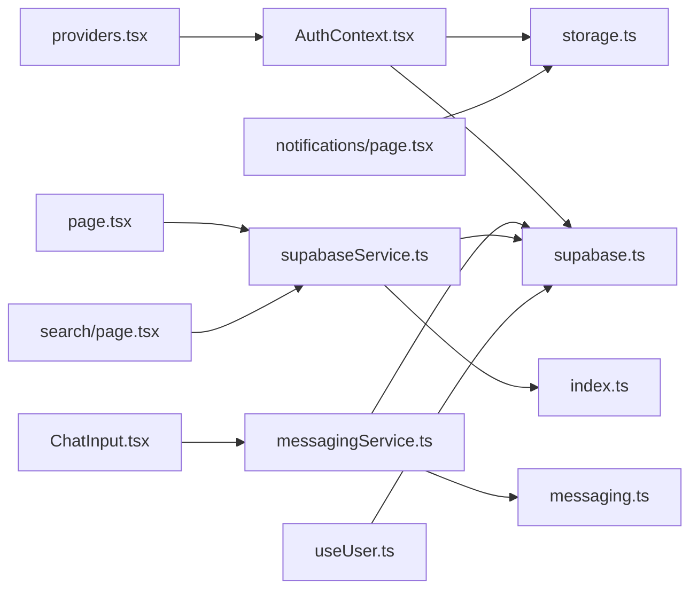

**Diagram sources**
- [AuthContext.tsx](file://src/context/AuthContext.tsx#L1-L10)
- [providers.tsx](file://src/app/providers.tsx#L1-L18)
- [page.tsx](file://src/app/page.tsx#L1-L195)
- [search/page.tsx](file://src/app/search/page.tsx#L1-L220)
- [notifications/page.tsx](file://src/app/notifications/page.tsx#L1-L119)
- [ChatInput.tsx](file://src/components/chat/ChatInput.tsx#L1-L297)
- [supabaseService.ts](file://src/services/supabaseService.ts#L1-L800)
- [messagingService.ts](file://src/services/messagingService.ts#L1-L123)
- [useUser.ts](file://src/hooks/useUser.ts#L1-L178)
- [index.ts](file://src/types/index.ts#L1-L237)
- [messaging.ts](file://src/types/messaging.ts#L1-L37)
- [supabase.ts](file://src/lib/supabase.ts#L1-L68)
- [storage.ts](file://src/lib/storage.ts#L1-L633)

**Section sources**
- [AuthContext.tsx](file://src/context/AuthContext.tsx#L1-L10)
- [supabaseService.ts](file://src/services/supabaseService.ts#L1-L800)
- [messagingService.ts](file://src/services/messagingService.ts#L1-L123)
- [useUser.ts](file://src/hooks/useUser.ts#L1-L178)
- [index.ts](file://src/types/index.ts#L1-L237)
- [messaging.ts](file://src/types/messaging.ts#L1-L37)
- [supabase.ts](file://src/lib/supabase.ts#L1-L68)
- [storage.ts](file://src/lib/storage.ts#L1-L633)

## Performance Considerations
- Prefer client-side filtering only for small datasets; defer heavy text search to the database when feasible.
- Use optimistic UI updates for read operations to reduce perceived latency.
- Batch localStorage writes and debounce frequent updates to minimize re-renders.
- Leverage Supabase RLS and indexes to optimize database queries and reduce payload sizes.
- Cache frequently accessed entities in localStorage to reduce repeated network calls.

## Troubleshooting Guide
Common issues and resolutions:
- Authentication failures: Verify environment variables for Supabase client initialization and ensure mock mode flag alignment.
- Local storage corruption: storage.ts clears corrupted entries and falls back gracefully; inspect browser storage for anomalies.
- Real-time channel errors: Ensure Supabase channels are subscribed before broadcasting and unsubscribe on unmount.
- Notification badge desync: Dispatch storage events after marking notifications read to trigger cross-tab updates.

**Section sources**
- [supabase.ts](file://src/lib/supabase.ts#L3-L15)
- [storage.ts](file://src/lib/storage.ts#L44-L50)
- [messagingService.ts](file://src/services/messagingService.ts#L89-L121)
- [notifications/page.tsx](file://src/app/notifications/page.tsx#L44-L47)

## Conclusion
Gamasa Properties employs a layered architecture combining React Context, local storage, and Supabase to deliver a robust data flow:
- Authentication flows from UI to context, persisted to storage, and synchronized across tabs.
- Property data is fetched via services, transformed to app models, and rendered efficiently.
- Real-time chat and notifications leverage Supabase channels and local storage for responsive UX.
- Mock mode and Supabase mode coexist, enabling rapid development and production-grade features.
- Optimistic updates, cross-tab sync, and error handling contribute to a resilient and user-friendly system.