# Frontend Architecture

<cite>
**Referenced Files in This Document**
- [src/app/layout.tsx](file://src/app/layout.tsx)
- [src/app/providers.tsx](file://src/app/providers.tsx)
- [src/context/AuthContext.tsx](file://src/context/AuthContext.tsx)
- [src/components/ui/Toast.tsx](file://src/components/ui/Toast.tsx)
- [src/components/ThemeToggle.tsx](file://src/components/ThemeToggle.tsx)
- [src/components/Header.tsx](file://src/components/Header.tsx)
- [src/lib/storage.ts](file://src/lib/storage.ts)
- [src/types/index.ts](file://src/types/index.ts)
- [src/app/globals.css](file://src/app/globals.css)
- [tailwind.config.ts](file://tailwind.config.ts)
- [next.config.ts](file://next.config.ts)
- [public/manifest.json](file://public/manifest.json)
- [public/sw.js](file://public/sw.js)
- [package.json](file://package.json)
</cite>

## Table of Contents
1. [Introduction](#introduction)
2. [Project Structure](#project-structure)
3. [Core Components](#core-components)
4. [Architecture Overview](#architecture-overview)
5. [Detailed Component Analysis](#detailed-component-analysis)
6. [Dependency Analysis](#dependency-analysis)
7. [Performance Considerations](#performance-considerations)
8. [Troubleshooting Guide](#troubleshooting-guide)
9. [Conclusion](#conclusion)
10. [Appendices](#appendices)

## Introduction
This document describes the frontend architecture of Gamasa Properties built with Next.js App Router. It covers the layout and provider pattern, component hierarchy, internationalization and RTL support, responsive design, PWA configuration, and state management integration. The goal is to help developers understand how the app is structured, how providers manage cross-cutting concerns, and how UI components are organized for reusability and maintainability.

## Project Structure
The application follows Next.js App Router conventions with a single root layout that wraps all pages. Providers are injected at the root level to make authentication, theming, and toast state available globally. The UI layer is composed of reusable components under src/components, with a dedicated glass UI kit and shared utilities.

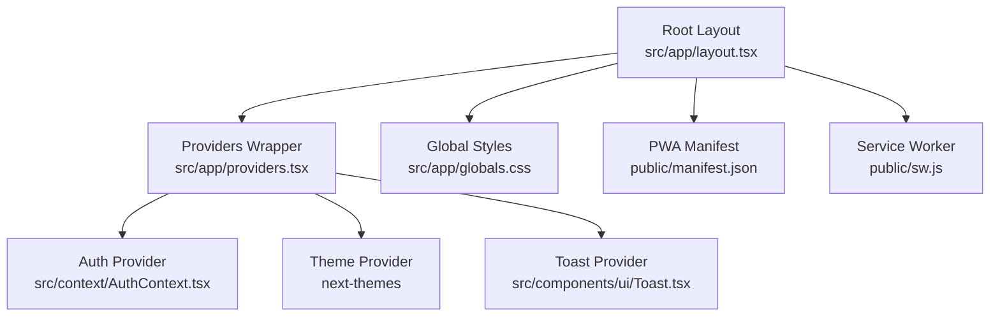

**Diagram sources**
- [src/app/layout.tsx](file://src/app/layout.tsx#L64-L89)
- [src/app/providers.tsx](file://src/app/providers.tsx#L7-L17)
- [src/context/AuthContext.tsx](file://src/context/AuthContext.tsx#L22-L186)
- [src/components/ui/Toast.tsx](file://src/components/ui/Toast.tsx#L19-L54)
- [src/app/globals.css](file://src/app/globals.css#L1-L118)
- [public/manifest.json](file://public/manifest.json#L1-L74)
- [public/sw.js](file://public/sw.js#L1-L2)

**Section sources**
- [src/app/layout.tsx](file://src/app/layout.tsx#L1-L90)
- [src/app/providers.tsx](file://src/app/providers.tsx#L1-L18)

## Core Components
- Root layout sets metadata, viewport, fonts, and wraps children with Providers. It also injects Apple-specific meta tags and Material Symbols.
- Providers composes AuthProvider, ThemeProvider, and ToastProvider to share state across the app.
- AuthProvider manages user session, login/register/logout, and synchronization across browser tabs.
- ToastProvider exposes a toast service with automatic dismissal and styled notifications.
- ThemeToggle toggles between light/dark modes using next-themes.
- Header integrates authentication state, notifications, and user actions.

**Section sources**
- [src/app/layout.tsx](file://src/app/layout.tsx#L20-L89)
- [src/app/providers.tsx](file://src/app/providers.tsx#L7-L17)
- [src/context/AuthContext.tsx](file://src/context/AuthContext.tsx#L22-L186)
- [src/components/ui/Toast.tsx](file://src/components/ui/Toast.tsx#L19-L62)
- [src/components/ThemeToggle.tsx](file://src/components/ThemeToggle.tsx#L6-L27)
- [src/components/Header.tsx](file://src/components/Header.tsx#L9-L222)

## Architecture Overview
The app uses a layered architecture:
- Presentation Layer: Pages and components under src/app and src/components.
- State Management: Context providers encapsulate auth, theme, and toasts.
- Data Access: Local storage utilities under src/lib/storage.ts coordinate mock and Supabase-backed data.
- Styling: Tailwind CSS with a custom design system and global variables.
- PWA: Next.js PWA plugin with Workbox-managed service worker and manifest.

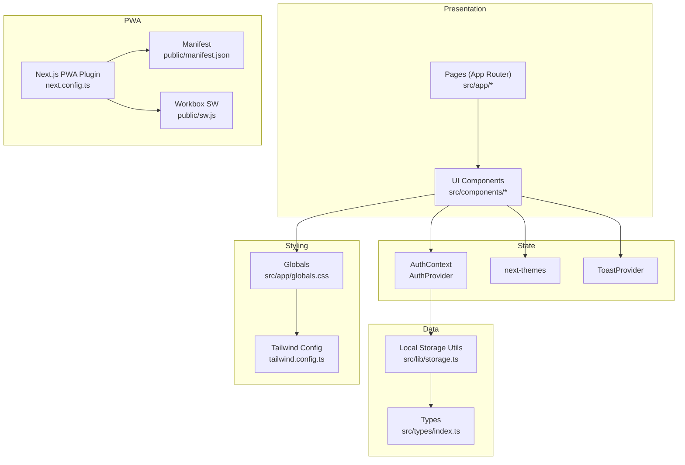

**Diagram sources**
- [src/app/layout.tsx](file://src/app/layout.tsx#L64-L89)
- [src/app/providers.tsx](file://src/app/providers.tsx#L7-L17)
- [src/context/AuthContext.tsx](file://src/context/AuthContext.tsx#L22-L186)
- [src/lib/storage.ts](file://src/lib/storage.ts#L1-L633)
- [src/types/index.ts](file://src/types/index.ts#L1-L237)
- [src/app/globals.css](file://src/app/globals.css#L1-L118)
- [tailwind.config.ts](file://tailwind.config.ts#L1-L36)
- [next.config.ts](file://next.config.ts#L1-L31)
- [public/manifest.json](file://public/manifest.json#L1-L74)
- [public/sw.js](file://public/sw.js#L1-L2)

## Detailed Component Analysis

### Provider Pattern Implementation
The Providers wrapper composes three providers:
- AuthProvider: Manages user state, persistence, and events across tabs.
- ThemeProvider: Provides theme switching and system preference awareness.
- ToastProvider: Exposes a toast service with auto-dismissal.

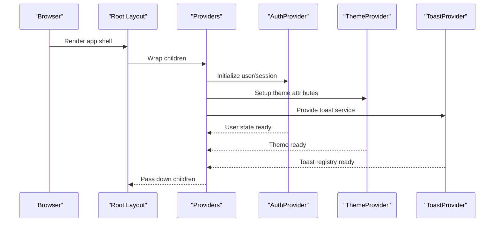

**Diagram sources**
- [src/app/layout.tsx](file://src/app/layout.tsx#L64-L89)
- [src/app/providers.tsx](file://src/app/providers.tsx#L7-L17)
- [src/context/AuthContext.tsx](file://src/context/AuthContext.tsx#L22-L186)
- [src/components/ui/Toast.tsx](file://src/components/ui/Toast.tsx#L19-L54)

**Section sources**
- [src/app/providers.tsx](file://src/app/providers.tsx#L7-L17)
- [src/context/AuthContext.tsx](file://src/context/AuthContext.tsx#L22-L186)
- [src/components/ui/Toast.tsx](file://src/components/ui/Toast.tsx#L19-L62)

### Authentication Flow (Login)
The login flow demonstrates provider usage and state propagation.

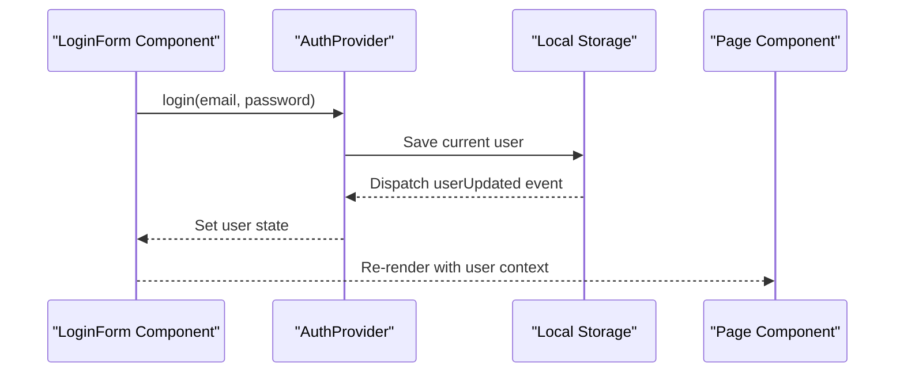

**Diagram sources**
- [src/context/AuthContext.tsx](file://src/context/AuthContext.tsx#L80-L115)
- [src/lib/storage.ts](file://src/lib/storage.ts#L28-L40)

**Section sources**
- [src/context/AuthContext.tsx](file://src/context/AuthContext.tsx#L80-L115)
- [src/lib/storage.ts](file://src/lib/storage.ts#L28-L40)

### Theme Toggle Behavior
ThemeToggle reads the current theme and switches between light and dark modes.

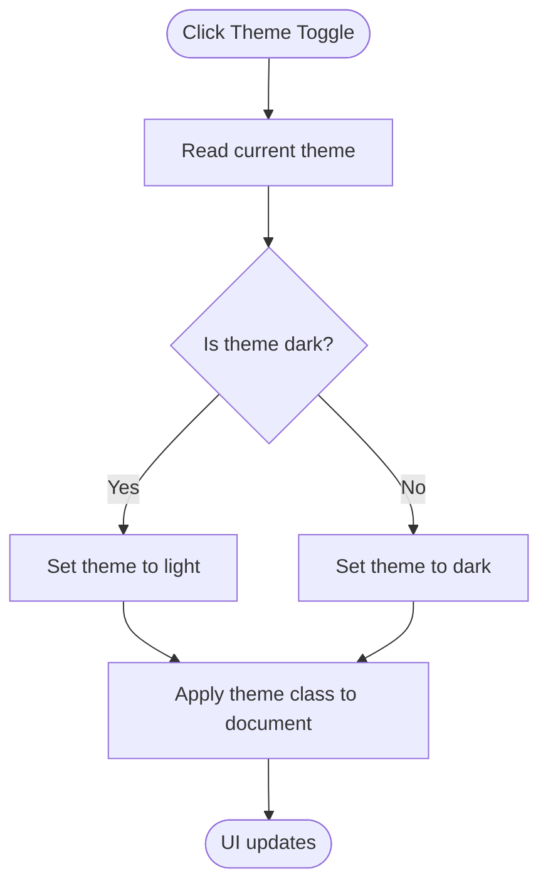

**Diagram sources**
- [src/components/ThemeToggle.tsx](file://src/components/ThemeToggle.tsx#L6-L27)

**Section sources**
- [src/components/ThemeToggle.tsx](file://src/components/ThemeToggle.tsx#L6-L27)

### Toast Notification Lifecycle
ToastProvider maintains a queue and auto-dismisses notifications after a delay.

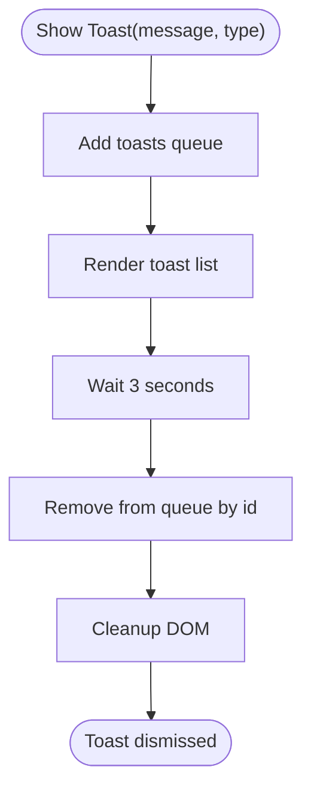

**Diagram sources**
- [src/components/ui/Toast.tsx](file://src/components/ui/Toast.tsx#L22-L29)

**Section sources**
- [src/components/ui/Toast.tsx](file://src/components/ui/Toast.tsx#L22-L29)

### Internationalization, Fonts, and RTL
- Fonts: Noto Sans Arabic and Inter are loaded via next/font/google with CSS variables for consistent usage.
- Directionality: The root html element uses dir="rtl" for Arabic content.
- Metadata: Open Graph and manifest specify Arabic locale and direction.
- Global CSS: Defines color tokens and glass effects; applies safe-area utilities.

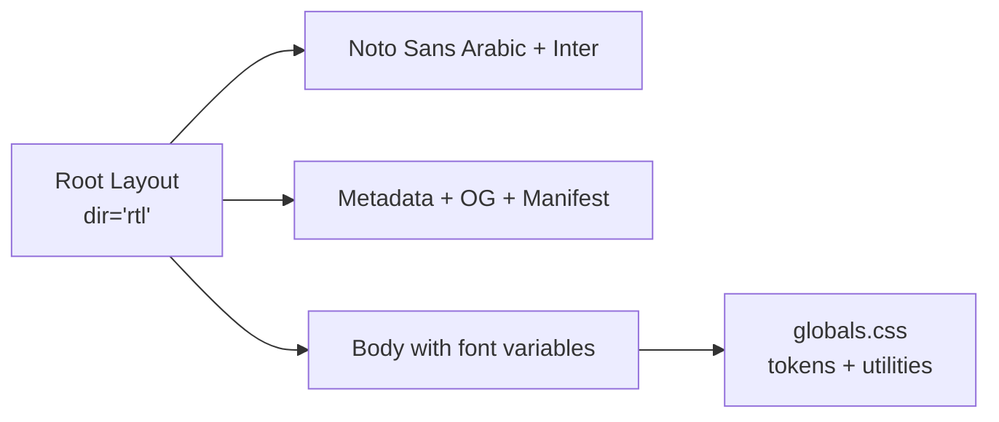

**Diagram sources**
- [src/app/layout.tsx](file://src/app/layout.tsx#L7-L18)
- [src/app/layout.tsx](file://src/app/layout.tsx#L64-L89)
- [src/app/globals.css](file://src/app/globals.css#L8-L49)

**Section sources**
- [src/app/layout.tsx](file://src/app/layout.tsx#L7-L18)
- [src/app/layout.tsx](file://src/app/layout.tsx#L20-L54)
- [src/app/layout.tsx](file://src/app/layout.tsx#L64-L89)
- [src/app/globals.css](file://src/app/globals.css#L8-L49)

### Responsive Design and Glass UI Kit
- Tailwind configuration extends color tokens mapped to CSS variables for dynamic themes.
- Glass components provide backdrop blur and semi-transparent surfaces with dark-mode variants.
- Utilities include scroll-hide and custom focus outlines.

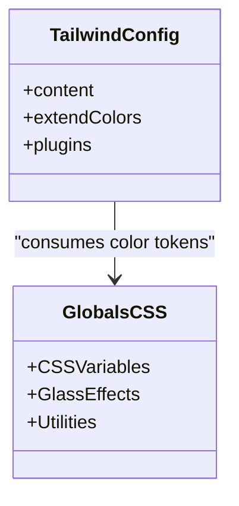

**Diagram sources**
- [tailwind.config.ts](file://tailwind.config.ts#L3-L36)
- [src/app/globals.css](file://src/app/globals.css#L8-L98)

**Section sources**
- [tailwind.config.ts](file://tailwind.config.ts#L9-L33)
- [src/app/globals.css](file://src/app/globals.css#L66-L98)

### PWA Architecture
- Next.js PWA plugin configured with register and skipWaiting for production builds.
- Manifest defines app metadata, icons, orientation, and language.
- Service worker is generated and registered automatically by the plugin; Workbox handles caching strategies.

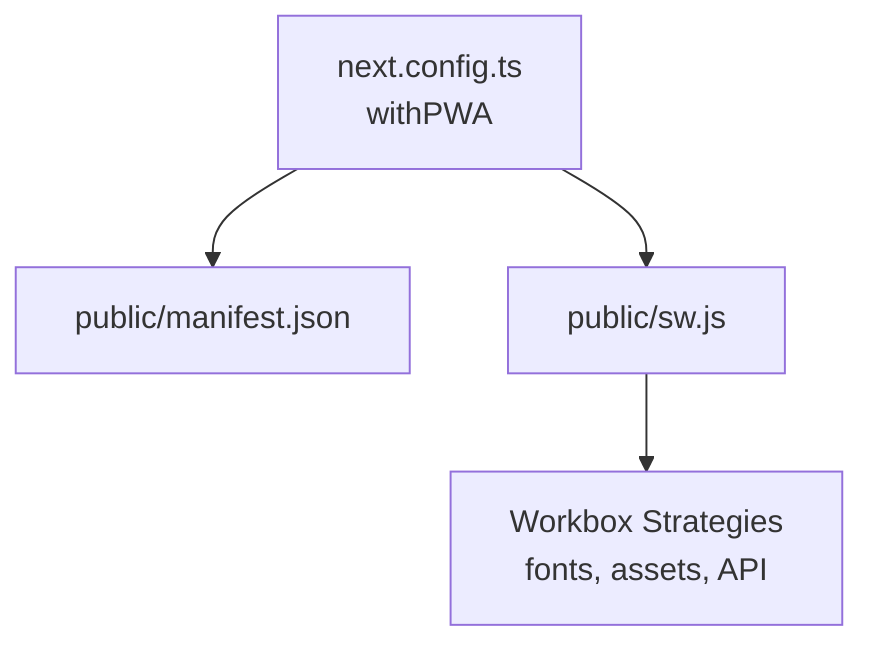

**Diagram sources**
- [next.config.ts](file://next.config.ts#L5-L10)
- [public/manifest.json](file://public/manifest.json#L1-L74)
- [public/sw.js](file://public/sw.js#L1-L2)

**Section sources**
- [next.config.ts](file://next.config.ts#L1-L31)
- [public/manifest.json](file://public/manifest.json#L1-L74)
- [public/sw.js](file://public/sw.js#L1-L2)

### Component Organization Strategy
- Feature-based grouping under src/components for UI elements (auth forms, booking widgets, chat, notifications).
- Shared UI primitives under src/components/ui (glass components, toast).
- Reusable building blocks like ThemeToggle and Header integrate with providers.
- Type definitions centralized under src/types for consistent domain modeling.

**Section sources**
- [src/components/Header.tsx](file://src/components/Header.tsx#L9-L222)
- [src/components/ThemeToggle.tsx](file://src/components/ThemeToggle.tsx#L6-L27)
- [src/types/index.ts](file://src/types/index.ts#L25-L122)

### Prop Drilling Prevention and State Management Integration
- AuthProvider centralizes user state and emits events to synchronize state across tabs.
- ToastProvider exposes a hook for components to show notifications without passing props down the tree.
- ThemeProvider integrates with next-themes to avoid manual DOM manipulation and propagate theme changes efficiently.

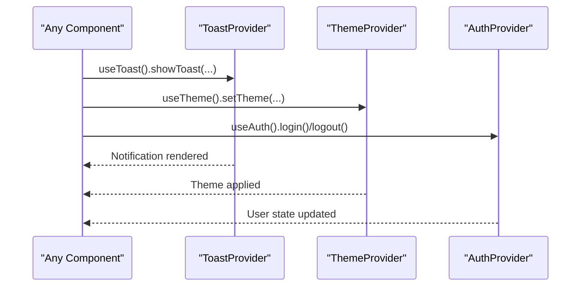

**Diagram sources**
- [src/components/ui/Toast.tsx](file://src/components/ui/Toast.tsx#L56-L62)
- [src/components/ThemeToggle.tsx](file://src/components/ThemeToggle.tsx#L6-L27)
- [src/context/AuthContext.tsx](file://src/context/AuthContext.tsx#L188-L194)

**Section sources**
- [src/context/AuthContext.tsx](file://src/context/AuthContext.tsx#L22-L186)
- [src/components/ui/Toast.tsx](file://src/components/ui/Toast.tsx#L19-L62)
- [src/components/ThemeToggle.tsx](file://src/components/ThemeToggle.tsx#L6-L27)

## Dependency Analysis
External dependencies relevant to architecture:
- next-pwa: Enables PWA features and service worker registration.
- next-themes: Theme switching and system preference handling.
- Tailwind plugins: Forms plugin for consistent form controls.
- Supabase packages: SSRed and JS client for backend integration.

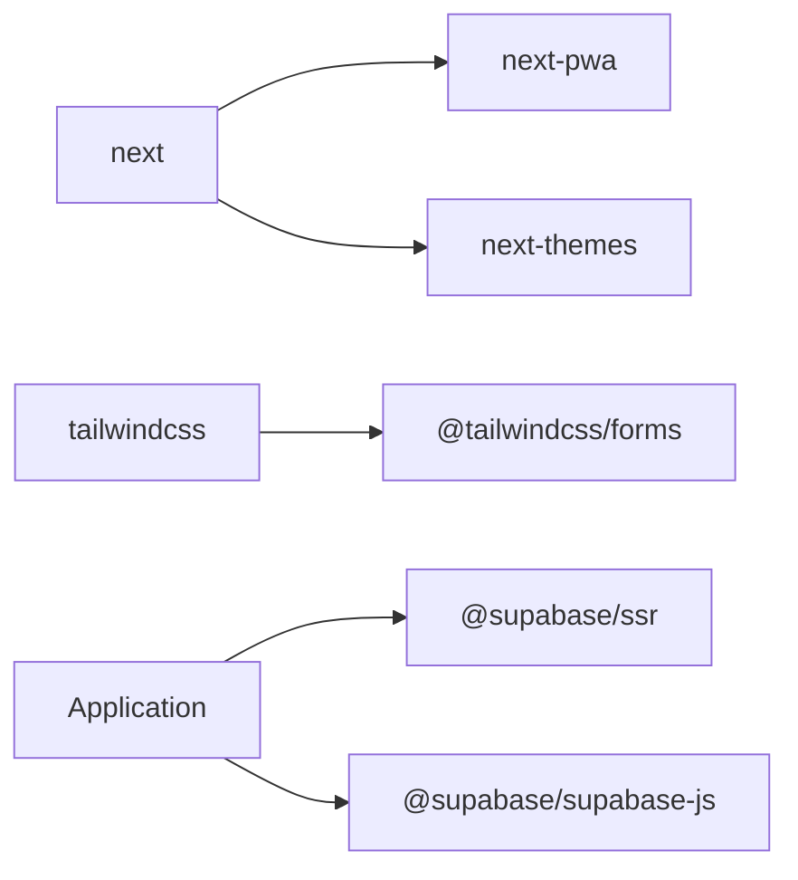

**Diagram sources**
- [package.json](file://package.json#L11-L27)

**Section sources**
- [package.json](file://package.json#L11-L27)

## Performance Considerations
- Font loading: next/font loads Noto Sans Arabic and Inter with display swap to reduce FOIT.
- PWA caching: Workbox strategies cache fonts, assets, and API responses to improve offline and repeat visits.
- Tailwind purging: Content globs target src/app, src/components, and src/pages to minimize CSS size.
- Strict mode: React strict mode enabled to surface potential issues early.

[No sources needed since this section provides general guidance]

## Troubleshooting Guide
- Authentication not persisting across tabs: Verify localStorage events and userUpdated dispatch in storage utilities.
- Toasts not appearing: Ensure ToastProvider wraps the app and useToast is called within its scope.
- Theme not switching: Confirm next-themes is initialized and attribute is set to class.
- PWA not registering: Check manifest fields and ensure production build with PWA enabled.

**Section sources**
- [src/lib/storage.ts](file://src/lib/storage.ts#L32-L36)
- [src/components/ui/Toast.tsx](file://src/components/ui/Toast.tsx#L56-L62)
- [src/components/ThemeToggle.tsx](file://src/components/ThemeToggle.tsx#L6-L27)
- [next.config.ts](file://next.config.ts#L5-L10)

## Conclusion
Gamasa Properties employs a clean Next.js App Router architecture with a root layout and a provider-based state model. The AuthProvider, ThemeProvider, and ToastProvider encapsulate cross-cutting concerns, while reusable UI components and a glass design system deliver a cohesive user experience. Internationalization and RTL are handled through font variables and metadata, and the PWA stack ensures reliable offline and installability.

## Appendices
- Domain types define properties, users, payments, reviews, contracts, notifications, and search filters.
- Storage utilities provide mock and Supabase-backed data access with localStorage synchronization.

**Section sources**
- [src/types/index.ts](file://src/types/index.ts#L25-L122)
- [src/lib/storage.ts](file://src/lib/storage.ts#L18-L40)