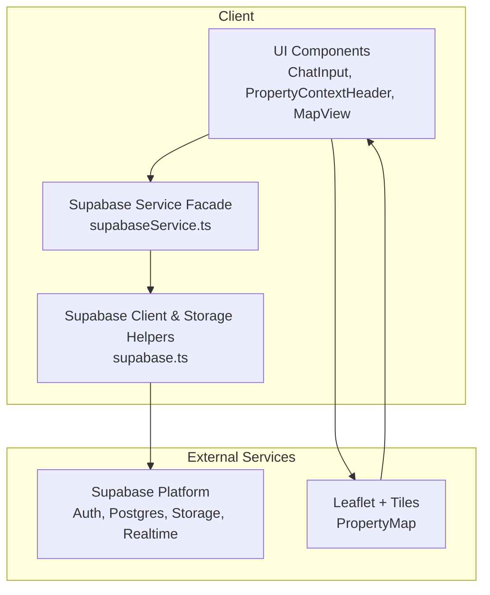
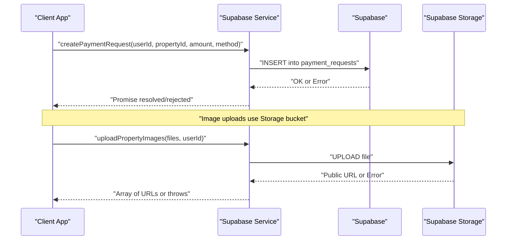
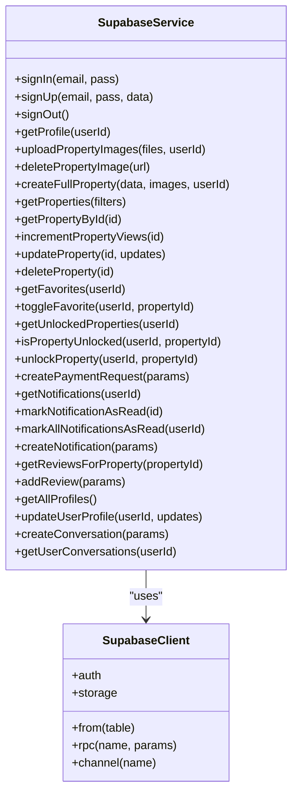
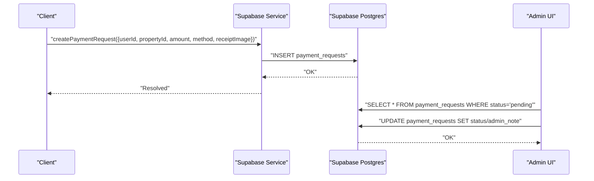
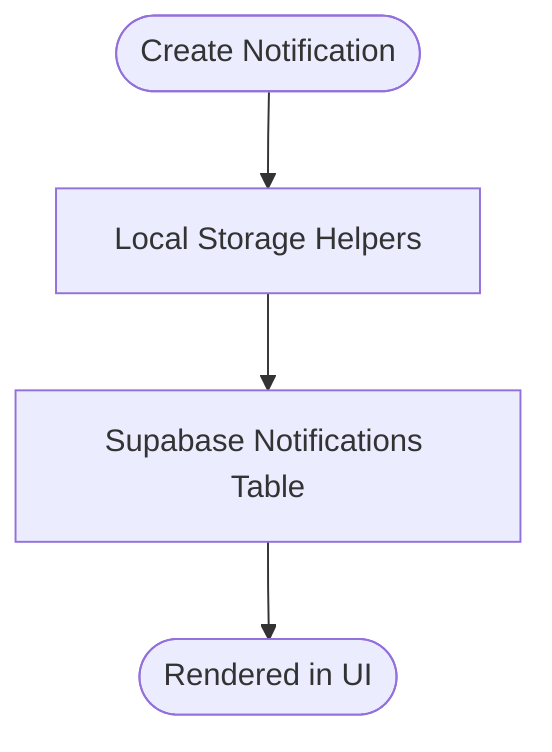
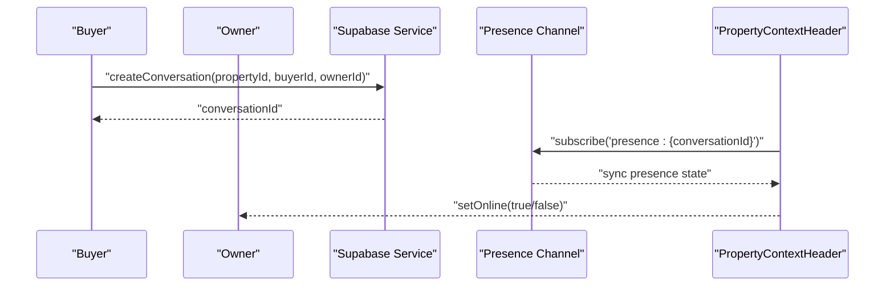
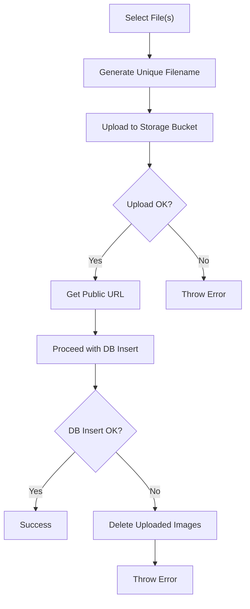
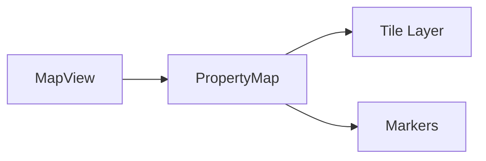
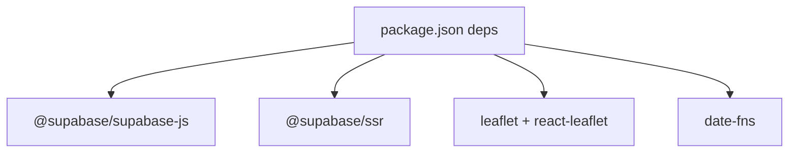

# Integration Patterns

<cite>
**Referenced Files in This Document**
- [supabase.ts](file://src/lib/supabase.ts)
- [supabaseService.ts](file://src/services/supabaseService.ts)
- [types.ts](file://src/lib/notifications/types.ts)
- [helpers.ts](file://src/lib/notifications/helpers.ts)
- [storage.ts](file://src/lib/notifications/storage.ts)
- [index.ts](file://src/lib/notifications/index.ts)
- [page.tsx](file://src/app/admin/payments/page.tsx)
- [database.types.ts](file://src/types/database.types.ts)
- [messaging.ts](file://src/types/messaging.ts)
- [PropertyContextHeader.tsx](file://src/components/chat/PropertyContextHeader.tsx)
- [ChatInput.tsx](file://src/components/chat/ChatInput.tsx)
- [PropertyMap.tsx](file://src/components/PropertyMap.tsx)
- [MapView.tsx](file://src/components/MapView.tsx)
- [implementation-playbook.md](file://.agent/skills/error-handling-patterns/resources/implementation-playbook.md)
- [package.json](file://package.json)
</cite>

## Table of Contents
1. [Introduction](#introduction)
2. [Project Structure](#project-structure)
3. [Core Components](#core-components)
4. [Architecture Overview](#architecture-overview)
5. [Detailed Component Analysis](#detailed-component-analysis)
6. [Dependency Analysis](#dependency-analysis)
7. [Performance Considerations](#performance-considerations)
8. [Troubleshooting Guide](#troubleshooting-guide)
9. [Conclusion](#conclusion)
10. [Appendices](#appendices)

## Introduction
This document describes the integration patterns used by Gamasa Properties for external services. It focuses on:
- Supabase integration for authentication, database operations, storage, and real-time presence
- Payment processor integration patterns for Vodafone Cash, Instapay, and Fawry via the payment_requests table
- Notification system integration with local storage and Supabase-backed notifications
- Messaging and WhatsApp-like tenant communication using Supabase Realtime
- Cloud storage integration for images
- Google Maps integration for property locations
- Analytics integration patterns
- Error handling, retries, and fallback strategies

## Project Structure
The integration surface spans client-side libraries, service abstractions, UI components, and database types. Key areas:
- Supabase client initialization and storage helpers
- Supabase service facade encapsulating CRUD, auth, storage, and messaging
- Notifications module with local persistence and Supabase-backed notifications
- Admin payments page interacting with the payment_requests table
- Messaging types and components leveraging Supabase Realtime presence
- Map components integrating with Leaflet and GeoSearch

**Diagram sources**
- [supabase.ts](file://src/lib/supabase.ts#L1-L68)
- [supabaseService.ts](file://src/services/supabaseService.ts#L1-L120)
- [PropertyMap.tsx](file://src/components/PropertyMap.tsx#L1-L43)
- [MapView.tsx](file://src/components/MapView.tsx#L1-L39)

**Section sources**
- [supabase.ts](file://src/lib/supabase.ts#L1-L68)
- [supabaseService.ts](file://src/services/supabaseService.ts#L1-L120)
- [package.json](file://package.json#L11-L27)

## Core Components
- Supabase client initialization and storage helpers for image upload/delete
- Supabase service facade for authentication, property CRUD, favorites/unlocks, payment requests, notifications, reviews, and conversations/messages
- Local notifications module for client-side notification lifecycle
- Admin payments page for viewing and managing payment requests
- Messaging components using Supabase Realtime presence and channels
- Map components for property location visualization

**Section sources**
- [supabase.ts](file://src/lib/supabase.ts#L1-L68)
- [supabaseService.ts](file://src/services/supabaseService.ts#L153-L785)
- [helpers.ts](file://src/lib/notifications/helpers.ts#L1-L43)
- [page.tsx](file://src/app/admin/payments/page.tsx#L1-L137)
- [PropertyContextHeader.tsx](file://src/components/chat/PropertyContextHeader.tsx#L38-L71)
- [PropertyMap.tsx](file://src/components/PropertyMap.tsx#L1-L43)

## Architecture Overview
The system integrates with Supabase for identity, relational data, file storage, and real-time presence. Payments are recorded in a dedicated table and reviewed by administrators. Notifications are persisted locally and also stored in Supabase. Maps are rendered client-side with Leaflet.

**Diagram sources**
- [supabaseService.ts](file://src/services/supabaseService.ts#L539-L563)
- [supabase.ts](file://src/lib/supabase.ts#L34-L54)

**Section sources**
- [supabaseService.ts](file://src/services/supabaseService.ts#L539-L563)
- [supabase.ts](file://src/lib/supabase.ts#L34-L54)

## Detailed Component Analysis

### Supabase Integration Patterns
- Authentication flows
  - Password-based sign-in/sign-up routed through Supabase client
  - Session persistence and auto-refresh enabled
  - Mock mode flag allows local development without Supabase
- Database operations
  - Strongly typed row/column definitions via generated types
  - CRUD helpers for properties, profiles, favorites, unlocked properties, notifications, reviews, and conversations/messages
  - RPC invocation for side-effecting operations (e.g., incrementing views)
- Real-time subscriptions
  - Presence channels for online status tracking per conversation
  - Reactive UI updates when presence sync events occur
- Cloud storage integration
  - Upload with randomized filenames and cache control
  - Delete by extracting filename from public URL
  - Rollback on partial failures during property creation

**Diagram sources**
- [supabaseService.ts](file://src/services/supabaseService.ts#L153-L785)
- [supabase.ts](file://src/lib/supabase.ts#L1-L68)

**Section sources**
- [supabase.ts](file://src/lib/supabase.ts#L1-L68)
- [supabaseService.ts](file://src/services/supabaseService.ts#L153-L785)

### Payment Processor Integration Patterns (Vodafone Cash, Instapay, Fawry)
- Request submission
  - Clients submit payment requests with method and optional receipt image URL
  - Requests are persisted in the payment_requests table
- Admin review
  - Admins view pending requests, approve or reject, optionally adding notes
- Transaction verification
  - Receipt image URL can be attached to the request for manual verification
- Webhook handling
  - No webhook handlers are present in the repository; payment callbacks would require serverless functions or external integrations not included here

**Diagram sources**
- [supabaseService.ts](file://src/services/supabaseService.ts#L539-L563)
- [page.tsx](file://src/app/admin/payments/page.tsx#L23-L137)
- [database.types.ts](file://src/types/database.types.ts#L186-L222)

**Section sources**
- [supabaseService.ts](file://src/services/supabaseService.ts#L539-L563)
- [page.tsx](file://src/app/admin/payments/page.tsx#L1-L137)
- [database.types.ts](file://src/types/database.types.ts#L186-L222)

### Notification System Integration (Email/SMS)
- Local storage notifications
  - Client-side persistence for quick UX without backend dependency
  - Load/save helpers manage unread counts and status transitions
- Supabase-backed notifications
  - Fetch/create notifications tied to user IDs
  - Mark as read via updates
- Email/SMS integration
  - No email/SMS provider SDKs are present in the repository; notification delivery would require serverless functions or third-party services not included here

**Diagram sources**
- [helpers.ts](file://src/lib/notifications/helpers.ts#L15-L42)
- [storage.ts](file://src/lib/notifications/storage.ts#L1-L23)
- [supabaseService.ts](file://src/services/supabaseService.ts#L566-L637)

**Section sources**
- [helpers.ts](file://src/lib/notifications/helpers.ts#L1-L43)
- [storage.ts](file://src/lib/notifications/storage.ts#L1-L23)
- [supabaseService.ts](file://src/services/supabaseService.ts#L566-L637)

### Messaging and WhatsApp-like Communication
- Conversation lifecycle
  - Create conversation scoped to property and participants
  - Fetch user conversations with joined property/profile data
- Messages and media
  - Send text, image, and voice messages
  - Upload media to storage and attach URLs
- Presence and online status
  - Subscribe to presence channel for a conversation
  - Track owner’s online/offline state and update UI accordingly

**Diagram sources**
- [supabaseService.ts](file://src/services/supabaseService.ts#L740-L769)
- [PropertyContextHeader.tsx](file://src/components/chat/PropertyContextHeader.tsx#L60-L71)
- [ChatInput.tsx](file://src/components/chat/ChatInput.tsx#L96-L122)

**Section sources**
- [supabaseService.ts](file://src/services/supabaseService.ts#L740-L769)
- [PropertyContextHeader.tsx](file://src/components/chat/PropertyContextHeader.tsx#L38-L71)
- [ChatInput.tsx](file://src/components/chat/ChatInput.tsx#L1-L297)
- [messaging.ts](file://src/types/messaging.ts#L1-L36)

### Cloud Storage Integration (Images)
- Upload
  - Randomized filename generation with original extension
  - Cache control and upsert disabled
- Delete
  - Extract filename from public URL and remove from bucket
- Rollback
  - On property creation failure, delete previously uploaded images

**Diagram sources**
- [supabase.ts](file://src/lib/supabase.ts#L34-L54)
- [supabaseService.ts](file://src/services/supabaseService.ts#L258-L311)

**Section sources**
- [supabase.ts](file://src/lib/supabase.ts#L34-L54)
- [supabaseService.ts](file://src/services/supabaseService.ts#L258-L311)

### Google Maps Integration (Property Locations)
- Rendering
  - Dynamic import of map component to avoid SSR issues
  - Center calculated from property coordinates
- Interaction
  - Tile layer and markers for property locations
  - Popup with property details

**Diagram sources**
- [MapView.tsx](file://src/components/MapView.tsx#L1-L39)
- [PropertyMap.tsx](file://src/components/PropertyMap.tsx#L1-L43)

**Section sources**
- [MapView.tsx](file://src/components/MapView.tsx#L1-L39)
- [PropertyMap.tsx](file://src/components/PropertyMap.tsx#L1-L43)

### Analytics Integration Patterns
- No explicit analytics SDKs are imported or configured in the repository
- Suggested patterns:
  - Page view tracking via route change listeners
  - Event logging for actions like property views, favorites, and payment requests
  - Integration with external analytics platforms via serverless functions or client-side SDKs not present here

[No sources needed since this section provides general guidance]

## Dependency Analysis
External dependencies relevant to integrations:
- Supabase client and SSR utilities for auth, db, storage, realtime
- Leaflet and react-leaflet for map rendering
- date-fns for date utilities

**Diagram sources**
- [package.json](file://package.json#L11-L27)

**Section sources**
- [package.json](file://package.json#L11-L27)

## Performance Considerations
- Supabase
  - Use select projections and indexes for frequently queried columns (e.g., status, area, price)
  - Batch operations for image uploads when possible
  - Presence channels should be scoped to active conversations to minimize overhead
- Storage
  - Cache-control headers applied on upload reduce CDN revalidation costs
- Maps
  - Dynamic imports prevent SSR hydration mismatches and improve initial load
- Notifications
  - Prefer server-side delivery for critical alerts; keep local notifications for UX continuity

[No sources needed since this section provides general guidance]

## Troubleshooting Guide
- Missing Supabase environment variables
  - The client initializes with placeholders and logs warnings; configure NEXT_PUBLIC_SUPABASE_URL and NEXT_PUBLIC_SUPABASE_ANON_KEY
- Upload failures
  - Inspect error thrown after storage upload; ensure bucket permissions and file types
- Presence channel not updating
  - Verify channel name format and that presence is enabled for the relevant room
- Payment request errors
  - Check INSERT operation error messages; confirm payment_methods enum values and receipt image URL validity
- Notification persistence
  - Local storage may be unavailable in private browsing; fall back to Supabase notifications

**Section sources**
- [supabase.ts](file://src/lib/supabase.ts#L7-L15)
- [supabase.ts](file://src/lib/supabase.ts#L45-L47)
- [PropertyContextHeader.tsx](file://src/components/chat/PropertyContextHeader.tsx#L60-L71)
- [supabaseService.ts](file://src/services/supabaseService.ts#L550-L562)
- [helpers.ts](file://src/lib/notifications/helpers.ts#L22-L33)

## Conclusion
Gamasa Properties integrates tightly with Supabase for authentication, data, storage, and real-time presence. Payment flows are modeled via a dedicated table with admin approval, while notifications support both local and Supabase-backed persistence. Messaging leverages Supabase Realtime presence for online indicators. Maps are integrated client-side with Leaflet. For production readiness, add webhook handling for payment processors, email/SMS delivery, and analytics instrumentation.

[No sources needed since this section summarizes without analyzing specific files]

## Appendices

### Error Handling, Retries, and Fallbacks
- Use structured error handling around Supabase operations; distinguish recoverable vs unrecoverable errors
- Implement retry logic for transient network errors and rate-limit scenarios
- Provide fallbacks (mock mode, local storage) when external services are unavailable
- Reference the agent skill playbook for patterns and examples

**Section sources**
- [implementation-playbook.md](file://.agent/skills/error-handling-patterns/resources/implementation-playbook.md#L239-L274)