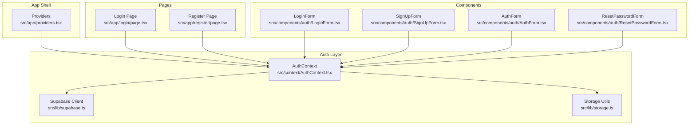
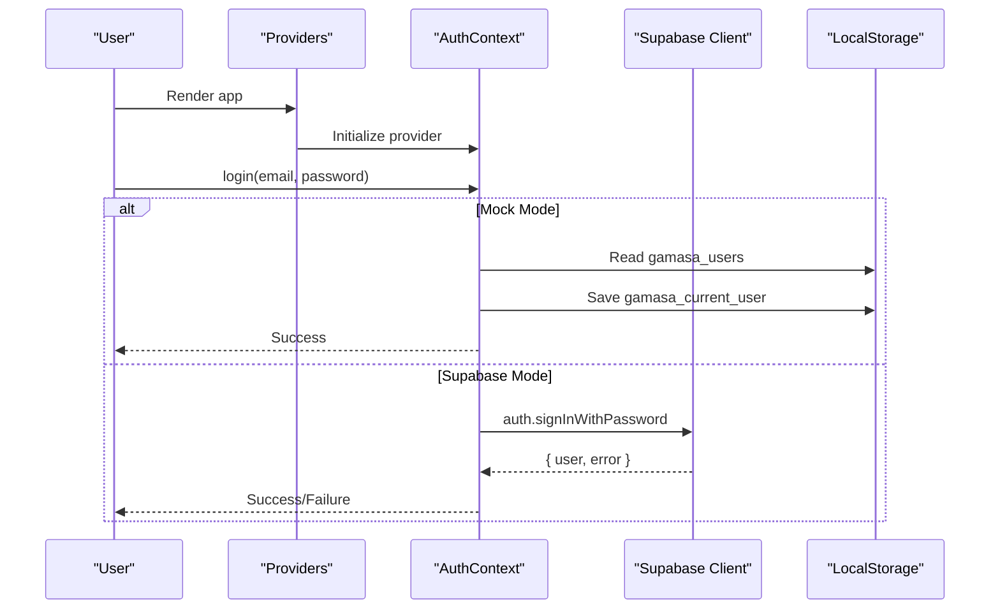
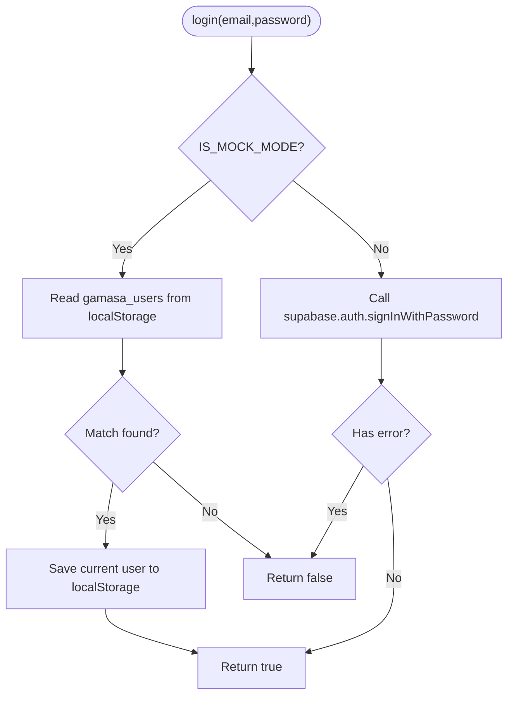
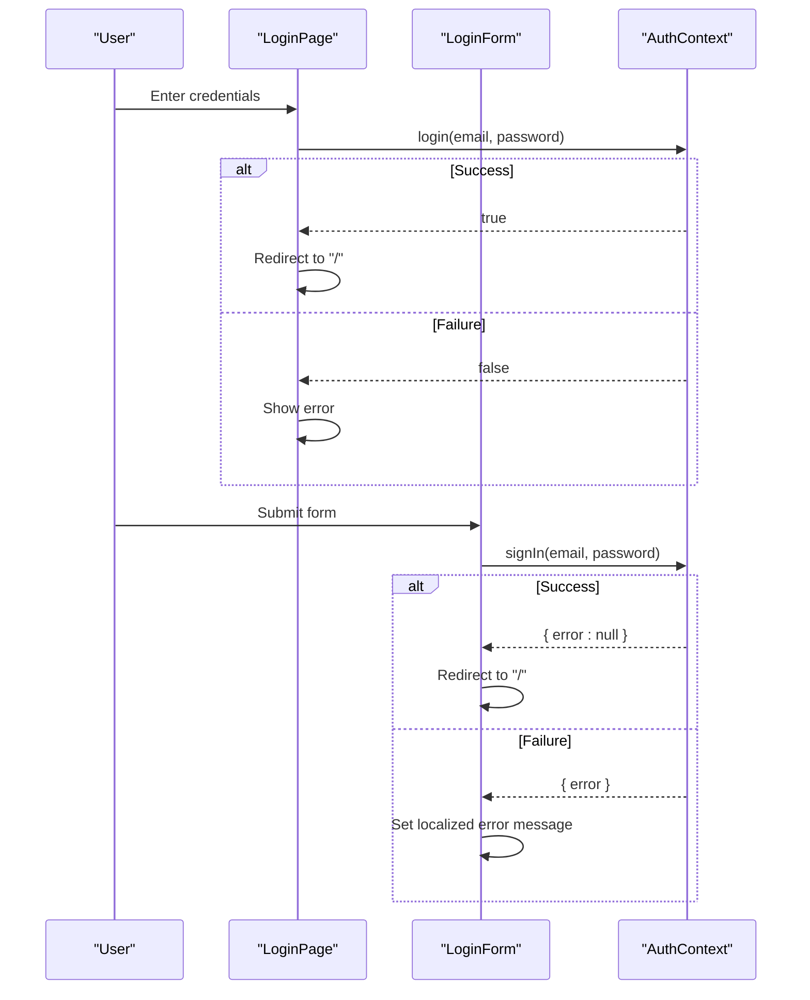
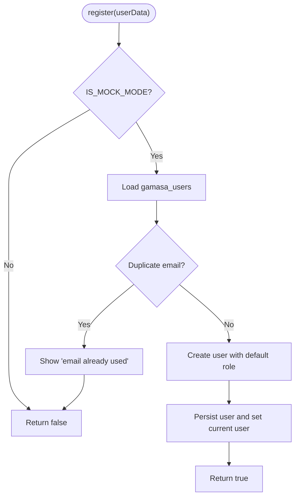
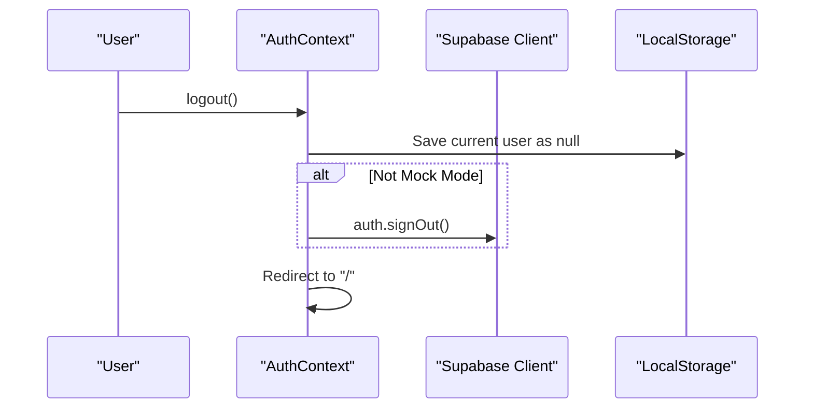
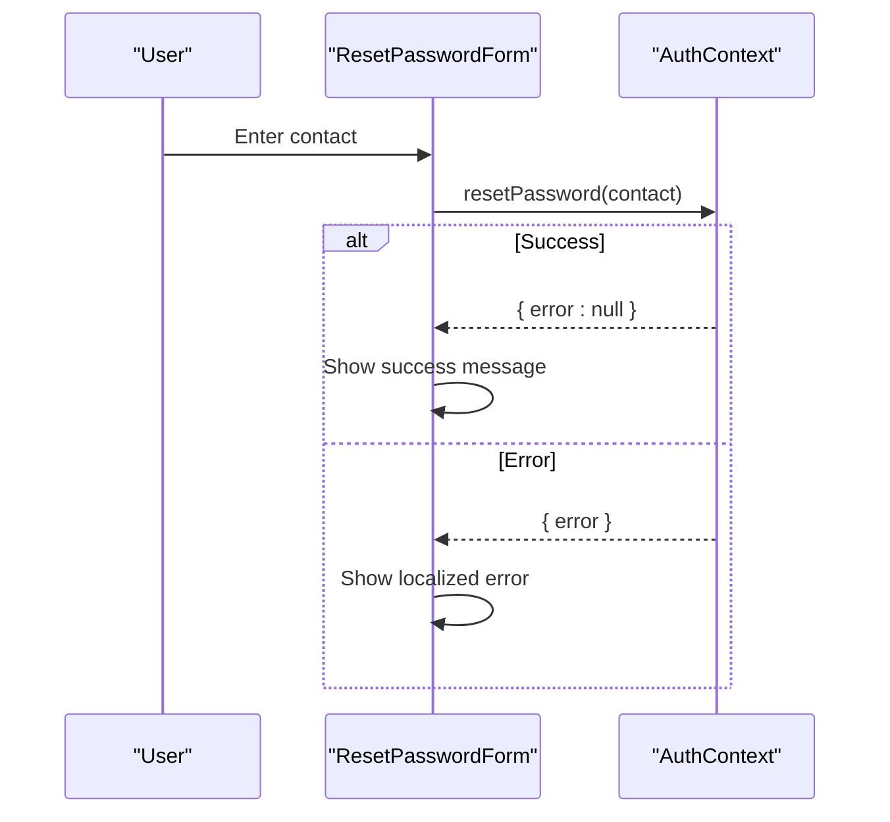
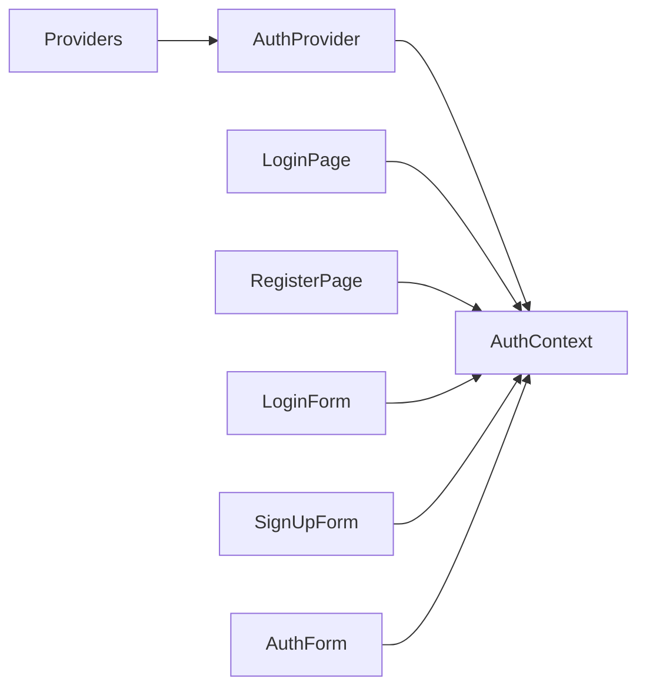
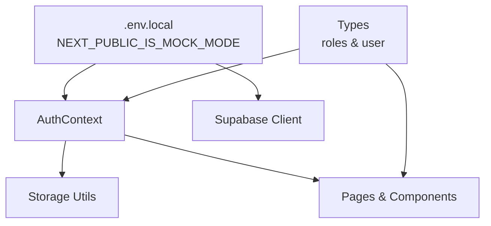

# Authentication Flows

<cite>
**Referenced Files in This Document**
- [AuthContext.tsx](file://src/context/AuthContext.tsx)
- [providers.tsx](file://src/app/providers.tsx)
- [supabase.ts](file://src/lib/supabase.ts)
- [.env.local](file://.env.local)
- [LoginForm.tsx](file://src/components/auth/LoginForm.tsx)
- [SignUpForm.tsx](file://src/components/auth/SignUpForm.tsx)
- [AuthForm.tsx](file://src/components/auth/AuthForm.tsx)
- [ResetPasswordForm.tsx](file://src/components/auth/ResetPasswordForm.tsx)
- [LoginPage.tsx](file://src/app/login/page.tsx)
- [RegisterPage.tsx](file://src/app/register/page.tsx)
- [storage.ts](file://src/lib/storage.ts)
- [useUser.ts](file://src/hooks/useUser.ts)
- [validation.ts](file://src/utils/validation.ts)
- [types/index.ts](file://src/types/index.ts)
- [types/database.types.ts](file://src/types/database.types.ts)
</cite>

## Table of Contents
1. [Introduction](#introduction)
2. [Project Structure](#project-structure)
3. [Core Components](#core-components)
4. [Architecture Overview](#architecture-overview)
5. [Detailed Component Analysis](#detailed-component-analysis)
6. [Dependency Analysis](#dependency-analysis)
7. [Performance Considerations](#performance-considerations)
8. [Troubleshooting Guide](#troubleshooting-guide)
9. [Conclusion](#conclusion)

## Introduction
This document explains the authentication flows for login, registration, and logout across the application. It covers the dual-mode authentication system that supports:
- Mock mode for development (localStorage-backed)
- Supabase Auth for production

It documents the login form implementation, password validation, error handling, success redirection, registration flow including user data validation and duplicate email detection, and logout procedures including session cleanup and state reset. It also includes integration patterns with the AuthContext provider and recommended validation approaches.

## Project Structure
Authentication spans several layers:
- Provider setup wraps the app with AuthContext
- Page-level forms orchestrate user actions
- Components encapsulate UI and form submission
- Context manages authentication state and mode selection
- Utilities provide storage and Supabase client configuration
- Types define roles and user structures

**Diagram sources**
- [providers.tsx](file://src/app/providers.tsx#L7-L16)
- [AuthContext.tsx](file://src/context/AuthContext.tsx#L22-L185)
- [supabase.ts](file://src/lib/supabase.ts#L18-L28)
- [storage.ts](file://src/lib/storage.ts#L28-L40)
- [LoginPage.tsx](file://src/app/login/page.tsx#L8-L29)
- [RegisterPage.tsx](file://src/app/register/page.tsx#L8-L48)
- [LoginForm.tsx](file://src/components/auth/LoginForm.tsx#L13-L46)
- [SignUpForm.tsx](file://src/components/auth/SignUpForm.tsx#L7-L49)
- [AuthForm.tsx](file://src/components/auth/AuthForm.tsx#L8-L53)
- [ResetPasswordForm.tsx](file://src/components/auth/ResetPasswordForm.tsx#L7-L38)

**Section sources**
- [providers.tsx](file://src/app/providers.tsx#L7-L16)
- [AuthContext.tsx](file://src/context/AuthContext.tsx#L22-L185)
- [supabase.ts](file://src/lib/supabase.ts#L18-L28)
- [storage.ts](file://src/lib/storage.ts#L28-L40)
- [LoginPage.tsx](file://src/app/login/page.tsx#L8-L29)
- [RegisterPage.tsx](file://src/app/register/page.tsx#L8-L48)
- [LoginForm.tsx](file://src/components/auth/LoginForm.tsx#L13-L46)
- [SignUpForm.tsx](file://src/components/auth/SignUpForm.tsx#L7-L49)
- [AuthForm.tsx](file://src/components/auth/AuthForm.tsx#L8-L53)
- [ResetPasswordForm.tsx](file://src/components/auth/ResetPasswordForm.tsx#L7-L38)

## Core Components
- AuthContext: Centralizes authentication logic, exposes login/register/logout, and selects mock vs Supabase mode via environment flag. It persists current user in localStorage and synchronizes state across tabs.
- Supabase Client: Initializes Supabase with environment variables and enables auto-refresh tokens and session persistence.
- Storage Utilities: Provide localStorage wrappers and events to keep user state synchronized across browser tabs.
- Page-level Forms: Handle user input capture, basic validation, and navigation after success.
- Component Forms: Provide reusable UI for login, sign-up, and password reset with localized error handling.

Key behaviors:
- Dual-mode selection via NEXT_PUBLIC_IS_MOCK_MODE
- Mock mode stores users and current user in localStorage
- Supabase mode integrates with Supabase Auth and profiles
- Logout clears current user and invokes Supabase sign out when applicable

**Section sources**
- [AuthContext.tsx](file://src/context/AuthContext.tsx#L8-L18)
- [AuthContext.tsx](file://src/context/AuthContext.tsx#L80-L170)
- [supabase.ts](file://src/lib/supabase.ts#L4-L28)
- [storage.ts](file://src/lib/storage.ts#L28-L40)
- [LoginPage.tsx](file://src/app/login/page.tsx#L8-L29)
- [RegisterPage.tsx](file://src/app/register/page.tsx#L8-L48)
- [LoginForm.tsx](file://src/components/auth/LoginForm.tsx#L13-L46)
- [SignUpForm.tsx](file://src/components/auth/SignUpForm.tsx#L7-L49)
- [AuthForm.tsx](file://src/components/auth/AuthForm.tsx#L8-L53)
- [ResetPasswordForm.tsx](file://src/components/auth/ResetPasswordForm.tsx#L7-L38)

## Architecture Overview
The authentication system is structured around a provider that injects authentication capabilities into the app. Pages and components submit user actions to the context, which either executes mock logic or delegates to Supabase depending on the mode.

**Diagram sources**
- [providers.tsx](file://src/app/providers.tsx#L7-L16)
- [AuthContext.tsx](file://src/context/AuthContext.tsx#L80-L115)
- [supabase.ts](file://src/lib/supabase.ts#L18-L28)
- [storage.ts](file://src/lib/storage.ts#L28-L40)

## Detailed Component Analysis

### AuthContext: Dual-Mode Authentication
AuthContext controls:
- Mode detection via NEXT_PUBLIC_IS_MOCK_MODE
- Loading current user from localStorage on startup
- Listening to localStorage changes to synchronize state across tabs
- Login: mock mode validates credentials against stored users; Supabase mode calls auth.signInWithPassword
- Register: mock mode checks duplicate emails and creates a default role user; Supabase path is reserved
- Logout: clears current user and calls Supabase sign out when not in mock mode

**Diagram sources**
- [AuthContext.tsx](file://src/context/AuthContext.tsx#L80-L115)
- [storage.ts](file://src/lib/storage.ts#L28-L40)

**Section sources**
- [AuthContext.tsx](file://src/context/AuthContext.tsx#L8-L18)
- [AuthContext.tsx](file://src/context/AuthContext.tsx#L22-L78)
- [AuthContext.tsx](file://src/context/AuthContext.tsx#L80-L115)
- [AuthContext.tsx](file://src/context/AuthContext.tsx#L117-L161)
- [AuthContext.tsx](file://src/context/AuthContext.tsx#L163-L170)
- [storage.ts](file://src/lib/storage.ts#L28-L40)

### Login Flow
Two login experiences are available:
- Page-level login form: captures email/password, calls context.login, redirects on success
- Component-based login form: captures via FormData, displays localized errors, redirects on success

**Diagram sources**
- [LoginPage.tsx](file://src/app/login/page.tsx#L18-L29)
- [LoginForm.tsx](file://src/components/auth/LoginForm.tsx#L20-L46)
- [AuthContext.tsx](file://src/context/AuthContext.tsx#L80-L115)

**Section sources**
- [LoginPage.tsx](file://src/app/login/page.tsx#L8-L29)
- [LoginForm.tsx](file://src/components/auth/LoginForm.tsx#L13-L46)
- [AuthContext.tsx](file://src/context/AuthContext.tsx#L80-L115)

### Registration Flow
Two registration experiences:
- Page-level registration: validates password confirmation locally, calls context.register, redirects on success
- Component-based sign-up: collects name, phone, email, password, role, terms agreement, calls context.signUp, redirects on success

**Diagram sources**
- [RegisterPage.tsx](file://src/app/register/page.tsx#L26-L48)
- [SignUpForm.tsx](file://src/components/auth/SignUpForm.tsx#L16-L49)
- [AuthContext.tsx](file://src/context/AuthContext.tsx#L117-L161)
- [storage.ts](file://src/lib/storage.ts#L28-L40)

**Section sources**
- [RegisterPage.tsx](file://src/app/register/page.tsx#L8-L48)
- [SignUpForm.tsx](file://src/components/auth/SignUpForm.tsx#L7-L49)
- [AuthContext.tsx](file://src/context/AuthContext.tsx#L117-L161)
- [storage.ts](file://src/lib/storage.ts#L28-L40)

### Logout Procedure
Logout clears the current user from localStorage and triggers Supabase sign out when not in mock mode, then redirects to the home page.

**Diagram sources**
- [AuthContext.tsx](file://src/context/AuthContext.tsx#L163-L170)
- [supabase.ts](file://src/lib/supabase.ts#L18-L28)

**Section sources**
- [AuthContext.tsx](file://src/context/AuthContext.tsx#L163-L170)

### Password Reset Flow
The reset form collects a contact identifier (email or phone), submits to context.resetPassword, and displays success or error messages.

**Diagram sources**
- [ResetPasswordForm.tsx](file://src/components/auth/ResetPasswordForm.tsx#L14-L38)
- [AuthContext.tsx](file://src/context/AuthContext.tsx#L80-L115)

**Section sources**
- [ResetPasswordForm.tsx](file://src/components/auth/ResetPasswordForm.tsx#L7-L38)
- [AuthContext.tsx](file://src/context/AuthContext.tsx#L80-L115)

### Integration with AuthContext Provider
The provider stack ensures AuthContext is available across the app. Pages and components consume authentication methods via useAuth.

**Diagram sources**
- [providers.tsx](file://src/app/providers.tsx#L7-L16)
- [AuthContext.tsx](file://src/context/AuthContext.tsx#L22-L185)
- [LoginPage.tsx](file://src/app/login/page.tsx#L8-L29)
- [RegisterPage.tsx](file://src/app/register/page.tsx#L8-L48)
- [LoginForm.tsx](file://src/components/auth/LoginForm.tsx#L13-L46)
- [SignUpForm.tsx](file://src/components/auth/SignUpForm.tsx#L7-L49)
- [AuthForm.tsx](file://src/components/auth/AuthForm.tsx#L8-L53)

**Section sources**
- [providers.tsx](file://src/app/providers.tsx#L7-L16)
- [AuthContext.tsx](file://src/context/AuthContext.tsx#L22-L185)

## Dependency Analysis
- Environment-driven mode: NEXT_PUBLIC_IS_MOCK_MODE determines whether to use localStorage or Supabase
- Supabase client initialization depends on NEXT_PUBLIC_SUPABASE_URL and NEXT_PUBLIC_SUPABASE_ANON_KEY
- AuthContext depends on storage utilities for current user persistence and cross-tab synchronization
- Page and component forms depend on AuthContext for authentication actions
- Types define roles and user structures used across contexts and components

**Diagram sources**
- [.env.local](file://.env.local#L3)
- [AuthContext.tsx](file://src/context/AuthContext.tsx#L8-L18)
- [supabase.ts](file://src/lib/supabase.ts#L4-L28)
- [storage.ts](file://src/lib/storage.ts#L28-L40)
- [types/index.ts](file://src/types/index.ts#L56-L70)
- [types/database.types.ts](file://src/types/database.types.ts#L14-L52)

**Section sources**
- [.env.local](file://.env.local#L1-L4)
- [AuthContext.tsx](file://src/context/AuthContext.tsx#L8-L18)
- [supabase.ts](file://src/lib/supabase.ts#L4-L28)
- [storage.ts](file://src/lib/storage.ts#L28-L40)
- [types/index.ts](file://src/types/index.ts#L56-L70)
- [types/database.types.ts](file://src/types/database.types.ts#L14-L52)

## Performance Considerations
- Mock mode avoids network calls by operating purely on localStorage, reducing latency and enabling offline-like development.
- Supabase mode benefits from auto-refresh tokens and persisted sessions, minimizing re-authentication overhead.
- Cross-tab synchronization uses localStorage events to avoid stale state, preventing redundant network requests.
- Keep registration and login forms lightweight; defer heavy operations to background tasks or server actions.

## Troubleshooting Guide
Common issues and resolutions:
- Missing environment variables: If Supabase URL or anon key are missing, the client logs warnings and initializes with placeholders. Ensure .env.local is configured.
- Mock mode not activating: Verify NEXT_PUBLIC_IS_MOCK_MODE is set to true in .env.local.
- Duplicate email during registration: Mock mode prevents duplicate emails; ensure unique emails are used.
- Cross-tab state desync: Storage utilities emit events to synchronize state; ensure no other code mutates localStorage without using the provided utilities.
- Supabase sign out failures: Logout clears current user and calls Supabase sign out; confirm Supabase is initialized and online.

**Section sources**
- [supabase.ts](file://src/lib/supabase.ts#L7-L15)
- [.env.local](file://.env.local#L3)
- [AuthContext.tsx](file://src/context/AuthContext.tsx#L117-L161)
- [storage.ts](file://src/lib/storage.ts#L28-L40)
- [AuthContext.tsx](file://src/context/AuthContext.tsx#L163-L170)

## Conclusion
The authentication system provides a flexible dual-mode approach suitable for development and production. AuthContext centralizes logic, pages and components encapsulate UX, and utilities manage persistence and Supabase integration. Following the patterns documented here ensures consistent login, registration, and logout experiences across the application.