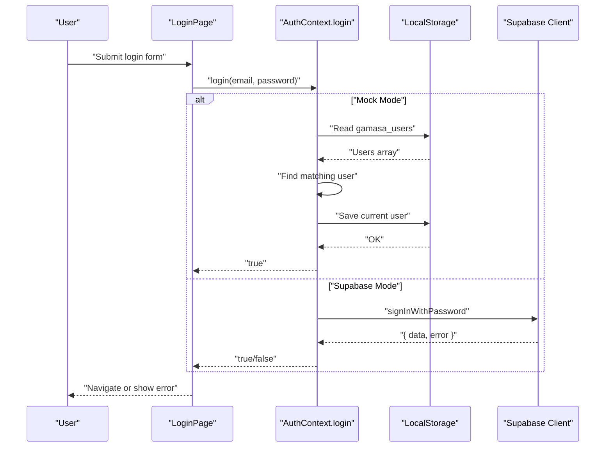
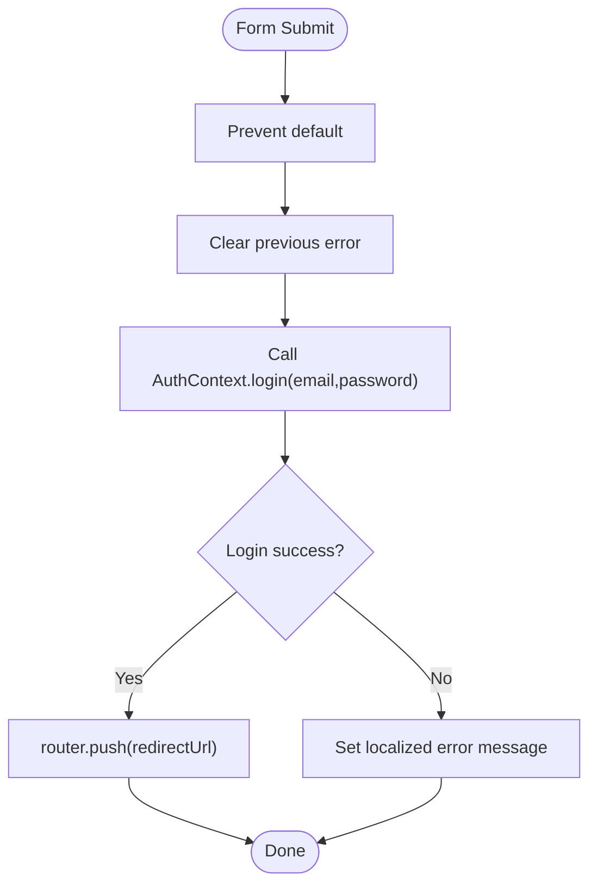
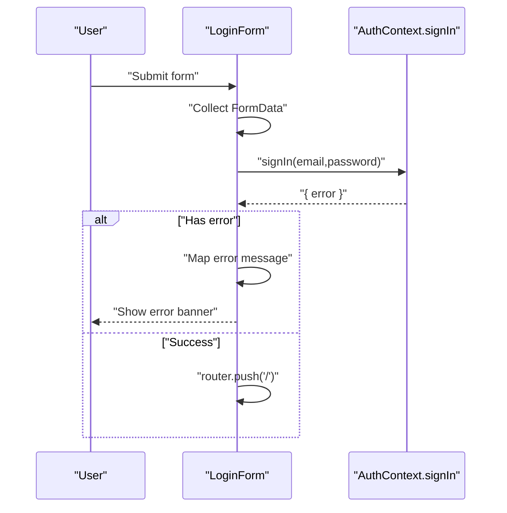
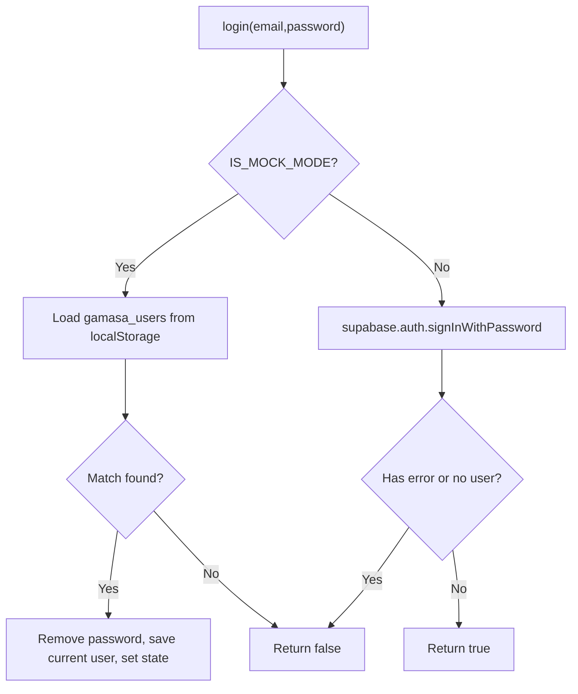
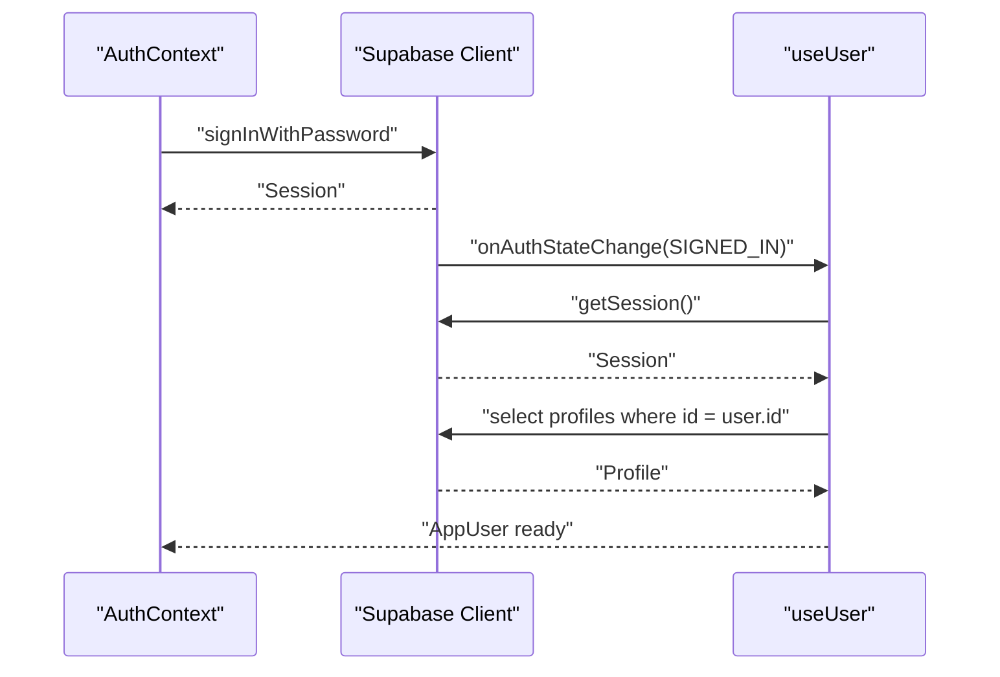
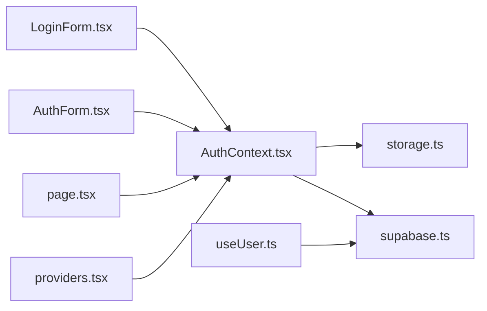

# Login Process

<cite>
**Referenced Files in This Document**
- [page.tsx](file://src/app/login/page.tsx)
- [LoginForm.tsx](file://src/components/auth/LoginForm.tsx)
- [AuthForm.tsx](file://src/components/auth/AuthForm.tsx)
- [AuthContext.tsx](file://src/context/AuthContext.tsx)
- [storage.ts](file://src/lib/storage.ts)
- [supabase.ts](file://src/lib/supabase.ts)
- [useUser.ts](file://src/hooks/useUser.ts)
- [providers.tsx](file://src/app/providers.tsx)
- [validation.ts](file://src/utils/validation.ts)
- [types/index.ts](file://src/types/index.ts)
- [package.json](file://package.json)
</cite>

## Table of Contents
1. [Introduction](#introduction)
2. [Project Structure](#project-structure)
3. [Core Components](#core-components)
4. [Architecture Overview](#architecture-overview)
5. [Detailed Component Analysis](#detailed-component-analysis)
6. [Dependency Analysis](#dependency-analysis)
7. [Performance Considerations](#performance-considerations)
8. [Troubleshooting Guide](#troubleshooting-guide)
9. [Conclusion](#conclusion)

## Introduction
This document explains the login process implementation across the application’s dual-mode authentication system. It covers the login form components, email/password validation, authentication logic, error handling, dual-mode support (mock vs Supabase Auth), state management, loading indicators, and user feedback. It also provides integration guidance with the AuthContext, common login errors, retry mechanisms, and security considerations.

## Project Structure
The login flow spans several layers:
- UI pages and components for login forms
- Authentication context managing state and dual-mode logic
- Local storage utilities for mock mode persistence
- Supabase client for Supabase Auth integration
- Utility validations and shared types

```mermaid
graph TB
subgraph "Pages"
LoginPage["src/app/login/page.tsx"]
end
subgraph "Components"
LoginForm["src/components/auth/LoginForm.tsx"]
AuthForm["src/components/auth/AuthForm.tsx"]
end
subgraph "Context & Hooks"
AuthContext["src/context/AuthContext.tsx"]
UseUser["src/hooks/useUser.ts"]
end
subgraph "Libraries"
Storage["src/lib/storage.ts"]
Supabase["src/lib/supabase.ts"]
end
subgraph "Providers"
Providers["src/app/providers.tsx"]
end
LoginPage --> AuthContext
LoginForm --> AuthContext
AuthForm --> AuthContext
AuthContext --> Storage
AuthContext --> Supabase
UseUser --> Supabase
Providers --> AuthContext
```

**Diagram sources**
- [page.tsx](file://src/app/login/page.tsx#L1-L89)
- [LoginForm.tsx](file://src/components/auth/LoginForm.tsx#L1-L220)
- [AuthForm.tsx](file://src/components/auth/AuthForm.tsx#L1-L150)
- [AuthContext.tsx](file://src/context/AuthContext.tsx#L1-L195)
- [storage.ts](file://src/lib/storage.ts#L1-L633)
- [supabase.ts](file://src/lib/supabase.ts#L1-L68)
- [useUser.ts](file://src/hooks/useUser.ts#L1-L178)
- [providers.tsx](file://src/app/providers.tsx#L1-L18)

**Section sources**
- [page.tsx](file://src/app/login/page.tsx#L1-L89)
- [providers.tsx](file://src/app/providers.tsx#L1-L18)

## Core Components
- Login Page (Next.js App Router page) renders a minimal login form and delegates submission to the AuthContext.
- LoginForm (Client Component) provides a rich form with social login options and inline validation feedback.
- AuthForm (Glass UI form) toggles between login and signup modes and integrates with AuthContext.
- AuthContext manages user state, loading, and dual-mode authentication logic.
- Local storage utilities support mock mode user persistence.
- Supabase client enables Supabase Auth when mock mode is disabled.
- useUser hook integrates Supabase Auth state and profile retrieval.

**Section sources**
- [page.tsx](file://src/app/login/page.tsx#L8-L29)
- [LoginForm.tsx](file://src/components/auth/LoginForm.tsx#L7-L46)
- [AuthForm.tsx](file://src/components/auth/AuthForm.tsx#L8-L53)
- [AuthContext.tsx](file://src/context/AuthContext.tsx#L11-L194)
- [storage.ts](file://src/lib/storage.ts#L294-L300)
- [supabase.ts](file://src/lib/supabase.ts#L1-L68)
- [useUser.ts](file://src/hooks/useUser.ts#L37-L176)

## Architecture Overview
The login architecture supports two modes controlled by an environment flag:
- Mock Mode: Uses localStorage for users and current user persistence; login validates credentials against stored users.
- Supabase Mode: Delegates authentication to Supabase Auth; the app listens for auth state changes and persists a mapped user locally.



**Diagram sources**
- [page.tsx](file://src/app/login/page.tsx#L18-L29)
- [AuthContext.tsx](file://src/context/AuthContext.tsx#L80-L115)
- [storage.ts](file://src/lib/storage.ts#L294-L300)
- [supabase.ts](file://src/lib/supabase.ts#L18-L28)

## Detailed Component Analysis

### LoginPage Component
- Purpose: Minimal login page with email/password inputs and a single submit handler.
- Submission handling:
  - Prevents default form submission.
  - Clears prior errors.
  - Calls AuthContext.login(email, password).
  - On success, navigates to the redirect URL; otherwise, sets a localized error message.
- Loading and feedback:
  - Disabled button while loading via AuthContext.loading.
  - Displays error banner when present.
- Validation:
  - Uses HTML5 required attributes on inputs.
  - No custom JS validation in this component.



**Diagram sources**
- [page.tsx](file://src/app/login/page.tsx#L18-L29)

**Section sources**
- [page.tsx](file://src/app/login/page.tsx#L8-L29)

### LoginForm Component
- Purpose: Rich login form with social login buttons and inline feedback.
- Submission handling:
  - Prevents default form submission.
  - Gathers FormData values for email and password.
  - Calls AuthContext.signIn(email, password).
  - Handles error mapping for invalid credentials and unexpected errors.
  - Navigates to home on success.
- Loading and feedback:
  - Tracks local loading state and disables the submit button.
  - Shows error banner with localized messages.
  - Provides “Forgot password” and “Sign up” transitions.
- Social login:
  - Integrates with AuthContext.signInWithGoogle and signInWithFacebook.



**Diagram sources**
- [LoginForm.tsx](file://src/components/auth/LoginForm.tsx#L20-L46)

**Section sources**
- [LoginForm.tsx](file://src/components/auth/LoginForm.tsx#L7-L46)

### AuthForm Component
- Purpose: Toggleable form switching between login and signup modes using a shared UI.
- Submission handling:
  - Gathers email, password, and optional full_name.
  - Calls AuthContext.signIn or AuthContext.signUp depending on mode.
  - Displays success message on registration and navigates after successful login.
- Loading and feedback:
  - Manages loading, error, and success states.
  - Disables the submit button during async operations.

**Section sources**
- [AuthForm.tsx](file://src/components/auth/AuthForm.tsx#L8-L53)

### AuthContext: Dual-Mode Authentication
- Mode selection:
  - Controlled by NEXT_PUBLIC_IS_MOCK_MODE flag (defaults to true if unset).
- Login logic:
  - Mock Mode:
    - Reads gamasa_users from localStorage.
    - Matches email/password to find a user.
    - Saves current user to localStorage and updates context state.
  - Supabase Mode:
    - Calls supabase.auth.signInWithPassword.
    - Returns success/failure; does not persist a mapped user locally in this method.
- Registration logic:
  - Mock Mode:
    - Validates uniqueness by email.
    - Creates a new user with defaults and saves to localStorage.
    - Persists current user and updates context state.
- Logout:
  - Clears current user and calls supabase.auth.signOut when not in mock mode.
- State synchronization:
  - Subscribes to localStorage events to keep state consistent across tabs.



**Diagram sources**
- [AuthContext.tsx](file://src/context/AuthContext.tsx#L80-L115)
- [storage.ts](file://src/lib/storage.ts#L294-L300)
- [supabase.ts](file://src/lib/supabase.ts#L18-L28)

**Section sources**
- [AuthContext.tsx](file://src/context/AuthContext.tsx#L8-L115)
- [storage.ts](file://src/lib/storage.ts#L294-L300)
- [supabase.ts](file://src/lib/supabase.ts#L1-L28)

### Supabase Integration and useUser Hook
- Supabase client initialization:
  - Reads NEXT_PUBLIC_SUPABASE_URL and NEXT_PUBLIC_SUPABASE_ANON_KEY.
  - Enables autoRefreshToken, persistSession, and detectSessionInUrl.
- useUser hook:
  - Loads current session and profile from Supabase.
  - Subscribes to auth state changes (SIGNED_IN/SIGNED_OUT).
  - Maps Supabase user/profile to AppUser for compatibility.



**Diagram sources**
- [supabase.ts](file://src/lib/supabase.ts#L18-L28)
- [useUser.ts](file://src/hooks/useUser.ts#L56-L107)

**Section sources**
- [supabase.ts](file://src/lib/supabase.ts#L1-L68)
- [useUser.ts](file://src/hooks/useUser.ts#L37-L176)

### Email/Password Validation
- Built-in validation:
  - HTML5 required attributes on inputs.
  - Email input type for basic format hint.
- Additional validation utilities:
  - validation.ts provides reusable validators for messages and files; while not used in login forms, the same patterns can be applied for custom validation if needed.

**Section sources**
- [page.tsx](file://src/app/login/page.tsx#L48-L67)
- [LoginForm.tsx](file://src/components/auth/LoginForm.tsx#L83-L109)
- [validation.ts](file://src/utils/validation.ts#L1-L33)

### Error Handling and User Feedback
- LoginPage:
  - Displays a red banner with a localized error message when login fails.
  - Disables the submit button while loading.
- LoginForm:
  - Maps Supabase “Invalid login credentials” to a localized message.
  - Catches unexpected errors and logs them.
  - Disables the submit button while loading.
- AuthForm:
  - Displays error and success banners.
  - Disables the submit button while loading.

**Section sources**
- [page.tsx](file://src/app/login/page.tsx#L39-L43)
- [LoginForm.tsx](file://src/components/auth/LoginForm.tsx#L29-L45)
- [AuthForm.tsx](file://src/components/auth/AuthForm.tsx#L16-L53)

### State Management and Loading Indicators
- LoginPage:
  - Uses AuthContext.loading to disable the button and display a localized loading label.
- LoginForm:
  - Maintains local loading state and disables the submit button.
- AuthContext:
  - Sets loading around login/register operations.
  - Updates user state upon success.

**Section sources**
- [page.tsx](file://src/app/login/page.tsx#L70-L76)
- [LoginForm.tsx](file://src/components/auth/LoginForm.tsx#L14-L18)
- [AuthContext.tsx](file://src/context/AuthContext.tsx#L80-L115)

### Integration with AuthContext
- LoginPage:
  - Imports useAuth and reads login, loading, and router.
- LoginForm:
  - Imports useAuth and reads signIn, signInWithGoogle, signInWithFacebook, and router.
- AuthForm:
  - Imports useAuth and reads signIn, signUp, and router.

**Section sources**
- [page.tsx](file://src/app/login/page.tsx#L3-L11)
- [LoginForm.tsx](file://src/components/auth/LoginForm.tsx#L3-L18)
- [AuthForm.tsx](file://src/components/auth/AuthForm.tsx#L3-L14)

## Dependency Analysis
- AuthContext depends on:
  - Local storage utilities for mock mode.
  - Supabase client for Supabase mode.
- LoginForm and AuthForm depend on:
  - AuthContext for authentication actions.
  - Router for navigation.
- useUser depends on:
  - Supabase client for session and profile retrieval.



**Diagram sources**
- [AuthContext.tsx](file://src/context/AuthContext.tsx#L1-L195)
- [storage.ts](file://src/lib/storage.ts#L1-L633)
- [supabase.ts](file://src/lib/supabase.ts#L1-L68)
- [LoginForm.tsx](file://src/components/auth/LoginForm.tsx#L1-L220)
- [AuthForm.tsx](file://src/components/auth/AuthForm.tsx#L1-L150)
- [page.tsx](file://src/app/login/page.tsx#L1-L89)
- [useUser.ts](file://src/hooks/useUser.ts#L1-L178)
- [providers.tsx](file://src/app/providers.tsx#L1-L18)

**Section sources**
- [package.json](file://package.json#L11-L27)

## Performance Considerations
- Prefer client components for interactive forms (already marked with "use client").
- Avoid unnecessary re-renders by keeping form state local to the component and using AuthContext for global state.
- Debounce or throttle repeated submissions by disabling the submit button while loading.
- In mock mode, limit localStorage reads/writes to essential operations.

## Troubleshooting Guide
- Common login errors:
  - Invalid credentials: LoginForm maps Supabase error to a localized message.
  - Unexpected errors: Logged to console; LoginForm displays a generic message.
  - Environment variables missing: Supabase client warns if NEXT_PUBLIC_SUPABASE_URL or NEXT_PUBLIC_SUPABASE_ANON_KEY are not set.
- Retry mechanisms:
  - LoginForm and AuthForm set loading state and disable the submit button; on failure, they surface an error and allow the user to correct input and resubmit.
- Security considerations:
  - Passwords are handled via Supabase Auth in Supabase mode; in mock mode, passwords are stored in localStorage and should be avoided in production.
  - Ensure NEXT_PUBLIC_IS_MOCK_MODE is false in production environments.
  - Keep environment variables secure and avoid exposing tokens to the client unnecessarily.

**Section sources**
- [LoginForm.tsx](file://src/components/auth/LoginForm.tsx#L29-L45)
- [supabase.ts](file://src/lib/supabase.ts#L7-L15)
- [AuthContext.tsx](file://src/context/AuthContext.tsx#L84-L95)

## Conclusion
The login process is implemented with a clear separation of concerns: UI components manage user input and feedback, AuthContext encapsulates dual-mode authentication logic, and Supabase integration provides robust session management in production. The system supports both mock and Supabase modes, offers consistent loading and error feedback, and maintains user state across tabs. For production, ensure mock mode is disabled and environment variables are properly configured.