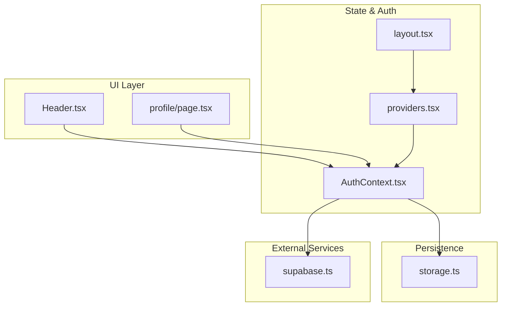
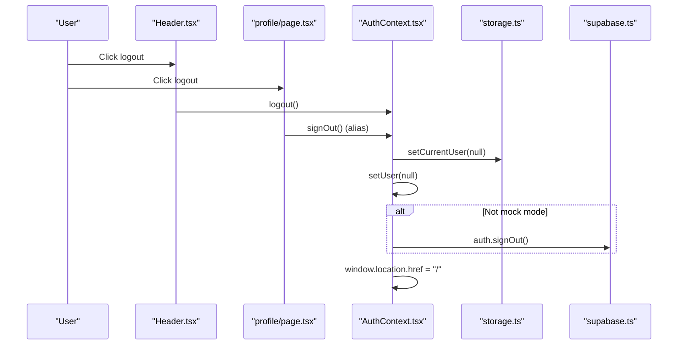
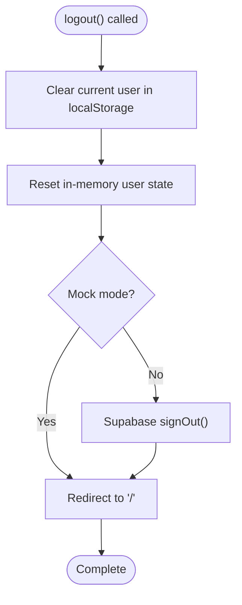
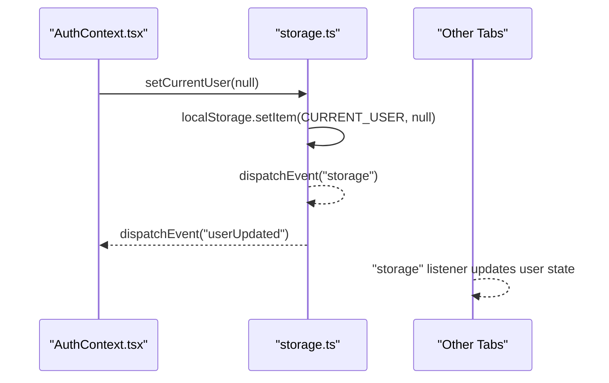
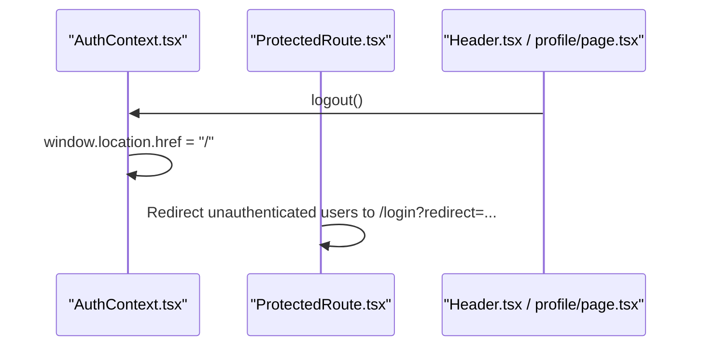
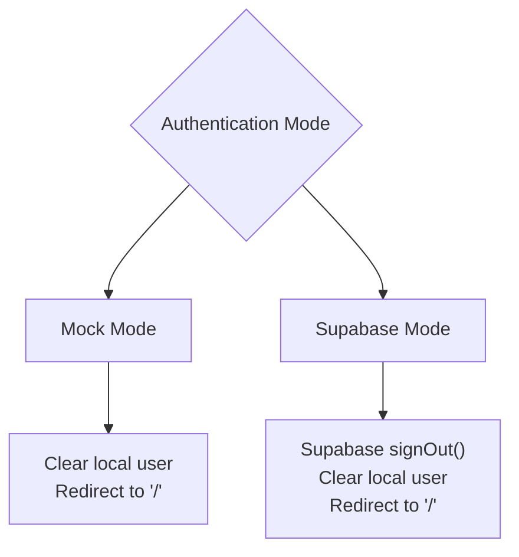
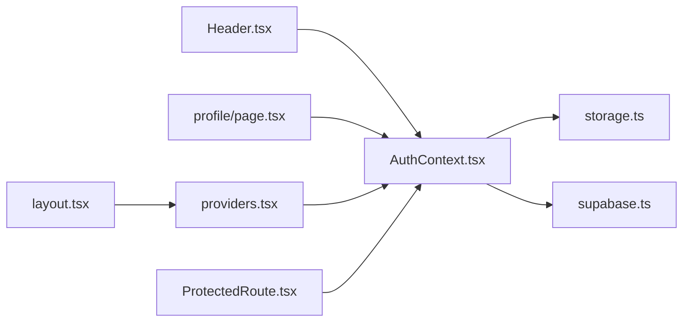

# Logout Process

<cite>
**Referenced Files in This Document**
- [AuthContext.tsx](file://src/context/AuthContext.tsx)
- [storage.ts](file://src/lib/storage.ts)
- [supabase.ts](file://src/lib/supabase.ts)
- [Header.tsx](file://src/components/Header.tsx)
- [profile/page.tsx](file://src/app/profile/page.tsx)
- [ProtectedRoute.tsx](file://src/components/ProtectedRoute.tsx)
- [providers.tsx](file://src/app/providers.tsx)
- [layout.tsx](file://src/app/layout.tsx)
</cite>

## Table of Contents
1. [Introduction](#introduction)
2. [Project Structure](#project-structure)
3. [Core Components](#core-components)
4. [Architecture Overview](#architecture-overview)
5. [Detailed Component Analysis](#detailed-component-analysis)
6. [Dependency Analysis](#dependency-analysis)
7. [Performance Considerations](#performance-considerations)
8. [Troubleshooting Guide](#troubleshooting-guide)
9. [Conclusion](#conclusion)

## Introduction
This document explains the logout process implementation across the application’s authentication system. It covers the logout function, session cleanup, local storage management, and state reset procedures. It also details how logout behaves under different authentication modes, ensures complete session termination, describes redirect behavior, and outlines cleanup of user data and asynchronous operations. Security considerations for session invalidation and data protection during logout are addressed, along with practical integration examples for UI components and navigation.

## Project Structure
The logout flow spans several layers:
- Context and provider layer for global authentication state
- Local storage utilities for user persistence and cross-tab synchronization
- Supabase client for session management and sign-out
- UI components that trigger logout and reflect authentication state
- Navigation guards and providers that wrap the app

**Diagram sources**
- [Header.tsx](file://src/components/Header.tsx#L1-L222)
- [profile/page.tsx](file://src/app/profile/page.tsx#L200-L289)
- [AuthContext.tsx](file://src/context/AuthContext.tsx#L1-L195)
- [providers.tsx](file://src/app/providers.tsx#L1-L18)
- [layout.tsx](file://src/app/layout.tsx#L1-L90)
- [storage.ts](file://src/lib/storage.ts#L1-L633)
- [supabase.ts](file://src/lib/supabase.ts#L1-L68)

**Section sources**
- [AuthContext.tsx](file://src/context/AuthContext.tsx#L1-L195)
- [storage.ts](file://src/lib/storage.ts#L1-L633)
- [supabase.ts](file://src/lib/supabase.ts#L1-L68)
- [Header.tsx](file://src/components/Header.tsx#L1-L222)
- [profile/page.tsx](file://src/app/profile/page.tsx#L200-L289)
- [providers.tsx](file://src/app/providers.tsx#L1-L18)
- [layout.tsx](file://src/app/layout.tsx#L1-L90)

## Core Components
- AuthContext provides the logout function and exposes authentication state to the app.
- storage utilities manage local user data and broadcast changes across tabs.
- Supabase client manages session persistence and performs server-side sign-out.
- UI components (Header and Profile page) expose logout actions to users.
- Providers and layout wrap the app to initialize the authentication context.

Key responsibilities:
- Logout function clears local user state and triggers Supabase sign-out when applicable.
- Local storage is cleared or reset to ensure no stale user data remains.
- Cross-tab synchronization is handled via storage events and custom events.
- Redirect behavior is enforced by navigation guards and UI links.

**Section sources**
- [AuthContext.tsx](file://src/context/AuthContext.tsx#L163-L170)
- [storage.ts](file://src/lib/storage.ts#L28-L40)
- [supabase.ts](file://src/lib/supabase.ts#L18-L28)
- [Header.tsx](file://src/components/Header.tsx#L113-L119)
- [profile/page.tsx](file://src/app/profile/page.tsx#L219-L225)

## Architecture Overview
The logout flow integrates UI triggers, state updates, local storage cleanup, and external session termination.

**Diagram sources**
- [Header.tsx](file://src/components/Header.tsx#L113-L119)
- [profile/page.tsx](file://src/app/profile/page.tsx#L219-L225)
- [AuthContext.tsx](file://src/context/AuthContext.tsx#L163-L170)
- [storage.ts](file://src/lib/storage.ts#L298-L300)
- [supabase.ts](file://src/lib/supabase.ts#L18-L28)

## Detailed Component Analysis

### Logout Function Implementation
The logout function resides in the authentication context and orchestrates:
- Clearing the current user from local storage
- Resetting the in-memory user state
- Performing server-side sign-out when not in mock mode
- Redirecting to the home page

**Diagram sources**
- [AuthContext.tsx](file://src/context/AuthContext.tsx#L163-L170)

**Section sources**
- [AuthContext.tsx](file://src/context/AuthContext.tsx#L163-L170)

### Session Cleanup and Local Storage Management
Local storage cleanup is performed via a dedicated setter that persists the change and emits events to synchronize state across tabs. The storage module defines keys for user data and emits both a generic storage event and a custom userUpdated event for immediate updates within the same tab.

**Diagram sources**
- [storage.ts](file://src/lib/storage.ts#L28-L40)
- [AuthContext.tsx](file://src/context/AuthContext.tsx#L58-L72)

**Section sources**
- [storage.ts](file://src/lib/storage.ts#L28-L40)
- [AuthContext.tsx](file://src/context/AuthContext.tsx#L58-L72)

### State Reset Procedures
On logout, the context resets the user state and stops listening to storage events. Cross-tab synchronization is achieved through:
- The storage event listener reacting to changes in the current user key
- A custom userUpdated event dispatched when the current user key changes

These mechanisms ensure that all tabs reflect the updated authentication state immediately.

**Section sources**
- [AuthContext.tsx](file://src/context/AuthContext.tsx#L58-L78)

### Redirect Behavior and Navigation Integration
After logout, the application redirects to the home page. UI components integrate logout actions as follows:
- Header component provides a logout button that calls the context’s logout function
- Profile page provides a prominent logout button that triggers signOut (alias to logout)
- Navigation guards redirect unauthenticated users to the login page with a redirect parameter

**Diagram sources**
- [AuthContext.tsx](file://src/context/AuthContext.tsx#L169)
- [Header.tsx](file://src/components/Header.tsx#L113-L119)
- [profile/page.tsx](file://src/app/profile/page.tsx#L219-L225)
- [ProtectedRoute.tsx](file://src/components/ProtectedRoute.tsx#L13-L19)

**Section sources**
- [AuthContext.tsx](file://src/context/AuthContext.tsx#L169)
- [Header.tsx](file://src/components/Header.tsx#L113-L119)
- [profile/page.tsx](file://src/app/profile/page.tsx#L219-L225)
- [ProtectedRoute.tsx](file://src/components/ProtectedRoute.tsx#L13-L19)

### Authentication Modes and Session Termination
The application supports two authentication modes:
- Mock mode: Uses local storage for user persistence; logout clears local data and redirects
- Supabase mode: Uses Supabase for session management; logout invokes server-side sign-out and clears local state

**Diagram sources**
- [AuthContext.tsx](file://src/context/AuthContext.tsx#L84-L96)
- [AuthContext.tsx](file://src/context/AuthContext.tsx#L166-L169)
- [supabase.ts](file://src/lib/supabase.ts#L18-L28)

**Section sources**
- [AuthContext.tsx](file://src/context/AuthContext.tsx#L84-L96)
- [AuthContext.tsx](file://src/context/AuthContext.tsx#L166-L169)
- [supabase.ts](file://src/lib/supabase.ts#L18-L28)

### Cleanup of User Data and Asynchronous Operations
Cleanup includes:
- Removing the current user from local storage
- Resetting the in-memory user state
- Ensuring cross-tab synchronization via storage and custom events
- No explicit asynchronous cleanup is performed in the logout flow; the redirect completes the process

**Section sources**
- [storage.ts](file://src/lib/storage.ts#L298-L300)
- [AuthContext.tsx](file://src/context/AuthContext.tsx#L163-L170)

### Security Considerations
- Server-side sign-out: In Supabase mode, the client calls signOut to terminate the session on the server, preventing continued access with the same credentials.
- Local data removal: Clearing the current user from local storage prevents accidental reuse of stale user data.
- Cross-tab consistency: Using storage events and a custom userUpdated event ensures that all tabs reflect the logged-out state promptly.
- Redirect behavior: Navigation guards enforce re-authentication for protected routes, reducing the risk of accessing protected content after logout.

**Section sources**
- [supabase.ts](file://src/lib/supabase.ts#L18-L28)
- [storage.ts](file://src/lib/storage.ts#L28-L40)
- [AuthContext.tsx](file://src/context/AuthContext.tsx#L58-L72)
- [ProtectedRoute.tsx](file://src/components/ProtectedRoute.tsx#L13-L19)

### Code Examples and Integration Notes
- Logout button in Header:
  - Trigger: Click on the logout icon
  - Handler: Calls the context’s logout function
  - Reference: [Header.tsx](file://src/components/Header.tsx#L113-L119)
- Logout button in Profile:
  - Trigger: Click on the logout button
  - Handler: Calls signOut (alias to logout)
  - Reference: [profile/page.tsx](file://src/app/profile/page.tsx#L219-L225)
- Provider and layout initialization:
  - The AuthProvider wraps the app to make authentication state available globally
  - References: [providers.tsx](file://src/app/providers.tsx#L7-L16), [layout.tsx](file://src/app/layout.tsx#L82-L85)

**Section sources**
- [Header.tsx](file://src/components/Header.tsx#L113-L119)
- [profile/page.tsx](file://src/app/profile/page.tsx#L219-L225)
- [providers.tsx](file://src/app/providers.tsx#L7-L16)
- [layout.tsx](file://src/app/layout.tsx#L82-L85)

## Dependency Analysis
The logout flow depends on:
- AuthContext for the logout function and authentication state
- storage.ts for local user persistence and cross-tab synchronization
- supabase.ts for server-side session termination
- UI components for triggering logout actions
- Navigation guards for enforcing authentication checks

**Diagram sources**
- [Header.tsx](file://src/components/Header.tsx#L1-L222)
- [profile/page.tsx](file://src/app/profile/page.tsx#L200-L289)
- [AuthContext.tsx](file://src/context/AuthContext.tsx#L1-L195)
- [storage.ts](file://src/lib/storage.ts#L1-L633)
- [supabase.ts](file://src/lib/supabase.ts#L1-L68)
- [providers.tsx](file://src/app/providers.tsx#L1-L18)
- [layout.tsx](file://src/app/layout.tsx#L1-L90)
- [ProtectedRoute.tsx](file://src/components/ProtectedRoute.tsx#L1-L31)

**Section sources**
- [AuthContext.tsx](file://src/context/AuthContext.tsx#L1-L195)
- [storage.ts](file://src/lib/storage.ts#L1-L633)
- [supabase.ts](file://src/lib/supabase.ts#L1-L68)
- [Header.tsx](file://src/components/Header.tsx#L1-L222)
- [profile/page.tsx](file://src/app/profile/page.tsx#L200-L289)
- [providers.tsx](file://src/app/providers.tsx#L1-L18)
- [layout.tsx](file://src/app/layout.tsx#L1-L90)
- [ProtectedRoute.tsx](file://src/components/ProtectedRoute.tsx#L1-L31)

## Performance Considerations
- Local storage operations are synchronous and relatively inexpensive; the logout flow performs a single write to clear the current user and a redirect.
- Cross-tab synchronization relies on DOM events; ensure listeners are removed on unmount to avoid unnecessary overhead.
- No heavy asynchronous operations are performed during logout; the redirect completes the process efficiently.

## Troubleshooting Guide
Common issues and resolutions:
- Logout does not appear to take effect in other tabs:
  - Verify that storage event listeners are firing and updating the user state
  - Confirm that the custom userUpdated event is dispatched when setting the current user
  - References: [AuthContext.tsx](file://src/context/AuthContext.tsx#L58-L72), [storage.ts](file://src/lib/storage.ts#L28-L40)
- Supabase sign-out fails silently:
  - Ensure environment variables for Supabase are configured
  - Confirm that the client is initialized with auto-refresh and persisted sessions
  - References: [supabase.ts](file://src/lib/supabase.ts#L7-L28)
- Redirect does not occur after logout:
  - Check that the logout function sets window.location.href to the home route
  - References: [AuthContext.tsx](file://src/context/AuthContext.tsx#L169)
- Protected routes remain accessible after logout:
  - Ensure navigation guards redirect unauthenticated users to the login page with a redirect parameter
  - References: [ProtectedRoute.tsx](file://src/components/ProtectedRoute.tsx#L13-L19)

**Section sources**
- [AuthContext.tsx](file://src/context/AuthContext.tsx#L58-L72)
- [AuthContext.tsx](file://src/context/AuthContext.tsx#L169)
- [storage.ts](file://src/lib/storage.ts#L28-L40)
- [supabase.ts](file://src/lib/supabase.ts#L7-L28)
- [ProtectedRoute.tsx](file://src/components/ProtectedRoute.tsx#L13-L19)

## Conclusion
The logout process is centralized in the authentication context and designed to cleanly terminate sessions across both mock and Supabase modes. It clears local user data, resets in-memory state, synchronizes changes across tabs, and enforces a redirect to the home page. In Supabase mode, server-side sign-out complements local cleanup to ensure complete session termination. UI components integrate logout actions seamlessly, and navigation guards maintain security by requiring re-authentication for protected areas.