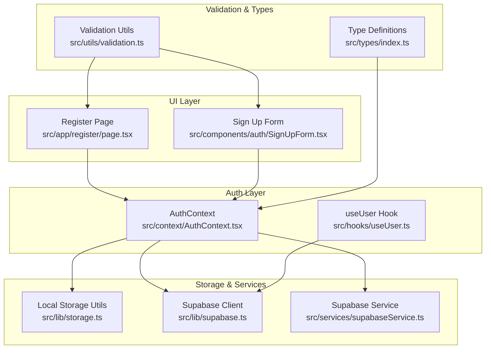
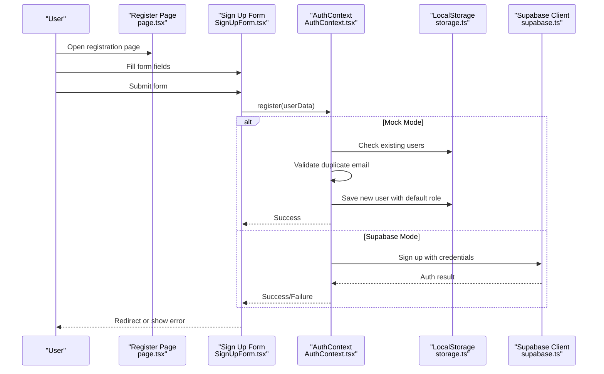
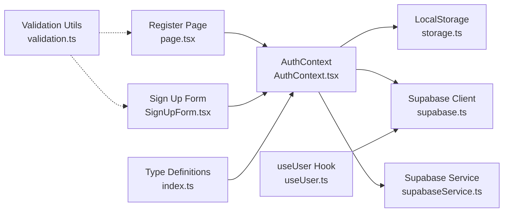

# Registration Process

<cite>
**Referenced Files in This Document**
- [page.tsx](file://src/app/register/page.tsx)
- [SignUpForm.tsx](file://src/components/auth/SignUpForm.tsx)
- [AuthContext.tsx](file://src/context/AuthContext.tsx)
- [supabase.ts](file://src/lib/supabase.ts)
- [supabaseService.ts](file://src/services/supabaseService.ts)
- [storage.ts](file://src/lib/storage.ts)
- [validation.ts](file://src/utils/validation.ts)
- [index.ts](file://src/types/index.ts)
- [useUser.ts](file://src/hooks/useUser.ts)
</cite>

## Table of Contents
1. [Introduction](#introduction)
2. [Project Structure](#project-structure)
3. [Core Components](#core-components)
4. [Architecture Overview](#architecture-overview)
5. [Detailed Component Analysis](#detailed-component-analysis)
6. [Dependency Analysis](#dependency-analysis)
7. [Performance Considerations](#performance-considerations)
8. [Troubleshooting Guide](#troubleshooting-guide)
9. [Conclusion](#conclusion)

## Introduction
This document explains the user registration process in the application, covering the registration form implementation, user data validation, duplicate email detection, default role assignment, and state management. It also documents the mock registration flow for development and outlines potential Supabase integration for production. Security considerations, data sanitization, and user verification processes are addressed alongside practical examples and integration guidance with the AuthContext.

## Project Structure
The registration feature spans several layers:
- UI pages and forms for user input
- Authentication context managing registration state and logic
- Local storage utilities for mock mode persistence
- Supabase client and service utilities for production integration
- Validation utilities for sanitization and basic checks
- Type definitions for user and role modeling

**Diagram sources**
- [page.tsx](file://src/app/register/page.tsx#L1-L149)
- [SignUpForm.tsx](file://src/components/auth/SignUpForm.tsx#L1-L274)
- [AuthContext.tsx](file://src/context/AuthContext.tsx#L1-L195)
- [storage.ts](file://src/lib/storage.ts#L1-L633)
- [supabase.ts](file://src/lib/supabase.ts#L1-L68)
- [supabaseService.ts](file://src/services/supabaseService.ts#L1-L800)
- [validation.ts](file://src/utils/validation.ts#L1-L33)
- [index.ts](file://src/types/index.ts#L1-L237)
- [useUser.ts](file://src/hooks/useUser.ts#L1-L178)

**Section sources**
- [page.tsx](file://src/app/register/page.tsx#L1-L149)
- [SignUpForm.tsx](file://src/components/auth/SignUpForm.tsx#L1-L274)
- [AuthContext.tsx](file://src/context/AuthContext.tsx#L1-L195)
- [storage.ts](file://src/lib/storage.ts#L1-L633)
- [supabase.ts](file://src/lib/supabase.ts#L1-L68)
- [supabaseService.ts](file://src/services/supabaseService.ts#L1-L800)
- [validation.ts](file://src/utils/validation.ts#L1-L33)
- [index.ts](file://src/types/index.ts#L1-L237)
- [useUser.ts](file://src/hooks/useUser.ts#L1-L178)

## Core Components
- Registration UI pages and forms collect user input and manage local state.
- AuthContext orchestrates registration logic, including mock mode and Supabase integration.
- Local storage utilities provide mock persistence for users and current user sessions.
- Supabase client and service utilities enable production-grade authentication and user management.
- Validation utilities offer sanitization and basic input checks.
- Type definitions model user roles and data structures.

**Section sources**
- [page.tsx](file://src/app/register/page.tsx#L1-L149)
- [SignUpForm.tsx](file://src/components/auth/SignUpForm.tsx#L1-L274)
- [AuthContext.tsx](file://src/context/AuthContext.tsx#L1-L195)
- [storage.ts](file://src/lib/storage.ts#L1-L633)
- [supabase.ts](file://src/lib/supabase.ts#L1-L68)
- [supabaseService.ts](file://src/services/supabaseService.ts#L1-L800)
- [validation.ts](file://src/utils/validation.ts#L1-L33)
- [index.ts](file://src/types/index.ts#L1-L237)

## Architecture Overview
The registration flow follows a layered architecture:
- UI collects user input and triggers registration actions.
- AuthContext encapsulates registration logic, switching between mock mode and Supabase mode based on environment configuration.
- In mock mode, user data is validated locally, duplicate emails are detected, and default roles are assigned.
- In Supabase mode, registration integrates with Supabase authentication and user profiles.

**Diagram sources**
- [page.tsx](file://src/app/register/page.tsx#L26-L48)
- [SignUpForm.tsx](file://src/components/auth/SignUpForm.tsx#L16-L49)
- [AuthContext.tsx](file://src/context/AuthContext.tsx#L117-L161)
- [storage.ts](file://src/lib/storage.ts#L294-L328)
- [supabase.ts](file://src/lib/supabase.ts#L1-L68)

## Detailed Component Analysis

### Registration UI Pages and Forms
- Register Page: Collects name, email, phone, password, and confirm password. Validates password match and triggers context registration.
- Sign Up Form: Supports role selection (tenant/landlord), terms agreement, and social login options. Submits to AuthContext and redirects on success.

Key behaviors:
- Password confirmation validation occurs before submission.
- Loading state prevents duplicate submissions.
- Error messages are surfaced to the user.

**Section sources**
- [page.tsx](file://src/app/register/page.tsx#L26-L48)
- [SignUpForm.tsx](file://src/components/auth/SignUpForm.tsx#L16-L49)

### AuthContext Registration Logic
AuthContext manages registration across two modes:
- Mock Mode: Uses localStorage to store users and current user. Detects duplicate emails and assigns default role. Saves user without password and sets current user.
- Supabase Mode: Placeholder for future Supabase integration. Currently returns false to indicate unimplemented flow.

Important implementation points:
- Duplicate email detection compares incoming email against stored users.
- Default role assignment sets role to tenant in mock mode.
- User creation includes timestamps and empty arrays for favorites/unlocked properties.

Security considerations:
- Passwords are stored in localStorage in mock mode. In production, rely on Supabase authentication for secure credential handling.

**Section sources**
- [AuthContext.tsx](file://src/context/AuthContext.tsx#L117-L161)
- [storage.ts](file://src/lib/storage.ts#L294-L328)

### Local Storage Utilities
- Current user retrieval and persistence via localStorage keys.
- User creation function constructs a new user with default properties and saves to storage.
- Utility functions for toggling favorites and unlocking properties.

These utilities support mock mode by providing persistent user state across sessions.

**Section sources**
- [storage.ts](file://src/lib/storage.ts#L294-L328)
- [storage.ts](file://src/lib/storage.ts#L302-L328)

### Supabase Client and Service
- Supabase client initialization with environment variables and auto-refresh configuration.
- Supabase service provides mock and real implementations for authentication and profile operations.
- The service includes mock auth hub for sign-in/sign-up flows and profile retrieval.

Integration guidance:
- Use Supabase client for production authentication.
- Extend AuthContext to call Supabase sign-up and profile creation upon successful registration.

**Section sources**
- [supabase.ts](file://src/lib/supabase.ts#L1-L68)
- [supabaseService.ts](file://src/services/supabaseService.ts#L153-L202)

### Validation Utilities
- Text sanitization replaces angle brackets to mitigate basic XSS risks.
- File validation enforces supported types and size limits for images and voice recordings.

While the registration forms currently rely on HTML5 validation and context-level checks, these utilities can be integrated for broader input sanitization.

**Section sources**
- [validation.ts](file://src/utils/validation.ts#L29-L32)

### Type Definitions
- User interface defines role, verification status, and timestamps.
- Role constants and helpers clarify tenant/admin/landlord roles.
- These types align with both mock and Supabase user models.

**Section sources**
- [index.ts](file://src/types/index.ts#L56-L70)
- [index.ts](file://src/types/index.ts#L8-L16)

### User Hook Integration
- The useUser hook loads and tracks Supabase-authenticated users, mapping profile data to the app’s user interface.
- It listens to Supabase auth state changes and refreshes user data accordingly.

This hook complements AuthContext by providing a Supabase-centric user model for production environments.

**Section sources**
- [useUser.ts](file://src/hooks/useUser.ts#L37-L176)

## Dependency Analysis
The registration process depends on:
- UI components for input collection and feedback
- AuthContext for orchestration and mode selection
- Local storage utilities for mock persistence
- Supabase client/service for production authentication
- Validation utilities for sanitization
- Type definitions for consistent data modeling

**Diagram sources**
- [page.tsx](file://src/app/register/page.tsx#L1-L149)
- [SignUpForm.tsx](file://src/components/auth/SignUpForm.tsx#L1-L274)
- [AuthContext.tsx](file://src/context/AuthContext.tsx#L1-L195)
- [storage.ts](file://src/lib/storage.ts#L1-L633)
- [supabase.ts](file://src/lib/supabase.ts#L1-L68)
- [supabaseService.ts](file://src/services/supabaseService.ts#L1-L800)
- [validation.ts](file://src/utils/validation.ts#L1-L33)
- [index.ts](file://src/types/index.ts#L1-L237)
- [useUser.ts](file://src/hooks/useUser.ts#L1-L178)

**Section sources**
- [page.tsx](file://src/app/register/page.tsx#L1-L149)
- [SignUpForm.tsx](file://src/components/auth/SignUpForm.tsx#L1-L274)
- [AuthContext.tsx](file://src/context/AuthContext.tsx#L1-L195)
- [storage.ts](file://src/lib/storage.ts#L1-L633)
- [supabase.ts](file://src/lib/supabase.ts#L1-L68)
- [supabaseService.ts](file://src/services/supabaseService.ts#L1-L800)
- [validation.ts](file://src/utils/validation.ts#L1-L33)
- [index.ts](file://src/types/index.ts#L1-L237)
- [useUser.ts](file://src/hooks/useUser.ts#L1-L178)

## Performance Considerations
- Mock mode uses in-memory and localStorage operations, which are fast but limited to a single tab/session.
- Supabase mode introduces network latency; consider optimistic UI updates and loading states.
- Avoid unnecessary re-renders by memoizing form data and using controlled components.
- Debounce or batch user-related updates to reduce frequent localStorage writes.

## Troubleshooting Guide
Common issues and resolutions:
- Duplicate email in mock mode: The context alerts the user and prevents registration. Ensure unique emails are used during development.
- Supabase environment variables missing: The client warns about missing environment variables and falls back to placeholders. Add Supabase URL and anonymous key to .env.local.
- Registration success without redirect: Verify that the UI receives a success signal and navigates appropriately. In mock mode, the context sets the current user and returns true.
- Password mismatch: The Register Page validates password confirmation before calling the context. Ensure both fields match.

**Section sources**
- [AuthContext.tsx](file://src/context/AuthContext.tsx#L124-L127)
- [supabase.ts](file://src/lib/supabase.ts#L7-L15)
- [page.tsx](file://src/app/register/page.tsx#L30-L33)

## Conclusion
The registration process combines a user-friendly UI with robust state management through AuthContext. In development, mock mode provides immediate feedback and persistent user data. For production, integrating Supabase enables secure authentication, user profiles, and scalable user management. By leveraging validation utilities, type-safe models, and the useUser hook, the system maintains consistency and extensibility across environments.