# Authentication System

<cite>
**Referenced Files in This Document**
- [AuthContext.tsx](file://src/context/AuthContext.tsx)
- [supabase.ts](file://src/lib/supabase.ts)
- [providers.tsx](file://src/app/providers.tsx)
- [AdminGuard.tsx](file://src/components/auth/AdminGuard.tsx)
- [ProtectedRoute.tsx](file://src/components/ProtectedRoute.tsx)
- [useUser.ts](file://src/hooks/useUser.ts)
- [AuthForm.tsx](file://src/components/auth/AuthForm.tsx)
- [LoginForm.tsx](file://src/components/auth/LoginForm.tsx)
- [SignUpForm.tsx](file://src/components/auth/SignUpForm.tsx)
- [ResetPasswordForm.tsx](file://src/components/auth/ResetPasswordForm.tsx)
- [page.tsx (auth)](file://src/app/auth/page.tsx)
- [page.tsx (login)](file://src/app/login/page.tsx)
- [page.tsx (register)](file://src/app/register/page.tsx)
- [storage.ts](file://src/lib/storage.ts)
- [supabaseService.ts](file://src/services/supabaseService.ts)
- [database.types.ts](file://src/types/database.types.ts)
</cite>

## Table of Contents
1. [Introduction](#introduction)
2. [Project Structure](#project-structure)
3. [Core Components](#core-components)
4. [Architecture Overview](#architecture-overview)
5. [Detailed Component Analysis](#detailed-component-analysis)
6. [Dependency Analysis](#dependency-analysis)
7. [Performance Considerations](#performance-considerations)
8. [Troubleshooting Guide](#troubleshooting-guide)
9. [Conclusion](#conclusion)

## Introduction
This document describes the authentication system for Gamasa Properties, focusing on Supabase Auth integration, user role-based access control (tenant, landlord, admin), and authentication flow implementation. It covers the AuthContext provider pattern, session management, protected route implementation, and mock authentication mode. It also documents user registration, login processes, password reset functionality, and email verification. Security considerations, token management, and logout procedures are included, along with practical examples for authentication guards, role-based UI rendering, and user state management.

## Project Structure
The authentication system spans several layers:
- Provider setup wraps the app with AuthProvider and theme support.
- Supabase client initialization configures auto-refresh, persistence, and session detection.
- Context and hooks manage user state, session events, and profile retrieval.
- UI components implement login, registration, and password reset flows.
- Guards enforce role-based access control and protect routes.
- Storage utilities provide mock/local fallbacks and cross-tab synchronization.

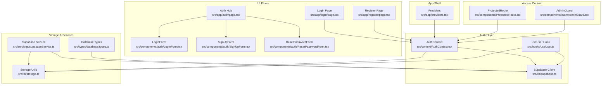

**Diagram sources**
- [providers.tsx](file://src/app/providers.tsx#L7-L16)
- [AuthContext.tsx](file://src/context/AuthContext.tsx#L22-L186)
- [useUser.ts](file://src/hooks/useUser.ts#L37-L176)
- [supabase.ts](file://src/lib/supabase.ts#L18-L28)
- [page.tsx (login)](file://src/app/login/page.tsx#L8-L29)
- [page.tsx (register)](file://src/app/register/page.tsx#L8-L48)
- [page.tsx (auth)](file://src/app/auth/page.tsx#L10-L36)
- [LoginForm.tsx](file://src/components/auth/LoginForm.tsx#L17-L46)
- [SignUpForm.tsx](file://src/components/auth/SignUpForm.tsx#L13-L49)
- [ResetPasswordForm.tsx](file://src/components/auth/ResetPasswordForm.tsx#L12-L38)
- [ProtectedRoute.tsx](file://src/components/ProtectedRoute.tsx#L8-L30)
- [AdminGuard.tsx](file://src/components/auth/AdminGuard.tsx#L11-L43)
- [storage.ts](file://src/lib/storage.ts#L28-L300)
- [supabaseService.ts](file://src/services/supabaseService.ts#L153-L202)
- [database.types.ts](file://src/types/database.types.ts#L12-L52)

**Section sources**
- [providers.tsx](file://src/app/providers.tsx#L7-L16)
- [supabase.ts](file://src/lib/supabase.ts#L18-L28)

## Core Components
- AuthContext: Centralizes authentication state, login/register/logout, and mock/SUPABASE mode switching. Provides user, loading, and isAuthenticated.
- useUser: Manages Supabase session lifecycle, profile retrieval, and auth state change subscriptions.
- Supabase Client: Configured with autoRefreshToken, persistSession, and URL session detection.
- Storage Utilities: Provide mock mode fallbacks and cross-tab synchronization via localStorage events.
- Guards: ProtectedRoute enforces login for protected areas; AdminGuard restricts admin-only routes.
- Forms: LoginForm, SignUpForm, ResetPasswordForm implement UI flows; AuthForm consolidates shared logic.

**Section sources**
- [AuthContext.tsx](file://src/context/AuthContext.tsx#L11-L195)
- [useUser.ts](file://src/hooks/useUser.ts#L37-L176)
- [supabase.ts](file://src/lib/supabase.ts#L18-L28)
- [storage.ts](file://src/lib/storage.ts#L28-L300)
- [ProtectedRoute.tsx](file://src/components/ProtectedRoute.tsx#L8-L30)
- [AdminGuard.tsx](file://src/components/auth/AdminGuard.tsx#L11-L43)
- [LoginForm.tsx](file://src/components/auth/LoginForm.tsx#L17-L46)
- [SignUpForm.tsx](file://src/components/auth/SignUpForm.tsx#L13-L49)
- [ResetPasswordForm.tsx](file://src/components/auth/ResetPasswordForm.tsx#L12-L38)

## Architecture Overview
The system supports two modes:
- Mock Mode: Uses localStorage for users and current user, with mock tokens and profile data.
- Supabase Mode: Uses Supabase Auth for secure authentication, session persistence, and profile retrieval.

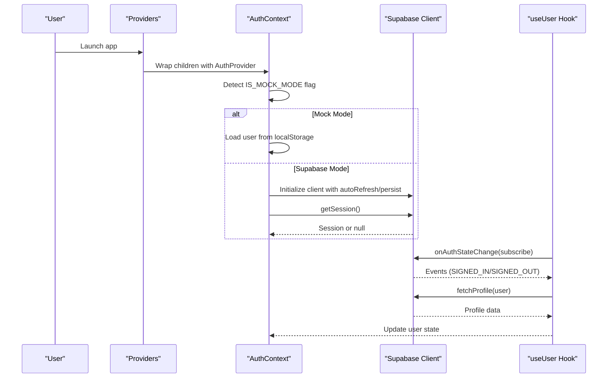

**Diagram sources**
- [providers.tsx](file://src/app/providers.tsx#L7-L16)
- [AuthContext.tsx](file://src/context/AuthContext.tsx#L22-L78)
- [supabase.ts](file://src/lib/supabase.ts#L18-L28)
- [useUser.ts](file://src/hooks/useUser.ts#L138-L168)

## Detailed Component Analysis

### AuthContext Provider Pattern
AuthContext centralizes authentication state and actions:
- State: user, loading, isAuthenticated.
- Actions: login, register, logout.
- Mode: IS_MOCK_MODE determines whether to use localStorage or Supabase.
- Cross-tab sync: Dispatches userUpdated and listens to storage events.

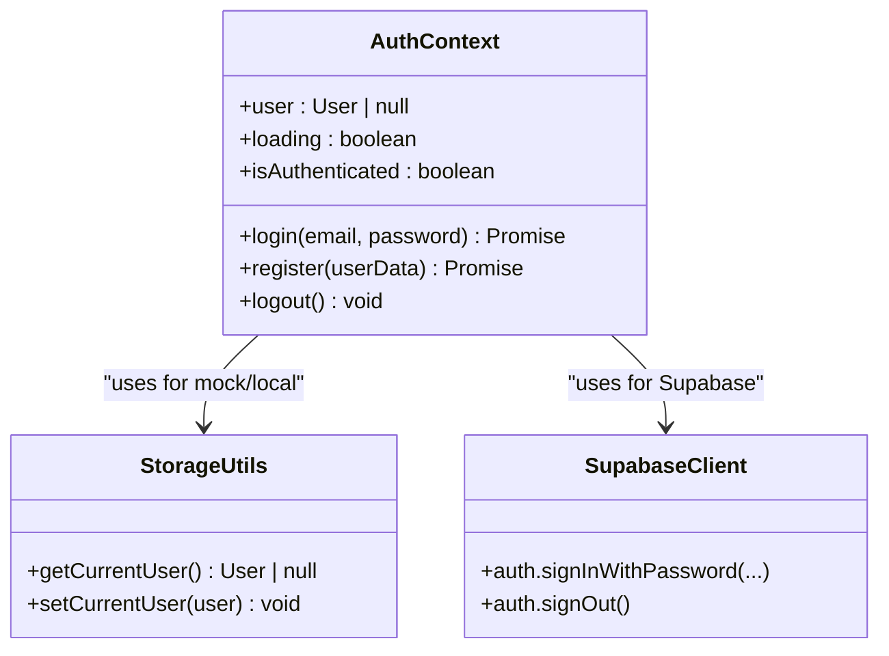

**Diagram sources**
- [AuthContext.tsx](file://src/context/AuthContext.tsx#L22-L186)
- [storage.ts](file://src/lib/storage.ts#L294-L300)
- [supabase.ts](file://src/lib/supabase.ts#L18-L28)

**Section sources**
- [AuthContext.tsx](file://src/context/AuthContext.tsx#L22-L186)
- [storage.ts](file://src/lib/storage.ts#L294-L300)

### Session Management and useUser Hook
The useUser hook manages Supabase session lifecycle:
- Retrieves current session and fetches profile data.
- Subscribes to auth state changes to keep user state in sync.
- Handles errors gracefully and falls back to minimal user data.

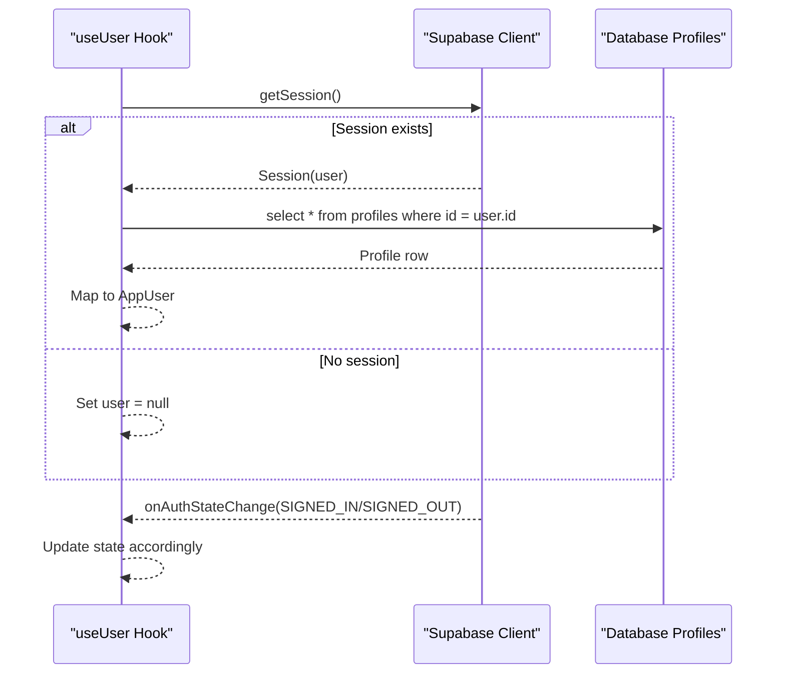

**Diagram sources**
- [useUser.ts](file://src/hooks/useUser.ts#L110-L136)
- [useUser.ts](file://src/hooks/useUser.ts#L144-L162)
- [database.types.ts](file://src/types/database.types.ts#L14-L52)

**Section sources**
- [useUser.ts](file://src/hooks/useUser.ts#L37-L176)
- [database.types.ts](file://src/types/database.types.ts#L12-L52)

### Protected Route Implementation
ProtectedRoute redirects unauthenticated users to the login page with a redirect parameter. It renders a loading state while checking authentication.

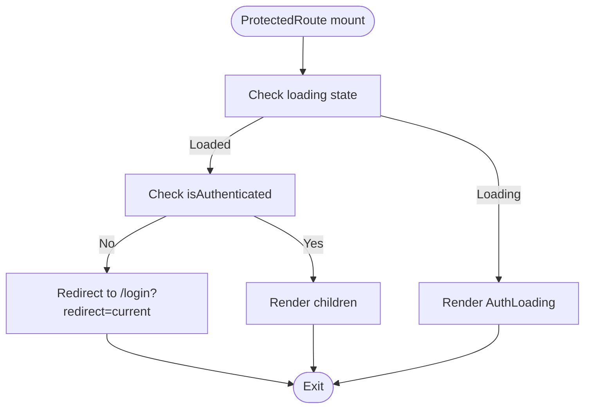

**Diagram sources**
- [ProtectedRoute.tsx](file://src/components/ProtectedRoute.tsx#L8-L30)

**Section sources**
- [ProtectedRoute.tsx](file://src/components/ProtectedRoute.tsx#L8-L30)

### Admin Access Control
AdminGuard enforces admin-only access:
- Redirects anonymous users to auth.
- Redirects non-admin users to home.
- Renders a loading UI while resolving permissions.

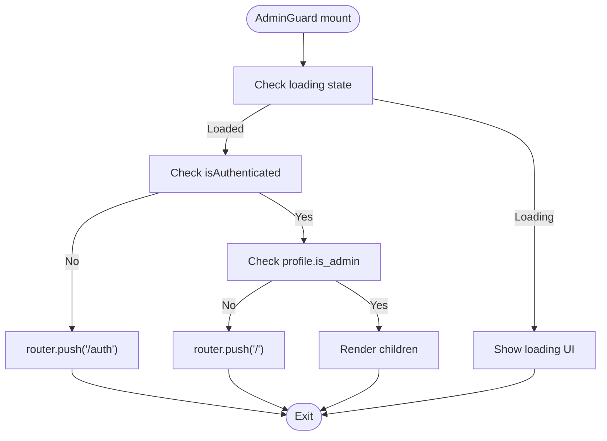

**Diagram sources**
- [AdminGuard.tsx](file://src/components/auth/AdminGuard.tsx#L11-L43)

**Section sources**
- [AdminGuard.tsx](file://src/components/auth/AdminGuard.tsx#L11-L43)

### Authentication Flows

#### Login Flow
- LoginForm captures email/password and invokes context actions.
- On success, navigates to redirect URL or home.
- Supports social login placeholders.

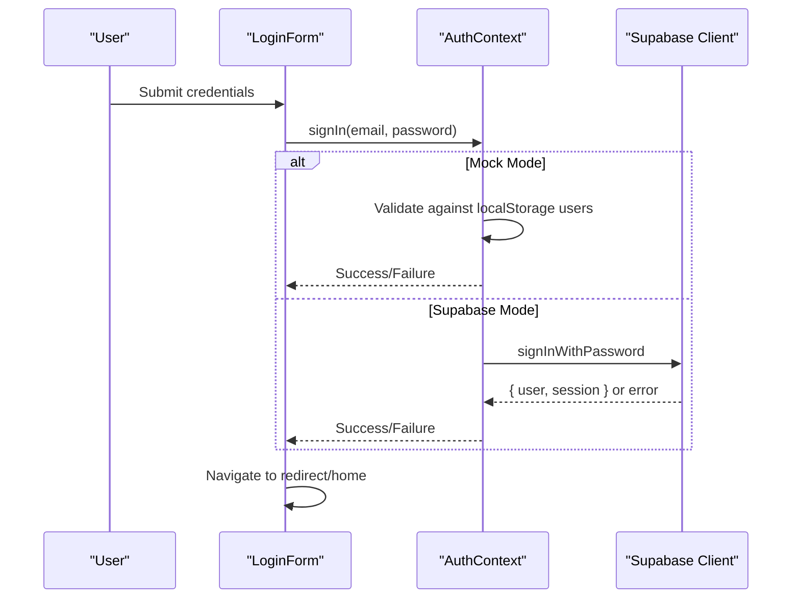

**Diagram sources**
- [LoginForm.tsx](file://src/components/auth/LoginForm.tsx#L17-L46)
- [AuthContext.tsx](file://src/context/AuthContext.tsx#L80-L115)
- [supabase.ts](file://src/lib/supabase.ts#L18-L28)

**Section sources**
- [LoginForm.tsx](file://src/components/auth/LoginForm.tsx#L17-L46)
- [AuthContext.tsx](file://src/context/AuthContext.tsx#L80-L115)

#### Registration Flow
- SignUpForm collects role, name, phone, email, password.
- Validates terms and password match.
- Registers via AuthContext (mock or Supabase).

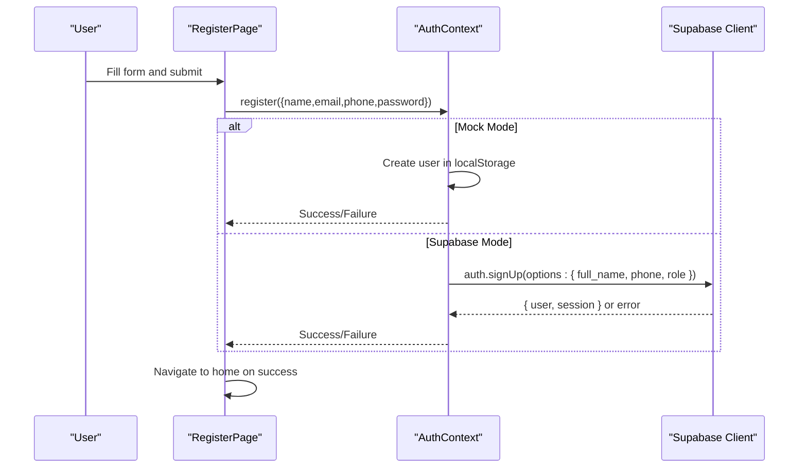

**Diagram sources**
- [page.tsx (register)](file://src/app/register/page.tsx#L26-L48)
- [AuthContext.tsx](file://src/context/AuthContext.tsx#L117-L161)
- [supabase.ts](file://src/lib/supabase.ts#L18-L28)

**Section sources**
- [page.tsx (register)](file://src/app/register/page.tsx#L26-L48)
- [AuthContext.tsx](file://src/context/AuthContext.tsx#L117-L161)

#### Password Reset Flow
- ResetPasswordForm requests a reset token via contact info.
- Displays success/error messages.

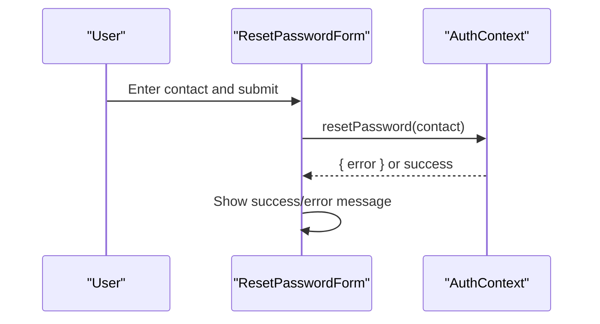

**Diagram sources**
- [ResetPasswordForm.tsx](file://src/components/auth/ResetPasswordForm.tsx#L12-L38)
- [AuthContext.tsx](file://src/context/AuthContext.tsx#L80-L115)

**Section sources**
- [ResetPasswordForm.tsx](file://src/components/auth/ResetPasswordForm.tsx#L12-L38)

### Mock Authentication Mode
- IS_MOCK_MODE flag controls behavior.
- AuthContext uses localStorage for users and current user.
- Supabase client is initialized but not actively used for auth in this mode.
- Cross-tab synchronization via storage events and custom userUpdated event.

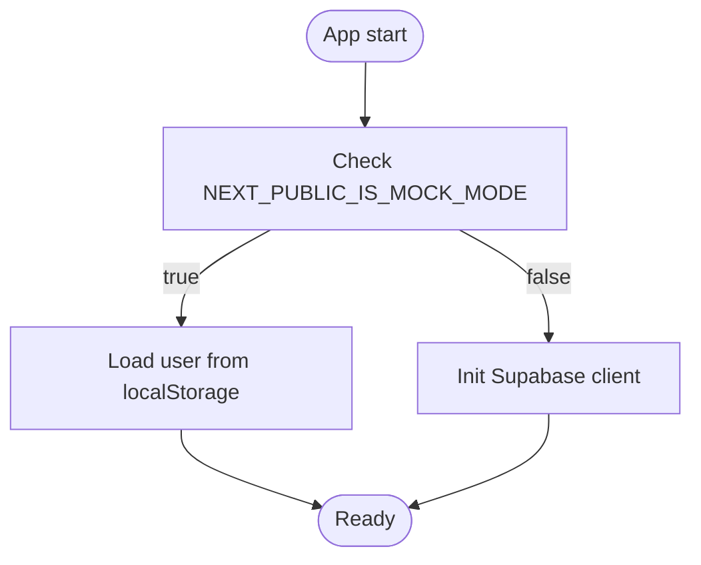

**Diagram sources**
- [AuthContext.tsx](file://src/context/AuthContext.tsx#L8-L10)
- [AuthContext.tsx](file://src/context/AuthContext.tsx#L27-L56)
- [supabase.ts](file://src/lib/supabase.ts#L18-L28)

**Section sources**
- [AuthContext.tsx](file://src/context/AuthContext.tsx#L8-L10)
- [AuthContext.tsx](file://src/context/AuthContext.tsx#L27-L56)
- [supabase.ts](file://src/lib/supabase.ts#L18-L28)

### Logout Procedure
- AuthContext clears current user and persists null.
- In Supabase mode, calls supabase.auth.signOut().
- Redirects to home.

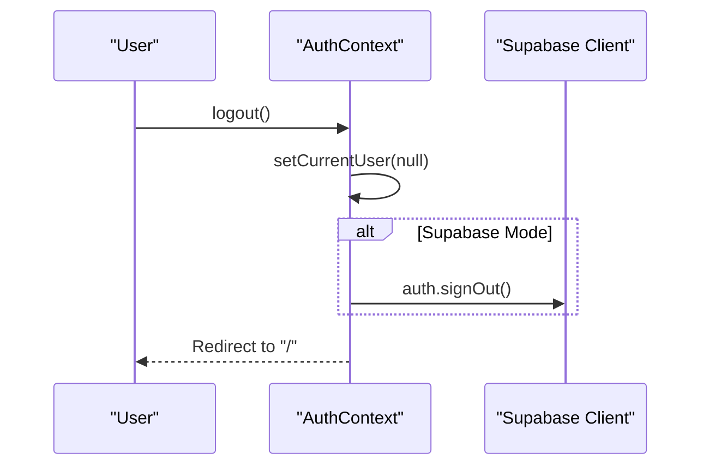

**Diagram sources**
- [AuthContext.tsx](file://src/context/AuthContext.tsx#L163-L170)

**Section sources**
- [AuthContext.tsx](file://src/context/AuthContext.tsx#L163-L170)

### Role-Based Access Control
- Roles: tenant, landlord, admin.
- Profile fields include role, is_verified, is_admin.
- AdminGuard checks profile.is_admin to grant access.

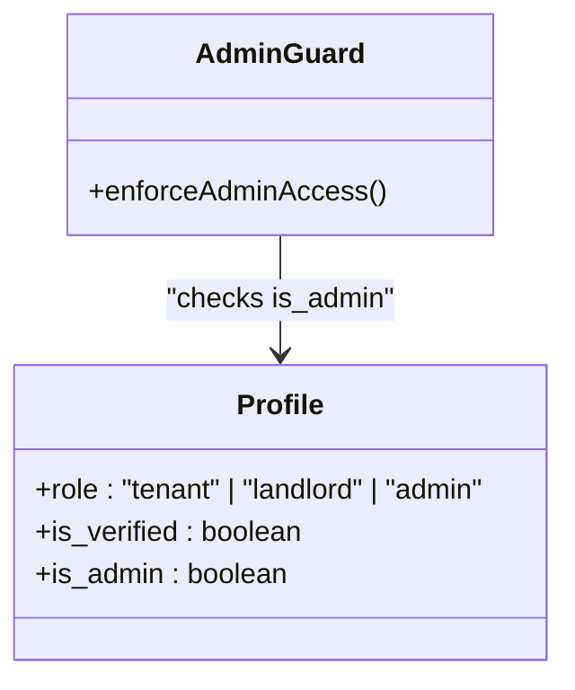

**Diagram sources**
- [database.types.ts](file://src/types/database.types.ts#L14-L52)
- [AdminGuard.tsx](file://src/components/auth/AdminGuard.tsx#L11-L23)

**Section sources**
- [database.types.ts](file://src/types/database.types.ts#L14-L52)
- [AdminGuard.tsx](file://src/components/auth/AdminGuard.tsx#L11-L23)

### Token Management and Security
- Supabase client configured with autoRefreshToken and persistSession.
- detectSessionInUrl enabled to handle OAuth callbacks.
- Environment variables validated with warnings if missing.
- Logout clears local state and signs out from Supabase.

**Section sources**
- [supabase.ts](file://src/lib/supabase.ts#L18-L28)
- [supabase.ts](file://src/lib/supabase.ts#L7-L15)
- [AuthContext.tsx](file://src/context/AuthContext.tsx#L163-L170)

### User State Management Throughout the Application
- AuthContext exposes user, loading, isAuthenticated for global consumption.
- useUser provides a normalized AppUser with profile and authUser.
- Cross-tab updates via storage events ensure synchronized state.

**Section sources**
- [AuthContext.tsx](file://src/context/AuthContext.tsx#L172-L186)
- [useUser.ts](file://src/hooks/useUser.ts#L37-L176)
- [storage.ts](file://src/lib/storage.ts#L28-L40)

## Dependency Analysis
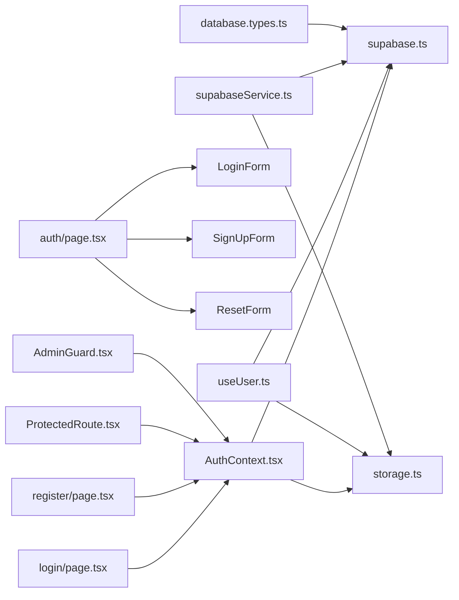

**Diagram sources**
- [AuthContext.tsx](file://src/context/AuthContext.tsx#L1-L10)
- [supabase.ts](file://src/lib/supabase.ts#L1-L28)
- [storage.ts](file://src/lib/storage.ts#L1-L633)
- [useUser.ts](file://src/hooks/useUser.ts#L1-L178)
- [page.tsx (login)](file://src/app/login/page.tsx#L1-L89)
- [page.tsx (register)](file://src/app/register/page.tsx#L1-L149)
- [page.tsx (auth)](file://src/app/auth/page.tsx#L1-L38)
- [ProtectedRoute.tsx](file://src/components/ProtectedRoute.tsx#L1-L31)
- [AdminGuard.tsx](file://src/components/auth/AdminGuard.tsx#L1-L44)
- [supabaseService.ts](file://src/services/supabaseService.ts#L1-L800)
- [database.types.ts](file://src/types/database.types.ts#L1-L310)

**Section sources**
- [AuthContext.tsx](file://src/context/AuthContext.tsx#L1-L10)
- [useUser.ts](file://src/hooks/useUser.ts#L1-L178)
- [supabase.ts](file://src/lib/supabase.ts#L1-L28)
- [storage.ts](file://src/lib/storage.ts#L1-L633)
- [supabaseService.ts](file://src/services/supabaseService.ts#L1-L800)
- [database.types.ts](file://src/types/database.types.ts#L1-L310)

## Performance Considerations
- Minimize re-renders by memoizing callbacks in hooks and avoiding unnecessary state updates.
- Debounce or batch localStorage writes to reduce event storms.
- Use lazy loading for heavy UI components in protected routes.
- Prefer client-side caching for frequently accessed profile data.

## Troubleshooting Guide
- Missing Supabase environment variables: The client logs warnings and initializes with placeholders. Ensure NEXT_PUBLIC_SUPABASE_URL and NEXT_PUBLIC_SUPABASE_ANON_KEY are set.
- Cross-tab synchronization issues: Verify localStorage events and custom userUpdated dispatches are firing.
- Auth state drift: Confirm onAuthStateChange subscription is active and profile fetches succeed.
- Mock mode pitfalls: Ensure IS_MOCK_MODE aligns with expectations; localStorage keys must match STORAGE_KEYS.

**Section sources**
- [supabase.ts](file://src/lib/supabase.ts#L7-L15)
- [storage.ts](file://src/lib/storage.ts#L28-L40)
- [useUser.ts](file://src/hooks/useUser.ts#L144-L162)

## Conclusion
Gamasa Properties employs a robust dual-mode authentication system combining a React Context provider with Supabase Auth. The design cleanly separates concerns across providers, hooks, guards, and UI components, enabling seamless transitions between mock and production environments. Role-based access control is enforced through dedicated guards, while session management and cross-tab synchronization ensure a consistent user experience. By following the documented patterns and troubleshooting tips, teams can maintain a secure, scalable authentication layer.