# Mock Authentication Mode

<cite>
**Referenced Files in This Document**
- [AuthContext.tsx](file://src/context/AuthContext.tsx)
- [storage.ts](file://src/lib/storage.ts)
- [supabase.ts](file://src/lib/supabase.ts)
- [supabaseService.ts](file://src/services/supabaseService.ts)
- [.env.local](file://.env.local)
- [providers.tsx](file://src/app/providers.tsx)
- [login/page.tsx](file://src/app/login/page.tsx)
- [register/page.tsx](file://src/app/register/page.tsx)
- [LoginForm.tsx](file://src/components/auth/LoginForm.tsx)
- [SignUpForm.tsx](file://src/components/auth/SignUpForm.tsx)
- [useUser.ts](file://src/hooks/useUser.ts)
- [types/index.ts](file://src/types/index.ts)
</cite>

## Table of Contents
1. [Introduction](#introduction)
2. [Project Structure](#project-structure)
3. [Core Components](#core-components)
4. [Architecture Overview](#architecture-overview)
5. [Detailed Component Analysis](#detailed-component-analysis)
6. [Dependency Analysis](#dependency-analysis)
7. [Performance Considerations](#performance-considerations)
8. [Troubleshooting Guide](#troubleshooting-guide)
9. [Conclusion](#conclusion)
10. [Appendices](#appendices)

## Introduction
This document explains the mock authentication mode implementation used for local development and testing. It covers the IS_MOCK_MODE flag configuration, local storage-based user management, and the development-friendly authentication flow. It also details how mock mode bypasses Supabase Auth during local runs, the mock user data structure, user registration and login validation against stored users, configuration examples, environment variable setup, and development workflow integration. Finally, it outlines limitations compared to production authentication and migration strategies to real authentication.

## Project Structure
The authentication system is split across:
- A React Context provider that centralizes authentication state and exposes login/register/logout methods
- Local storage utilities for user persistence and cross-tab synchronization
- Supabase client and service layer for production-like flows and optional mock overrides
- Environment configuration controlling whether mock mode is enabled
- UI pages and components that integrate with the context

**Diagram sources**
- [providers.tsx](file://src/app/providers.tsx#L7-L16)
- [AuthContext.tsx](file://src/context/AuthContext.tsx#L22-L186)
- [storage.ts](file://src/lib/storage.ts#L1-L633)
- [supabase.ts](file://src/lib/supabase.ts#L1-L68)
- [supabaseService.ts](file://src/services/supabaseService.ts#L1-L202)
- [.env.local](file://.env.local#L1-L4)
- [login/page.tsx](file://src/app/login/page.tsx#L8-L29)
- [register/page.tsx](file://src/app/register/page.tsx#L8-L48)
- [LoginForm.tsx](file://src/components/auth/LoginForm.tsx#L17-L46)
- [SignUpForm.tsx](file://src/components/auth/SignUpForm.tsx#L13-L49)
- [useUser.ts](file://src/hooks/useUser.ts#L37-L176)

**Section sources**
- [providers.tsx](file://src/app/providers.tsx#L7-L16)
- [AuthContext.tsx](file://src/context/AuthContext.tsx#L22-L186)
- [storage.ts](file://src/lib/storage.ts#L1-L633)
- [supabase.ts](file://src/lib/supabase.ts#L1-L68)
- [supabaseService.ts](file://src/services/supabaseService.ts#L1-L202)
- [.env.local](file://.env.local#L1-L4)

## Core Components
- IS_MOCK_MODE flag: Controls whether the app uses mock authentication or real Supabase Auth. It is read from the environment and defaults to true when unset.
- AuthContext provider: Exposes login, register, logout, and user state. In mock mode, it reads/writes users from/to localStorage and synchronizes state across tabs.
- Local storage utilities: Persist current user and users list, emit events for cross-tab updates, and manage other app data.
- Supabase client and service: Provide production authentication and data services; the service layer includes mock-mode overrides for auth and data operations.
- UI integration: Login and register pages/components call the context methods and handle errors/messages.

Key responsibilities:
- Mock mode: Validate credentials against localStorage users, persist current user, and broadcast updates across tabs.
- Production mode: Delegate authentication to Supabase client/service while maintaining a compatible interface.

**Section sources**
- [AuthContext.tsx](file://src/context/AuthContext.tsx#L8-L186)
- [storage.ts](file://src/lib/storage.ts#L5-L40)
- [supabase.ts](file://src/lib/supabase.ts#L1-L68)
- [supabaseService.ts](file://src/services/supabaseService.ts#L5-L202)
- [.env.local](file://.env.local#L3-L3)

## Architecture Overview
The authentication flow differs by mode:

- Mock mode:
  - Login validates email/password against localStorage users.
  - Registration checks for duplicate emails and creates a new user record in localStorage.
  - Current user is persisted in localStorage and synchronized across tabs.

- Production mode:
  - Login/registration use Supabase client/service.
  - The useUser hook fetches profile data and listens to auth state changes.

```mermaid
sequenceDiagram
participant U as "User"
participant LP as "Login Page<br/>login/page.tsx"
participant AC as "AuthContext<br/>AuthContext.tsx"
participant ST as "LocalStorage<br/>storage.ts"
U->>LP : "Submit credentials"
LP->>AC : "login(email, password)"
alt "IS_MOCK_MODE = true"
AC->>ST : "Get users from localStorage"
ST-->>AC : "Users array"
AC->>AC : "Find user by email/password"
alt "Match found"
AC->>ST : "Save current user to localStorage"
ST-->>AC : "Dispatch userUpdated"
AC-->>LP : "Success"
else "No match"
AC-->>LP : "Failure"
end
else "IS_MOCK_MODE = false"
AC->>AC : "Call Supabase auth.signInWithPassword"
AC-->>LP : "Return result"
end
```

**Diagram sources**
- [login/page.tsx](file://src/app/login/page.tsx#L18-L29)
- [AuthContext.tsx](file://src/context/AuthContext.tsx#L80-L115)
- [storage.ts](file://src/lib/storage.ts#L18-L40)

**Section sources**
- [AuthContext.tsx](file://src/context/AuthContext.tsx#L80-L115)
- [storage.ts](file://src/lib/storage.ts#L18-L40)
- [login/page.tsx](file://src/app/login/page.tsx#L18-L29)

## Detailed Component Analysis

### IS_MOCK_MODE Flag and Configuration
- The flag is evaluated from the environment variable NEXT_PUBLIC_IS_MOCK_MODE.
- It defaults to true when the environment variable is not present, ensuring mock mode is enabled by default for local development.
- The flag is used across the context provider and storage utilities to branch behavior.

Configuration examples:
- Enable mock mode locally: NEXT_PUBLIC_IS_MOCK_MODE=true
- Disable mock mode for testing Supabase: NEXT_PUBLIC_IS_MOCK_MODE=false

Environment variable setup:
- Add the flag to .env.local for local development.
- Ensure NEXT_PUBLIC_SUPABASE_URL and NEXT_PUBLIC_SUPABASE_ANON_KEY are present for production or hybrid scenarios.

**Section sources**
- [AuthContext.tsx](file://src/context/AuthContext.tsx#L8-L9)
- [storage.ts](file://src/lib/storage.ts#L193-L193)
- [.env.local](file://.env.local#L3-L3)

### Local Storage-Based User Management
- Users list: Stored under a dedicated key in localStorage. Registration appends new users; login validates credentials against this list.
- Current user: Stored under a separate key and synchronized across tabs via custom events.
- Cross-tab updates: Listeners react to storage events and userUpdated events to keep UI in sync.

Key behaviors:
- On initial load, the provider attempts to restore the current user from localStorage.
- On login/register/logout, the current user is saved or cleared, and events are dispatched.
- On storage changes in other tabs, the provider reloads the current user.

**Diagram sources**
- [AuthContext.tsx](file://src/context/AuthContext.tsx#L27-L78)
- [storage.ts](file://src/lib/storage.ts#L28-L40)

**Section sources**
- [AuthContext.tsx](file://src/context/AuthContext.tsx#L27-L78)
- [storage.ts](file://src/lib/storage.ts#L28-L40)

### Mock User Data Structure
The User type defines the shape of stored users. Mock mode uses localStorage to persist this structure.

User fields include:
- Identity: id, name, phone, email, avatar
- Roles and verification: role, isVerified
- Engagement: favorites (property ids), unlockedProperties (property ids)
- Timestamps: createdAt, lastLogin, memberSince

Registration in mock mode constructs a new user with default values and persists it to localStorage.

**Section sources**
- [types/index.ts](file://src/types/index.ts#L56-L70)
- [AuthContext.tsx](file://src/context/AuthContext.tsx#L117-L161)
- [storage.ts](file://src/lib/storage.ts#L302-L328)

### Login Validation Against Stored Users
- In mock mode, login reads the users array from localStorage and finds a user whose email and password match the submitted credentials.
- On success, the user object (without password) is saved as the current user and the UI reflects the authenticated state.
- On failure, the provider returns false, allowing UI to display an error message.

**Diagram sources**
- [AuthContext.tsx](file://src/context/AuthContext.tsx#L80-L115)
- [storage.ts](file://src/lib/storage.ts#L294-L300)

**Section sources**
- [AuthContext.tsx](file://src/context/AuthContext.tsx#L80-L115)
- [storage.ts](file://src/lib/storage.ts#L294-L300)

### Registration in Mock Mode
- Validates that the email is not already taken.
- Constructs a new user object with generated id, timestamps, default role, and empty engagement arrays.
- Persists the new user to the users list and sets it as the current user.

**Diagram sources**
- [AuthContext.tsx](file://src/context/AuthContext.tsx#L117-L161)
- [storage.ts](file://src/lib/storage.ts#L302-L328)

**Section sources**
- [AuthContext.tsx](file://src/context/AuthContext.tsx#L117-L161)
- [storage.ts](file://src/lib/storage.ts#L302-L328)

### Logout Behavior
- Clears the current user from localStorage and resets the provider state.
- In mock mode, logout does not call Supabase sign out.
- Redirects the user to the home page after logout.

**Section sources**
- [AuthContext.tsx](file://src/context/AuthContext.tsx#L163-L170)

### Supabase Client and Service Integration
- Supabase client is initialized with environment variables and configured for auto-refresh and session persistence.
- The service layer includes a mock-mode flag and provides mock overrides for authentication and data operations.
- The useUser hook integrates with Supabase to fetch profile data and listen to auth state changes.

**Section sources**
- [supabase.ts](file://src/lib/supabase.ts#L1-L68)
- [supabaseService.ts](file://src/services/supabaseService.ts#L5-L202)
- [useUser.ts](file://src/hooks/useUser.ts#L37-L176)

### UI Integration and Forms
- Login and register pages/components call the context methods and handle form submission, validation, and navigation.
- LoginForm and SignUpForm components demonstrate how the UI interacts with the AuthContext.

**Section sources**
- [login/page.tsx](file://src/app/login/page.tsx#L8-L29)
- [register/page.tsx](file://src/app/register/page.tsx#L8-L48)
- [LoginForm.tsx](file://src/components/auth/LoginForm.tsx#L17-L46)
- [SignUpForm.tsx](file://src/components/auth/SignUpForm.tsx#L13-L49)

## Dependency Analysis
The authentication system exhibits clear separation of concerns:
- UI pages/components depend on AuthContext for authentication actions.
- AuthContext depends on localStorage utilities for persistence and cross-tab synchronization.
- Supabase client and service provide production-grade authentication and data operations.
- Environment variables control the mode and Supabase configuration.

**Diagram sources**
- [login/page.tsx](file://src/app/login/page.tsx#L8-L29)
- [register/page.tsx](file://src/app/register/page.tsx#L8-L48)
- [LoginForm.tsx](file://src/components/auth/LoginForm.tsx#L17-L46)
- [SignUpForm.tsx](file://src/components/auth/SignUpForm.tsx#L13-L49)
- [AuthContext.tsx](file://src/context/AuthContext.tsx#L22-L186)
- [storage.ts](file://src/lib/storage.ts#L1-L633)
- [supabase.ts](file://src/lib/supabase.ts#L1-L68)
- [supabaseService.ts](file://src/services/supabaseService.ts#L1-L202)
- [.env.local](file://.env.local#L1-L4)
- [useUser.ts](file://src/hooks/useUser.ts#L37-L176)

**Section sources**
- [AuthContext.tsx](file://src/context/AuthContext.tsx#L22-L186)
- [storage.ts](file://src/lib/storage.ts#L1-L633)
- [supabase.ts](file://src/lib/supabase.ts#L1-L68)
- [supabaseService.ts](file://src/services/supabaseService.ts#L1-L202)
- [.env.local](file://.env.local#L1-L4)
- [useUser.ts](file://src/hooks/useUser.ts#L37-L176)

## Performance Considerations
- Mock mode avoids network requests, reducing latency and enabling offline-like development.
- Local storage operations are synchronous; for large datasets, consider pagination or indexedDB for scalability.
- Cross-tab synchronization relies on DOM events; ensure minimal writes to avoid excessive re-renders.

## Troubleshooting Guide
Common issues and resolutions:
- Incorrect credentials: Verify email/password match entries in the users list stored in localStorage.
- Duplicate email on registration: Ensure the email is unique; the system prevents duplicate registrations.
- Stuck in loading state: Check for localStorage corruption and clear the current user key if necessary.
- Cross-tab desync: Confirm that storage events are firing and listeners are attached in the provider.

**Section sources**
- [AuthContext.tsx](file://src/context/AuthContext.tsx#L44-L53)
- [AuthContext.tsx](file://src/context/AuthContext.tsx#L124-L127)

## Conclusion
The mock authentication mode provides a fast, local-first development experience by validating credentials against localStorage and persisting user sessions without external dependencies. It integrates seamlessly with the existing UI and context while preserving a clear migration path to real authentication via Supabase. By configuring the IS_MOCK_MODE flag and environment variables appropriately, developers can iterate quickly on authentication flows and user experiences.

## Appendices

### Configuration Examples
- Local development with mock mode:
  - NEXT_PUBLIC_IS_MOCK_MODE=true
  - NEXT_PUBLIC_SUPABASE_URL and NEXT_PUBLIC_SUPABASE_ANON_KEY optional for mock-only runs
- Testing Supabase integration:
  - NEXT_PUBLIC_IS_MOCK_MODE=false
  - Ensure NEXT_PUBLIC_SUPABASE_URL and NEXT_PUBLIC_SUPABASE_ANON_KEY are set

**Section sources**
- [.env.local](file://.env.local#L1-L4)
- [AuthContext.tsx](file://src/context/AuthContext.tsx#L8-L9)

### Migration Strategies to Real Authentication
- Keep the same context interface: Continue using login/register/logout methods exposed by AuthContext.
- Toggle IS_MOCK_MODE to false to route calls to Supabase client/service.
- Align mock data shapes with Supabase tables (profiles, properties, etc.) to minimize refactoring.
- Gradually replace mock service methods with real Supabase queries while maintaining backward compatibility.

**Section sources**
- [supabaseService.ts](file://src/services/supabaseService.ts#L154-L202)
- [supabase.ts](file://src/lib/supabase.ts#L1-L68)
- [useUser.ts](file://src/hooks/useUser.ts#L37-L176)