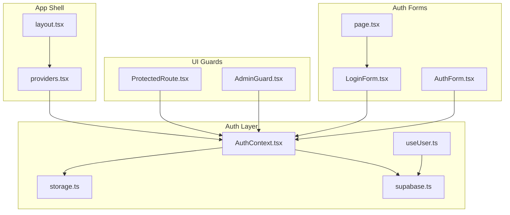
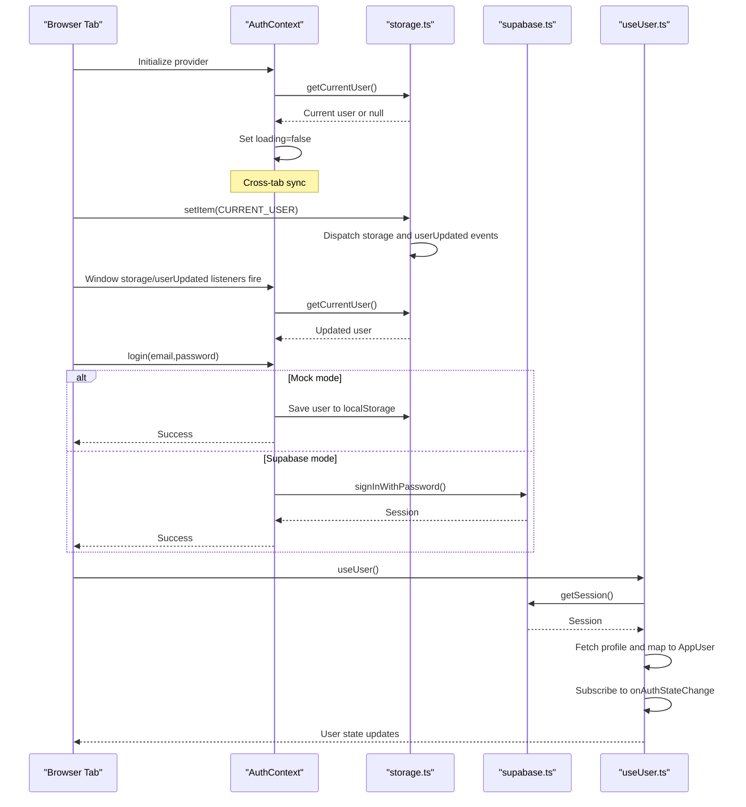
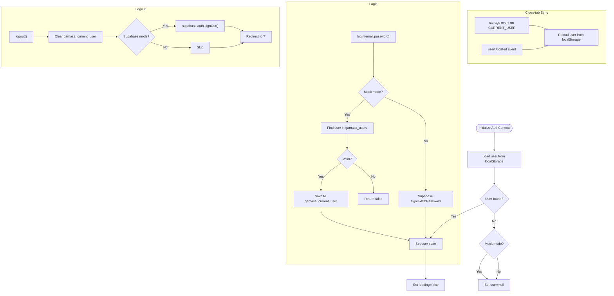
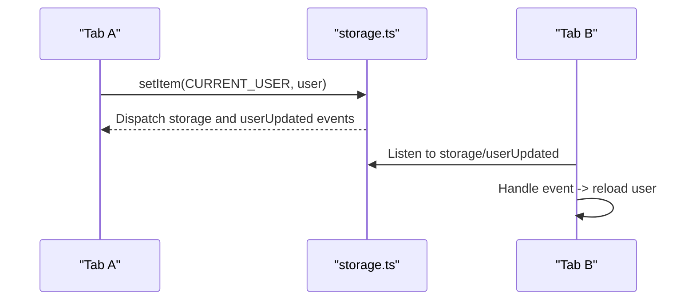
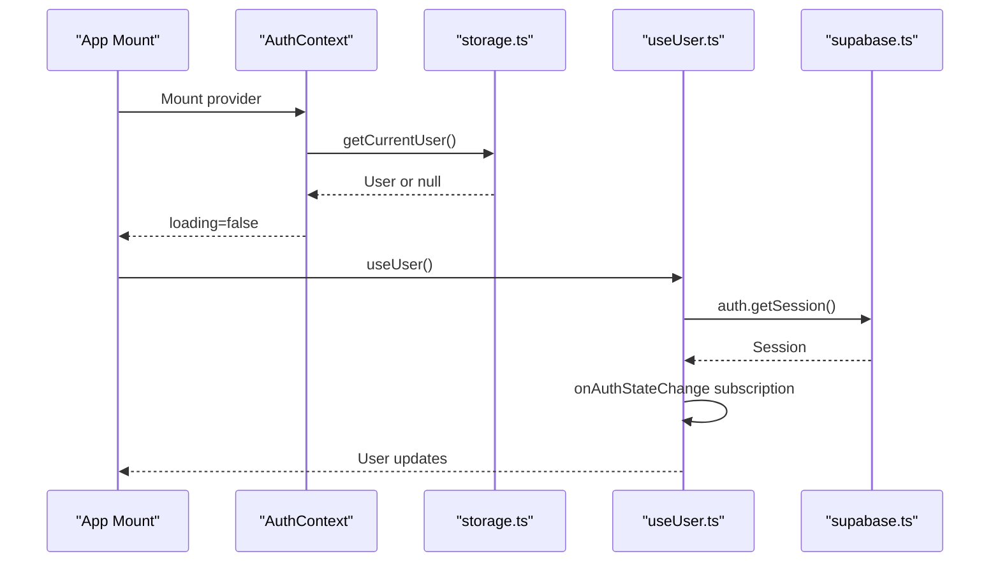
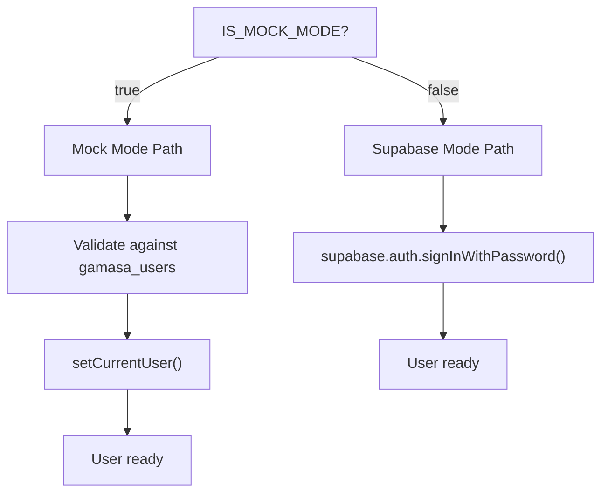
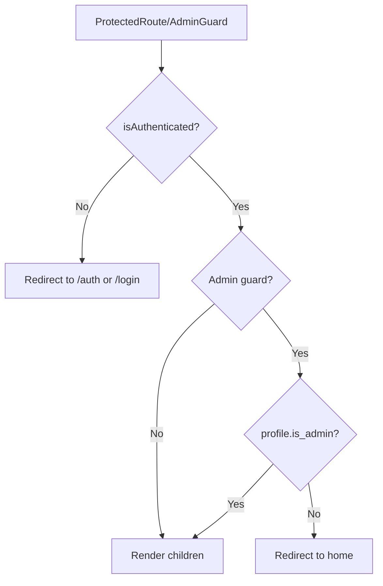
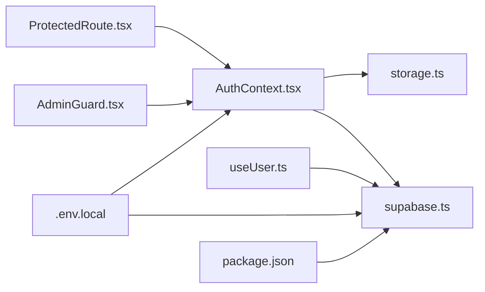

# Session Management

<cite>
**Referenced Files in This Document**
- [AuthContext.tsx](file://src/context/AuthContext.tsx)
- [providers.tsx](file://src/app/providers.tsx)
- [layout.tsx](file://src/app/layout.tsx)
- [storage.ts](file://src/lib/storage.ts)
- [supabase.ts](file://src/lib/supabase.ts)
- [useUser.ts](file://src/hooks/useUser.ts)
- [ProtectedRoute.tsx](file://src/components/ProtectedRoute.tsx)
- [AdminGuard.tsx](file://src/components/auth/AdminGuard.tsx)
- [LoginForm.tsx](file://src/components/auth/LoginForm.tsx)
- [AuthForm.tsx](file://src/components/auth/AuthForm.tsx)
- [page.tsx](file://src/app/auth/page.tsx)
- [.env.local](file://.env.local)
- [package.json](file://package.json)
- [index.ts](file://src/types/index.ts)
</cite>

## Table of Contents
1. [Introduction](#introduction)
2. [Project Structure](#project-structure)
3. [Core Components](#core-components)
4. [Architecture Overview](#architecture-overview)
5. [Detailed Component Analysis](#detailed-component-analysis)
6. [Dependency Analysis](#dependency-analysis)
7. [Performance Considerations](#performance-considerations)
8. [Troubleshooting Guide](#troubleshooting-guide)
9. [Conclusion](#conclusion)
10. [Appendices](#appendices)

## Introduction
This document explains the session management implementation for Gamasa Properties. It covers the AuthContext provider, user state persistence, session lifecycle, dual-mode operation (mock vs Supabase), cross-tab synchronization, automatic session restoration, and security considerations. It also provides practical guidance for implementing protected routes, authentication guards, and session validation patterns.

## Project Structure
The session management spans several layers:
- Provider setup wraps the app with AuthContext and other providers.
- AuthContext manages user state and session lifecycle.
- Local storage utilities provide mock-mode persistence and cross-tab events.
- Supabase client handles production authentication and session persistence.
- Hooks integrate Supabase auth state into the app’s user model.
- Guards enforce authentication and authorization at the routing level.

**Diagram sources**
- [layout.tsx](file://src/app/layout.tsx#L64-L89)
- [providers.tsx](file://src/app/providers.tsx#L7-L17)
- [AuthContext.tsx](file://src/context/AuthContext.tsx#L22-L186)
- [storage.ts](file://src/lib/storage.ts#L1-L633)
- [supabase.ts](file://src/lib/supabase.ts#L1-L68)
- [useUser.ts](file://src/hooks/useUser.ts#L37-L176)
- [ProtectedRoute.tsx](file://src/components/ProtectedRoute.tsx#L8-L30)
- [AdminGuard.tsx](file://src/components/auth/AdminGuard.tsx#L11-L43)
- [LoginForm.tsx](file://src/components/auth/LoginForm.tsx#L7-L46)
- [AuthForm.tsx](file://src/components/auth/AuthForm.tsx#L8-L53)
- [page.tsx](file://src/app/auth/page.tsx#L10-L37)

**Section sources**
- [layout.tsx](file://src/app/layout.tsx#L64-L89)
- [providers.tsx](file://src/app/providers.tsx#L7-L17)

## Core Components
- AuthContext: Provides user state, login/register/logout, and authentication status. Supports mock mode and integrates with Supabase when enabled.
- storage.ts: Centralized localStorage utilities with cross-tab event broadcasting for user state synchronization.
- supabase.ts: Supabase client configured with auto-refresh, session persistence, and URL session detection.
- useUser.ts: Hook that loads and tracks Supabase auth state, maps profiles, and exposes refresh capabilities.
- Guards: ProtectedRoute and AdminGuard enforce authentication and admin roles.

**Section sources**
- [AuthContext.tsx](file://src/context/AuthContext.tsx#L11-L195)
- [storage.ts](file://src/lib/storage.ts#L1-L633)
- [supabase.ts](file://src/lib/supabase.ts#L1-L68)
- [useUser.ts](file://src/hooks/useUser.ts#L37-L176)
- [ProtectedRoute.tsx](file://src/components/ProtectedRoute.tsx#L8-L30)
- [AdminGuard.tsx](file://src/components/auth/AdminGuard.tsx#L11-L43)

## Architecture Overview
The system supports two modes:
- Mock mode: User data stored in localStorage under a dedicated key; cross-tab sync via storage and custom events.
- Supabase mode: Uses Supabase client for authentication, session persistence, and real-time auth state changes.

**Diagram sources**
- [AuthContext.tsx](file://src/context/AuthContext.tsx#L22-L186)
- [storage.ts](file://src/lib/storage.ts#L18-L40)
- [supabase.ts](file://src/lib/supabase.ts#L18-L28)
- [useUser.ts](file://src/hooks/useUser.ts#L110-L168)

## Detailed Component Analysis

### AuthContext Provider
AuthContext orchestrates session lifecycle and dual-mode support:
- Initialization: Loads persisted user from localStorage; sets loading state; registers cross-tab listeners.
- Dual-mode login:
  - Mock mode: Validates credentials against localStorage users; persists user locally.
  - Supabase mode: Delegates to Supabase client; returns success indicator.
- Registration: Mock mode creates and persists a new user; Supabase registration is stubbed.
- Logout: Clears current user and signs out from Supabase when applicable; redirects to home.

**Diagram sources**
- [AuthContext.tsx](file://src/context/AuthContext.tsx#L22-L186)
- [storage.ts](file://src/lib/storage.ts#L294-L300)

**Section sources**
- [AuthContext.tsx](file://src/context/AuthContext.tsx#L22-L186)
- [storage.ts](file://src/lib/storage.ts#L294-L300)

### User State Persistence and Cross-tab Synchronization
- Keys: CURRENT_USER stores the active user; USERS stores all mock users.
- Events:
  - storage: Fired when another tab writes to localStorage; used to reload user state.
  - userUpdated: Custom event fired when CURRENT_USER changes in the same tab.
- Error handling: On load errors, corrupted data is cleared and user reset to null.

**Diagram sources**
- [storage.ts](file://src/lib/storage.ts#L18-L40)
- [AuthContext.tsx](file://src/context/AuthContext.tsx#L58-L77)

**Section sources**
- [storage.ts](file://src/lib/storage.ts#L18-L40)
- [AuthContext.tsx](file://src/context/AuthContext.tsx#L58-L77)

### Automatic Session Restoration
- AuthContext restores user on mount by reading CURRENT_USER.
- Supabase hook restores session via getSession and subscribes to onAuthStateChange for live updates.

**Diagram sources**
- [AuthContext.tsx](file://src/context/AuthContext.tsx#L22-L78)
- [useUser.ts](file://src/hooks/useUser.ts#L110-L168)
- [supabase.ts](file://src/lib/supabase.ts#L18-L28)

**Section sources**
- [AuthContext.tsx](file://src/context/AuthContext.tsx#L22-L78)
- [useUser.ts](file://src/hooks/useUser.ts#L110-L168)

### Dual-mode Session Handling
- Mode selection: Controlled by NEXT_PUBLIC_IS_MOCK_MODE.
- Mock mode:
  - Users stored in localStorage under gamasa_users.
  - Active user stored under gamasa_current_user.
  - Login validates credentials against stored users.
- Supabase mode:
  - Uses Supabase client for authentication and session persistence.
  - Auto-refresh tokens and persist sessions enabled.
  - Auth state changes propagated via onAuthStateChange.

**Diagram sources**
- [AuthContext.tsx](file://src/context/AuthContext.tsx#L8-L10)
- [AuthContext.tsx](file://src/context/AuthContext.tsx#L80-L115)
- [storage.ts](file://src/lib/storage.ts#L294-L300)
- [supabase.ts](file://src/lib/supabase.ts#L18-L28)

**Section sources**
- [AuthContext.tsx](file://src/context/AuthContext.tsx#L8-L10)
- [AuthContext.tsx](file://src/context/AuthContext.tsx#L80-L115)
- [storage.ts](file://src/lib/storage.ts#L294-L300)
- [supabase.ts](file://src/lib/supabase.ts#L18-L28)

### Authentication Guards and Protected Routes
- ProtectedRoute: Redirects unauthenticated users to login with a redirect query; renders children when authenticated.
- AdminGuard: Enforces admin-only access; redirects non-admins or unauthenticated users.

**Diagram sources**
- [ProtectedRoute.tsx](file://src/components/ProtectedRoute.tsx#L8-L30)
- [AdminGuard.tsx](file://src/components/auth/AdminGuard.tsx#L11-L43)

**Section sources**
- [ProtectedRoute.tsx](file://src/components/ProtectedRoute.tsx#L8-L30)
- [AdminGuard.tsx](file://src/components/auth/AdminGuard.tsx#L11-L43)

### Session Validation Patterns
- Use useAuth for client-side checks in components.
- Use ProtectedRoute for page-level protection.
- Use AdminGuard for admin-only pages.
- For Supabase-dependent flows, rely on useUser for session-awareness.

**Section sources**
- [ProtectedRoute.tsx](file://src/components/ProtectedRoute.tsx#L8-L30)
- [AdminGuard.tsx](file://src/components/auth/AdminGuard.tsx#L11-L43)
- [useUser.ts](file://src/hooks/useUser.ts#L37-L176)

## Dependency Analysis
- AuthContext depends on:
  - storage.ts for user persistence and cross-tab events.
  - supabase.ts for Supabase mode operations.
- useUser depends on supabase.ts for session retrieval and auth state subscriptions.
- Guards depend on AuthContext for authentication state.
- Environment variables control mode and Supabase configuration.

**Diagram sources**
- [AuthContext.tsx](file://src/context/AuthContext.tsx#L1-L10)
- [storage.ts](file://src/lib/storage.ts#L1-L633)
- [supabase.ts](file://src/lib/supabase.ts#L1-L68)
- [useUser.ts](file://src/hooks/useUser.ts#L1-L178)
- [ProtectedRoute.tsx](file://src/components/ProtectedRoute.tsx#L1-L31)
- [AdminGuard.tsx](file://src/components/auth/AdminGuard.tsx#L1-L44)
- [.env.local](file://.env.local#L1-L4)
- [package.json](file://package.json#L11-L27)

**Section sources**
- [AuthContext.tsx](file://src/context/AuthContext.tsx#L1-L10)
- [supabase.ts](file://src/lib/supabase.ts#L1-L68)
- [useUser.ts](file://src/hooks/useUser.ts#L1-L178)
- [ProtectedRoute.tsx](file://src/components/ProtectedRoute.tsx#L1-L31)
- [AdminGuard.tsx](file://src/components/auth/AdminGuard.tsx#L1-L44)
- [.env.local](file://.env.local#L1-L4)
- [package.json](file://package.json#L11-L27)

## Performance Considerations
- Minimize localStorage writes: Batch updates and avoid frequent writes in tight loops.
- Debounce cross-tab listeners: The existing event-driven model is efficient; avoid redundant reads.
- Supabase session caching: Rely on autoRefreshToken and persistSession to reduce network calls.
- Lazy initialization: AuthContext defers heavy operations until mounted.

## Troubleshooting Guide
- Missing environment variables:
  - Symptom: Warnings about missing Supabase URL or anon key.
  - Resolution: Add NEXT_PUBLIC_SUPABASE_URL and NEXT_PUBLIC_SUPABASE_ANON_KEY to .env.local.
- Mock mode not working:
  - Symptom: Login/register does nothing.
  - Resolution: Ensure NEXT_PUBLIC_IS_MOCK_MODE=true in .env.local.
- Cross-tab not syncing:
  - Symptom: Changes in one tab not reflected in others.
  - Resolution: Confirm storage and userUpdated events are dispatched and listeners registered.
- Supabase auth not restoring:
  - Symptom: User appears logged out after refresh.
  - Resolution: Verify autoRefreshToken and persistSession are enabled; check onAuthStateChange subscription.

**Section sources**
- [supabase.ts](file://src/lib/supabase.ts#L3-L15)
- [.env.local](file://.env.local#L1-L4)
- [AuthContext.tsx](file://src/context/AuthContext.tsx#L58-L77)
- [useUser.ts](file://src/hooks/useUser.ts#L144-L168)

## Conclusion
Gamasa Properties implements a robust, dual-mode session management system. AuthContext centralizes user state and cross-tab synchronization, while storage.ts ensures mock-mode persistence. Supabase integration provides secure, persistent sessions with automatic restoration and real-time auth state updates. Guards enforce authentication and authorization seamlessly. The design balances simplicity (mock mode) with scalability (Supabase), enabling smooth transitions and consistent user experiences across browser tabs.

## Appendices

### Environment Variables
- NEXT_PUBLIC_SUPABASE_URL: Supabase project URL.
- NEXT_PUBLIC_SUPABASE_ANON_KEY: Supabase anonymous API key.
- NEXT_PUBLIC_IS_MOCK_MODE: Enables mock-mode behavior.

**Section sources**
- [.env.local](file://.env.local#L1-L4)

### Types Used in Session Management
- User: Application user shape with roles and metadata.
- AppUser: Extended user type combining Supabase and app-specific fields.

**Section sources**
- [index.ts](file://src/types/index.ts#L56-L70)
- [useUser.ts](file://src/hooks/useUser.ts#L18-L35)