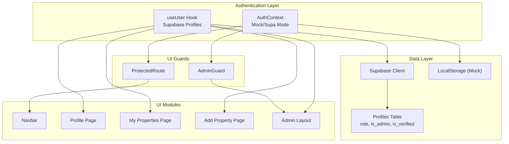
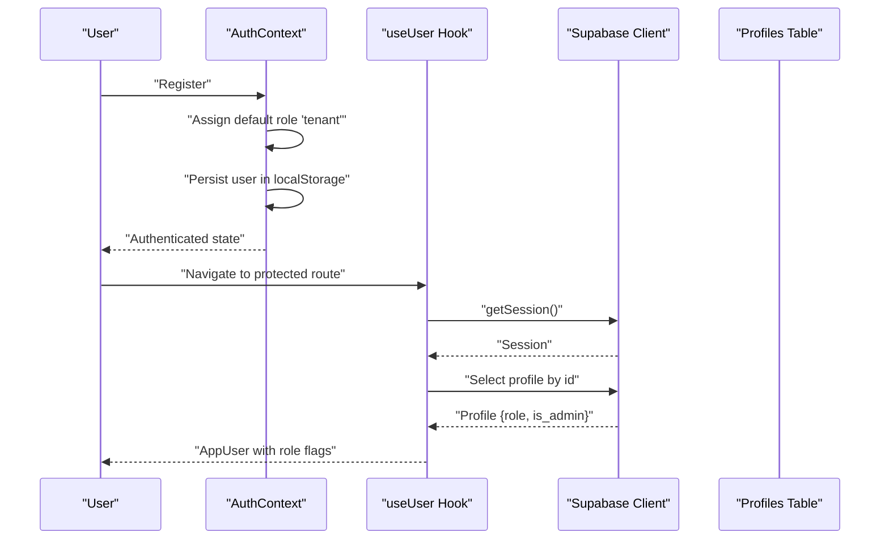
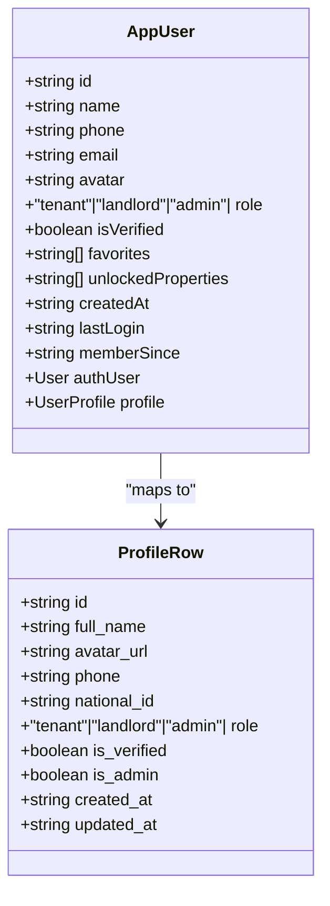
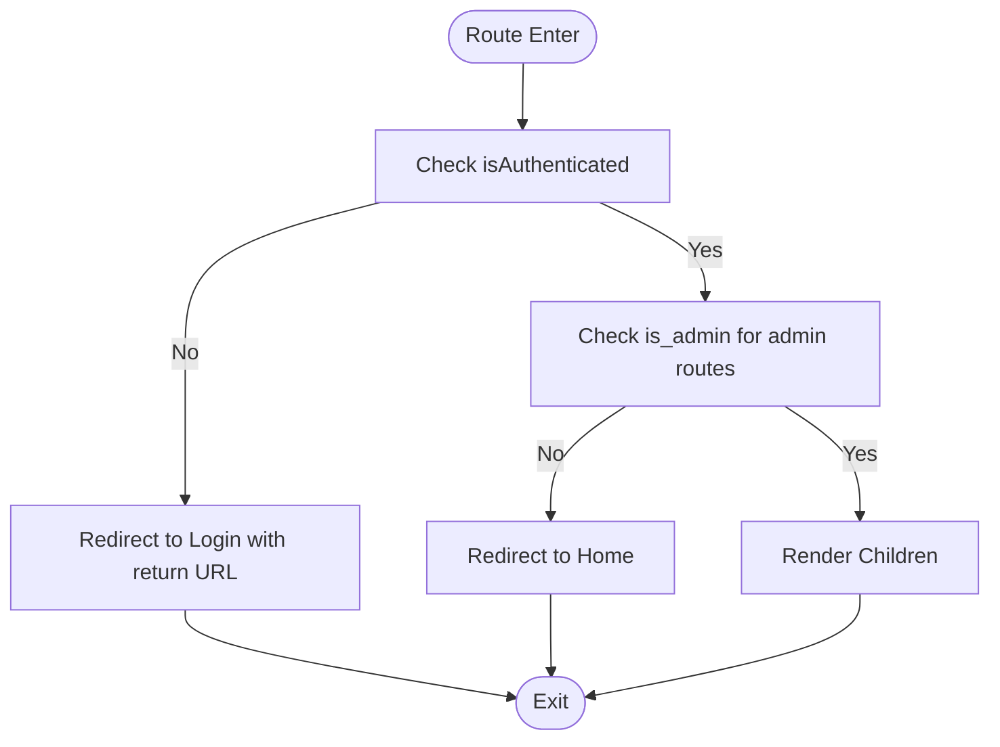
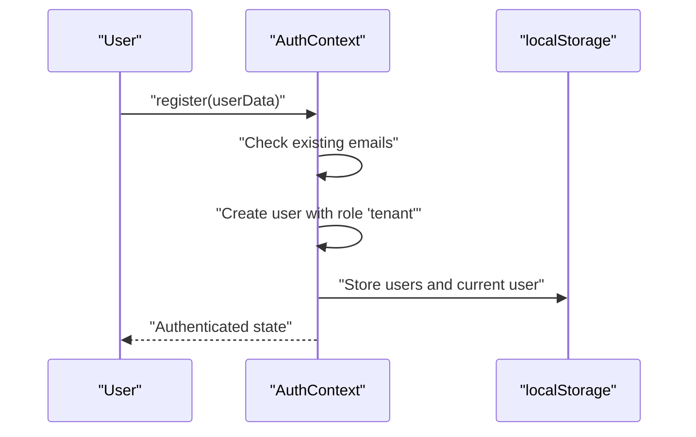
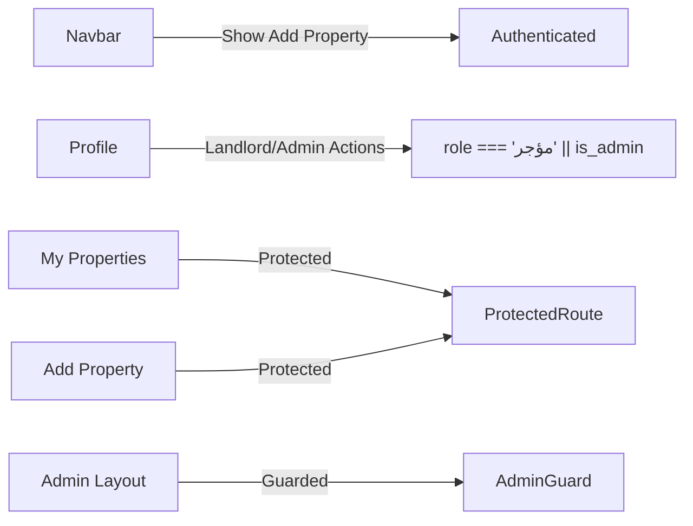
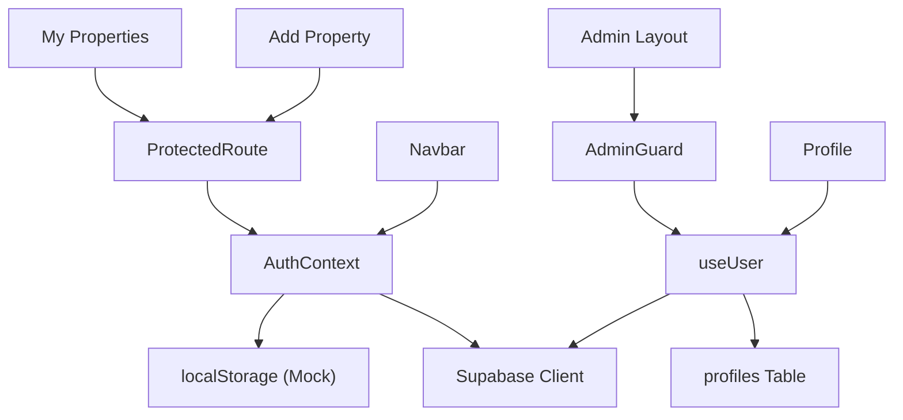

# User Roles and Permissions

<cite>
**Referenced Files in This Document**
- [AuthContext.tsx](file://src/context/AuthContext.tsx)
- [useUser.ts](file://src/hooks/useUser.ts)
- [supabase.ts](file://src/lib/supabase.ts)
- [storage.ts](file://src/lib/storage.ts)
- [AdminGuard.tsx](file://src/components/auth/AdminGuard.tsx)
- [ProtectedRoute.tsx](file://src/components/ProtectedRoute.tsx)
- [Navbar.tsx](file://src/components/Navbar.tsx)
- [MyPropertiesPage.tsx](file://src/app/my-properties/page.tsx)
- [AddPropertyPage.tsx](file://src/app/add-property/page.tsx)
- [ProfilePage.tsx](file://src/app/profile/page.tsx)
- [AdminLayout.tsx](file://src/app/admin/layout.tsx)
- [AdminDashboard.tsx](file://src/app/admin/page.tsx)
- [database.types.ts](file://src/types/database.types.ts)
</cite>

## Table of Contents
1. [Introduction](#introduction)
2. [Project Structure](#project-structure)
3. [Core Components](#core-components)
4. [Architecture Overview](#architecture-overview)
5. [Detailed Component Analysis](#detailed-component-analysis)
6. [Dependency Analysis](#dependency-analysis)
7. [Performance Considerations](#performance-considerations)
8. [Troubleshooting Guide](#troubleshooting-guide)
9. [Conclusion](#conclusion)

## Introduction
This document explains the user roles and permissions model in Gamasa Properties. It covers the three roles:
- Tenant (مستأجر)
- Landlord (مالك العقار)
- Admin (مدير النظام)

It documents role-based access control (RBAC), default role assignment, role-based UI rendering, protected routes, and administrative capabilities. It also outlines how roles affect navigation, conditional rendering, and feature access, and highlights the current implementation boundaries around role transitions and upgrades.

## Project Structure
Gamasa Properties implements a dual-mode authentication and user model:
- Mock mode: Uses localStorage for users and simple role defaults.
- Supabase mode: Integrates with Supabase Auth and a profiles table containing roles and flags.

Key areas:
- Authentication and user state: AuthContext and useUser hook
- Role enforcement: AdminGuard and ProtectedRoute
- Role-aware UI: Navbar, Profile, My Properties, Add Property
- Supabase integration: Supabase client and storage utilities
- Database types: Strongly typed profiles with role enums

**Diagram sources**
- [AuthContext.tsx](file://src/context/AuthContext.tsx#L1-L195)
- [useUser.ts](file://src/hooks/useUser.ts#L1-L178)
- [ProtectedRoute.tsx](file://src/components/ProtectedRoute.tsx#L1-L31)
- [AdminGuard.tsx](file://src/components/auth/AdminGuard.tsx#L1-L44)
- [Navbar.tsx](file://src/components/Navbar.tsx#L1-L56)
- [ProfilePage.tsx](file://src/app/profile/page.tsx#L1-L289)
- [MyPropertiesPage.tsx](file://src/app/my-properties/page.tsx#L1-L211)
- [AddPropertyPage.tsx](file://src/app/add-property/page.tsx#L1-L538)
- [AdminLayout.tsx](file://src/app/admin/layout.tsx#L1-L64)
- [supabase.ts](file://src/lib/supabase.ts#L1-L68)
- [storage.ts](file://src/lib/storage.ts#L1-L633)
- [database.types.ts](file://src/types/database.types.ts#L12-L52)

**Section sources**
- [AuthContext.tsx](file://src/context/AuthContext.tsx#L1-L195)
- [useUser.ts](file://src/hooks/useUser.ts#L1-L178)
- [supabase.ts](file://src/lib/supabase.ts#L1-L68)
- [storage.ts](file://src/lib/storage.ts#L1-L633)
- [database.types.ts](file://src/types/database.types.ts#L12-L52)

## Core Components
- AuthContext: Provides login/register/logout, user state, and authentication status. In mock mode, it assigns the tenant role by default during registration.
- useUser: Loads and normalizes user profile from Supabase, mapping DB rows to an app-friendly user object with role and verification flags.
- AdminGuard: Enforces admin-only access to admin routes using the is_admin flag.
- ProtectedRoute: Protects authenticated-only routes using the isAuthenticated flag.
- UI modules: Navbar, Profile, My Properties, Add Property, and Admin Layout conditionally render content based on roles and auth state.

**Section sources**
- [AuthContext.tsx](file://src/context/AuthContext.tsx#L117-L161)
- [useUser.ts](file://src/hooks/useUser.ts#L57-L107)
- [AdminGuard.tsx](file://src/components/auth/AdminGuard.tsx#L11-L43)
- [ProtectedRoute.tsx](file://src/components/ProtectedRoute.tsx#L8-L30)
- [Navbar.tsx](file://src/components/Navbar.tsx#L7-L55)
- [ProfilePage.tsx](file://src/app/profile/page.tsx#L162-L178)
- [MyPropertiesPage.tsx](file://src/app/my-properties/page.tsx#L143-L208)
- [AddPropertyPage.tsx](file://src/app/add-property/page.tsx#L1-L538)
- [AdminLayout.tsx](file://src/app/admin/layout.tsx#L9-L61)

## Architecture Overview
The RBAC architecture combines two pathways:
- Mock mode: AuthContext registers users with the tenant role and stores them in localStorage. UI guards rely on the presence of a user object.
- Supabase mode: useUser fetches a profile from the profiles table, which includes role and is_admin flags. AdminGuard checks is_admin to grant access.

**Diagram sources**
- [AuthContext.tsx](file://src/context/AuthContext.tsx#L117-L161)
- [useUser.ts](file://src/hooks/useUser.ts#L57-L107)
- [supabase.ts](file://src/lib/supabase.ts#L18-L28)
- [database.types.ts](file://src/types/database.types.ts#L16-L26)

## Detailed Component Analysis

### Role Model and Defaults
- Role values:
  - Mock mode: Default role assigned during registration is tenant.
  - Supabase mode: Profiles table defines role as one of tenant, landlord, admin.
- Additional flags:
  - is_admin: Boolean flag enforced by AdminGuard.
  - is_verified: Verification flag used in UI.

**Diagram sources**
- [database.types.ts](file://src/types/database.types.ts#L16-L26)
- [useUser.ts](file://src/hooks/useUser.ts#L7-L35)

**Section sources**
- [AuthContext.tsx](file://src/context/AuthContext.tsx#L129-L142)
- [database.types.ts](file://src/types/database.types.ts#L22-L24)
- [useUser.ts](file://src/hooks/useUser.ts#L86-L102)

### Role-Based Access Control Implementation
- AdminGuard enforces admin-only access by checking is_admin and redirecting unauthenticated or non-admin users.
- ProtectedRoute protects authenticated-only routes by redirecting anonymous users to login with a return URL.

**Diagram sources**
- [ProtectedRoute.tsx](file://src/components/ProtectedRoute.tsx#L13-L19)
- [AdminGuard.tsx](file://src/components/auth/AdminGuard.tsx#L15-L22)

**Section sources**
- [AdminGuard.tsx](file://src/components/auth/AdminGuard.tsx#L11-L43)
- [ProtectedRoute.tsx](file://src/components/ProtectedRoute.tsx#L8-L30)

### Default Role Assignment During Registration
- Mock mode: Registration assigns the tenant role by default to newly registered users stored in localStorage.
- Supabase mode: Registration via Supabase is supported, but default role assignment is not implemented in the registration flow shown.

**Diagram sources**
- [AuthContext.tsx](file://src/context/AuthContext.tsx#L117-L161)

**Section sources**
- [AuthContext.tsx](file://src/context/AuthContext.tsx#L129-L142)

### Role Transition Scenarios
- Current implementation does not expose explicit role transition UI or flows in the analyzed components. AdminGuard relies on the is_admin flag from the profile, and UI conditionals use role and is_admin flags. No dedicated upgrade/downgrade mechanisms are visible in the provided files.

**Section sources**
- [AdminGuard.tsx](file://src/components/auth/AdminGuard.tsx#L19-L21)
- [ProfilePage.tsx](file://src/app/profile/page.tsx#L172-L178)

### UI Rendering Based on Roles and Flags
- Navbar: Adds property creation link is gated by authentication state.
- Profile: Conditional actions based on role and is_admin; displays verified badge and role label.
- My Properties: Protected route wrapper ensures only authenticated users can manage properties.
- Add Property: Protected route wrapper; owner info auto-filled from current user in mock mode.
- Admin Layout: Admin-only header and navigation guarded by AdminGuard.

**Diagram sources**
- [Navbar.tsx](file://src/components/Navbar.tsx#L14-L25)
- [ProfilePage.tsx](file://src/app/profile/page.tsx#L172-L178)
- [MyPropertiesPage.tsx](file://src/app/my-properties/page.tsx#L143-L208)
- [AddPropertyPage.tsx](file://src/app/add-property/page.tsx#L1-L538)
- [AdminLayout.tsx](file://src/app/admin/layout.tsx#L14-L61)

**Section sources**
- [Navbar.tsx](file://src/components/Navbar.tsx#L11-L26)
- [ProfilePage.tsx](file://src/app/profile/page.tsx#L162-L178)
- [MyPropertiesPage.tsx](file://src/app/my-properties/page.tsx#L143-L208)
- [AddPropertyPage.tsx](file://src/app/add-property/page.tsx#L1-L538)
- [AdminLayout.tsx](file://src/app/admin/layout.tsx#L14-L61)

### Role-Based Navigation Patterns
- Admin routes are wrapped with AdminGuard, ensuring only admin users can access admin pages.
- ProtectedRoute wraps authenticated-only pages to enforce login redirection with a return URL.

**Section sources**
- [AdminLayout.tsx](file://src/app/admin/layout.tsx#L14-L61)
- [ProtectedRoute.tsx](file://src/components/ProtectedRoute.tsx#L8-L30)

## Dependency Analysis
- AuthContext depends on localStorage in mock mode and Supabase in Supabase mode.
- useUser depends on Supabase client and profiles table for normalized user data.
- Guards depend on user profile flags (is_admin, role).
- UI components depend on guards and user profile flags for conditional rendering.

**Diagram sources**
- [AuthContext.tsx](file://src/context/AuthContext.tsx#L1-L195)
- [useUser.ts](file://src/hooks/useUser.ts#L1-L178)
- [supabase.ts](file://src/lib/supabase.ts#L1-L68)
- [AdminGuard.tsx](file://src/components/auth/AdminGuard.tsx#L1-L44)
- [ProtectedRoute.tsx](file://src/components/ProtectedRoute.tsx#L1-L31)
- [Navbar.tsx](file://src/components/Navbar.tsx#L1-L56)
- [ProfilePage.tsx](file://src/app/profile/page.tsx#L1-L289)
- [MyPropertiesPage.tsx](file://src/app/my-properties/page.tsx#L1-L211)
- [AddPropertyPage.tsx](file://src/app/add-property/page.tsx#L1-L538)
- [AdminLayout.tsx](file://src/app/admin/layout.tsx#L1-L64)

**Section sources**
- [AuthContext.tsx](file://src/context/AuthContext.tsx#L1-L195)
- [useUser.ts](file://src/hooks/useUser.ts#L1-L178)
- [supabase.ts](file://src/lib/supabase.ts#L1-L68)
- [AdminGuard.tsx](file://src/components/auth/AdminGuard.tsx#L1-L44)
- [ProtectedRoute.tsx](file://src/components/ProtectedRoute.tsx#L1-L31)
- [Navbar.tsx](file://src/components/Navbar.tsx#L1-L56)
- [ProfilePage.tsx](file://src/app/profile/page.tsx#L1-L289)
- [MyPropertiesPage.tsx](file://src/app/my-properties/page.tsx#L1-L211)
- [AddPropertyPage.tsx](file://src/app/add-property/page.tsx#L1-L538)
- [AdminLayout.tsx](file://src/app/admin/layout.tsx#L1-L64)

## Performance Considerations
- Mock mode uses localStorage and in-memory arrays; operations are fast but limited to a single tab/session.
- Supabase mode leverages Supabase client caching and real-time subscriptions; consider minimizing redundant queries and leveraging onAuthStateChange subscriptions efficiently.
- UI guards should avoid unnecessary re-renders by memoizing user state and using lightweight checks.

## Troubleshooting Guide
- Admin access denied:
  - Verify the user’s profile has is_admin set to true in the database.
  - Confirm AdminGuard is wrapping the route.
- Auth redirects loop:
  - Ensure ProtectedRoute is applied to authenticated-only pages.
  - Check that the redirect URL preserves the intended destination.
- Role not reflected in UI:
  - Confirm useUser is fetching the profile and mapping role flags.
  - Verify the database role values match the UI expectations.

**Section sources**
- [AdminGuard.tsx](file://src/components/auth/AdminGuard.tsx#L15-L22)
- [ProtectedRoute.tsx](file://src/components/ProtectedRoute.tsx#L13-L19)
- [useUser.ts](file://src/hooks/useUser.ts#L57-L107)

## Conclusion
Gamasa Properties implements a clear RBAC model with:
- A tenant default role in mock mode and robust role typing in Supabase mode.
- Admin-only access enforced by AdminGuard using the is_admin flag.
- Authenticated-only access enforced by ProtectedRoute.
- Role-aware UI rendering across key pages.

There is no explicit role transition mechanism exposed in the analyzed code; admin privileges are determined by the is_admin flag. Extending the system to support role upgrades/downgrades would require adding dedicated admin controls and updating the profiles table accordingly.