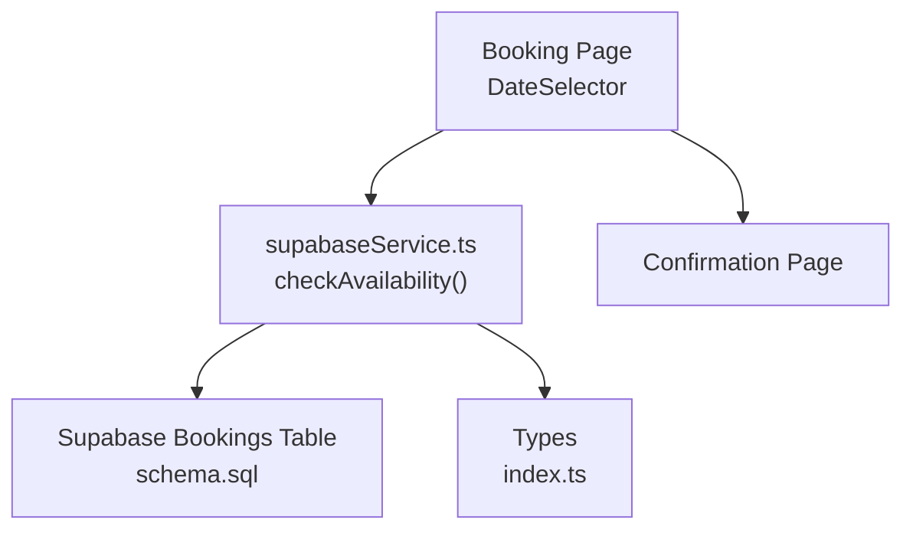
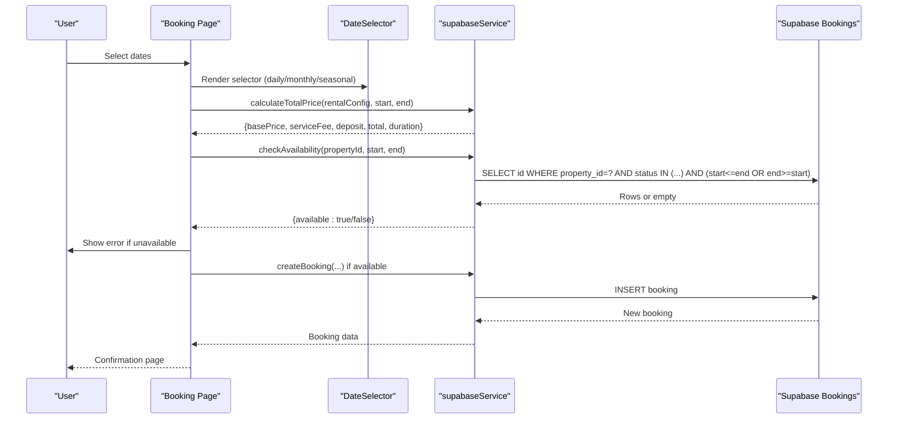
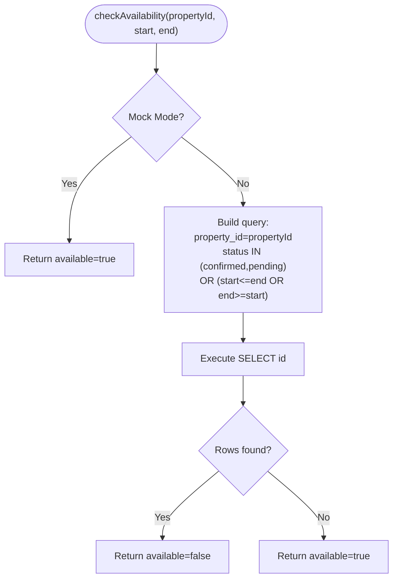
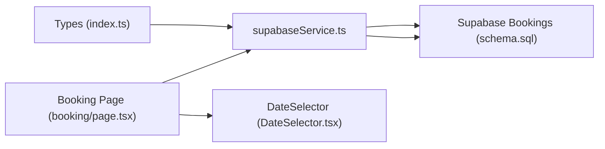

# Availability and Conflict Management

<cite>
**Referenced Files in This Document**
- [schema.sql](file://supabase/schema.sql)
- [supabaseService.ts](file://src/services/supabaseService.ts)
- [index.ts](file://src/types/index.ts)
- [booking/page.tsx](file://src/app/property/[id]/booking/page.tsx)
- [DateSelector.tsx](file://src/components/booking/DateSelector.tsx)
- [BOOKING_SYSTEM.md](file://BOOKING_SYSTEM.md)
- [database.types.ts](file://src/types/database.types.ts)
</cite>

## Table of Contents
1. [Introduction](#introduction)
2. [Project Structure](#project-structure)
3. [Core Components](#core-components)
4. [Architecture Overview](#architecture-overview)
5. [Detailed Component Analysis](#detailed-component-analysis)
6. [Dependency Analysis](#dependency-analysis)
7. [Performance Considerations](#performance-considerations)
8. [Troubleshooting Guide](#troubleshooting-guide)
9. [Conclusion](#conclusion)

## Introduction
This document explains the availability management system for property bookings. It covers the availability checking algorithm, booking conflict detection, real-time availability updates, database queries, data structures, caching strategies, and performance optimizations. Edge cases such as same-day bookings, partial availability, and maintenance periods are addressed, along with examples of validation logic, conflict resolution, and rejection scenarios.

## Project Structure
The availability system spans the Supabase schema, TypeScript service layer, UI components, and type definitions. The key areas are:
- Supabase schema defines the bookings table and related constraints.
- The service layer implements availability checks, pricing calculations, and booking creation.
- UI components collect dates and present pricing breakdowns.
- Types define the data contracts for availability, pricing, and booking lifecycle.

**Diagram sources**
- [supabaseService.ts](file://src/services/supabaseService.ts#L1116-L1137)
- [schema.sql](file://supabase/schema.sql#L94-L104)
- [index.ts](file://src/types/index.ts#L180-L237)
- [booking/page.tsx](file://src/app/property/[id]/booking/page.tsx#L146-L157)
- [DateSelector.tsx](file://src/components/booking/DateSelector.tsx#L74-L120)

**Section sources**
- [schema.sql](file://supabase/schema.sql#L94-L104)
- [supabaseService.ts](file://src/services/supabaseService.ts#L1116-L1137)
- [index.ts](file://src/types/index.ts#L180-L237)
- [booking/page.tsx](file://src/app/property/[id]/booking/page.tsx#L146-L157)
- [DateSelector.tsx](file://src/components/booking/DateSelector.tsx#L74-L120)

## Core Components
- Availability checking: Queries the bookings table for overlapping confirmed/pending reservations within a requested range.
- Pricing calculator: Computes base price, service fee, optional deposit, and total based on rental type and duration.
- Booking creation: Inserts a new booking record with tenant details, pricing, and initial status.
- UI date selector: Adapts to daily/monthly/seasonal rental types and enforces minimum durations.

Key implementation references:
- Availability check: [checkAvailability](file://src/services/supabaseService.ts#L1116-L1137)
- Pricing calculation: [calculateTotalPrice](file://src/services/supabaseService.ts#L1085-L1111)
- Booking creation: [createBooking](file://src/services/supabaseService.ts#L1142-L1153)
- Date selection logic: [DateSelector](file://src/components/booking/DateSelector.tsx#L74-L120)

**Section sources**
- [supabaseService.ts](file://src/services/supabaseService.ts#L1085-L1137)
- [DateSelector.tsx](file://src/components/booking/DateSelector.tsx#L74-L120)
- [booking/page.tsx](file://src/app/property/[id]/booking/page.tsx#L146-L157)

## Architecture Overview
The availability system integrates UI, service, and database layers. The booking page triggers availability checks before allowing submission. Pricing is computed client-side based on rental configuration, and the service layer persists the booking.

**Diagram sources**
- [booking/page.tsx](file://src/app/property/[id]/booking/page.tsx#L114-L191)
- [supabaseService.ts](file://src/services/supabaseService.ts#L1085-L1137)
- [supabaseService.ts](file://src/services/supabaseService.ts#L1142-L1153)
- [schema.sql](file://supabase/schema.sql#L94-L104)

## Detailed Component Analysis

### Availability Checking Algorithm
The algorithm determines whether a property is available during a requested stay by scanning existing bookings with confirmed or pending status and checking for overlap with the requested range.

- Overlap condition: Two intervals overlap if either the requested start falls within an existing interval OR the requested end falls within an existing interval.
- Status filter: Only considers confirmed and pending bookings to prevent double reservations.
- Query: Uses PostgREST select with equality and OR conditions to match overlapping stays.

**Diagram sources**
- [supabaseService.ts](file://src/services/supabaseService.ts#L1116-L1137)
- [schema.sql](file://supabase/schema.sql#L94-L104)

**Section sources**
- [supabaseService.ts](file://src/services/supabaseService.ts#L1116-L1137)
- [schema.sql](file://supabase/schema.sql#L94-L104)

### Booking Conflict Detection
Conflicts are detected by comparing the requested date range against existing confirmed/pending bookings. The overlap logic ensures that no two guests can occupy the same property during overlapping dates.

- Overlap logic: start ≤ existing_end AND end ≥ existing_start.
- Status coverage: Confirmed and pending bookings are considered reserved.
- Immediate rejection: If overlap exists, the system rejects the booking request before insertion.

References:
- Overlap query: [checkAvailability](file://src/services/supabaseService.ts#L1126-L1131)
- Rejection flow: [booking submission](file://src/app/property/[id]/booking/page.tsx#L153-L157)

**Section sources**
- [supabaseService.ts](file://src/services/supabaseService.ts#L1126-L1131)
- [booking/page.tsx](file://src/app/property/[id]/booking/page.tsx#L153-L157)

### Real-Time Availability Updates
Real-time updates occur after successful booking creation. The system immediately reflects the new reservation by marking the period as unavailable for future requests until the booking transitions to a non-reserved state.

- Update trigger: After INSERT into bookings, subsequent availability checks exclude the newly created booking.
- Status transitions: Confirmed, cancelled, or completed bookings no longer block availability.

References:
- Booking creation: [createBooking](file://src/services/supabaseService.ts#L1142-L1153)
- Status update: [updateBookingStatus](file://src/services/supabaseService.ts#L1358-L1381)

**Section sources**
- [supabaseService.ts](file://src/services/supabaseService.ts#L1142-L1153)
- [supabaseService.ts](file://src/services/supabaseService.ts#L1358-L1381)

### Database Queries for Availability
The availability check uses a single SELECT query on the bookings table with:
- Equality filter on property_id
- IN filter on status (confirmed, pending)
- OR condition to detect overlap between requested and existing stays

References:
- Query construction: [checkAvailability](file://src/services/supabaseService.ts#L1126-L1131)
- Table schema: [bookings](file://supabase/schema.sql#L94-L104)

**Section sources**
- [supabaseService.ts](file://src/services/supabaseService.ts#L1126-L1131)
- [schema.sql](file://supabase/schema.sql#L94-L104)

### Availability Data Structures
- RentalConfig: Defines rental type (daily, monthly, seasonal), unit price, min/max duration, and seasonal deposit configuration.
- Booking: Stores property, user, dates, pricing breakdown, payment info, and status.
- Property: Includes optional rentalConfig and availableDates arrays for broader availability modeling.

References:
- RentalConfig: [index.ts](file://src/types/index.ts#L184-L197)
- Booking: [index.ts](file://src/types/index.ts#L200-L236)
- Property: [index.ts](file://src/types/index.ts#L25-L54)

**Section sources**
- [index.ts](file://src/types/index.ts#L184-L236)

### Pricing Calculation Logic
The pricing calculator computes:
- Duration based on rental type and selected dates
- Base price = duration × price per unit
- Service fee = base price × 10%
- Optional deposit for seasonal rentals
- Total = base price + service fee + deposit

References:
- Calculation: [calculateTotalPrice](file://src/services/supabaseService.ts#L1085-L1111)
- UI integration: [booking page](file://src/app/property/[id]/booking/page.tsx#L114-L124)

**Section sources**
- [supabaseService.ts](file://src/services/supabaseService.ts#L1085-L1111)
- [booking/page.tsx](file://src/app/property/[id]/booking/page.tsx#L114-L124)

### Caching Strategies and Performance Optimizations
- Mock mode: Enables local development without database round-trips for availability and booking operations.
- Client-side pricing: Computed locally to reduce server calls during date selection.
- Minimal query footprint: Single SELECT with targeted filters reduces database load.
- Index-friendly filters: Equality and IN filters support efficient query execution.

References:
- Mock flag: [supabaseService.ts](file://src/services/supabaseService.ts#L6)
- Pricing computation: [supabaseService.ts](file://src/services/supabaseService.ts#L1085-L1111)

**Section sources**
- [supabaseService.ts](file://src/services/supabaseService.ts#L6)
- [supabaseService.ts](file://src/services/supabaseService.ts#L1085-L1111)

### Edge Cases and Examples
- Same-day bookings: Allowed if no existing confirmed/pending booking exists for that day.
- Partial availability: The system does not model per-night granularity; availability is enforced at the booking level.
- Maintenance periods: Not modeled in the current schema; consider adding a maintenance flag or blocked dates array to Property for future extension.

Validation and rejection examples:
- Overlapping dates: Availability check returns false; submission is rejected with an error message.
- Missing required fields: Submission prevents booking creation until all required fields are filled.

References:
- Availability rejection: [booking submission](file://src/app/property/[id]/booking/page.tsx#L153-L157)
- Date selector constraints: [DateSelector](file://src/components/booking/DateSelector.tsx#L53-L71)

**Section sources**
- [booking/page.tsx](file://src/app/property/[id]/booking/page.tsx#L153-L157)
- [DateSelector.tsx](file://src/components/booking/DateSelector.tsx#L53-L71)

## Dependency Analysis
The availability system depends on:
- Supabase schema for bookings table and constraints
- Service layer for availability checks and booking operations
- UI components for date selection and form submission
- Types for data contracts and configuration

**Diagram sources**
- [index.ts](file://src/types/index.ts#L180-L237)
- [supabaseService.ts](file://src/services/supabaseService.ts#L1116-L1137)
- [schema.sql](file://supabase/schema.sql#L94-L104)
- [booking/page.tsx](file://src/app/property/[id]/booking/page.tsx#L146-L157)
- [DateSelector.tsx](file://src/components/booking/DateSelector.tsx#L74-L120)

**Section sources**
- [index.ts](file://src/types/index.ts#L180-L237)
- [supabaseService.ts](file://src/services/supabaseService.ts#L1116-L1137)
- [schema.sql](file://supabase/schema.sql#L94-L104)
- [booking/page.tsx](file://src/app/property/[id]/booking/page.tsx#L146-L157)
- [DateSelector.tsx](file://src/components/booking/DateSelector.tsx#L74-L120)

## Performance Considerations
- Use equality and IN filters to leverage indexes efficiently.
- Keep overlap query minimal by selecting only the identifier field.
- Consider partitioning or indexing strategies if the number of bookings grows substantially.
- Batch UI updates to avoid redundant availability checks while dates change rapidly.

## Troubleshooting Guide
Common issues and resolutions:
- Availability false positives/negatives: Verify overlap logic and ensure status filters include only confirmed and pending.
- Incorrect pricing: Confirm rental type and duration calculation in the pricing function.
- Booking creation failures: Check for network errors and ensure required fields are populated before submission.

References:
- Availability logic: [checkAvailability](file://src/services/supabaseService.ts#L1116-L1137)
- Pricing logic: [calculateTotalPrice](file://src/services/supabaseService.ts#L1085-L1111)
- Submission flow: [booking submission](file://src/app/property/[id]/booking/page.tsx#L127-L191)

**Section sources**
- [supabaseService.ts](file://src/services/supabaseService.ts#L1085-L1137)
- [booking/page.tsx](file://src/app/property/[id]/booking/page.tsx#L127-L191)

## Conclusion
The availability management system provides robust conflict detection through a straightforward overlap query on confirmed and pending bookings. Pricing is calculated client-side for responsiveness, and the UI adapts to different rental types. While the current implementation focuses on booking-level availability, future enhancements could include per-night granularity and maintenance scheduling for richer availability modeling.