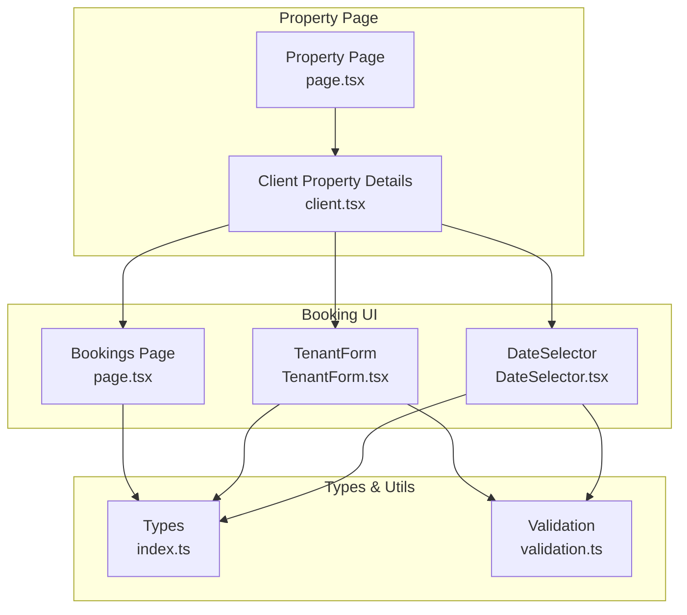
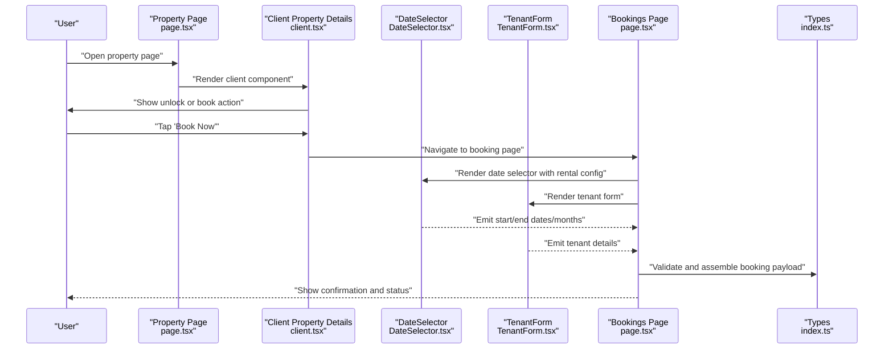
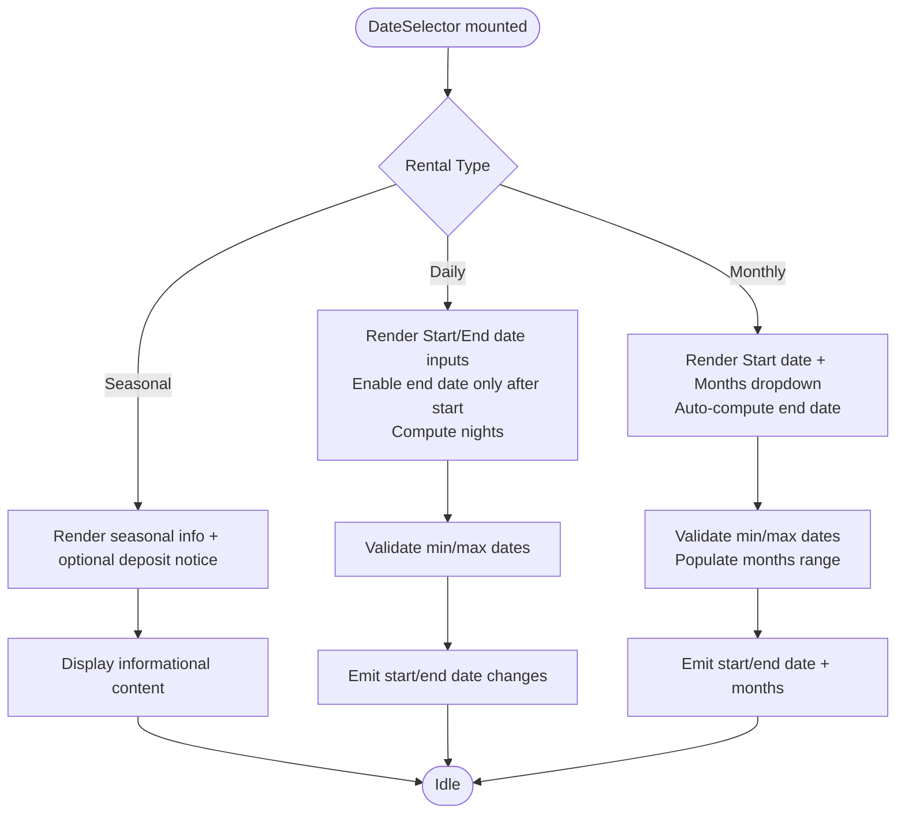
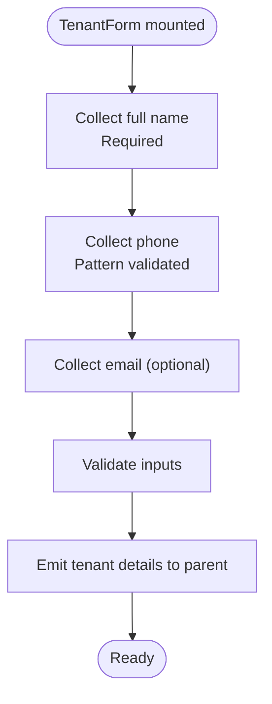
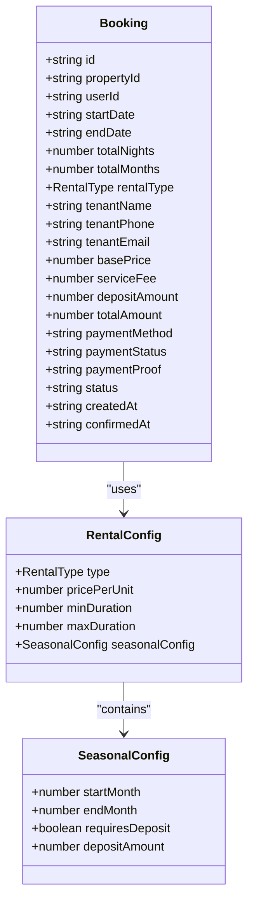
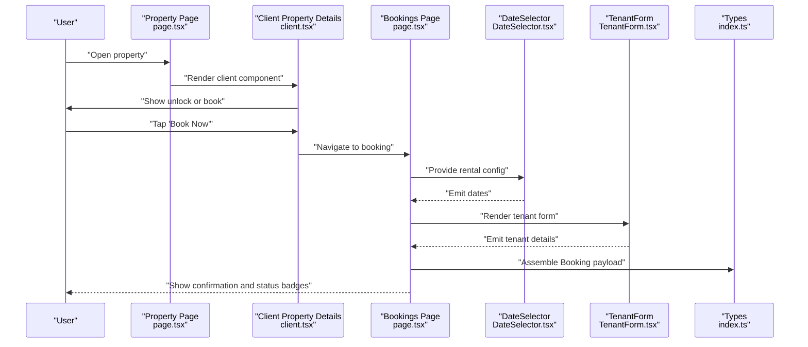
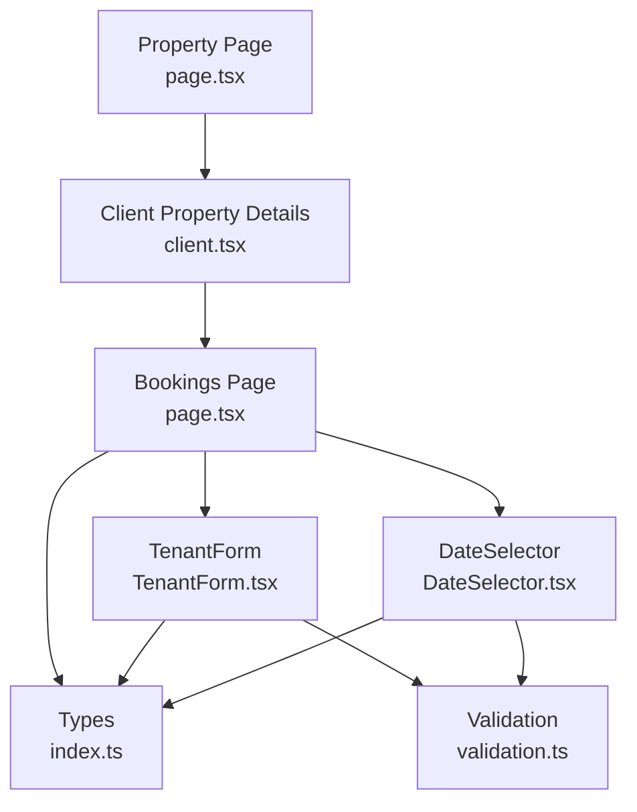

# Booking Workflow and Management

<cite>
**Referenced Files in This Document**
- [DateSelector.tsx](file://src/components/booking/DateSelector.tsx)
- [TenantForm.tsx](file://src/components/booking/TenantForm.tsx)
- [index.ts](file://src/types/index.ts)
- [client.tsx](file://src/app/property/[id]/client.tsx)
- [page.tsx](file://src/app/property/[id]/page.tsx)
- [page.tsx](file://src/app/bookings/page.tsx)
- [validation.ts](file://src/utils/validation.ts)
</cite>

## Table of Contents
1. [Introduction](#introduction)
2. [Project Structure](#project-structure)
3. [Core Components](#core-components)
4. [Architecture Overview](#architecture-overview)
5. [Detailed Component Analysis](#detailed-component-analysis)
6. [Dependency Analysis](#dependency-analysis)
7. [Performance Considerations](#performance-considerations)
8. [Troubleshooting Guide](#troubleshooting-guide)
9. [Conclusion](#conclusion)

## Introduction
This document explains the booking workflow and management system for the real estate platform. It covers the complete journey from property selection to confirmation, including date selection with availability-aware logic, tenant information collection, and booking creation. It also documents the booking data model, validation rules, status management, and integration points among the DateSelector component, TenantForm component, and the main booking page. The goal is to provide a clear understanding of how users select dates, enter tenant details, submit a booking, and receive feedback, while ensuring robust validation and status transitions.

## Project Structure
The booking system spans several layers:
- Property detail page: Presents property information and initiates the booking flow after unlocking.
- Booking page: Hosts the booking form with DateSelector and TenantForm components.
- Types: Defines the Booking data model and related enums/types.
- Utilities: Provides validation helpers used across the application.

**Diagram sources**
- [page.tsx](file://src/app/property/[id]/page.tsx#L74-L87)
- [client.tsx](file://src/app/property/[id]/client.tsx#L17-L214)
- [DateSelector.tsx](file://src/components/booking/DateSelector.tsx#L1-L323)
- [TenantForm.tsx](file://src/components/booking/TenantForm.tsx#L1-L136)
- [page.tsx](file://src/app/bookings/page.tsx#L79-L271)
- [index.ts](file://src/types/index.ts#L180-L236)
- [validation.ts](file://src/utils/validation.ts#L1-L33)

**Section sources**
- [page.tsx](file://src/app/property/[id]/page.tsx#L74-L87)
- [client.tsx](file://src/app/property/[id]/client.tsx#L17-L214)
- [DateSelector.tsx](file://src/components/booking/DateSelector.tsx#L1-L323)
- [TenantForm.tsx](file://src/components/booking/TenantForm.tsx#L1-L136)
- [page.tsx](file://src/app/bookings/page.tsx#L79-L271)
- [index.ts](file://src/types/index.ts#L180-L236)
- [validation.ts](file://src/utils/validation.ts#L1-L33)

## Core Components
- DateSelector: Handles date selection for daily, monthly, and seasonal rentals, enforcing minimum/maximum durations and providing computed end dates for monthly selections.
- TenantForm: Collects tenant name, phone, and optional email with pattern validation for phone numbers.
- Booking Page: Manages booking state, displays tabs for "My Bookings" and "Incoming Requests", and updates statuses locally for demonstration.
- Types: Defines the Booking interface, RentalType, RentalConfig, and related enums for consistent data modeling.

Key responsibilities:
- DateSelector ensures valid date ranges based on rental configuration and emits changes to parent components.
- TenantForm validates phone numbers and forwards tenant details to the booking page.
- Booking Page orchestrates the booking submission flow and manages UI state for local demo purposes.

**Section sources**
- [DateSelector.tsx](file://src/components/booking/DateSelector.tsx#L15-L246)
- [TenantForm.tsx](file://src/components/booking/TenantForm.tsx#L14-L135)
- [page.tsx](file://src/app/bookings/page.tsx#L79-L271)
- [index.ts](file://src/types/index.ts#L180-L236)

## Architecture Overview
The booking workflow integrates the property page, booking UI, and data models. The property page determines whether the user can proceed to booking (after unlocking), and the booking page composes the DateSelector and TenantForm to collect inputs. The types define the shape of booking data and rental configurations.

**Diagram sources**
- [page.tsx](file://src/app/property/[id]/page.tsx#L74-L87)
- [client.tsx](file://src/app/property/[id]/client.tsx#L164-L211)
- [DateSelector.tsx](file://src/components/booking/DateSelector.tsx#L15-L246)
- [TenantForm.tsx](file://src/components/booking/TenantForm.tsx#L14-L135)
- [page.tsx](file://src/app/bookings/page.tsx#L79-L271)
- [index.ts](file://src/types/index.ts#L180-L236)

## Detailed Component Analysis

### DateSelector Component
Purpose:
- Provide intuitive date selection for three rental types: daily, monthly, and seasonal.
- Enforce minimum/maximum durations and compute derived end dates for monthly selections.
- Display computed stay duration for daily rentals and formatted end dates for monthly.

Key behaviors:
- Daily mode: Enables end date input only after a start date is selected; calculates nights between dates.
- Monthly mode: Allows selecting number of months within configured bounds; auto-computes end date based on start date.
- Seasonal mode: Displays informational notice about the academic season and optional deposit requirement.

Validation and constraints:
- Start date minimum is today.
- End date minimum depends on rental type and configured minimum duration.
- Months dropdown is populated from minDuration to maxDuration.

Integration:
- Emits callbacks for start date, end date, and months change to parent components.

**Diagram sources**
- [DateSelector.tsx](file://src/components/booking/DateSelector.tsx#L74-L173)

**Section sources**
- [DateSelector.tsx](file://src/components/booking/DateSelector.tsx#L15-L246)

### TenantForm Component
Purpose:
- Collect tenant identity and contact information with required validations.

Key behaviors:
- Full name is required.
- Phone number is required and validated with a pattern for Egyptian mobile numbers.
- Email is optional.

Validation:
- Pattern-based phone validation ensures a specific format.
- Required field enforcement for name and phone.

Integration:
- Emits change events for each field to the parent booking page.

**Diagram sources**
- [TenantForm.tsx](file://src/components/booking/TenantForm.tsx#L22-L77)

**Section sources**
- [TenantForm.tsx](file://src/components/booking/TenantForm.tsx#L14-L135)

### Booking Data Model and Validation Rules
The Booking interface defines the complete structure for a booking record, including:
- Identity: id, propertyId, userId.
- Dates: startDate, endDate, plus totals for nightly and monthly stays.
- Rental configuration: rentalType and associated pricing and duration fields.
- Tenant details: tenantName, tenantPhone, tenantEmail.
- Pricing: basePrice, serviceFee, optional depositAmount, totalAmount, and payment fields.
- Status: pending, confirmed, cancelled with timestamps.
- Relationships: optional property and user references.

Rental configuration:
- RentalType supports daily, monthly, and seasonal modes.
- RentalConfig includes price per unit, min/max duration, and seasonal-specific fields.

Validation rules observed in components:
- Phone pattern enforces Egyptian mobile format.
- Date constraints enforce minimum durations and logical ordering.
- Optional email allows free text; required fields enforced at UI level.

**Diagram sources**
- [index.ts](file://src/types/index.ts#L184-L236)

**Section sources**
- [index.ts](file://src/types/index.ts#L180-L236)

### Booking Submission Flow and User Feedback
The booking submission flow integrates the property page navigation, date selection, tenant form, and booking page logic. While the current implementation demonstrates UI state transitions locally, the types define a complete payload for submission.

**Diagram sources**
- [page.tsx](file://src/app/property/[id]/page.tsx#L74-L87)
- [client.tsx](file://src/app/property/[id]/client.tsx#L164-L211)
- [page.tsx](file://src/app/bookings/page.tsx#L79-L271)
- [DateSelector.tsx](file://src/components/booking/DateSelector.tsx#L15-L246)
- [TenantForm.tsx](file://src/components/booking/TenantForm.tsx#L14-L135)
- [index.ts](file://src/types/index.ts#L180-L236)

**Section sources**
- [page.tsx](file://src/app/property/[id]/page.tsx#L74-L87)
- [client.tsx](file://src/app/property/[id]/client.tsx#L164-L211)
- [page.tsx](file://src/app/bookings/page.tsx#L79-L271)
- [DateSelector.tsx](file://src/components/booking/DateSelector.tsx#L15-L246)
- [TenantForm.tsx](file://src/components/booking/TenantForm.tsx#L14-L135)
- [index.ts](file://src/types/index.ts#L180-L236)

## Dependency Analysis
The booking system exhibits clear separation of concerns:
- Property page depends on client-side logic to unlock and navigate to the booking page.
- Booking page composes reusable UI components (DateSelector, TenantForm) and relies on shared types.
- Validation utilities support input sanitization and media/file validation elsewhere in the app.

**Diagram sources**
- [page.tsx](file://src/app/property/[id]/page.tsx#L74-L87)
- [client.tsx](file://src/app/property/[id]/client.tsx#L17-L214)
- [page.tsx](file://src/app/bookings/page.tsx#L79-L271)
- [DateSelector.tsx](file://src/components/booking/DateSelector.tsx#L1-L323)
- [TenantForm.tsx](file://src/components/booking/TenantForm.tsx#L1-L136)
- [index.ts](file://src/types/index.ts#L180-L236)
- [validation.ts](file://src/utils/validation.ts#L1-L33)

**Section sources**
- [page.tsx](file://src/app/property/[id]/page.tsx#L74-L87)
- [client.tsx](file://src/app/property/[id]/client.tsx#L17-L214)
- [page.tsx](file://src/app/bookings/page.tsx#L79-L271)
- [DateSelector.tsx](file://src/components/booking/DateSelector.tsx#L1-L323)
- [TenantForm.tsx](file://src/components/booking/TenantForm.tsx#L1-L136)
- [index.ts](file://src/types/index.ts#L180-L236)
- [validation.ts](file://src/utils/validation.ts#L1-L33)

## Performance Considerations
- Date computation: The daily mode computes nights using date arithmetic; keep computations lightweight and avoid unnecessary re-renders by memoizing derived values.
- Monthly mode: Auto-computing end dates avoids redundant user input and reduces errors.
- UI responsiveness: Use controlled components for inputs and debounce heavy operations if extended to live availability checks.

## Troubleshooting Guide
Common issues and resolutions:
- Invalid phone number: Ensure the phone matches the expected pattern before enabling submission.
- Disabled end date input: In daily mode, enable end date selection only after a valid start date is chosen.
- Missing tenant details: Validate required fields before assembling the booking payload.
- Status transitions: Confirm that UI state reflects the intended status changes and that actions (accept/reject/cancel) update state consistently.

**Section sources**
- [TenantForm.tsx](file://src/components/booking/TenantForm.tsx#L55-L56)
- [DateSelector.tsx](file://src/components/booking/DateSelector.tsx#L101-L102)
- [page.tsx](file://src/app/bookings/page.tsx#L85-L99)

## Conclusion
The booking workflow integrates a modular UI with a robust data model. DateSelector and TenantForm provide focused input handling, while the booking page orchestrates the submission flow and status management. The types define a clear contract for booking records, and validation rules ensure data quality. Extending this system to integrate with backend services would involve replacing local state updates with API calls and incorporating availability checks aligned with the rental configuration.