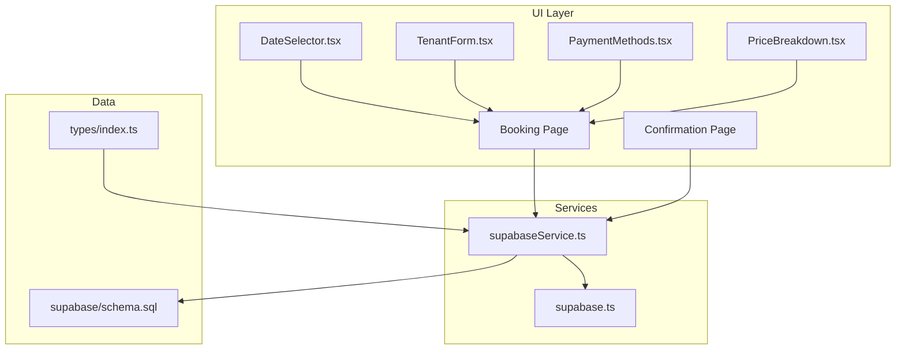
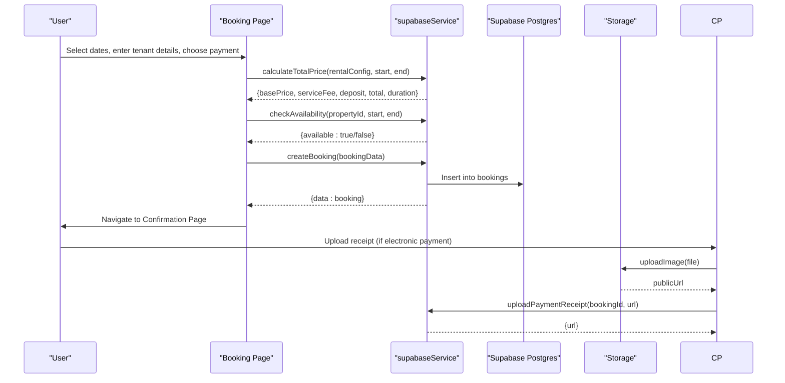
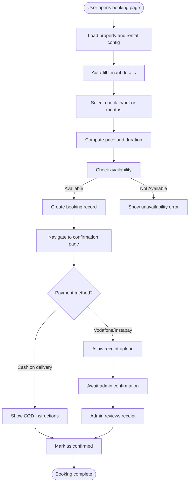
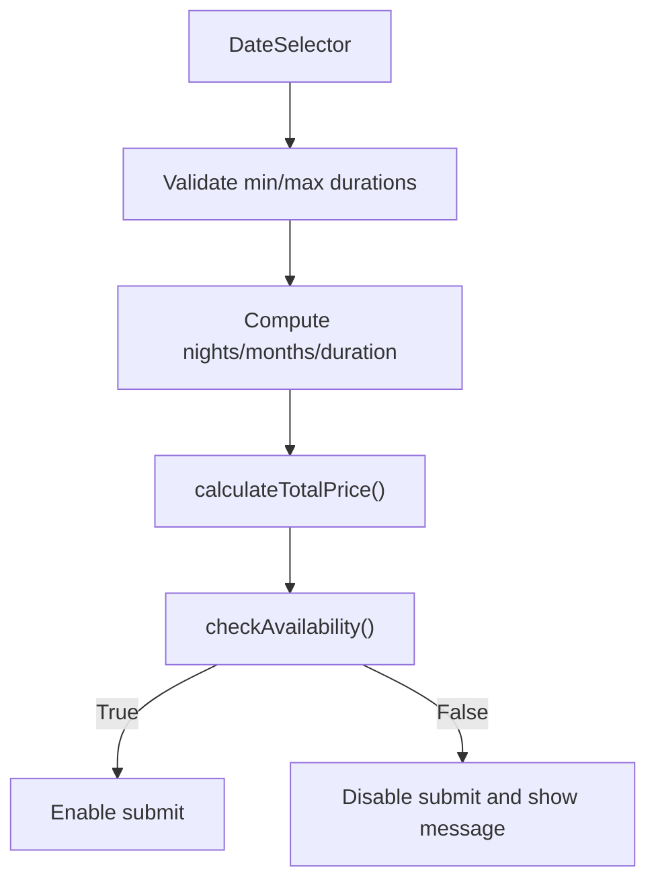
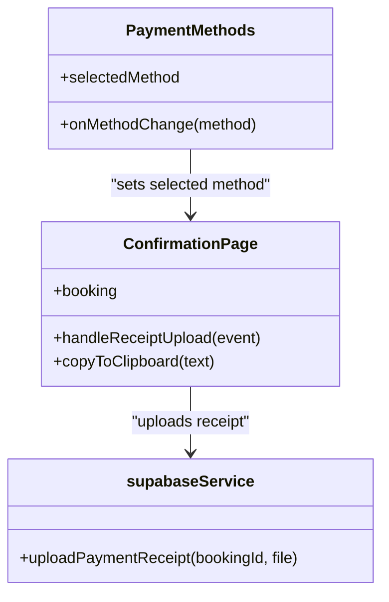
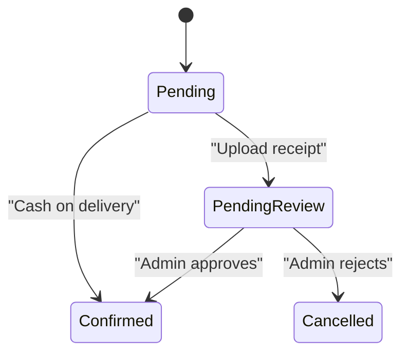
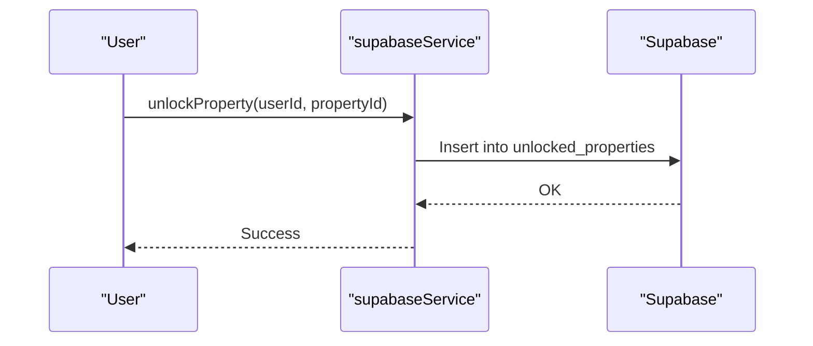
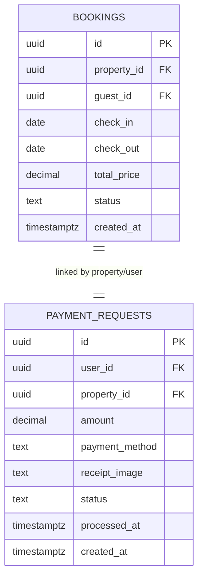
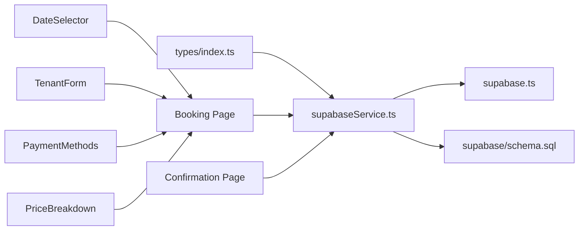

# Booking and Payment System

<cite>
**Referenced Files in This Document**
- [BOOKING_SYSTEM.md](file://BOOKING_SYSTEM.md)
- [README.md](file://README.md)
- [product_specification.md](file://product_specification.md)
- [src/types/index.ts](file://src/types/index.ts)
- [src/services/supabaseService.ts](file://src/services/supabaseService.ts)
- [src/components/booking/DateSelector.tsx](file://src/components/booking/DateSelector.tsx)
- [src/components/booking/TenantForm.tsx](file://src/components/booking/TenantForm.tsx)
- [src/components/booking/PaymentMethods.tsx](file://src/components/booking/PaymentMethods.tsx)
- [src/components/booking/PriceBreakdown.tsx](file://src/components/booking/PriceBreakdown.tsx)
- [src/app/property/[id]/booking/page.tsx](file://src/app/property/[id]/booking/page.tsx)
- [src/app/property/[id]/booking/confirmation/page.tsx](file://src/app/property/[id]/booking/confirmation/page.tsx)
- [src/lib/supabase.ts](file://src/lib/supabase.ts)
- [supabase/schema.sql](file://supabase/schema.sql)
</cite>

## Table of Contents
1. [Introduction](#introduction)
2. [Project Structure](#project-structure)
3. [Core Components](#core-components)
4. [Architecture Overview](#architecture-overview)
5. [Detailed Component Analysis](#detailed-component-analysis)
6. [Dependency Analysis](#dependency-analysis)
7. [Performance Considerations](#performance-considerations)
8. [Troubleshooting Guide](#troubleshooting-guide)
9. [Conclusion](#conclusion)
10. [Appendices](#appendices)

## Introduction
This document describes the comprehensive booking and payment system for Gamasa Properties. It covers the booking workflow, date selection and availability checks, payment processing across multiple methods (Vodafone Cash, Instapay, Cash on Delivery), booking confirmation management, property unlocking, transaction management, and booking status tracking. It also documents payment validation, refund procedures, cancellation policies, real-time availability updates, conflict resolution, and notification systems for booking changes. Examples of booking data structures, payment API integrations, and booking management interfaces are included.

## Project Structure
The booking system is implemented as a Next.js App Router application with TypeScript and Supabase for backend services and storage. Key areas:
- Types and data models define rental configurations, booking records, and payment requests.
- Services encapsulate Supabase interactions for property, booking, payment, and notification operations.
- UI components provide date selection, tenant form, payment method selection, and price breakdown.
- Pages orchestrate the booking flow and confirmation experience.

**Diagram sources**
- [src/app/property/[id]/booking/page.tsx](file://src/app/property/[id]/booking/page.tsx#L1-L551)
- [src/app/property/[id]/booking/confirmation/page.tsx](file://src/app/property/[id]/booking/confirmation/page.tsx#L1-L601)
- [src/components/booking/DateSelector.tsx](file://src/components/booking/DateSelector.tsx#L1-L323)
- [src/components/booking/TenantForm.tsx](file://src/components/booking/TenantForm.tsx#L1-L136)
- [src/components/booking/PaymentMethods.tsx](file://src/components/booking/PaymentMethods.tsx#L1-L150)
- [src/components/booking/PriceBreakdown.tsx](file://src/components/booking/PriceBreakdown.tsx#L1-L136)
- [src/services/supabaseService.ts](file://src/services/supabaseService.ts#L1-L800)
- [src/lib/supabase.ts](file://src/lib/supabase.ts#L1-L68)
- [src/types/index.ts](file://src/types/index.ts#L1-L237)
- [supabase/schema.sql](file://supabase/schema.sql#L1-L416)

**Section sources**
- [README.md](file://README.md#L1-L37)
- [product_specification.md](file://product_specification.md#L1-L44)

## Core Components
- Rental configuration model defines pricing units, minimum/maximum durations, and seasonal insurance requirements.
- Booking model captures dates, tenant details, costs, payment method, and statuses.
- Payment request model supports Vodafone Cash, Instapay, and Fawry with receipt images and admin processing.
- UI components:
  - DateSelector adapts to daily/monthly/seasonal rentals.
  - TenantForm collects required tenant details.
  - PaymentMethods lists supported payment modes.
  - PriceBreakdown computes and displays cost breakdown including service fee and optional deposit.
- Pages:
  - Booking page orchestrates selection, validation, availability check, creation, and navigation to confirmation.
  - Confirmation page handles payment instructions, receipt uploads, and booking details.

**Section sources**
- [src/types/index.ts](file://src/types/index.ts#L178-L237)
- [src/components/booking/DateSelector.tsx](file://src/components/booking/DateSelector.tsx#L1-L323)
- [src/components/booking/TenantForm.tsx](file://src/components/booking/TenantForm.tsx#L1-L136)
- [src/components/booking/PaymentMethods.tsx](file://src/components/booking/PaymentMethods.tsx#L1-L150)
- [src/components/booking/PriceBreakdown.tsx](file://src/components/booking/PriceBreakdown.tsx#L1-L136)
- [src/app/property/[id]/booking/page.tsx](file://src/app/property/[id]/booking/page.tsx#L1-L551)
- [src/app/property/[id]/booking/confirmation/page.tsx](file://src/app/property/[id]/booking/confirmation/page.tsx#L1-L601)

## Architecture Overview
The system follows a layered architecture:
- Presentation: Next.js App Router pages and reusable UI components.
- Application: Service layer encapsulating Supabase operations.
- Data: Supabase Postgres tables with Row Level Security and publication for real-time updates.

**Diagram sources**
- [src/app/property/[id]/booking/page.tsx](file://src/app/property/[id]/booking/page.tsx#L114-L191)
- [src/app/property/[id]/booking/confirmation/page.tsx](file://src/app/property/[id]/booking/confirmation/page.tsx#L48-L79)
- [src/services/supabaseService.ts](file://src/services/supabaseService.ts#L1-L800)
- [src/lib/supabase.ts](file://src/lib/supabase.ts#L34-L67)

## Detailed Component Analysis

### Booking Workflow Implementation
The booking workflow is implemented in the booking page and confirmation page:
- The booking page validates user login, collects dates and tenant details, computes totals, checks availability, creates a booking, and navigates to confirmation.
- The confirmation page displays payment instructions for electronic methods, allows receipt uploads, and shows booking details.

**Diagram sources**
- [src/app/property/[id]/booking/page.tsx](file://src/app/property/[id]/booking/page.tsx#L114-L191)
- [src/app/property/[id]/booking/confirmation/page.tsx](file://src/app/property/[id]/booking/confirmation/page.tsx#L115-L189)

**Section sources**
- [src/app/property/[id]/booking/page.tsx](file://src/app/property/[id]/booking/page.tsx#L114-L191)
- [src/app/property/[id]/booking/confirmation/page.tsx](file://src/app/property/[id]/booking/confirmation/page.tsx#L115-L189)

### Date Selection and Availability Checking
- DateSelector adapts to rental type:
  - Daily: date pickers for check-in and check-out with minimum stay enforcement.
  - Monthly: select start date and number of months within configured bounds.
  - Seasonal: fixed academic period with optional deposit notice.
- Availability is checked against property-specific availability windows and existing bookings before allowing a booking creation.

**Diagram sources**
- [src/components/booking/DateSelector.tsx](file://src/components/booking/DateSelector.tsx#L23-L71)
- [src/app/property/[id]/booking/page.tsx](file://src/app/property/[id]/booking/page.tsx#L114-L157)
- [src/services/supabaseService.ts](file://src/services/supabaseService.ts#L1-L800)

**Section sources**
- [src/components/booking/DateSelector.tsx](file://src/components/booking/DateSelector.tsx#L74-L243)
- [src/app/property/[id]/booking/page.tsx](file://src/app/property/[id]/booking/page.tsx#L114-L157)

### Payment Processing Integration
Supported payment methods:
- Vodafone Cash: copyable account number and receipt upload.
- Instapay: instant transfer with receipt upload.
- Cash on Delivery: immediate confirmation and owner contact details.

**Diagram sources**
- [src/components/booking/PaymentMethods.tsx](file://src/components/booking/PaymentMethods.tsx#L12-L32)
- [src/app/property/[id]/booking/confirmation/page.tsx](file://src/app/property/[id]/booking/confirmation/page.tsx#L48-L79)
- [src/services/supabaseService.ts](file://src/services/supabaseService.ts#L1-L800)

**Section sources**
- [src/components/booking/PaymentMethods.tsx](file://src/components/booking/PaymentMethods.tsx#L13-L32)
- [src/app/property/[id]/booking/confirmation/page.tsx](file://src/app/property/[id]/booking/confirmation/page.tsx#L115-L189)

### Booking Confirmation Management
- Confirmation page displays booking summary, payment instructions, and owner contact for cash-on-delivery.
- Electronic payment holders receive instructions to transfer funds and upload receipts.
- Status transitions:
  - Cash on delivery: booking marked confirmed immediately.
  - Electronic payments: pending until receipt is uploaded and reviewed.

**Diagram sources**
- [src/app/property/[id]/booking/confirmation/page.tsx](file://src/app/property/[id]/booking/confirmation/page.tsx#L115-L189)
- [src/services/supabaseService.ts](file://src/services/supabaseService.ts#L1-L800)

**Section sources**
- [src/app/property/[id]/booking/confirmation/page.tsx](file://src/app/property/[id]/booking/confirmation/page.tsx#L115-L189)

### Property Unlocking Mechanism
- Users unlock properties to gain access to booking features.
- Unlocking persists per user-property pair and is enforced in the service layer.

**Diagram sources**
- [src/services/supabaseService.ts](file://src/services/supabaseService.ts#L528-L536)
- [supabase/schema.sql](file://supabase/schema.sql#L161-L167)

**Section sources**
- [src/services/supabaseService.ts](file://src/services/supabaseService.ts#L513-L536)
- [supabase/schema.sql](file://supabase/schema.sql#L161-L167)

### Transaction Management and Booking Status Tracking
- Transactions are modeled as booking records with computed totals and service fees.
- Status tracking includes pending, confirmed, cancelled, and completed states.
- Payment status tracks pending, confirmed, failed for electronic payments.

**Diagram sources**
- [supabase/schema.sql](file://supabase/schema.sql#L94-L128)
- [src/types/index.ts](file://src/types/index.ts#L72-L86)

**Section sources**
- [supabase/schema.sql](file://supabase/schema.sql#L94-L128)
- [src/types/index.ts](file://src/types/index.ts#L72-L86)

### Payment Validation, Refund Procedures, and Cancellation Policies
- Payment validation:
  - Electronic payments require receipt upload and admin approval.
  - Cash on delivery is confirmed upon booking creation.
- Refunds and cancellations:
  - Seasonal deposits are refundable per policy; UI indicates refund eligibility.
  - Cancellations follow platform-defined policies; current implementation focuses on confirmation and pending states.

**Section sources**
- [src/components/booking/PriceBreakdown.tsx](file://src/components/booking/PriceBreakdown.tsx#L62-L76)
- [src/app/property/[id]/booking/confirmation/page.tsx](file://src/app/property/[id]/booking/confirmation/page.tsx#L254-L277)

### Real-Time Availability Updates and Conflict Resolution
- Availability checks occur before booking creation to prevent conflicts.
- Real-time updates leverage Supabase Realtime for messaging; similar mechanisms can be extended to booking availability signals.

**Section sources**
- [src/app/property/[id]/booking/page.tsx](file://src/app/property/[id]/booking/page.tsx#L146-L157)
- [supabase/schema.sql](file://supabase/schema.sql#L406-L416)

### Notification Systems for Booking Changes
- Notifications are stored in Supabase with types (success, info, warning, error) and links.
- The service layer supports fetching, marking as read, and creating notifications.

**Section sources**
- [src/types/index.ts](file://src/types/index.ts#L113-L122)
- [src/services/supabaseService.ts](file://src/services/supabaseService.ts#L566-L637)

## Dependency Analysis
The system exhibits clear separation of concerns:
- UI components depend on types and service functions.
- Pages orchestrate component interactions and service calls.
- Services depend on Supabase client and schema tables.
- Types define contracts for data exchange.

**Diagram sources**
- [src/types/index.ts](file://src/types/index.ts#L1-L237)
- [src/services/supabaseService.ts](file://src/services/supabaseService.ts#L1-L800)
- [src/lib/supabase.ts](file://src/lib/supabase.ts#L1-L68)
- [supabase/schema.sql](file://supabase/schema.sql#L1-L416)
- [src/app/property/[id]/booking/page.tsx](file://src/app/property/[id]/booking/page.tsx#L1-L551)
- [src/app/property/[id]/booking/confirmation/page.tsx](file://src/app/property/[id]/booking/confirmation/page.tsx#L1-L601)

**Section sources**
- [src/types/index.ts](file://src/types/index.ts#L1-L237)
- [src/services/supabaseService.ts](file://src/services/supabaseService.ts#L1-L800)

## Performance Considerations
- Mock mode flag enables local development without database overhead; production requires disabling mock mode.
- Computation of totals and availability occurs client-side after initial property load; caching and debouncing can improve responsiveness.
- Receipt uploads use Supabase Storage; ensure appropriate bucket policies and CDN configuration for optimal performance.

[No sources needed since this section provides general guidance]

## Troubleshooting Guide
Common issues and resolutions:
- Missing environment variables for Supabase cause warnings; configure NEXT_PUBLIC_SUPABASE_URL and NEXT_PUBLIC_SUPABASE_ANON_KEY.
- Mock mode prevents database writes; toggle IS_MOCK_MODE to false for production.
- Receipt upload errors: verify file type (image/*), size (<5MB), and storage bucket permissions.
- Availability failures: confirm date range respects minimum/maximum durations and existing bookings.

**Section sources**
- [src/lib/supabase.ts](file://src/lib/supabase.ts#L7-L15)
- [src/services/supabaseService.ts](file://src/services/supabaseService.ts#L5-L6)
- [src/app/property/[id]/booking/confirmation/page.tsx](file://src/app/property/[id]/booking/confirmation/page.tsx#L53-L63)

## Conclusion
Gamasa Properties’ booking and payment system integrates a modern UI with robust backend services to support flexible rental types, secure payment processing, and streamlined confirmation workflows. The modular architecture, clear data models, and Supabase-backed persistence provide a scalable foundation for future enhancements such as advanced calendar integration, automated notifications, and administrative dashboards.

[No sources needed since this section summarizes without analyzing specific files]

## Appendices

### Booking Data Structures
- RentalConfig: Defines rental type, unit price, min/max duration, and seasonal deposit settings.
- Booking: Captures dates, tenant info, costs, payment method/status, and state.
- PaymentRequest: Supports Vodafone Cash, Instapay, and Fawry with receipt images and admin processing.

**Section sources**
- [src/types/index.ts](file://src/types/index.ts#L183-L237)

### Payment API Integrations
- Electronic payments integrate with Vodafone Cash and Instapay via receipt uploads and admin review.
- Cash on delivery is handled directly within the booking flow.

**Section sources**
- [src/components/booking/PaymentMethods.tsx](file://src/components/booking/PaymentMethods.tsx#L13-L32)
- [src/app/property/[id]/booking/confirmation/page.tsx](file://src/app/property/[id]/booking/confirmation/page.tsx#L115-L189)

### Booking Management Interfaces
- Booking page: Orchestrates selection, validation, availability checks, and creation.
- Confirmation page: Manages payment instructions, receipt uploads, and booking details.

**Section sources**
- [src/app/property/[id]/booking/page.tsx](file://src/app/property/[id]/booking/page.tsx#L114-L191)
- [src/app/property/[id]/booking/confirmation/page.tsx](file://src/app/property/[id]/booking/confirmation/page.tsx#L115-L189)