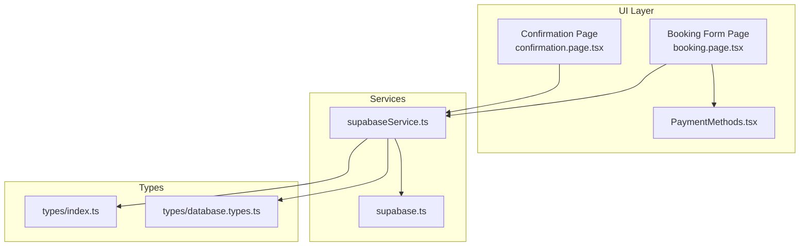
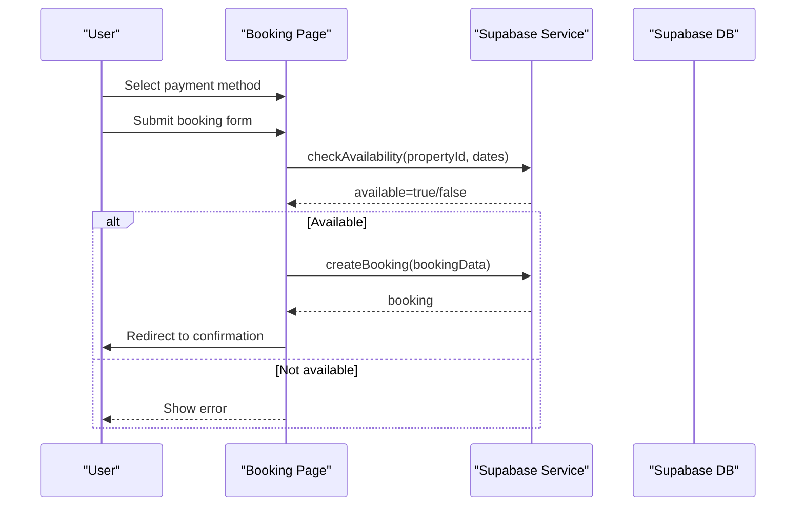
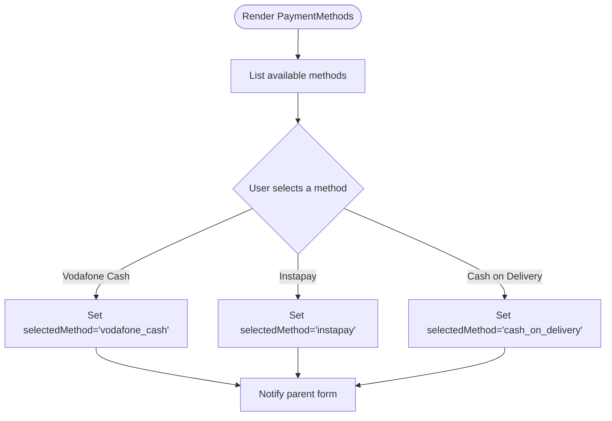
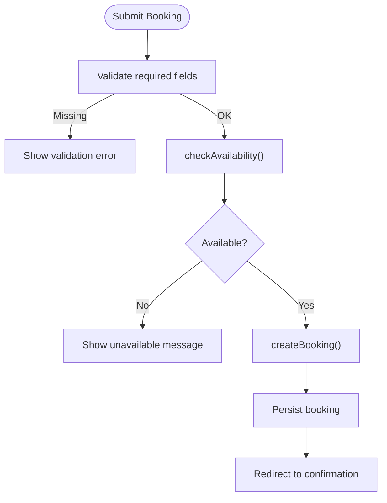
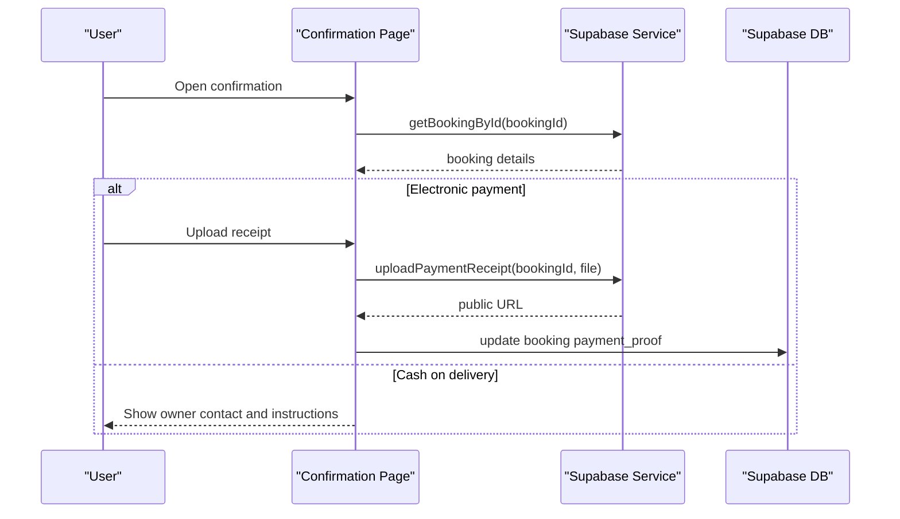
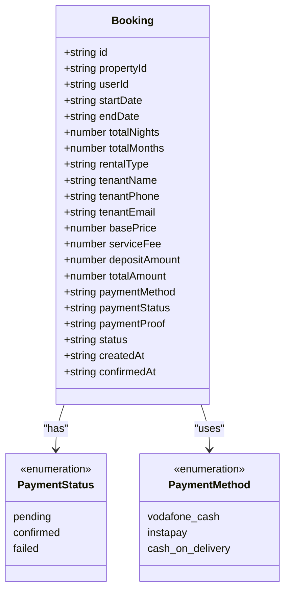
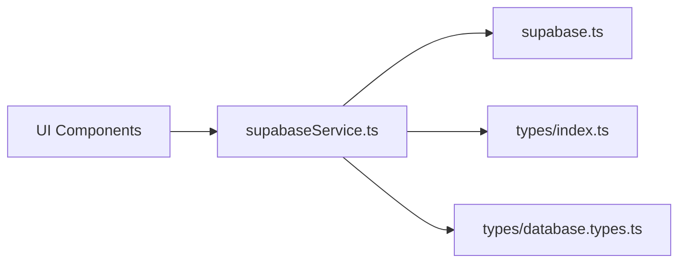

# Payment Processing System

<cite>
**Referenced Files in This Document**
- [PaymentMethods.tsx](file://src/components/booking/PaymentMethods.tsx)
- [booking.page.tsx](file://src/app/property/[id]/booking/page.tsx)
- [confirmation.page.tsx](file://src/app/property/[id]/booking/confirmation/page.tsx)
- [supabaseService.ts](file://src/services/supabaseService.ts)
- [index.ts](file://src/types/index.ts)
- [database.types.ts](file://src/types/database.types.ts)
- [supabase.ts](file://src/lib/supabase.ts)
</cite>

## Table of Contents
1. [Introduction](#introduction)
2. [Project Structure](#project-structure)
3. [Core Components](#core-components)
4. [Architecture Overview](#architecture-overview)
5. [Detailed Component Analysis](#detailed-component-analysis)
6. [Dependency Analysis](#dependency-analysis)
7. [Performance Considerations](#performance-considerations)
8. [Troubleshooting Guide](#troubleshooting-guide)
9. [Security and Compliance](#security-and-compliance)
10. [Conclusion](#conclusion)

## Introduction
This document describes the payment processing system for property bookings, supporting three payment methods: Vodafone Cash, Instapay, and Cash on Delivery. It covers the payment method selection interface, validation logic, transaction handling, integration with external payment channels, payment status tracking, and confirmation workflows. It also documents payment data structures, validation rules, error handling, and security considerations.

## Project Structure
The payment system spans UI components, page controllers, service utilities, and type definitions:

- UI Components: Payment selection, tenant form, price breakdown
- Page Controllers: Booking form and confirmation page
- Services: Supabase integration for availability checks, booking creation, and receipt uploads
- Types: Strongly typed payment and booking models
- Infrastructure: Supabase client and storage utilities

**Diagram sources**
- [PaymentMethods.tsx](file://src/components/booking/PaymentMethods.tsx#L1-L150)
- [booking.page.tsx](file://src/app/property/[id]/booking/page.tsx#L1-L551)
- [confirmation.page.tsx](file://src/app/property/[id]/booking/confirmation/page.tsx#L1-L601)
- [supabaseService.ts](file://src/services/supabaseService.ts#L1050-L1384)
- [supabase.ts](file://src/lib/supabase.ts#L1-L68)
- [index.ts](file://src/types/index.ts#L178-L237)
- [database.types.ts](file://src/types/database.types.ts#L133-L164)

**Section sources**
- [PaymentMethods.tsx](file://src/components/booking/PaymentMethods.tsx#L1-L150)
- [booking.page.tsx](file://src/app/property/[id]/booking/page.tsx#L1-L551)
- [confirmation.page.tsx](file://src/app/property/[id]/booking/confirmation/page.tsx#L1-L601)
- [supabaseService.ts](file://src/services/supabaseService.ts#L1050-L1384)
- [index.ts](file://src/types/index.ts#L178-L237)
- [database.types.ts](file://src/types/database.types.ts#L133-L164)
- [supabase.ts](file://src/lib/supabase.ts#L1-L68)

## Core Components
- Payment Methods Selection: A selectable list supporting Vodafone Cash, Instapay, and Cash on Delivery.
- Booking Page: Collects dates, tenant info, payment method, calculates price, validates availability, and creates a booking.
- Confirmation Page: Displays payment instructions, handles receipt uploads, and shows booking details.
- Supabase Service: Provides availability checks, booking creation, receipt uploads, and status updates.
- Types: Define payment methods, statuses, and booking structures aligned with database schema.

**Section sources**
- [PaymentMethods.tsx](file://src/components/booking/PaymentMethods.tsx#L5-L32)
- [booking.page.tsx](file://src/app/property/[id]/booking/page.tsx#L126-L191)
- [confirmation.page.tsx](file://src/app/property/[id]/booking/confirmation/page.tsx#L48-L79)
- [supabaseService.ts](file://src/services/supabaseService.ts#L1114-L1210)
- [index.ts](file://src/types/index.ts#L223-L236)
- [database.types.ts](file://src/types/database.types.ts#L133-L164)

## Architecture Overview
The payment flow integrates UI selection, backend validation, and database persistence via Supabase. Electronic payments require receipt uploads; cash-on-delivery confirms immediately.

**Diagram sources**
- [booking.page.tsx](file://src/app/property/[id]/booking/page.tsx#L146-L182)
- [supabaseService.ts](file://src/services/supabaseService.ts#L1116-L1137)

## Detailed Component Analysis

### Payment Method Selection Interface
- Supported methods: Vodafone Cash, Instapay, Cash on Delivery.
- UI renders method cards with icons and descriptions.
- Selected method is passed to parent form state.

**Diagram sources**
- [PaymentMethods.tsx](file://src/components/booking/PaymentMethods.tsx#L13-L44)

**Section sources**
- [PaymentMethods.tsx](file://src/components/booking/PaymentMethods.tsx#L1-L150)

### Booking Validation and Transaction Handling
- Required fields: Dates and payment method.
- Availability check prevents overlapping bookings.
- On success, a booking record is created with appropriate payment and status defaults based on method.

**Diagram sources**
- [booking.page.tsx](file://src/app/property/[id]/booking/page.tsx#L135-L182)
- [supabaseService.ts](file://src/services/supabaseService.ts#L1142-L1210)

**Section sources**
- [booking.page.tsx](file://src/app/property/[id]/booking/page.tsx#L126-L191)
- [supabaseService.ts](file://src/services/supabaseService.ts#L1114-L1210)

### Confirmation Workflow and Receipt Upload
- Electronic payments: Display payment instructions and require receipt upload.
- Cash on delivery: Immediate confirmation with owner contact details.
- Receipt upload validates file type and size, stores in Supabase Storage, and attaches to booking.

**Diagram sources**
- [confirmation.page.tsx](file://src/app/property/[id]/booking/confirmation/page.tsx#L22-L79)
- [supabaseService.ts](file://src/services/supabaseService.ts#L1268-L1299)

**Section sources**
- [confirmation.page.tsx](file://src/app/property/[id]/booking/confirmation/page.tsx#L48-L79)
- [supabaseService.ts](file://src/services/supabaseService.ts#L1265-L1299)

### Payment Data Structures and Validation Rules
- Payment methods: Enumerated as literals in TypeScript and database schema.
- Booking model includes paymentMethod, paymentStatus, and paymentProof.
- Status lifecycle: pending → confirmed or failed; cash-on-delivery defaults to confirmed/pending accordingly.

**Diagram sources**
- [index.ts](file://src/types/index.ts#L200-L236)
- [database.types.ts](file://src/types/database.types.ts#L133-L164)

**Section sources**
- [index.ts](file://src/types/index.ts#L223-L236)
- [database.types.ts](file://src/types/database.types.ts#L133-L164)

### External Payment Gateways Integration
- Vodafone Cash and Instapay are treated as electronic transfers requiring receipt uploads.
- The system does not implement gateway SDKs; instead, it records transfer instructions and receipt images.
- Cash on delivery is processed as immediate confirmation without external transfers.

**Section sources**
- [booking.page.tsx](file://src/app/property/[id]/booking/page.tsx#L176-L178)
- [confirmation.page.tsx](file://src/app/property/[id]/booking/confirmation/page.tsx#L115-L117)

### Payment Status Tracking and Updates
- Status transitions occur during booking creation and later updates.
- Cash on delivery: status and paymentStatus default to confirmed/pending based on method.
- Electronic payments: status remains pending until receipt is uploaded and reviewed.

**Section sources**
- [booking.page.tsx](file://src/app/property/[id]/booking/page.tsx#L176-L178)
- [supabaseService.ts](file://src/services/supabaseService.ts#L1358-L1381)

## Dependency Analysis
- UI depends on service layer for availability checks and booking persistence.
- Service layer depends on Supabase client and storage for database and file operations.
- Types define contracts between UI, services, and database.

**Diagram sources**
- [booking.page.tsx](file://src/app/property/[id]/booking/page.tsx#L1-L20)
- [supabaseService.ts](file://src/services/supabaseService.ts#L1-L10)
- [supabase.ts](file://src/lib/supabase.ts#L1-L68)
- [index.ts](file://src/types/index.ts#L1-L20)
- [database.types.ts](file://src/types/database.types.ts#L1-L20)

**Section sources**
- [booking.page.tsx](file://src/app/property/[id]/booking/page.tsx#L1-L20)
- [supabaseService.ts](file://src/services/supabaseService.ts#L1-L10)
- [supabase.ts](file://src/lib/supabase.ts#L1-L68)
- [index.ts](file://src/types/index.ts#L1-L20)
- [database.types.ts](file://src/types/database.types.ts#L1-L20)

## Performance Considerations
- Availability checks query confirmed/pending bookings efficiently using date overlap conditions.
- Receipt uploads leverage Supabase Storage with public URL caching.
- Price calculations are client-side computations based on rental configuration and date range.

[No sources needed since this section provides general guidance]

## Troubleshooting Guide
Common issues and resolutions:
- Missing required fields: Ensure dates and payment method are selected before submission.
- Property not available: Adjust dates or select another property; availability is checked before booking creation.
- Receipt upload errors: Verify image type and size limits; retry after correcting file constraints.
- Missing environment variables: Ensure Supabase URL and anonymous key are configured; otherwise, development placeholders are used.

**Section sources**
- [booking.page.tsx](file://src/app/property/[id]/booking/page.tsx#L135-L138)
- [confirmation.page.tsx](file://src/app/property/[id]/booking/confirmation/page.tsx#L53-L63)
- [supabase.ts](file://src/lib/supabase.ts#L7-L15)

## Security and Compliance
- Data validation: Phone numbers use pattern validation; receipt uploads enforce image type and size limits.
- Access control: Supabase client initialization and environment variable checks prevent accidental exposure.
- Audit trail: Booking records capture timestamps and status changes for review.
- PCI considerations: Electronic payments rely on receipt uploads; ensure secure handling of sensitive financial data and comply with local regulations.

[No sources needed since this section provides general guidance]

## Conclusion
The payment processing system provides a clear, extensible foundation for property bookings across Vodafone Cash, Instapay, and Cash on Delivery. It emphasizes user-friendly selection, robust validation, and transparent status tracking while leveraging Supabase for data and storage needs. Future enhancements could include explicit gateway integrations, webhook-based status updates, and administrative dashboards for payment review.