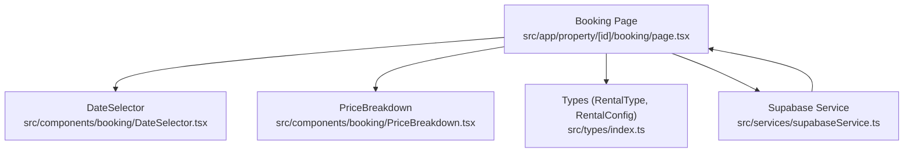
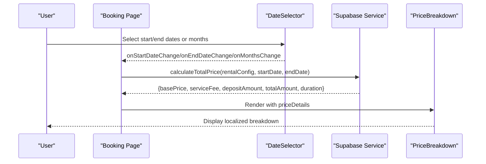
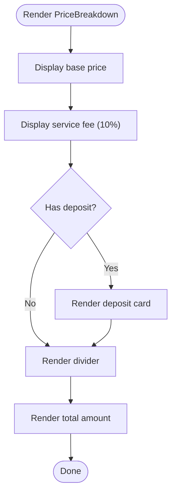
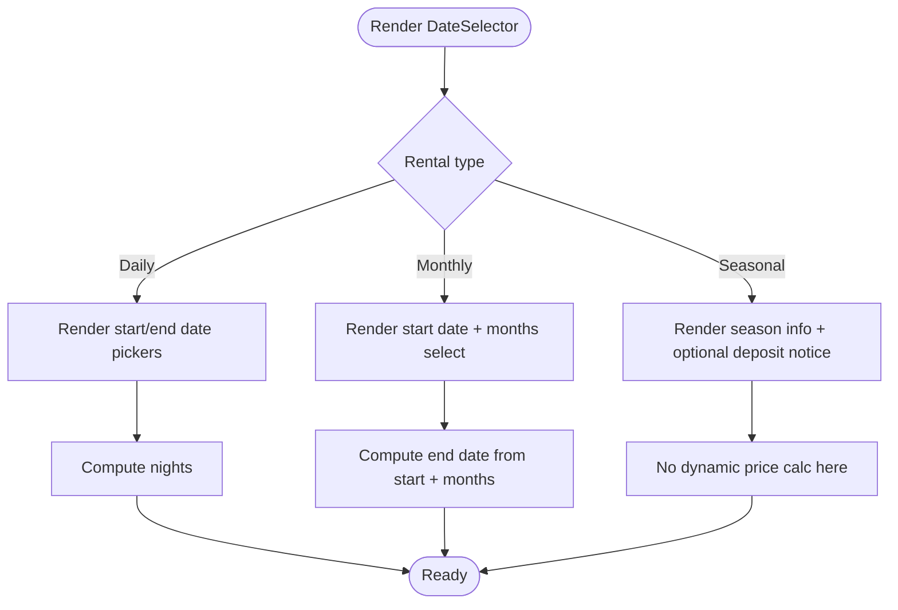
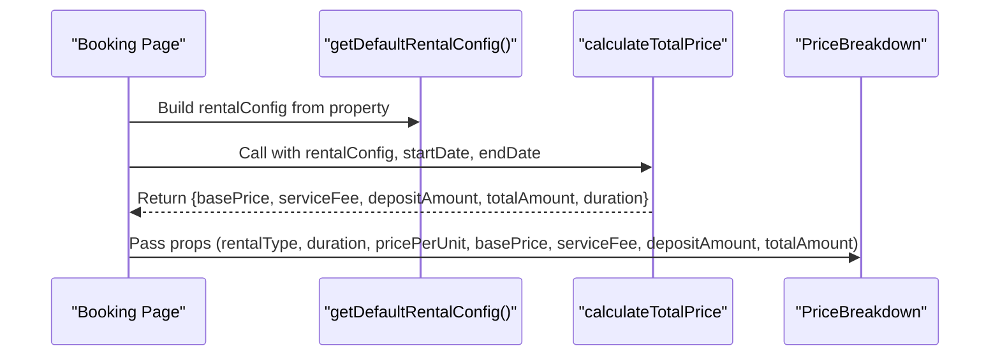
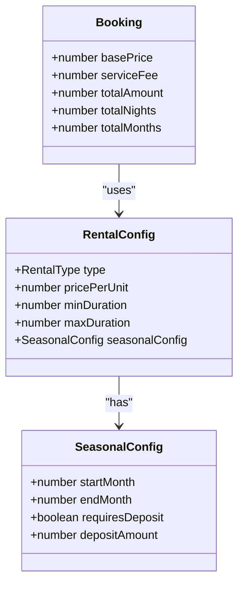
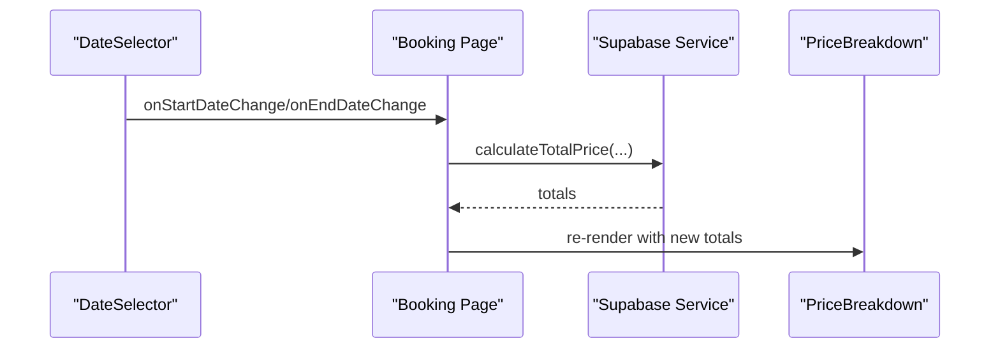
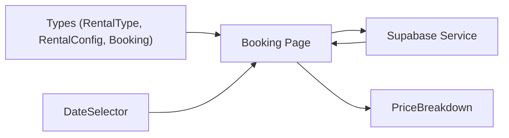

# Price Calculation and Breakdown

<cite>
**Referenced Files in This Document**
- [PriceBreakdown.tsx](file://src/components/booking/PriceBreakdown.tsx)
- [DateSelector.tsx](file://src/components/booking/DateSelector.tsx)
- [booking.page.tsx](file://src/app/property/[id]/booking/page.tsx)
- [index.ts](file://src/types/index.ts)
- [supabaseService.ts](file://src/services/supabaseService.ts)
- [confirmation.page.tsx](file://src/app/property/[id]/booking/confirmation/page.tsx)
</cite>

## Table of Contents
1. [Introduction](#introduction)
2. [Project Structure](#project-structure)
3. [Core Components](#core-components)
4. [Architecture Overview](#architecture-overview)
5. [Detailed Component Analysis](#detailed-component-analysis)
6. [Dependency Analysis](#dependency-analysis)
7. [Performance Considerations](#performance-considerations)
8. [Troubleshooting Guide](#troubleshooting-guide)
9. [Conclusion](#conclusion)

## Introduction
This document explains the price calculation and breakdown system used during property bookings. It covers how base price, service fees, deposits, and total amounts are computed, how rental types (daily, monthly, seasonal) influence pricing, and how the PriceBreakdown component renders real-time cost estimates. It also documents the rental configuration system, minimum/maximum stay requirements, and seasonal adjustments.

## Project Structure
The booking price system spans UI components, types, and a service layer:
- UI components: DateSelector and PriceBreakdown
- Types: RentalType, RentalConfig, and Booking interfaces
- Service layer: Supabase service with calculateTotalPrice
- Page orchestration: Booking page wires up date changes to recalculate prices

**Diagram sources**
- [booking.page.tsx](file://src/app/property/[id]/booking/page.tsx#L15-L551)
- [DateSelector.tsx](file://src/components/booking/DateSelector.tsx#L1-L323)
- [PriceBreakdown.tsx](file://src/components/booking/PriceBreakdown.tsx#L1-L136)
- [index.ts](file://src/types/index.ts#L180-L237)
- [supabaseService.ts](file://src/services/supabaseService.ts#L1-L800)

**Section sources**
- [booking.page.tsx](file://src/app/property/[id]/booking/page.tsx#L15-L551)
- [DateSelector.tsx](file://src/components/booking/DateSelector.tsx#L1-L323)
- [PriceBreakdown.tsx](file://src/components/booking/PriceBreakdown.tsx#L1-L136)
- [index.ts](file://src/types/index.ts#L180-L237)
- [supabaseService.ts](file://src/services/supabaseService.ts#L1-L800)

## Core Components
- PriceBreakdown: Renders the price breakdown with base price, service fee, optional deposit, and total amount. It localizes unit labels per rental type and displays amounts in EGP.
- DateSelector: Manages date selection and duration computation for daily and monthly rentals, and presents seasonal period info.
- Booking Page: Orchestrates rental configuration, computes price via the service layer, and passes results to PriceBreakdown.
- Types: Define RentalType, RentalConfig, and Booking structures used across components and service calculations.
- Supabase Service: Provides calculateTotalPrice and related booking operations.

**Section sources**
- [PriceBreakdown.tsx](file://src/components/booking/PriceBreakdown.tsx#L6-L136)
- [DateSelector.tsx](file://src/components/booking/DateSelector.tsx#L6-L323)
- [booking.page.tsx](file://src/app/property/[id]/booking/page.tsx#L38-L124)
- [index.ts](file://src/types/index.ts#L180-L237)
- [supabaseService.ts](file://src/services/supabaseService.ts#L1-L800)

## Architecture Overview
The booking flow triggers price recalculation whenever dates change. The Booking page reads rental configuration, calls the service to compute totals, and renders the PriceBreakdown with the results.

**Diagram sources**
- [booking.page.tsx](file://src/app/property/[id]/booking/page.tsx#L114-L124)
- [DateSelector.tsx](file://src/components/booking/DateSelector.tsx#L30-L51)
- [supabaseService.ts](file://src/services/supabaseService.ts#L1-L800)
- [PriceBreakdown.tsx](file://src/components/booking/PriceBreakdown.tsx#L16-L30)

## Detailed Component Analysis

### PriceBreakdown Component
- Purpose: Display a localized price breakdown including base price, service fee, optional deposit, and total amount.
- Localization: Unit labels adapt per rental type (night vs. nights, month vs. months, season).
- Optional Deposit: Conditionally renders deposit card for seasonal rentals.

**Diagram sources**
- [PriceBreakdown.tsx](file://src/components/booking/PriceBreakdown.tsx#L16-L88)

**Section sources**
- [PriceBreakdown.tsx](file://src/components/booking/PriceBreakdown.tsx#L16-L136)

### DateSelector Component
- Daily Rentals: Two-date picker; computes night count automatically.
- Monthly Rentals: Start date plus a months selector; end date derived from start date and selected months.
- Seasonal Rentals: Displays academic season info and optional deposit notice.

**Diagram sources**
- [DateSelector.tsx](file://src/components/booking/DateSelector.tsx#L74-L246)

**Section sources**
- [DateSelector.tsx](file://src/components/booking/DateSelector.tsx#L15-L323)

### Booking Page Orchestration
- Loads property and rental configuration.
- On date changes, calls calculateTotalPrice and updates priceDetails.
- Passes priceDetails to PriceBreakdown for rendering.

**Diagram sources**
- [booking.page.tsx](file://src/app/property/[id]/booking/page.tsx#L51-L81)
- [booking.page.tsx](file://src/app/property/[id]/booking/page.tsx#L114-L124)
- [booking.page.tsx](file://src/app/property/[id]/booking/page.tsx#L296-L306)

**Section sources**
- [booking.page.tsx](file://src/app/property/[id]/booking/page.tsx#L51-L124)
- [booking.page.tsx](file://src/app/property/[id]/booking/page.tsx#L296-L306)

### Rental Configuration and Pricing Algorithm
- RentalType: daily, monthly, seasonal.
- RentalConfig: includes type, pricePerUnit, minDuration, maxDuration, and seasonalConfig (startMonth, endMonth, requiresDeposit, depositAmount).
- Price computation is delegated to the service layer; the UI receives precomputed values.

**Diagram sources**
- [index.ts](file://src/types/index.ts#L184-L197)
- [index.ts](file://src/types/index.ts#L200-L236)

**Section sources**
- [index.ts](file://src/types/index.ts#L180-L197)
- [index.ts](file://src/types/index.ts#L200-L236)

### Real-Time Price Updates
- The Booking page listens to startDate and endDate changes.
- On change, it computes totals via the service and updates the PriceBreakdown.

**Diagram sources**
- [booking.page.tsx](file://src/app/property/[id]/booking/page.tsx#L114-L124)
- [DateSelector.tsx](file://src/components/booking/DateSelector.tsx#L30-L51)
- [PriceBreakdown.tsx](file://src/components/booking/PriceBreakdown.tsx#L16-L30)

**Section sources**
- [booking.page.tsx](file://src/app/property/[id]/booking/page.tsx#L114-L124)
- [DateSelector.tsx](file://src/components/booking/DateSelector.tsx#L30-L51)

### Examples and Calculations
Below are example scenarios based on the system’s documented behavior. Replace values with actual property data and dates to compute real totals.

- Daily rental example
  - Dates: check-in 2025-07-01, checkout 2025-07-05
  - Nights: 4
  - Base price: 4 nights × pricePerUnit
  - Service fee: 10% of base price
  - Deposit: not applicable
  - Total: base price + service fee

- Monthly rental example
  - Start date: 2025-09-01, months: 3
  - End date: 2025-11-30
  - Months: 3
  - Base price: 3 months × pricePerUnit
  - Service fee: 10% of base price
  - Deposit: not applicable
  - Total: base price + service fee

- Seasonal rental example
  - Period: September 2025 to June 2026 (10 months)
  - Base price: 10 months × pricePerUnit
  - Service fee: 10% of base price
  - Deposit: depends on seasonalConfig.requiresDeposit; if true, depositAmount equals configured value
  - Total: base price + service fee + deposit (if applicable)

Notes:
- Discounts and taxes are not explicitly defined in the current types or service layer. If needed, extend the service to apply discounts and taxes and propagate results to the UI.

**Section sources**
- [DateSelector.tsx](file://src/components/booking/DateSelector.tsx#L74-L246)
- [booking.page.tsx](file://src/app/property/[id]/booking/page.tsx#L114-L124)
- [index.ts](file://src/types/index.ts#L180-L197)

## Dependency Analysis
- Booking Page depends on:
  - Rental configuration from property data
  - DateSelector for user input
  - Supabase Service for price calculation
  - PriceBreakdown for rendering
- Types define the contract for rental configuration and booking records.

**Diagram sources**
- [index.ts](file://src/types/index.ts#L180-L237)
- [booking.page.tsx](file://src/app/property/[id]/booking/page.tsx#L15-L551)
- [DateSelector.tsx](file://src/components/booking/DateSelector.tsx#L1-L323)
- [PriceBreakdown.tsx](file://src/components/booking/PriceBreakdown.tsx#L1-L136)
- [supabaseService.ts](file://src/services/supabaseService.ts#L1-L800)

**Section sources**
- [index.ts](file://src/types/index.ts#L180-L237)
- [booking.page.tsx](file://src/app/property/[id]/booking/page.tsx#L15-L551)

## Performance Considerations
- Debounce or throttle date changes if the service call becomes expensive.
- Cache rentalConfig when property data is stable to avoid recomputation.
- Keep the service calculation efficient; avoid unnecessary database queries.

## Troubleshooting Guide
- Price not updating after date change:
  - Verify that the Booking page’s effect runs on startDate and endDate changes.
  - Confirm calculateTotalPrice returns all required fields.
- Seasonal deposit not shown:
  - Ensure seasonalConfig.requiresDeposit is true and depositAmount is set.
- Incorrect duration:
  - For daily: confirm night count calculation matches selected dates.
  - For monthly: confirm end date derived from start date and selected months.

**Section sources**
- [booking.page.tsx](file://src/app/property/[id]/booking/page.tsx#L114-L124)
- [DateSelector.tsx](file://src/components/booking/DateSelector.tsx#L40-L51)
- [PriceBreakdown.tsx](file://src/components/booking/PriceBreakdown.tsx#L62-L76)

## Conclusion
The price calculation and breakdown system integrates UI components with a typed configuration model and a service layer to compute and render costs in real time. Rental types drive unit semantics and duration computation, while the service layer supplies base price, service fee, optional deposit, and total amount. Extending the service to support discounts and taxes would complete the system’s financial modeling.