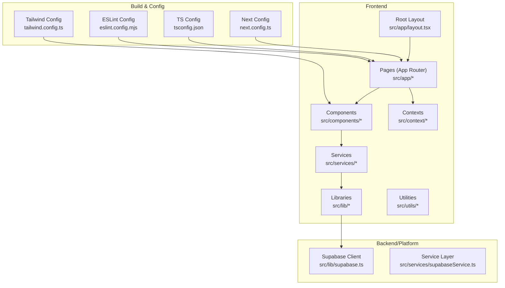
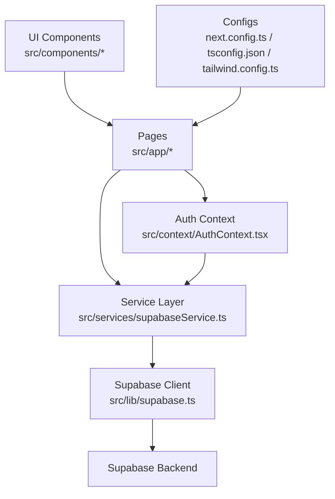
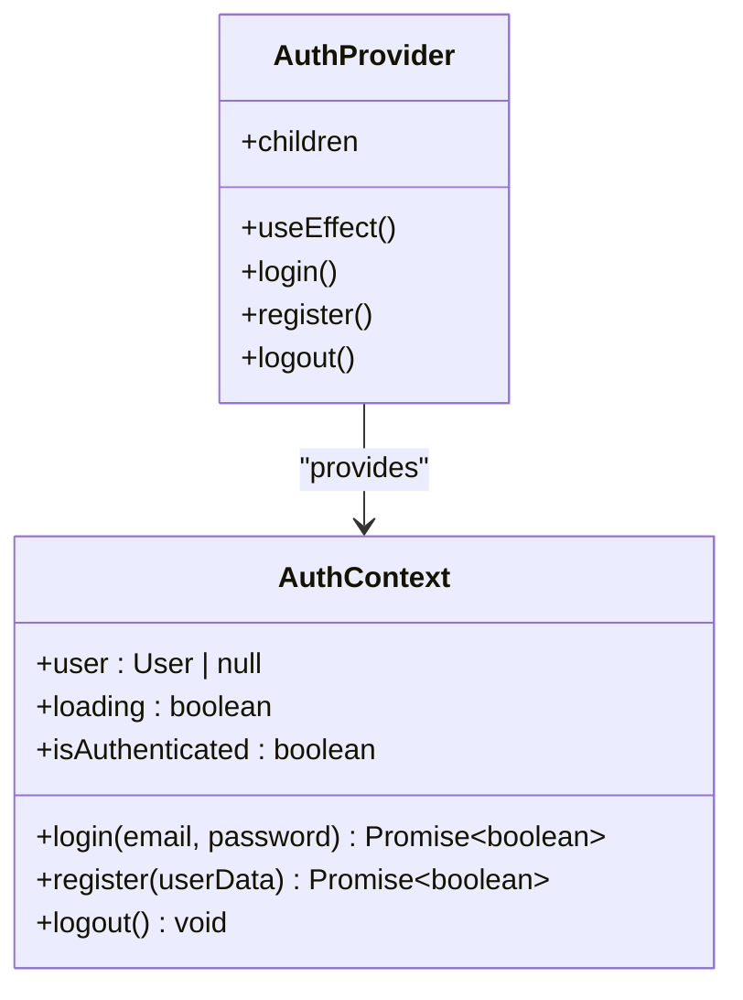
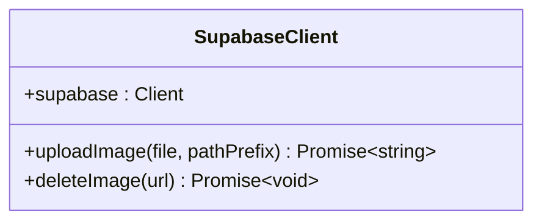
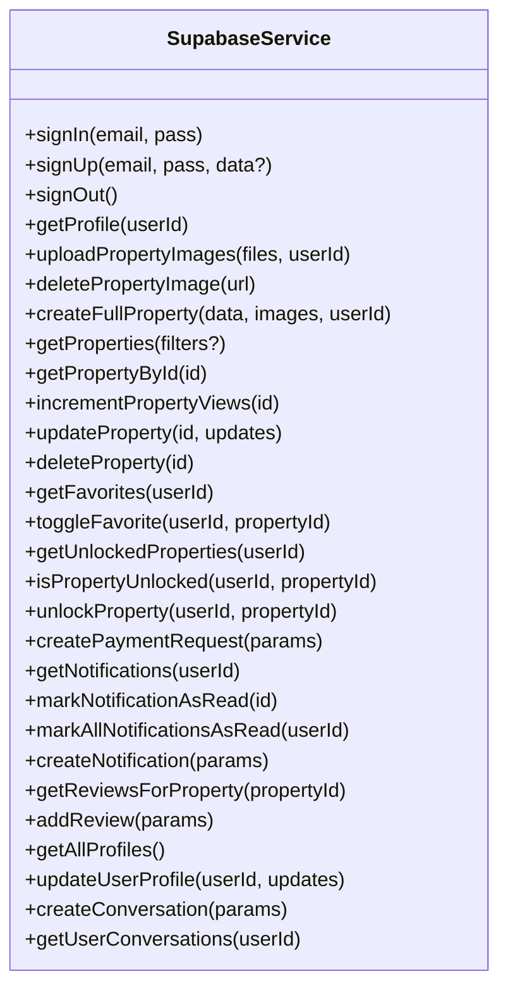
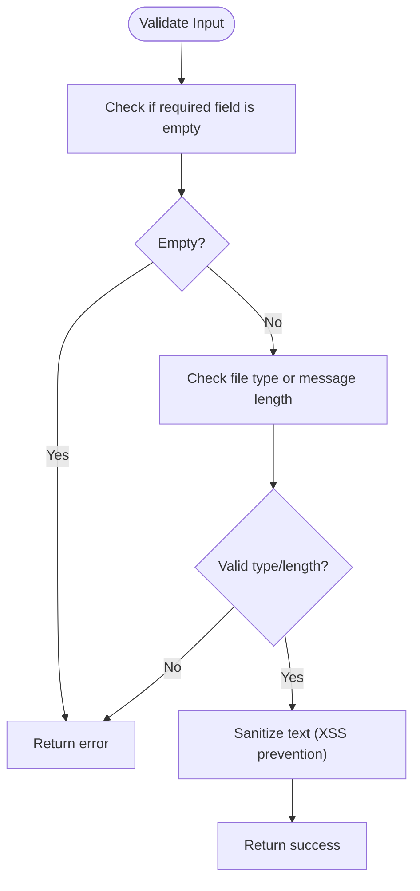
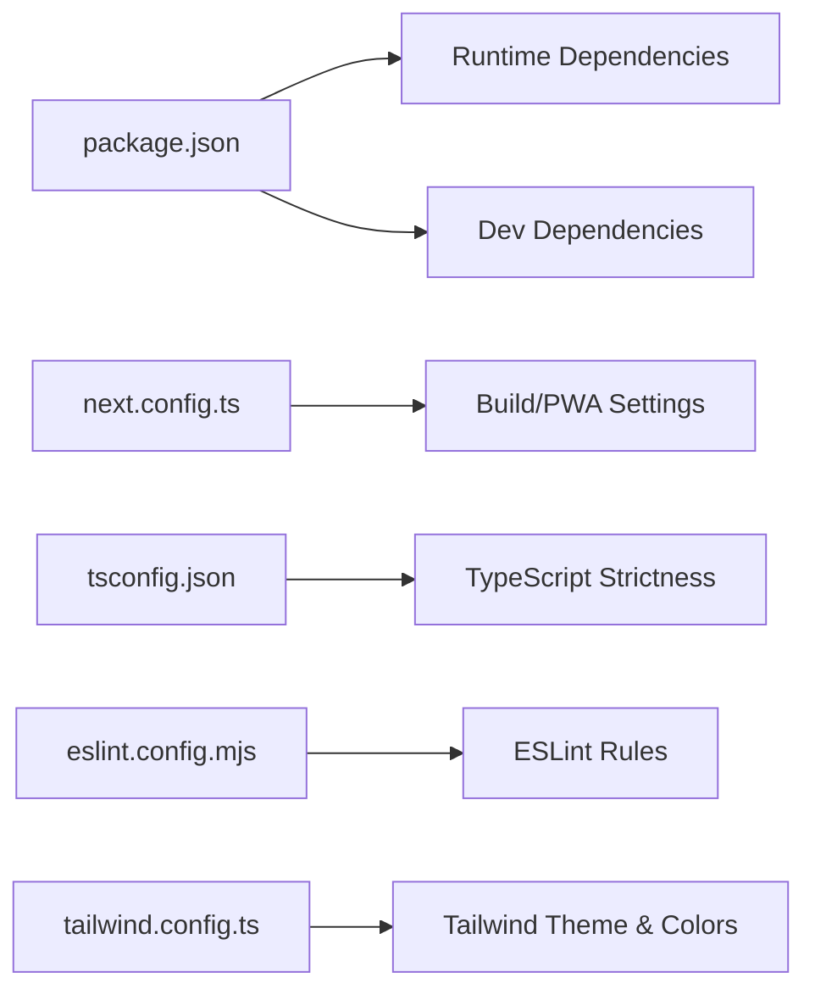

# Contributing Guidelines

<cite>
**Referenced Files in This Document**
- [README.md](file://README.md)
- [package.json](file://package.json)
- [product_specification.md](file://product_specification.md)
- [testsprite_tests/standard_prd.json](file://testsprite_tests/standard_prd.json)
- [testsprite_tests/testsprite_frontend_test_plan.json](file://testsprite_tests/testsprite_frontend_test_plan.json)
- [prepare_test_env.sh](file://prepare_test_env.sh)
- [eslint.config.mjs](file://eslint.config.mjs)
- [tsconfig.json](file://tsconfig.json)
- [next.config.ts](file://next.config.ts)
- [tailwind.config.ts](file://tailwind.config.ts)
- [src/app/layout.tsx](file://src/app/layout.tsx)
- [src/context/AuthContext.tsx](file://src/context/AuthContext.tsx)
- [src/lib/supabase.ts](file://src/lib/supabase.ts)
- [src/services/supabaseService.ts](file://src/services/supabaseService.ts)
- [src/utils/validation.ts](file://src/utils/validation.ts)
</cite>

## Table of Contents
1. [Introduction](#introduction)
2. [Project Structure](#project-structure)
3. [Core Components](#core-components)
4. [Architecture Overview](#architecture-overview)
5. [Detailed Component Analysis](#detailed-component-analysis)
6. [Dependency Analysis](#dependency-analysis)
7. [Development Workflow](#development-workflow)
8. [Code Standards and Conventions](#code-standards-and-conventions)
9. [Pull Request Process](#pull-request-process)
10. [Issue Reporting Procedures](#issue-reporting-procedures)
11. [Testing Requirements and Quality Gates](#testing-requirements-and-quality-gates)
12. [Review Process](#review-process)
13. [Feature Development Guidelines](#feature-development-guidelines)
14. [Bug Fix Guidelines](#bug-fix-guidelines)
15. [Documentation Improvements](#documentation-improvements)
16. [Community Participation](#community-participation)
17. [Examples and Best Practices](#examples-and-best-practices)
18. [Troubleshooting Guide](#troubleshooting-guide)
19. [Conclusion](#conclusion)

## Introduction
Thank you for considering a contribution to Gamasa Properties. This document defines the development workflow, code standards, review process, testing requirements, and collaboration expectations for contributors. It also explains the project’s structure, coding patterns, and architectural principles to help you deliver high-quality changes efficiently.

## Project Structure
Gamasa Properties is a Next.js 16 application using TypeScript, Tailwind CSS, and Supabase for authentication, database, and storage. The repository follows a feature-based structure under src/, with app pages, shared components, services, and utilities.

**Diagram sources**
- [src/app/layout.tsx](file://src/app/layout.tsx#L1-L90)
- [next.config.ts](file://next.config.ts#L1-L31)
- [tsconfig.json](file://tsconfig.json#L1-L43)
- [eslint.config.mjs](file://eslint.config.mjs#L1-L19)
- [tailwind.config.ts](file://tailwind.config.ts#L1-L36)
- [src/lib/supabase.ts](file://src/lib/supabase.ts#L1-L68)
- [src/services/supabaseService.ts](file://src/services/supabaseService.ts#L1-L1384)

**Section sources**
- [README.md](file://README.md#L1-L37)
- [package.json](file://package.json#L1-L42)
- [src/app/layout.tsx](file://src/app/layout.tsx#L1-L90)
- [next.config.ts](file://next.config.ts#L1-L31)
- [tsconfig.json](file://tsconfig.json#L1-L43)
- [eslint.config.mjs](file://eslint.config.mjs#L1-L19)
- [tailwind.config.ts](file://tailwind.config.ts#L1-L36)

## Core Components
- Application shell and metadata: Root layout and providers define the app’s HTML metadata, theme, fonts, and PWA integration.
- Authentication context: Centralized auth state management with mock mode support and localStorage fallback.
- Supabase client: Typed-safe client initialization and helper functions for image storage.
- Service layer: Unified API facade around Supabase with mock mode and comprehensive CRUD operations for properties, users, messaging, notifications, and more.
- Utilities: Validation helpers for messages, files, and basic sanitization.

**Section sources**
- [src/app/layout.tsx](file://src/app/layout.tsx#L1-L90)
- [src/context/AuthContext.tsx](file://src/context/AuthContext.tsx#L1-L195)
- [src/lib/supabase.ts](file://src/lib/supabase.ts#L1-L68)
- [src/services/supabaseService.ts](file://src/services/supabaseService.ts#L1-L1384)
- [src/utils/validation.ts](file://src/utils/validation.ts#L1-L33)

## Architecture Overview
The application follows a layered architecture:
- Presentation layer: Next.js App Router pages and React components.
- Services layer: Business logic and data orchestration via supabaseService.
- Data access: Supabase client and storage.
- Shared utilities: Validation and configuration.

**Diagram sources**
- [src/services/supabaseService.ts](file://src/services/supabaseService.ts#L1-L1384)
- [src/lib/supabase.ts](file://src/lib/supabase.ts#L1-L68)
- [src/context/AuthContext.tsx](file://src/context/AuthContext.tsx#L1-L195)
- [next.config.ts](file://next.config.ts#L1-L31)
- [tsconfig.json](file://tsconfig.json#L1-L43)
- [tailwind.config.ts](file://tailwind.config.ts#L1-L36)

## Detailed Component Analysis

### Authentication Context
The AuthContext manages user state, login/logout, and synchronization across tabs. It supports a mock mode flag and integrates with localStorage for offline-friendly development.

**Diagram sources**
- [src/context/AuthContext.tsx](file://src/context/AuthContext.tsx#L1-L195)

**Section sources**
- [src/context/AuthContext.tsx](file://src/context/AuthContext.tsx#L1-L195)

### Supabase Client and Storage Helpers
The Supabase client is initialized with environment variables and includes helpers for image upload and deletion.

**Diagram sources**
- [src/lib/supabase.ts](file://src/lib/supabase.ts#L1-L68)

**Section sources**
- [src/lib/supabase.ts](file://src/lib/supabase.ts#L1-L68)

### Service Layer (supabaseService)
The service layer encapsulates all backend interactions behind a single facade. It supports mock mode for rapid iteration and provides CRUD operations for properties, favorites, unlocked properties, notifications, reviews, messaging, and admin functions.

**Diagram sources**
- [src/services/supabaseService.ts](file://src/services/supabaseService.ts#L1-L1384)

**Section sources**
- [src/services/supabaseService.ts](file://src/services/supabaseService.ts#L1-L1384)

### Validation Utilities
Validation utilities ensure safe and consistent data handling for messages and media uploads.

**Diagram sources**
- [src/utils/validation.ts](file://src/utils/validation.ts#L1-L33)

**Section sources**
- [src/utils/validation.ts](file://src/utils/validation.ts#L1-L33)

## Dependency Analysis
- Runtime dependencies include Next.js, React, Tailwind CSS, Supabase SDK, and Leaflet for maps.
- Development dependencies include ESLint, TypeScript, PostCSS, and Tailwind CSS tooling.
- Build configuration enables PWA, strict TS checks, and Tailwind scanning across app, components, and pages.

**Diagram sources**
- [package.json](file://package.json#L1-L42)
- [next.config.ts](file://next.config.ts#L1-L31)
- [tsconfig.json](file://tsconfig.json#L1-L43)
- [eslint.config.mjs](file://eslint.config.mjs#L1-L19)
- [tailwind.config.ts](file://tailwind.config.ts#L1-L36)

**Section sources**
- [package.json](file://package.json#L1-L42)
- [next.config.ts](file://next.config.ts#L1-L31)
- [tsconfig.json](file://tsconfig.json#L1-L43)
- [eslint.config.mjs](file://eslint.config.mjs#L1-L19)
- [tailwind.config.ts](file://tailwind.config.ts#L1-L36)

## Development Workflow
- Local setup: Install dependencies and run the development server using the supported package managers.
- Environment: Configure environment variables for Supabase (URL and anonymous key) via .env.local.
- PWA: The app is configured as a PWA with automatic registration and production builds.
- Testing environment: A script is provided to prepare a production-like environment for automated tests.

Recommended steps:
1. Fork and clone the repository.
2. Install dependencies.
3. Copy .env.local.example to .env.local and fill in Supabase credentials.
4. Run npm run dev and verify the app starts on http://localhost:3000.
5. Prepare a test environment using the provided script for end-to-end or visual regression testing.

**Section sources**
- [README.md](file://README.md#L1-L37)
- [prepare_test_env.sh](file://prepare_test_env.sh#L1-L36)
- [next.config.ts](file://next.config.ts#L1-L31)

## Code Standards and Conventions
- Language and typing: TypeScript strict mode enabled; all components and services use TypeScript.
- Linting: ESLint with Next.js recommended rules; overrides exclude build artifacts.
- Styling: Tailwind CSS with a semantic color system and plugin for forms.
- Routing: Next.js App Router pages under src/app/.
- Paths: Path aliases (@/*) configured to map to src/.
- Internationalization: Arabic RTL layout with Google Fonts for Arabic and Inter for Latin.

**Section sources**
- [tsconfig.json](file://tsconfig.json#L1-L43)
- [eslint.config.mjs](file://eslint.config.mjs#L1-L19)
- [tailwind.config.ts](file://tailwind.config.ts#L1-L36)
- [src/app/layout.tsx](file://src/app/layout.tsx#L1-L90)
- [next.config.ts](file://next.config.ts#L1-L31)

## Pull Request Process
Before opening a pull request:
- Ensure your branch is up to date with the base branch.
- Run linting and build locally to confirm no errors.
- Add or update tests aligned with the test plan and PRD.
- Describe the change, its motivation, and any migration notes.
- Reference related issues and include screenshots or videos for UI changes.

Review checklist:
- Code clarity, adherence to standards, and maintainability.
- Tests coverage and passing status.
- No breaking changes to APIs or UI.
- Accessibility and internationalization considerations.
- Security and data validation.

Quality gates:
- All CI checks must pass.
- At least one maintainer approval.
- No failing tests or lint errors.

## Issue Reporting Procedures
When filing an issue:
- Use the appropriate template (Bug Report, Feature Request, Documentation).
- Provide a clear title and description.
- Include steps to reproduce (for bugs), expected vs. actual behavior, and environment details.
- Attach screenshots or screen recordings when relevant.
- Label the issue appropriately.

For bugs:
- Reproduce with the latest code.
- Verify if the issue exists in mock mode or requires Supabase backend.

For features:
- Reference the product specification and test plan.
- Propose acceptance criteria aligned with the test plan.

**Section sources**
- [product_specification.md](file://product_specification.md#L1-L44)
- [testsprite_tests/standard_prd.json](file://testsprite_tests/standard_prd.json#L1-L159)
- [testsprite_tests/testsprite_frontend_test_plan.json](file://testsprite_tests/testsprite_frontend_test_plan.json#L1-L513)

## Testing Requirements and Quality Gates
Automated tests:
- Frontend test plan covers functional scenarios for homepage, search, map, auth, profile, property management, favorites, messaging, notifications, bookings, admin dashboard, and property details.
- The test plan includes assertions and steps for performance and correctness.

Test environment:
- A script prepares a production-like server for automated testing, ensuring reliable test runs.

Quality gates:
- All tests must pass in CI.
- Coverage thresholds should be met for critical modules (auth, property CRUD, messaging).
- No regressions introduced compared to the baseline test plan.

**Section sources**
- [testsprite_tests/testsprite_frontend_test_plan.json](file://testsprite_tests/testsprite_frontend_test_plan.json#L1-L513)
- [testsprite_tests/standard_prd.json](file://testsprite_tests/standard_prd.json#L1-L159)
- [prepare_test_env.sh](file://prepare_test_env.sh#L1-L36)

## Review Process
Review stages:
1. Self-review: Ensure code meets standards, passes linting and tests.
2. Automated checks: CI runs lint, build, and tests.
3. Peer review: Collaborators review for correctness, performance, security, and maintainability.
4. Approval: Maintainers approve before merging.

Review criteria:
- Correctness and completeness against acceptance criteria.
- Code style and readability.
- Performance impact and scalability.
- Security hygiene (input validation, secrets, CORS).
- Accessibility and internationalization.

## Feature Development Guidelines
- Align with the product specification and test plan.
- Implement new pages under src/app/ and reusable components under src/components/.
- Use the service layer for data access; avoid direct Supabase calls outside services.
- Add or update tests in the test plan to cover new functionality.
- Keep UI consistent with Tailwind theme and RTL layout.

## Bug Fix Guidelines
- Reproduce the issue in both mock and Supabase modes.
- Isolate the problem to a specific module (service, component, utility).
- Write a test case that fails before the fix and passes after.
- Provide minimal, focused changes and include rationale in the PR description.

## Documentation Improvements
- Update README for setup and usage changes.
- Enhance inline comments for complex logic.
- Improve product specification and test plan for new features.
- Keep changelog entries for user-visible changes.

## Community Participation
- Be respectful and inclusive in discussions.
- Help triage issues and review pull requests.
- Share knowledge via documentation and mentoring.
- Participate in planning sessions and retrospectives.

## Examples and Best Practices
- Example: Adding a new property filter
  - Extend the service method to accept new filters.
  - Update the UI to expose the filter and wire it to the service.
  - Add a test case to the test plan covering the new filter.
- Example: Enhancing validation
  - Add or refine validators in src/utils/validation.ts.
  - Apply validation in forms and services.
  - Update tests to assert validation behavior.

## Troubleshooting Guide
Common issues and resolutions:
- Supabase environment variables missing
  - Ensure NEXT_PUBLIC_SUPABASE_URL and NEXT_PUBLIC_SUPABASE_ANON_KEY are set in .env.local.
  - The client logs warnings and falls back to placeholders during development.
- Port conflicts during test environment setup
  - Use the provided script to clean up port 3000 and start a production server for tests.
- PWA not registering
  - Confirm NODE_ENV is production or adjust PWA configuration in next.config.ts.
- Tailwind classes not applying
  - Verify content paths in tailwind.config.ts include your components and pages.

**Section sources**
- [src/lib/supabase.ts](file://src/lib/supabase.ts#L1-L68)
- [prepare_test_env.sh](file://prepare_test_env.sh#L1-L36)
- [next.config.ts](file://next.config.ts#L1-L31)
- [tailwind.config.ts](file://tailwind.config.ts#L1-L36)

## Conclusion
By following these guidelines, contributors can collaborate effectively, maintain high code quality, and deliver features that align with the product vision. Thank you for helping improve Gamasa Properties!