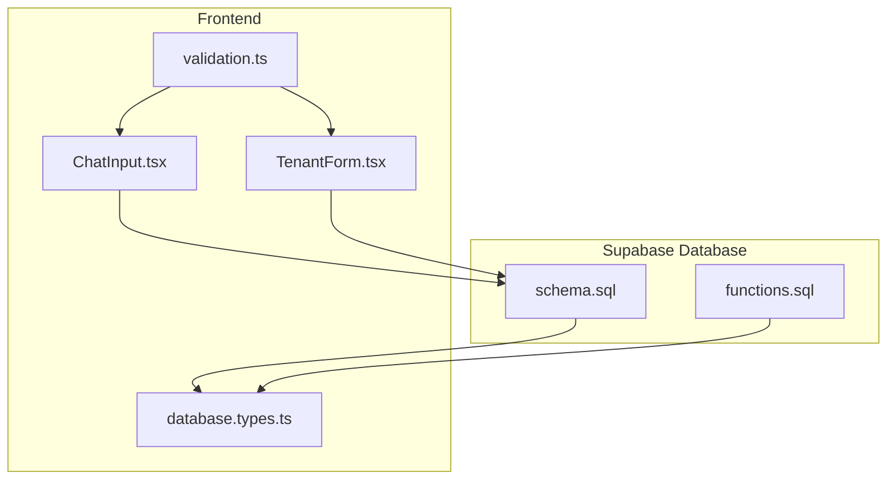
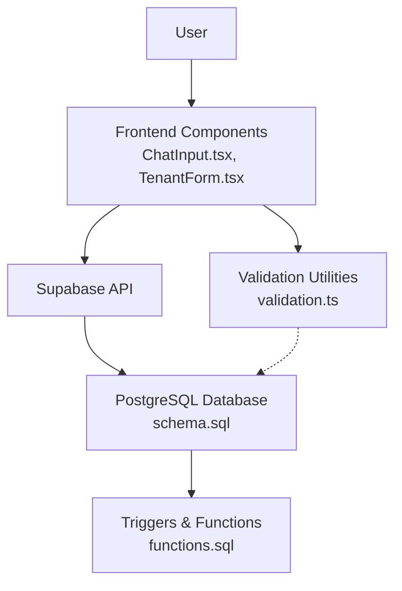
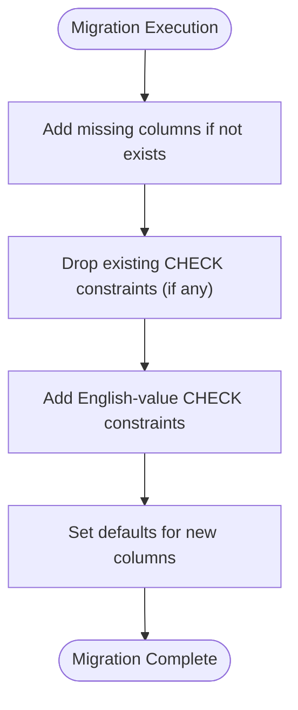
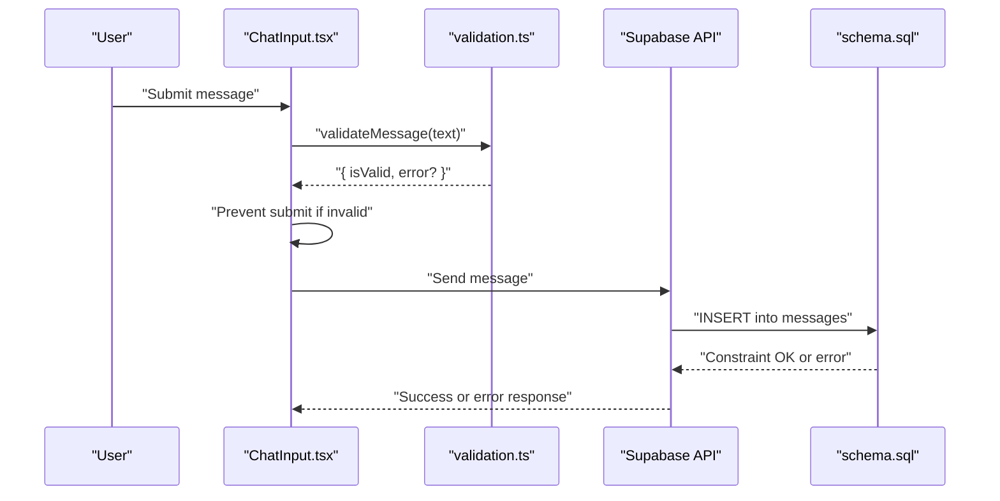
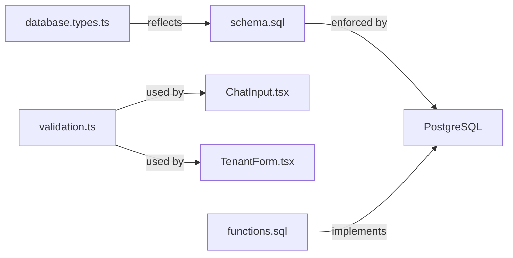

# Constraints and Validation Rules

<cite>
**Referenced Files in This Document**
- [schema.sql](file://supabase/schema.sql)
- [database.types.ts](file://src/types/database.types.ts)
- [validation.ts](file://src/utils/validation.ts)
- [ChatInput.tsx](file://src/components/chat/ChatInput.tsx)
- [TenantForm.tsx](file://src/components/booking/TenantForm.tsx)
- [migrations.md](file://.agent/skills/database-design/migrations.md)
- [schema-design.md](file://.agent/skills/database-design/schema-design.md)
</cite>

## Table of Contents
1. [Introduction](#introduction)
2. [Project Structure](#project-structure)
3. [Core Components](#core-components)
4. [Architecture Overview](#architecture-overview)
5. [Detailed Component Analysis](#detailed-component-analysis)
6. [Dependency Analysis](#dependency-analysis)
7. [Performance Considerations](#performance-considerations)
8. [Troubleshooting Guide](#troubleshooting-guide)
9. [Conclusion](#conclusion)

## Introduction
This document details the database constraints and validation rules implemented in Gamasa Properties. It covers:
- CHECK constraints for enumerated fields (role, price_unit, category, status, payment_method, notification_type)
- UNIQUE constraints preventing duplicate relationships
- FOREIGN KEY constraints ensuring referential integrity
- Numeric range validations (rating)
- String format validations and business logic constraints
- Dynamic constraint updates performed during schema migrations
- Examples of constraint violations and prevention via application logic

## Project Structure
The database schema is defined in Supabase SQL and mirrored in TypeScript types for frontend safety. Validation logic exists in both the database (CHECK constraints and triggers) and the frontend (utility functions and form components).

**Diagram sources**
- [schema.sql](file://supabase/schema.sql#L1-L416)
- [functions.sql](file://supabase/functions.sql#L1-L71)
- [database.types.ts](file://src/types/database.types.ts#L1-L310)
- [validation.ts](file://src/utils/validation.ts#L1-L33)
- [ChatInput.tsx](file://src/components/chat/ChatInput.tsx#L1-L297)
- [TenantForm.tsx](file://src/components/booking/TenantForm.tsx#L1-L136)

**Section sources**
- [schema.sql](file://supabase/schema.sql#L1-L416)
- [database.types.ts](file://src/types/database.types.ts#L1-L310)

## Core Components
- Enumerated fields with CHECK constraints:
  - profiles.role accepts tenant, landlord, admin
  - properties.price_unit accepts day, week, month, season
  - properties.category accepts apartment, room, studio, villa, chalet
  - properties.status accepts pending, available, rented, rejected
  - bookings.status accepts pending, confirmed, cancelled, completed
  - payment_requests.payment_method accepts vodafone_cash, instapay, fawry
  - payment_requests.status accepts pending, approved, rejected
  - notifications.type accepts success, info, warning, error
- Numeric range validation:
  - reviews.rating validated to be between 1 and 5 inclusive
- String format and business logic validations:
  - Frontend phone pattern validation for tenants
  - Message length and file type/size limits for chat
- UNIQUE constraints:
  - reviews: (property_id, user_id) prevents duplicate reviews per user per property
  - conversations: (property_id, buyer_id, owner_id) ensures a single conversation per property and pair
- FOREIGN KEY constraints:
  - profiles(id) PK linked to auth.users(id) with ON DELETE CASCADE
  - properties(owner_id) FK to profiles(id) with ON DELETE CASCADE
  - bookings(property_id, guest_id) FKs to properties(id), profiles(id) with ON DELETE CASCADE
  - payment_requests(user_id, property_id) FKs to profiles(id), properties(id) with ON DELETE CASCADE
  - reviews(property_id, user_id) FKs to properties(id), profiles(id) with ON DELETE CASCADE
  - notifications(user_id) FK to profiles(id) with ON DELETE CASCADE
  - favorites(user_id, property_id) FKs to profiles(id), properties(id) with ON DELETE CASCADE
  - unlocked_properties(user_id, property_id) FKs to profiles(id), properties(id) with ON DELETE CASCADE
  - conversations(property_id, buyer_id, owner_id) FKs to properties(id), profiles(id) with ON DELETE SET NULL/CASCADE as appropriate
  - messages(conversation_id, sender_id) FKs to conversations(id), profiles(id) with ON DELETE CASCADE/SET NULL as appropriate

**Section sources**
- [schema.sql](file://supabase/schema.sql#L8-L19)
- [schema.sql](file://supabase/schema.sql#L42-L67)
- [schema.sql](file://supabase/schema.sql#L94-L104)
- [schema.sql](file://supabase/schema.sql#L116-L128)
- [schema.sql](file://supabase/schema.sql#L130-L139)
- [schema.sql](file://supabase/schema.sql#L141-L151)
- [schema.sql](file://supabase/schema.sql#L153-L167)
- [schema.sql](file://supabase/schema.sql#L338-L360)
- [schema.sql](file://supabase/schema.sql#L135-L135)
- [schema.sql](file://supabase/schema.sql#L346-L346)

## Architecture Overview
The system enforces data integrity at three layers:
- Database level: CHECK constraints, UNIQUE constraints, and FK constraints
- Row Level Security (RLS) policies: application-side authorization gates
- Application level: frontend validation and sanitization

**Diagram sources**
- [schema.sql](file://supabase/schema.sql#L1-L416)
- [functions.sql](file://supabase/functions.sql#L1-L71)
- [validation.ts](file://src/utils/validation.ts#L1-L33)
- [ChatInput.tsx](file://src/components/chat/ChatInput.tsx#L1-L297)
- [TenantForm.tsx](file://src/components/booking/TenantForm.tsx#L1-L136)

## Detailed Component Analysis

### Enumerated Fields and CHECK Constraints
- profiles.role
  - Allowed values: tenant, landlord, admin
  - Purpose: role-based access and permissions
  - Violation example: inserting role with an unsupported string
  - Prevention: enforce in frontend and backend; database rejects unsupported values
- properties.price_unit
  - Allowed values: day, week, month, season
  - Purpose: standardize pricing periods
  - Violation example: setting price_unit to an unsupported period
  - Prevention: validate on input; dynamic migration ensures English values
- properties.category
  - Allowed values: apartment, room, studio, villa, chalet
  - Purpose: categorize property types
  - Violation example: assigning category outside the enumerated set
  - Prevention: frontend selection and backend enforcement
- properties.status
  - Allowed values: pending, available, rented, rejected
  - Purpose: lifecycle state of listings
  - Violation example: status not in the allowed set
  - Prevention: controlled transitions and validation
- bookings.status
  - Allowed values: pending, confirmed, cancelled, completed
  - Purpose: booking lifecycle
  - Violation example: invalid status value
  - Prevention: application logic and database constraint
- payment_requests.payment_method
  - Allowed values: vodafone_cash, instapay, fawry
  - Purpose: supported payment channels
  - Violation example: unsupported method
  - Prevention: selection list and backend constraint
- payment_requests.status
  - Allowed values: pending, approved, rejected
  - Purpose: payment request state
  - Violation example: invalid status
  - Prevention: controlled state machine
- notifications.type
  - Allowed values: success, info, warning, error
  - Purpose: notification categorization
  - Violation example: type outside allowed set
  - Prevention: selection and constraint

Dynamic constraint updates during migrations:
- The schema includes DO blocks that add missing columns and recreate CHECK constraints with English values to align with application logic.
- These migrations ensure backward compatibility and consistent enforcement across environments.

**Section sources**
- [schema.sql](file://supabase/schema.sql#L13-L14)
- [schema.sql](file://supabase/schema.sql#L47-L49)
- [schema.sql](file://supabase/schema.sql#L80-L89)
- [schema.sql](file://supabase/schema.sql#L101-L101)
- [schema.sql](file://supabase/schema.sql#L121-L121)
- [schema.sql](file://supabase/schema.sql#L123-L123)
- [schema.sql](file://supabase/schema.sql#L146-L146)
- [schema.sql](file://supabase/schema.sql#L21-L39)
- [schema.sql](file://supabase/schema.sql#L69-L92)

### Numeric Range Validation (Rating)
- reviews.rating
  - Constraint: rating >= 1 AND rating <= 5
  - Purpose: standardized star rating
  - Violation example: rating below 1 or above 5
  - Prevention: frontend slider/range input and backend constraint

**Section sources**
- [schema.sql](file://supabase/schema.sql#L134-L135)

### String Formats and Business Logic Constraints
- Phone format (Tenants)
  - Pattern: Egyptian mobile format starting with 01 followed by 9 digits
  - Purpose: ensure valid contact numbers
  - Violation example: missing country code or wrong length
  - Prevention: HTML pattern attribute and backend validation
- Message length (Chat)
  - Max length: 5000 characters
  - Purpose: prevent oversized messages
  - Violation example: message exceeding 5000 characters
  - Prevention: frontend validation before sending
- File uploads (Chat)
  - Image: allowed types (JPEG, PNG, WEBP, JPG); max size 5 MB
  - Voice: allowed audio/* types; max size 10 MB
  - Purpose: enforce acceptable media sizes and types
  - Violation example: unsupported type or oversized file
  - Prevention: frontend validation and upload guardrails

**Section sources**
- [TenantForm.tsx](file://src/components/booking/TenantForm.tsx#L55-L56)
- [validation.ts](file://src/utils/validation.ts#L1-L5)
- [validation.ts](file://src/utils/validation.ts#L7-L27)
- [ChatInput.tsx](file://src/components/chat/ChatInput.tsx#L124-L136)
- [ChatInput.tsx](file://src/components/chat/ChatInput.tsx#L150-L160)

### UNIQUE Constraints for Duplicate Prevention
- reviews: (property_id, user_id)
  - Purpose: prevent a user from submitting multiple reviews for the same property
  - Violation example: duplicate review submission
  - Prevention: application logic checks before insert; database enforces uniqueness
- conversations: (property_id, buyer_id, owner_id)
  - Purpose: ensure a single conversation exists per property and user pair
  - Violation example: attempting to create duplicate conversation
  - Prevention: application checks; database enforces uniqueness

**Section sources**
- [schema.sql](file://supabase/schema.sql#L137-L139)
- [schema.sql](file://supabase/schema.sql#L346-L348)

### FOREIGN KEY Constraints and Referential Integrity
- profiles(id) PK references auth.users(id) ON DELETE CASCADE
- properties(owner_id) FK to profiles(id) ON DELETE CASCADE
- bookings(property_id, guest_id) FKs to properties(id), profiles(id) ON DELETE CASCADE
- payment_requests(user_id, property_id) FKs to profiles(id), properties(id) ON DELETE CASCADE
- reviews(property_id, user_id) FKs to properties(id), profiles(id) ON DELETE CASCADE
- notifications(user_id) FK to profiles(id) ON DELETE CASCADE
- favorites(user_id, property_id) FKs to profiles(id), properties(id) ON DELETE CASCADE
- unlocked_properties(user_id, property_id) FKs to profiles(id), properties(id) ON DELETE CASCADE
- conversations(property_id, buyer_id, owner_id) FKs to properties(id), profiles(id) ON DELETE SET NULL/CASCADE
- messages(conversation_id, sender_id) FKs to conversations(id), profiles(id) ON DELETE CASCADE/SET NULL

These constraints ensure that related records remain consistent and that deletion cascades appropriately according to business rules.

**Section sources**
- [schema.sql](file://supabase/schema.sql#L8-L19)
- [schema.sql](file://supabase/schema.sql#L42-L67)
- [schema.sql](file://supabase/schema.sql#L94-L104)
- [schema.sql](file://supabase/schema.sql#L116-L128)
- [schema.sql](file://supabase/schema.sql#L130-L139)
- [schema.sql](file://supabase/schema.sql#L141-L151)
- [schema.sql](file://supabase/schema.sql#L153-L167)
- [schema.sql](file://supabase/schema.sql#L338-L360)

### Dynamic Constraint Updates During Migrations
- DO blocks add missing columns and recreate CHECK constraints with English values to match application expectations.
- These migrations are designed to be safe and idempotent, avoiding downtime by adding nullable columns first, backfilling defaults, then enforcing NOT NULL and CHECK constraints.

**Diagram sources**
- [schema.sql](file://supabase/schema.sql#L21-L39)
- [schema.sql](file://supabase/schema.sql#L69-L92)

**Section sources**
- [schema.sql](file://supabase/schema.sql#L21-L39)
- [schema.sql](file://supabase/schema.sql#L69-L92)
- [migrations.md](file://.agent/skills/database-design/migrations.md#L7-L21)

### Validation Sequence: Chat Message Submission

**Diagram sources**
- [ChatInput.tsx](file://src/components/chat/ChatInput.tsx#L124-L136)
- [validation.ts](file://src/utils/validation.ts#L1-L5)
- [schema.sql](file://supabase/schema.sql#L353-L360)

## Dependency Analysis
- Frontend types reflect database constraints for compile-time safety.
- Validation utilities are consumed by UI components to prevent invalid submissions.
- Database triggers and policies complement constraints to maintain data integrity and access control.

**Diagram sources**
- [database.types.ts](file://src/types/database.types.ts#L1-L310)
- [schema.sql](file://supabase/schema.sql#L1-L416)
- [functions.sql](file://supabase/functions.sql#L1-L71)
- [validation.ts](file://src/utils/validation.ts#L1-L33)
- [ChatInput.tsx](file://src/components/chat/ChatInput.tsx#L1-L297)
- [TenantForm.tsx](file://src/components/booking/TenantForm.tsx#L1-L136)

**Section sources**
- [database.types.ts](file://src/types/database.types.ts#L1-L310)
- [schema.sql](file://supabase/schema.sql#L1-L416)
- [functions.sql](file://supabase/functions.sql#L1-L71)
- [validation.ts](file://src/utils/validation.ts#L1-L33)
- [ChatInput.tsx](file://src/components/chat/ChatInput.tsx#L1-L297)
- [TenantForm.tsx](file://src/components/booking/TenantForm.tsx#L1-L136)

## Performance Considerations
- CHECK constraints are evaluated at write time; keep expressions simple for minimal overhead.
- UNIQUE constraints require index maintenance; ensure appropriate indexing for high-write tables like messages and reviews.
- Use serverless-safe migration practices (e.g., CREATE INDEX CONCURRENTLY) to avoid blocking writes.

[No sources needed since this section provides general guidance]

## Troubleshooting Guide
Common constraint violation scenarios and prevention strategies:
- Invalid enumerated value
  - Symptom: INSERT/UPDATE rejected with constraint error
  - Prevention: Validate against allowed values in frontend and backend; ensure migrations applied
- Rating out of range
  - Symptom: INSERT fails for reviews.rating
  - Prevention: Clamp or restrict input to 1–5
- Duplicate relationship
  - Symptom: UNIQUE violation for reviews or conversations
  - Prevention: Check existence before insert; surface user-friendly error
- Unsupported file type/size
  - Symptom: Upload blocked or rejected
  - Prevention: Validate file type and size before upload; show clear error messages
- Phone format mismatch
  - Symptom: Form submission blocked
  - Prevention: Enforce pattern and sanitization; provide helpful hints

**Section sources**
- [schema.sql](file://supabase/schema.sql#L134-L135)
- [schema.sql](file://supabase/schema.sql#L137-L139)
- [schema.sql](file://supabase/schema.sql#L346-L348)
- [validation.ts](file://src/utils/validation.ts#L1-L5)
- [validation.ts](file://src/utils/validation.ts#L7-L27)
- [TenantForm.tsx](file://src/components/booking/TenantForm.tsx#L55-L56)

## Conclusion
Gamasa Properties enforces robust data integrity through a layered approach:
- Database-level CHECK, UNIQUE, and FK constraints
- Row Level Security policies for authorization
- Frontend validation and sanitization for user experience and safety
- Safe, idempotent migrations to evolve constraints without downtime

This combination ensures reliable, consistent, and secure operation across the platform.