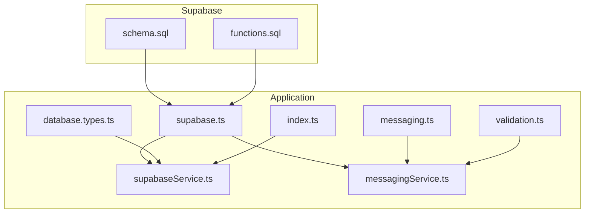
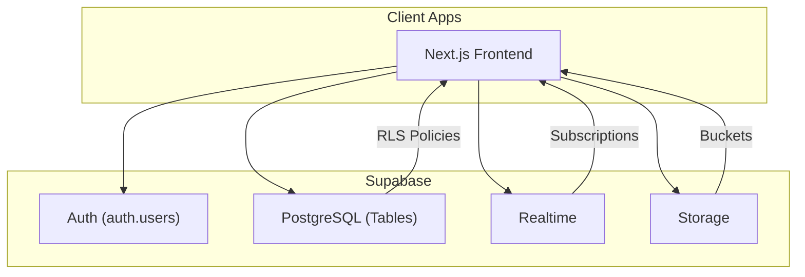
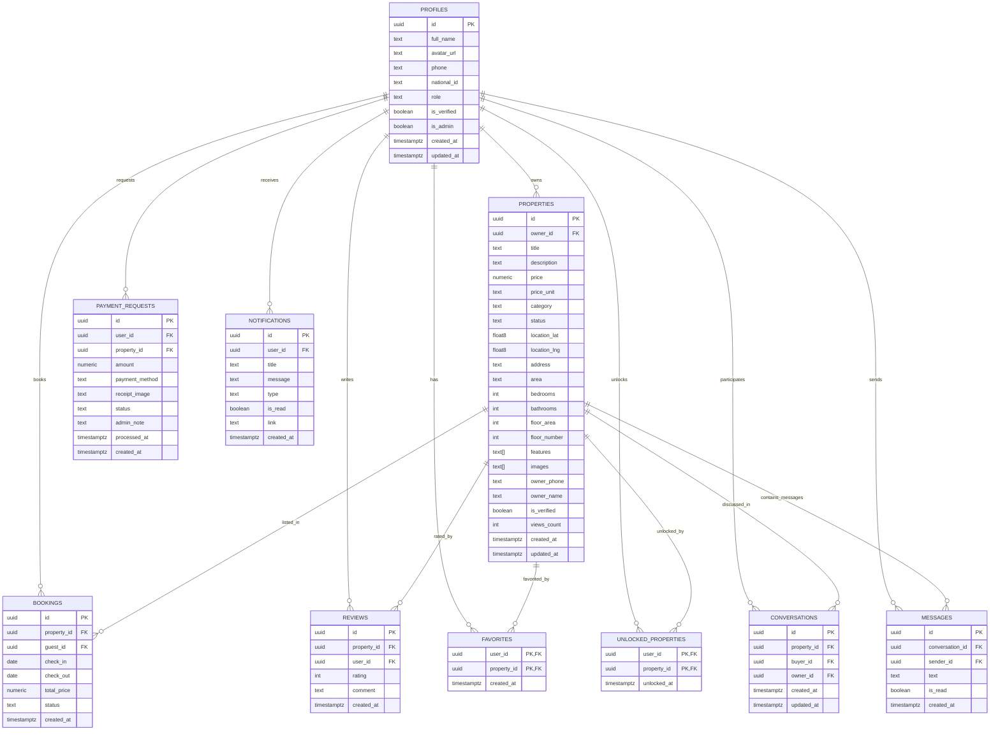
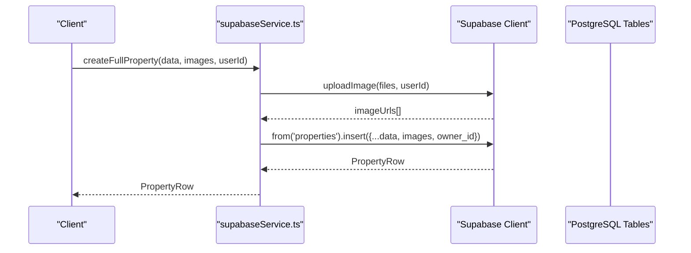
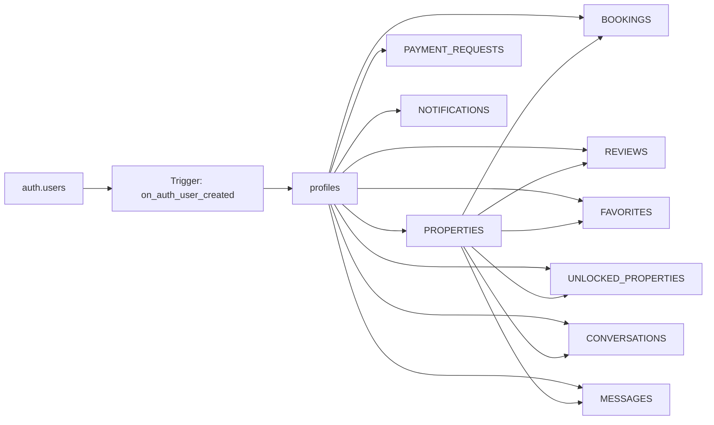

# Database Schema and Data Model

<cite>
**Referenced Files in This Document**
- [schema.sql](file://supabase/schema.sql)
- [functions.sql](file://supabase/functions.sql)
- [database.types.ts](file://src/types/database.types.ts)
- [supabase.ts](file://src/lib/supabase.ts)
- [supabaseService.ts](file://src/services/supabaseService.ts)
- [messagingService.ts](file://src/services/messagingService.ts)
- [messaging.ts](file://src/types/messaging.ts)
- [validation.ts](file://src/utils/validation.ts)
- [index.ts](file://src/types/index.ts)
</cite>

## Table of Contents
1. [Introduction](#introduction)
2. [Project Structure](#project-structure)
3. [Core Components](#core-components)
4. [Architecture Overview](#architecture-overview)
5. [Detailed Component Analysis](#detailed-component-analysis)
6. [Dependency Analysis](#dependency-analysis)
7. [Performance Considerations](#performance-considerations)
8. [Troubleshooting Guide](#troubleshooting-guide)
9. [Conclusion](#conclusion)
10. [Appendices](#appendices)

## Introduction
This document provides comprehensive database schema documentation for Gamasa Properties, focusing on the Supabase-backed PostgreSQL schema, data models, constraints, and integration patterns. It explains entity relationships, primary and foreign keys, indexes, Row Level Security (RLS) policies, and data access patterns used by the application. It also covers migration management, schema evolution strategies, and performance optimization through indexing and triggers.

## Project Structure
The database schema and related integrations are primarily defined in Supabase SQL assets and TypeScript type definitions. The application’s data access layer uses Supabase client SDKs and helper services.

**Diagram sources**
- [schema.sql](file://supabase/schema.sql#L1-L416)
- [functions.sql](file://supabase/functions.sql#L1-L71)
- [database.types.ts](file://src/types/database.types.ts#L1-L310)
- [supabase.ts](file://src/lib/supabase.ts#L1-L68)
- [supabaseService.ts](file://src/services/supabaseService.ts#L1-L1384)
- [messagingService.ts](file://src/services/messagingService.ts#L1-L123)
- [messaging.ts](file://src/types/messaging.ts#L1-L37)
- [validation.ts](file://src/utils/validation.ts#L1-L33)
- [index.ts](file://src/types/index.ts#L1-L237)

**Section sources**
- [schema.sql](file://supabase/schema.sql#L1-L416)
- [supabase.ts](file://src/lib/supabase.ts#L1-L68)

## Core Components
This section outlines the core database entities and their roles in the system.

- Profiles: User profiles linked to Supabase Auth users, with roles and verification flags.
- Properties: Listings owned by profiles, with pricing, categories, locations, and availability.
- Bookings: Rental reservations with check-in/out dates, totals, and statuses.
- Payment Requests: Landlord payment submissions with receipts and statuses.
- Reviews: Ratings and comments per property.
- Notifications: User-specific alerts with types and read states.
- Favorites: User-property associations.
- Unlocked Properties: Paid unlocks for property access.
- Conversations and Messages: Messaging backbone for buyers and owners.
- Storage Buckets: Cloud storage for property images, chat media, and receipts.

**Section sources**
- [schema.sql](file://supabase/schema.sql#L8-L18)
- [schema.sql](file://supabase/schema.sql#L42-L67)
- [schema.sql](file://supabase/schema.sql#L95-L104)
- [schema.sql](file://supabase/schema.sql#L117-L128)
- [schema.sql](file://supabase/schema.sql#L131-L139)
- [schema.sql](file://supabase/schema.sql#L142-L151)
- [schema.sql](file://supabase/schema.sql#L154-L167)
- [schema.sql](file://supabase/schema.sql#L340-L360)
- [supabase.ts](file://src/lib/supabase.ts#L30-L68)

## Architecture Overview
The application integrates with Supabase for authentication, real-time data, and storage. Supabase manages:
- Authentication via auth.users and profile synchronization.
- Row Level Security (RLS) policies for data isolation.
- Real-time subscriptions for chat and presence.
- Storage buckets for media.

**Diagram sources**
- [schema.sql](file://supabase/schema.sql#L173-L180)
- [schema.sql](file://supabase/schema.sql#L365-L366)
- [supabase.ts](file://src/lib/supabase.ts#L1-L68)

## Detailed Component Analysis

### Entity Relationship Diagram (ERD)
The following ERD maps core entities and their relationships.

**Diagram sources**
- [schema.sql](file://supabase/schema.sql#L8-L18)
- [schema.sql](file://supabase/schema.sql#L42-L67)
- [schema.sql](file://supabase/schema.sql#L95-L104)
- [schema.sql](file://supabase/schema.sql#L117-L128)
- [schema.sql](file://supabase/schema.sql#L131-L139)
- [schema.sql](file://supabase/schema.sql#L142-L151)
- [schema.sql](file://supabase/schema.sql#L154-L167)
- [schema.sql](file://supabase/schema.sql#L340-L360)

### Profiles Table
- Purpose: Stores user metadata linked to auth.users.
- Keys: id (PK, references auth.users), role (CHECK), timestamps.
- Constraints: role accepts English values for compatibility; defaults and fixes applied via DO block.
- RLS: Public select; users can update own profile; insert with auth.uid().

**Section sources**
- [schema.sql](file://supabase/schema.sql#L8-L19)
- [schema.sql](file://supabase/schema.sql#L187-L195)
- [database.types.ts](file://src/types/database.types.ts#L14-L52)

### Properties Table
- Purpose: Listings with pricing, location, features, and availability.
- Keys: id (PK), owner_id (FK to profiles).
- Constraints: price_unit, category, status validated via CHECK; default values and missing columns added via DO block.
- RLS: Available or rented listings visible to all; owners can insert/update/delete own properties; admins have full access.

**Section sources**
- [schema.sql](file://supabase/schema.sql#L42-L67)
- [schema.sql](file://supabase/schema.sql#L197-L209)
- [schema.sql](file://supabase/schema.sql#L307-L315)
- [database.types.ts](file://src/types/database.types.ts#L53-L131)

### Bookings Table
- Purpose: Reservation records for properties.
- Keys: id (PK), property_id (FK to properties), guest_id (FK to profiles).
- Constraints: status validated; guest_id added via DO block.
- RLS: Users can view own bookings; creation allowed with auth.uid().

**Section sources**
- [schema.sql](file://supabase/schema.sql#L95-L104)
- [schema.sql](file://supabase/schema.sql#L211-L216)
- [database.types.ts](file://src/types/database.types.ts#L133-L164)

### Payment Requests Table
- Purpose: Landlord payment submission with method and receipt.
- Keys: id (PK), user_id (FK to profiles), property_id (FK to properties).
- Constraints: payment_method and status validated.
- RLS: Users can view own requests; creation allowed with auth.uid(); admins can manage.

**Section sources**
- [schema.sql](file://supabase/schema.sql#L117-L128)
- [schema.sql](file://supabase/schema.sql#L218-L223)
- [schema.sql](file://supabase/schema.sql#L317-L325)
- [database.types.ts](file://src/types/database.types.ts#L165-L202)

### Reviews Table
- Purpose: Ratings and comments per property.
- Keys: id (PK); unique constraint on (property_id, user_id).
- Constraints: rating range validated.
- RLS: Reviews are publicly selectable; insertion allowed with auth.uid().

**Section sources**
- [schema.sql](file://supabase/schema.sql#L131-L139)
- [schema.sql](file://supabase/schema.sql#L225-L230)
- [database.types.ts](file://src/types/database.types.ts#L203-L228)

### Notifications Table
- Purpose: User-specific alerts.
- Keys: id (PK), user_id (FK to profiles).
- Constraints: type validated.
- RLS: Users can view/update own notifications.

**Section sources**
- [schema.sql](file://supabase/schema.sql#L142-L151)
- [schema.sql](file://supabase/schema.sql#L232-L237)
- [database.types.ts](file://src/types/database.types.ts#L229-L259)

### Favorites and Unlocked Properties
- Purpose: User preferences and paid unlocks.
- Keys: composite PK (user_id, property_id) for both.
- RLS: Users can view/manage own favorites; users can view own unlocked properties.

**Section sources**
- [schema.sql](file://supabase/schema.sql#L154-L167)
- [schema.sql](file://supabase/schema.sql#L239-L248)
- [database.types.ts](file://src/types/database.types.ts#L261-L294)

### Conversations and Messages
- Purpose: Messaging between buyers and owners around properties.
- Keys: PK id; FKs to properties, profiles; unique constraint on (property_id, buyer_id, owner_id).
- RLS: Users can view own conversations; messages readable only if part of own conversations; sending allowed with auth.uid() and matching conversation ownership.

**Section sources**
- [schema.sql](file://supabase/schema.sql#L340-L360)
- [schema.sql](file://supabase/schema.sql#L372-L392)
- [schema.sql](file://supabase/schema.sql#L394-L403)
- [messaging.ts](file://src/types/messaging.ts#L1-L37)

### Triggers and Functions
- on_auth_user_created: Automatically inserts a profile row upon auth user creation.
- update_updated_at_column: Generic trigger to set updated_at on updates.
- increment_views: Atomic increment for property views via RPC.

**Section sources**
- [schema.sql](file://supabase/schema.sql#L254-L294)
- [functions.sql](file://supabase/functions.sql#L5-L40)

### Data Access Patterns and Application Integration
- Supabase client initialization and storage helpers are centralized.
- Services encapsulate CRUD operations, filtering, and real-time subscriptions.
- Validation utilities enforce safe message and media uploads.

**Diagram sources**
- [supabaseService.ts](file://src/services/supabaseService.ts#L259-L311)
- [supabase.ts](file://src/lib/supabase.ts#L34-L54)

**Section sources**
- [supabase.ts](file://src/lib/supabase.ts#L1-L68)
- [supabaseService.ts](file://src/services/supabaseService.ts#L259-L311)
- [messagingService.ts](file://src/services/messagingService.ts#L1-L123)

## Dependency Analysis
- Supabase Auth drives profile creation and RLS enforcement.
- RLS policies depend on auth.uid() and profile flags (is_admin).
- Triggers maintain audit fields and synchronize profile creation.
- Application services depend on typed database interfaces and Supabase client.

**Diagram sources**
- [schema.sql](file://supabase/schema.sql#L254-L294)
- [schema.sql](file://supabase/schema.sql#L173-L180)

**Section sources**
- [schema.sql](file://supabase/schema.sql#L254-L294)
- [database.types.ts](file://src/types/database.types.ts#L12-L300)

## Performance Considerations
- Indexing recommendations:
  - Add indexes on frequently filtered columns: properties(owner_id), properties(status), properties(category), properties(area), properties(price), bookings(property_id, status), conversations(buyer_id, owner_id), messages(conversation_id, created_at).
  - Consider partial indexes for active states (e.g., status IN ('available','rented')) to improve query performance.
- Triggers:
  - update_updated_at_column reduces redundant code and ensures timely updated_at updates.
- Realtime:
  - Enable publication for messages to support real-time chat.
- Storage:
  - Use appropriate cache-control headers and bucket separation for images, voice notes, and receipts.

**Section sources**
- [schema.sql](file://supabase/schema.sql#L274-L294)
- [schema.sql](file://supabase/schema.sql#L408-L416)
- [supabase.ts](file://src/lib/supabase.ts#L34-L54)

## Troubleshooting Guide
- Missing environment variables:
  - Ensure NEXT_PUBLIC_SUPABASE_URL and NEXT_PUBLIC_SUPABASE_ANON_KEY are configured; otherwise, warnings are logged and placeholder values are used.
- RLS policy conflicts:
  - Verify that auth.uid() matches user_id fields and that admin checks align with is_admin flag.
- Migration issues:
  - DO blocks add missing columns and fix CHECK constraints; re-run schema SQL if encountering unexpected constraint errors.
- Realtime not working:
  - Confirm messages table is included in supabase_realtime publication.

**Section sources**
- [supabase.ts](file://src/lib/supabase.ts#L3-L15)
- [schema.sql](file://supabase/schema.sql#L21-L39)
- [schema.sql](file://supabase/schema.sql#L408-L416)

## Conclusion
Gamasa Properties employs a well-structured Supabase schema with enforced RLS, typed database interfaces, and robust data access services. The schema supports property listings, bookings, payments, reviews, notifications, favorites, unlocks, and a full messaging system. Triggers and RPC functions enhance automation and atomicity. Following the indexing and performance recommendations will further strengthen reliability and scalability.

## Appendices

### Data Validation Rules and Business Constraints
- Message validation enforces length limits and sanitization.
- File validation restricts media types and sizes for chat and receipts.
- Property status and category constraints ensure consistent data.

**Section sources**
- [validation.ts](file://src/utils/validation.ts#L1-L33)
- [index.ts](file://src/types/index.ts#L1-L237)

### Supabase Integration Details
- Client initialization with auto-refresh and persistence.
- Storage bucket management for images and media.
- Typed database interfaces generated from schema.

**Section sources**
- [supabase.ts](file://src/lib/supabase.ts#L1-L68)
- [database.types.ts](file://src/types/database.types.ts#L1-L310)