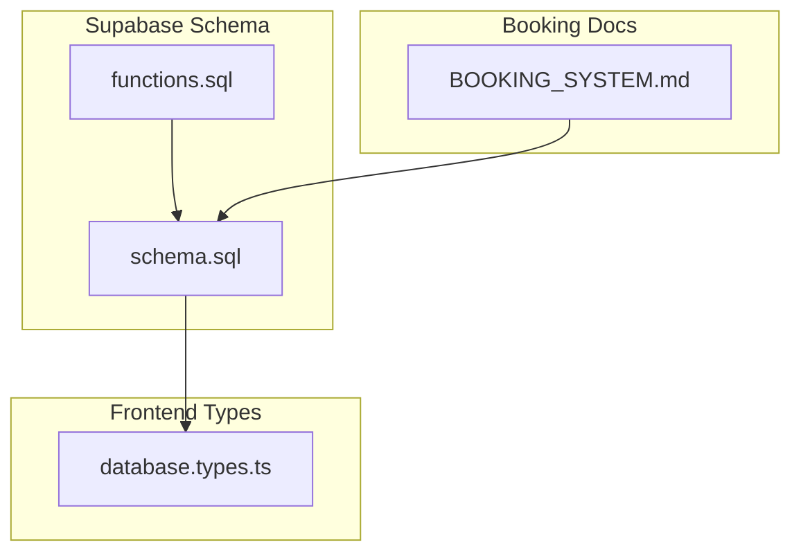
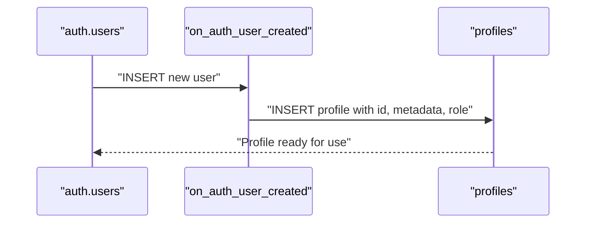
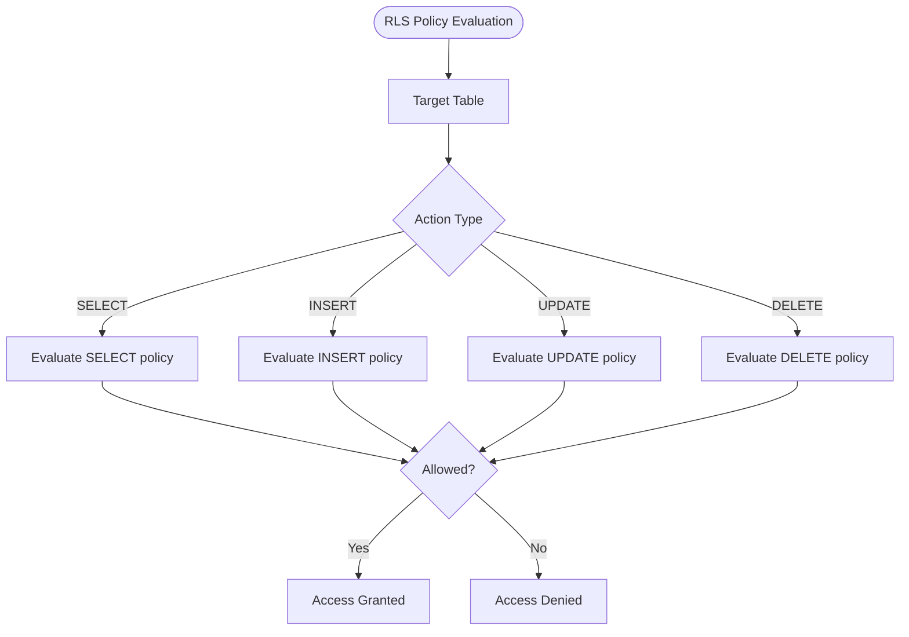
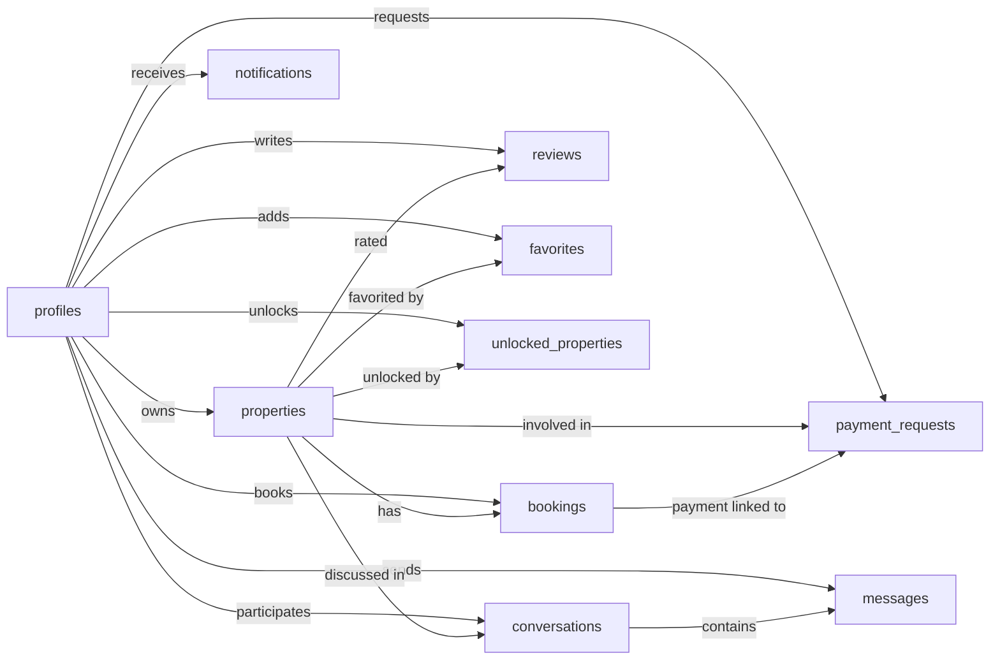

# Entity Relationships and ERD

<cite>
**Referenced Files in This Document**
- [schema.sql](file://supabase/schema.sql)
- [functions.sql](file://supabase/functions.sql)
- [database.types.ts](file://src/types/database.types.ts)
- [BOOKING_SYSTEM.md](file://BOOKING_SYSTEM.md)
</cite>

## Table of Contents
1. [Introduction](#introduction)
2. [Project Structure](#project-structure)
3. [Core Components](#core-components)
4. [Architecture Overview](#architecture-overview)
5. [Detailed Component Analysis](#detailed-component-analysis)
6. [Dependency Analysis](#dependency-analysis)
7. [Performance Considerations](#performance-considerations)
8. [Troubleshooting Guide](#troubleshooting-guide)
9. [Conclusion](#conclusion)

## Introduction
This document provides a comprehensive entity relationship description for the Gamasa Properties database schema. It details all tables, their relationships, cardinalities, foreign key constraints, unique constraints, composite keys, referential integrity rules, Row Level Security (RLS) policies, and trigger-driven automatic behaviors. The focus is on the primary relationships among profiles, properties, bookings, payment requests, conversations, and messages, including bidirectional and unidirectional associations, and how RLS affects data access patterns.

## Project Structure
The database schema is defined in Supabase and is represented by two primary files:
- supabase/schema.sql: Defines tables, constraints, triggers, and RLS policies.
- supabase/functions.sql: Contains stored functions and triggers used by the schema.
- src/types/database.types.ts: TypeScript types generated from the schema for frontend/backend alignment.
- BOOKING_SYSTEM.md: Describes the booking domain model and integration points.



**Diagram sources**
- [schema.sql](file://supabase/schema.sql#L1-L416)
- [functions.sql](file://supabase/functions.sql#L1-L71)
- [database.types.ts](file://src/types/database.types.ts#L1-L310)
- [BOOKING_SYSTEM.md](file://BOOKING_SYSTEM.md#L1-L380)

**Section sources**
- [schema.sql](file://supabase/schema.sql#L1-L416)
- [functions.sql](file://supabase/functions.sql#L1-L71)
- [database.types.ts](file://src/types/database.types.ts#L1-L310)
- [BOOKING_SYSTEM.md](file://BOOKING_SYSTEM.md#L1-L380)

## Core Components
This section summarizes the core entities and their roles in the system.

- profiles: Represents users with roles (tenant, landlord, admin). Primary key is a UUID that references Supabase Auth users. Includes verification flags and timestamps.
- properties: Represents rental listings owned by profiles. Includes pricing units, categories, statuses, location, and counts.
- bookings: Represents reservations for properties by guests. Links property and guest via foreign keys.
- payment_requests: Tracks payment requests associated with properties and users, including method and status.
- reviews: Captures user ratings per property with a unique constraint preventing duplicate reviews per user-property pair.
- notifications: Stores user-specific notifications with types and read status.
- favorites: Composite key table linking users to properties they favorited.
- unlocked_properties: Composite key table recording when users unlock property details.
- conversations: Bidirectional communication channel between buyers and owners around a property.
- messages: Unidirectional messages within a conversation, linked to sender and conversation.

Key constraints and relationships:
- Primary keys are either single UUIDs or composite keys (favorites, unlocked_properties).
- Foreign keys enforce referential integrity with ON DELETE CASCADE or SET NULL where appropriate.
- Unique constraints ensure data integrity (e.g., unique review per user-property, unique conversation triple).

**Section sources**
- [schema.sql](file://supabase/schema.sql#L8-L19)
- [schema.sql](file://supabase/schema.sql#L42-L67)
- [schema.sql](file://supabase/schema.sql#L95-L104)
- [schema.sql](file://supabase/schema.sql#L117-L128)
- [schema.sql](file://supabase/schema.sql#L131-L139)
- [schema.sql](file://supabase/schema.sql#L142-L151)
- [schema.sql](file://supabase/schema.sql#L154-L167)
- [schema.sql](file://supabase/schema.sql#L340-L348)
- [schema.sql](file://supabase/schema.sql#L353-L360)

## Architecture Overview
The database architecture centers on Supabase Auth and Postgres capabilities:
- Auth integration: profiles.id references auth.users, ensuring every profile corresponds to an Auth user.
- RLS: All tables enable row-level security with tailored policies per entity.
- Triggers: Automatic profile creation on user signup and automatic updated_at updates on edits.
- Conversations and Messages: Separate entities enabling structured buyer-owner communication.

```mermaid
erDiagram
PROFILES {
uuid id PK
text full_name
text avatar_url
text phone
text national_id
text role
boolean is_verified
boolean is_admin
timestamptz created_at
timestamptz updated_at
}
PROPERTIES {
uuid id PK
uuid owner_id FK
text title
text description
numeric price
text price_unit
text category
text status
float location_lat
float location_lng
text address
text area
int bedrooms
int bathrooms
int floor_area
int floor_number
text[] features
text[] images
text owner_phone
text owner_name
boolean is_verified
int views_count
timestamptz created_at
timestamptz updated_at
}
BOOKINGS {
uuid id PK
uuid property_id FK
uuid guest_id FK
date check_in
date check_out
numeric total_price
text status
timestamptz created_at
}
PAYMENT_REQUESTS {
uuid id PK
uuid user_id FK
uuid property_id FK
numeric amount
text payment_method
text receipt_image
text status
text admin_note
timestamptz processed_at
timestamptz created_at
}
REVIEWS {
uuid id PK
uuid property_id FK
uuid user_id FK
int rating
text comment
timestamptz created_at
}
NOTIFICATIONS {
uuid id PK
uuid user_id FK
text title
text message
text type
boolean is_read
text link
timestamptz created_at
}
FAVORITES {
uuid user_id PK,FK
uuid property_id PK,FK
timestamptz created_at
}
UNLOCKED_PROPERTIES {
uuid user_id PK,FK
uuid property_id PK,FK
timestamptz unlocked_at
}
CONVERSATIONS {
uuid id PK
uuid property_id FK
uuid buyer_id FK
uuid owner_id FK
timestamptz created_at
timestamptz updated_at
unique triple (property_id, buyer_id, owner_id)
}
MESSAGES {
uuid id PK
uuid conversation_id FK
uuid sender_id FK
text text
boolean is_read
timestamptz created_at
}
PROFILES ||--o{ PROPERTIES : "owns"
PROFILES ||--o{ BOOKINGS : "books"
PROFILES ||--o{ PAYMENT_REQUESTS : "requests"
PROFILES ||--o{ REVIEWS : "writes"
PROFILES ||--o{ NOTIFICATIONS : "receives"
PROFILES ||--o{ FAVORITES : "adds"
PROFILES ||--o{ UNLOCKED_PROPERTIES : "unlocks"
PROFILES ||--o{ CONVERSATIONS : "participates as buyer/owner"
PROFILES ||--o{ MESSAGES : "sends"
PROPERTIES ||--o{ BOOKINGS : "has"
PROPERTIES ||--o{ PAYMENT_REQUESTS : "involved in"
PROPERTIES ||--o{ REVIEWS : "rated"
PROPERTIES ||--o{ FAVORITES : "favorited by"
PROPERTIES ||--o{ UNLOCKED_PROPERTIES : "unlocked by"
PROPERTIES ||--o{ CONVERSATIONS : "discussed in"
BOOKINGS }o--|| PAYMENT_REQUESTS : "payment linked to"
CONVERSATIONS ||--o{ MESSAGES : "contains"
```

**Diagram sources**
- [schema.sql](file://supabase/schema.sql#L8-L19)
- [schema.sql](file://supabase/schema.sql#L42-L67)
- [schema.sql](file://supabase/schema.sql#L95-L104)
- [schema.sql](file://supabase/schema.sql#L117-L128)
- [schema.sql](file://supabase/schema.sql#L131-L139)
- [schema.sql](file://supabase/schema.sql#L142-L151)
- [schema.sql](file://supabase/schema.sql#L154-L167)
- [schema.sql](file://supabase/schema.sql#L340-L348)
- [schema.sql](file://supabase/schema.sql#L353-L360)

## Detailed Component Analysis

### Profiles
- Primary key: id (UUID) references auth.users.
- Roles: tenant, landlord, admin enforced by check constraint.
- Verification flags: is_verified, is_admin.
- Timestamps: created_at, updated_at managed by trigger.
- RLS: Selectable by everyone; updates and inserts restricted to self.

Bidirectional relationship:
- Owns properties (one-to-many).
- Participates in conversations (buyer/owner roles).

Unique constraints:
- None at table level.

Composite keys:
- None.

Foreign keys:
- None (self-referencing via auth.users).

**Section sources**
- [schema.sql](file://supabase/schema.sql#L8-L19)
- [schema.sql](file://supabase/schema.sql#L173-L195)
- [functions.sql](file://supabase/functions.sql#L7-L26)

### Properties
- Primary key: id (UUID).
- Owner: owner_id references profiles(id) with ON DELETE CASCADE.
- Pricing: price with unit (day, week, month, season).
- Category: apartment, room, studio, villa, chalet.
- Status: pending, available, rented, rejected.
- Location and attributes: lat/lng, address, area, bedrooms/bathrooms, floor area/number, features/images.
- Counts: views_count.
- Timestamps: created_at, updated_at managed by trigger.
- RLS: Selectable by everyone when available/rented or by owner; inserts/updates/deletes restricted to owner; admins have full access.

Unique constraints:
- None at table level.

Composite keys:
- None.

Foreign keys:
- owner_id -> profiles(id).

**Section sources**
- [schema.sql](file://supabase/schema.sql#L42-L67)
- [schema.sql](file://supabase/schema.sql#L197-L210)
- [schema.sql](file://supabase/schema.sql#L307-L315)

### Bookings
- Primary key: id (UUID).
- Guest: guest_id references profiles(id) with ON DELETE CASCADE.
- Property: property_id references properties(id) with ON DELETE CASCADE.
- Dates: check_in, check_out.
- Total price and status: pending, confirmed, cancelled, completed.
- Timestamps: created_at.
- RLS: Select/view own bookings; create restricted to self.

Unique constraints:
- None at table level.

Composite keys:
- None.

Foreign keys:
- guest_id -> profiles(id)
- property_id -> properties(id)

**Section sources**
- [schema.sql](file://supabase/schema.sql#L95-L104)
- [schema.sql](file://supabase/schema.sql#L211-L216)

### Payment Requests
- Primary key: id (UUID).
- User: user_id references profiles(id) with ON DELETE CASCADE.
- Property: property_id references properties(id) with ON DELETE CASCADE.
- Amount, method (vodafone_cash, instapay, fawry), receipt image, status (pending, approved, rejected), admin note, processed_at.
- RLS: Select/view own requests; create restricted to self; admins have full access.

Unique constraints:
- None at table level.

Composite keys:
- None.

Foreign keys:
- user_id -> profiles(id)
- property_id -> properties(id)

**Section sources**
- [schema.sql](file://supabase/schema.sql#L117-L128)
- [schema.sql](file://supabase/schema.sql#L218-L223)
- [schema.sql](file://supabase/schema.sql#L317-L325)

### Reviews
- Primary key: id (UUID).
- Property: property_id references properties(id) with ON DELETE CASCADE.
- User: user_id references profiles(id) with ON DELETE CASCADE.
- Rating: integer 1–5.
- Comment and timestamp.
- Unique constraint: (property_id, user_id) ensures one review per user per property.

Unique constraints:
- (property_id, user_id).

Composite keys:
- None.

Foreign keys:
- property_id -> properties(id)
- user_id -> profiles(id)

**Section sources**
- [schema.sql](file://supabase/schema.sql#L131-L139)
- [schema.sql](file://supabase/schema.sql#L225-L230)

### Notifications
- Primary key: id (UUID).
- User: user_id references profiles(id) with ON DELETE CASCADE.
- Title, message, type (success, info, warning, error), is_read, link.
- Timestamps: created_at.
- RLS: Select/view/update own notifications.

Unique constraints:
- None at table level.

Composite keys:
- None.

Foreign keys:
- user_id -> profiles(id)

**Section sources**
- [schema.sql](file://supabase/schema.sql#L142-L151)
- [schema.sql](file://supabase/schema.sql#L232-L237)

### Favorites
- Composite primary key: (user_id, property_id).
- user_id references profiles(id) with ON DELETE CASCADE.
- property_id references properties(id) with ON DELETE CASCADE.
- created_at timestamp.
- RLS: Select/view/manage own favorites.

Unique constraints:
- None at table level.

Composite keys:
- (user_id, property_id).

Foreign keys:
- user_id -> profiles(id)
- property_id -> properties(id)

**Section sources**
- [schema.sql](file://supabase/schema.sql#L154-L159)
- [schema.sql](file://supabase/schema.sql#L239-L244)

### Unlocked Properties
- Composite primary key: (user_id, property_id).
- Records when a user unlocks property details.
- RLS: Select/view own unlocked records.

Unique constraints:
- None at table level.

Composite keys:
- (user_id, property_id).

Foreign keys:
- user_id -> profiles(id)
- property_id -> properties(id)

**Section sources**
- [schema.sql](file://supabase/schema.sql#L162-L167)
- [schema.sql](file://supabase/schema.sql#L246-L248)

### Conversations
- Primary key: id (UUID).
- Property: property_id references properties(id) with ON DELETE SET NULL.
- Buyer: buyer_id references profiles(id) with ON DELETE CASCADE.
- Owner: owner_id references profiles(id) with ON DELETE CASCADE.
- Unique constraint: (property_id, buyer_id, owner_id) ensures one conversation per property-buyer-owner triple.
- Timestamps: created_at, updated_at.
- RLS: Select/view own conversations; create restricted to buyer role.

Unique constraints:
- (property_id, buyer_id, owner_id).

Composite keys:
- None.

Foreign keys:
- property_id -> properties(id)
- buyer_id -> profiles(id)
- owner_id -> profiles(id)

**Section sources**
- [schema.sql](file://supabase/schema.sql#L340-L348)
- [schema.sql](file://supabase/schema.sql#L372-L378)

### Messages
- Primary key: id (UUID).
- Conversation: conversation_id references conversations(id) with ON DELETE CASCADE.
- Sender: sender_id references profiles(id) with ON DELETE SET NULL.
- Text, is_read, created_at.
- RLS: Select/view messages in own conversations; create restricted to sender in that conversation.

Unique constraints:
- None at table level.

Composite keys:
- None.

Foreign keys:
- conversation_id -> conversations(id)
- sender_id -> profiles(id)

**Section sources**
- [schema.sql](file://supabase/schema.sql#L353-L360)
- [schema.sql](file://supabase/schema.sql#L384-L403)

### Triggers and Automatic Behaviors
- on_auth_user_created: After inserting a record in auth.users, automatically creates a corresponding profile with metadata from raw_user_meta_data and sets default role if missing.
- update_updated_at_column: Before UPDATE on profiles and properties, sets updated_at to current timestamp.



**Diagram sources**
- [functions.sql](file://supabase/functions.sql#L7-L26)
- [schema.sql](file://supabase/schema.sql#L254-L272)

**Section sources**
- [functions.sql](file://supabase/functions.sql#L7-L26)
- [schema.sql](file://supabase/schema.sql#L254-L292)

### Row Level Security (RLS) Policies
- profiles: Everyone can select; updates/inserts restricted to self.
- properties: Everyone can select when available/rented or by owner; owner can insert/update/delete; admins have full access.
- bookings: Users can view own bookings; can create bookings for themselves.
- payment_requests: Users can view own requests; can create requests for themselves; admins have full access.
- reviews: Everyone can select; can insert reviews for themselves.
- notifications: Users can view/update own notifications.
- favorites: Users can view/manage own favorites.
- unlocked_properties: Users can view own unlocked records.
- conversations: Users can view own conversations; can start as buyer.
- messages: Users can view messages in own conversations; can send messages in own conversations.



**Diagram sources**
- [schema.sql](file://supabase/schema.sql#L187-L250)
- [schema.sql](file://supabase/schema.sql#L365-L403)

**Section sources**
- [schema.sql](file://supabase/schema.sql#L187-L250)
- [schema.sql](file://supabase/schema.sql#L365-L403)

### Frontend Type Alignment
The TypeScript types in database.types.ts reflect the schema’s column definitions and enums, ensuring type-safe interactions between frontend and backend. These types align with the schema’s constraints and enumerations.

**Section sources**
- [database.types.ts](file://src/types/database.types.ts#L14-L300)

### Booking System Integration Notes
While the booking domain model is documented in BOOKING_SYSTEM.md, the current schema defines bookings with guest_id and property_id. The booking types described in the documentation include additional fields (e.g., start_date, end_date, total_nights, total_months, rental_type, tenant_* fields, payment_* fields). This indicates a potential divergence between the documentation and the schema. For accurate ERD and constraints, rely on the schema.sql definitions.

**Section sources**
- [BOOKING_SYSTEM.md](file://BOOKING_SYSTEM.md#L299-L333)
- [schema.sql](file://supabase/schema.sql#L95-L104)

## Dependency Analysis
This section maps dependencies among entities and highlights referential integrity and cascade behaviors.



**Diagram sources**
- [schema.sql](file://supabase/schema.sql#L8-L19)
- [schema.sql](file://supabase/schema.sql#L42-L67)
- [schema.sql](file://supabase/schema.sql#L95-L104)
- [schema.sql](file://supabase/schema.sql#L117-L128)
- [schema.sql](file://supabase/schema.sql#L131-L139)
- [schema.sql](file://supabase/schema.sql#L142-L151)
- [schema.sql](file://supabase/schema.sql#L154-L167)
- [schema.sql](file://supabase/schema.sql#L340-L348)
- [schema.sql](file://supabase/schema.sql#L353-L360)

**Section sources**
- [schema.sql](file://supabase/schema.sql#L8-L19)
- [schema.sql](file://supabase/schema.sql#L42-L67)
- [schema.sql](file://supabase/schema.sql#L95-L104)
- [schema.sql](file://supabase/schema.sql#L117-L128)
- [schema.sql](file://supabase/schema.sql#L131-L139)
- [schema.sql](file://supabase/schema.sql#L142-L151)
- [schema.sql](file://supabase/schema.sql#L154-L167)
- [schema.sql](file://supabase/schema.sql#L340-L348)
- [schema.sql](file://supabase/schema.sql#L353-L360)

## Performance Considerations
- Indexing: Consider adding indexes on frequently filtered columns (e.g., properties.owner_id, bookings.property_id/guest_id, conversations.property_id, messages.conversation_id).
- Partitioning: For large-scale properties or bookings, consider partitioning by date ranges.
- Materialized views: For common analytics queries (e.g., property stats), consider materialized views refreshed periodically.
- RLS overhead: RLS adds evaluation cost per row; ensure policies are selective and avoid expensive subqueries where possible.
- Triggers: Keep trigger functions minimal and efficient to avoid UPDATE hotspots.

[No sources needed since this section provides general guidance]

## Troubleshooting Guide
Common issues and resolutions:
- Access denied due to RLS: Verify that the authenticated user’s id matches the expected foreign key (e.g., owner_id for properties, guest_id for bookings, user_id for payment_requests/notifications/favorites/unlocked_properties).
- Cascade deletion surprises: Deleting a profile cascades property deletions; deleting a property cascades bookings, payment_requests, reviews, favorites, unlocked_properties, and conversation/message deletions.
- Conversation uniqueness: Ensure the triple (property_id, buyer_id, owner_id) is unique before insertion.
- Metadata synchronization: Newly registered users rely on the on_auth_user_created trigger to populate profiles; verify that auth.users metadata contains expected fields.

**Section sources**
- [schema.sql](file://supabase/schema.sql#L173-L180)
- [schema.sql](file://supabase/schema.sql#L197-L210)
- [schema.sql](file://supabase/schema.sql#L211-L216)
- [schema.sql](file://supabase/schema.sql#L218-L223)
- [schema.sql](file://supabase/schema.sql#L232-L237)
- [schema.sql](file://supabase/schema.sql#L239-L244)
- [schema.sql](file://supabase/schema.sql#L246-L248)
- [schema.sql](file://supabase/schema.sql#L340-L348)
- [schema.sql](file://supabase/schema.sql#L372-L378)
- [schema.sql](file://supabase/schema.sql#L384-L403)
- [functions.sql](file://supabase/functions.sql#L7-L26)

## Conclusion
The Gamasa Properties schema establishes a robust relational model centered on profiles, properties, and their interactions through bookings, payment requests, reviews, notifications, favorites, unlocked properties, conversations, and messages. Clear foreign key constraints, unique constraints, composite keys, and comprehensive RLS policies govern data integrity and access. Triggers automate profile creation and timestamp updates. The ERD and policies collectively ensure secure, scalable, and maintainable data relationships across tenants, landlords, and administrators.