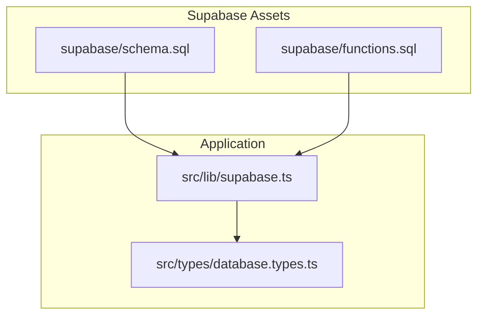
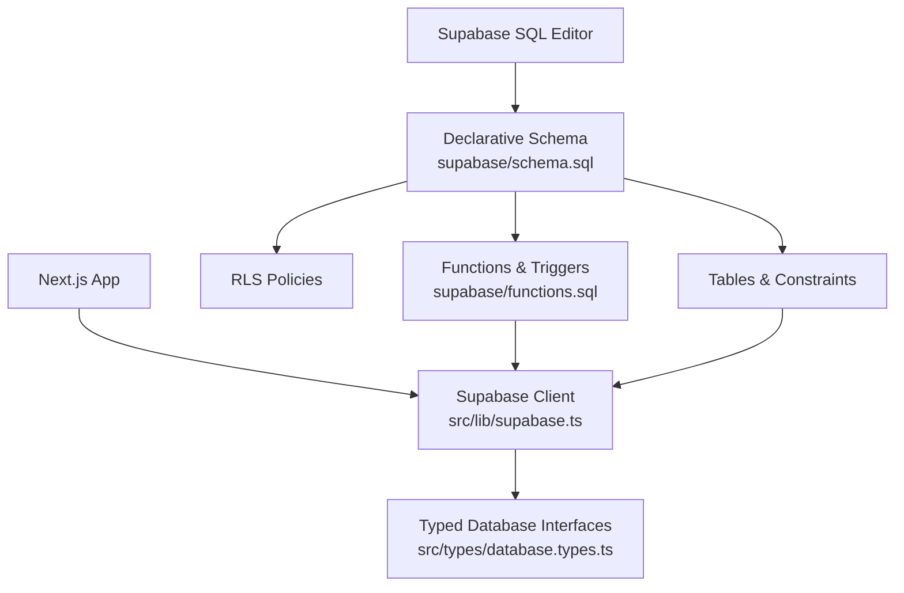
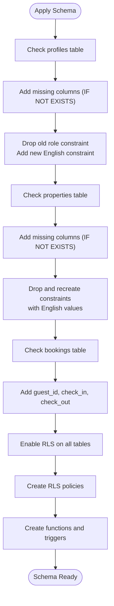
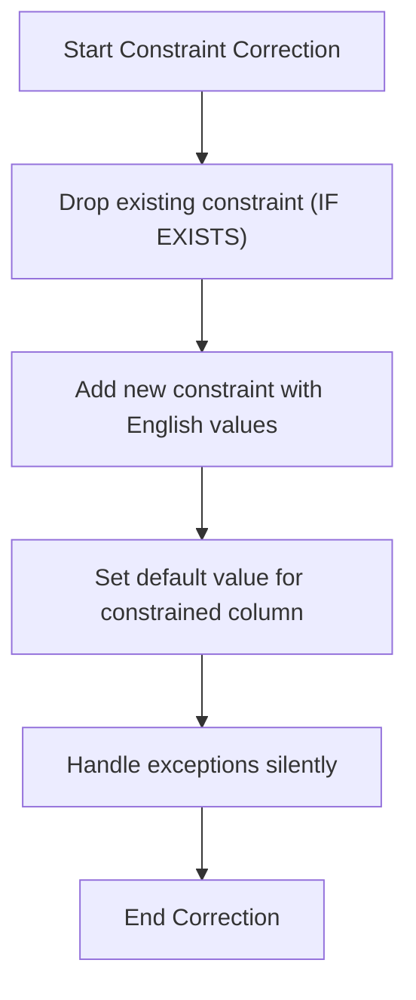
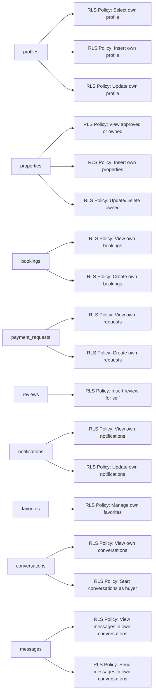
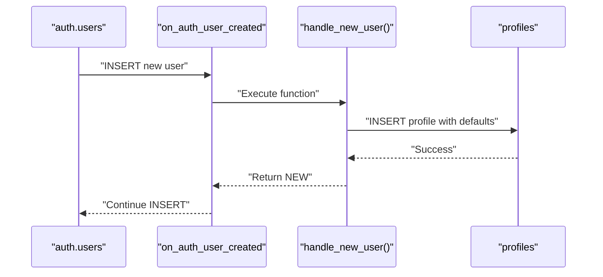
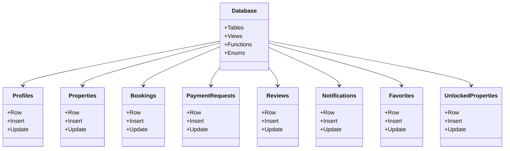
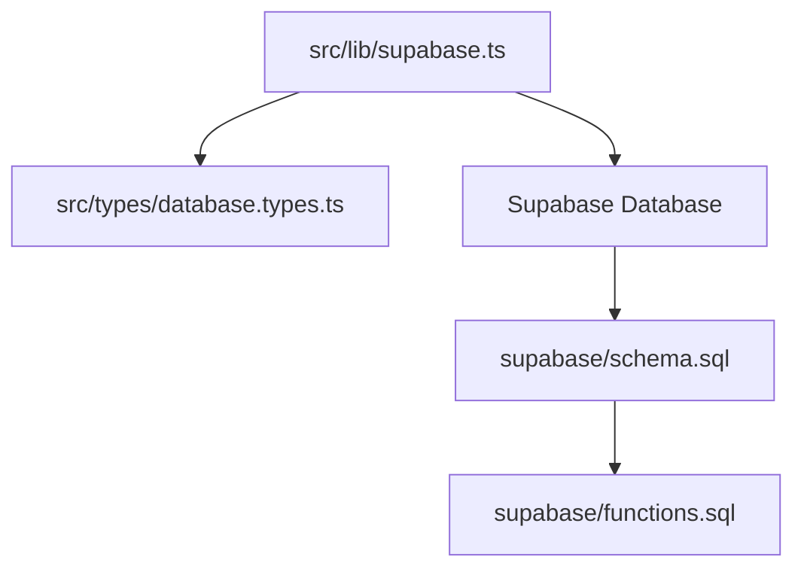

# Migration Management and Schema Evolution

<cite>
**Referenced Files in This Document**
- [schema.sql](file://supabase/schema.sql)
- [functions.sql](file://supabase/functions.sql)
- [supabase.ts](file://src/lib/supabase.ts)
- [database.types.ts](file://src/types/database.types.ts)
- [migrations.md](file://.agent/skills/database-design/migrations.md)
</cite>

## Table of Contents
1. [Introduction](#introduction)
2. [Project Structure](#project-structure)
3. [Core Components](#core-components)
4. [Architecture Overview](#architecture-overview)
5. [Detailed Component Analysis](#detailed-component-analysis)
6. [Dependency Analysis](#dependency-analysis)
7. [Performance Considerations](#performance-considerations)
8. [Troubleshooting Guide](#troubleshooting-guide)
9. [Conclusion](#conclusion)
10. [Appendices](#appendices)

## Introduction
This document explains how Gamasa Properties manages database schema evolution using Supabase. The project uses declarative schema definition with Postgres DO $$ ... $$ blocks to safely evolve tables, constraints, and policies. It also documents safe migration patterns, constraint correction processes, and operational workflows for development and production.

## Project Structure
Gamasa Properties organizes database assets under the supabase directory:
- supabase/schema.sql: Declarative schema with DO blocks for safe evolution and RLS policies
- supabase/functions.sql: Functions and triggers supporting the schema
- src/lib/supabase.ts: Supabase client initialization used by the Next.js application
- src/types/database.types.ts: TypeScript types generated from the schema for type safety
- .agent/skills/database-design/migrations.md: Safe migration principles and patterns

**Diagram sources**
- [schema.sql](file://supabase/schema.sql#L1-L416)
- [functions.sql](file://supabase/functions.sql#L1-L71)
- [supabase.ts](file://src/lib/supabase.ts#L1-L68)
- [database.types.ts](file://src/types/database.types.ts#L1-L310)

**Section sources**
- [schema.sql](file://supabase/schema.sql#L1-L416)
- [functions.sql](file://supabase/functions.sql#L1-L71)
- [supabase.ts](file://src/lib/supabase.ts#L1-L68)
- [database.types.ts](file://src/types/database.types.ts#L1-L310)

## Core Components
- Declarative schema with DO blocks: Ensures idempotent schema evolution by adding missing columns and correcting constraints safely.
- Row Level Security (RLS) policies: Enforce fine-grained access control across all tables.
- Helper functions and triggers: Automate profile creation and update timestamps.
- Supabase client and typed database: Provide runtime connectivity and compile-time type safety.

**Section sources**
- [schema.sql](file://supabase/schema.sql#L1-L416)
- [functions.sql](file://supabase/functions.sql#L1-L71)
- [supabase.ts](file://src/lib/supabase.ts#L1-L68)
- [database.types.ts](file://src/types/database.types.ts#L1-L310)

## Architecture Overview
The schema is applied as a whole via the Supabase SQL Editor. DO blocks encapsulate safe evolution steps, while RLS policies and triggers define runtime behavior. The Next.js application connects to Supabase using a typed client and consumes strongly typed database interfaces.

**Diagram sources**
- [schema.sql](file://supabase/schema.sql#L1-L416)
- [functions.sql](file://supabase/functions.sql#L1-L71)
- [supabase.ts](file://src/lib/supabase.ts#L1-L68)
- [database.types.ts](file://src/types/database.types.ts#L1-L310)

## Detailed Component Analysis

### Declarative Schema Evolution with DO Blocks
The schema uses DO blocks to:
- Add missing columns with IF NOT EXISTS
- Drop and recreate constraints with corrected values
- Handle exceptions gracefully to avoid blocking deployments

Key patterns visible in the schema:
- Column addition with defaults and references
- Constraint correction to align with application expectations
- Exception handling to tolerate idempotent runs

**Diagram sources**
- [schema.sql](file://supabase/schema.sql#L22-L39)
- [schema.sql](file://supabase/schema.sql#L70-L92)
- [schema.sql](file://supabase/schema.sql#L107-L114)
- [schema.sql](file://supabase/schema.sql#L173-L251)

**Section sources**
- [schema.sql](file://supabase/schema.sql#L22-L39)
- [schema.sql](file://supabase/schema.sql#L70-L92)
- [schema.sql](file://supabase/schema.sql#L107-L114)

### Constraint Correction Processes
The schema includes explicit steps to:
- Drop existing constraints that do not match current expectations
- Recreate constraints with standardized English values
- Set appropriate defaults for constrained columns

These steps ensure backward compatibility with application logic that expects English values.

**Diagram sources**
- [schema.sql](file://supabase/schema.sql#L32-L38)
- [schema.sql](file://supabase/schema.sql#L80-L91)

**Section sources**
- [schema.sql](file://supabase/schema.sql#L32-L38)
- [schema.sql](file://supabase/schema.sql#L80-L91)

### Row Level Security (RLS) and Policies
RLS is enabled on all tables, and policies are created to:
- Allow selective access based on ownership or roles
- Support admin overrides via is_admin flag
- Ensure conversations/messages are scoped to participants

**Diagram sources**
- [schema.sql](file://supabase/schema.sql#L173-L251)
- [schema.sql](file://supabase/schema.sql#L365-L403)

**Section sources**
- [schema.sql](file://supabase/schema.sql#L173-L251)
- [schema.sql](file://supabase/schema.sql#L365-L403)

### Functions and Triggers
Two critical functions and triggers support the schema:
- handle_new_user: Automatically creates a profile for new users
- update_updated_at_column: Updates updated_at timestamps before updates
- increment_views: Atomic increment for property views

**Diagram sources**
- [functions.sql](file://supabase/functions.sql#L7-L26)

**Section sources**
- [functions.sql](file://supabase/functions.sql#L7-L26)
- [functions.sql](file://supabase/functions.sql#L32-L39)

### Typed Database Interfaces
TypeScript types are generated from the schema to ensure:
- Compile-time safety for database operations
- Consistent handling of enums and defaults
- Strong typing for inserts, updates, and reads

**Diagram sources**
- [database.types.ts](file://src/types/database.types.ts#L12-L300)

**Section sources**
- [database.types.ts](file://src/types/database.types.ts#L12-L300)

## Dependency Analysis
- Runtime dependencies:
  - Supabase client initialized in the application
  - Typed database interfaces consumed by application logic
- Schema dependencies:
  - DO blocks depend on table existence and column presence
  - RLS policies depend on auth.uid() and table relationships
  - Triggers depend on functions and table schemas

**Diagram sources**
- [supabase.ts](file://src/lib/supabase.ts#L1-L68)
- [database.types.ts](file://src/types/database.types.ts#L1-L310)
- [schema.sql](file://supabase/schema.sql#L1-L416)
- [functions.sql](file://supabase/functions.sql#L1-L71)

**Section sources**
- [supabase.ts](file://src/lib/supabase.ts#L1-L68)
- [database.types.ts](file://src/types/database.types.ts#L1-L310)
- [schema.sql](file://supabase/schema.sql#L1-L416)
- [functions.sql](file://supabase/functions.sql#L1-L71)

## Performance Considerations
- Use IF NOT EXISTS to avoid redundant operations during repeated runs
- Prefer idempotent DO blocks to reduce downtime risk
- Keep triggers minimal and efficient (e.g., simple timestamp updates)
- Maintain accurate statistics and consider indexes for frequently queried columns

[No sources needed since this section provides general guidance]

## Troubleshooting Guide
Common issues and resolutions:
- Missing environment variables for Supabase client
  - Symptom: Warnings about missing Supabase URL or anon key
  - Resolution: Set NEXT_PUBLIC_SUPABASE_URL and NEXT_PUBLIC_SUPABASE_ANON_KEY in .env.local
- Constraint violations after schema changes
  - Symptom: Errors when inserting/updating constrained columns
  - Resolution: Ensure DO blocks have been executed to drop/recreate constraints with correct values
- RLS policy conflicts
  - Symptom: Access denied errors despite valid auth context
  - Resolution: Verify policies reference correct columns and auth.uid() is available
- Trigger failures
  - Symptom: Profile not created on user registration
  - Resolution: Confirm handle_new_user function exists and trigger is attached

**Section sources**
- [supabase.ts](file://src/lib/supabase.ts#L7-L15)
- [schema.sql](file://supabase/schema.sql#L32-L38)
- [schema.sql](file://supabase/schema.sql#L80-L91)
- [functions.sql](file://supabase/functions.sql#L7-L26)

## Conclusion
Gamasa Properties employs a robust, declarative approach to schema evolution using Supabase. DO blocks ensure safe, idempotent changes, while RLS and typed interfaces enforce security and type safety. Following the documented patterns and best practices minimizes risk and supports reliable development and production workflows.

[No sources needed since this section summarizes without analyzing specific files]

## Appendices

### Migration Strategy and Best Practices
- Zero-downtime changes:
  - Add nullable columns, backfill data, then add NOT NULL constraints
  - Remove columns by stopping usage, deploying, then dropping
  - Create indexes concurrently to avoid blocking
  - Rename columns by adding new, migrating data, deploying, then dropping old
- Philosophy:
  - Never make breaking changes in one step
  - Test migrations on a data copy first
  - Have a rollback plan
  - Run in transactions when possible

**Section sources**
- [migrations.md](file://.agent/skills/database-design/migrations.md#L1-L49)