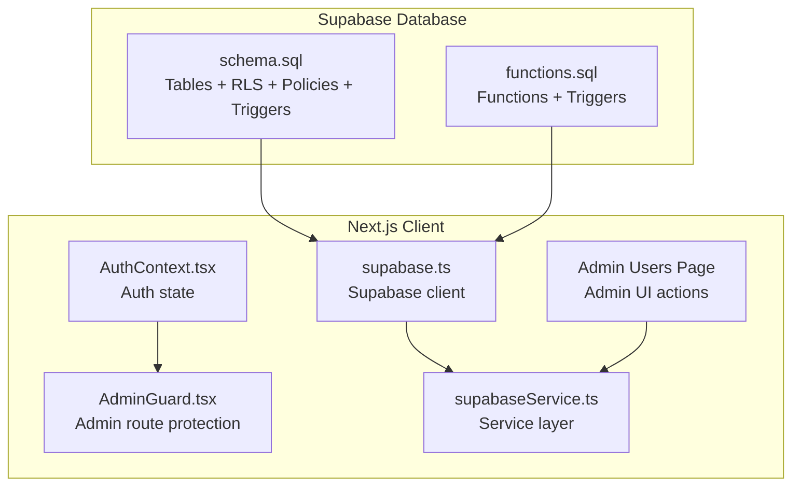
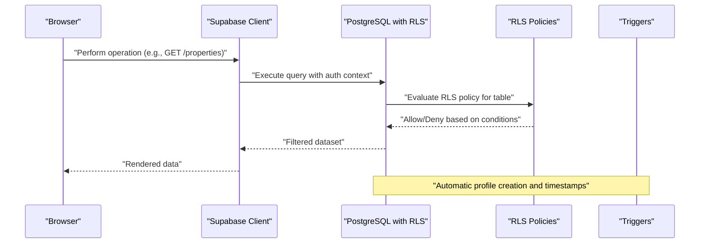
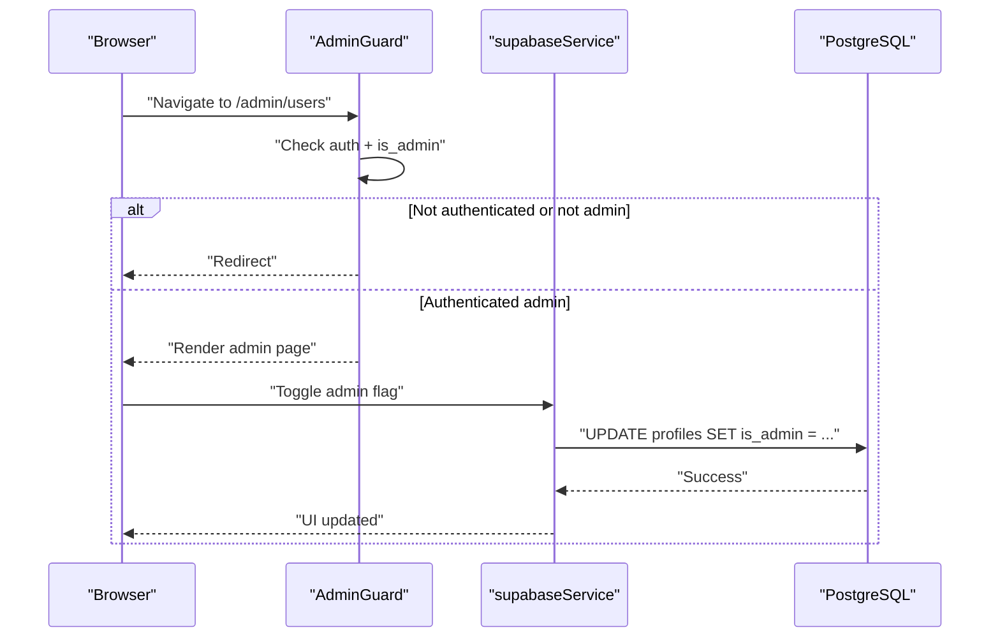
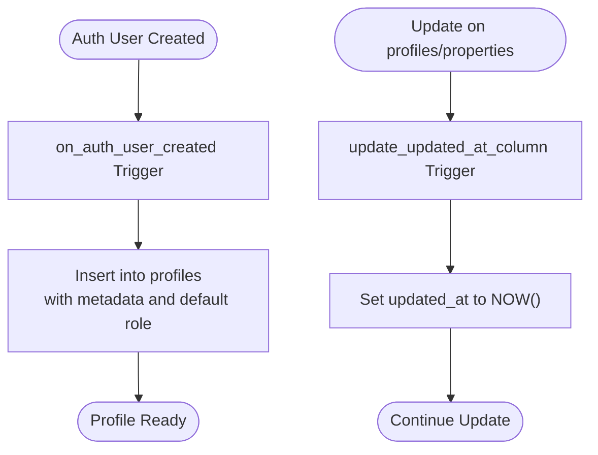
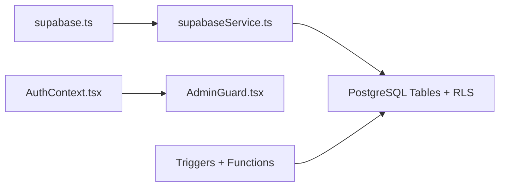

# Security Policies and RLS

<cite>
**Referenced Files in This Document**
- [schema.sql](file://supabase/schema.sql)
- [functions.sql](file://supabase/functions.sql)
- [supabase.ts](file://src/lib/supabase.ts)
- [AdminGuard.tsx](file://src/components/auth/AdminGuard.tsx)
- [AuthContext.tsx](file://src/context/AuthContext.tsx)
- [supabaseService.ts](file://src/services/supabaseService.ts)
- [Admin Users Page](file://src/app/admin/users/page.tsx)
- [security-rls-basics.md](file://.agent/skills/postgres-best-practices/rules/security-rls-basics.md)
- [security-rls-performance.md](file://.agent/skills/postgres-best-practices/rules/security-rls-performance.md)
- [security-privileges.md](file://.agent/skills/postgres-best-practices/rules/security-privileges.md)
</cite>

## Table of Contents
1. [Introduction](#introduction)
2. [Project Structure](#project-structure)
3. [Core Components](#core-components)
4. [Architecture Overview](#architecture-overview)
5. [Detailed Component Analysis](#detailed-component-analysis)
6. [Dependency Analysis](#dependency-analysis)
7. [Performance Considerations](#performance-considerations)
8. [Troubleshooting Guide](#troubleshooting-guide)
9. [Conclusion](#conclusion)

## Introduction
This document details the Row Level Security (RLS) policies and database security model for Gamasa Properties. It explains how access control is enforced per table, how authentication integrates with data visibility, how admin privileges are granted and scoped, and how trigger-based mechanisms automatically manage user profiles. It also covers cross-table access patterns, security implications, potential gaps, and best practices for maintaining data privacy.

## Project Structure
Security-related assets are primarily defined in the Supabase schema and functions, with client-side integration via the Supabase client and admin guards.

**Diagram sources**
- [schema.sql](file://supabase/schema.sql#L170-L181)
- [functions.sql](file://supabase/functions.sql#L1-L71)
- [supabase.ts](file://src/lib/supabase.ts#L1-L68)
- [AdminGuard.tsx](file://src/components/auth/AdminGuard.tsx#L1-L44)
- [AuthContext.tsx](file://src/context/AuthContext.tsx#L1-L195)
- [supabaseService.ts](file://src/services/supabaseService.ts#L1-L800)
- [Admin Users Page](file://src/app/admin/users/page.tsx#L1-L157)

**Section sources**
- [schema.sql](file://supabase/schema.sql#L1-L416)
- [functions.sql](file://supabase/functions.sql#L1-L71)
- [supabase.ts](file://src/lib/supabase.ts#L1-L68)
- [AdminGuard.tsx](file://src/components/auth/AdminGuard.tsx#L1-L44)
- [AuthContext.tsx](file://src/context/AuthContext.tsx#L1-L195)
- [supabaseService.ts](file://src/services/supabaseService.ts#L1-L800)
- [Admin Users Page](file://src/app/admin/users/page.tsx#L1-L157)

## Core Components
- Database schema with RLS enabled on all relevant tables and policies defining who can access what.
- Trigger-based automatic profile creation for new users and automatic timestamps.
- Admin policies that grant broad permissions to administrators.
- Client-side Supabase client and admin guard enforcing admin-only access to admin routes.
- Service layer interacting with Supabase and exposing admin actions (e.g., toggling admin/verified flags).

**Section sources**
- [schema.sql](file://supabase/schema.sql#L170-L181)
- [schema.sql](file://supabase/schema.sql#L187-L336)
- [functions.sql](file://supabase/functions.sql#L1-L71)
- [AdminGuard.tsx](file://src/components/auth/AdminGuard.tsx#L1-L44)
- [supabaseService.ts](file://src/services/supabaseService.ts#L696-L737)

## Architecture Overview
The system enforces database-level access control using RLS. Authentication is handled by Supabase Auth, and the client uses the Supabase JS client to interact with the database. Admin privileges are stored in the profiles table and enforced by dedicated admin policies.

**Diagram sources**
- [schema.sql](file://supabase/schema.sql#L170-L181)
- [schema.sql](file://supabase/schema.sql#L254-L272)
- [schema.sql](file://supabase/schema.sql#L274-L291)
- [supabase.ts](file://src/lib/supabase.ts#L1-L68)

## Detailed Component Analysis

### Profiles Table
- Purpose: Stores user identity, roles, verification, and admin status linked to Supabase Auth users.
- RLS Policies:
  - Select: Public selection allowed.
  - Insert: Only the authenticated user can insert their own profile.
  - Update: Only the authenticated user can update their own profile.
- Admin Policy: Admins can perform all operations on profiles.

Access patterns:
- Self-management: Users can insert/update their own profile.
- Visibility: Profiles are publicly selectable (useful for display).
- Admin scope: Admins can manage users’ roles and statuses.

Security implications:
- Public select can expose basic user info; mitigate by limiting returned fields or using views.
- Admins have broad access; ensure least privilege and audit logs.

**Section sources**
- [schema.sql](file://supabase/schema.sql#L8-L19)
- [schema.sql](file://supabase/schema.sql#L187-L195)
- [schema.sql](file://supabase/schema.sql#L306-L315)

### Properties Table
- Purpose: Listings owned by profiles.
- RLS Policies:
  - Select: Available/rented listings visible to everyone; owners can see their own regardless of status.
  - Insert: Only the owner can insert.
  - Update/Delete: Only the owner can modify/delete.
- Admin Policy: Admins can perform all operations on properties.

Access patterns:
- Public visibility for approved listings.
- Owner-only CRUD for their properties.
- Admin oversight across all properties.

Security implications:
- Status-based visibility prevents leaking unapproved content.
- Admin override ensures moderation and compliance.

**Section sources**
- [schema.sql](file://supabase/schema.sql#L42-L67)
- [schema.sql](file://supabase/schema.sql#L197-L209)
- [schema.sql](file://supabase/schema.sql#L307-L315)

### Bookings Table
- Purpose: Records guest stays against properties.
- RLS Policies:
  - Select: Only the guest can view their own bookings.
  - Insert: Only the guest can create bookings.

Access patterns:
- Guest sees only their reservations.
- Prevents cross-user exposure of booking data.

Security implications:
- Strong separation between guests and property owners.
- Ensure check-in/out dates and pricing are validated at insert/update.

**Section sources**
- [schema.sql](file://supabase/schema.sql#L94-L104)
- [schema.sql](file://supabase/schema.sql#L211-L216)

### Payment Requests Table
- Purpose: Payment submissions for properties.
- RLS Policies:
  - Select: Only the requester can view their own requests.
  - Insert: Only the requester can submit.

Access patterns:
- Users can only manage their own payment requests.
- Admins can manage all payment requests.

Security implications:
- Protects sensitive financial metadata from unauthorized access.
- Admin policy enables oversight and resolution.

**Section sources**
- [schema.sql](file://supabase/schema.sql#L116-L128)
- [schema.sql](file://supabase/schema.sql#L218-L223)
- [schema.sql](file://supabase/schema.sql#L317-L325)

### Reviews Table
- Purpose: Ratings and comments per property.
- RLS Policies:
  - Select: Everyone can view reviews.
  - Insert: Only authenticated users can submit reviews for properties they have stayed in or are eligible for.

Access patterns:
- Public review feed.
- Controlled submission to avoid spam.

Security implications:
- Public visibility supports transparency; ensure rate-limiting and moderation at the application level if needed.

**Section sources**
- [schema.sql](file://supabase/schema.sql#L130-L139)
- [schema.sql](file://supabase/schema.sql#L225-L230)

### Notifications Table
- Purpose: User-specific alerts.
- RLS Policies:
  - Select/Update: Only the owner of the notification can view/update.

Access patterns:
- Personalized notifications per user.
- Read/unread state controlled by the user.

Security implications:
- Ensures private alerts remain private.
- Admins can manage notifications globally via admin policy.

**Section sources**
- [schema.sql](file://supabase/schema.sql#L141-L151)
- [schema.sql](file://supabase/schema.sql#L232-L237)
- [schema.sql](file://supabase/schema.sql#L327-L335)

### Favorites Table
- Purpose: User-property bookmarks.
- RLS Policies:
  - Select: Only the user can view their favorites.
  - Manage: Full operations allowed for the owning user.

Access patterns:
- Private bookmark lists.
- Add/remove favorite entries.

Security implications:
- Minimal risk; ensure efficient indexing on user_id and property_id.

**Section sources**
- [schema.sql](file://supabase/schema.sql#L153-L167)
- [schema.sql](file://supabase/schema.sql#L239-L244)

### Unlocked Properties Table
- Purpose: Tracks when users unlock property details (e.g., contact info).
- RLS Policies:
  - Select: Only the unlocking user can view.

Access patterns:
- Per-user unlock records.
- Supports privacy controls for sensitive details.

Security implications:
- Keep minimal and log access if needed.

**Section sources**
- [schema.sql](file://supabase/schema.sql#L161-L167)
- [schema.sql](file://supabase/schema.sql#L246-L248)

### Conversations and Messages Tables
- Purpose: Messaging between buyers and owners around properties.
- RLS Policies:
  - Conversations: Users can view/listen to conversations where they are buyer or owner.
  - Messages: Users can view/send messages only within their own conversations; sender must match the conversation’s participants.

Access patterns:
- Bidirectional communication between parties.
- Cross-table integrity enforced by nested policy checks.

Security implications:
- Prevents snooping on others’ conversations.
- Admins can manage messages globally via admin policy.

**Section sources**
- [schema.sql](file://supabase/schema.sql#L338-L367)
- [schema.sql](file://supabase/schema.sql#L372-L403)
- [schema.sql](file://supabase/schema.sql#L327-L335)

### Authentication and Admin Privileges
- Authentication: Supabase Auth supplies the authenticated user ID used by RLS policies.
- Admin Guard: Client-side route protection ensures only admins can access admin pages.
- Admin Actions: Admins can toggle admin/verification flags via the admin UI, which calls service-layer updates.

**Diagram sources**
- [AdminGuard.tsx](file://src/components/auth/AdminGuard.tsx#L11-L43)
- [Admin Users Page](file://src/app/admin/users/page.tsx#L26-L45)
- [supabaseService.ts](file://src/services/supabaseService.ts#L723-L736)

**Section sources**
- [AdminGuard.tsx](file://src/components/auth/AdminGuard.tsx#L1-L44)
- [AuthContext.tsx](file://src/context/AuthContext.tsx#L1-L195)
- [Admin Users Page](file://src/app/admin/users/page.tsx#L1-L157)
- [supabaseService.ts](file://src/services/supabaseService.ts#L696-L737)

### Trigger-Based Security Mechanisms and Automatic Profile Creation
- New User Trigger: Automatically inserts a profile row for every new Supabase Auth user, populating identity fields and default role.
- Timestamp Trigger: Updates updated_at on profiles and properties before any update.
- RPC Function: Provides atomic increment for property views.

**Diagram sources**
- [schema.sql](file://supabase/schema.sql#L254-L272)
- [schema.sql](file://supabase/schema.sql#L274-L291)
- [functions.sql](file://supabase/functions.sql#L30-L39)

**Section sources**
- [schema.sql](file://supabase/schema.sql#L254-L291)
- [functions.sql](file://supabase/functions.sql#L1-L71)

## Dependency Analysis
- Supabase client initialization defines auth behavior and persistence.
- Service layer abstracts database interactions and admin actions.
- Admin guard depends on auth state to protect routes.
- RLS policies depend on the authenticated user ID and profile flags.

**Diagram sources**
- [supabase.ts](file://src/lib/supabase.ts#L1-L68)
- [supabaseService.ts](file://src/services/supabaseService.ts#L1-L800)
- [AuthContext.tsx](file://src/context/AuthContext.tsx#L1-L195)
- [AdminGuard.tsx](file://src/components/auth/AdminGuard.tsx#L1-L44)
- [schema.sql](file://supabase/schema.sql#L170-L181)

**Section sources**
- [supabase.ts](file://src/lib/supabase.ts#L1-L68)
- [supabaseService.ts](file://src/services/supabaseService.ts#L1-L800)
- [AuthContext.tsx](file://src/context/AuthContext.tsx#L1-L195)
- [AdminGuard.tsx](file://src/components/auth/AdminGuard.tsx#L1-L44)
- [schema.sql](file://supabase/schema.sql#L170-L181)

## Performance Considerations
- Wrap repeated function calls in subqueries to avoid per-row evaluation overhead.
- Use indexes on columns frequently used in RLS policies (e.g., owner_id, user_id).
- Prefer security definer functions for complex checks to reduce policy complexity.

**Section sources**
- [security-rls-performance.md](file://.agent/skills/postgres-best-practices/rules/security-rls-performance.md#L1-L58)

## Troubleshooting Guide
Common issues and mitigations:
- Unexpected data visibility:
  - Verify RLS is enabled on the table and policies are correctly ordered.
  - Confirm the authenticated user ID is present in the request context.
- Admin actions failing:
  - Ensure the user’s profile has is_admin set and the admin policy is applied.
- Cross-user data leakage:
  - Review policy conditions to ensure auth.uid() comparisons and foreign keys are correctly enforced.
- Performance regressions:
  - Add indexes on policy columns and rewrite policies to minimize per-row function calls.

**Section sources**
- [security-rls-basics.md](file://.agent/skills/postgres-best-practices/rules/security-rls-basics.md#L1-L51)
- [security-privileges.md](file://.agent/skills/postgres-best-practices/rules/security-privileges.md#L1-L55)

## Conclusion
Gamasa Properties enforces robust database-level access control using RLS, with clear separation between tenants, landlords, and administrators. Authentication integrates seamlessly with Supabase Auth, while client-side guards protect admin routes. Admin policies provide necessary oversight without compromising user privacy. To maintain strong security posture, apply least privilege, monitor admin actions, and optimize RLS performance with indexes and efficient policy design.