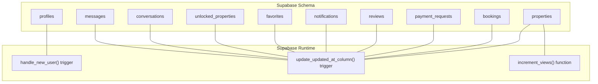
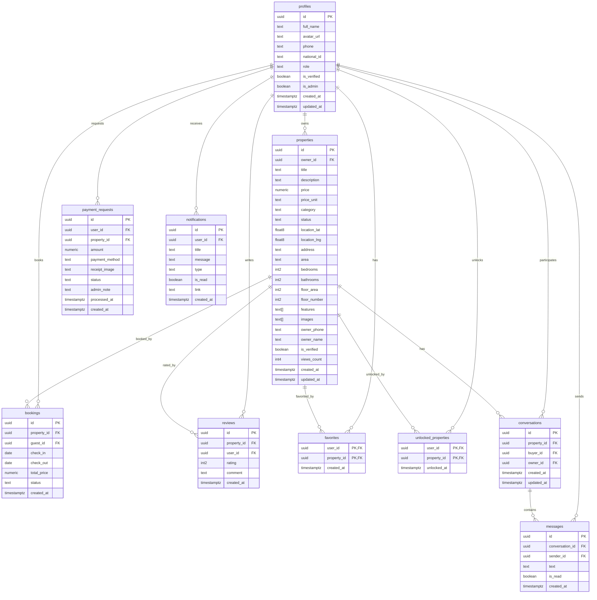
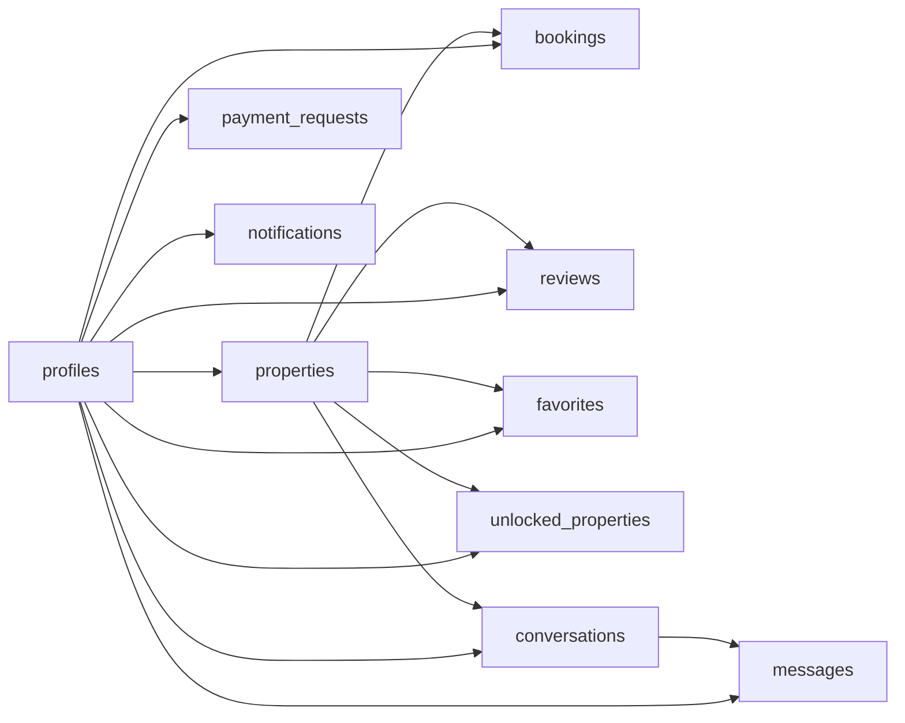

# Table Structures and Definitions

<cite>
**Referenced Files in This Document**
- [schema.sql](file://supabase/schema.sql)
- [functions.sql](file://supabase/functions.sql)
- [database.types.ts](file://src/types/database.types.ts)
- [supabase.ts](file://src/lib/supabase.ts)
- [supabaseService.ts](file://src/services/supabaseService.ts)
- [BOOKING_SYSTEM.md](file://BOOKING_SYSTEM.md)
</cite>

## Table of Contents
1. [Introduction](#introduction)
2. [Project Structure](#project-structure)
3. [Core Components](#core-components)
4. [Architecture Overview](#architecture-overview)
5. [Detailed Component Analysis](#detailed-component-analysis)
6. [Dependency Analysis](#dependency-analysis)
7. [Performance Considerations](#performance-considerations)
8. [Troubleshooting Guide](#troubleshooting-guide)
9. [Conclusion](#conclusion)

## Introduction
This document provides comprehensive table structure documentation for the Gamasa Properties PostgreSQL schema hosted on Supabase. It covers all core tables involved in user authentication and roles (profiles), real estate listings (properties), reservations (bookings), payment requests (payment_requests), communication (conversations and messages), and supporting tables (favorites, notifications, reviews, unlocked_properties). For each table, we describe columns, data types, constraints, defaults, validation rules, and the automatic population of audit timestamps via triggers. We also explain row-level security policies and the functions/triggers that maintain data integrity.

## Project Structure
The database schema is defined in Supabase SQL files and mirrored in TypeScript types for client-side usage. The primary schema definition resides in the Supabase SQL editor, while client-side type definitions ensure safe interactions with the database.

**Diagram sources**
- [schema.sql](file://supabase/schema.sql#L254-L304)
- [functions.sql](file://supabase/functions.sql#L7-L39)

**Section sources**
- [schema.sql](file://supabase/schema.sql#L1-L416)
- [database.types.ts](file://src/types/database.types.ts#L12-L310)

## Core Components
This section summarizes the primary tables and their roles in the system.

- profiles: User account and role management, linked to Supabase Auth users.
- properties: Real estate listings with pricing, location, and availability.
- bookings: Reservation records with check-in/out dates and status.
- payment_requests: Transaction requests with payment method and status.
- conversations and messages: Communication channels between buyers and owners.
- favorites: User-property bookmarks.
- notifications: User-specific alerts with categorization.
- reviews: Ratings and comments per property.
- unlocked_properties: Tracks which users have accessed locked property details.

**Section sources**
- [schema.sql](file://supabase/schema.sql#L8-L167)
- [database.types.ts](file://src/types/database.types.ts#L14-L299)

## Architecture Overview
The schema enforces referential integrity via foreign keys and uses row-level security (RLS) to restrict access based on user identity. Triggers automatically populate updated_at timestamps and create profiles for new users. A stored procedure safely increments property view counts.

**Diagram sources**
- [schema.sql](file://supabase/schema.sql#L8-L167)
- [schema.sql](file://supabase/schema.sql#L340-L360)

## Detailed Component Analysis

### Profiles Table
The profiles table stores user metadata and authentication-related attributes. It is tightly coupled with Supabase Auth users via a UUID primary key that references auth.users. Roles are enforced with a constrained set of values, and verification/admin flags support administrative controls.

- Columns and types
  - id: UUID, PK, references auth.users ON DELETE CASCADE
  - full_name: TEXT
  - avatar_url: TEXT
  - phone: TEXT
  - national_id: TEXT
  - role: TEXT, default 'tenant', CHECK in ('tenant','landlord','admin')
  - is_verified: BOOLEAN, default false
  - is_admin: BOOLEAN, default false
  - created_at: TIMESTAMP WITH TIME ZONE, default now()
  - updated_at: TIMESTAMP WITH TIME ZONE, default now()

- Constraints and defaults
  - Primary key: id
  - Foreign key: id references auth.users
  - CHECK constraint on role
  - Defaults for boolean and timestamp fields

- Validation rules
  - role accepts only predefined English values
  - Boolean flags control verification and admin privileges

- Audit columns
  - created_at and updated_at are automatically maintained by a trigger

- Security
  - Row-level security enabled
  - Policies allow self-update and insertion only for the authenticated user

- Notes
  - A DO block ensures backward compatibility by adding missing columns and correcting constraints to English values

**Section sources**
- [schema.sql](file://supabase/schema.sql#L8-L39)
- [schema.sql](file://supabase/schema.sql#L173-L195)
- [database.types.ts](file://src/types/database.types.ts#L14-L52)

### Properties Table
The properties table defines real estate listings with rich metadata, pricing units, categories, and availability status. It includes geolocation fields, property features/images arrays, and counters like views_count.

- Columns and types
  - id: UUID, PK, default gen_random_uuid()
  - owner_id: UUID, FK to profiles.id, ON DELETE CASCADE
  - title: TEXT, NOT NULL
  - description: TEXT
  - price: NUMERIC, NOT NULL
  - price_unit: TEXT, default 'day', CHECK in ('day','week','month','season')
  - category: TEXT, CHECK in ('apartment','room','studio','villa','chalet')
  - status: TEXT, default 'pending', CHECK in ('pending','available','rented','rejected')
  - location_lat: DOUBLE PRECISION
  - location_lng: DOUBLE PRECISION
  - address: TEXT
  - area: TEXT
  - bedrooms: INTEGER, default 1
  - bathrooms: INTEGER, default 1
  - floor_area: INTEGER
  - floor_number: INTEGER, default 0
  - features: TEXT[], default '{}'
  - images: TEXT[], default '{}'
  - owner_phone: TEXT
  - owner_name: TEXT
  - is_verified: BOOLEAN, default false
  - views_count: INTEGER, default 0
  - created_at: TIMESTAMP WITH TIME ZONE, default now()
  - updated_at: TIMESTAMP WITH TIME ZONE, default now()

- Constraints and defaults
  - Primary key: id
  - Foreign key: owner_id references profiles.id
  - CHECK constraints on price_unit, category, status
  - Defaults for numeric and array fields

- Validation rules
  - price_unit, category, status use English values for consistency
  - Arrays must be valid SQL arrays
  - Numeric price and integer floor_area/floor_number

- Audit columns
  - created_at and updated_at are automatically maintained by a trigger

- Security
  - Row-level security enabled
  - Policies allow viewing approved properties and managing owned properties

- Notes
  - A DO block adds missing columns and updates CHECK constraints to English values

**Section sources**
- [schema.sql](file://supabase/schema.sql#L41-L92)
- [schema.sql](file://supabase/schema.sql#L174-L209)
- [database.types.ts](file://src/types/database.types.ts#L53-L131)

### Bookings Table
The bookings table manages reservations with guest and property references, check-in/check-out dates, total price, and status. It integrates with the properties and profiles tables.

- Columns and types
  - id: UUID, PK, default gen_random_uuid()
  - property_id: UUID, FK to properties.id, ON DELETE CASCADE
  - guest_id: UUID, FK to profiles.id, ON DELETE CASCADE
  - check_in: DATE, NOT NULL
  - check_out: DATE, NOT NULL
  - total_price: NUMERIC, NOT NULL
  - status: TEXT, default 'pending', CHECK in ('pending','confirmed','cancelled','completed')
  - created_at: TIMESTAMP WITH TIME ZONE, default now()

- Constraints and defaults
  - Primary key: id
  - Foreign keys: property_id to properties, guest_id to profiles
  - CHECK constraint on status
  - Default for timestamp

- Validation rules
  - Status constrained to predefined values
  - Dates must form a valid range

- Audit columns
  - created_at is automatically set; updated_at is not present

- Security
  - Row-level security enabled
  - Policies restrict visibility and creation to the authenticated guest

- Notes
  - A DO block ensures guest_id, check_in, and check_out columns exist

**Section sources**
- [schema.sql](file://supabase/schema.sql#L94-L114)
- [schema.sql](file://supabase/schema.sql#L175-L216)
- [database.types.ts](file://src/types/database.types.ts#L133-L163)

### Payment Requests Table
The payment_requests table handles transaction requests for properties, including payment method, receipt image, and administrative status tracking.

- Columns and types
  - id: UUID, PK, default gen_random_uuid()
  - user_id: UUID, FK to profiles.id, ON DELETE CASCADE
  - property_id: UUID, FK to properties.id, ON DELETE CASCADE
  - amount: NUMERIC, NOT NULL
  - payment_method: TEXT, CHECK in ('vodafone_cash','instapay','fawry')
  - receipt_image: TEXT
  - status: TEXT, default 'pending', CHECK in ('pending','approved','rejected')
  - admin_note: TEXT
  - processed_at: TIMESTAMP WITH TIME ZONE
  - created_at: TIMESTAMP WITH TIME ZONE, default now()

- Constraints and defaults
  - Primary key: id
  - Foreign keys: user_id to profiles, property_id to properties
  - CHECK constraints on payment_method and status
  - Default for timestamp

- Validation rules
  - payment_method and status constrained to predefined values
  - Amount must be positive

- Audit columns
  - created_at is automatically set; updated_at is not present

- Security
  - Row-level security enabled
  - Policies restrict visibility and creation to the requesting user

**Section sources**
- [schema.sql](file://supabase/schema.sql#L116-L128)
- [schema.sql](file://supabase/schema.sql#L176-L223)
- [database.types.ts](file://src/types/database.types.ts#L165-L201)

### Reviews Table
The reviews table captures user ratings and optional comments for properties, ensuring uniqueness per user-property pair.

- Columns and types
  - id: UUID, PK, default gen_random_uuid()
  - property_id: UUID, FK to properties.id, ON DELETE CASCADE
  - user_id: UUID, FK to profiles.id, ON DELETE CASCADE
  - rating: INTEGER, CHECK between 1 and 5
  - comment: TEXT
  - created_at: TIMESTAMP WITH TIME ZONE, default now()

- Constraints and defaults
  - Primary key: id
  - Foreign keys: property_id to properties, user_id to profiles
  - UNIQUE constraint on (property_id, user_id)
  - CHECK constraint on rating range
  - Default for timestamp

- Validation rules
  - Rating must be within 1–5 inclusive
  - Unique review per user per property

- Audit columns
  - created_at is automatically set; updated_at is not present

- Security
  - Row-level security enabled
  - Policies allow viewing and creating reviews

**Section sources**
- [schema.sql](file://supabase/schema.sql#L130-L139)
- [schema.sql](file://supabase/schema.sql#L177-L230)
- [database.types.ts](file://src/types/database.types.ts#L203-L227)

### Notifications Table
The notifications table stores user-specific alerts with categorized types and read/unread status.

- Columns and types
  - id: UUID, PK, default gen_random_uuid()
  - user_id: UUID, FK to profiles.id, ON DELETE CASCADE
  - title: TEXT, NOT NULL
  - message: TEXT
  - type: TEXT, CHECK in ('success','info','warning','error')
  - is_read: BOOLEAN, default false
  - link: TEXT
  - created_at: TIMESTAMP WITH TIME ZONE, default now()

- Constraints and defaults
  - Primary key: id
  - Foreign key: user_id to profiles
  - CHECK constraint on type
  - Default for boolean and timestamp

- Validation rules
  - type constrained to predefined values
  - is_read flag controls read state

- Audit columns
  - created_at is automatically set; updated_at is not present

- Security
  - Row-level security enabled
  - Policies restrict visibility and updates to the user

**Section sources**
- [schema.sql](file://supabase/schema.sql#L141-L151)
- [schema.sql](file://supabase/schema.sql#L178-L237)
- [database.types.ts](file://src/types/database.types.ts#L229-L259)

### Favorites Table
The favorites table maintains user-property bookmark associations with automatic timestamps.

- Columns and types
  - user_id: UUID, FK to profiles.id, ON DELETE CASCADE
  - property_id: UUID, FK to properties.id, ON DELETE CASCADE
  - created_at: TIMESTAMP WITH TIME ZONE, default now()

- Constraints and defaults
  - Composite primary key: (user_id, property_id)
  - Foreign keys: user_id to profiles, property_id to properties
  - Default for timestamp

- Validation rules
  - Enforces unique bookmark per user per property

- Audit columns
  - created_at is automatically set; updated_at is not present

- Security
  - Row-level security enabled
  - Policies restrict visibility and management to the user

**Section sources**
- [schema.sql](file://supabase/schema.sql#L153-L159)
- [schema.sql](file://supabase/schema.sql#L179-L244)
- [database.types.ts](file://src/types/database.types.ts#L261-L276)

### Unlocked Properties Table
The unlocked_properties table tracks which users have accessed locked property details.

- Columns and types
  - user_id: UUID, FK to profiles.id, ON DELETE CASCADE
  - property_id: UUID, FK to properties.id, ON DELETE CASCADE
  - unlocked_at: TIMESTAMP WITH TIME ZONE, default now()

- Constraints and defaults
  - Composite primary key: (user_id, property_id)
  - Foreign keys: user_id to profiles, property_id to properties
  - Default for timestamp

- Validation rules
  - Enforces unique unlock per user per property

- Audit columns
  - unlocked_at is automatically set; updated_at is not present

- Security
  - Row-level security enabled
  - Policies restrict visibility to the user

**Section sources**
- [schema.sql](file://supabase/schema.sql#L161-L167)
- [schema.sql](file://supabase/schema.sql#L180-L248)
- [database.types.ts](file://src/types/database.types.ts#L278-L293)

### Conversations Table
The conversations table establishes communication threads between buyers and owners for specific properties.

- Columns and types
  - id: UUID, PK, default gen_random_uuid()
  - property_id: UUID, FK to properties.id, ON DELETE SET NULL
  - buyer_id: UUID, FK to profiles.id, ON DELETE CASCADE
  - owner_id: UUID, FK to profiles.id, ON DELETE CASCADE
  - created_at: TIMESTAMP WITH TIME ZONE, default now()
  - updated_at: TIMESTAMP WITH TIME ZONE, default now()
  - UNIQUE constraint on (property_id, buyer_id, owner_id)

- Constraints and defaults
  - Primary key: id
  - Foreign keys: buyer_id and owner_id to profiles, property_id to properties
  - UNIQUE constraint prevents duplicate conversations
  - Defaults for timestamps

- Validation rules
  - Unique conversation per property-buyer-owner combination

- Audit columns
  - created_at and updated_at are automatically maintained by a trigger

- Security
  - Row-level security enabled
  - Policies restrict visibility to participants

**Section sources**
- [schema.sql](file://supabase/schema.sql#L338-L348)
- [schema.sql](file://supabase/schema.sql#L365-L378)
- [database.types.ts](file://src/types/database.types.ts#L295-L299)

### Messages Table
The messages table stores individual messages within conversations, including read status and sender identity.

- Columns and types
  - id: UUID, PK, default gen_random_uuid()
  - conversation_id: UUID, FK to conversations.id, ON DELETE CASCADE
  - sender_id: UUID, FK to profiles.id, ON DELETE SET NULL
  - text: TEXT, NOT NULL
  - is_read: BOOLEAN, default false
  - created_at: TIMESTAMP WITH TIME ZONE, default now()

- Constraints and defaults
  - Primary key: id
  - Foreign keys: conversation_id to conversations, sender_id to profiles
  - Default for boolean and timestamp

- Validation rules
  - Text content is required
  - is_read flag controls read state

- Audit columns
  - created_at is automatically set; updated_at is not present

- Security
  - Row-level security enabled
  - Policies restrict visibility and sending to participants

- Realtime
  - Publication enabled for supabase_realtime to support live messaging

**Section sources**
- [schema.sql](file://supabase/schema.sql#L350-L360)
- [schema.sql](file://supabase/schema.sql#L366-L403)
- [schema.sql](file://supabase/schema.sql#L408-L415)
- [database.types.ts](file://src/types/database.types.ts#L295-L299)

## Dependency Analysis
The schema exhibits clear foreign key relationships among tables, with cascading deletes for referential integrity. Triggers enforce audit columns, and stored procedures encapsulate atomic operations like view counting.

**Diagram sources**
- [schema.sql](file://supabase/schema.sql#L8-L167)
- [schema.sql](file://supabase/schema.sql#L340-L360)

**Section sources**
- [schema.sql](file://supabase/schema.sql#L8-L167)
- [schema.sql](file://supabase/schema.sql#L340-L360)

## Performance Considerations
- Indexing recommendations
  - Consider adding indexes on frequently queried columns:
    - properties(owner_id), properties(status), properties(category), properties(area)
    - bookings(property_id, guest_id, status)
    - payment_requests(user_id, property_id, status)
    - reviews(property_id, user_id)
    - notifications(user_id, is_read)
    - favorites(user_id, property_id)
    - unlocked_properties(user_id, property_id)
    - conversations(property_id, buyer_id, owner_id)
    - messages(conversation_id, sender_id)
- Array operations
  - Use appropriate GIN indexes for text[] columns (features, images) if frequent containment queries are performed.
- Partitioning
  - For very large datasets, consider partitioning by created_at for audit-heavy tables (notifications, messages, bookings).
- Triggers
  - Triggers are lightweight but ensure they do not become bottlenecks under heavy write loads; keep UPDATE statements minimal.
- Stored procedures
  - The increment_views function is atomic and efficient; ensure it is called judiciously to avoid unnecessary updates.

[No sources needed since this section provides general guidance]

## Troubleshooting Guide
- Role constraint mismatch
  - If encountering errors related to role values, ensure the CHECK constraint uses English values ('tenant','landlord','admin') as enforced by the DO block.
- Missing columns after migration
  - The DO blocks add missing columns and update constraints. If a column is absent, re-run the schema to apply corrections.
- Audit timestamps not updating
  - Verify that update_updated_at_column triggers are active on relevant tables (profiles, properties, conversations).
- Realtime messaging not firing
  - Confirm that the supabase_realtime publication includes the messages table.
- Authentication linkage
  - New users should automatically get a profile via the handle_new_user trigger. If missing, check the trigger existence and function permissions.

**Section sources**
- [schema.sql](file://supabase/schema.sql#L21-L39)
- [schema.sql](file://supabase/schema.sql#L254-L304)
- [schema.sql](file://supabase/schema.sql#L408-L415)

## Conclusion
The Gamasa Properties schema is designed around clear ownership and access patterns, with robust constraints and automatic audit fields. The profiles table anchors user roles and authentication, while properties, bookings, and payment_requests form the core listing and transaction workflows. Conversations and messages enable seamless communication, and supporting tables like favorites and notifications enrich the user experience. Row-level security and triggers ensure data integrity and consistent auditing across the board.