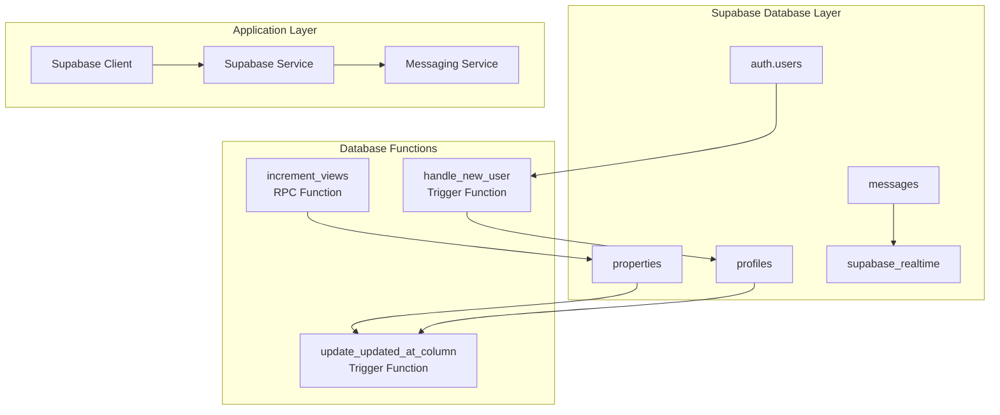
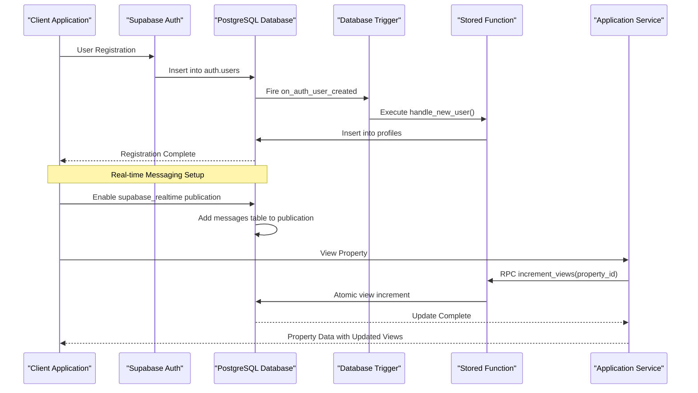
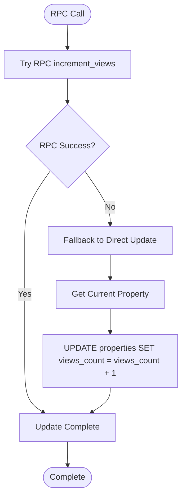
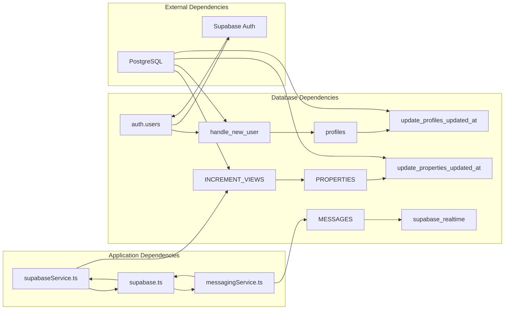

# Triggers and Database Functions

<cite>
**Referenced Files in This Document**
- [schema.sql](file://supabase/schema.sql)
- [functions.sql](file://supabase/functions.sql)
- [supabase.ts](file://src/lib/supabase.ts)
- [supabaseService.ts](file://src/services/supabaseService.ts)
- [messagingService.ts](file://src/services/messagingService.ts)
- [messaging.ts](file://src/types/messaging.ts)
</cite>

## Table of Contents
1. [Introduction](#introduction)
2. [Project Structure](#project-structure)
3. [Core Components](#core-components)
4. [Architecture Overview](#architecture-overview)
5. [Detailed Component Analysis](#detailed-component-analysis)
6. [Dependency Analysis](#dependency-analysis)
7. [Performance Considerations](#performance-considerations)
8. [Troubleshooting Guide](#troubleshooting-guide)
9. [Conclusion](#conclusion)

## Introduction

This document provides comprehensive documentation for the database triggers and stored functions in Gamasa Properties, focusing on three critical components: the automatic user profile creation trigger, timestamp maintenance functions, and property analytics increment function. These database-level mechanisms ensure data consistency, automate administrative tasks, and provide real-time functionality for the property management platform.

The system leverages PostgreSQL's trigger infrastructure combined with Supabase's real-time capabilities to create a robust, automated backend that handles user onboarding, maintains data integrity, and enables seamless real-time messaging between property owners and tenants.

## Project Structure

The database triggers and functions are organized within the Supabase infrastructure, with integration points throughout the application layer:



**Diagram sources**
- [schema.sql](file://supabase/schema.sql#L254-L304)
- [supabase.ts](file://src/lib/supabase.ts#L1-L68)
- [supabaseService.ts](file://src/services/supabaseService.ts#L378-L391)

**Section sources**
- [schema.sql](file://supabase/schema.sql#L1-L416)
- [functions.sql](file://supabase/functions.sql#L1-L71)

## Core Components

The database layer consists of three primary components that work together to maintain data consistency and enable automated functionality:

### 1. Automatic User Profile Creation Trigger

The `handle_new_user` trigger automatically creates user profiles when new users register through the authentication system, ensuring that every registered user has a corresponding profile record with appropriate metadata.

### 2. Timestamp Maintenance Functions

The `update_updated_at_column` function provides centralized timestamp management across multiple tables, maintaining consistency in `updated_at` fields for profiles and properties.

### 3. Property Analytics Increment Function

The `increment_views` RPC function provides atomic view counting for property listings, enabling accurate analytics while preventing race conditions during concurrent access.

**Section sources**
- [schema.sql](file://supabase/schema.sql#L254-L304)
- [functions.sql](file://supabase/functions.sql#L7-L39)

## Architecture Overview

The trigger and function architecture follows a layered approach that separates concerns between database-level automation and application-level orchestration:



**Diagram sources**
- [schema.sql](file://supabase/schema.sql#L254-L304)
- [supabaseService.ts](file://src/services/supabaseService.ts#L378-L391)

## Detailed Component Analysis

### Handle New User Trigger

The `handle_new_user` trigger serves as the cornerstone of user onboarding automation, ensuring that every new user registration is accompanied by a complete profile record.

#### Trigger Definition and Timing

The trigger is defined as an `AFTER INSERT` trigger on the `auth.users` table, executing immediately after user registration completes. This timing ensures that profile creation occurs only after successful authentication registration.

#### Execution Context and Parameters

| Parameter | Type | Description | Source |
|-----------|------|-------------|--------|
| `NEW.id` | UUID | Generated user identifier from auth.users | auth.users.NEW |
| `NEW.raw_user_meta_data->>'full_name'` | TEXT | User's full name from registration metadata | auth.users.raw_user_meta_data |
| `NEW.raw_user_meta_data->>'avatar_url'` | TEXT | User's avatar URL from registration metadata | auth.users.raw_user_meta_data |
| `NEW.raw_user_meta_data->>'phone'` | TEXT | User's phone number from registration metadata | auth.users.raw_user_meta_data |
| `COALESCE(NEW.raw_user_meta_data->>'role', 'tenant')` | TEXT | User role with default tenant | auth.users.raw_user_meta_data |

#### Security Implementation

The function employs `SECURITY DEFINER` to execute with database owner privileges, ensuring it can create profile records even when called from authenticated sessions. This security model requires careful parameter validation and sanitization.

#### Error Handling and Validation

The trigger function includes implicit error handling through PostgreSQL's transaction system. Any constraint violations or data type mismatches will cause the entire transaction to roll back, maintaining data consistency.

**Section sources**
- [schema.sql](file://supabase/schema.sql#L254-L272)
- [functions.sql](file://supabase/functions.sql#L7-L20)

### Update Updated At Column Function

The `update_updated_at_column` function provides centralized timestamp management across multiple tables, ensuring consistent audit trails and data freshness indicators.

#### Function Implementation Pattern

The function follows a consistent pattern across all monitored tables:

```sql
CREATE OR REPLACE FUNCTION update_updated_at_column()
RETURNS TRIGGER AS $$
BEGIN
    NEW.updated_at = NOW();
    RETURN NEW;
END;
$$ LANGUAGE plpgsql;
```

#### Trigger Configuration

Two separate triggers utilize this function:

| Trigger Name | Target Table | Timing | Purpose |
|--------------|--------------|--------|---------|
| `update_profiles_updated_at` | `profiles` | `BEFORE UPDATE` | Profile modification timestamps |
| `update_properties_updated_at` | `properties` | `BEFORE UPDATE` | Property listing updates |

#### Execution Context

The function executes within the context of the triggering UPDATE statement, modifying the `NEW` row's `updated_at` field to the current timestamp before the update is committed to the database.

**Section sources**
- [schema.sql](file://supabase/schema.sql#L274-L291)
- [functions.sql](file://supabase/functions.sql#L22-L26)

### Increment Views Function

The `increment_views` RPC function provides atomic view counting for property analytics, enabling accurate tracking of property page visits while preventing race conditions.

#### Function Signature and Parameters

| Parameter | Type | Description | Required |
|-----------|------|-------------|----------|
| `property_id` | UUID | Unique identifier of the property to increment | Yes |

#### Atomic Operation Implementation

The function performs an atomic UPDATE operation that increments the `views_count` field by 1, ensuring thread safety and preventing lost updates during concurrent access scenarios.

#### Error Handling Strategy

The application layer implements a fallback mechanism for error handling:



**Diagram sources**
- [supabaseService.ts](file://src/services/supabaseService.ts#L378-L391)

**Section sources**
- [schema.sql](file://supabase/schema.sql#L297-L304)
- [functions.sql](file://supabase/functions.sql#L32-L39)
- [supabaseService.ts](file://src/services/supabaseService.ts#L378-L391)

### Real-Time Messaging Publication

The database configuration includes automatic setup for real-time messaging through the `supabase_realtime` publication, enabling instant message delivery and presence indicators.

#### Publication Configuration

The system automatically adds the `messages` table to the `supabase_realtime` publication if it doesn't already exist:

```sql
IF NOT EXISTS (SELECT 1 FROM pg_publication_tables 
              WHERE pubname = 'supabase_realtime' AND tablename = 'messages') THEN
    ALTER PUBLICATION supabase_realtime ADD TABLE messages;
END IF;
```

#### Real-Time Features

The publication enables several real-time capabilities:
- Instant message delivery between users
- Presence indicators showing online/offline status
- Typing indicators for collaborative conversations
- Real-time property availability updates

**Section sources**
- [schema.sql](file://supabase/schema.sql#L408-L415)

## Dependency Analysis

The trigger and function ecosystem creates a complex web of dependencies that spans multiple layers of the application architecture:



**Diagram sources**
- [schema.sql](file://supabase/schema.sql#L254-L304)
- [supabaseService.ts](file://src/services/supabaseService.ts#L378-L391)
- [messagingService.ts](file://src/services/messagingService.ts#L1-L123)

### Security Model Analysis

The system employs a multi-layered security approach:

| Component | Security Mechanism | Purpose |
|-----------|-------------------|---------|
| `SECURITY DEFINER` | Function-level privilege escalation | Enables profile creation despite session limitations |
| Row Level Security (RLS) | Table-level access control | Restricts data access based on user roles and ownership |
| Supabase Auth | Session-based authentication | Manages user identity and permissions |
| Application-level validation | Frontend and backend validation | Prevents malicious input and ensures data integrity |

**Section sources**
- [schema.sql](file://supabase/schema.sql#L173-L180)
- [schema.sql](file://supabase/schema.sql#L187-L250)

## Performance Considerations

### Trigger Performance Impact

The trigger functions are designed for minimal performance impact:

- **handle_new_user**: Single INSERT operation with JSON extraction - negligible overhead
- **update_updated_at_column**: Minimal function execution with immediate return
- **increment_views**: Atomic UPDATE with index support on UUID primary key

### Concurrency Handling

The system addresses concurrency through:

- Atomic operations in `increment_views` prevent race conditions
- PostgreSQL's MVCC ensures consistent reads during concurrent writes
- Proper indexing on foreign keys and frequently queried columns

### Monitoring and Optimization

Recommended monitoring approaches:

```sql
-- Monitor trigger execution frequency
SELECT 
    event_object_table,
    trigger_name,
    action_timing,
    action_statement
FROM information_schema.triggers 
WHERE trigger_name LIKE '%updated_at%';

-- Analyze function performance
EXPLAIN ANALYZE SELECT increment_views('property-uuid');
```

## Troubleshooting Guide

### Common Issues and Solutions

#### Trigger Not Executing

**Symptoms**: New users don't receive profile records
**Causes**: 
- Trigger not properly installed
- Authentication system not configured correctly
- Database connection issues

**Solutions**:
1. Verify trigger installation: `SELECT * FROM pg_trigger WHERE tgname = 'on_auth_user_created';`
2. Check function existence: `SELECT proname FROM pg_proc WHERE proname = 'handle_new_user';`
3. Review Supabase logs for authentication errors

#### View Count Not Incrementing

**Symptoms**: Property view counts remain unchanged
**Causes**:
- RPC function call failures
- Network connectivity issues
- Database permission problems

**Solutions**:
1. Check RPC function status: `SELECT increment_views('property-uuid');`
2. Verify database permissions for the calling user
3. Implement fallback logic as shown in the application service

#### Real-Time Messaging Issues

**Symptoms**: Messages not delivered instantly
**Causes**:
- Publication not properly configured
- Client-side subscription failures
- Network connectivity problems

**Solutions**:
1. Verify publication configuration: `SELECT * FROM pg_publication_tables WHERE pubname = 'supabase_realtime';`
2. Check client subscription status
3. Review network connectivity and firewall settings

**Section sources**
- [supabaseService.ts](file://src/services/supabaseService.ts#L378-L391)
- [messagingService.ts](file://src/services/messagingService.ts#L88-L121)

## Conclusion

The database triggers and stored functions in Gamasa Properties provide a robust foundation for automated user management, data consistency, and real-time communication. The carefully designed security model ensures both functionality and protection, while the atomic operations prevent data inconsistencies during concurrent access.

Key benefits of this implementation include:

- **Automated User Onboarding**: Seamless profile creation eliminates manual administrative tasks
- **Data Integrity**: Centralized timestamp management ensures consistent audit trails
- **Real-Time Capabilities**: Supabase's real-time infrastructure enables instant messaging and presence indicators
- **Scalable Analytics**: Atomic view counting provides accurate property analytics without performance degradation

The modular design allows for easy maintenance and extension, with clear separation between database-level automation and application-level orchestration. This architecture supports the platform's growth while maintaining reliability and security standards.

Future enhancements could include additional analytics functions, extended real-time capabilities, and enhanced monitoring and alerting systems to further improve operational visibility and system reliability.