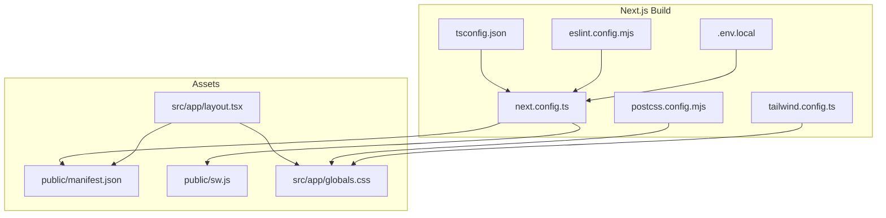
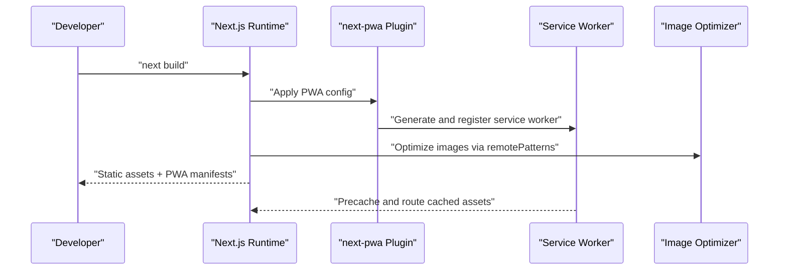
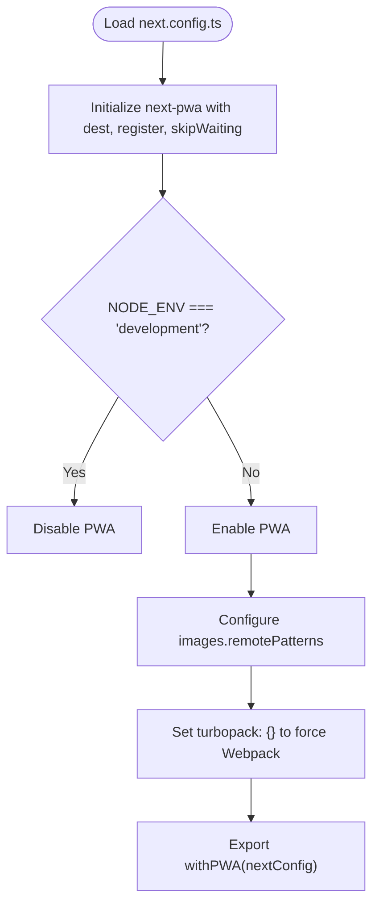
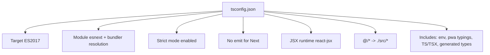
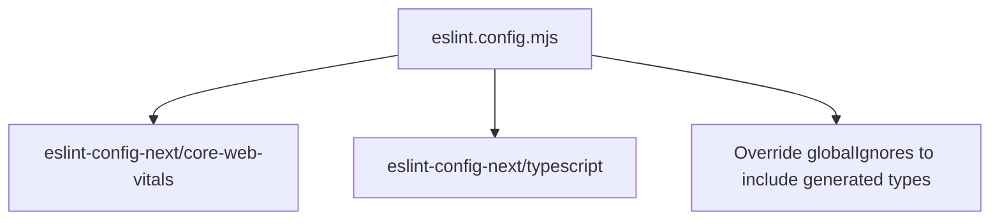
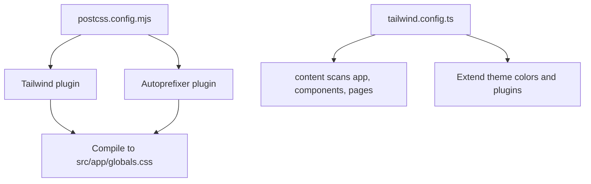
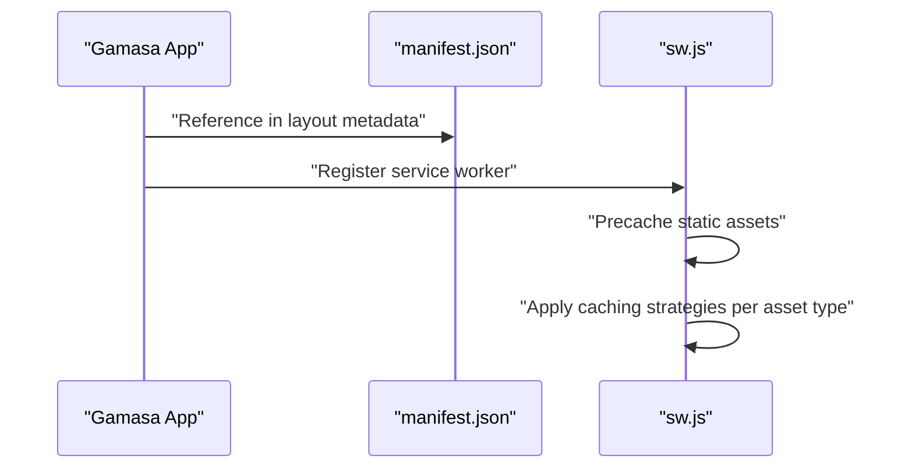
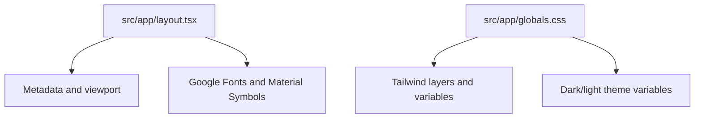
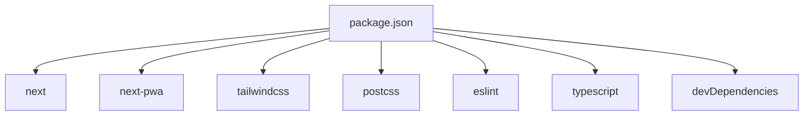

# Build Configuration

<cite>
**Referenced Files in This Document**
- [next.config.ts](file://next.config.ts)
- [package.json](file://package.json)
- [tsconfig.json](file://tsconfig.json)
- [eslint.config.mjs](file://eslint.config.mjs)
- [postcss.config.mjs](file://postcss.config.mjs)
- [tailwind.config.ts](file://tailwind.config.ts)
- [next-pwa.d.ts](file://next-pwa.d.ts)
- [next-env.d.ts](file://next-env.d.ts)
- [public/manifest.json](file://public/manifest.json)
- [public/sw.js](file://public/sw.js)
- [src/app/layout.tsx](file://src/app/layout.tsx)
- [src/app/globals.css](file://src/app/globals.css)
</cite>

## Table of Contents
1. [Introduction](#introduction)
2. [Project Structure](#project-structure)
3. [Core Components](#core-components)
4. [Architecture Overview](#architecture-overview)
5. [Detailed Component Analysis](#detailed-component-analysis)
6. [Dependency Analysis](#dependency-analysis)
7. [Performance Considerations](#performance-considerations)
8. [Troubleshooting Guide](#troubleshooting-guide)
9. [Conclusion](#conclusion)

## Introduction
This document explains the build configuration for Gamasa Properties, focusing on Next.js setup, PWA configuration, image optimization, TypeScript compilation, ESLint rules, and PostCSS/Tailwind integration. It also covers development versus production differences, static generation configuration, and practical optimization strategies with examples mapped to actual repository files.

## Project Structure
The build configuration spans several key files:
- Next.js configuration and PWA integration
- TypeScript compiler options
- ESLint configuration
- PostCSS and Tailwind setup
- Manifest and service worker assets
- Application metadata and global styles

**Diagram sources**
- [next.config.ts](file://next.config.ts#L1-L31)
- [tsconfig.json](file://tsconfig.json#L1-L43)
- [eslint.config.mjs](file://eslint.config.mjs#L1-L19)
- [postcss.config.mjs](file://postcss.config.mjs#L1-L10)
- [tailwind.config.ts](file://tailwind.config.ts#L1-L36)
- [public/manifest.json](file://public/manifest.json#L1-L74)
- [public/sw.js](file://public/sw.js#L1-L2)
- [src/app/layout.tsx](file://src/app/layout.tsx#L1-L90)
- [src/app/globals.css](file://src/app/globals.css#L1-L118)

**Section sources**
- [next.config.ts](file://next.config.ts#L1-L31)
- [package.json](file://package.json#L1-L42)
- [tsconfig.json](file://tsconfig.json#L1-L43)
- [eslint.config.mjs](file://eslint.config.mjs#L1-L19)
- [postcss.config.mjs](file://postcss.config.mjs#L1-L10)
- [tailwind.config.ts](file://tailwind.config.ts#L1-L36)
- [public/manifest.json](file://public/manifest.json#L1-L74)
- [public/sw.js](file://public/sw.js#L1-L2)
- [src/app/layout.tsx](file://src/app/layout.tsx#L1-L90)
- [src/app/globals.css](file://src/app/globals.css#L1-L118)

## Core Components
- Next.js configuration and PWA setup
  - PWA enabled via next-pwa with registration and skip-waiting behavior, disabled in development.
  - Webpack is used instead of Turbopack for PWA compatibility.
  - Remote image patterns allow HTTPS and localhost HTTP for local development.
- TypeScript compilation
  - Strict mode, ES2017 target, bundler module resolution, isolated modules, and JSX runtime configured.
  - Path aliases mapped to the src directory.
- ESLint configuration
  - Extends Next.js core-web-vitals and TypeScript configs; overrides default ignores to include generated types.
- PostCSS and Tailwind
  - Tailwind and Autoprefixer plugins configured; Tailwind content scans app, components, and pages directories.
- Manifest and service worker
  - Web App Manifest defines name, short_name, theme/background colors, icons, screenshots, categories, and direction/language.
  - Service worker precaches static assets and applies caching strategies for fonts, images, audio/video, JS/CSS, and API responses.

**Section sources**
- [next.config.ts](file://next.config.ts#L1-L31)
- [next-pwa.d.ts](file://next-pwa.d.ts#L1-L23)
- [tsconfig.json](file://tsconfig.json#L1-L43)
- [eslint.config.mjs](file://eslint.config.mjs#L1-L19)
- [postcss.config.mjs](file://postcss.config.mjs#L1-L10)
- [tailwind.config.ts](file://tailwind.config.ts#L1-L36)
- [public/manifest.json](file://public/manifest.json#L1-L74)
- [public/sw.js](file://public/sw.js#L1-L2)

## Architecture Overview
The build pipeline integrates Next.js, PWA, image optimization, and styling tools. The PWA plugin wraps Next’s configuration, while the service worker manages caching and offline behavior. Tailwind and PostCSS handle CSS generation and vendor prefixing.

**Diagram sources**
- [next.config.ts](file://next.config.ts#L1-L31)
- [public/sw.js](file://public/sw.js#L1-L2)
- [public/manifest.json](file://public/manifest.json#L1-L74)

## Detailed Component Analysis

### Next.js Configuration and PWA Setup
- PWA configuration
  - Destination folder for service worker and assets is public.
  - Registration and skip-waiting are enabled.
  - PWA is disabled during development.
- Webpack vs Turbopack
  - Turbopack is explicitly configured as empty; Webpack is used for PWA compatibility.
- Image optimization
  - Remote patterns allow HTTPS for all hosts and HTTP for localhost, enabling local development image serving.

**Diagram sources**
- [next.config.ts](file://next.config.ts#L1-L31)
- [next-pwa.d.ts](file://next-pwa.d.ts#L1-L23)

**Section sources**
- [next.config.ts](file://next.config.ts#L1-L31)
- [next-pwa.d.ts](file://next-pwa.d.ts#L1-L23)

### TypeScript Compilation Settings
- Compiler options
  - Target: ES2017
  - Module: esnext with bundler resolution
  - Strict mode enabled, no emit (TypeScript used via Next)
  - JSX runtime: react-jsx
  - Paths alias: @/* -> ./src/*
- Includes/excludes
  - Includes Next.js environment typings, PWA typings, and all TS/TSX files, plus generated Next types.

**Diagram sources**
- [tsconfig.json](file://tsconfig.json#L1-L43)

**Section sources**
- [tsconfig.json](file://tsconfig.json#L1-L43)
- [next-env.d.ts](file://next-env.d.ts#L1-L7)

### ESLint Configuration
- Extends Next’s recommended configs for core web vitals and TypeScript.
- Overrides default ignores to ensure generated Next types are linted.

**Diagram sources**
- [eslint.config.mjs](file://eslint.config.mjs#L1-L19)

**Section sources**
- [eslint.config.mjs](file://eslint.config.mjs#L1-L19)

### PostCSS and Tailwind Setup
- PostCSS plugins
  - Tailwind CSS and Autoprefixer are enabled.
- Tailwind configuration
  - Content globs scan app, components, and pages directories.
  - Custom color palette and form plugin are configured.

**Diagram sources**
- [postcss.config.mjs](file://postcss.config.mjs#L1-L10)
- [tailwind.config.ts](file://tailwind.config.ts#L1-L36)
- [src/app/globals.css](file://src/app/globals.css#L1-L118)

**Section sources**
- [postcss.config.mjs](file://postcss.config.mjs#L1-L10)
- [tailwind.config.ts](file://tailwind.config.ts#L1-L36)
- [src/app/globals.css](file://src/app/globals.css#L1-L118)

### Manifest and Service Worker
- Web App Manifest
  - Defines app identity, display mode, theme/background colors, icons, screenshots, categories, and language/direction.
- Service Worker
  - Precaches static chunks, CSS, media, and public assets.
  - Applies caching strategies for fonts, images, audio/video, JS/CSS, API responses, and cross-origin requests.

**Diagram sources**
- [public/manifest.json](file://public/manifest.json#L1-L74)
- [public/sw.js](file://public/sw.js#L1-L2)
- [src/app/layout.tsx](file://src/app/layout.tsx#L20-L54)

**Section sources**
- [public/manifest.json](file://public/manifest.json#L1-L74)
- [public/sw.js](file://public/sw.js#L1-L2)
- [src/app/layout.tsx](file://src/app/layout.tsx#L20-L54)

### Static Generation and Metadata
- Metadata and viewport
  - Site metadata, Open Graph images, Apple Web App settings, and viewport configuration are defined in the root layout.
- Global CSS and Tailwind
  - Tailwind layers (base, components, utilities) and custom CSS variables are applied globally.

**Diagram sources**
- [src/app/layout.tsx](file://src/app/layout.tsx#L1-L90)
- [src/app/globals.css](file://src/app/globals.css#L1-L118)

**Section sources**
- [src/app/layout.tsx](file://src/app/layout.tsx#L1-L90)
- [src/app/globals.css](file://src/app/globals.css#L1-L118)

## Dependency Analysis
- Toolchain dependencies
  - Next.js, next-pwa, Tailwind CSS, Autoprefixer, ESLint, TypeScript, and related type packages.
- Build scripts
  - Dev, build, start, and lint scripts defined in package.json.

**Diagram sources**
- [package.json](file://package.json#L1-L42)

**Section sources**
- [package.json](file://package.json#L1-L42)

## Performance Considerations
- PWA and caching
  - Service worker precaches static assets and applies Stale-While-Revalidate and Cache-First strategies for optimal performance and offline support.
- Image optimization
  - Remote patterns enable optimized images from HTTPS sources and localhost for development.
- CSS optimization
  - Tailwind purges unused styles; Autoprefixer ensures compatibility.
- Build tooling
  - Using Webpack (as configured) ensures stable PWA behavior; Turbopack is disabled for PWA compatibility.

[No sources needed since this section provides general guidance]

## Troubleshooting Guide
- PWA not registering in development
  - PWA is intentionally disabled in development; switch to production build or adjust PWA configuration.
- Image loading issues
  - Ensure remote hostnames match configured patterns (HTTPS for all hosts and HTTP for localhost).
- Tailwind classes not applying
  - Verify content globs include the relevant directories and rebuild the project.
- ESLint errors on generated types
  - Confirm overrides include generated Next types so they are linted.

**Section sources**
- [next.config.ts](file://next.config.ts#L1-L31)
- [eslint.config.mjs](file://eslint.config.mjs#L1-L19)
- [tailwind.config.ts](file://tailwind.config.ts#L1-L36)

## Conclusion
Gamasa Properties’ build configuration integrates Next.js, PWA, image optimization, TypeScript, ESLint, and Tailwind CSS effectively. The setup prioritizes stability and performance, with explicit PWA behavior, optimized image handling, and a robust styling pipeline. Following the guidance here will help maintain and extend the build safely across environments.