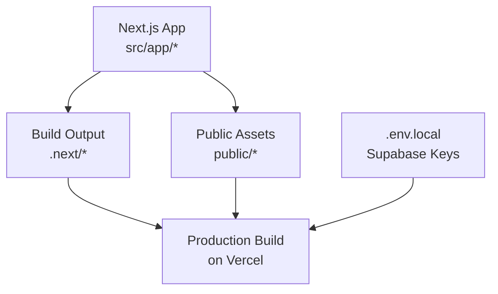
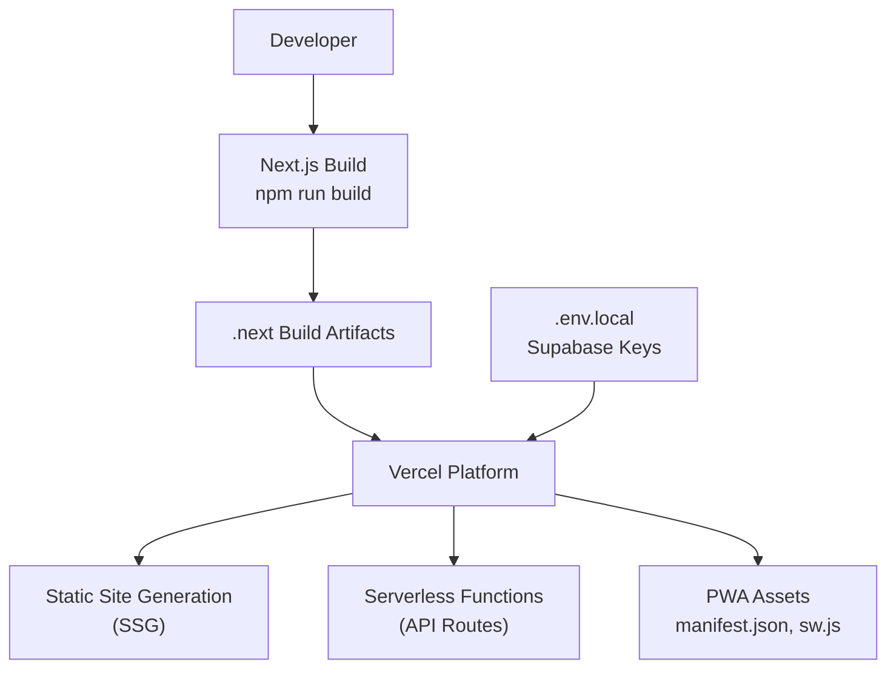
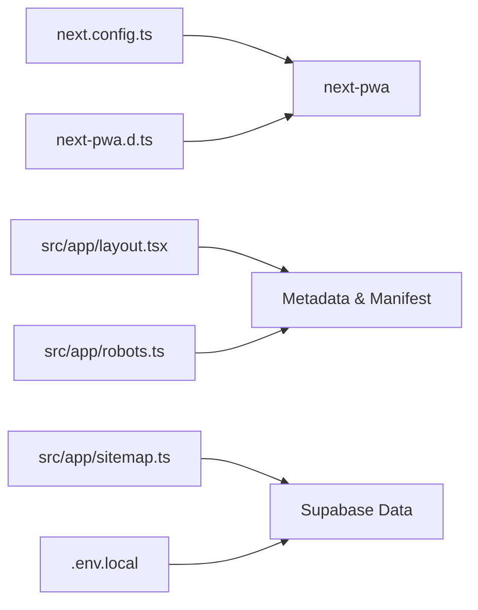

# Deployment Strategies

<cite>
**Referenced Files in This Document**
- [package.json](file://package.json)
- [next.config.ts](file://next.config.ts)
- [next-pwa.d.ts](file://next-pwa.d.ts)
- [public/manifest.json](file://public/manifest.json)
- [public/sw.js](file://public/sw.js)
- [src/app/layout.tsx](file://src/app/layout.tsx)
- [src/app/robots.ts](file://src/app/robots.ts)
- [src/app/sitemap.ts](file://src/app/sitemap.ts)
- [.env.local](file://.env.local)
- [.next/build-manifest.json](file://.next/build-manifest.json)
</cite>

## Table of Contents
1. [Introduction](#introduction)
2. [Project Structure](#project-structure)
3. [Core Components](#core-components)
4. [Architecture Overview](#architecture-overview)
5. [Detailed Component Analysis](#detailed-component-analysis)
6. [Dependency Analysis](#dependency-analysis)
7. [Performance Considerations](#performance-considerations)
8. [Troubleshooting Guide](#troubleshooting-guide)
9. [Conclusion](#conclusion)
10. [Appendices](#appendices)

## Introduction
This document provides a comprehensive deployment strategy for Gamasa Properties, focusing on building and deploying the Next.js application to Vercel. It covers build commands, environment configuration, domain setup, static site generation (SSG), serverless function deployment, PWA behavior, build artifacts, public folder structure, asset optimization, deployment automation, rollback procedures, and validation steps. The guidance is tailored to the current repository configuration and assets.

## Project Structure
Gamasa Properties is a Next.js 16 application configured with PWA support via next-pwa. The repository includes:
- Application code under src/app and shared components/services
- Public assets under public (including PWA manifest and service worker)
- Build artifacts under .next after running builds
- Environment variables in .env.local for Supabase integration

**Section sources**
- [package.json](file://package.json#L1-L42)
- [next.config.ts](file://next.config.ts#L1-L31)
- [public/manifest.json](file://public/manifest.json#L1-L74)
- [.env.local](file://.env.local#L1-L4)

## Core Components
- Build and runtime scripts defined in package.json enable local development, production build, and server start.
- next.config.ts configures PWA behavior, image remote patterns, and disables Turbopack for PWA compatibility.
- PWA types and configuration are declared via next-pwa.d.ts.
- Public assets include the PWA manifest and service worker generated by next-pwa.
- Layout metadata integrates the PWA manifest and Open Graph settings.
- Sitemap and robots are generated dynamically, with sitemap fetching property data from Supabase.

**Section sources**
- [package.json](file://package.json#L5-L10)
- [next.config.ts](file://next.config.ts#L5-L10)
- [next-pwa.d.ts](file://next-pwa.d.ts#L1-L23)
- [public/manifest.json](file://public/manifest.json#L1-L74)
- [public/sw.js](file://public/sw.js#L1-L2)
- [src/app/layout.tsx](file://src/app/layout.tsx#L20-L54)
- [src/app/sitemap.ts](file://src/app/sitemap.ts#L1-L33)
- [src/app/robots.ts](file://src/app/robots.ts#L1-L19)

## Architecture Overview
The deployment pipeline centers on Next.js build outputs and Vercel’s platform. The PWA is integrated via next-pwa, which generates a service worker and precaches assets. Dynamic routes (e.g., property pages) rely on serverless functions for data fetching.

**Diagram sources**
- [package.json](file://package.json#L5-L10)
- [next.config.ts](file://next.config.ts#L5-L10)
- [public/manifest.json](file://public/manifest.json#L1-L74)
- [public/sw.js](file://public/sw.js#L1-L2)
- [.env.local](file://.env.local#L1-L4)

## Detailed Component Analysis

### Build Commands and Scripts
- Development: starts the Next.js dev server locally.
- Build: compiles the application for production.
- Start: runs the compiled production server.
- Lint: performs static analysis.

These scripts are defined in package.json and are used by Vercel during automated deployments.

**Section sources**
- [package.json](file://package.json#L5-L10)

### Environment Configuration
- NEXT_PUBLIC_SUPABASE_URL and NEXT_PUBLIC_SUPABASE_ANON_KEY define Supabase integration for client-side requests.
- NEXT_PUBLIC_IS_MOCK_MODE enables mock mode for development/testing.
- NEXT_PUBLIC_SITE_URL is used in metadata to set canonical base URLs.

Configure these variables in Vercel’s project settings under Environment Variables. Ensure secrets are marked as secret and public keys as public.

**Section sources**
- [.env.local](file://.env.local#L1-L4)
- [src/app/layout.tsx](file://src/app/layout.tsx#L20-L26)

### Domain Setup on Vercel
- Add custom domains in Vercel’s domain settings.
- Configure DNS records (CNAME/A) to point to Vercel’s provided values.
- Enable HTTPS; Vercel provisions certificates automatically.
- Set up redirects or rewrites if needed for SEO-friendly URLs.

[No sources needed since this section provides general guidance]

### Static Site Generation (SSG) Deployment
- Next.js supports SSG for static pages. Pages without server-side data dependencies are pre-rendered at build time.
- Dynamic pages (e.g., property/[id]) require serverless functions or dynamic rendering depending on data fetching strategy.
- The build manifest indicates low-priority files related to SSG and build manifests.

Key considerations:
- Keep frequently changing content behind serverless functions or dynamic routes.
- Use incremental static regeneration (ISR) for pages that need periodic updates.

**Section sources**
- [.next/build-manifest.json](file://.next/build-manifest.json#L1-L21)

### Serverless Function Deployment
- API routes under src/app/api are deployed as serverless functions on Vercel.
- The sitemap function fetches property data from Supabase and returns a dynamic sitemap.
- Robots.txt is generated dynamically to control crawling behavior.

Validation:
- Test API endpoints locally using the dev server.
- Confirm function logs in Vercel dashboard after deployment.

**Section sources**
- [src/app/sitemap.ts](file://src/app/sitemap.ts#L1-L33)
- [src/app/robots.ts](file://src/app/robots.ts#L1-L19)

### PWA Deployment Considerations
- next-pwa is enabled with PWA configuration in next.config.ts, generating a service worker and caching strategy.
- The PWA manifest is located at public/manifest.json and includes icons, screenshots, categories, and language settings.
- The service worker is located at public/sw.js and includes precache and runtime caching rules.

Important notes:
- PWA registration is enabled; ensure HTTPS is enforced in production.
- Verify offline behavior and cache updates after deployment.

**Section sources**
- [next.config.ts](file://next.config.ts#L5-L10)
- [public/manifest.json](file://public/manifest.json#L1-L74)
- [public/sw.js](file://public/sw.js#L1-L2)

### Build Artifacts and Public Folder Structure
- Build artifacts are produced under .next after running the build script.
- Public assets under public are served statically and included in the deployment.
- PWA assets (manifest.json, sw.js, icons, screenshots) are part of the public folder.

Optimization tips:
- Ensure unused assets are removed from public to reduce payload.
- Leverage Next.js image optimization for responsive images.

**Section sources**
- [.next/build-manifest.json](file://.next/build-manifest.json#L1-L21)
- [public/manifest.json](file://public/manifest.json#L1-L74)
- [public/sw.js](file://public/sw.js#L1-L2)

### Asset Optimization for Production
- next.config.ts configures image remote patterns to allow images from localhost and all hosts.
- next-pwa integrates Workbox for caching static assets and API responses.
- Use appropriate image formats and sizes for optimal performance.

Recommendations:
- Prefer modern formats (AVIF/WEBP) where supported.
- Compress images and leverage lazy loading.

**Section sources**
- [next.config.ts](file://next.config.ts#L16-L27)
- [public/sw.js](file://public/sw.js#L1-L2)

### Deployment Automation Scripts
Recommended Vercel deployment workflow:
- Push to the production branch (e.g., main).
- Vercel auto-detects Next.js and runs the build script.
- Environment variables are applied from Vercel’s project settings.

Optional automation:
- Use Vercel CLI for programmatic deployments.
- Integrate with CI/CD for pre-deployment checks (lint, type check, tests).

[No sources needed since this section provides general guidance]

### Rollback Procedures
- Vercel retains previous deployments; use the dashboard to revert to a previous successful build.
- For PWA-related issues, temporarily disable PWA registration in next.config.ts and redeploy to isolate the problem.
- Revert environment variable changes if API failures occur.

[No sources needed since this section provides general guidance]

### Deployment Validation Steps
- Verify homepage and key pages load without hydration errors.
- Confirm robots.txt and sitemap.xml are accessible and correct.
- Test API endpoints (e.g., sitemap generation) and confirm Supabase connectivity.
- Validate PWA installation prompt and offline behavior.
- Check console/network tabs for missing assets or CSP issues.

[No sources needed since this section provides general guidance]

## Dependency Analysis
The deployment relies on the following relationships:
- next.config.ts configures PWA behavior and image policies.
- PWA types are declared via next-pwa.d.ts.
- Layout metadata references the PWA manifest and Open Graph settings.
- Sitemap and robots are generated dynamically using Supabase data and environment variables.

**Diagram sources**
- [next.config.ts](file://next.config.ts#L1-L31)
- [next-pwa.d.ts](file://next-pwa.d.ts#L1-L23)
- [src/app/layout.tsx](file://src/app/layout.tsx#L20-L54)
- [src/app/sitemap.ts](file://src/app/sitemap.ts#L1-L33)
- [src/app/robots.ts](file://src/app/robots.ts#L1-L19)
- [.env.local](file://.env.local#L1-L4)

**Section sources**
- [next.config.ts](file://next.config.ts#L1-L31)
- [next-pwa.d.ts](file://next-pwa.d.ts#L1-L23)
- [src/app/layout.tsx](file://src/app/layout.tsx#L20-L54)
- [src/app/sitemap.ts](file://src/app/sitemap.ts#L1-L33)
- [src/app/robots.ts](file://src/app/robots.ts#L1-L19)
- [.env.local](file://.env.local#L1-L4)

## Performance Considerations
- Use serverless functions for dynamic content to keep SSG pages fast.
- Optimize images and leverage Next.js image optimization.
- Minimize third-party scripts and defer non-critical assets.
- Monitor Vercel metrics for cold starts and response times.

[No sources needed since this section provides general guidance]

## Troubleshooting Guide
Common deployment issues and resolutions:
- Missing environment variables: Ensure NEXT_PUBLIC_SUPABASE_URL, NEXT_PUBLIC_SUPABASE_ANON_KEY, and NEXT_PUBLIC_SITE_URL are configured in Vercel.
- PWA not installing: Verify HTTPS, correct manifest path, and service worker registration.
- API failures: Check Supabase credentials and network access in Vercel logs.
- Images not loading: Confirm remote patterns in next.config.ts and image URLs.
- Sitemap or robots not found: Validate route handlers and BASE_URL settings.

**Section sources**
- [.env.local](file://.env.local#L1-L4)
- [next.config.ts](file://next.config.ts#L16-L27)
- [src/app/layout.tsx](file://src/app/layout.tsx#L20-L26)
- [src/app/sitemap.ts](file://src/app/sitemap.ts#L4-L6)
- [src/app/robots.ts](file://src/app/robots.ts#L4-L4)

## Conclusion
Deploying Gamasa Properties to Vercel involves leveraging Next.js build scripts, configuring environment variables, enabling PWA features, and ensuring dynamic routes are handled via serverless functions. By validating metadata, APIs, and PWA assets, teams can achieve reliable, fast, and SEO-friendly deployments.

[No sources needed since this section summarizes without analyzing specific files]

## Appendices

### Appendix A: Example Deployment Workflow
- Prepare environment variables in Vercel.
- Push to the production branch.
- Vercel builds using npm run build and serves static and serverless assets.
- Validate robots.txt, sitemap.xml, and PWA installation.

[No sources needed since this section provides general guidance]