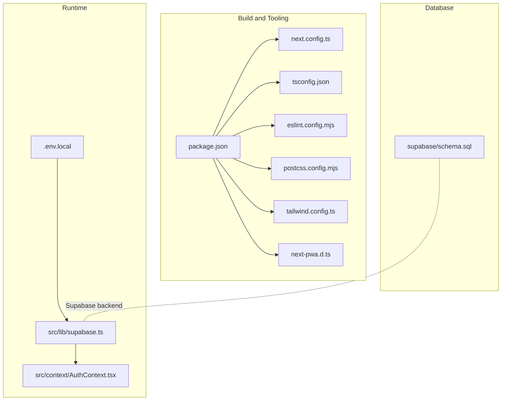
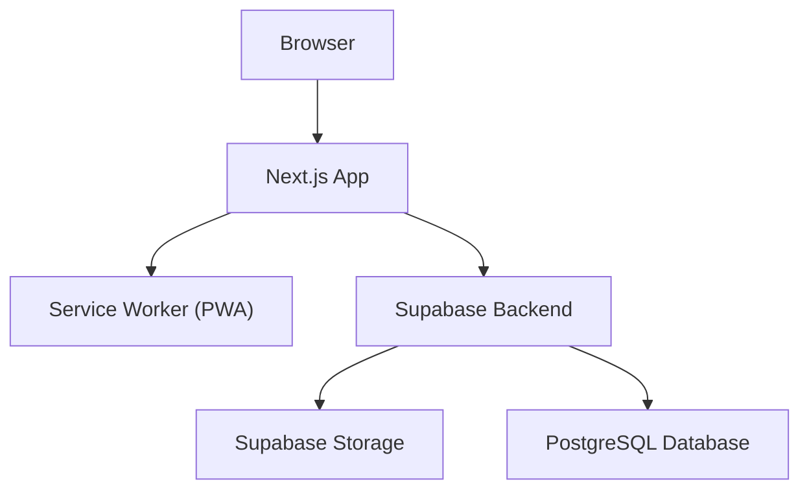
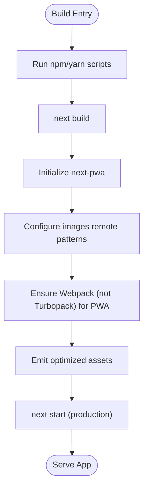
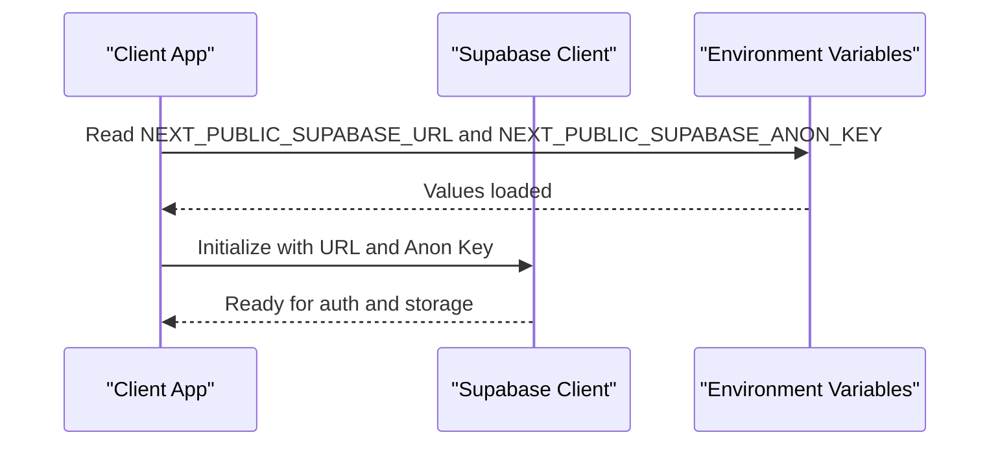
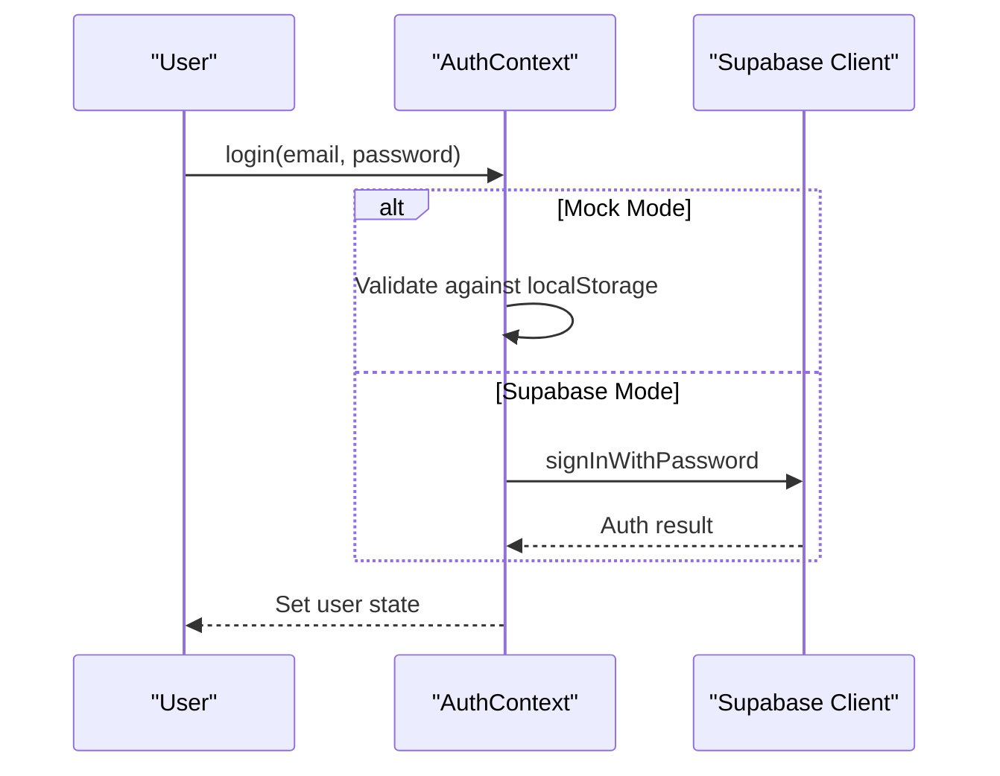
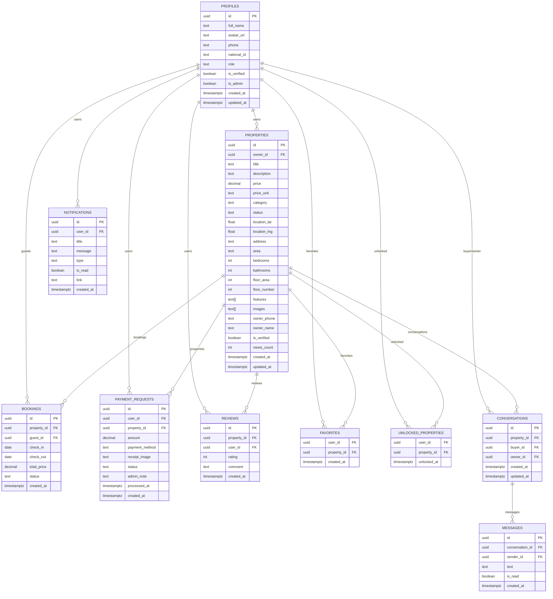
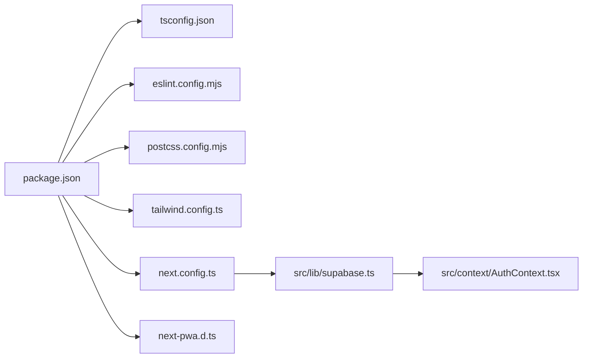

# Deployment and DevOps

<cite>
**Referenced Files in This Document**
- [package.json](file://package.json)
- [next.config.ts](file://next.config.ts)
- [tsconfig.json](file://tsconfig.json)
- [tailwind.config.ts](file://tailwind.config.ts)
- [postcss.config.mjs](file://postcss.config.mjs)
- [eslint.config.mjs](file://eslint.config.mjs)
- [next-pwa.d.ts](file://next-pwa.d.ts)
- [.env.local](file://.env.local)
- [src/lib/supabase.ts](file://src/lib/supabase.ts)
- [src/context/AuthContext.tsx](file://src/context/AuthContext.tsx)
- [supabase/schema.sql](file://supabase/schema.sql)
</cite>

## Table of Contents
1. [Introduction](#introduction)
2. [Project Structure](#project-structure)
3. [Core Components](#core-components)
4. [Architecture Overview](#architecture-overview)
5. [Detailed Component Analysis](#detailed-component-analysis)
6. [Dependency Analysis](#dependency-analysis)
7. [Performance Considerations](#performance-considerations)
8. [Troubleshooting Guide](#troubleshooting-guide)
9. [Conclusion](#conclusion)
10. [Appendices](#appendices)

## Introduction
This document provides comprehensive deployment and DevOps guidance for Gamasa Properties. It covers build configuration, environment variable management, production deployment strategies, and CI/CD pipeline setup tailored for a Next.js application. It also explains the Next.js build process, static site generation, server-side rendering optimizations, deployment to Vercel, environment configuration, monitoring setup, Docker containerization options, cloud deployment strategies, and infrastructure as code practices. Examples of deployment scripts, environment setup, and production monitoring configurations are included.

## Project Structure
Gamasa Properties follows a standard Next.js App Router project layout with TypeScript, Tailwind CSS, and Supabase integration. Key configuration files include Next.js configuration, TypeScript compiler options, PostCSS/Tailwind setup, ESLint configuration, and PWA integration via next-pwa. Environment variables are managed via a local environment file and are consumed by Supabase client initialization and authentication context.

**Diagram sources**
- [package.json](file://package.json#L1-L42)
- [next.config.ts](file://next.config.ts#L1-L31)
- [tsconfig.json](file://tsconfig.json#L1-L43)
- [tailwind.config.ts](file://tailwind.config.ts#L1-L36)
- [postcss.config.mjs](file://postcss.config.mjs#L1-L10)
- [eslint.config.mjs](file://eslint.config.mjs#L1-L19)
- [next-pwa.d.ts](file://next-pwa.d.ts#L1-L23)
- [.env.local](file://.env.local#L1-L4)
- [src/lib/supabase.ts](file://src/lib/supabase.ts#L1-L68)
- [src/context/AuthContext.tsx](file://src/context/AuthContext.tsx#L1-L195)
- [supabase/schema.sql](file://supabase/schema.sql#L1-L416)

**Section sources**
- [package.json](file://package.json#L1-L42)
- [next.config.ts](file://next.config.ts#L1-L31)
- [tsconfig.json](file://tsconfig.json#L1-L43)
- [tailwind.config.ts](file://tailwind.config.ts#L1-L36)
- [postcss.config.mjs](file://postcss.config.mjs#L1-L10)
- [eslint.config.mjs](file://eslint.config.mjs#L1-L19)
- [next-pwa.d.ts](file://next-pwa.d.ts#L1-L23)
- [.env.local](file://.env.local#L1-L4)
- [src/lib/supabase.ts](file://src/lib/supabase.ts#L1-L68)
- [src/context/AuthContext.tsx](file://src/context/AuthContext.tsx#L1-L195)
- [supabase/schema.sql](file://supabase/schema.sql#L1-L416)

## Core Components
- Build and toolchain: Next.js build pipeline, TypeScript compilation, ESLint, Tailwind CSS, and PostCSS.
- PWA configuration: next-pwa integration for service worker and caching.
- Runtime configuration: environment variables for Supabase client initialization and authentication mode toggle.
- Authentication and storage: Supabase client and authentication context provider.
- Database schema: Supabase schema with Row Level Security (RLS) policies and triggers.

**Section sources**
- [package.json](file://package.json#L5-L10)
- [next.config.ts](file://next.config.ts#L5-L10)
- [src/lib/supabase.ts](file://src/lib/supabase.ts#L4-L28)
- [src/context/AuthContext.tsx](file://src/context/AuthContext.tsx#L8-L18)
- [supabase/schema.sql](file://supabase/schema.sql#L170-L250)

## Architecture Overview
The deployment architecture centers around Next.js serving a modern React application with Supabase as the backend. The Supabase client is initialized with environment variables, and the authentication context supports both mock mode and Supabase-backed sessions. The PWA plugin enables offline capabilities and improved performance in production builds.

**Diagram sources**
- [next.config.ts](file://next.config.ts#L5-L10)
- [src/lib/supabase.ts](file://src/lib/supabase.ts#L18-L28)
- [supabase/schema.sql](file://supabase/schema.sql#L1-L50)

## Detailed Component Analysis

### Next.js Build and PWA Configuration
- Build scripts: development, production build, production start, and linting.
- PWA plugin: enabled conditionally, registers service worker, and sets skipWaiting behavior; disabled in development.
- Images optimization: allows HTTPS remote patterns and HTTP localhost for development.
- Turbopack override: explicitly configured to use Webpack for PWA compatibility.

**Diagram sources**
- [package.json](file://package.json#L5-L10)
- [next.config.ts](file://next.config.ts#L5-L28)

**Section sources**
- [package.json](file://package.json#L5-L10)
- [next.config.ts](file://next.config.ts#L5-L28)
- [next-pwa.d.ts](file://next-pwa.d.ts#L3-L21)

### Environment Variable Management
- Supabase client initialization requires public URL and anonymous key.
- Mock mode flag controls authentication flow behavior.
- Local environment file defines Supabase endpoint, anonymous key, and mock mode.

**Diagram sources**
- [.env.local](file://.env.local#L1-L3)
- [src/lib/supabase.ts](file://src/lib/supabase.ts#L4-L28)

**Section sources**
- [.env.local](file://.env.local#L1-L4)
- [src/lib/supabase.ts](file://src/lib/supabase.ts#L4-L28)
- [src/context/AuthContext.tsx](file://src/context/AuthContext.tsx#L8-L9)

### Authentication Context and Session Handling
- Authentication provider manages user state, login, registration, and logout.
- Supports mock mode for local development and fallback behavior.
- Integrates with Supabase for session detection and sign-out when not in mock mode.

**Diagram sources**
- [src/context/AuthContext.tsx](file://src/context/AuthContext.tsx#L80-L115)
- [src/lib/supabase.ts](file://src/lib/supabase.ts#L98-L107)

**Section sources**
- [src/context/AuthContext.tsx](file://src/context/AuthContext.tsx#L1-L195)
- [src/lib/supabase.ts](file://src/lib/supabase.ts#L1-L68)

### Database Schema and Security
- PostgreSQL schema with multiple tables for profiles, properties, bookings, payment requests, reviews, notifications, favorites, unlocked properties, conversations, and messages.
- Row Level Security policies enable fine-grained access control per user and role.
- Triggers maintain audit timestamps and initialize user profiles upon account creation.
- Realtime publication enabled for messages.

**Diagram sources**
- [supabase/schema.sql](file://supabase/schema.sql#L8-L160)
- [supabase/schema.sql](file://supabase/schema.sql#L170-L250)
- [supabase/schema.sql](file://supabase/schema.sql#L254-L292)
- [supabase/schema.sql](file://supabase/schema.sql#L297-L304)
- [supabase/schema.sql](file://supabase/schema.sql#L338-L403)
- [supabase/schema.sql](file://supabase/schema.sql#L408-L416)

**Section sources**
- [supabase/schema.sql](file://supabase/schema.sql#L1-L416)

## Dependency Analysis
- Build-time dependencies: Next.js, TypeScript, Tailwind CSS, PostCSS, ESLint, next-pwa.
- Runtime dependencies: Supabase client libraries, React, Leaflet, date-fns, and related UI packages.
- Toolchain interplay: TypeScript compiler options, PostCSS/Tailwind pipeline, ESLint configuration, and Next.js configuration collectively shape the build and runtime behavior.

**Diagram sources**
- [package.json](file://package.json#L11-L40)
- [next.config.ts](file://next.config.ts#L1-L31)
- [tsconfig.json](file://tsconfig.json#L1-L43)
- [tailwind.config.ts](file://tailwind.config.ts#L1-L36)
- [postcss.config.mjs](file://postcss.config.mjs#L1-L10)
- [eslint.config.mjs](file://eslint.config.mjs#L1-L19)
- [next-pwa.d.ts](file://next-pwa.d.ts#L1-L23)
- [src/lib/supabase.ts](file://src/lib/supabase.ts#L1-L68)
- [src/context/AuthContext.tsx](file://src/context/AuthContext.tsx#L1-L195)

**Section sources**
- [package.json](file://package.json#L11-L40)
- [next.config.ts](file://next.config.ts#L1-L31)
- [tsconfig.json](file://tsconfig.json#L1-L43)
- [tailwind.config.ts](file://tailwind.config.ts#L1-L36)
- [postcss.config.mjs](file://postcss.config.mjs#L1-L10)
- [eslint.config.mjs](file://eslint.config.mjs#L1-L19)
- [next-pwa.d.ts](file://next-pwa.d.ts#L1-L23)
- [src/lib/supabase.ts](file://src/lib/supabase.ts#L1-L68)
- [src/context/AuthContext.tsx](file://src/context/AuthContext.tsx#L1-L195)

## Performance Considerations
- PWA caching: Service worker registration and skipWaiting improve offline availability and update delivery.
- Image optimization: Remote patterns allow secure asset loading; configure appropriate caching headers.
- Build pipeline: Using Webpack ensures compatibility with PWA features; keep dependencies aligned to avoid rebuild issues.
- Tailwind purging: Ensure content globs match component locations to minimize CSS bundle size.

[No sources needed since this section provides general guidance]

## Troubleshooting Guide
- Missing Supabase environment variables: The Supabase client logs warnings and falls back to placeholders if required variables are missing.
- Authentication mode: Verify mock mode flag to ensure expected login behavior during development.
- PWA registration: Confirm service worker registration and caching behavior in production builds.

**Section sources**
- [src/lib/supabase.ts](file://src/lib/supabase.ts#L7-L15)
- [src/context/AuthContext.tsx](file://src/context/AuthContext.tsx#L8-L9)
- [next.config.ts](file://next.config.ts#L5-L10)

## Conclusion
Gamasa Properties leverages a robust Next.js stack with Supabase for backend services and Tailwind CSS for styling. The build pipeline integrates PWA capabilities, while environment variables and authentication context provide flexible runtime behavior. For production, align environment variables, validate Supabase policies, and adopt CI/CD practices that mirror the local build and toolchain configuration.

[No sources needed since this section summarizes without analyzing specific files]

## Appendices

### A. Build and Toolchain Configuration
- Next.js configuration: PWA plugin, image remote patterns, and Webpack override.
- TypeScript configuration: strict mode, bundler resolution, and path aliases.
- Tailwind configuration: content scanning and custom color palette.
- PostCSS configuration: Tailwind and Autoprefixer plugins.
- ESLint configuration: Next.js recommended rules with custom ignores.

**Section sources**
- [next.config.ts](file://next.config.ts#L5-L28)
- [tsconfig.json](file://tsconfig.json#L2-L29)
- [tailwind.config.ts](file://tailwind.config.ts#L4-L34)
- [postcss.config.mjs](file://postcss.config.mjs#L2-L7)
- [eslint.config.mjs](file://eslint.config.mjs#L5-L16)

### B. Environment Setup and Secrets
- Local environment variables: Supabase URL, anonymous key, and mock mode flag.
- Client initialization: Supabase client reads public environment variables and initializes with session persistence and auto-refresh.

**Section sources**
- [.env.local](file://.env.local#L1-L4)
- [src/lib/supabase.ts](file://src/lib/supabase.ts#L4-L28)

### C. Deployment Strategies

#### Vercel Deployment
- Configure environment variables in Vercel dashboard under Settings > Environment Variables.
- Use build and output settings consistent with Next.js configuration.
- Enable preview and production deployments with branch-specific environments.

[No sources needed since this section provides general guidance]

#### Docker Containerization
- Create a minimal Dockerfile that installs dependencies, builds the Next.js app, and runs in production mode.
- Use multi-stage builds to reduce image size.
- Mount persistent volumes for cache and temporary directories if needed.

[No sources needed since this section provides general guidance]

#### Cloud Deployment (non-Vercel)
- Use a containerized approach with the above Dockerfile on platforms supporting containerized deployments.
- Ensure environment variables are injected via platform secrets management.
- Configure health checks and readiness probes pointing to Next.js endpoints.

[No sources needed since this section provides general guidance]

#### Infrastructure as Code
- Define infrastructure using Infrastructure as Code tools to provision Supabase projects, CDN, and domain records.
- Manage environment variables and secrets centrally and inject them into deployment targets.

[No sources needed since this section provides general guidance]

### D. CI/CD Pipeline Setup
- Build stage: Install dependencies, run linter, and produce a production build.
- Test stage: Execute unit and integration tests.
- Deploy stage: Push artifacts to Vercel or container registry; apply environment-specific configuration.
- Rollback strategy: Maintain immutable releases and enable quick rollbacks.

[No sources needed since this section provides general guidance]

### E. Monitoring and Observability
- Application monitoring: Integrate application performance monitoring and error tracking solutions compatible with Next.js.
- Database monitoring: Monitor Supabase metrics and query performance.
- Logging: Centralize logs from the application and database for troubleshooting.

[No sources needed since this section provides general guidance]