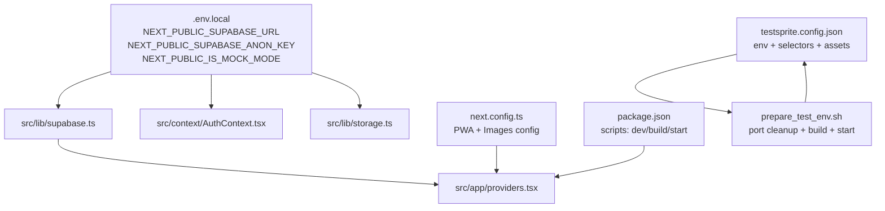
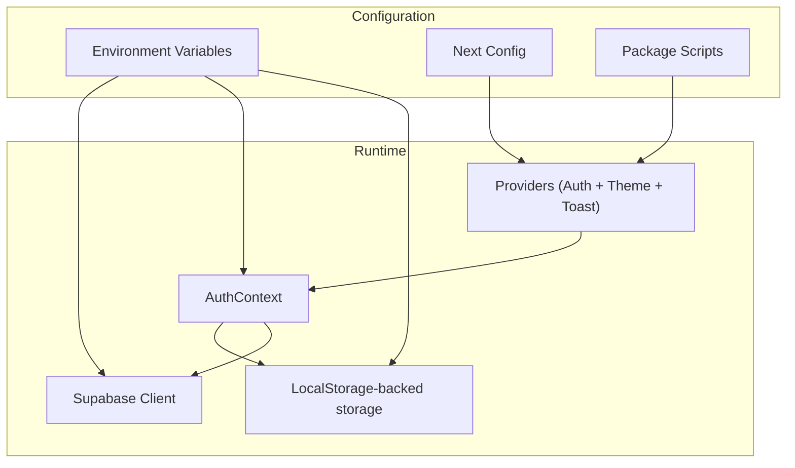
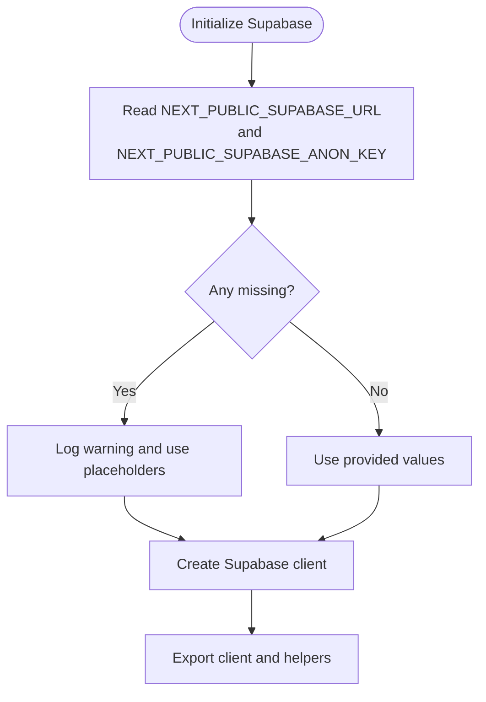
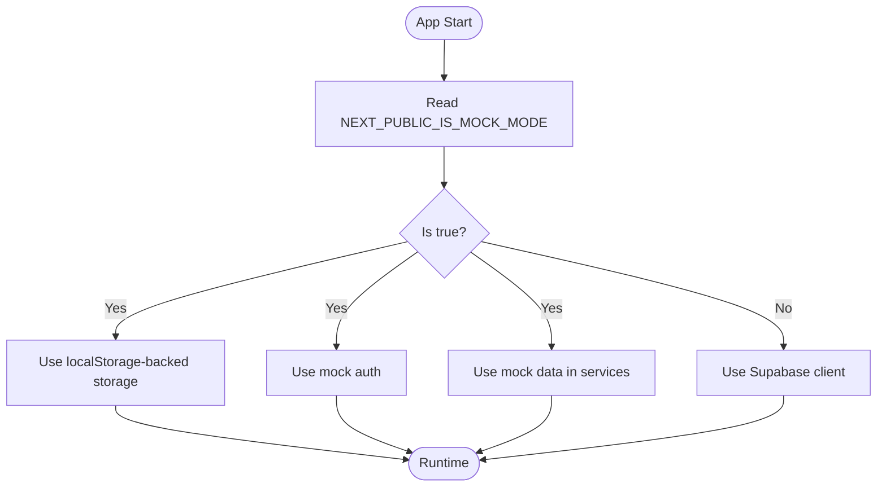
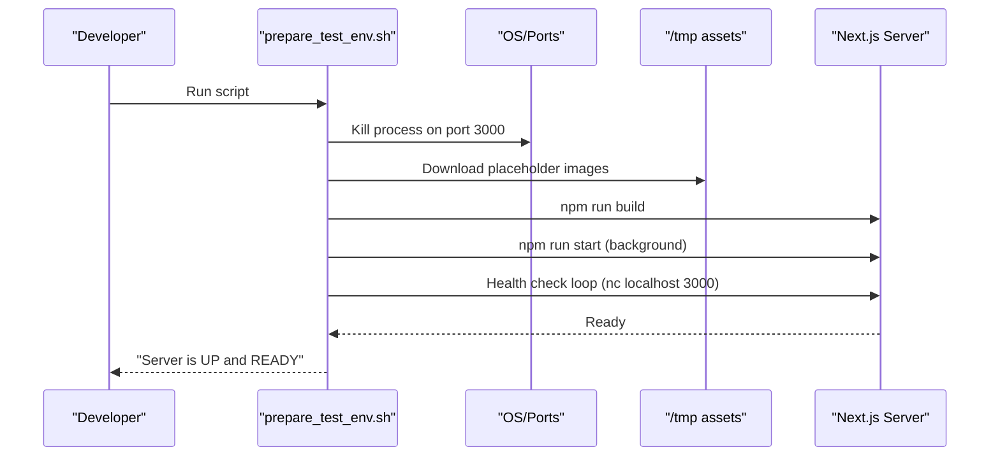
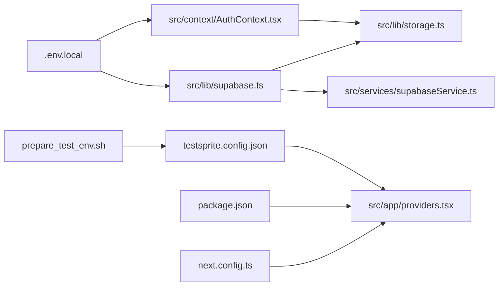

# Environment Management

<cite>
**Referenced Files in This Document**
- [.env.local](file://.env.local)
- [prepare_test_env.sh](file://prepare_test_env.sh)
- [package.json](file://package.json)
- [next.config.ts](file://next.config.ts)
- [src/lib/supabase.ts](file://src/lib/supabase.ts)
- [src/lib/storage.ts](file://src/lib/storage.ts)
- [src/services/supabaseService.ts](file://src/services/supabaseService.ts)
- [src/context/AuthContext.tsx](file://src/context/AuthContext.tsx)
- [src/app/providers.tsx](file://src/app/providers.tsx)
- [testsprite.config.json](file://testsprite.config.json)
- [testsprite_tests/testsprite_frontend_test_plan.json](file://testsprite_tests/testsprite_frontend_test_plan.json)
- [tsconfig.json](file://tsconfig.json)
- [next-pwa.d.ts](file://next-pwa.d.ts)
</cite>

## Table of Contents
1. [Introduction](#introduction)
2. [Project Structure](#project-structure)
3. [Core Components](#core-components)
4. [Architecture Overview](#architecture-overview)
5. [Detailed Component Analysis](#detailed-component-analysis)
6. [Dependency Analysis](#dependency-analysis)
7. [Performance Considerations](#performance-considerations)
8. [Troubleshooting Guide](#troubleshooting-guide)
9. [Conclusion](#conclusion)
10. [Appendices](#appendices)

## Introduction
This document explains how Gamasa Properties manages environments across development, testing, and production. It covers the .env.local configuration, Supabase integration variables, local development setup, automated test environment preparation, secrets management, and environment-specific build optimizations. It also documents the mock mode flag and how it influences runtime behavior.

## Project Structure
The environment configuration spans several files:
- Local environment variables are defined in .env.local.
- Next.js configuration controls PWA behavior and image remote patterns.
- Supabase client initialization reads environment variables and falls back gracefully when missing.
- Mock mode is controlled by an environment flag and influences both storage and authentication flows.
- Automated test environment setup is scripted via prepare_test_env.sh and configured via testsprite.config.json.

**Diagram sources**
- [.env.local](file://.env.local#L1-L4)
- [src/lib/supabase.ts](file://src/lib/supabase.ts#L1-L68)
- [src/context/AuthContext.tsx](file://src/context/AuthContext.tsx#L1-L195)
- [src/lib/storage.ts](file://src/lib/storage.ts#L1-L633)
- [src/app/providers.tsx](file://src/app/providers.tsx#L1-L18)
- [next.config.ts](file://next.config.ts#L1-L31)
- [package.json](file://package.json#L1-L42)
- [testsprite.config.json](file://testsprite.config.json#L1-L36)
- [prepare_test_env.sh](file://prepare_test_env.sh#L1-L36)

**Section sources**
- [.env.local](file://.env.local#L1-L4)
- [next.config.ts](file://next.config.ts#L1-L31)
- [package.json](file://package.json#L1-L42)
- [src/lib/supabase.ts](file://src/lib/supabase.ts#L1-L68)
- [src/context/AuthContext.tsx](file://src/context/AuthContext.tsx#L1-L195)
- [src/lib/storage.ts](file://src/lib/storage.ts#L1-L633)
- [src/app/providers.tsx](file://src/app/providers.tsx#L1-L18)
- [testsprite.config.json](file://testsprite.config.json#L1-L36)
- [prepare_test_env.sh](file://prepare_test_env.sh#L1-L36)

## Core Components
- Environment variables
  - NEXT_PUBLIC_SUPABASE_URL: Supabase project URL.
  - NEXT_PUBLIC_SUPABASE_ANON_KEY: Supabase anonymous API key for client-side access.
  - NEXT_PUBLIC_IS_MOCK_MODE: Enables mock mode for local development and testing.
- Supabase client initialization
  - Reads environment variables and logs warnings if missing.
  - Creates a Supabase client with automatic token refresh and session persistence.
- Mock mode
  - Controlled by NEXT_PUBLIC_IS_MOCK_MODE.
  - Influences storage.ts (localStorage-backed data), AuthContext.tsx (local auth), and supabaseService.ts (mock data and RPC behavior).
- Next.js configuration
  - PWA enabled/disabled per NODE_ENV.
  - Image remote patterns allow HTTPS and localhost.
- Scripts
  - package.json scripts for dev, build, start, and lint.
  - prepare_test_env.sh for automated test environment setup.

**Section sources**
- [.env.local](file://.env.local#L1-L4)
- [src/lib/supabase.ts](file://src/lib/supabase.ts#L1-L68)
- [src/lib/storage.ts](file://src/lib/storage.ts#L180-L230)
- [src/context/AuthContext.tsx](file://src/context/AuthContext.tsx#L8-L18)
- [src/services/supabaseService.ts](file://src/services/supabaseService.ts#L153-L202)
- [next.config.ts](file://next.config.ts#L5-L10)
- [package.json](file://package.json#L5-L10)
- [prepare_test_env.sh](file://prepare_test_env.sh#L1-L36)

## Architecture Overview
The environment architecture integrates Next.js runtime, Supabase client, and mock mode logic. The provider tree initializes authentication and theme support, while Supabase client initialization depends on environment variables.

**Diagram sources**
- [src/app/providers.tsx](file://src/app/providers.tsx#L7-L16)
- [src/context/AuthContext.tsx](file://src/context/AuthContext.tsx#L22-L78)
- [src/lib/storage.ts](file://src/lib/storage.ts#L18-L40)
- [src/lib/supabase.ts](file://src/lib/supabase.ts#L3-L28)
- [next.config.ts](file://next.config.ts#L5-L10)
- [package.json](file://package.json#L5-L10)

## Detailed Component Analysis

### .env.local and Required Supabase Variables
- Purpose: Define client-side Supabase endpoint and anonymous key, plus mock mode flag.
- Required keys:
  - NEXT_PUBLIC_SUPABASE_URL
  - NEXT_PUBLIC_SUPABASE_ANON_KEY
  - NEXT_PUBLIC_IS_MOCK_MODE
- Behavior:
  - If any Supabase variables are missing, the Supabase client logs a warning and uses placeholder values during development.
  - Mock mode flag enables localStorage-backed data and simplified auth flows.

**Section sources**
- [.env.local](file://.env.local#L1-L4)
- [src/lib/supabase.ts](file://src/lib/supabase.ts#L7-L15)

### Supabase Client Initialization
- Reads NEXT_PUBLIC_SUPABASE_URL and NEXT_PUBLIC_SUPABASE_ANON_KEY.
- Warns if either is missing and falls back to placeholders.
- Initializes auth with auto-refresh, session persistence, and URL session detection.
- Exposes STORAGE_BUCKET constant and helper functions for image upload/delete.

**Diagram sources**
- [src/lib/supabase.ts](file://src/lib/supabase.ts#L3-L28)

**Section sources**
- [src/lib/supabase.ts](file://src/lib/supabase.ts#L3-L28)

### Mock Mode and Environment-Specific Behavior
- NEXT_PUBLIC_IS_MOCK_MODE controls:
  - localStorage-backed data in storage.ts (mockProperties, users, notifications).
  - Simplified auth in AuthContext.tsx (no Supabase calls).
  - Mock data and RPC behavior in supabaseService.ts (in-memory lists and sets).
- Default behavior:
  - AuthContext.tsx defaults to mock mode when the flag is not set.

**Diagram sources**
- [src/lib/storage.ts](file://src/lib/storage.ts#L180-L230)
- [src/context/AuthContext.tsx](file://src/context/AuthContext.tsx#L8-L18)
- [src/services/supabaseService.ts](file://src/services/supabaseService.ts#L153-L202)

**Section sources**
- [src/lib/storage.ts](file://src/lib/storage.ts#L180-L230)
- [src/context/AuthContext.tsx](file://src/context/AuthContext.tsx#L8-L18)
- [src/services/supabaseService.ts](file://src/services/supabaseService.ts#L153-L202)

### Next.js Configuration and PWA Behavior
- PWA:
  - Enabled in production; disabled in development.
  - Dest, register, and skipWaiting configured.
- Images:
  - Remote patterns allow HTTPS and http://localhost.
- Turbopack override:
  - Explicitly set to use Webpack for PWA compatibility.

**Section sources**
- [next.config.ts](file://next.config.ts#L5-L10)
- [next.config.ts](file://next.config.ts#L16-L27)
- [next.config.ts](file://next.config.ts#L14-L16)
- [next-pwa.d.ts](file://next-pwa.d.ts#L1-L23)

### Automated Test Environment Setup (prepare_test_env.sh)
- Cleans up port 3000 (Windows note included).
- Generates dummy test assets to /tmp.
- Builds the app to avoid timeouts.
- Starts the production server and waits for health check.
- Keeps the server running until manually stopped.

**Diagram sources**
- [prepare_test_env.sh](file://prepare_test_env.sh#L1-L36)

**Section sources**
- [prepare_test_env.sh](file://prepare_test_env.sh#L1-L36)

### Test Configuration and Secrets (testsprite.config.json)
- Base URL: http://localhost:3000
- Environment:
  - NODE_ENV set to production for tests.
  - TEST_USER_EMAIL and TEST_USER_PASS for test automation.
- Assets:
  - File upload paths pointing to generated images under /tmp.
- Selectors:
  - Map container and loading spinner selectors for reliable UI testing.

**Section sources**
- [testsprite.config.json](file://testsprite.config.json#L1-L36)

### Provider Tree and Environment Integration
- Providers wraps the app with AuthProvider, ThemeProvider, and ToastProvider.
- AuthProvider reads NEXT_PUBLIC_IS_MOCK_MODE and chooses mock/local auth.
- AuthProvider persists user state to localStorage and listens for cross-tab changes.

**Section sources**
- [src/app/providers.tsx](file://src/app/providers.tsx#L7-L16)
- [src/context/AuthContext.tsx](file://src/context/AuthContext.tsx#L22-L78)

### TypeScript Configuration
- Strict compilation settings and path aliases configured.
- Includes Next.js type files and TypeScript sources.

**Section sources**
- [tsconfig.json](file://tsconfig.json#L1-L43)

## Dependency Analysis
The environment relies on the following relationships:
- .env.local feeds Supabase client initialization and mock mode flag.
- Supabase client is consumed by storage.ts and services.
- AuthContext.tsx conditionally uses Supabase or localStorage based on mock mode.
- prepare_test_env.sh builds and starts the app for testsprite.
- testsprite.config.json defines test environment variables and asset paths.

**Diagram sources**
- [.env.local](file://.env.local#L1-L4)
- [src/lib/supabase.ts](file://src/lib/supabase.ts#L1-L68)
- [src/context/AuthContext.tsx](file://src/context/AuthContext.tsx#L1-L195)
- [src/lib/storage.ts](file://src/lib/storage.ts#L1-L633)
- [src/services/supabaseService.ts](file://src/services/supabaseService.ts#L1-L800)
- [src/app/providers.tsx](file://src/app/providers.tsx#L1-L18)
- [next.config.ts](file://next.config.ts#L1-L31)
- [package.json](file://package.json#L1-L42)
- [prepare_test_env.sh](file://prepare_test_env.sh#L1-L36)
- [testsprite.config.json](file://testsprite.config.json#L1-L36)

**Section sources**
- [.env.local](file://.env.local#L1-L4)
- [src/lib/supabase.ts](file://src/lib/supabase.ts#L1-L68)
- [src/context/AuthContext.tsx](file://src/context/AuthContext.tsx#L1-L195)
- [src/lib/storage.ts](file://src/lib/storage.ts#L1-L633)
- [src/services/supabaseService.ts](file://src/services/supabaseService.ts#L1-L800)
- [src/app/providers.tsx](file://src/app/providers.tsx#L1-L18)
- [next.config.ts](file://next.config.ts#L1-L31)
- [package.json](file://package.json#L1-L42)
- [prepare_test_env.sh](file://prepare_test_env.sh#L1-L36)
- [testsprite.config.json](file://testsprite.config.json#L1-L36)

## Performance Considerations
- PWA caching is disabled in development to reduce rebuild overhead; enabled in production for improved offline performance.
- Image remote patterns allow efficient CDN usage for production images.
- Mock mode reduces network overhead during development and testing by using localStorage and in-memory data.

[No sources needed since this section provides general guidance]

## Troubleshooting Guide
- Missing Supabase variables
  - Symptom: Warning logs and placeholder values used.
  - Action: Populate NEXT_PUBLIC_SUPABASE_URL and NEXT_PUBLIC_SUPABASE_ANON_KEY in .env.local.
- Port 3000 conflict during tests
  - Symptom: Script reports port busy.
  - Action: Ensure port 3000 is free or adjust script to target another port.
- Mock mode unexpected behavior
  - Symptom: Auth or data not matching expectations.
  - Action: Verify NEXT_PUBLIC_IS_MOCK_MODE value; confirm localStorage state and mock data in services.
- Test environment readiness
  - Symptom: Tests fail to connect to localhost:3000.
  - Action: Confirm prepare_test_env.sh completed build and start steps; verify health check loop.

**Section sources**
- [src/lib/supabase.ts](file://src/lib/supabase.ts#L7-L15)
- [prepare_test_env.sh](file://prepare_test_env.sh#L8-L9)
- [testsprite.config.json](file://testsprite.config.json#L21-L25)

## Conclusion
Gamasa Properties uses a straightforward environment model: .env.local supplies Supabase credentials and mock mode flag, Next.js configuration optimizes PWA and image handling, and mock mode simplifies development and testing. The prepare_test_env.sh script automates test setup, while testsprite.config.json coordinates test execution and asset paths. Following the best practices below ensures secure, reproducible, and efficient environment management.

## Appendices

### A. Environment Variable Reference
- NEXT_PUBLIC_SUPABASE_URL: Supabase project URL.
- NEXT_PUBLIC_SUPABASE_ANON_KEY: Supabase anonymous API key.
- NEXT_PUBLIC_IS_MOCK_MODE: Enable mock mode for development/testing.

**Section sources**
- [.env.local](file://.env.local#L1-L4)

### B. Security Best Practices for Credentials
- Never commit .env.local or secrets to version control.
- Use separate Supabase projects for development and production.
- Rotate Supabase anonymous keys periodically and restrict access scopes.
- Prefer server-side secrets for sensitive operations; keep only client-safe keys in NEXT_PUBLIC_* variables.

[No sources needed since this section provides general guidance]

### C. Example Environment Configurations
- Development (mock mode)
  - NEXT_PUBLIC_IS_MOCK_MODE=true
  - NEXT_PUBLIC_SUPABASE_URL and NEXT_PUBLIC_SUPABASE_ANON_KEY optional during local dev
- Production (real Supabase)
  - NEXT_PUBLIC_IS_MOCK_MODE=false
  - Provide NEXT_PUBLIC_SUPABASE_URL and NEXT_PUBLIC_SUPABASE_ANON_KEY
- Testing (automated)
  - NODE_ENV=production in testsprite config
  - TEST_USER_EMAIL and TEST_USER_PASS for test accounts

**Section sources**
- [testsprite.config.json](file://testsprite.config.json#L21-L25)
- [prepare_test_env.sh](file://prepare_test_env.sh#L18-L25)

### D. Environment-Specific Build Optimizations
- PWA enabled only in production to improve caching and offline behavior.
- Image remote patterns configured for HTTPS and localhost to support development and CDN delivery.
- Package scripts define dev, build, start, and lint tasks for streamlined workflows.

**Section sources**
- [next.config.ts](file://next.config.ts#L5-L10)
- [next.config.ts](file://next.config.ts#L16-L27)
- [package.json](file://package.json#L5-L10)