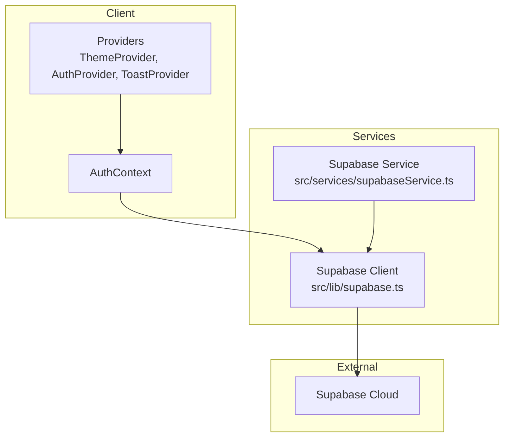
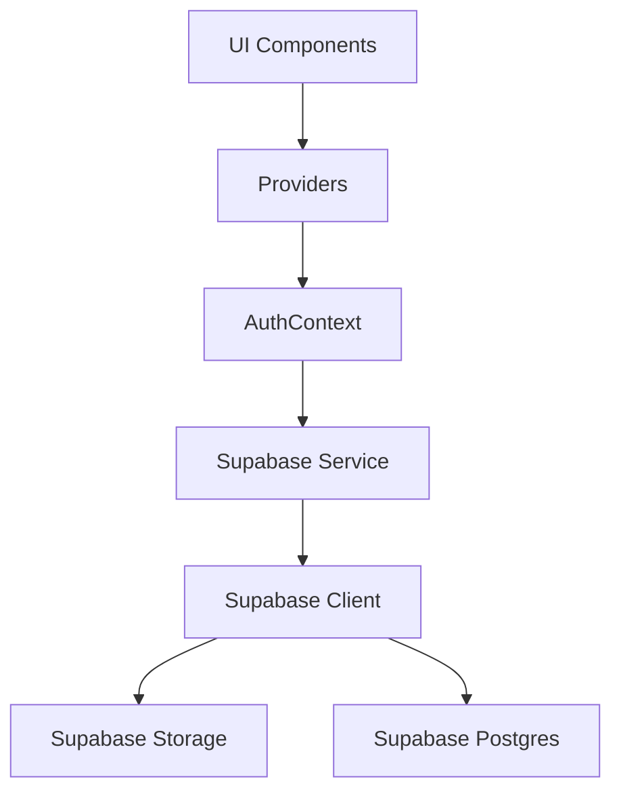
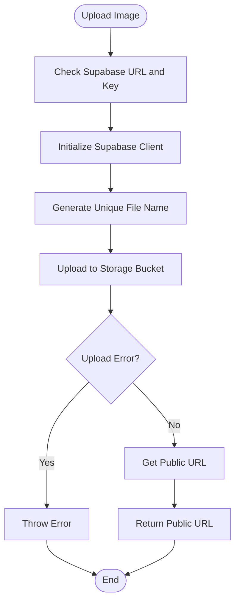
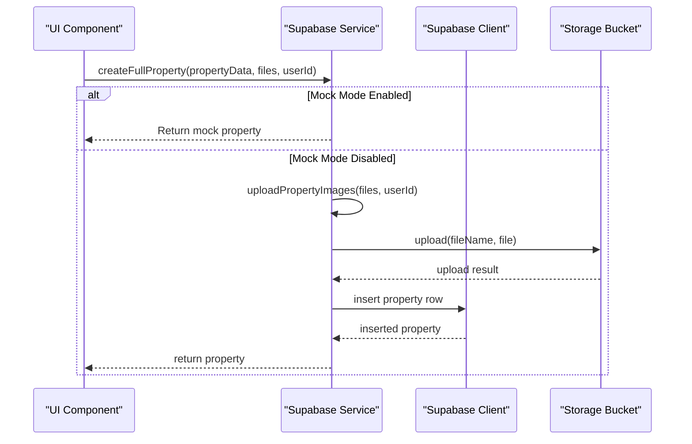
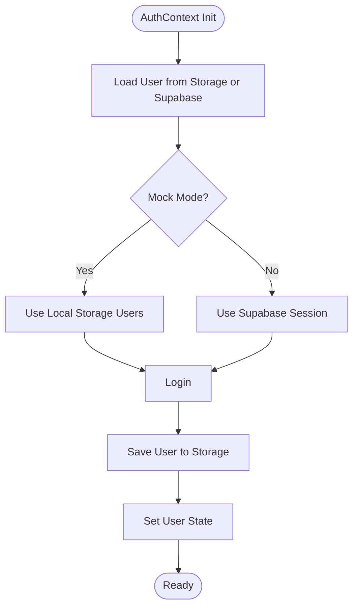
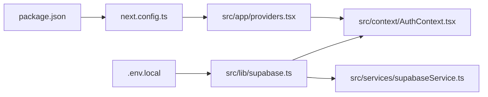

# Monitoring and Maintenance

<cite>
**Referenced Files in This Document**
- [supabase.ts](file://src/lib/supabase.ts)
- [supabaseService.ts](file://src/services/supabaseService.ts)
- [AuthContext.tsx](file://src/context/AuthContext.tsx)
- [providers.tsx](file://src/app/providers.tsx)
- [next.config.ts](file://next.config.ts)
- [.env.local](file://.env.local)
- [package.json](file://package.json)
- [README.md](file://README.md)
- [BOOKING_SYSTEM.md](file://BOOKING_SYSTEM.md)
- [sentry-and-monitoring.md](file://.agent/skills/backend-dev-guidelines/resources/sentry-and-monitoring.md)
- [routing-and-controllers.md](file://.agent/skills/backend-dev-guidelines/resources/routing-and-controllers.md)
</cite>

## Table of Contents
1. [Introduction](#introduction)
2. [Project Structure](#project-structure)
3. [Core Components](#core-components)
4. [Architecture Overview](#architecture-overview)
5. [Detailed Component Analysis](#detailed-component-analysis)
6. [Dependency Analysis](#dependency-analysis)
7. [Performance Considerations](#performance-considerations)
8. [Troubleshooting Guide](#troubleshooting-guide)
9. [Conclusion](#conclusion)
10. [Appendices](#appendices)

## Introduction
This document provides monitoring and maintenance guidance for Gamasa Properties. It covers application performance monitoring, error tracking setup, health checks, logging strategies, performance metrics collection, uptime monitoring, maintenance procedures, deployment processes, incident response protocols, database monitoring via Supabase, application performance indicators, and proactive maintenance tasks. It also includes examples of monitoring dashboards, alerting configurations, and maintenance schedules.

## Project Structure
Gamasa Properties is a Next.js application with Supabase integration for authentication, storage, and relational data. The project includes:
- Client-side providers for theme, auth, and toast notifications
- Supabase client initialization and helper functions for storage
- A service layer wrapping Supabase operations with mock mode support
- Environment configuration for Supabase and mock mode
- PWA configuration for offline caching and service worker registration
- Booking system documentation detailing rental types, payment methods, and database schema

**Diagram sources**
- [providers.tsx](file://src/app/providers.tsx#L1-L18)
- [AuthContext.tsx](file://src/context/AuthContext.tsx#L1-L195)
- [supabase.ts](file://src/lib/supabase.ts#L1-L68)
- [supabaseService.ts](file://src/services/supabaseService.ts#L1-L1384)

**Section sources**
- [providers.tsx](file://src/app/providers.tsx#L1-L18)
- [AuthContext.tsx](file://src/context/AuthContext.tsx#L1-L195)
- [supabase.ts](file://src/lib/supabase.ts#L1-L68)
- [supabaseService.ts](file://src/services/supabaseService.ts#L1-L1384)
- [next.config.ts](file://next.config.ts#L1-L31)
- [.env.local](file://.env.local#L1-L4)
- [package.json](file://package.json#L1-L42)

## Core Components
- Supabase client initialization and storage helpers
- Supabase service layer with CRUD operations, mock mode, and RPC calls
- Authentication provider with mock mode flag and local storage integration
- PWA configuration for caching and offline readiness
- Environment variables for Supabase credentials and mock mode

Key responsibilities:
- Centralized Supabase client creation and error warnings for missing environment variables
- Image upload and deletion via Supabase Storage
- Property operations, favorites, unlocked properties, notifications, reviews, and messaging
- Mock mode toggling for development and testing without database connectivity

**Section sources**
- [supabase.ts](file://src/lib/supabase.ts#L1-L68)
- [supabaseService.ts](file://src/services/supabaseService.ts#L1-L1384)
- [AuthContext.tsx](file://src/context/AuthContext.tsx#L1-L195)
- [next.config.ts](file://next.config.ts#L1-L31)
- [.env.local](file://.env.local#L1-L4)

## Architecture Overview
The application follows a layered architecture:
- UI layer with providers for theme, auth, and toast
- Service layer encapsulating Supabase operations
- Data access layer via Supabase client and Storage
- External dependencies for PWA and third-party libraries

**Diagram sources**
- [providers.tsx](file://src/app/providers.tsx#L1-L18)
- [AuthContext.tsx](file://src/context/AuthContext.tsx#L1-L195)
- [supabaseService.ts](file://src/services/supabaseService.ts#L1-L1384)
- [supabase.ts](file://src/lib/supabase.ts#L1-L68)

## Detailed Component Analysis

### Supabase Client and Storage Helpers
- Initializes the Supabase client with environment variables and warns if they are missing
- Provides upload and delete functions for images using a configured bucket
- Uses cache control and upsert policies for uploads

**Diagram sources**
- [supabase.ts](file://src/lib/supabase.ts#L1-L68)

**Section sources**
- [supabase.ts](file://src/lib/supabase.ts#L1-L68)

### Supabase Service Layer
- Centralizes CRUD operations for properties, profiles, favorites, notifications, reviews, and conversations
- Implements mock mode for development without database connectivity
- Uses RPC calls for property view increments and supports complex queries with filters
- Handles image uploads and deletions during property lifecycle operations

**Diagram sources**
- [supabaseService.ts](file://src/services/supabaseService.ts#L258-L311)
- [supabase.ts](file://src/lib/supabase.ts#L34-L54)

**Section sources**
- [supabaseService.ts](file://src/services/supabaseService.ts#L1-L1384)
- [supabase.ts](file://src/lib/supabase.ts#L1-L68)

### Authentication Provider
- Manages user state with loading indicators and event listeners for cross-tab synchronization
- Supports mock mode for local user storage and Supabase mode for real authentication
- Integrates with Supabase auth for sign-in, sign-up, and sign-out

**Diagram sources**
- [AuthContext.tsx](file://src/context/AuthContext.tsx#L22-L78)
- [AuthContext.tsx](file://src/context/AuthContext.tsx#L80-L170)

**Section sources**
- [AuthContext.tsx](file://src/context/AuthContext.tsx#L1-L195)

### PWA Configuration
- Enables PWA with service worker registration and skip-waiting behavior
- Disables PWA in development for faster iteration
- Configures image remote patterns for security

**Section sources**
- [next.config.ts](file://next.config.ts#L1-L31)

## Dependency Analysis
- Supabase client and storage are initialized once and reused across the application
- The service layer depends on the Supabase client for database and storage operations
- Authentication provider depends on Supabase client and local storage
- PWA configuration integrates with Next.js build pipeline

**Diagram sources**
- [supabase.ts](file://src/lib/supabase.ts#L1-L68)
- [supabaseService.ts](file://src/services/supabaseService.ts#L1-L1384)
- [AuthContext.tsx](file://src/context/AuthContext.tsx#L1-L195)
- [providers.tsx](file://src/app/providers.tsx#L1-L18)
- [next.config.ts](file://next.config.ts#L1-L31)
- [.env.local](file://.env.local#L1-L4)
- [package.json](file://package.json#L1-L42)

**Section sources**
- [supabase.ts](file://src/lib/supabase.ts#L1-L68)
- [supabaseService.ts](file://src/services/supabaseService.ts#L1-L1384)
- [AuthContext.tsx](file://src/context/AuthContext.tsx#L1-L195)
- [providers.tsx](file://src/app/providers.tsx#L1-L18)
- [next.config.ts](file://next.config.ts#L1-L31)
- [.env.local](file://.env.local#L1-L4)
- [package.json](file://package.json#L1-L42)

## Performance Considerations
- Use Supabase Storage cache control for efficient image delivery
- Implement pagination and filtering in service queries to reduce payload sizes
- Leverage PWA caching for improved offline performance and reduced server load
- Monitor Supabase Postgres query performance and consider indexing strategies for frequently queried columns
- Use RPC functions for atomic operations like view increments to avoid race conditions

[No sources needed since this section provides general guidance]

## Troubleshooting Guide
- Missing Supabase environment variables: The client initialization logs warnings and falls back to placeholder values. Ensure environment variables are set in production.
- Authentication issues: Verify mock mode flag and local storage state. Check cross-tab synchronization events.
- Storage upload failures: Inspect error handling in upload and delete functions; confirm bucket permissions and file types.
- Service layer errors: Review console logs for detailed error messages during property operations and image management.

**Section sources**
- [supabase.ts](file://src/lib/supabase.ts#L7-L15)
- [AuthContext.tsx](file://src/context/AuthContext.tsx#L44-L53)
- [supabaseService.ts](file://src/services/supabaseService.ts#L231-L254)

## Conclusion
Gamasa Properties leverages Supabase for authentication, storage, and relational data, with a service layer that supports mock mode for development. The application benefits from PWA capabilities and can be extended with comprehensive monitoring and maintenance practices. By integrating error tracking, performance monitoring, and proactive maintenance tasks, the system can achieve reliable uptime and optimal performance.

[No sources needed since this section summarizes without analyzing specific files]

## Appendices

### Monitoring and Maintenance Procedures

#### Application Performance Monitoring
- Implement Sentry for error tracking and performance monitoring across services
- Initialize Sentry early in server and cron job lifecycles
- Capture rich context including user, tags, and breadcrumbs for debugging
- Use performance spans for critical operations and transactions

**Section sources**
- [sentry-and-monitoring.md](file://.agent/skills/backend-dev-guidelines/resources/sentry-and-monitoring.md#L25-L113)
- [routing-and-controllers.md](file://.agent/skills/backend-dev-guidelines/resources/routing-and-controllers.md#L95-L225)

#### Error Tracking Setup
- Ensure all errors are captured to Sentry with comprehensive context
- Use BaseController pattern for consistent error handling and Sentry integration
- Implement workflow and service layer error handling with proper tagging and user context
- Avoid common mistakes such as swallowing errors or exposing sensitive data

**Section sources**
- [sentry-and-monitoring.md](file://.agent/skills/backend-dev-guidelines/resources/sentry-and-monitoring.md#L17-L33)
- [routing-and-controllers.md](file://.agent/skills/backend-dev-guidelines/resources/routing-and-controllers.md#L95-L127)

#### Health Check Implementation
- Implement health check endpoints that exclude them from Sentry beforeSend filtering
- Monitor database connectivity, storage availability, and service responsiveness
- Integrate health checks with uptime monitoring platforms

**Section sources**
- [sentry-and-monitoring.md](file://.agent/skills/backend-dev-guidelines/resources/sentry-and-monitoring.md#L68-L93)

#### Logging Strategies
- Use structured logging with Sentry breadcrumbs for timeline visibility
- Log info and warning messages with appropriate context for operational insights
- Avoid logging sensitive information and apply PII scrubbing

**Section sources**
- [routing-and-controllers.md](file://.agent/skills/backend-dev-guidelines/resources/routing-and-controllers.md#L191-L217)

#### Performance Metrics Collection
- Capture custom metrics using Sentry metrics for key performance indicators
- Track transaction durations and gauge values for system health
- Monitor database query performance and optimize slow queries

**Section sources**
- [routing-and-controllers.md](file://.agent/skills/backend-dev-guidelines/resources/routing-and-controllers.md#L222-L224)

#### Uptime Monitoring
- Configure uptime monitoring for application endpoints and critical paths
- Set up alerts for service degradation and downtime
- Integrate with incident response workflows for rapid remediation

[No sources needed since this section provides general guidance]

#### Maintenance Procedures
- Regular database maintenance: vacuum, analyze, and index optimization
- Storage cleanup: remove unused images and temporary files
- Dependency updates: keep Supabase client and other dependencies current
- Backup verification: ensure regular backups of critical data

[No sources needed since this section provides general guidance]

#### Update Deployment Processes
- Use CI/CD pipelines for automated builds and deployments
- Perform smoke tests and health checks post-deployment
- Rollback procedures for failed releases

**Section sources**
- [README.md](file://README.md#L32-L37)

#### Incident Response Protocols
- Define escalation paths and communication channels
- Use Sentry alerts to trigger incident response workflows
- Document post-mortem procedures and remediation steps

[No sources needed since this section provides general guidance]

#### Database Monitoring Through Supabase
- Monitor query performance and slow queries
- Track storage usage and optimize image sizes
- Use Supabase dashboard for real-time insights and alerts

**Section sources**
- [BOOKING_SYSTEM.md](file://BOOKING_SYSTEM.md#L295-L341)

#### Application Performance Indicators
- Page load times and First Contentful Paint (FCP)
- Database query latency and throughput
- Storage upload/download speeds
- Authentication and session management performance

[No sources needed since this section provides general guidance]

#### Proactive Maintenance Tasks
- Schedule routine database maintenance and index rebuilds
- Monitor storage quotas and implement retention policies
- Review and update error tracking and alerting configurations regularly

[No sources needed since this section provides general guidance]

#### Examples of Monitoring Dashboards
- Sentry dashboard for error trends and performance metrics
- Supabase dashboard for database and storage analytics
- Uptime monitoring dashboard for endpoint availability

[No sources needed since this section provides general guidance]

#### Alerting Configurations
- Threshold-based alerts for error rates and response times
- Health check failure alerts
- Database and storage capacity alerts

[No sources needed since this section provides general guidance]

#### Maintenance Schedules
- Daily: health checks and basic monitoring
- Weekly: database maintenance and storage cleanup
- Monthly: dependency updates and performance reviews
- Quarterly: capacity planning and disaster recovery drills

[No sources needed since this section provides general guidance]