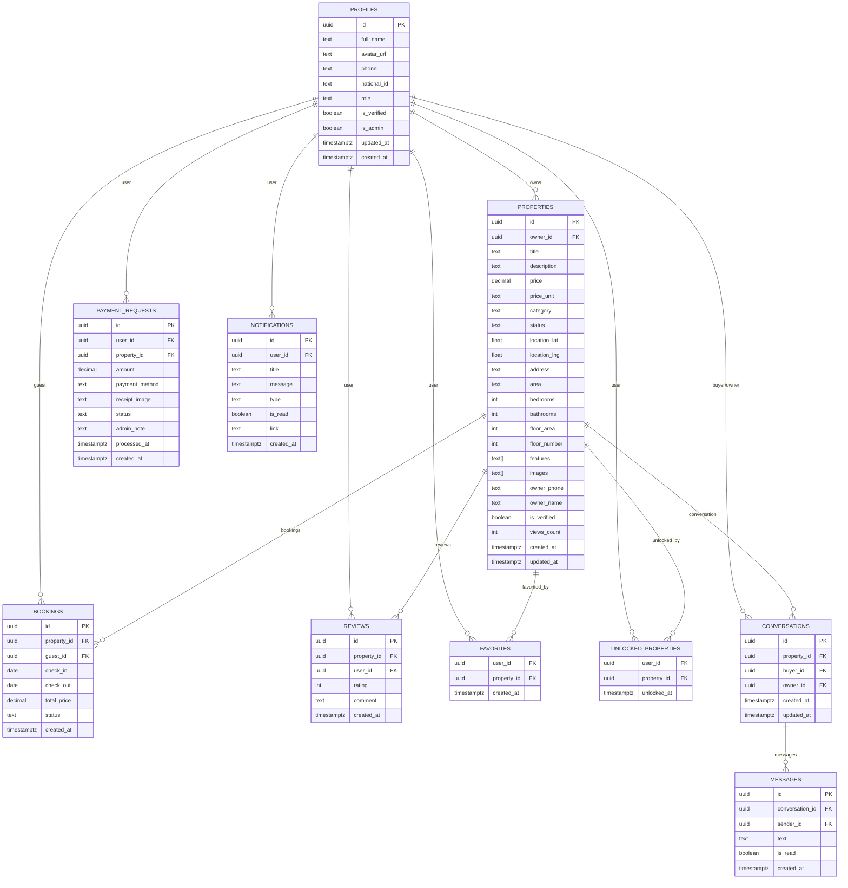

# Getting Started

<cite>
**Referenced Files in This Document**
- [package.json](file://package.json)
- [README.md](file://README.md)
- [.env.local](file://.env.local)
- [next.config.ts](file://next.config.ts)
- [tsconfig.json](file://tsconfig.json)
- [tailwind.config.ts](file://tailwind.config.ts)
- [eslint.config.mjs](file://eslint.config.mjs)
- [src/lib/supabase.ts](file://src/lib/supabase.ts)
- [supabase/schema.sql](file://supabase/schema.sql)
- [supabase/functions.sql](file://supabase/functions.sql)
- [src/app/layout.tsx](file://src/app/layout.tsx)
- [src/app/providers.tsx](file://src/app/providers.tsx)
- [src/context/AuthContext.tsx](file://src/context/AuthContext.tsx)
- [src/services/supabaseService.ts](file://src/services/supabaseService.ts)
- [src/components/auth/LoginForm.tsx](file://src/components/auth/LoginForm.tsx)
</cite>

## Table of Contents
1. [Introduction](#introduction)
2. [Project Structure](#project-structure)
3. [Core Components](#core-components)
4. [Architecture Overview](#architecture-overview)
5. [Detailed Component Analysis](#detailed-component-analysis)
6. [Dependency Analysis](#dependency-analysis)
7. [Performance Considerations](#performance-considerations)
8. [Troubleshooting Guide](#troubleshooting-guide)
9. [Conclusion](#conclusion)
10. [Appendices](#appendices)

## Introduction
This guide helps you install, configure, and run the Gamasa Properties application locally. It covers prerequisites, environment setup, database configuration with Supabase, local development, and verification steps. It also includes troubleshooting tips and recommended development practices.

## Project Structure
Gamasa Properties is a Next.js 16 app using TypeScript, Tailwind CSS, and Supabase for authentication and data. The repository includes:
- Application code under src/
- Supabase schema and functions under supabase/
- Build and tooling configurations (Next.js, TypeScript, ESLint, PostCSS/Tailwind)
- Environment variables in .env.local
- Example pages and components for authentication and property browsing

**Diagram sources**
- [next.config.ts](file://next.config.ts#L1-L31)
- [tsconfig.json](file://tsconfig.json#L1-L43)
- [tailwind.config.ts](file://tailwind.config.ts#L1-L36)
- [eslint.config.mjs](file://eslint.config.mjs#L1-L19)
- [.env.local](file://.env.local#L1-L4)
- [src/lib/supabase.ts](file://src/lib/supabase.ts#L1-L68)
- [src/context/AuthContext.tsx](file://src/context/AuthContext.tsx#L1-L195)
- [src/services/supabaseService.ts](file://src/services/supabaseService.ts#L1-L800)
- [src/app/providers.tsx](file://src/app/providers.tsx#L1-L18)
- [src/components/auth/LoginForm.tsx](file://src/components/auth/LoginForm.tsx#L1-L220)
- [supabase/schema.sql](file://supabase/schema.sql#L1-L416)
- [supabase/functions.sql](file://supabase/functions.sql#L1-L71)

**Section sources**
- [package.json](file://package.json#L1-L42)
- [README.md](file://README.md#L1-L37)
- [next.config.ts](file://next.config.ts#L1-L31)
- [tsconfig.json](file://tsconfig.json#L1-L43)
- [tailwind.config.ts](file://tailwind.config.ts#L1-L36)
- [eslint.config.mjs](file://eslint.config.mjs#L1-L19)

## Core Components
- Next.js configuration with PWA support and image remote patterns
- TypeScript strict configuration with path aliases
- Tailwind CSS configuration for design tokens and form plugin
- ESLint configuration aligned with Next.js
- Supabase client initialization and storage helpers
- Authentication context supporting mock mode and Supabase sessions
- Supabase service wrapper for properties, images, favorites, messaging, and more
- App layout with metadata, viewport, and providers

**Section sources**
- [next.config.ts](file://next.config.ts#L1-L31)
- [tsconfig.json](file://tsconfig.json#L1-L43)
- [tailwind.config.ts](file://tailwind.config.ts#L1-L36)
- [eslint.config.mjs](file://eslint.config.mjs#L1-L19)
- [src/lib/supabase.ts](file://src/lib/supabase.ts#L1-L68)
- [src/context/AuthContext.tsx](file://src/context/AuthContext.tsx#L1-L195)
- [src/services/supabaseService.ts](file://src/services/supabaseService.ts#L1-L800)
- [src/app/layout.tsx](file://src/app/layout.tsx#L1-L90)
- [src/app/providers.tsx](file://src/app/providers.tsx#L1-L18)

## Architecture Overview
High-level runtime architecture for local development:
- Client-side Next.js app with TypeScript and Tailwind
- Supabase client configured via environment variables
- Optional mock mode flag for local auth and data
- PWA enabled in production-like builds

**Diagram sources**
- [src/app/layout.tsx](file://src/app/layout.tsx#L1-L90)
- [src/app/providers.tsx](file://src/app/providers.tsx#L1-L18)
- [src/context/AuthContext.tsx](file://src/context/AuthContext.tsx#L1-L195)
- [src/services/supabaseService.ts](file://src/services/supabaseService.ts#L1-L800)
- [src/lib/supabase.ts](file://src/lib/supabase.ts#L1-L68)
- [supabase/schema.sql](file://supabase/schema.sql#L1-L416)
- [supabase/functions.sql](file://supabase/functions.sql#L1-L71)
- [next.config.ts](file://next.config.ts#L1-L31)
- [tsconfig.json](file://tsconfig.json#L1-L43)
- [tailwind.config.ts](file://tailwind.config.ts#L1-L36)
- [.env.local](file://.env.local#L1-L4)

## Detailed Component Analysis

### Prerequisites
- Node.js LTS recommended by the project’s Next.js version
- Package manager: npm, yarn, pnpm, or bun (all supported by the project scripts)
- Git for version control
- Text editor or IDE with TypeScript and ESLint support

Verification steps:
- Confirm Node.js and npm versions
- Verify package manager availability
- Clone repository and navigate to project root

**Section sources**
- [package.json](file://package.json#L1-L42)
- [README.md](file://README.md#L1-L37)

### Step-by-Step Installation
1. Install dependencies
   - Run: npm install (or yarn install or pnpm install or bun install)
2. Prepare environment variables
   - Copy .env.local.example to .env.local if present, otherwise create .env.local
   - Add Supabase URL and ANON KEY
   - Optionally enable mock mode for local development
3. Build and run
   - Development: npm run dev
   - Open http://localhost:3000 in your browser

Notes:
- The project supports multiple package managers as per scripts
- The app expects NEXT_PUBLIC_SUPABASE_URL and NEXT_PUBLIC_SUPABASE_ANON_KEY

**Section sources**
- [package.json](file://package.json#L5-L10)
- [.env.local](file://.env.local#L1-L4)
- [README.md](file://README.md#L5-L17)

### Environment Variables
Required variables:
- NEXT_PUBLIC_SUPABASE_URL: Supabase project URL
- NEXT_PUBLIC_SUPABASE_ANON_KEY: Supabase anonymous key
- NEXT_PUBLIC_IS_MOCK_MODE: Enable/disable mock mode for auth/data

Optional variables:
- NEXT_PUBLIC_SITE_URL: Used in metadata and Open Graph

Validation:
- The Supabase client logs a warning if variables are missing and falls back to placeholders

**Section sources**
- [.env.local](file://.env.local#L1-L4)
- [src/lib/supabase.ts](file://src/lib/supabase.ts#L3-L15)
- [src/app/layout.tsx](file://src/app/layout.tsx#L20-L26)

### Database Setup with Supabase
Schema overview:
- Profiles, Properties, Bookings, Payment Requests, Reviews, Notifications, Favorites, Unlocked Properties, Conversations, Messages
- Row Level Security (RLS) policies for data isolation
- Triggers and functions for automatic profile creation and view increments
- Realtime publication for messages

Setup steps:
1. Create a new Supabase project
2. In the SQL Editor, run supabase/schema.sql to create tables, policies, triggers, and functions
3. Confirm that the Supabase URL and ANON KEY are set in .env.local
4. Start the app and verify authentication and property listing

**Diagram sources**
- [supabase/schema.sql](file://supabase/schema.sql#L7-L167)
- [supabase/schema.sql](file://supabase/schema.sql#L338-L403)

**Section sources**
- [supabase/schema.sql](file://supabase/schema.sql#L1-L416)
- [supabase/functions.sql](file://supabase/functions.sql#L1-L71)

### Local Development Setup
- Install dependencies
- Configure .env.local with Supabase URL and ANON KEY
- Run the development server
- Access http://localhost:3000

Mock mode:
- The project includes a mock mode flag that affects authentication and data retrieval
- When enabled, the app uses in-memory data and avoids real Supabase calls

**Section sources**
- [package.json](file://package.json#L5-L10)
- [.env.local](file://.env.local#L1-L4)
- [src/context/AuthContext.tsx](file://src/context/AuthContext.tsx#L8-L9)
- [src/services/supabaseService.ts](file://src/services/supabaseService.ts#L5-L6)

### Running the Development Server
- Use the dev script from package.json
- The server starts on port 3000 by default
- Open the browser to http://localhost:3000

Verification checklist:
- App loads without critical errors
- Navigation works (home, login, register, profile)
- Authentication UI renders (login form)
- Images and layout follow Tailwind theme

**Section sources**
- [package.json](file://package.json#L5-L10)
- [README.md](file://README.md#L5-L17)
- [src/components/auth/LoginForm.tsx](file://src/components/auth/LoginForm.tsx#L1-L220)

### Accessing the Application Locally
- Default URL: http://localhost:3000
- RTL Arabic layout and metadata configured in the root layout
- Manifest and PWA-related assets are included

**Section sources**
- [src/app/layout.tsx](file://src/app/layout.tsx#L20-L54)

### Verifying Successful Installation
- No TypeScript/JSX errors in terminal
- Browser shows the home page
- Login form appears and responds to input
- No warnings about missing Supabase environment variables after setting .env.local

**Section sources**
- [src/lib/supabase.ts](file://src/lib/supabase.ts#L7-L15)
- [src/components/auth/LoginForm.tsx](file://src/components/auth/LoginForm.tsx#L20-L46)

### Authentication Flow (Local)

**Diagram sources**
- [src/components/auth/LoginForm.tsx](file://src/components/auth/LoginForm.tsx#L20-L46)
- [src/context/AuthContext.tsx](file://src/context/AuthContext.tsx#L80-L115)
- [src/services/supabaseService.ts](file://src/services/supabaseService.ts#L154-L202)

## Dependency Analysis
- Next.js runtime and PWA integration
- Supabase SDK and SSR utilities
- Tailwind CSS and form plugin
- React and Leaflet for maps
- TypeScript strict mode and path aliases
- ESLint with Next.js presets

**Diagram sources**
- [package.json](file://package.json#L11-L40)

**Section sources**
- [package.json](file://package.json#L11-L40)

## Performance Considerations
- Use the dev server for iteration; PWA registration is disabled in development
- Keep image sizes reasonable; the app allows uploads to Supabase Storage
- Leverage Tailwind utilities to avoid unnecessary CSS
- Use ESLint to catch performance pitfalls early

[No sources needed since this section provides general guidance]

## Troubleshooting Guide
Common issues and resolutions:
- Missing Supabase variables
  - Symptom: Warning about missing environment variables
  - Fix: Add NEXT_PUBLIC_SUPABASE_URL and NEXT_PUBLIC_SUPABASE_ANON_KEY to .env.local
- Supabase connection errors
  - Symptom: Errors when fetching data or signing in
  - Fix: Verify Supabase project is running and schema is applied
- Mock mode confusion
  - Symptom: Login/register behaves differently than expected
  - Fix: Toggle NEXT_PUBLIC_IS_MOCK_MODE in .env.local and restart dev server
- PWA behavior in development
  - Symptom: PWA install prompt or service worker activation
  - Fix: PWA registration is intentionally disabled in development

**Section sources**
- [src/lib/supabase.ts](file://src/lib/supabase.ts#L7-L15)
- [.env.local](file://.env.local#L1-L4)
- [next.config.ts](file://next.config.ts#L9-L9)

## Conclusion
You now have the prerequisites, environment variables, and database schema to run Gamasa Properties locally. Use the development server, verify the UI, and explore authentication and property features. For production, connect to a real Supabase project and disable mock mode.

[No sources needed since this section summarizes without analyzing specific files]

## Appendices

### IDE Recommendations
- VS Code with extensions for TypeScript, ESLint, Tailwind CSS
- Optional: Prettier for formatting, GitLens for history

[No sources needed since this section provides general guidance]

### Development Workflow Best Practices
- Keep environment secrets in .env.local (do not commit)
- Run ESLint and fix issues before committing
- Test authentication flows locally with mock mode
- Keep Supabase schema synchronized with schema.sql

**Section sources**
- [eslint.config.mjs](file://eslint.config.mjs#L1-L19)
- [supabase/schema.sql](file://supabase/schema.sql#L1-L416)