# Conversation Management

<cite>
**Referenced Files in This Document**
- [messages/page.tsx](file://src/app/messages/page.tsx)
- [messages/[id]/page.tsx](file://src/app/messages/[id]/page.tsx)
- [supabaseService.ts](file://src/services/supabaseService.ts)
- [messagingService.ts](file://src/services/messagingService.ts)
- [PropertyContextCard.tsx](file://src/components/chat/PropertyContextCard.tsx)
- [ChatInput.tsx](file://src/components/chat/ChatInput.tsx)
- [MessageBubble.tsx](file://src/components/chat/MessageBubble.tsx)
- [SystemMessage.tsx](file://src/components/chat/SystemMessage.tsx)
- [MediaPermissionCard.tsx](file://src/components/chat/MediaPermissionCard.tsx)
- [SecurityAlert.tsx](file://src/components/chat/SecurityAlert.tsx)
- [UnreadBadge.tsx](file://src/components/chat/UnreadBadge.tsx)
- [TypingIndicator.tsx](file://src/components/chat/TypingIndicator.tsx)
- [supabase.ts](file://src/lib/supabase.ts)
- [validation.ts](file://src/utils/validation.ts)
- [messaging.ts](file://src/types/messaging.ts)
</cite>

## Table of Contents
1. [Introduction](#introduction)
2. [Project Structure](#project-structure)
3. [Core Components](#core-components)
4. [Architecture Overview](#architecture-overview)
5. [Detailed Component Analysis](#detailed-component-analysis)
6. [Dependency Analysis](#dependency-analysis)
7. [Performance Considerations](#performance-considerations)
8. [Troubleshooting Guide](#troubleshooting-guide)
9. [Conclusion](#conclusion)

## Introduction
This document explains the conversation management system for Gamasa Properties. It covers how conversations are created, how participants are managed, and how property context is integrated into chats. It also documents message threading, organization, quick replies, media permissions, moderation aids, search, and analytics-ready patterns. The goal is to help developers and product teams implement tenant/landlord communication flows with property-linked messaging, automated response patterns, and robust moderation tools.

## Project Structure
The conversation system spans three layers:
- Pages: Next.js app router pages that orchestrate UI and lifecycle.
- Services: Supabase-backed service layer for persistence, real-time, and media.
- Components: Reusable UI parts for chat input, property context, and message rendering.

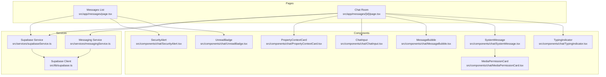

**Diagram sources**
- [messages/page.tsx](file://src/app/messages/page.tsx#L1-L197)
- [messages/[id]/page.tsx](file://src/app/messages/[id]/page.tsx#L1-L280)
- [supabaseService.ts](file://src/services/supabaseService.ts#L739-L1000)
- [messagingService.ts](file://src/services/messagingService.ts#L1-L123)
- [PropertyContextCard.tsx](file://src/components/chat/PropertyContextCard.tsx#L1-L47)
- [ChatInput.tsx](file://src/components/chat/ChatInput.tsx#L1-L297)
- [MessageBubble.tsx](file://src/components/chat/MessageBubble.tsx#L1-L53)
- [SystemMessage.tsx](file://src/components/chat/SystemMessage.tsx#L1-L43)
- [MediaPermissionCard.tsx](file://src/components/chat/MediaPermissionCard.tsx#L1-L43)
- [SecurityAlert.tsx](file://src/components/chat/SecurityAlert.tsx#L1-L13)
- [UnreadBadge.tsx](file://src/components/chat/UnreadBadge.tsx#L1-L14)
- [TypingIndicator.tsx](file://src/components/chat/TypingIndicator.tsx#L1-L12)
- [supabase.ts](file://src/lib/supabase.ts#L1-L68)

**Section sources**
- [messages/page.tsx](file://src/app/messages/page.tsx#L1-L197)
- [messages/[id]/page.tsx](file://src/app/messages/[id]/page.tsx#L1-L280)
- [supabaseService.ts](file://src/services/supabaseService.ts#L739-L1000)
- [messagingService.ts](file://src/services/messagingService.ts#L1-L123)
- [PropertyContextCard.tsx](file://src/components/chat/PropertyContextCard.tsx#L1-L47)
- [ChatInput.tsx](file://src/components/chat/ChatInput.tsx#L1-L297)
- [MessageBubble.tsx](file://src/components/chat/MessageBubble.tsx#L1-L53)
- [SystemMessage.tsx](file://src/components/chat/SystemMessage.tsx#L1-L43)
- [MediaPermissionCard.tsx](file://src/components/chat/MediaPermissionCard.tsx#L1-L43)
- [SecurityAlert.tsx](file://src/components/chat/SecurityAlert.tsx#L1-L13)
- [UnreadBadge.tsx](file://src/components/chat/UnreadBadge.tsx#L1-L14)
- [TypingIndicator.tsx](file://src/components/chat/TypingIndicator.tsx#L1-L12)
- [supabase.ts](file://src/lib/supabase.ts#L1-L68)

## Core Components
- Conversation list page: Loads and filters conversations, shows property and participant previews, and unread indicators.
- Chat room page: Renders property context card, message threads grouped by date, real-time updates, typing indicators, and media permission requests.
- Messaging service: Handles media uploads, permission requests, and typing broadcasts.
- UI components: Property context card, chat input with quick actions and attachments, message bubbles, system messages, security alerts, unread badges, and typing indicators.

**Section sources**
- [messages/page.tsx](file://src/app/messages/page.tsx#L16-L197)
- [messages/[id]/page.tsx](file://src/app/messages/[id]/page.tsx#L23-L280)
- [messagingService.ts](file://src/services/messagingService.ts#L1-L123)
- [PropertyContextCard.tsx](file://src/components/chat/PropertyContextCard.tsx#L1-L47)
- [ChatInput.tsx](file://src/components/chat/ChatInput.tsx#L1-L297)
- [MessageBubble.tsx](file://src/components/chat/MessageBubble.tsx#L1-L53)
- [SystemMessage.tsx](file://src/components/chat/SystemMessage.tsx#L1-L43)
- [SecurityAlert.tsx](file://src/components/chat/SecurityAlert.tsx#L1-L13)
- [UnreadBadge.tsx](file://src/components/chat/UnreadBadge.tsx#L1-L14)
- [TypingIndicator.tsx](file://src/components/chat/TypingIndicator.tsx#L1-L12)

## Architecture Overview
The system uses Supabase for real-time messaging, presence, and storage. The pages subscribe to Postgres changes and broadcast channels to keep the UI fresh and interactive. Media is stored in Supabase buckets and referenced via public URLs.

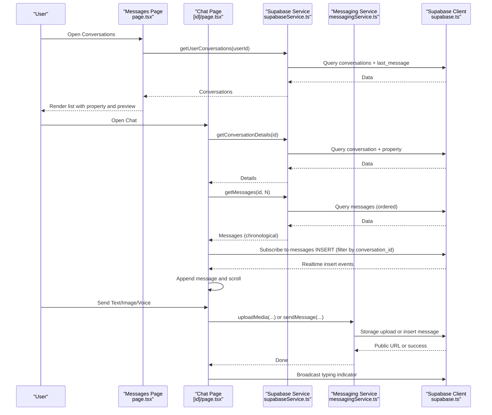

**Diagram sources**
- [messages/page.tsx](file://src/app/messages/page.tsx#L33-L60)
- [messages/[id]/page.tsx](file://src/app/messages/[id]/page.tsx#L35-L102)
- [supabaseService.ts](file://src/services/supabaseService.ts#L771-L848)
- [messagingService.ts](file://src/services/messagingService.ts#L6-L33)
- [supabase.ts](file://src/lib/supabase.ts#L1-L68)

## Detailed Component Analysis

### Conversation Creation and Participant Management
- Creation: A unique conversation is created per property and pair of participants (tenant and landlord). If an identical conversation exists, it reuses the existing ID.
- Participants: Each conversation links to property, owner, and buyer profiles. The chat header displays the other participant’s avatar and online status.
- Access control: The list and chat pages restrict access to authenticated users. The service enforces participant-only access via filters.

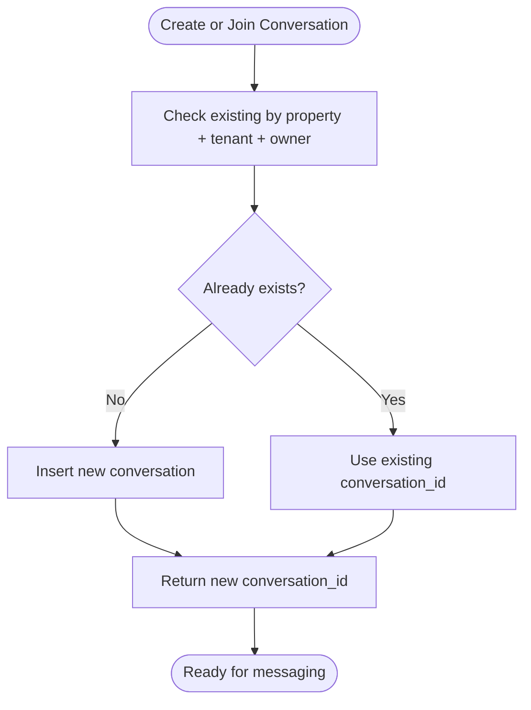

**Diagram sources**
- [supabaseService.ts](file://src/services/supabaseService.ts#L740-L769)

**Section sources**
- [supabaseService.ts](file://src/services/supabaseService.ts#L740-L769)
- [messages/[id]/page.tsx](file://src/app/messages/[id]/page.tsx#L85-L94)

### Property Context Integration
- Property context card appears at the top of the chat room, linking to the property page and displaying title, location, and price.
- The conversation list also surfaces the property title and last message preview.

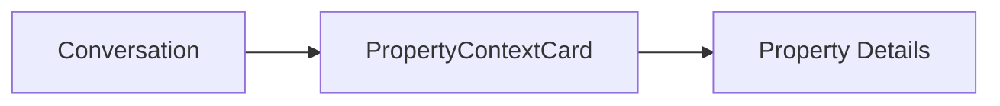

**Diagram sources**
- [messages/[id]/page.tsx](file://src/app/messages/[id]/page.tsx#L242-L245)
- [PropertyContextCard.tsx](file://src/components/chat/PropertyContextCard.tsx#L1-L47)
- [messages/page.tsx](file://src/app/messages/page.tsx#L176-L179)

**Section sources**
- [messages/[id]/page.tsx](file://src/app/messages/[id]/page.tsx#L242-L245)
- [PropertyContextCard.tsx](file://src/components/chat/PropertyContextCard.tsx#L1-L47)
- [messages/page.tsx](file://src/app/messages/page.tsx#L176-L179)

### Message Organization and Threading
- Messages are fetched in reverse chronological order and rendered chronologically with date separators.
- Message types supported: text, image, voice, system.
- Read receipts: On entry, messages are marked as read for the current user.

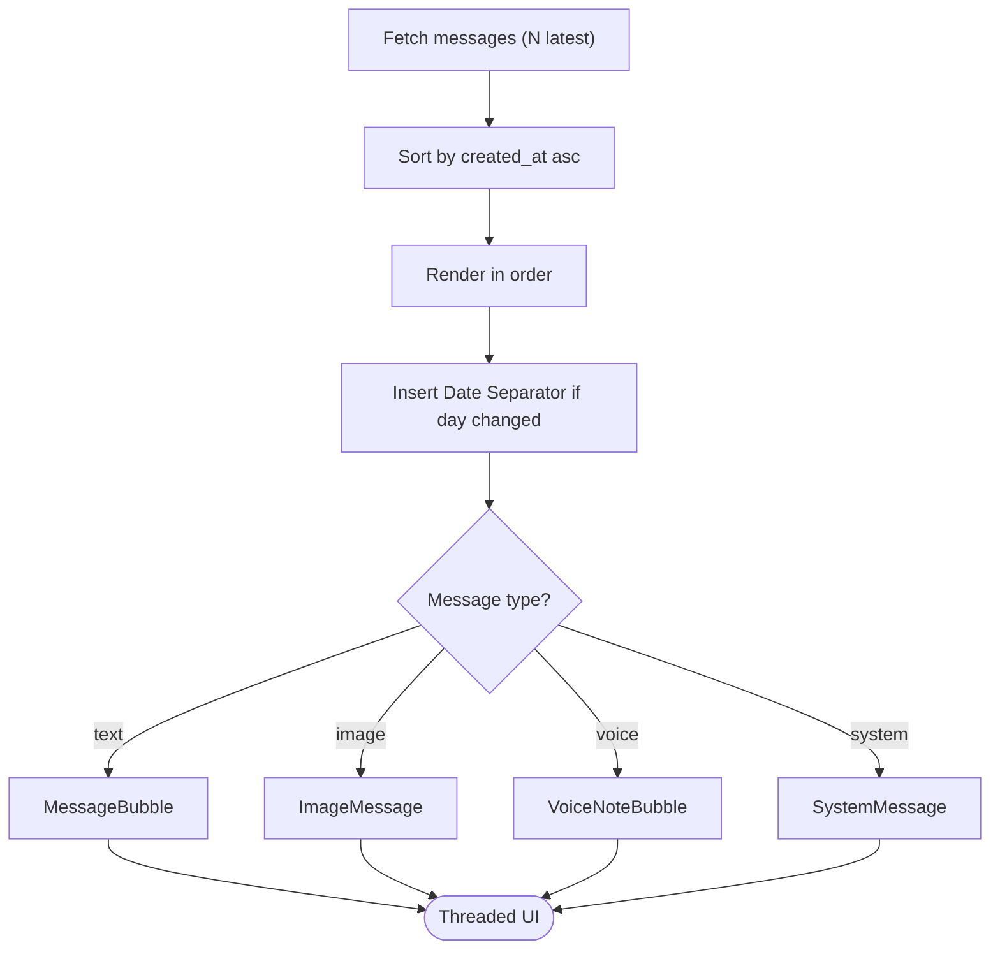

**Diagram sources**
- [messages/[id]/page.tsx](file://src/app/messages/[id]/page.tsx#L96-L102)
- [messages/[id]/page.tsx](file://src/app/messages/[id]/page.tsx#L136-L189)
- [MessageBubble.tsx](file://src/components/chat/MessageBubble.tsx#L1-L53)
- [supabaseService.ts](file://src/services/supabaseService.ts#L812-L848)

**Section sources**
- [messages/[id]/page.tsx](file://src/app/messages/[id]/page.tsx#L96-L102)
- [messages/[id]/page.tsx](file://src/app/messages/[id]/page.tsx#L136-L189)
- [MessageBubble.tsx](file://src/components/chat/MessageBubble.tsx#L1-L53)
- [supabaseService.ts](file://src/services/supabaseService.ts#L812-L848)

### Quick Reply Systems
- Quick replies provide common templates for tenants (e.g., availability, pricing, photos, location).
- Chat input exposes quick actions for fast replies.

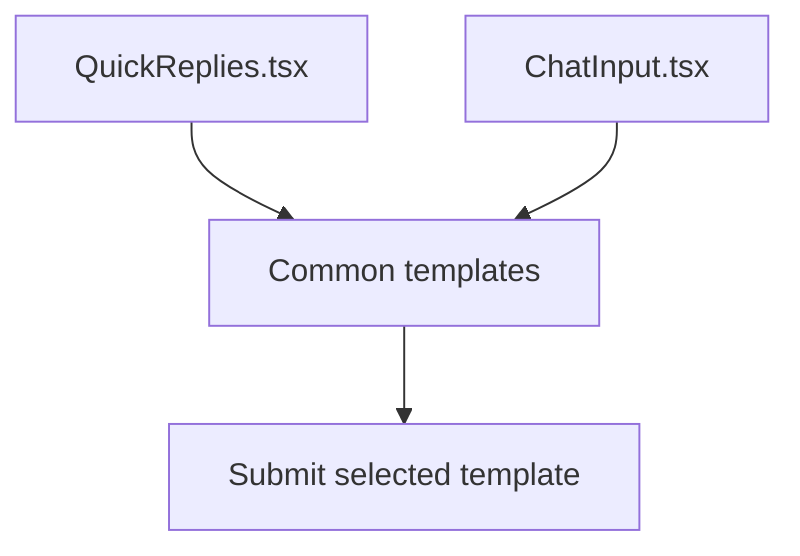

**Diagram sources**
- [ChatInput.tsx](file://src/components/chat/ChatInput.tsx#L15-L20)
- [ChatInput.tsx](file://src/components/chat/ChatInput.tsx#L138-L140)
- [QuickReplies.tsx](file://src/components/chat/QuickReplies.tsx#L1-L32)

**Section sources**
- [ChatInput.tsx](file://src/components/chat/ChatInput.tsx#L15-L20)
- [ChatInput.tsx](file://src/components/chat/ChatInput.tsx#L138-L140)
- [QuickReplies.tsx](file://src/components/chat/QuickReplies.tsx#L1-L32)

### Media Permission Workflow
- Request: One participant requests permission to send images/voice notes; a system message is inserted and conversation permission status is set to requested.
- Grant/Deny: The other participant grants or denies; UI updates and media sending becomes enabled/disabled accordingly.

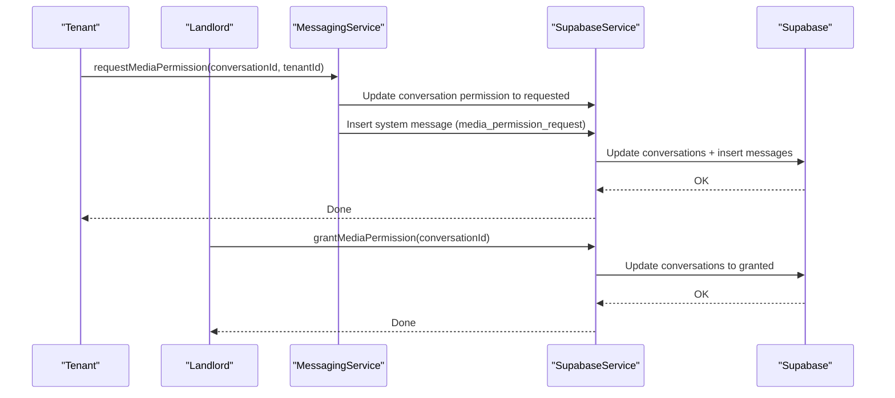

**Diagram sources**
- [messagingService.ts](file://src/services/messagingService.ts#L36-L68)
- [messagingService.ts](file://src/services/messagingService.ts#L70-L86)
- [supabaseService.ts](file://src/services/supabaseService.ts#L934-L971)

**Section sources**
- [messagingService.ts](file://src/services/messagingService.ts#L36-L68)
- [messagingService.ts](file://src/services/messagingService.ts#L70-L86)
- [supabaseService.ts](file://src/services/supabaseService.ts#L934-L971)
- [SystemMessage.tsx](file://src/components/chat/SystemMessage.tsx#L12-L22)
- [MediaPermissionCard.tsx](file://src/components/chat/MediaPermissionCard.tsx#L1-L43)

### Moderation Tools and Safety
- Security alert: Prominent banner warns users to complete financial transactions inside the app.
- System safety message: Displays warnings for safe practices.
- Read receipts and typing indicators improve transparency.

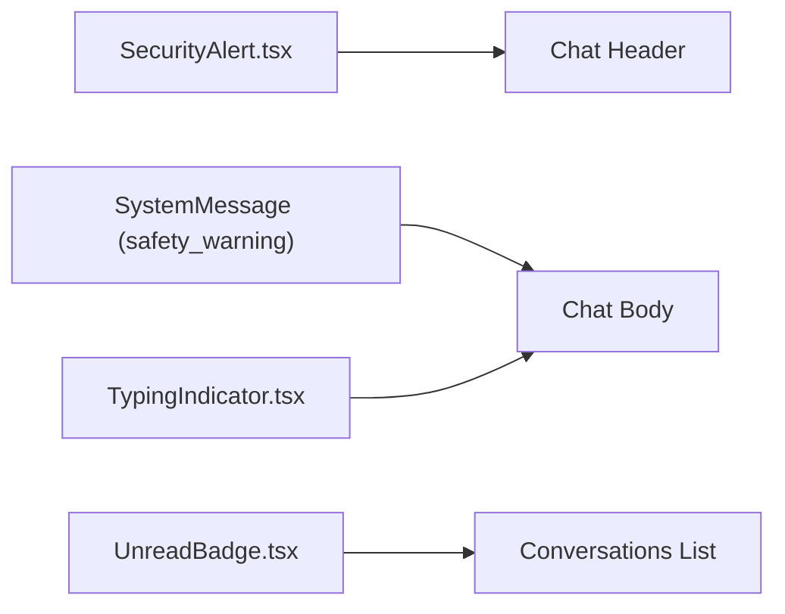

**Diagram sources**
- [SecurityAlert.tsx](file://src/components/chat/SecurityAlert.tsx#L1-L13)
- [SystemMessage.tsx](file://src/components/chat/SystemMessage.tsx#L24-L35)
- [TypingIndicator.tsx](file://src/components/chat/TypingIndicator.tsx#L1-L12)
- [UnreadBadge.tsx](file://src/components/chat/UnreadBadge.tsx#L1-L14)

**Section sources**
- [SecurityAlert.tsx](file://src/components/chat/SecurityAlert.tsx#L1-L13)
- [SystemMessage.tsx](file://src/components/chat/SystemMessage.tsx#L24-L35)
- [TypingIndicator.tsx](file://src/components/chat/TypingIndicator.tsx#L1-L12)
- [UnreadBadge.tsx](file://src/components/chat/UnreadBadge.tsx#L1-L14)

### Real-time Presence and Typing Indicators
- Presence: Online status is shown in chat header and list.
- Typing: Broadcast channel informs others when someone is typing; UI shows animated dots.

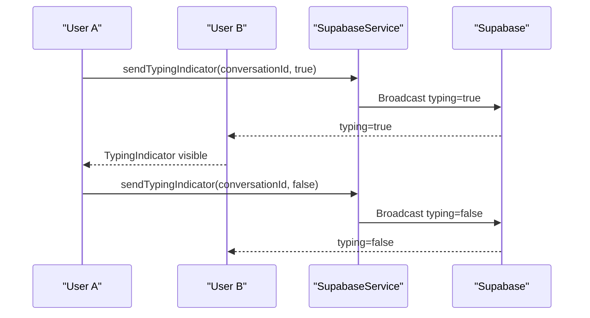

**Diagram sources**
- [supabaseService.ts](file://src/services/supabaseService.ts#L1017-L1038)
- [messages/[id]/page.tsx](file://src/app/messages/[id]/page.tsx#L73-L77)
- [TypingIndicator.tsx](file://src/components/chat/TypingIndicator.tsx#L1-L12)

**Section sources**
- [supabaseService.ts](file://src/services/supabaseService.ts#L1017-L1038)
- [messages/[id]/page.tsx](file://src/app/messages/[id]/page.tsx#L73-L77)
- [TypingIndicator.tsx](file://src/components/chat/TypingIndicator.tsx#L1-L12)

### Message Search and Filtering
- The conversation list supports live filtering by property title or participant name.
- Search is client-side against loaded conversation records.

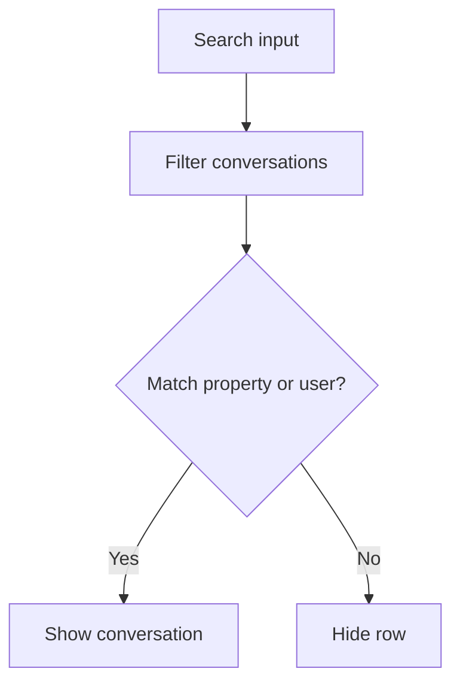

**Diagram sources**
- [messages/page.tsx](file://src/app/messages/page.tsx#L23-L31)

**Section sources**
- [messages/page.tsx](file://src/app/messages/page.tsx#L23-L31)

### Analytics-Ready Patterns
- Message metadata: System messages carry structured metadata for analytics (e.g., permission request outcomes).
- Read receipts: Mark as read queries enable engagement metrics.
- Typing events: Broadcast events can be counted for activity insights.

**Section sources**
- [supabaseService.ts](file://src/services/supabaseService.ts#L883-L892)
- [supabaseService.ts](file://src/services/supabaseService.ts#L1017-L1038)
- [SystemMessage.tsx](file://src/components/chat/SystemMessage.tsx#L12-L22)

### Data Types and Contracts
- Conversation, Message, and Profile types define the shape of persisted data and UI props.

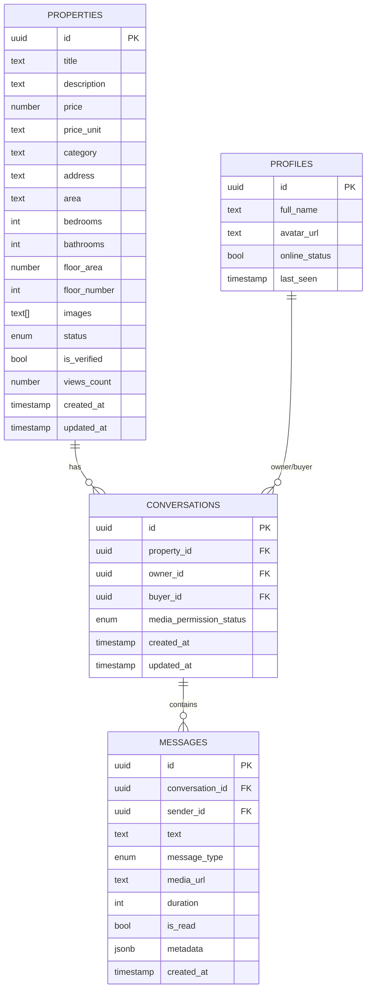

**Diagram sources**
- [messaging.ts](file://src/types/messaging.ts#L1-L37)
- [supabaseService.ts](file://src/services/supabaseService.ts#L771-L810)

**Section sources**
- [messaging.ts](file://src/types/messaging.ts#L1-L37)
- [supabaseService.ts](file://src/services/supabaseService.ts#L771-L810)

## Dependency Analysis
- Pages depend on the Supabase service for data and on the Messaging service for media and permissions.
- Components are decoupled and receive data via props, enabling reuse and testability.
- Supabase client encapsulates environment configuration and storage helpers.

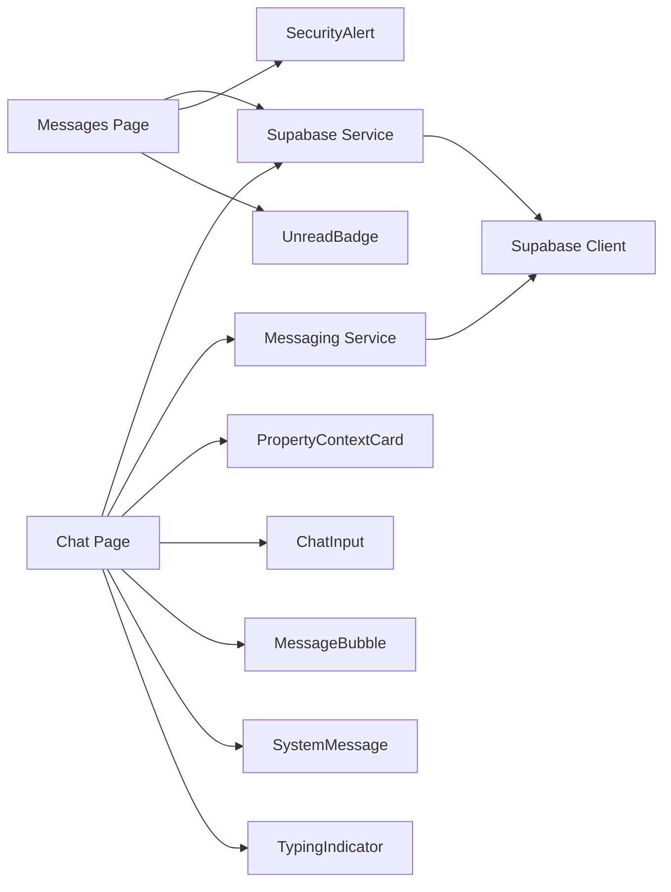

**Diagram sources**
- [messages/page.tsx](file://src/app/messages/page.tsx#L1-L197)
- [messages/[id]/page.tsx](file://src/app/messages/[id]/page.tsx#L1-L280)
- [supabaseService.ts](file://src/services/supabaseService.ts#L739-L1000)
- [messagingService.ts](file://src/services/messagingService.ts#L1-L123)
- [supabase.ts](file://src/lib/supabase.ts#L1-L68)

**Section sources**
- [messages/page.tsx](file://src/app/messages/page.tsx#L1-L197)
- [messages/[id]/page.tsx](file://src/app/messages/[id]/page.tsx#L1-L280)
- [supabaseService.ts](file://src/services/supabaseService.ts#L739-L1000)
- [messagingService.ts](file://src/services/messagingService.ts#L1-L123)
- [supabase.ts](file://src/lib/supabase.ts#L1-L68)

## Performance Considerations
- Pagination: Fetch recent N messages to avoid large payloads; load more on demand.
- Real-time updates: Subscribe to inserts only for the current conversation to minimize bandwidth.
- Image optimization: Enforce client-side size/type checks before upload.
- Rendering: Group messages by date to reduce DOM churn; memoize computed values.
- Typing indicators: Debounce broadcast frequency to reduce traffic.

## Troubleshooting Guide
- Authentication errors: Ensure user is authenticated before loading conversations or chat data.
- Media upload failures: Validate file type and size; handle storage errors gracefully.
- Real-time not updating: Verify channel subscriptions and that filters match conversation_id.
- Read receipts not firing: Confirm mark-as-read is called on entry and on receiving remote messages.

**Section sources**
- [messages/page.tsx](file://src/app/messages/page.tsx#L62-L76)
- [validation.ts](file://src/utils/validation.ts#L1-L33)
- [supabase.ts](file://src/lib/supabase.ts#L1-L68)
- [supabaseService.ts](file://src/services/supabaseService.ts#L883-L892)

## Conclusion
Gamasa Properties’ conversation system integrates property context, real-time messaging, media permissions, and moderation tools into a cohesive tenant/landlord communication platform. By leveraging Supabase for persistence and real-time, and modular React components for UI, the system supports scalable, maintainable, and user-friendly messaging workflows.