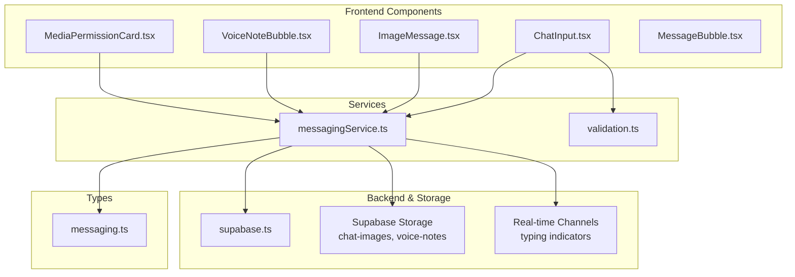
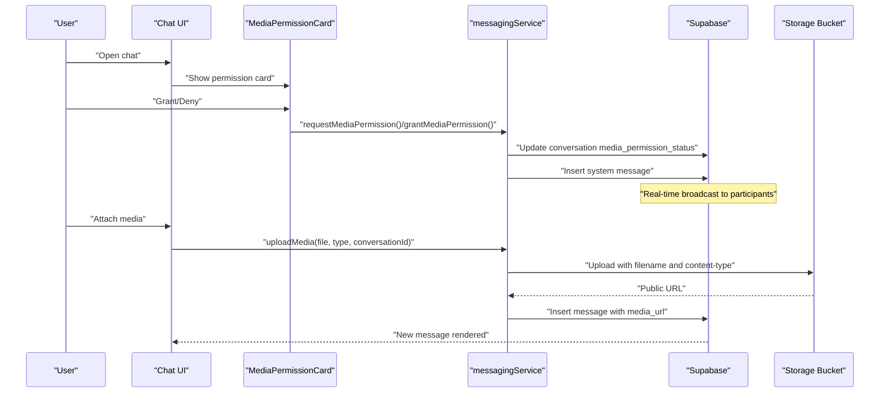
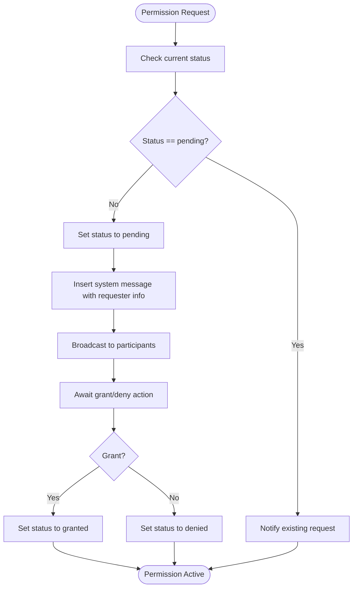
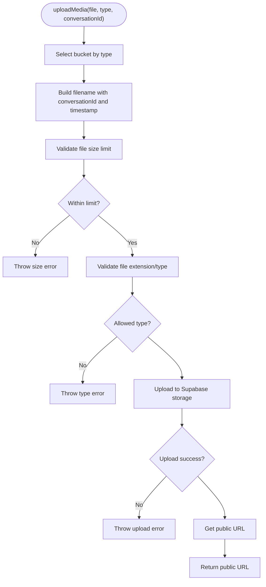
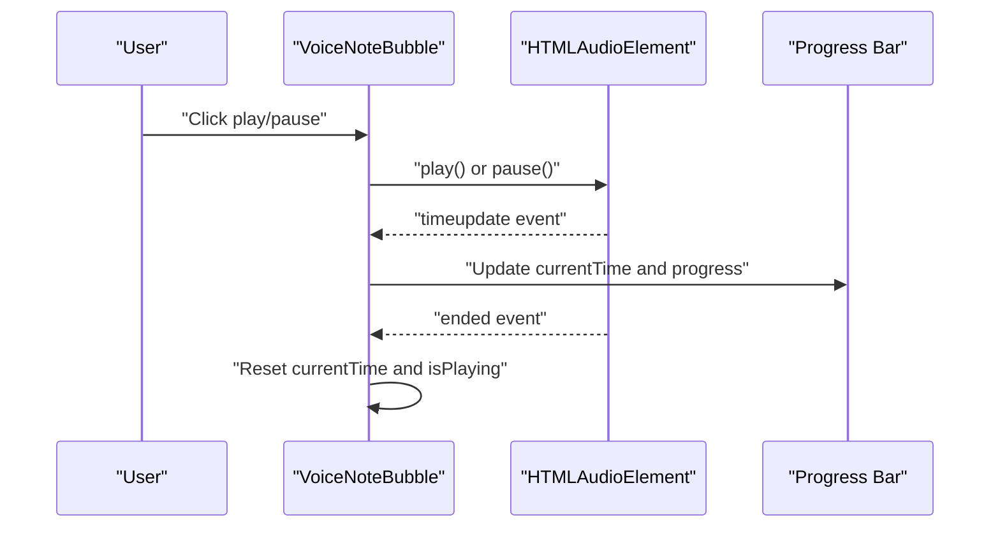
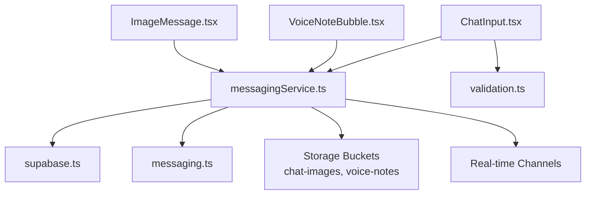

# Media Sharing and Permissions

<cite>
**Referenced Files in This Document**
- [MediaPermissionCard.tsx](file://src/components/chat/MediaPermissionCard.tsx)
- [VoiceNoteBubble.tsx](file://src/components/chat/VoiceNoteBubble.tsx)
- [ImageMessage.tsx](file://src/components/chat/ImageMessage.tsx)
- [messagingService.ts](file://src/services/messagingService.ts)
- [messaging.ts](file://src/types/messaging.ts)
- [supabase.ts](file://src/lib/supabase.ts)
- [ChatInput.tsx](file://src/components/chat/ChatInput.tsx)
- [MessageBubble.tsx](file://src/components/chat/MessageBubble.tsx)
- [validation.ts](file://src/utils/validation.ts)
</cite>

## Table of Contents
1. [Introduction](#introduction)
2. [Project Structure](#project-structure)
3. [Core Components](#core-components)
4. [Architecture Overview](#architecture-overview)
5. [Detailed Component Analysis](#detailed-component-analysis)
6. [Dependency Analysis](#dependency-analysis)
7. [Performance Considerations](#performance-considerations)
8. [Troubleshooting Guide](#troubleshooting-guide)
9. [Conclusion](#conclusion)

## Introduction
This document provides comprehensive documentation for the media sharing and permissions system in Gamasa Properties. It covers the media upload pipeline for images and voice notes, including file type validation, size limits, and cloud storage integration via Supabase. It also explains the media permission system, including request workflows, approval processes, and permission status tracking. Additionally, it details voice note recording, playback, and transcription capabilities, along with image preview, gallery display, and media download functionality. Security measures for media access control, file validation, and spam prevention are documented, alongside practical examples of media upload flows, permission dialogs, and media player components with accessibility features.

## Project Structure
The media sharing system is primarily implemented in the chat module with supporting services and types:
- Frontend components for media permission requests, voice notes, and image messages
- Messaging service orchestrating uploads and permission workflows
- Supabase integration for storage and real-time channels
- Type definitions for messages and media metadata

**Diagram sources**
- [MediaPermissionCard.tsx](file://src/components/chat/MediaPermissionCard.tsx#L1-L43)
- [VoiceNoteBubble.tsx](file://src/components/chat/VoiceNoteBubble.tsx#L1-L101)
- [ImageMessage.tsx](file://src/components/chat/ImageMessage.tsx#L1-L38)
- [ChatInput.tsx](file://src/components/chat/ChatInput.tsx)
- [MessageBubble.tsx](file://src/components/chat/MessageBubble.tsx)
- [messagingService.ts](file://src/services/messagingService.ts#L1-L123)
- [validation.ts](file://src/utils/validation.ts)
- [supabase.ts](file://src/lib/supabase.ts)
- [messaging.ts](file://src/types/messaging.ts)

**Section sources**
- [MediaPermissionCard.tsx](file://src/components/chat/MediaPermissionCard.tsx#L1-L43)
- [VoiceNoteBubble.tsx](file://src/components/chat/VoiceNoteBubble.tsx#L1-L101)
- [ImageMessage.tsx](file://src/components/chat/ImageMessage.tsx#L1-L38)
- [messagingService.ts](file://src/services/messagingService.ts#L1-L123)

## Core Components
- MediaPermissionCard: Renders a permission request card with grant/deny actions for media sharing in chats.
- VoiceNoteBubble: Provides playback controls, progress visualization, and timestamps for voice notes.
- ImageMessage: Displays image attachments with lazy loading and click-to-open behavior.
- messagingService: Central service for media uploads, permission workflows, and typing indicators.
- Supabase integration: Handles secure file uploads to Supabase storage buckets and real-time updates.
- Validation utilities: Enforce file type and size constraints before upload.

**Section sources**
- [MediaPermissionCard.tsx](file://src/components/chat/MediaPermissionCard.tsx#L8-L42)
- [VoiceNoteBubble.tsx](file://src/components/chat/VoiceNoteBubble.tsx#L16-L100)
- [ImageMessage.tsx](file://src/components/chat/ImageMessage.tsx#L10-L37)
- [messagingService.ts](file://src/services/messagingService.ts#L4-L122)

## Architecture Overview
The media sharing architecture integrates frontend components with Supabase for secure storage and real-time communication. The flow includes permission requests, file validation, cloud uploads, and media playback.

**Diagram sources**
- [MediaPermissionCard.tsx](file://src/components/chat/MediaPermissionCard.tsx#L8-L42)
- [messagingService.ts](file://src/services/messagingService.ts#L36-L86)
- [supabase.ts](file://src/lib/supabase.ts)

## Detailed Component Analysis

### Media Permission System
The permission system manages whether a user can send images and voice notes in a conversation. It supports three states: pending, granted, and denied.

Key behaviors:
- Request workflow: Initiates a permission request and broadcasts a system message to participants.
- Approval process: Updates the conversation's permission status to granted or denied.
- Status tracking: Maintains state per conversation for access control.

**Diagram sources**
- [messagingService.ts](file://src/services/messagingService.ts#L36-L86)

**Section sources**
- [messagingService.ts](file://src/services/messagingService.ts#L36-L86)
- [MediaPermissionCard.tsx](file://src/components/chat/MediaPermissionCard.tsx#L8-L42)

### Media Upload Pipeline
The upload pipeline handles file validation, secure uploads to Supabase storage, and returns a public URL for media messages.

Processing logic:
- Bucket selection based on media type (images vs voice notes).
- Filename generation using conversation ID and timestamp.
- Content-type enforcement for voice notes.
- Error handling for size/type constraints and generic failures.
- Public URL retrieval for rendering media.

**Diagram sources**
- [messagingService.ts](file://src/services/messagingService.ts#L6-L33)

**Section sources**
- [messagingService.ts](file://src/services/messagingService.ts#L6-L33)

### Voice Note Recording, Playback, and Transcription
Voice note playback is implemented with a custom media player component featuring play/pause controls, progress bar, and timing display. Transcription capabilities are not present in the current codebase and would require additional integration.

Playback features:
- Toggle play/pause with visual feedback.
- Progress bar synchronized with audio currentTime.
- Duration display and formatted time labels.
- Accessibility-ready button labels and keyboard navigation.

**Diagram sources**
- [VoiceNoteBubble.tsx](file://src/components/chat/VoiceNoteBubble.tsx#L26-L46)

**Section sources**
- [VoiceNoteBubble.tsx](file://src/components/chat/VoiceNoteBubble.tsx#L16-L100)

### Image Preview, Gallery Display, and Download
Image messages support preview with lazy loading and click-to-open behavior. Download functionality can be achieved by opening the media URL in a new tab/window.

Key features:
- Lazy loading for performance.
- Click-to-open external viewer.
- Read status indicators and timestamps.
- Responsive sizing with max-height constraints.

**Section sources**
- [ImageMessage.tsx](file://src/components/chat/ImageMessage.tsx#L10-L37)

### Security Measures and Spam Prevention
Security and spam prevention mechanisms:
- Supabase Storage access control via signed URLs and bucket policies.
- File type and size validation at upload time.
- Conversation-scoped permission gating to prevent unauthorized media sharing.
- Real-time channels for typing indicators and permission updates.
- System messages for permission requests to maintain auditability.

**Section sources**
- [messagingService.ts](file://src/services/messagingService.ts#L6-L33)
- [messagingService.ts](file://src/services/messagingService.ts#L36-L86)

## Dependency Analysis
The media system relies on Supabase for storage and real-time features, with validation utilities ensuring safe uploads.

**Diagram sources**
- [messagingService.ts](file://src/services/messagingService.ts#L1-L123)
- [supabase.ts](file://src/lib/supabase.ts)
- [messaging.ts](file://src/types/messaging.ts)
- [ChatInput.tsx](file://src/components/chat/ChatInput.tsx)
- [validation.ts](file://src/utils/validation.ts)
- [VoiceNoteBubble.tsx](file://src/components/chat/VoiceNoteBubble.tsx#L1-L101)
- [ImageMessage.tsx](file://src/components/chat/ImageMessage.tsx#L1-L38)

**Section sources**
- [messagingService.ts](file://src/services/messagingService.ts#L1-L123)

## Performance Considerations
- Lazy loading for image previews reduces initial load time.
- Progressive enhancement for audio playback avoids blocking UI.
- Supabase storage ensures scalable and globally distributed media delivery.
- Consider implementing client-side caching for frequently accessed media URLs.
- Optimize audio format and compression for voice notes to balance quality and bandwidth.

## Troubleshooting Guide
Common issues and resolutions:
- Upload errors due to size or type: The service throws specific errors for size and type violations. Display user-friendly messages and prevent submission until corrected.
- Permission denial: When denied, users cannot send media; guide them to request permission again.
- Playback issues: Verify audio URL validity and network connectivity; ensure browser supports the audio format.
- Real-time updates: Confirm subscription to typing channels and handle reconnection gracefully.

**Section sources**
- [messagingService.ts](file://src/services/messagingService.ts#L17-L26)
- [VoiceNoteBubble.tsx](file://src/components/chat/VoiceNoteBubble.tsx#L26-L46)

## Conclusion
Gamasa Properties implements a robust media sharing system with permission controls, secure cloud storage, and accessible playback components. The modular architecture enables clear separation of concerns, while Supabase provides reliable storage and real-time capabilities. Future enhancements could include transcription services for voice notes and expanded gallery features for image collections.