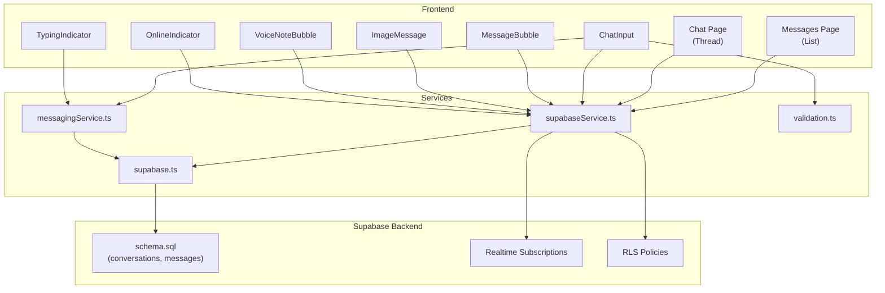
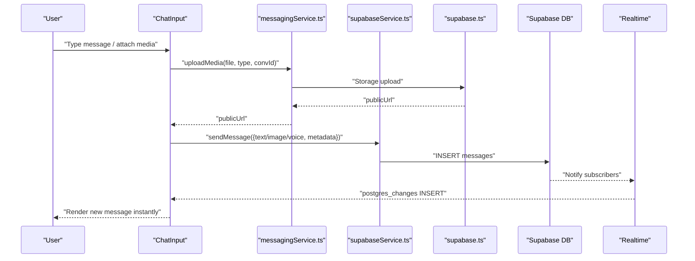
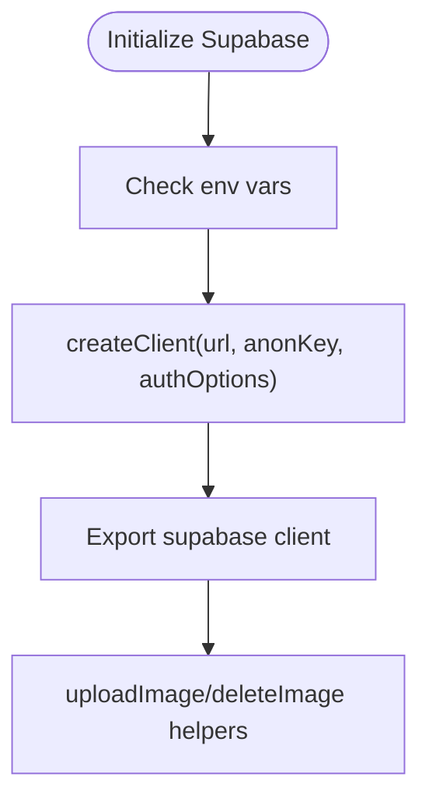
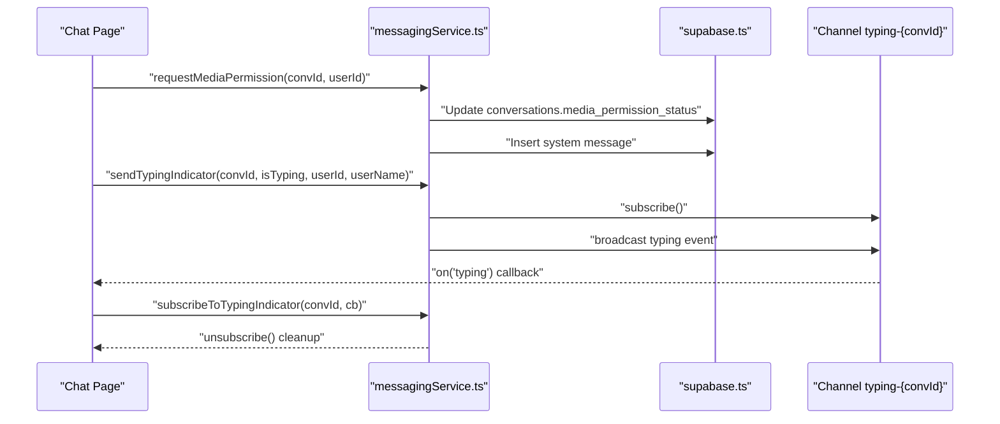
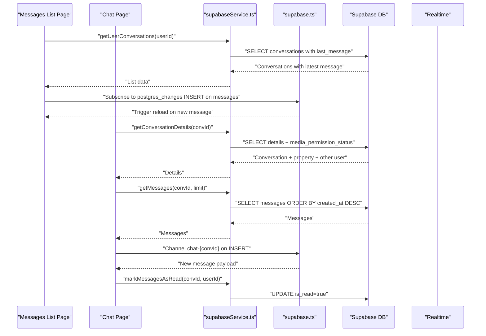
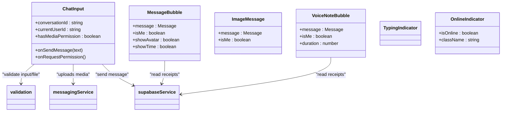
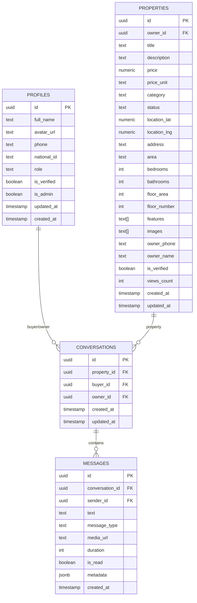
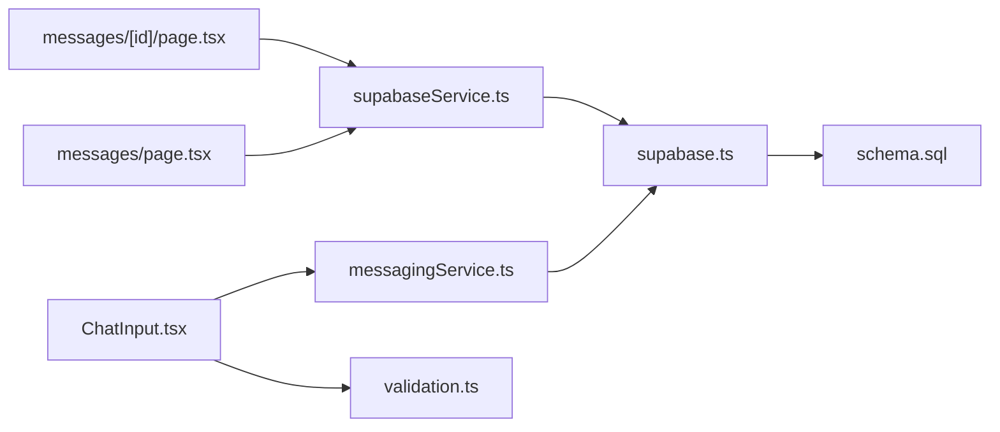

# Messaging and Communication Platform

<cite>
**Referenced Files in This Document**
- [messagingService.ts](file://src/services/messagingService.ts)
- [supabase.ts](file://src/lib/supabase.ts)
- [messaging.ts](file://src/types/messaging.ts)
- [database.types.ts](file://src/types/database.types.ts)
- [schema.sql](file://supabase/schema.sql)
- [messages.page.tsx](file://src/app/messages/page.tsx)
- [messages.[id].page.tsx](file://src/app/messages/[id]/page.tsx)
- [ChatInput.tsx](file://src/components/chat/ChatInput.tsx)
- [MessageBubble.tsx](file://src/components/chat/MessageBubble.tsx)
- [ImageMessage.tsx](file://src/components/chat/ImageMessage.tsx)
- [VoiceNoteBubble.tsx](file://src/components/chat/VoiceNoteBubble.tsx)
- [TypingIndicator.tsx](file://src/components/chat/TypingIndicator.tsx)
- [OnlineIndicator.tsx](file://src/components/chat/OnlineIndicator.tsx)
- [supabaseService.ts](file://src/services/supabaseService.ts)
- [validation.ts](file://src/utils/validation.ts)
</cite>

## Table of Contents
1. [Introduction](#introduction)
2. [Project Structure](#project-structure)
3. [Core Components](#core-components)
4. [Architecture Overview](#architecture-overview)
5. [Detailed Component Analysis](#detailed-component-analysis)
6. [Dependency Analysis](#dependency-analysis)
7. [Performance Considerations](#performance-considerations)
8. [Troubleshooting Guide](#troubleshooting-guide)
9. [Conclusion](#conclusion)
10. [Appendices](#appendices)

## Introduction
This document describes the messaging and communication platform for Gamasa Properties, focusing on real-time chat built on Supabase, conversation management, media sharing (images and voice notes), and notification integration. It explains message threading, read receipts, typing indicators, online presence tracking, property context integration, moderation and spam prevention, WebSocket connection management, message persistence, offline handling, and practical UI component examples.

## Project Structure
The messaging system spans three primary areas:
- Supabase backend: real-time subscriptions, row-level security (RLS), and database schema for conversations and messages
- Services layer: Supabase client initialization, media upload utilities, and messaging service orchestrating chat operations
- Frontend pages and components: chat UI, input controls, message bubbles, typing indicators, and online presence

**Diagram sources**
- [messages.page.tsx](file://src/app/messages/page.tsx#L1-L197)
- [messages.[id].page.tsx](file://src/app/messages/[id]/page.tsx#L1-L280)
- [ChatInput.tsx](file://src/components/chat/ChatInput.tsx#L1-L297)
- [MessageBubble.tsx](file://src/components/chat/MessageBubble.tsx#L1-L53)
- [ImageMessage.tsx](file://src/components/chat/ImageMessage.tsx#L1-L38)
- [VoiceNoteBubble.tsx](file://src/components/chat/VoiceNoteBubble.tsx#L1-L101)
- [TypingIndicator.tsx](file://src/components/chat/TypingIndicator.tsx#L1-L12)
- [OnlineIndicator.tsx](file://src/components/chat/OnlineIndicator.tsx#L1-L14)
- [supabaseService.ts](file://src/services/supabaseService.ts#L1-L800)
- [messagingService.ts](file://src/services/messagingService.ts#L1-L123)
- [supabase.ts](file://src/lib/supabase.ts#L1-L68)
- [schema.sql](file://supabase/schema.sql#L338-L416)

**Section sources**
- [messages.page.tsx](file://src/app/messages/page.tsx#L1-L197)
- [messages.[id].page.tsx](file://src/app/messages/[id]/page.tsx#L1-L280)
- [supabase.ts](file://src/lib/supabase.ts#L1-L68)
- [schema.sql](file://supabase/schema.sql#L338-L416)

## Core Components
- Supabase client initialization and storage helpers
- Messaging service for uploads, permissions, and typing indicators
- Supabase service for conversation/message CRUD and real-time subscriptions
- Chat UI components for text, images, voice notes, typing, and online presence
- Validation utilities for message and media constraints

Key responsibilities:
- Real-time updates via Supabase channels and Postgres changes
- Media upload to Supabase buckets with size/type checks
- Conversation and message persistence with RLS policies
- Typing indicators and read receipts display
- Property context cards integrated into chat threads

**Section sources**
- [supabase.ts](file://src/lib/supabase.ts#L1-L68)
- [messagingService.ts](file://src/services/messagingService.ts#L1-L123)
- [supabaseService.ts](file://src/services/supabaseService.ts#L739-L800)
- [ChatInput.tsx](file://src/components/chat/ChatInput.tsx#L1-L297)
- [validation.ts](file://src/utils/validation.ts#L1-L33)

## Architecture Overview
The platform uses Supabase’s real-time capabilities to synchronize chat state across clients. Conversations and messages are stored in dedicated tables with RLS policies ensuring users can only access their own conversations and messages. Media is stored in Supabase Storage buckets and referenced by message records.

**Diagram sources**
- [ChatInput.tsx](file://src/components/chat/ChatInput.tsx#L96-L177)
- [messagingService.ts](file://src/services/messagingService.ts#L6-L33)
- [supabase.ts](file://src/lib/supabase.ts#L34-L54)
- [supabaseService.ts](file://src/services/supabaseService.ts#L739-L800)
- [messages.[id].page.tsx](file://src/app/messages/[id]/page.tsx#L49-L71)

## Detailed Component Analysis

### Supabase Client and Storage
- Initializes Supabase client with auto-refresh and session persistence
- Provides reusable storage helpers for images and generic uploads
- Exposes constants and helpers for consistent bucket usage

**Diagram sources**
- [supabase.ts](file://src/lib/supabase.ts#L1-L68)

**Section sources**
- [supabase.ts](file://src/lib/supabase.ts#L1-L68)

### Messaging Service (Media, Permissions, Typing)
- Media upload to separate buckets per type with size/type validation
- Media permission lifecycle: request, grant, deny with system messages
- Typing indicator broadcast via channel events with subscribe/unsubscribe

**Diagram sources**
- [messagingService.ts](file://src/services/messagingService.ts#L36-L121)
- [messages.[id].page.tsx](file://src/app/messages/[id]/page.tsx#L73-L82)

**Section sources**
- [messagingService.ts](file://src/services/messagingService.ts#L1-L123)
- [messages.[id].page.tsx](file://src/app/messages/[id]/page.tsx#L73-L82)

### Supabase Service (Conversations, Messages, Realtime)
- Conversation creation and retrieval with joins to property and user profiles
- Message retrieval with pagination and read status handling
- Real-time subscriptions to messages per conversation and global changes for list updates
- Read receipts triggered on navigation and message reception

**Diagram sources**
- [messages.page.tsx](file://src/app/messages/page.tsx#L33-L53)
- [messages.[id].page.tsx](file://src/app/messages/[id]/page.tsx#L35-L83)
- [supabaseService.ts](file://src/services/supabaseService.ts#L771-L800)

**Section sources**
- [messages.page.tsx](file://src/app/messages/page.tsx#L1-L197)
- [messages.[id].page.tsx](file://src/app/messages/[id]/page.tsx#L1-L280)
- [supabaseService.ts](file://src/services/supabaseService.ts#L739-L800)

### Chat UI Components
- ChatInput: text input, quick replies, attachment picker, voice recording with permission gating
- MessageBubble: text messages with read receipts and timestamps
- ImageMessage: inline image preview with click-to-open
- VoiceNoteBubble: audio player with progress bar and duration
- TypingIndicator: animated dots for remote typing
- OnlineIndicator: presence dot for other users

**Diagram sources**
- [ChatInput.tsx](file://src/components/chat/ChatInput.tsx#L1-L297)
- [MessageBubble.tsx](file://src/components/chat/MessageBubble.tsx#L1-L53)
- [ImageMessage.tsx](file://src/components/chat/ImageMessage.tsx#L1-L38)
- [VoiceNoteBubble.tsx](file://src/components/chat/VoiceNoteBubble.tsx#L1-L101)
- [TypingIndicator.tsx](file://src/components/chat/TypingIndicator.tsx#L1-L12)
- [OnlineIndicator.tsx](file://src/components/chat/OnlineIndicator.tsx#L1-L14)
- [validation.ts](file://src/utils/validation.ts#L1-L33)

**Section sources**
- [ChatInput.tsx](file://src/components/chat/ChatInput.tsx#L1-L297)
- [MessageBubble.tsx](file://src/components/chat/MessageBubble.tsx#L1-L53)
- [ImageMessage.tsx](file://src/components/chat/ImageMessage.tsx#L1-L38)
- [VoiceNoteBubble.tsx](file://src/components/chat/VoiceNoteBubble.tsx#L1-L101)
- [TypingIndicator.tsx](file://src/components/chat/TypingIndicator.tsx#L1-L12)
- [OnlineIndicator.tsx](file://src/components/chat/OnlineIndicator.tsx#L1-L14)

### Data Models and Schema
- Conversations: thread linking property, buyer, and owner
- Messages: text, image, voice, or system messages with read status
- Profiles: user metadata including online status and verification
- Realtime publication enabled for messages

**Diagram sources**
- [schema.sql](file://supabase/schema.sql#L338-L416)
- [messaging.ts](file://src/types/messaging.ts#L1-L37)
- [database.types.ts](file://src/types/database.types.ts#L12-L310)

**Section sources**
- [schema.sql](file://supabase/schema.sql#L338-L416)
- [messaging.ts](file://src/types/messaging.ts#L1-L37)
- [database.types.ts](file://src/types/database.types.ts#L12-L310)

## Dependency Analysis
- Frontend pages depend on Supabase service for data and Supabase client for real-time
- Messaging service depends on Supabase client for storage and broadcasting
- Validation utilities enforce client-side constraints before uploads
- Supabase schema defines relationships and RLS policies governing access

**Diagram sources**
- [messages.page.tsx](file://src/app/messages/page.tsx#L1-L197)
- [messages.[id].page.tsx](file://src/app/messages/[id]/page.tsx#L1-L280)
- [ChatInput.tsx](file://src/components/chat/ChatInput.tsx#L1-L297)
- [messagingService.ts](file://src/services/messagingService.ts#L1-L123)
- [supabase.ts](file://src/lib/supabase.ts#L1-L68)
- [schema.sql](file://supabase/schema.sql#L338-L416)

**Section sources**
- [messages.page.tsx](file://src/app/messages/page.tsx#L1-L197)
- [messages.[id].page.tsx](file://src/app/messages/[id]/page.tsx#L1-L280)
- [ChatInput.tsx](file://src/components/chat/ChatInput.tsx#L1-L297)
- [messagingService.ts](file://src/services/messagingService.ts#L1-L123)
- [supabase.ts](file://src/lib/supabase.ts#L1-L68)
- [schema.sql](file://supabase/schema.sql#L338-L416)

## Performance Considerations
- Real-time subscriptions: use targeted filters (conversation_id) to minimize payload
- Pagination: load recent N messages to avoid large DOMs; lazy-load older messages on scroll
- Media optimization: enforce client-side size/type limits; lazy-load images and audio
- Presence and typing: throttle typing events; debounce presence updates
- RLS overhead: keep queries selective; avoid N+1 selects by using joins

## Troubleshooting Guide
Common issues and resolutions:
- Missing environment variables for Supabase client
  - Symptom: warnings during initialization and placeholder values
  - Resolution: set NEXT_PUBLIC_SUPABASE_URL and NEXT_PUBLIC_SUPABASE_ANON_KEY
  - Section sources
    - [supabase.ts](file://src/lib/supabase.ts#L3-L15)

- Media upload failures
  - Symptom: errors indicating unsupported type or oversized file
  - Resolution: verify file type and size against validation rules; check bucket permissions
  - Section sources
    - [validation.ts](file://src/utils/validation.ts#L7-L27)
    - [ChatInput.tsx](file://src/components/chat/ChatInput.tsx#L150-L177)
    - [messagingService.ts](file://src/services/messagingService.ts#L6-L33)

- Real-time not updating
  - Symptom: new messages do not appear immediately
  - Resolution: ensure channel subscription exists and filter matches; verify publication for messages
  - Section sources
    - [messages.[id].page.tsx](file://src/app/messages/[id]/page.tsx#L49-L71)
    - [schema.sql](file://supabase/schema.sql#L408-L416)

- Read receipts not marking
  - Symptom: blue checkmarks not appearing
  - Resolution: confirm read update triggers on navigation and receiving messages
  - Section sources
    - [messages.[id].page.tsx](file://src/app/messages/[id]/page.tsx#L46-L68)

- Typing indicator not visible
  - Symptom: typing dots do not show
  - Resolution: verify channel broadcast and subscription; ensure user is not the sender
  - Section sources
    - [messagingService.ts](file://src/services/messagingService.ts#L88-L121)
    - [messages.[id].page.tsx](file://src/app/messages/[id]/page.tsx#L73-L82)

## Conclusion
Gamasa Properties’ messaging platform leverages Supabase for robust real-time chat, secure media handling, and seamless property context integration. The modular design separates concerns across services and components, enabling scalable enhancements such as advanced moderation, spam detection, and offline synchronization strategies.

## Appendices

### Real-time Update Mechanisms
- Messages list updates via postgres_changes INSERT on messages
- Thread updates via channel chat-{conversationId} with INSERT filter
- Typing indicators via channel typing-{conversationId} broadcast

**Section sources**
- [messages.page.tsx](file://src/app/messages/page.tsx#L37-L47)
- [messages.[id].page.tsx](file://src/app/messages/[id]/page.tsx#L49-L71)
- [messagingService.ts](file://src/services/messagingService.ts#L88-L121)

### Communication Workflow Examples
- Text message sending: ChatInput validates, sends via supabaseService, renders instantly via subscription
- Image sharing: select image → validate → upload → send image message
- Voice notes: record with permission → upload → send voice message with duration
- Read receipts: mark as read on navigate and when receiving messages

**Section sources**
- [ChatInput.tsx](file://src/components/chat/ChatInput.tsx#L124-L177)
- [MessageBubble.tsx](file://src/components/chat/MessageBubble.tsx#L37-L48)
- [messages.[id].page.tsx](file://src/app/messages/[id]/page.tsx#L46-L68)