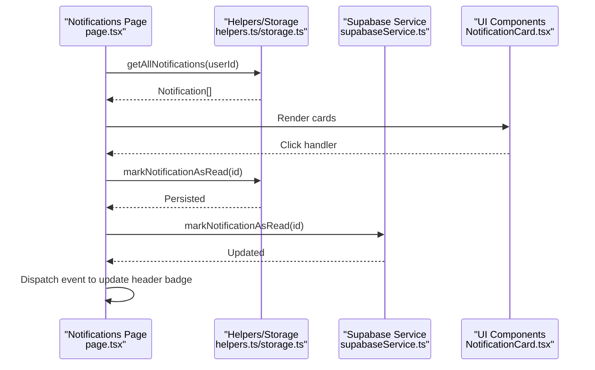
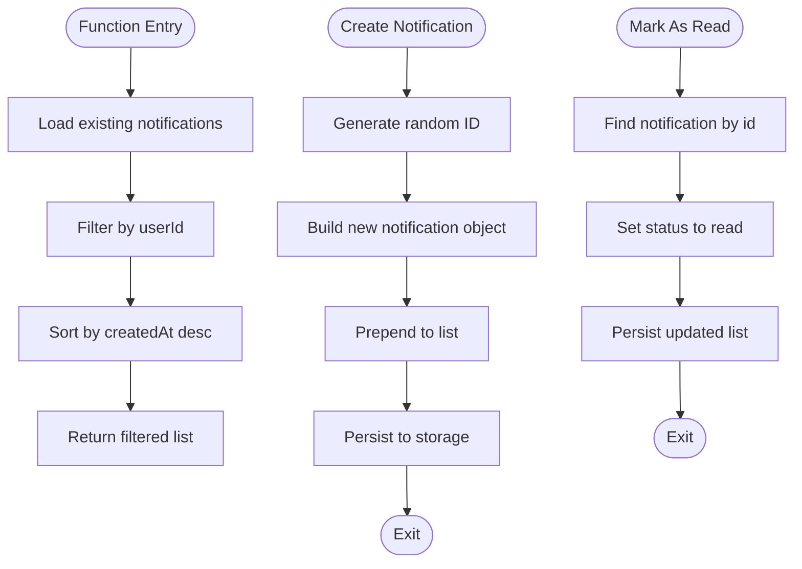
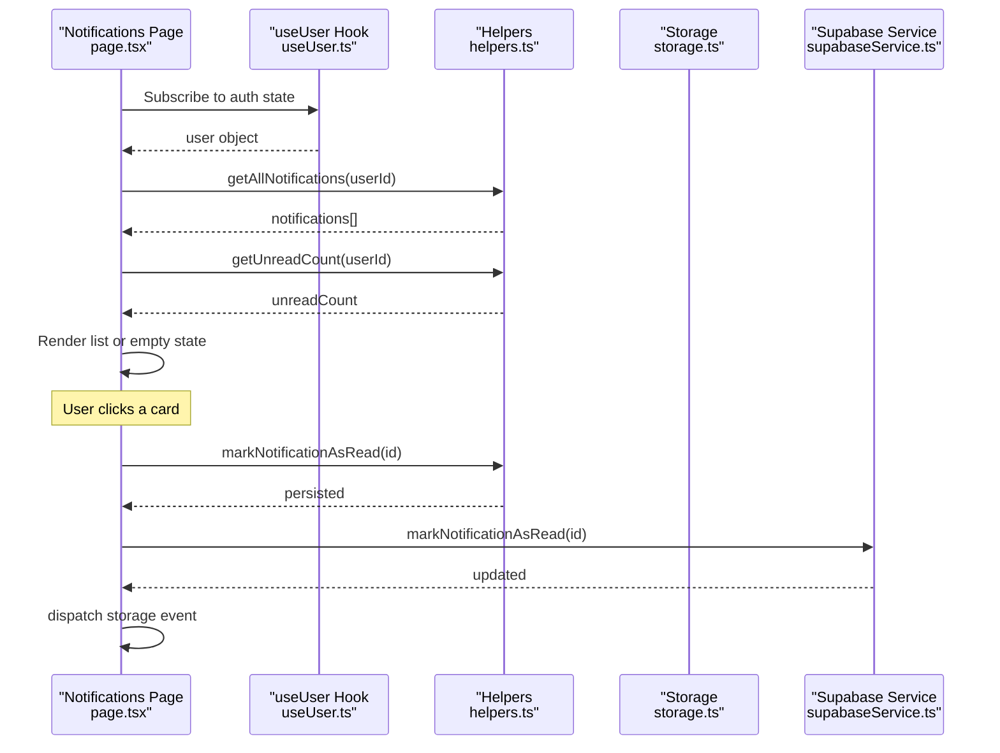
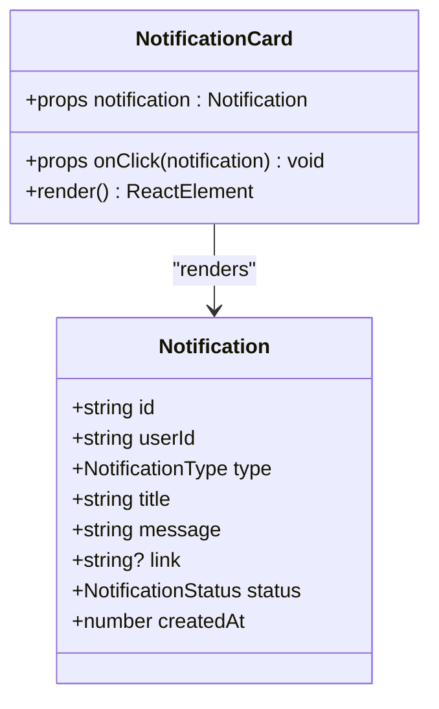
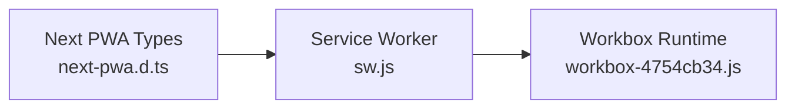
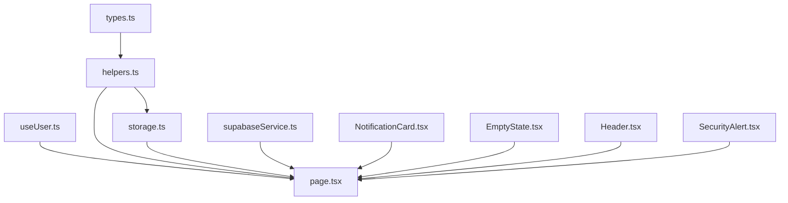

# Notification and Alert System

<cite>
**Referenced Files in This Document**
- [types.ts](file://src/lib/notifications/types.ts)
- [helpers.ts](file://src/lib/notifications/helpers.ts)
- [storage.ts](file://src/lib/notifications/storage.ts)
- [NotificationCard.tsx](file://src/components/notifications/NotificationCard.tsx)
- [EmptyState.tsx](file://src/components/notifications/EmptyState.tsx)
- [page.tsx](file://src/app/notifications/page.tsx)
- [supabaseService.ts](file://src/services/supabaseService.ts)
- [useUser.ts](file://src/hooks/useUser.ts)
- [Header.tsx](file://src/components/Header.tsx)
- [SecurityAlert.tsx](file://src/components/chat/SecurityAlert.tsx)
- [sw.js](file://public/sw.js)
- [workbox-4754cb34.js](file://public/workbox-4754cb34.js)
- [next-pwa.d.ts](file://next-pwa.d.ts)
</cite>

## Table of Contents
1. [Introduction](#introduction)
2. [Project Structure](#project-structure)
3. [Core Components](#core-components)
4. [Architecture Overview](#architecture-overview)
5. [Detailed Component Analysis](#detailed-component-analysis)
6. [Dependency Analysis](#dependency-analysis)
7. [Performance Considerations](#performance-considerations)
8. [Troubleshooting Guide](#troubleshooting-guide)
9. [Conclusion](#conclusion)
10. [Appendices](#appendices)

## Introduction
This document describes the notification and alert system for Gamasa Properties. It covers real-time-like notification delivery for new messages, booking confirmations, payment updates, and system alerts. It also documents notification types, priority levels, user preference settings, push notification integration, in-app notifications, email/SMS alert configurations, dismissal and read/unread status tracking, notification history management, security alerts, system maintenance notifications, user verification alerts, and examples of notification components, subscription management, and notification center implementation with accessibility and mobile responsiveness.

## Project Structure
The notification system spans client-side libraries, UI components, and server-side services:
- Client-side notification library defines types, helpers, and local storage persistence.
- Notification UI components render cards, empty states, and integrate with the notification center page.
- Supabase service handles server-backed notifications and read status updates.
- PWA assets enable push-related caching and runtime strategies via Workbox.

```mermaid
graph TB
subgraph "Client"
Types["Types<br/>types.ts"]
Helpers["Helpers<br/>helpers.ts"]
Storage["Storage<br/>storage.ts"]
Card["NotificationCard<br/>NotificationCard.tsx"]
Empty["EmptyState<br/>EmptyState.tsx"]
Page["Notifications Page<br/>page.tsx"]
Header["Header<br/>Header.tsx"]
Security["SecurityAlert<br/>SecurityAlert.tsx"]
UserHook["useUser Hook<br/>useUser.ts"]
end
subgraph "Server"
Supabase["Supabase Service<br/>supabaseService.ts"]
end
subgraph "PWA"
SW["Service Worker<br/>sw.js"]
WB["Workbox Runtime<br/>workbox-4754cb34.js"]
PWA["PWA Config Types<br/>next-pwa.d.ts"]
end
Types --> Helpers
Helpers --> Storage
Helpers --> Page
Storage --> Page
Card --> Page
Empty --> Page
UserHook --> Page
Header --> Page
Security --> Page
Page --> Supabase
Page --> Storage
Supabase --> Page
SW --> WB
PWA --> SW
```

**Diagram sources**
- [types.ts](file://src/lib/notifications/types.ts#L1-L14)
- [helpers.ts](file://src/lib/notifications/helpers.ts#L1-L42)
- [storage.ts](file://src/lib/notifications/storage.ts#L1-L23)
- [NotificationCard.tsx](file://src/components/notifications/NotificationCard.tsx#L1-L102)
- [EmptyState.tsx](file://src/components/notifications/EmptyState.tsx#L1-L24)
- [page.tsx](file://src/app/notifications/page.tsx#L1-L119)
- [Header.tsx](file://src/components/Header.tsx#L155-L171)
- [SecurityAlert.tsx](file://src/components/chat/SecurityAlert.tsx#L1-L12)
- [useUser.ts](file://src/hooks/useUser.ts#L37-L176)
- [supabaseService.ts](file://src/services/supabaseService.ts#L581-L627)
- [sw.js](file://public/sw.js#L1-L2)
- [workbox-4754cb34.js](file://public/workbox-4754cb34.js#L1-L2)
- [next-pwa.d.ts](file://next-pwa.d.ts#L1-L22)

**Section sources**
- [types.ts](file://src/lib/notifications/types.ts#L1-L14)
- [helpers.ts](file://src/lib/notifications/helpers.ts#L1-L42)
- [storage.ts](file://src/lib/notifications/storage.ts#L1-L23)
- [NotificationCard.tsx](file://src/components/notifications/NotificationCard.tsx#L1-L102)
- [EmptyState.tsx](file://src/components/notifications/EmptyState.tsx#L1-L24)
- [page.tsx](file://src/app/notifications/page.tsx#L1-L119)
- [Header.tsx](file://src/components/Header.tsx#L155-L171)
- [SecurityAlert.tsx](file://src/components/chat/SecurityAlert.tsx#L1-L12)
- [useUser.ts](file://src/hooks/useUser.ts#L37-L176)
- [supabaseService.ts](file://src/services/supabaseService.ts#L581-L627)
- [sw.js](file://public/sw.js#L1-L2)
- [workbox-4754cb34.js](file://public/workbox-4754cb34.js#L1-L2)
- [next-pwa.d.ts](file://next-pwa.d.ts#L1-L22)

## Core Components
- Notification types define categories and statuses used across the system.
- Helpers encapsulate CRUD-like operations for notifications and unread counts.
- Local storage persists notifications client-side for offline and initial-load scenarios.
- UI components render notification cards, empty states, and integrate with the notification center.
- Supabase service provides server-backed notifications and read status updates.
- PWA assets support caching and runtime strategies that can underpin push-related experiences.

**Section sources**
- [types.ts](file://src/lib/notifications/types.ts#L1-L14)
- [helpers.ts](file://src/lib/notifications/helpers.ts#L1-L42)
- [storage.ts](file://src/lib/notifications/storage.ts#L1-L23)
- [NotificationCard.tsx](file://src/components/notifications/NotificationCard.tsx#L1-L102)
- [EmptyState.tsx](file://src/components/notifications/EmptyState.tsx#L1-L24)
- [page.tsx](file://src/app/notifications/page.tsx#L1-L119)
- [supabaseService.ts](file://src/services/supabaseService.ts#L581-L627)
- [sw.js](file://public/sw.js#L1-L2)
- [workbox-4754cb34.js](file://public/workbox-4754cb34.js#L1-L2)

## Architecture Overview
The system supports two primary modes:
- Client-side simulation: Uses local storage to store notifications and compute unread counts.
- Server-side persistence: Uses Supabase to fetch, mark as read, and manage notifications.



**Diagram sources**
- [page.tsx](file://src/app/notifications/page.tsx#L27-L47)
- [helpers.ts](file://src/lib/notifications/helpers.ts#L4-L42)
- [storage.ts](file://src/lib/notifications/storage.ts#L5-L22)
- [supabaseService.ts](file://src/services/supabaseService.ts#L602-L608)
- [NotificationCard.tsx](file://src/components/notifications/NotificationCard.tsx#L78-L100)

## Detailed Component Analysis

### Notification Types and Status
- NotificationType: categorizes notifications (e.g., payment, property, system).
- NotificationStatus: tracks read/unread state.
- Notification interface: includes identifiers, type, title, message, optional link, status, and creation timestamp.

```mermaid
classDiagram
class Notification {
+string id
+string userId
+NotificationType type
+string title
+string message
+string? link
+NotificationStatus status
+number createdAt
}
class NotificationType {
<<enumeration>>
"payment"
"property"
"system"
}
class NotificationStatus {
<<enumeration>>
"unread"
"read"
}
Notification --> NotificationType : "has type"
Notification --> NotificationStatus : "has status"
```

**Diagram sources**
- [types.ts](file://src/lib/notifications/types.ts#L1-L14)

**Section sources**
- [types.ts](file://src/lib/notifications/types.ts#L1-L14)

### Notification Helpers and Storage
- getAllNotifications filters and sorts notifications by user and recency.
- getUnreadCount computes unread counts per user.
- createNotification generates a new notification with a random ID, unread status, and timestamp, then persists it.
- markNotificationAsRead updates status and persists changes.
- Local storage functions load and save notifications with robustness against parsing errors.



**Diagram sources**
- [helpers.ts](file://src/lib/notifications/helpers.ts#L4-L42)
- [storage.ts](file://src/lib/notifications/storage.ts#L5-L22)

**Section sources**
- [helpers.ts](file://src/lib/notifications/helpers.ts#L1-L42)
- [storage.ts](file://src/lib/notifications/storage.ts#L1-L23)

### Notification Center Page
- Loads user context, initializes notifications and unread count, and renders either skeleton loaders, notification cards, or an empty state.
- Handles click events to mark notifications as read, optimistically updates UI, decrements unread count, and dispatches a storage event to refresh the header badge.



**Diagram sources**
- [page.tsx](file://src/app/notifications/page.tsx#L14-L47)
- [useUser.ts](file://src/hooks/useUser.ts#L37-L176)
- [helpers.ts](file://src/lib/notifications/helpers.ts#L4-L42)
- [storage.ts](file://src/lib/notifications/storage.ts#L5-L22)
- [supabaseService.ts](file://src/services/supabaseService.ts#L602-L608)

**Section sources**
- [page.tsx](file://src/app/notifications/page.tsx#L1-L119)
- [useUser.ts](file://src/hooks/useUser.ts#L37-L176)

### Notification Card Component
- Renders notification content with type-based icons and color classes.
- Applies visual cues for unread state (bold title, accent border, pulse dot).
- Supports navigation via link or button wrapper depending on presence of a link.



**Diagram sources**
- [NotificationCard.tsx](file://src/components/notifications/NotificationCard.tsx#L6-L102)
- [types.ts](file://src/lib/notifications/types.ts#L5-L14)

**Section sources**
- [NotificationCard.tsx](file://src/components/notifications/NotificationCard.tsx#L1-L102)
- [types.ts](file://src/lib/notifications/types.ts#L1-L14)

### Empty State Component
- Provides a friendly illustration and message when no notifications are present.

**Section sources**
- [EmptyState.tsx](file://src/components/notifications/EmptyState.tsx#L1-L24)

### Security Alerts
- A dedicated security alert component displays warnings about secure payment practices.

**Section sources**
- [SecurityAlert.tsx](file://src/components/chat/SecurityAlert.tsx#L1-L12)

### Push Notification Integration and PWA
- Service worker and Workbox runtime are included, enabling caching strategies and potential push-related capabilities.
- PWA configuration types are declared for Next.js PWA integration.



**Diagram sources**
- [sw.js](file://public/sw.js#L1-L2)
- [workbox-4754cb34.js](file://public/workbox-4754cb34.js#L1-L2)
- [next-pwa.d.ts](file://next-pwa.d.ts#L1-L22)

**Section sources**
- [sw.js](file://public/sw.js#L1-L2)
- [workbox-4754cb34.js](file://public/workbox-4754cb34.js#L1-L2)
- [next-pwa.d.ts](file://next-pwa.d.ts#L1-L22)

## Dependency Analysis
- The notification center depends on the user hook for authentication state, helpers for data retrieval and mutations, and storage for persistence.
- Supabase service provides server-backed operations for fetching and marking notifications as read.
- UI components depend on the notification types and helpers for rendering and interactivity.



**Diagram sources**
- [useUser.ts](file://src/hooks/useUser.ts#L37-L176)
- [types.ts](file://src/lib/notifications/types.ts#L1-L14)
- [helpers.ts](file://src/lib/notifications/helpers.ts#L1-L42)
- [storage.ts](file://src/lib/notifications/storage.ts#L1-L23)
- [page.tsx](file://src/app/notifications/page.tsx#L1-L119)
- [supabaseService.ts](file://src/services/supabaseService.ts#L581-L627)
- [NotificationCard.tsx](file://src/components/notifications/NotificationCard.tsx#L1-L102)
- [EmptyState.tsx](file://src/components/notifications/EmptyState.tsx#L1-L24)
- [Header.tsx](file://src/components/Header.tsx#L155-L171)
- [SecurityAlert.tsx](file://src/components/chat/SecurityAlert.tsx#L1-L12)

**Section sources**
- [useUser.ts](file://src/hooks/useUser.ts#L37-L176)
- [types.ts](file://src/lib/notifications/types.ts#L1-L14)
- [helpers.ts](file://src/lib/notifications/helpers.ts#L1-L42)
- [storage.ts](file://src/lib/notifications/storage.ts#L1-L23)
- [page.tsx](file://src/app/notifications/page.tsx#L1-L119)
- [supabaseService.ts](file://src/services/supabaseService.ts#L581-L627)
- [NotificationCard.tsx](file://src/components/notifications/NotificationCard.tsx#L1-L102)
- [EmptyState.tsx](file://src/components/notifications/EmptyState.tsx#L1-L24)
- [Header.tsx](file://src/components/Header.tsx#L155-L171)
- [SecurityAlert.tsx](file://src/components/chat/SecurityAlert.tsx#L1-L12)

## Performance Considerations
- Client-side filtering and sorting are O(n log n) due to sorting; consider server-side pagination and ordering for large datasets.
- Local storage operations are synchronous and can block the UI thread for large lists; defer heavy operations to background tasks or limit stored items.
- Debounce or batch read status updates to reduce redundant network calls.
- Use virtualized lists for long notification histories to minimize DOM overhead.
- Cache frequently accessed data (e.g., unread counts) and invalidate on mutation.

## Troubleshooting Guide
- Notifications not appearing:
  - Verify user authentication and that the page loads after user context is available.
  - Check local storage availability and parsing errors.
- Read status not updating:
  - Confirm optimistic UI updates and storage writes occur before server calls.
  - Ensure the storage event is dispatched to refresh the header badge.
- Server-side read status not persisting:
  - Validate Supabase service calls and error logs.
  - Confirm mock mode conditions do not suppress operations.
- Accessibility and mobile responsiveness:
  - Ensure interactive elements are keyboard focusable and have sufficient contrast.
  - Test touch targets and gesture-friendly layouts on small screens.

**Section sources**
- [page.tsx](file://src/app/notifications/page.tsx#L27-L47)
- [storage.ts](file://src/lib/notifications/storage.ts#L5-L22)
- [supabaseService.ts](file://src/services/supabaseService.ts#L602-L608)

## Conclusion
Gamasa Properties implements a flexible notification system combining client-side simulation and server-backed persistence. The system supports categorized notifications, read/unread tracking, and a responsive UI. While the current implementation focuses on in-app notifications and local storage, the architecture accommodates future enhancements such as email/SMS alerts, push notifications via PWA, and user preference-driven routing.

## Appendices

### Notification Types and Priority Levels
- NotificationType: payment, property, system.
- Priority levels: not currently modeled in the client library; can be introduced via a new field and routing logic.

**Section sources**
- [types.ts](file://src/lib/notifications/types.ts#L1-L14)

### User Preference Settings
- Preferences are not modeled in the client library; can be integrated via a preferences service and caching mechanism similar to the backend example.

**Section sources**
- [supabaseService.ts](file://src/services/supabaseService.ts#L178-L198)

### Dismissal, Read/Unread Tracking, and History Management
- Dismissal: handled by clicking a notification card; UI marks as read and updates counters.
- Read/Unread: tracked via status field and computed unread count.
- History: managed via local storage for client-side simulation; server-side history via Supabase.

**Section sources**
- [page.tsx](file://src/app/notifications/page.tsx#L35-L47)
- [helpers.ts](file://src/lib/notifications/helpers.ts#L11-L13)
- [storage.ts](file://src/lib/notifications/storage.ts#L5-L22)
- [supabaseService.ts](file://src/services/supabaseService.ts#L589-L599)

### Security Alerts, Maintenance Notifications, and Verification Alerts
- Security alerts: dedicated component for payment security guidance.
- Maintenance/system alerts: can be modeled as system-type notifications with appropriate titles and messages.
- Verification alerts: can leverage system notifications to inform users about verification status.

**Section sources**
- [SecurityAlert.tsx](file://src/components/chat/SecurityAlert.tsx#L1-L12)
- [types.ts](file://src/lib/notifications/types.ts#L1-L14)

### Examples of Notification Components and Subscription Management
- NotificationCard: renders individual notifications with type-based styling and actions.
- NotificationsPage: orchestrates loading, rendering, and read status updates.
- Header integration: demonstrates unread badge and bulk actions.

**Section sources**
- [NotificationCard.tsx](file://src/components/notifications/NotificationCard.tsx#L1-L102)
- [page.tsx](file://src/app/notifications/page.tsx#L1-L119)
- [Header.tsx](file://src/components/Header.tsx#L155-L171)

### Accessibility and Mobile Responsiveness
- Ensure focus management, ARIA roles, and semantic HTML in components.
- Use responsive breakpoints and fluid typography for mobile-first layouts.
- Provide high-contrast modes and screen reader-friendly labels.