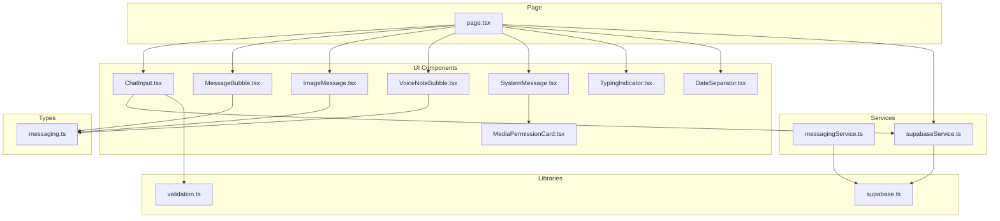
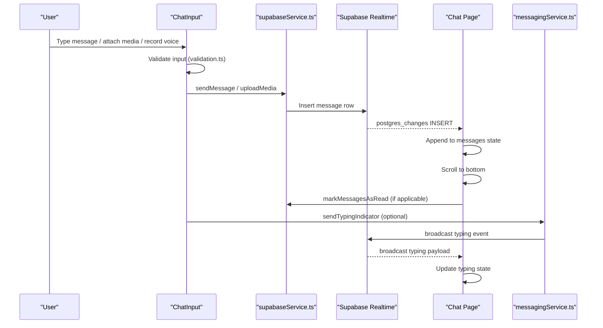
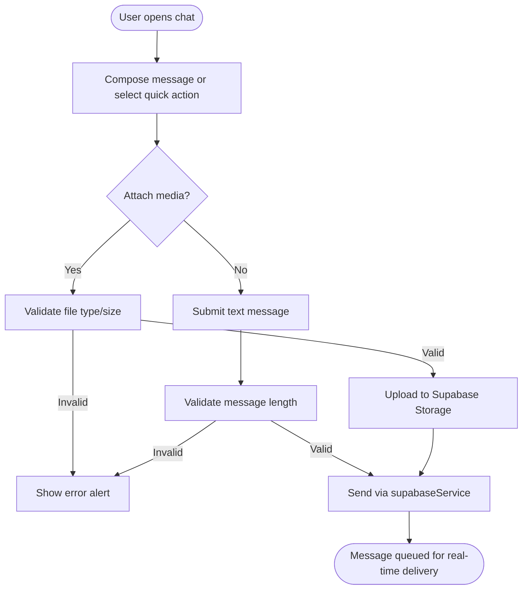
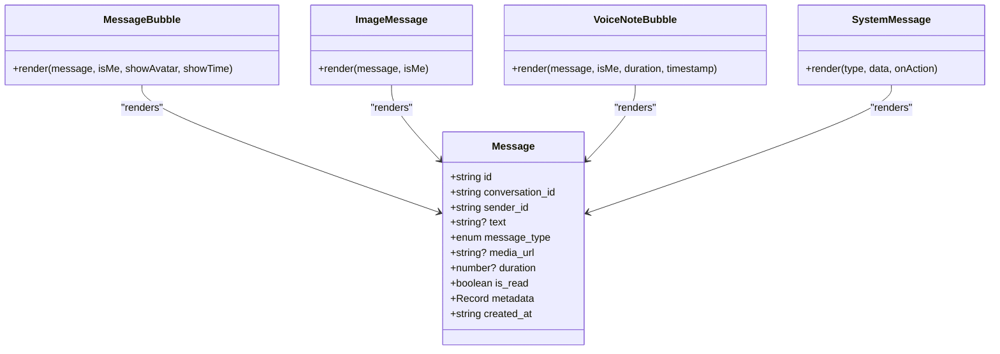
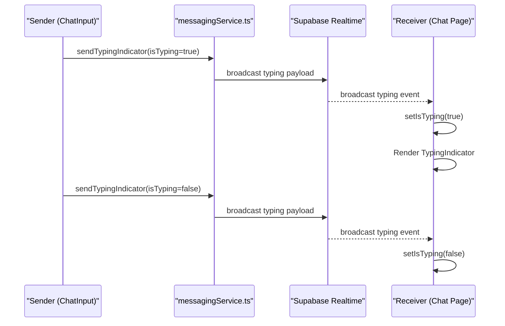
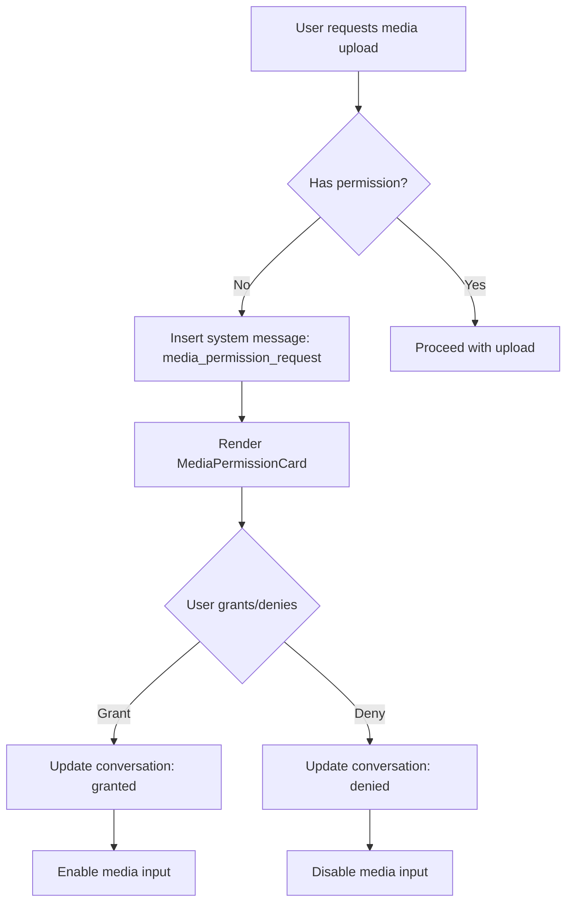
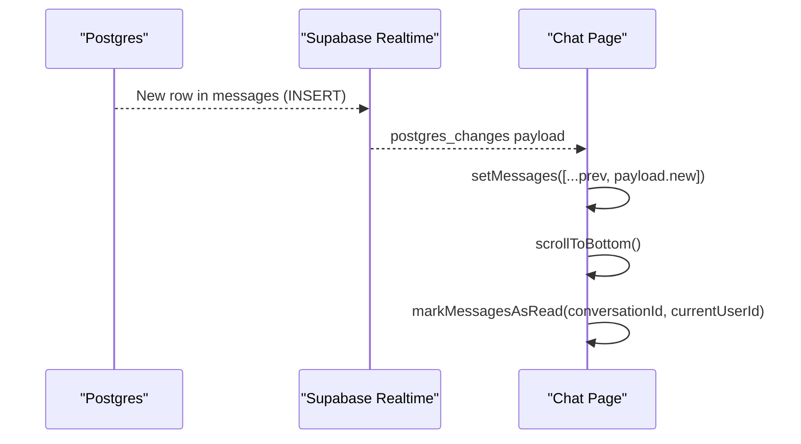
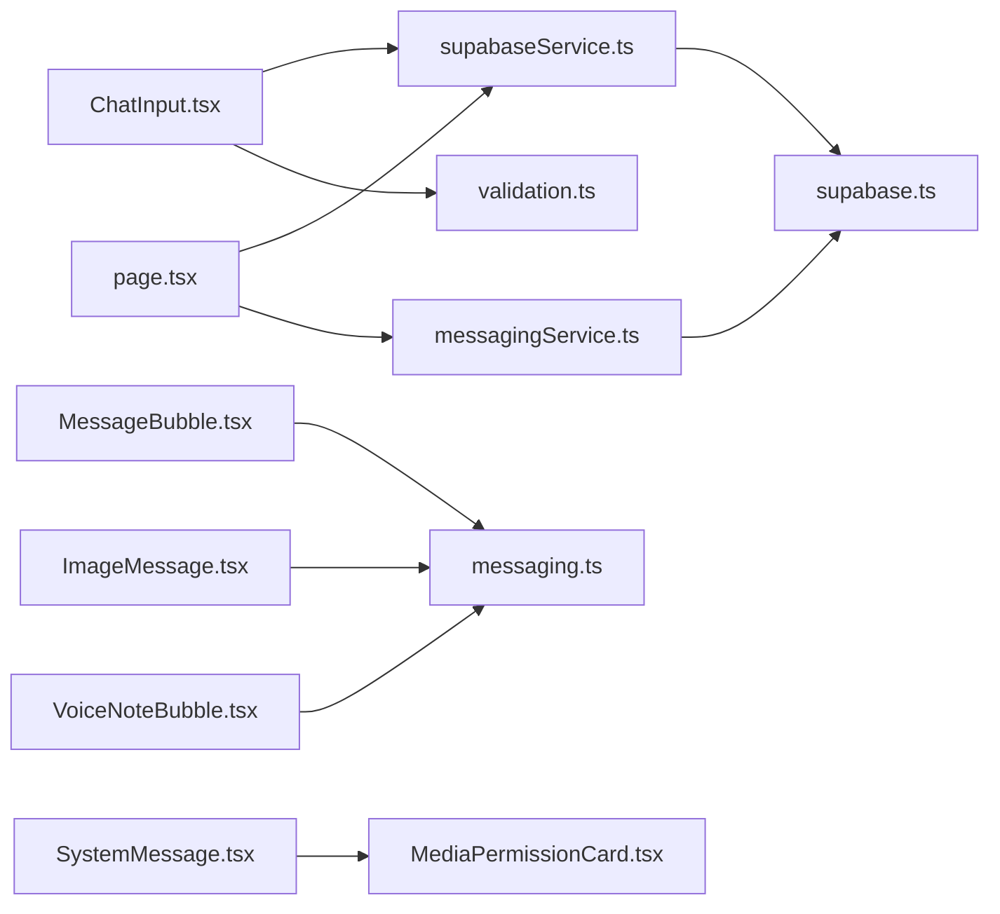

# Real-Time Chat Implementation

<cite>
**Referenced Files in This Document**
- [ChatInput.tsx](file://src/components/chat/ChatInput.tsx)
- [MessageBubble.tsx](file://src/components/chat/MessageBubble.tsx)
- [ImageMessage.tsx](file://src/components/chat/ImageMessage.tsx)
- [VoiceNoteBubble.tsx](file://src/components/chat/VoiceNoteBubble.tsx)
- [SystemMessage.tsx](file://src/components/chat/SystemMessage.tsx)
- [MediaPermissionCard.tsx](file://src/components/chat/MediaPermissionCard.tsx)
- [TypingIndicator.tsx](file://src/components/chat/TypingIndicator.tsx)
- [DateSeparator.tsx](file://src/components/chat/DateSeparator.tsx)
- [page.tsx](file://src/app/messages/[id]/page.tsx)
- [messagingService.ts](file://src/services/messagingService.ts)
- [supabaseService.ts](file://src/services/supabaseService.ts)
- [supabase.ts](file://src/lib/supabase.ts)
- [validation.ts](file://src/utils/validation.ts)
- [messaging.ts](file://src/types/messaging.ts)
</cite>

## Table of Contents
1. [Introduction](#introduction)
2. [Project Structure](#project-structure)
3. [Core Components](#core-components)
4. [Architecture Overview](#architecture-overview)
5. [Detailed Component Analysis](#detailed-component-analysis)
6. [Dependency Analysis](#dependency-analysis)
7. [Performance Considerations](#performance-considerations)
8. [Troubleshooting Guide](#troubleshooting-guide)
9. [Conclusion](#conclusion)

## Introduction
This document explains the real-time chat implementation for Gamasa Properties, focusing on WebSocket-based messaging via Supabase channels, message threading, and real-time updates. It covers the chat input component with text composition, validation, and submission handling; message bubble rendering for different message types (text, system, media); typing indicators with broadcast channels; and media permissions. It also documents message persistence, offline handling, and synchronization strategies, along with practical examples of chat UI interactions and conversation flow management.

## Project Structure
The chat system is organized around:
- UI components under src/components/chat for rendering messages, input, typing indicators, and permissions
- Services under src/services for messaging and Supabase interactions
- Types under src/types for message and conversation models
- Validation utilities under src/utils
- The chat page under src/app/messages/[id]/page.tsx orchestrating real-time subscriptions and rendering

**Diagram sources**
- [page.tsx](file://src/app/messages/[id]/page.tsx#L1-L280)
- [ChatInput.tsx](file://src/components/chat/ChatInput.tsx#L1-L297)
- [MessageBubble.tsx](file://src/components/chat/MessageBubble.tsx#L1-L53)
- [ImageMessage.tsx](file://src/components/chat/ImageMessage.tsx#L1-L38)
- [VoiceNoteBubble.tsx](file://src/components/chat/VoiceNoteBubble.tsx#L1-L101)
- [SystemMessage.tsx](file://src/components/chat/SystemMessage.tsx#L1-L43)
- [MediaPermissionCard.tsx](file://src/components/chat/MediaPermissionCard.tsx#L1-L43)
- [TypingIndicator.tsx](file://src/components/chat/TypingIndicator.tsx#L1-L12)
- [DateSeparator.tsx](file://src/components/chat/DateSeparator.tsx#L1-L27)
- [messagingService.ts](file://src/services/messagingService.ts#L1-L123)
- [supabaseService.ts](file://src/services/supabaseService.ts#L1-L1384)
- [supabase.ts](file://src/lib/supabase.ts#L1-L68)
- [validation.ts](file://src/utils/validation.ts#L1-L33)
- [messaging.ts](file://src/types/messaging.ts#L1-L37)

**Section sources**
- [page.tsx](file://src/app/messages/[id]/page.tsx#L1-L280)
- [ChatInput.tsx](file://src/components/chat/ChatInput.tsx#L1-L297)
- [messagingService.ts](file://src/services/messagingService.ts#L1-L123)
- [supabaseService.ts](file://src/services/supabaseService.ts#L1-L1384)
- [supabase.ts](file://src/lib/supabase.ts#L1-L68)
- [validation.ts](file://src/utils/validation.ts#L1-L33)
- [messaging.ts](file://src/types/messaging.ts#L1-L37)

## Core Components
- ChatInput: Handles text input, quick replies, file attachments, voice recording, permission requests, and message submission with validation.
- Message rendering: MessageBubble for text, ImageMessage for images, VoiceNoteBubble for audio, SystemMessage for system notifications, and DateSeparator for date grouping.
- TypingIndicator: Visual indicator for remote user typing.
- Messaging services: Supabase-backed service for sending messages, uploading media, managing permissions, and broadcasting typing events.
- Page orchestration: Chat page subscribes to real-time message inserts and typing broadcasts, manages media permissions, and renders the conversation.

**Section sources**
- [ChatInput.tsx](file://src/components/chat/ChatInput.tsx#L1-L297)
- [MessageBubble.tsx](file://src/components/chat/MessageBubble.tsx#L1-L53)
- [ImageMessage.tsx](file://src/components/chat/ImageMessage.tsx#L1-L38)
- [VoiceNoteBubble.tsx](file://src/components/chat/VoiceNoteBubble.tsx#L1-L101)
- [SystemMessage.tsx](file://src/components/chat/SystemMessage.tsx#L1-L43)
- [TypingIndicator.tsx](file://src/components/chat/TypingIndicator.tsx#L1-L12)
- [page.tsx](file://src/app/messages/[id]/page.tsx#L1-L280)
- [messagingService.ts](file://src/services/messagingService.ts#L1-L123)
- [supabaseService.ts](file://src/services/supabaseService.ts#L812-L892)

## Architecture Overview
The chat uses Supabase Realtime channels for two primary streams:
- Postgres changes channel for new message inserts
- Broadcast channel for typing indicators

**Diagram sources**
- [page.tsx](file://src/app/messages/[id]/page.tsx#L49-L83)
- [ChatInput.tsx](file://src/components/chat/ChatInput.tsx#L124-L136)
- [supabaseService.ts](file://src/services/supabaseService.ts#L850-L881)
- [messagingService.ts](file://src/services/messagingService.ts#L89-L107)

## Detailed Component Analysis

### Chat Input Component
Responsibilities:
- Text composition with validation and submission
- Quick reply actions
- File attachment handling with type and size validation
- Voice recording with MediaRecorder API, upload, and message creation
- Permission request flow for media uploads
- Uploading state management

Key behaviors:
- Validates message length and empty content before submission
- Uses validation utilities for file types and sizes
- Records audio via MediaRecorder, converts to Blob, casts to File, uploads, and sends a voice message
- Manages recording timer and cancellation
- Triggers media permission request when needed

**Diagram sources**
- [ChatInput.tsx](file://src/components/chat/ChatInput.tsx#L124-L177)
- [validation.ts](file://src/utils/validation.ts#L1-L33)
- [supabaseService.ts](file://src/services/supabaseService.ts#L850-L881)

**Section sources**
- [ChatInput.tsx](file://src/components/chat/ChatInput.tsx#L1-L297)
- [validation.ts](file://src/utils/validation.ts#L1-L33)
- [supabaseService.ts](file://src/services/supabaseService.ts#L850-L881)

### Message Rendering Components
- MessageBubble: Renders text messages with sender avatar (receiver), timestamps, and read status indicators.
- ImageMessage: Renders image attachments with click-to-open behavior and timestamps.
- VoiceNoteBubble: Renders playable voice notes with progress bar, duration, and play/pause controls.
- SystemMessage: Renders system notifications (media permission requests, safety warnings).
- MediaPermissionCard: Provides grant/deny UI for media permission requests.
- DateSeparator: Inserts contextual date markers (Today, Yesterday, Full date).

Rendering logic:
- The chat page groups messages by date and selects the appropriate renderer based on message_type.
- For text messages, MessageBubble is used; for images, ImageMessage; for voice, VoiceNoteBubble; for system, SystemMessage.

**Diagram sources**
- [MessageBubble.tsx](file://src/components/chat/MessageBubble.tsx#L12-L52)
- [ImageMessage.tsx](file://src/components/chat/ImageMessage.tsx#L10-L37)
- [VoiceNoteBubble.tsx](file://src/components/chat/VoiceNoteBubble.tsx#L16-L100)
- [SystemMessage.tsx](file://src/components/chat/SystemMessage.tsx#L12-L42)
- [messaging.ts](file://src/types/messaging.ts#L16-L28)

**Section sources**
- [MessageBubble.tsx](file://src/components/chat/MessageBubble.tsx#L1-L53)
- [ImageMessage.tsx](file://src/components/chat/ImageMessage.tsx#L1-L38)
- [VoiceNoteBubble.tsx](file://src/components/chat/VoiceNoteBubble.tsx#L1-L101)
- [SystemMessage.tsx](file://src/components/chat/SystemMessage.tsx#L1-L43)
- [DateSeparator.tsx](file://src/components/chat/DateSeparator.tsx#L1-L27)
- [messaging.ts](file://src/types/messaging.ts#L1-L37)

### Typing Indicators and Presence
Typing indicators are implemented via Supabase broadcast channels:
- Sender emits typing events with user identity and timestamp
- Receiver subscribes to the typing channel and updates local state
- UI displays animated typing bubbles when remote user is typing

**Diagram sources**
- [messagingService.ts](file://src/services/messagingService.ts#L89-L107)
- [page.tsx](file://src/app/messages/[id]/page.tsx#L73-L76)
- [TypingIndicator.tsx](file://src/components/chat/TypingIndicator.tsx#L1-L12)

**Section sources**
- [messagingService.ts](file://src/services/messagingService.ts#L89-L121)
- [page.tsx](file://src/app/messages/[id]/page.tsx#L73-L76)
- [TypingIndicator.tsx](file://src/components/chat/TypingIndicator.tsx#L1-L12)

### Media Permissions and System Notifications
- MediaPermissionCard presents grant/deny actions for allowing image/audio uploads
- SystemMessage renders permission requests and safety warnings
- Supabase service updates conversation media permission status and inserts system messages

**Diagram sources**
- [SystemMessage.tsx](file://src/components/chat/SystemMessage.tsx#L13-L22)
- [MediaPermissionCard.tsx](file://src/components/chat/MediaPermissionCard.tsx#L8-L42)
- [supabaseService.ts](file://src/services/supabaseService.ts#L935-L971)

**Section sources**
- [SystemMessage.tsx](file://src/components/chat/SystemMessage.tsx#L1-L43)
- [MediaPermissionCard.tsx](file://src/components/chat/MediaPermissionCard.tsx#L1-L43)
- [supabaseService.ts](file://src/services/supabaseService.ts#L935-L971)

### Real-Time Updates and Conversation Flow
- Postgres changes subscription listens for new message inserts scoped by conversation_id
- On insert, the page appends the new message to state, scrolls to bottom, and marks messages as read for non-senders
- Initial load fetches recent messages with pagination
- Date separators are inserted when message dates change

**Diagram sources**
- [page.tsx](file://src/app/messages/[id]/page.tsx#L49-L71)
- [supabaseService.ts](file://src/services/supabaseService.ts#L883-L892)

**Section sources**
- [page.tsx](file://src/app/messages/[id]/page.tsx#L41-L102)
- [supabaseService.ts](file://src/services/supabaseService.ts#L812-L848)

## Dependency Analysis
- ChatInput depends on supabaseService for sending messages and uploading media, and on validation utilities for input checks.
- Chat page depends on supabaseService for fetching messages and conversation details, and on messagingService for typing broadcasts.
- messagingService encapsulates Supabase channel operations for typing and media uploads.
- supabase.ts provides the Supabase client and storage helpers.

**Diagram sources**
- [ChatInput.tsx](file://src/components/chat/ChatInput.tsx#L1-L297)
- [page.tsx](file://src/app/messages/[id]/page.tsx#L1-L280)
- [messagingService.ts](file://src/services/messagingService.ts#L1-L123)
- [supabaseService.ts](file://src/services/supabaseService.ts#L1-L1384)
- [supabase.ts](file://src/lib/supabase.ts#L1-L68)
- [validation.ts](file://src/utils/validation.ts#L1-L33)
- [messaging.ts](file://src/types/messaging.ts#L1-L37)

**Section sources**
- [ChatInput.tsx](file://src/components/chat/ChatInput.tsx#L1-L297)
- [page.tsx](file://src/app/messages/[id]/page.tsx#L1-L280)
- [messagingService.ts](file://src/services/messagingService.ts#L1-L123)
- [supabaseService.ts](file://src/services/supabaseService.ts#L1-L1384)
- [supabase.ts](file://src/lib/supabase.ts#L1-L68)
- [validation.ts](file://src/utils/validation.ts#L1-L33)
- [messaging.ts](file://src/types/messaging.ts#L1-L37)

## Performance Considerations
- Pagination: The service fetches messages with a configurable limit to avoid loading excessive history at once.
- Optimistic updates: While the current implementation relies on real-time subscriptions to append messages, adding optimistic UI updates can reduce perceived latency.
- Efficient rendering: Grouping messages by date and using lightweight separators reduces DOM churn.
- Media optimization: Lazy-loading images and trimming voice note durations improves UX and bandwidth usage.
- Channel lifecycle: Subscriptions are cleaned up on component unmount to prevent memory leaks.

[No sources needed since this section provides general guidance]

## Troubleshooting Guide
Common issues and resolutions:
- Missing environment variables for Supabase: The client logs warnings if required variables are missing. Ensure NEXT_PUBLIC_SUPABASE_URL and NEXT_PUBLIC_SUPABASE_ANON_KEY are configured.
- Upload failures: File validation errors surface user-friendly alerts; check supported types and size limits.
- Real-time not updating: Verify the conversation_id is correct and the Postgres changes subscription filter matches the conversation.
- Typing indicator not visible: Confirm the broadcast channel name matches the expected pattern and the subscription is active.

**Section sources**
- [supabase.ts](file://src/lib/supabase.ts#L7-L15)
- [ChatInput.tsx](file://src/components/chat/ChatInput.tsx#L148-L177)
- [page.tsx](file://src/app/messages/[id]/page.tsx#L49-L71)
- [messagingService.ts](file://src/services/messagingService.ts#L89-L107)

## Conclusion
Gamasa Properties implements a robust real-time chat using Supabase channels for both message delivery and typing indicators. The system supports multiple message types, media permissions, and responsive UI updates. By leveraging Supabase’s Postgres changes and broadcast channels, the chat remains synchronized across clients with minimal server-side complexity. Extending the implementation with optimistic updates and improved offline handling would further enhance reliability and user experience.