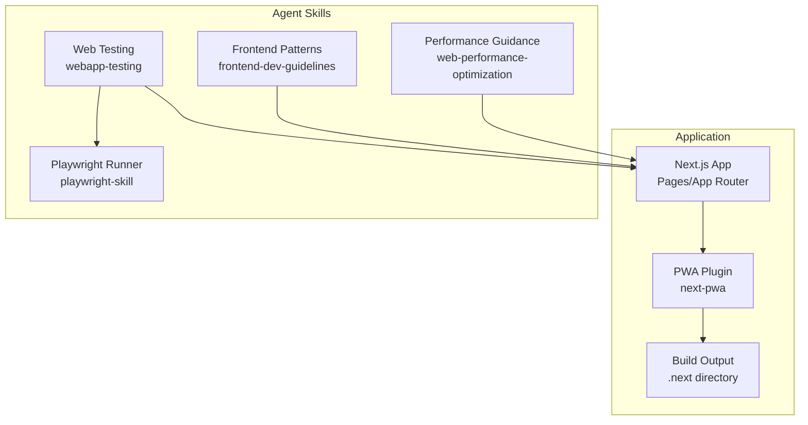
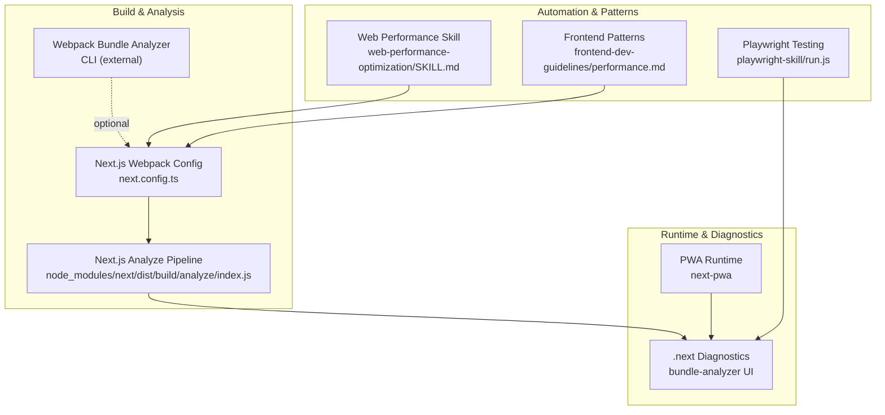
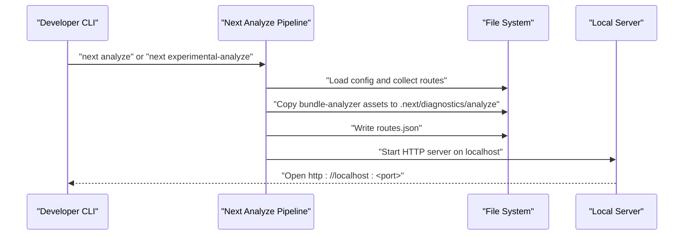
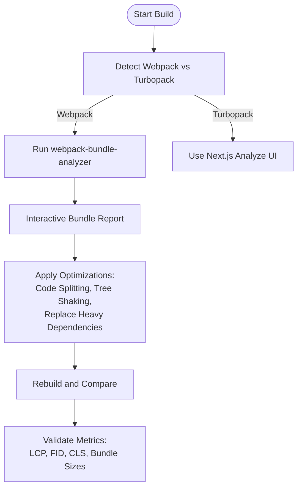
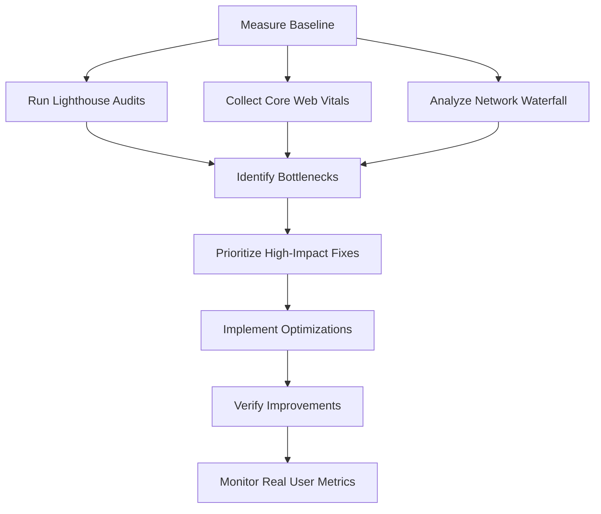
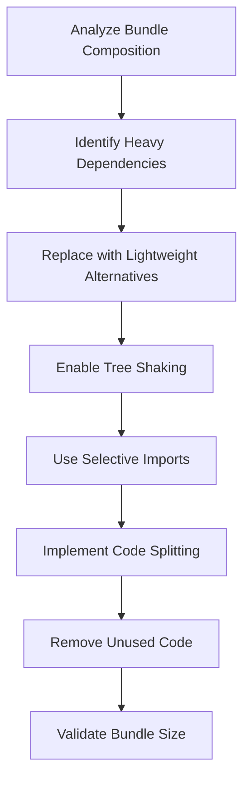
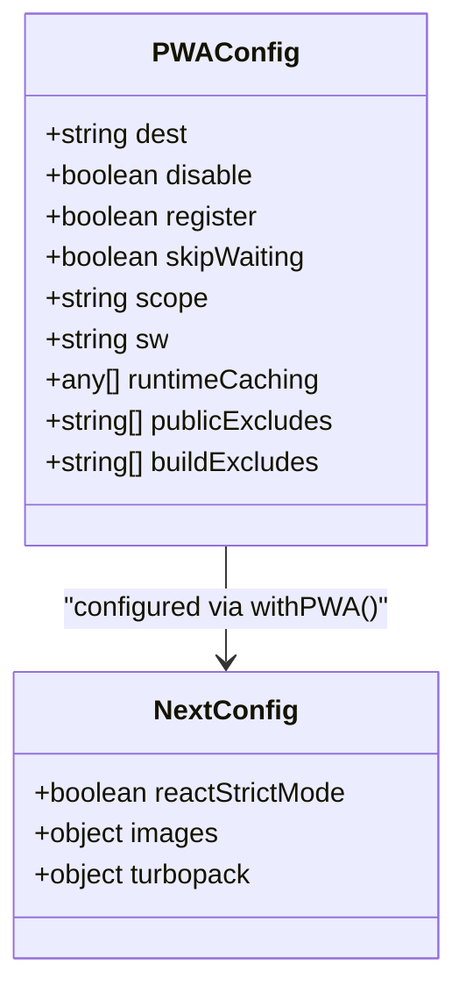
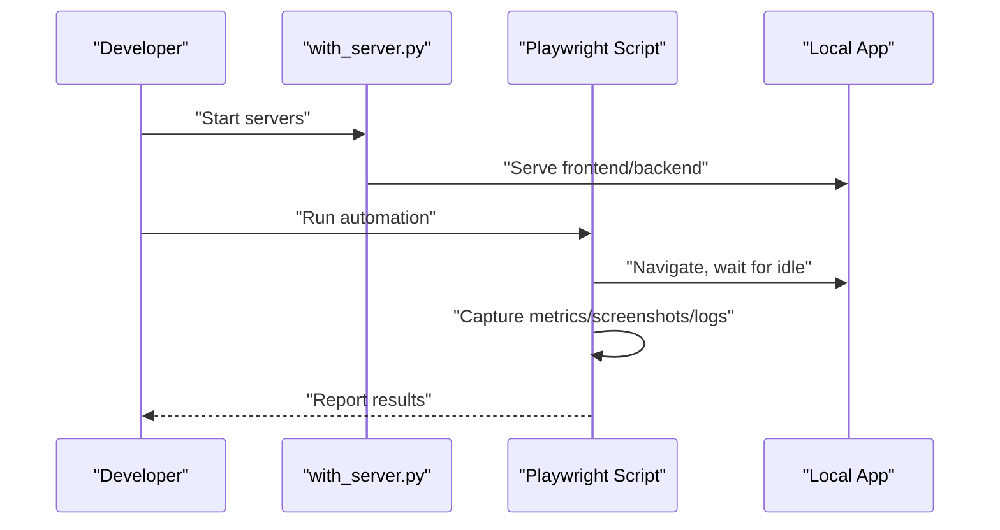
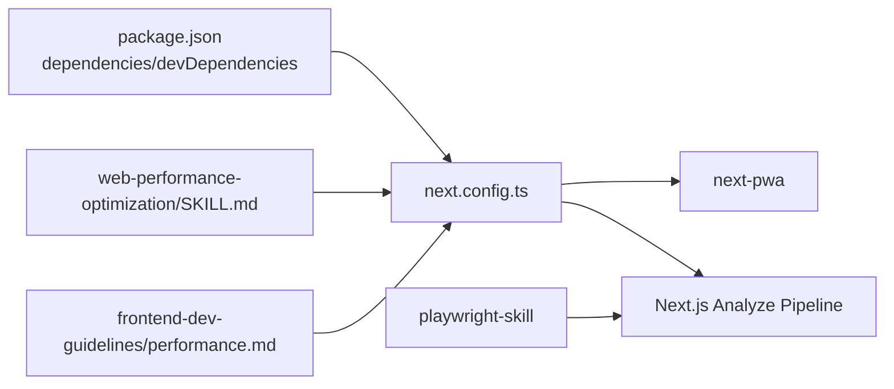

# Bundle Analysis and Profiling

<cite>
**Referenced Files in This Document**
- [package.json](file://package.json)
- [next.config.ts](file://next.config.ts)
- [next-pwa.d.ts](file://next-pwa.d.ts)
- [frontend-dev-guidelines/performance.md](file://.agent/skills/frontend-dev-guidelines/resources/performance.md)
- [web-performance-optimization/SKILL.md](file://.agent/skills/web-performance-optimization/SKILL.md)
- [playwright-skill/package.json](file://.agent/skills/playwright-skill/package.json)
- [playwright-skill/run.js](file://.agent/skills/playwright-skill/run.js)
- [webapp-testing/SKILL.md](file://.agent/skills/webapp-testing/SKILL.md)
- [node_modules/next/dist/build/analyze/index.js](file://node_modules/next/dist/build/analyze/index.js)
</cite>

## Table of Contents
1. [Introduction](#introduction)
2. [Project Structure](#project-structure)
3. [Core Components](#core-components)
4. [Architecture Overview](#architecture-overview)
5. [Detailed Component Analysis](#detailed-component-analysis)
6. [Dependency Analysis](#dependency-analysis)
7. [Performance Considerations](#performance-considerations)
8. [Troubleshooting Guide](#troubleshooting-guide)
9. [Conclusion](#conclusion)

## Introduction
This document explains how Gamasa Properties integrates bundle analysis and performance profiling using Next.js tooling, webpack-based visualization, and practical optimization techniques. It covers:
- Next.js bundle analyzer integration and visualization
- Webpack bundle visualization and dependency size analysis
- Performance profiling tools, Lighthouse integration, and Core Web Vitals monitoring
- Bundle optimization techniques, unused code elimination, and dependency tree analysis
- Examples for identifying bottlenecks, measuring optimization impact, and establishing performance budgets
- Continuous performance monitoring, automated performance testing, and regression prevention strategies

## Project Structure
Gamasa Properties leverages Next.js for the frontend framework and includes a PWA plugin for offline caching. The repository also contains agent skills that provide performance guidance and testing automation capabilities.

**Diagram sources**
- [next.config.ts](file://next.config.ts#L1-L31)
- [next-pwa.d.ts](file://next-pwa.d.ts#L1-L23)
- [web-performance-optimization/SKILL.md](file://.agent/skills/web-performance-optimization/SKILL.md#L1-L647)
- [frontend-dev-guidelines/performance.md](file://.agent/skills/frontend-dev-guidelines/resources/performance.md#L1-L406)
- [webapp-testing/SKILL.md](file://.agent/skills/webapp-testing/SKILL.md#L1-L96)
- [playwright-skill/package.json](file://.agent/skills/playwright-skill/package.json#L1-L27)

**Section sources**
- [package.json](file://package.json#L1-L42)
- [next.config.ts](file://next.config.ts#L1-L31)
- [next-pwa.d.ts](file://next-pwa.d.ts#L1-L23)
- [.agent/skills/web-performance-optimization/SKILL.md](file://.agent/skills/web-performance-optimization/SKILL.md#L1-L647)
- [.agent/skills/frontend-dev-guidelines/resources/performance.md](file://.agent/skills/frontend-dev-guidelines/resources/performance.md#L1-L406)
- [.agent/skills/webapp-testing/SKILL.md](file://.agent/skills/webapp-testing/SKILL.md#L1-L96)
- [.agent/skills/playwright-skill/package.json](file://.agent/skills/playwright-skill/package.json#L1-L27)

## Core Components
- Next.js configuration with PWA integration and explicit Webpack usage for compatibility
- Agent skills providing performance guidance, React optimization patterns, and testing automation
- Build artifacts under .next enabling diagnostics and analyzer tooling

Key capabilities:
- PWA configuration via next-pwa with registration and caching controls
- Next.js analyze pipeline for bundle analysis and interactive visualization
- Performance patterns for memoization, code splitting, and lazy loading
- Automated browser testing with Playwright for UI-driven performance checks

**Section sources**
- [next.config.ts](file://next.config.ts#L1-L31)
- [next-pwa.d.ts](file://next-pwa.d.ts#L1-L23)
- [.agent/skills/web-performance-optimization/SKILL.md](file://.agent/skills/web-performance-optimization/SKILL.md#L1-L647)
- [.agent/skills/frontend-dev-guidelines/resources/performance.md](file://.agent/skills/frontend-dev-guidelines/resources/performance.md#L1-L406)
- [node_modules/next/dist/build/analyze/index.js](file://node_modules/next/dist/build/analyze/index.js#L1-L200)

## Architecture Overview
The performance toolchain combines Next.js built-in analysis, webpack-based visualization, and agent-driven automation.

**Diagram sources**
- [node_modules/next/dist/build/analyze/index.js](file://node_modules/next/dist/build/analyze/index.js#L1-L200)
- [next.config.ts](file://next.config.ts#L1-L31)
- [web-performance-optimization/SKILL.md](file://.agent/skills/web-performance-optimization/SKILL.md#L1-L647)
- [frontend-dev-guidelines/performance.md](file://.agent/skills/frontend-dev-guidelines/resources/performance.md#L1-L406)
- [playwright-skill/run.js](file://.agent/skills/playwright-skill/run.js#L1-L229)

## Detailed Component Analysis

### Next.js Bundle Analyzer Integration
Next.js includes an analyze command that generates a local server hosting an interactive bundle visualization. The analyzer collects routes, copies the bundle-analyzer assets into .next/diagnostics/analyze, and starts a local HTTP server for inspection.

**Diagram sources**
- [node_modules/next/dist/build/analyze/index.js](file://node_modules/next/dist/build/analyze/index.js#L1-L200)

**Section sources**
- [node_modules/next/dist/build/analyze/index.js](file://node_modules/next/dist/build/analyze/index.js#L1-L200)

### Webpack Bundle Visualization and Dependency Size Analysis
While Next.js uses Turbopack by default, the project explicitly opts into Webpack for PWA compatibility. This enables integration with webpack-bundle-analyzer for dependency size analysis and optimization planning.

**Diagram sources**
- [next.config.ts](file://next.config.ts#L12-L28)
- [web-performance-optimization/SKILL.md](file://.agent/skills/web-performance-optimization/SKILL.md#L210-L333)

**Section sources**
- [next.config.ts](file://next.config.ts#L12-L28)
- [.agent/skills/web-performance-optimization/SKILL.md](file://.agent/skills/web-performance-optimization/SKILL.md#L210-L333)

### Performance Profiling Tools and Core Web Vitals Monitoring
The project’s performance skill provides a structured approach to measuring and improving Core Web Vitals (LCP, FID, CLS), using Lighthouse, Chrome DevTools, and real user monitoring.

**Diagram sources**
- [web-performance-optimization/SKILL.md](file://.agent/skills/web-performance-optimization/SKILL.md#L25-L70)

**Section sources**
- [.agent/skills/web-performance-optimization/SKILL.md](file://.agent/skills/web-performance-optimization/SKILL.md#L25-L70)

### Bundle Optimization Techniques and Unused Code Elimination
Techniques include code splitting, selective imports, tree shaking, and replacing heavy dependencies with lighter alternatives. The performance skill documents replacing Moment.js with date-fns and using selective lodash imports.

**Diagram sources**
- [web-performance-optimization/SKILL.md](file://.agent/skills/web-performance-optimization/SKILL.md#L210-L333)

**Section sources**
- [.agent/skills/web-performance-optimization/SKILL.md](file://.agent/skills/web-performance-optimization/SKILL.md#L210-L333)

### Dependency Tree Analysis and PWA Integration
The PWA plugin configuration controls caching and service worker behavior. The PWA type declarations define supported options for caching and build exclusions.

**Diagram sources**
- [next-pwa.d.ts](file://next-pwa.d.ts#L1-L23)
- [next.config.ts](file://next.config.ts#L1-L31)

**Section sources**
- [next-pwa.d.ts](file://next-pwa.d.ts#L1-L23)
- [next.config.ts](file://next.config.ts#L1-L31)

### Automated Performance Testing and Regression Prevention
Automated testing with Playwright supports UI-driven performance checks. The testing skill outlines a reconnaissance-then-action pattern and helper scripts for managing server lifecycles.

**Diagram sources**
- [webapp-testing/SKILL.md](file://.agent/skills/webapp-testing/SKILL.md#L16-L96)
- [playwright-skill/run.js](file://.agent/skills/playwright-skill/run.js#L1-L229)

**Section sources**
- [.agent/skills/webapp-testing/SKILL.md](file://.agent/skills/webapp-testing/SKILL.md#L16-L96)
- [.agent/skills/playwright-skill/run.js](file://.agent/skills/playwright-skill/run.js#L1-L229)

## Dependency Analysis
The project’s performance and testing capabilities depend on Next.js, the PWA plugin, and agent skills. The following diagram highlights key relationships.

**Diagram sources**
- [package.json](file://package.json#L1-L42)
- [next.config.ts](file://next.config.ts#L1-L31)
- [web-performance-optimization/SKILL.md](file://.agent/skills/web-performance-optimization/SKILL.md#L1-L647)
- [frontend-dev-guidelines/performance.md](file://.agent/skills/frontend-dev-guidelines/resources/performance.md#L1-L406)
- [playwright-skill/package.json](file://.agent/skills/playwright-skill/package.json#L1-L27)

**Section sources**
- [package.json](file://package.json#L1-L42)
- [next.config.ts](file://next.config.ts#L1-L31)

## Performance Considerations
- Establish baselines using Lighthouse and Core Web Vitals before optimizing
- Prefer code splitting and lazy loading for non-critical features
- Replace heavy dependencies with smaller alternatives and enable tree shaking
- Use selective imports and native APIs where feasible
- Monitor real user metrics and iterate on optimizations
- Integrate automated testing to prevent regressions

[No sources needed since this section provides general guidance]

## Troubleshooting Guide
Common issues and resolutions:
- Optimized for desktop but slow on mobile: test with throttling and optimize for slower networks
- Large JavaScript bundle: analyze with webpack-bundle-analyzer, remove unused dependencies, implement code splitting
- Images causing layout shifts: specify dimensions, reserve space with skeleton loaders, and use modern formats
- Slow server response time: implement server-side caching, CDN usage, and consider static generation

**Section sources**
- [.agent/skills/web-performance-optimization/SKILL.md](file://.agent/skills/web-performance-optimization/SKILL.md#L510-L566)

## Conclusion
Gamasa Properties integrates Next.js bundle analysis, webpack-based visualization, and agent-driven performance guidance to continuously improve loading speed and Core Web Vitals. By combining automated testing, structured optimization workflows, and real user monitoring, teams can maintain strong performance over time while preventing regressions.

[No sources needed since this section summarizes without analyzing specific files]