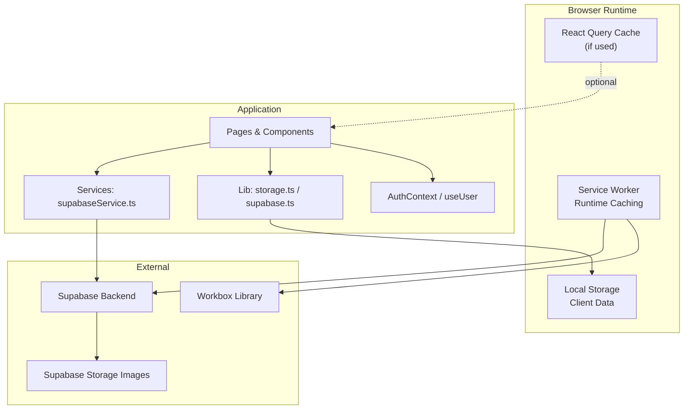
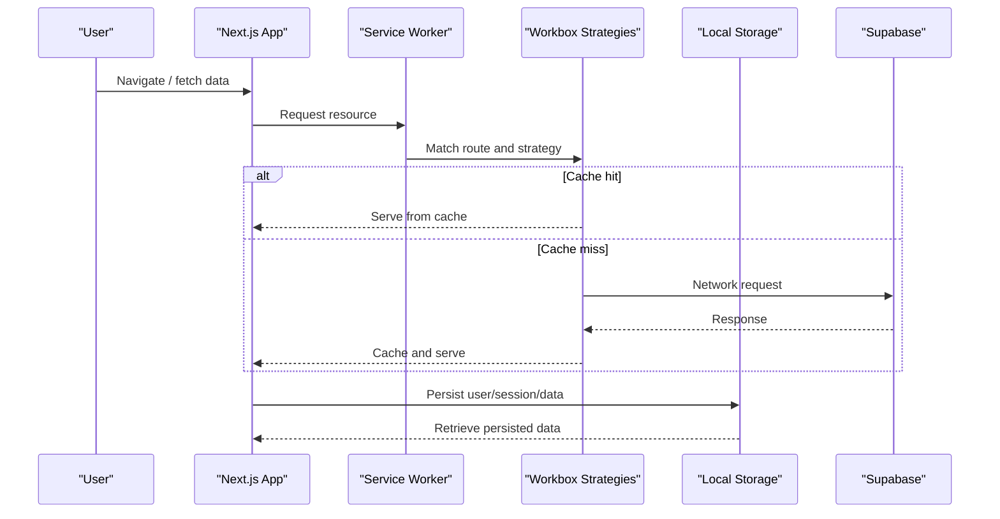
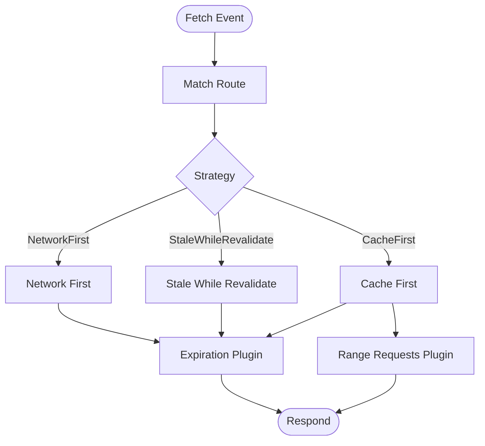
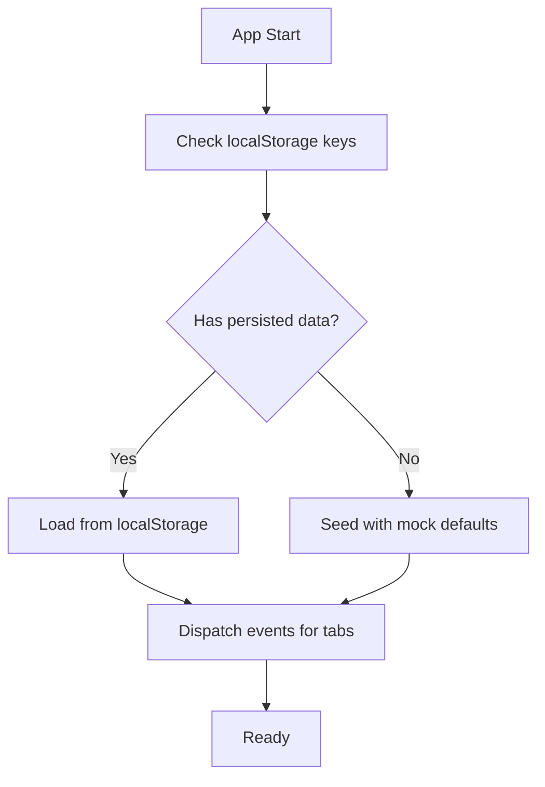
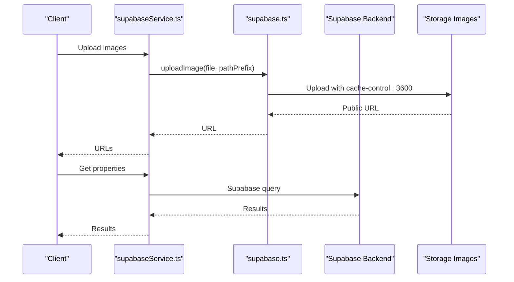
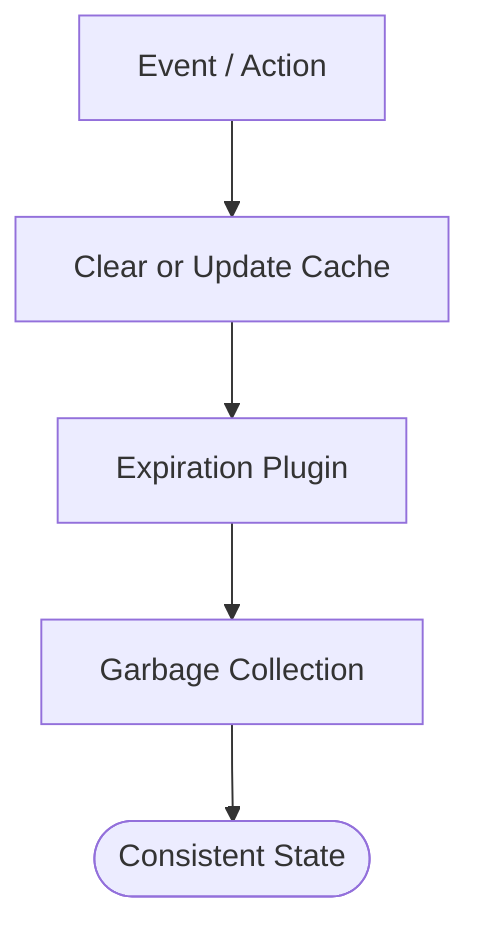
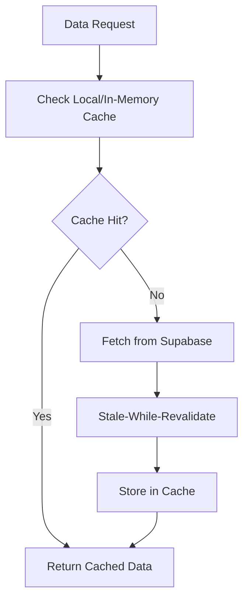
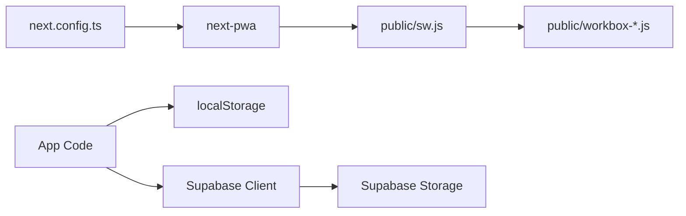

# Caching Strategies

<cite>
**Referenced Files in This Document**
- [sw.js](file://public/sw.js)
- [workbox-4754cb34.js](file://public/workbox-4754cb34.js)
- [manifest.json](file://public/manifest.json)
- [next.config.ts](file://next.config.ts)
- [package.json](file://package.json)
- [storage.ts](file://src/lib/storage.ts)
- [supabase.ts](file://src/lib/supabase.ts)
- [supabaseService.ts](file://src/services/supabaseService.ts)
- [AuthContext.tsx](file://src/context/AuthContext.tsx)
- [useUser.ts](file://src/hooks/useUser.ts)
- [data-fetching.md](file://.agent/skills/frontend-dev-guidelines/resources/data-fetching.md)
- [js-cache-storage.md](file://.agent/skills/react-best-practices/rules/js-cache-storage.md)
- [server-cache-lru.md](file://.agent/skills/react-best-practices/rules/server-cache-lru.md)
</cite>

## Table of Contents
1. [Introduction](#introduction)
2. [Project Structure](#project-structure)
3. [Core Components](#core-components)
4. [Architecture Overview](#architecture-overview)
5. [Detailed Component Analysis](#detailed-component-analysis)
6. [Dependency Analysis](#dependency-analysis)
7. [Performance Considerations](#performance-considerations)
8. [Troubleshooting Guide](#troubleshooting-guide)
9. [Conclusion](#conclusion)

## Introduction
This document explains how caching is implemented and can be optimized in Gamasa Properties. It covers:
- Local storage optimization and session caching
- Data persistence patterns for properties, users, and notifications
- Service worker caching for offline support and PWA caching strategies
- Supabase integration for image caching and API responses
- Browser caching headers and cache invalidation techniques
- Practical examples for property listings, user data, and frequently accessed content
- Guidance for cache debugging, performance monitoring, and balancing freshness vs. performance

## Project Structure
The application leverages:
- Next.js with PWA via next-pwa
- Workbox-based service worker for runtime caching strategies
- Local storage for client-side data persistence and session-like behavior
- Supabase for backend data and image storage with cache-control headers
- React Query patterns (recommended) for efficient client caching

**Diagram sources**
- [sw.js](file://public/sw.js#L1-L2)
- [workbox-4754cb34.js](file://public/workbox-4754cb34.js#L1-L2)
- [storage.ts](file://src/lib/storage.ts#L1-L633)
- [supabase.ts](file://src/lib/supabase.ts#L1-L68)
- [supabaseService.ts](file://src/services/supabaseService.ts#L1-L800)
- [AuthContext.tsx](file://src/context/AuthContext.tsx#L1-L195)
- [useUser.ts](file://src/hooks/useUser.ts#L1-L178)

**Section sources**
- [next.config.ts](file://next.config.ts#L1-L31)
- [package.json](file://package.json#L1-L42)

## Core Components
- Service Worker and Workbox runtime caching define offline and performance behavior for assets and API responses.
- Local storage stores user sessions and app data for offline-friendly experiences.
- Supabase handles backend data and image storage with cache-control headers.
- AuthContext and useUser manage user session state and profile hydration.
- Recommended React Query patterns provide client-side caching and cache-first strategies.

**Section sources**
- [sw.js](file://public/sw.js#L1-L2)
- [workbox-4754cb34.js](file://public/workbox-4754cb34.js#L1-L2)
- [storage.ts](file://src/lib/storage.ts#L1-L633)
- [supabase.ts](file://src/lib/supabase.ts#L1-L68)
- [supabaseService.ts](file://src/services/supabaseService.ts#L1-L800)
- [AuthContext.tsx](file://src/context/AuthContext.tsx#L1-L195)
- [useUser.ts](file://src/hooks/useUser.ts#L1-L178)

## Architecture Overview
The caching architecture combines three layers:
- Browser-level caching via the service worker and Workbox strategies
- Client-side caching via local storage and in-memory caches
- Backend caching via Supabase storage headers and database queries

**Diagram sources**
- [sw.js](file://public/sw.js#L1-L2)
- [workbox-4754cb34.js](file://public/workbox-4754cb34.js#L1-L2)
- [storage.ts](file://src/lib/storage.ts#L1-L633)

## Detailed Component Analysis

### Service Worker and PWA Caching (Workbox)
The service worker precaches static assets and applies runtime caching strategies:
- Precache manifest entries for Next.js static assets
- Cleanup outdated caches on activation
- Network-first for initial page loads
- Stale-while-revalidate for fonts, images, JS/CSS, and data endpoints
- Cache-first for audio/video assets with range requests
- Expiration policies limit cache growth

**Diagram sources**
- [sw.js](file://public/sw.js#L1-L2)
- [workbox-4754cb34.js](file://public/workbox-4754cb34.js#L1-L2)

**Section sources**
- [sw.js](file://public/sw.js#L1-L2)
- [workbox-4754cb34.js](file://public/workbox-4754cb34.js#L1-L2)
- [manifest.json](file://public/manifest.json#L1-L74)
- [next.config.ts](file://next.config.ts#L1-L31)

### Local Storage Optimization and Session Caching
Client-side persistence and session-like behavior:
- Keys for properties, users, current user, payments, reviews, notifications
- Safe SSR checks before accessing localStorage
- Events to synchronize state across tabs
- Mock mode fallback and initialization of default data

**Diagram sources**
- [storage.ts](file://src/lib/storage.ts#L1-L633)

**Section sources**
- [storage.ts](file://src/lib/storage.ts#L1-L633)
- [AuthContext.tsx](file://src/context/AuthContext.tsx#L1-L195)
- [useUser.ts](file://src/hooks/useUser.ts#L1-L178)

### Supabase Integration and API Response Caching
Supabase image uploads include cache-control headers to leverage browser and CDN caching. Services encapsulate CRUD operations and expose cache-friendly patterns.

**Diagram sources**
- [supabase.ts](file://src/lib/supabase.ts#L1-L68)
- [supabaseService.ts](file://src/services/supabaseService.ts#L1-L800)

**Section sources**
- [supabase.ts](file://src/lib/supabase.ts#L1-L68)
- [supabaseService.ts](file://src/services/supabaseService.ts#L1-L800)

### Cache Invalidation Techniques
- Workbox expiration plugin enforces maxEntries and maxAgeSeconds per cache
- Outdated caches cleanup on activation
- Manual cache deletion APIs exposed by Workbox for advanced scenarios
- Local storage invalidation via events and selective clearing

**Diagram sources**
- [workbox-4754cb34.js](file://public/workbox-4754cb34.js#L1-L2)
- [storage.ts](file://src/lib/storage.ts#L1-L633)

**Section sources**
- [workbox-4754cb34.js](file://public/workbox-4754cb34.js#L1-L2)
- [storage.ts](file://src/lib/storage.ts#L1-L633)

### Efficient Caching Patterns for Property Listings, User Data, and Frequently Accessed Content
Recommended patterns align with React Query best practices and the existing codebase:

- Cache-first retrieval: check local storage or in-memory cache before hitting the network
- Stale-while-revalidate for lists and detail pages to minimize latency
- Expiration policies to prevent cache bloat
- Cross-request LRU caching for data shared across sequential user actions

**Diagram sources**
- [data-fetching.md](file://.agent/skills/frontend-dev-guidelines/resources/data-fetching.md#L62-L111)
- [js-cache-storage.md](file://.agent/skills/react-best-practices/rules/js-cache-storage.md#L1-L71)
- [server-cache-lru.md](file://.agent/skills/react-best-practices/rules/server-cache-lru.md#L1-L42)

**Section sources**
- [data-fetching.md](file://.agent/skills/frontend-dev-guidelines/resources/data-fetching.md#L62-L111)
- [js-cache-storage.md](file://.agent/skills/react-best-practices/rules/js-cache-storage.md#L1-L71)
- [server-cache-lru.md](file://.agent/skills/react-best-practices/rules/server-cache-lru.md#L1-L42)

## Dependency Analysis
- next-pwa integrates Workbox into the build and enables PWA features
- Service worker depends on Workbox library and precache manifest
- Local storage is used across components for user and app data
- Supabase client manages auth sessions and storage uploads with cache headers

**Diagram sources**
- [next.config.ts](file://next.config.ts#L1-L31)
- [package.json](file://package.json#L1-L42)
- [sw.js](file://public/sw.js#L1-L2)
- [workbox-4754cb34.js](file://public/workbox-4754cb34.js#L1-L2)
- [storage.ts](file://src/lib/storage.ts#L1-L633)
- [supabase.ts](file://src/lib/supabase.ts#L1-L68)

**Section sources**
- [next.config.ts](file://next.config.ts#L1-L31)
- [package.json](file://package.json#L1-L42)

## Performance Considerations
- Prefer Stale-While-Revalidate for lists and detail pages to reduce perceived latency
- Use Cache-First for media assets with range requests to support progressive loading
- Apply expiration limits to avoid unbounded cache growth
- Minimize localStorage reads by caching values in memory and invalidating on external changes
- Use cross-request LRU caching for data shared across sequential user actions

[No sources needed since this section provides general guidance]

## Troubleshooting Guide
- Service worker lifecycle: ensure skipWaiting and clientsClaim are configured for immediate updates
- Cache debugging: inspect Workbox cache names and expiration plugins; clear caches manually during development
- Local storage synchronization: listen for storage events and userUpdated to keep tabs synchronized
- Supabase image caching: verify cache-control header is applied on uploads and CDN respects it
- Auth session persistence: confirm autoRefreshToken and persistSession are enabled for seamless UX

**Section sources**
- [sw.js](file://public/sw.js#L1-L2)
- [workbox-4754cb34.js](file://public/workbox-4754cb34.js#L1-L2)
- [storage.ts](file://src/lib/storage.ts#L1-L633)
- [supabase.ts](file://src/lib/supabase.ts#L1-L68)
- [AuthContext.tsx](file://src/context/AuthContext.tsx#L1-L195)
- [useUser.ts](file://src/hooks/useUser.ts#L1-L178)

## Conclusion
Gamasa Properties implements a layered caching strategy combining Workbox-based service worker caching, local storage persistence, and Supabase-backed data and images. By adopting recommended client caching patterns and carefully tuning Workbox strategies and expiration policies, the application can achieve fast, reliable experiences while maintaining data freshness and minimizing bandwidth usage.